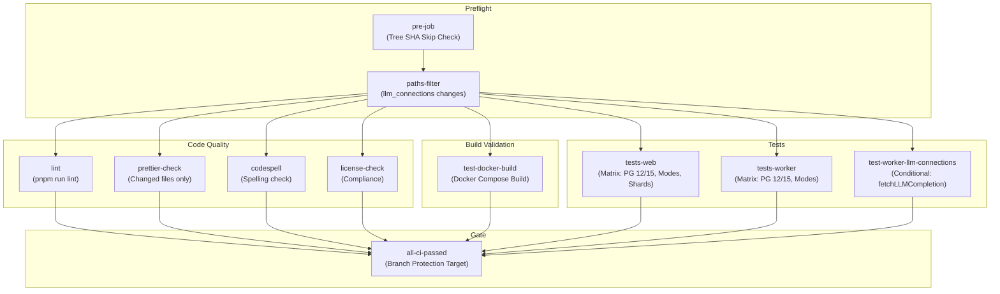
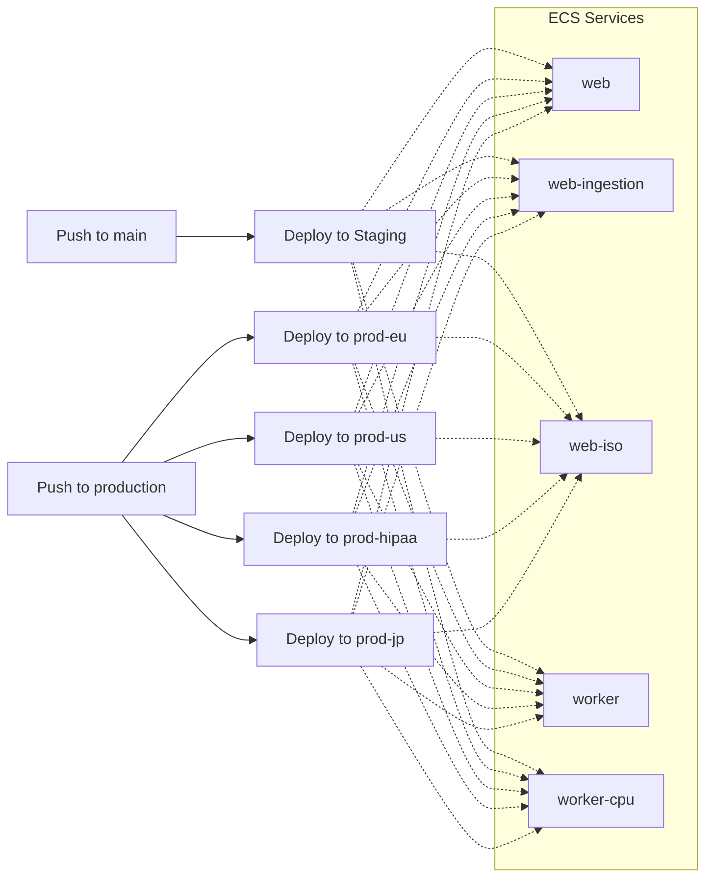
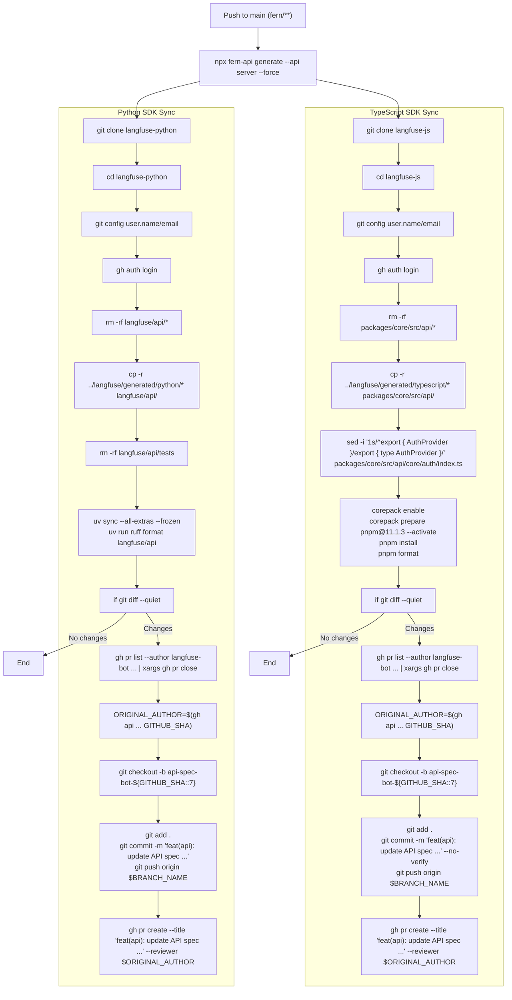

# CI/CD 파이프라인

관련 소스 파일

다음 파일들은 이 위키 페이지를 생성하기 위한 컨텍스트로 사용되었습니다.

- [.github/dependabot.yml](.github/dependabot.yml)
- [.github/workflows/_deploy_ecs_service.yml](.github/workflows/_deploy_ecs_service.yml)
- [.github/workflows/claude-review-maintainer-prs.yml](.github/workflows/claude-review-maintainer-prs.yml)
- [.github/workflows/codeql.yml](.github/workflows/codeql.yml)
- [.github/workflows/codespell.yml](.github/workflows/codespell.yml)
- [.github/workflows/dependabot-rebase-stale.yml](.github/workflows/dependabot-rebase-stale.yml)
- [.github/workflows/deploy.yml](.github/workflows/deploy.yml)
- [.github/workflows/licencecheck.yml](.github/workflows/licencecheck.yml)
- [.github/workflows/pipeline.yml](.github/workflows/pipeline.yml)
- [.github/workflows/promote-main-to-production.yml](.github/workflows/promote-main-to-production.yml)
- [.github/workflows/release.yml](.github/workflows/release.yml)
- [.github/workflows/sdk-api-spec.yml](.github/workflows/sdk-api-spec.yml)
- [.github/workflows/snyk-web.yml](.github/workflows/snyk-web.yml)
- [.github/workflows/snyk-worker.yml](.github/workflows/snyk-worker.yml)

## 목적과 범위

이 문서는 Langfuse monorepo의 continuous integration 및 continuous deployment(CI/CD) pipeline을 설명합니다. Pipeline은 GitHub Actions를 사용해 구현되며 web application, worker service, 관련 SDK의 build, test, release를 orchestrate합니다.

관련 workflow file은 다음과 같습니다.

| File | Purpose |
|------|---------|
| `.github/workflows/pipeline.yml` | Main CI/CD pipeline: lint, test, Docker build validation, image publish [.github/workflows/pipeline.yml:1-15]() |
| `.github/workflows/deploy.yml` | Staging 및 production environment 전반의 AWS ECS deployment를 orchestrate [.github/workflows/deploy.yml:1-38]() |
| `.github/workflows/_deploy_ecs_service.yml` | Docker image를 build하여 ECR에 push하고 ECS task definition을 update하는 reusable workflow [.github/workflows/_deploy_ecs_service.yml:1-22]() |
| `.github/workflows/release.yml` | Semantic version tag push 시 `main` branch를 `production`으로 promote [.github/workflows/release.yml:1-10]() |
| `.github/workflows/sdk-api-spec.yml` | Fern API spec에서 Python 및 TypeScript SDK를 자동 생성 및 update [.github/workflows/sdk-api-spec.yml:1-19]() |
| `.github/workflows/codeql.yml` | Semantic code analysis 및 security scanning [.github/workflows/codeql.yml:12-21]() |
| `.github/workflows/snyk-web.yml` / `snyk-worker.yml` | Web 및 Worker image에 대한 container vulnerability scanning [.github/workflows/snyk-web.yml:1-10](), [.github/workflows/snyk-worker.yml:1-10]() |

출처: [.github/workflows/pipeline.yml:1-15](), [.github/workflows/deploy.yml:1-38](), [.github/workflows/sdk-api-spec.yml:1-19]()

---

## Workflow Trigger와 Concurrency Control

Main CI/CD workflow(`.github/workflows/pipeline.yml`)는 여러 event에서 trigger됩니다.

| Trigger Type | Branches/Conditions | Purpose |
|--------------|---------------------|---------|
| `workflow_dispatch` | Manual | On-demand execution |
| `push` | `main` branch, `v*` tag | Automated deployment 및 release |
| `merge_group` | All | Merge queue를 위한 queue validation |
| `pull_request` | 모든 branch | Pre-merge validation |

**Concurrency Strategy:**
- Workflow run은 `${{ github.workflow }}-${{ github.ref }}` 기준으로 group화됩니다 [.github/workflows/pipeline.yml:19]()
- Pull request run은 이전 run을 자동으로 cancel합니다(`cancel-in-progress: true`) [.github/workflows/pipeline.yml:20]()
- Non-PR run(예: main branch)은 deployment completion을 보장하기 위해 이전 run을 cancel하지 않습니다.

**Tree SHA Skip Check:**
`pre-job`에는 현재 Git tree SHA가 `pipeline.yml`의 이전 run에서 이미 성공적으로 test되었는지 확인하는 custom optimization이 포함됩니다. 이 optimization은 `gh api`를 사용해 current commit의 tree SHA를 가져오고, recent successful run과 비교합니다 [.github/workflows/pipeline.yml:64-68](). Match가 발견되면 workflow는 compute resource를 절약하기 위해 `should_skip=true`를 설정합니다 [.github/workflows/pipeline.yml:71-72]().

출처: [.github/workflows/pipeline.yml:3-20](), [.github/workflows/pipeline.yml:51-75]()

---

## Pipeline Job Orchestration

Main pipeline은 `.github/workflows/pipeline.yml`에 정의되어 있으며, code quality를 validate하고, artifact를 build하며, environment matrix 전반에서 test suite를 실행하는 여러 job으로 구성됩니다.

### Pipeline Job Dependency Graph

**Paths Filter Logic:**
`filter` step은 `packages/shared/src/server/llm/fetchLLMCompletion.ts` 같은 특정 file의 change를 detect하여 conditional LLM connection test를 trigger하기 위해 `dorny/paths-filter`를 사용합니다 [.github/workflows/pipeline.yml:83-89]().

출처: [.github/workflows/pipeline.yml:38-95](), [.github/workflows/codespell.yml:19-21]()

---

## Deployment Architecture

Langfuse는 AWS ECS를 통한 internal cloud deployment와 Docker Hub/GHCR을 통한 open-source release라는 dual-track deployment strategy를 사용합니다.

### Cloud Deployment Flow (AWS ECS)

Deployment는 GitHub branch를 specific AWS environment에 mapping하는 `deploy.yml`이 관리합니다. 이 workflow는 reusable `_deploy_ecs_service.yml`에 대한 `workflow_call`을 사용합니다 [.github/workflows/deploy.yml:101-102]().

**Service Matrix:**
Deployment matrix는 web 및 worker service의 specialized instance를 포함합니다 [.github/workflows/deploy.yml:112-115]().
- `web`: Standard application server.
- `web-ingestion`: High-throughput API ingestion에 최적화.
- `web-iso`: 특정 compliance requirement를 위한 isolated environment.
- `worker`: Standard background job processor.
- `worker-cpu`: Intensive evaluation task를 위한 CPU-optimized worker.

출처: [.github/workflows/deploy.yml:8-28](), [.github/workflows/deploy.yml:112-118]()

---

## SDK 및 API Specification Pipeline

`sdk-api-spec.yml` workflow는 client SDK가 server의 API definition과 synchronized 상태를 유지하도록 보장합니다. 이 workflow는 `fern/` directory 변경 시 trigger됩니다 [.github/workflows/sdk-api-spec.yml:7-8]().

### Automated SDK Generation Flow

**Key Code Entities:**
- `fern-api`: OpenAPI/Fern definition에서 SDK를 generate하는 데 사용되는 tool [.github/workflows/sdk-api-spec.yml:47]().
- `uv`: `langfuse-python` repository에서 Python dependency management와 formatting에 사용됩니다 [.github/workflows/sdk-api-spec.yml:49-79]().
- `corepack`: `langfuse-js`에서 TypeScript SDK formatting 및 installation을 위해 `pnpm`을 enable합니다 [.github/workflows/sdk-api-spec.yml:135-138]().
- `ruff`: Generated SDK의 code quality를 보장하기 위해 사용되는 Python formatter [.github/workflows/sdk-api-spec.yml:79]().
- `fetchLLMCompletion.ts`: SDK update와 LLM connection test를 trigger하기 위해 change가 monitored되는 core function [.github/workflows/pipeline.yml:89]().

출처: [.github/workflows/sdk-api-spec.yml:44-47](), [.github/workflows/sdk-api-spec.yml:54-103](), [.github/workflows/sdk-api-spec.yml:109-162]()

---

## Security and Compliance

### Vulnerability Scanning
- **Snyk Container Scanning**: `main`과 `production`에 대한 모든 push에서 실행됩니다. OS-level 및 dependency vulnerability를 찾기 위해 `web/Dockerfile`과 `worker/Dockerfile`을 test합니다 [.github/workflows/snyk-web.yml:32-34](), [.github/workflows/snyk-worker.yml:32-34](). 결과는 SARIF format으로 GitHub Code Scanning에 upload됩니다 [.github/workflows/snyk-web.yml:50-54](), [.github/workflows/snyk-worker.yml:50-54]().
- **CodeQL**: 일반적인 coding vulnerability를 식별하기 위해 `javascript-typescript`에 대한 static analysis를 수행합니다. 매주 일요일에 실행되도록 scheduled되어 있습니다 [.github/workflows/codeql.yml:19-20](), [.github/workflows/codeql.yml:46-47]().
- **Codespell**: 모든 push와 pull request에서 codebase의 spelling error를 확인합니다 [.github/workflows/codespell.yml:19-30]().
- **License Compliance Check**: `licencecheck.yml` workflow는 `license-checker`를 사용해 production dependency의 CSV를 생성하고, `pilosus/action-pip-license-checker`를 사용해 disallowed license(예: `WeakCopyleft`, `StrongCopyleft`, `NetworkCopyleft`)를 확인합니다 [.github/workflows/licencecheck.yml:36-47]().

### Dependabot Configuration
Dependabot은 `npm` dependency의 daily update와 `github-actions`의 weekly update를 수행하도록 구성되어 있습니다 [.github/dependabot.yml:12-13](), [.github/dependabot.yml:55-56]().

**Dependency Groups:**
PR noise를 줄이기 위해 dependency가 group화됩니다 [.github/dependabot.yml:24-66]().
- `prisma`: `prisma`와 `@prisma/client`를 포함합니다.
- `next`: `eslint-config-next`와 `next`를 포함합니다.
- `observability`: `dd-trace`, `@opentelemetry/*`, `@sentry/*`를 포함합니다.
- `express`: `express`와 해당 type을 포함합니다.
- `radix-ui`: `@radix-ui/*` component를 포함합니다.

**Auto-Rebase:**
`dependabot-rebase-stale.yml` workflow는 merge conflict를 방지하기 위해 `main`이 update될 때 open Dependabot PR을 자동으로 rebase합니다 [.github/workflows/dependabot-rebase-stale.yml:1-21]().

출처: [.github/workflows/snyk-web.yml:1-10](), [.github/workflows/codeql.yml:12-21](), [.github/dependabot.yml:24-52](), [.github/workflows/dependabot-rebase-stale.yml:1-21](), [.github/workflows/licencecheck.yml:36-47]()

---

## Docker Build Process

### Multi-Stage Builds
Project는 image size와 security surface area를 최소화하기 위해 multi-stage Dockerfile을 사용합니다.

**Web Build Strategy (`_deploy_ecs_service.yml`):**
1. **Build Arguments**: `NEXT_PUBLIC_LANGFUSE_CLOUD_REGION`, `NEXT_PUBLIC_BUILD_ID`(`github.sha`로 설정), `SENTRY_AUTH_TOKEN` 같은 environment-specific variable을 inject합니다 [.github/workflows/_deploy_ecs_service.yml:70-87]().
2. **Registry**: Image는 `aws-actions/amazon-ecr-login`의 registry output을 사용해 AWS ECR(Elastic Container Registry)에 push됩니다 [.github/workflows/_deploy_ecs_service.yml:49-52](), [.github/workflows/_deploy_ecs_service.yml:88]().
3. **Task Definition**: Workflow는 `aws-actions/amazon-ecs-render-task-definition`을 사용해 새 ECS task definition을 render하고 service를 update합니다 [.github/workflows/_deploy_ecs_service.yml:89-102]().

**Test Build Validation:**
`test-docker-build` job(`pipeline.yml` logic에서 참조됨)은 image가 release 대상으로 간주되기 전에 functional한지 validate합니다. 일반적으로 `/api/health`에 대한 `curl`을 통한 health check가 포함됩니다.

출처: [.github/workflows/_deploy_ecs_service.yml:70-102](), [.github/workflows/pipeline.yml:1-15]()
