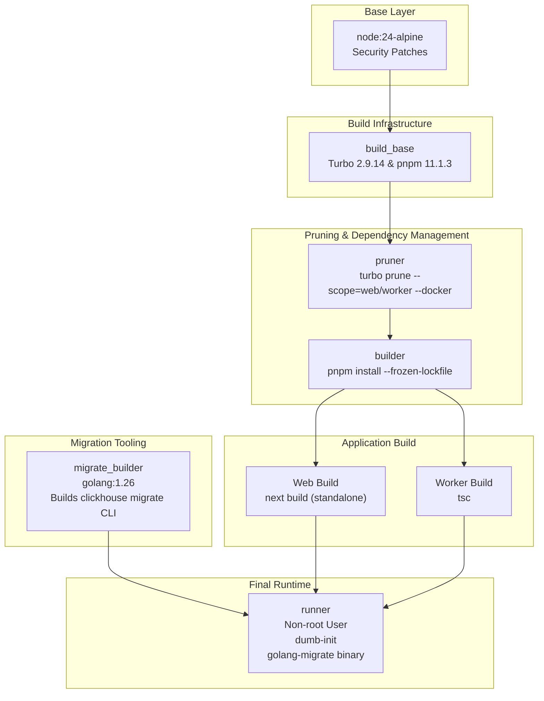
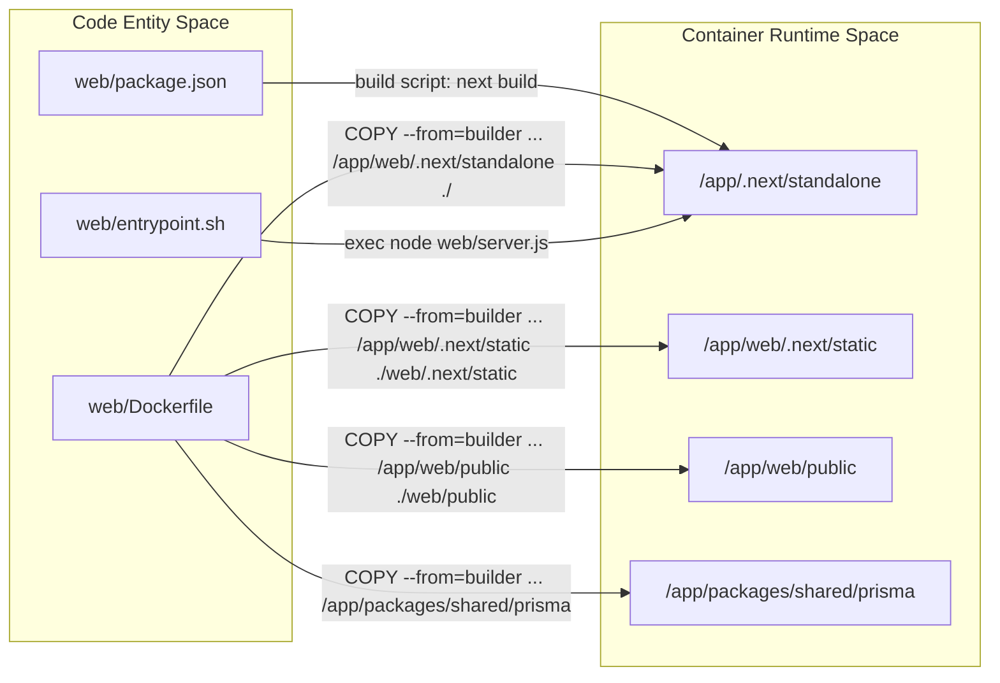
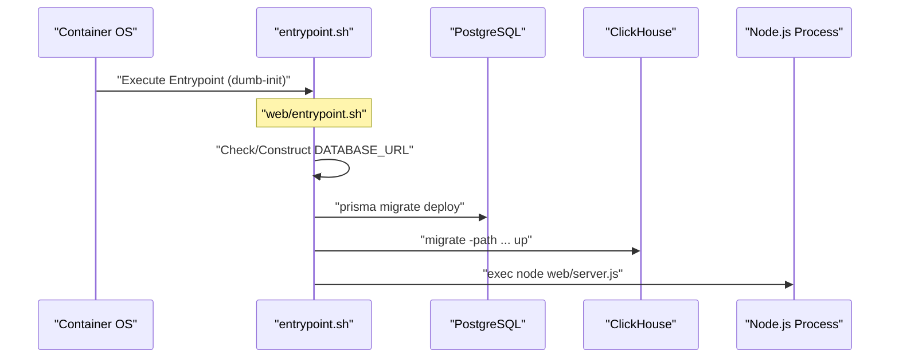

# Docker 및 Deployment

관련 소스 파일

다음 파일들은 이 위키 페이지를 생성하기 위한 컨텍스트로 사용되었습니다.

- [.dockerignore](.dockerignore)
- [docker-compose.build.yml](docker-compose.build.yml)
- [docker-compose.dev-azure.yml](docker-compose.dev-azure.yml)
- [docker-compose.dev-redis-cluster.yml](docker-compose.dev-redis-cluster.yml)
- [docker-compose.dev.yml](docker-compose.dev.yml)
- [docker-compose.yml](docker-compose.yml)
- [ee/package.json](ee/package.json)
- [package.json](package.json)
- [packages/config-eslint/package.json](packages/config-eslint/package.json)
- [packages/shared/clickhouse/scripts/down.sh](packages/shared/clickhouse/scripts/down.sh)
- [packages/shared/clickhouse/scripts/drop.sh](packages/shared/clickhouse/scripts/drop.sh)
- [packages/shared/clickhouse/scripts/up.sh](packages/shared/clickhouse/scripts/up.sh)
- [packages/shared/package.json](packages/shared/package.json)
- [packages/shared/src/constants/VERSION.ts](packages/shared/src/constants/VERSION.ts)
- [pnpm-lock.yaml](pnpm-lock.yaml)
- [pnpm-workspace.yaml](pnpm-workspace.yaml)
- [web/Dockerfile](web/Dockerfile)
- [web/entrypoint.sh](web/entrypoint.sh)
- [web/package.json](web/package.json)
- [web/src/constants/VERSION.ts](web/src/constants/VERSION.ts)
- [worker/Dockerfile](worker/Dockerfile)
- [worker/entrypoint.sh](worker/entrypoint.sh)
- [worker/package.json](worker/package.json)
- [worker/src/constants/VERSION.ts](worker/src/constants/VERSION.ts)
- [worker/src/index.ts](worker/src/index.ts)

이 문서는 Langfuse의 web 및 worker service를 위한 containerization과 deployment architecture를 설명합니다. 여기에는 multi-stage Docker build, build optimization strategy, multi-architecture support(AMD64/ARM64), container orchestration이 포함됩니다.

## 개요

Langfuse는 platform의 backbone을 구성하는 두 core service에 대해 production-ready Docker image를 제공합니다.
- **Web Service**: UI, public Ingestion API, internal tRPC API를 제공하는 Next.js application(port 3000) [docker-compose.yml:71-76]().
- **Worker Service**: BullMQ를 통한 asynchronous background job processing을 처리하는 Express-based application(port 3030) [docker-compose.yml:7-20]().

두 service 모두 image size를 최소화하고 security를 극대화하기 위해 multi-stage build를 활용하며, non-root user(web은 `nextjs`, worker는 `expressjs`)로 실행됩니다 [web/Dockerfile:137-169](), [worker/Dockerfile:86-91]().

출처: [docker-compose.yml:7-87](), [web/Dockerfile:1-176](), [worker/Dockerfile:1-101]()

## Docker Build Architecture

### Multi-Stage Build Pipeline

Langfuse는 `pnpm` 및 `turbo` 같은 build tool이 final runtime image에 포함되지 않도록 sophisticated multi-stage pipeline을 사용합니다. Build process는 `turbo prune`을 활용해 각 service에 대한 monorepo subset을 생성합니다.

**Build Pipeline Visualization**

**Build Stages Description**

1.  **pruner**: `turbo prune --scope=<service> --docker`를 실행합니다. 이 command는 특정 service(web 또는 worker)와 `@langfuse/shared` 같은 내부 workspace dependency에 필요한 code와 `package.json` file만 추출합니다 [web/Dockerfile:37-42](), [worker/Dockerfile:22-27]().
2.  **builder**: `pnpm install --frozen-lockfile`을 수행합니다. 또한 `NEXT_PUBLIC_POSTHOG_KEY`처럼 Next.js frontend bundle에 필요한 build-time argument(`ARG`)를 environment variable(`ENV`)에 bake합니다 [web/Dockerfile:44-79]().
3.  **migrate-builder**: `golang:1.26`을 사용하는 Go-based stage로, prebuilt binary와 관련된 CVE를 피하기 위해 ClickHouse support가 포함된 `migrate` CLI를 compile합니다 [web/Dockerfile:23-35]().
4.  **runner**: Final production image입니다. Web의 standalone output 또는 Worker의 compiled `dist` folder만 copy하고, `prisma` 같은 runtime-only tool을 install한 뒤 non-root user로 전환합니다 [web/Dockerfile:112-170](), [worker/Dockerfile:68-92]().

출처: [web/Dockerfile:1-176](), [worker/Dockerfile:1-101](), [package.json:100](), [web/Dockerfile:10](), [worker/Dockerfile:10](), [package.json:51]()

### Web Service Optimization

Web service는 Next.js "standalone" mode를 활용하여 build의 dependency tracing 중 감지된 file만 포함함으로써 image size를 크게 줄입니다 [web/Dockerfile:157-159]().

**Code to Container Mapping**

Deployment flow의 주요 optimization은 다음과 같습니다.
- **Dependency Pruning**: Worker Dockerfile은 production dependency를 isolate하기 위해 specific `pnpm deploy --legacy --prod` step을 사용하고, builder stage에서 generated Prisma client artifact를 수동으로 sync합니다 [worker/Dockerfile:52-66]().
- **Multi-Arch Support**: 두 Dockerfile 모두 ARM64 같은 여러 architecture build를 지원하기 위해 `--platform=${TARGETPLATFORM:-linux/amd64}`를 사용합니다 [web/Dockerfile:2](), [worker/Dockerfile:2]().

출처: [web/Dockerfile:112-166](), [worker/Dockerfile:52-68](), [web/package.json:10]()

## Container Orchestration 및 Configuration

### Docker Compose
Self-hosting을 위한 primary orchestration method는 Docker Compose입니다. Standard stack에는 다음이 포함됩니다.
- `langfuse-web`: Main application(Next.js) [docker-compose.yml:71]().
- `langfuse-worker`: Background processor(Express/BullMQ) [docker-compose.yml:7]().
- `postgres`: Metadata storage [docker-compose.yml:147]().
- `clickhouse`: Observability data storage [docker-compose.yml:90]().
- `redis`: Queue backend(BullMQ) 및 caching [docker-compose.yml:132]().
- `minio`: Event body와 export를 위한 S3-compatible blob storage [docker-compose.yml:111]().

출처: [docker-compose.yml:6-160]()

### Environment Variable Management
Variable은 build-time(static)과 runtime(dynamic)으로 나뉩니다.

| Category | Key Variables | Purpose |
| :--- | :--- | :--- |
| **Database** | `DATABASE_URL`, `CLICKHOUSE_URL` | Postgres 및 ClickHouse 연결 [docker-compose.yml:23-29]() |
| **Security** | `NEXTAUTH_SECRET`, `SALT`, `ENCRYPTION_KEY` | JWT signing, password hashing, data encryption [docker-compose.yml:24-25](), [docker-compose.yml:79]() |
| **Storage** | `LANGFUSE_S3_EVENT_UPLOAD_BUCKET` | Ingestion event용 S3/Minio bucket [docker-compose.yml:36]() |
| **Cloud Metering** | `NEXT_PUBLIC_LANGFUSE_CLOUD_REGION` | Cloud-specific feature 및 Datadog tracing 활성화 [web/Dockerfile:142-146]() |

출처: [docker-compose.yml:21-88](), [web/Dockerfile:59-93]()

## Deployment Initialization Flow

Langfuse container가 시작될 때, entrypoint script에 정의된 특정 sequence를 따라 environment가 준비되었는지 보장합니다.

**Key Implementation Details:**
- **PostgreSQL Migrations**: Schema가 최신 상태인지 보장하기 위해 web container lifecycle 중 `prisma migrate deploy`를 통해 실행됩니다 [web/Dockerfile:177]().
- **ClickHouse Migrations**: `migrate-builder` stage에서 compile되어 runner로 copy되는 `migrate` CLI를 통해 관리됩니다 [web/Dockerfile:152]().
- **Signal Handling**: Container는 signal을 올바르게 처리하기 위해 `dumb-init`을 사용하고, Next.js가 graceful shutdown을 처리할 수 있도록 `NEXT_MANUAL_SIG_HANDLE=true`를 사용합니다 [web/Dockerfile:177](), [web/package.json:19]().
- **Cleanup**: Database maintenance task를 위한 `cleanup.sql` script가 제공됩니다 [packages/shared/package.json:10](), [web/Dockerfile:167]().

출처: [web/Dockerfile:152-177](), [worker/Dockerfile:97-102](), [web/package.json:19](), [packages/shared/package.json:10-11]()
