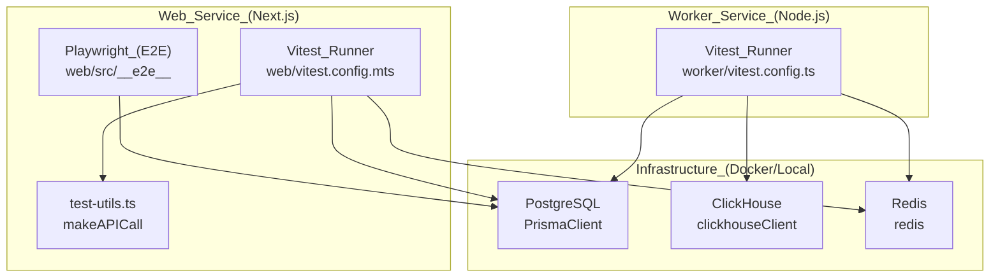
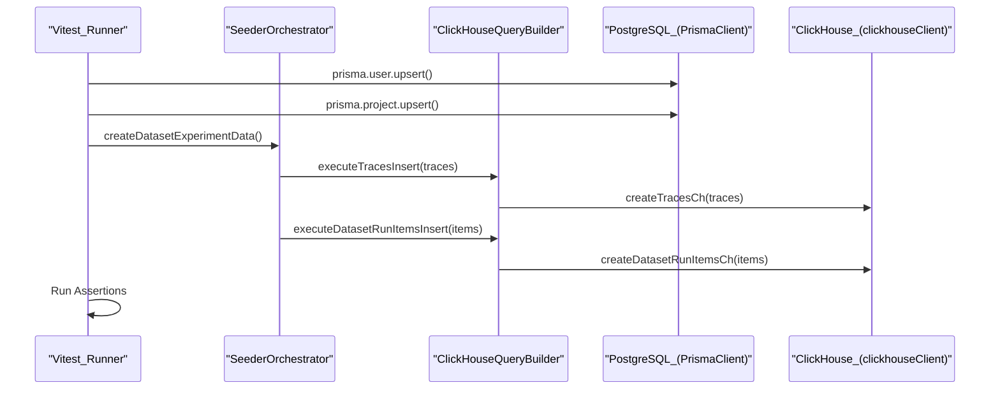

# 테스트 전략

관련 소스 파일

다음 파일들은 이 위키 페이지를 생성하기 위한 컨텍스트로 사용되었습니다.

- [.devcontainer/Dockerfile](.devcontainer/Dockerfile)
- [.env.test.example](.env.test.example)
- [.github/workflows/ci.yml.template](.github/workflows/ci.yml.template)
- [CONTRIBUTING.md](CONTRIBUTING.md)
- [packages/shared/scripts/seeder/load-seed-clickhouse.ts](packages/shared/scripts/seeder/load-seed-clickhouse.ts)
- [packages/shared/scripts/seeder/prepare-clickhouse.ts](packages/shared/scripts/seeder/prepare-clickhouse.ts)
- [packages/shared/scripts/seeder/seed-clickhouse.ts](packages/shared/scripts/seeder/seed-clickhouse.ts)
- [packages/shared/scripts/seeder/seed-dataset-versions.ts](packages/shared/scripts/seeder/seed-dataset-versions.ts)
- [packages/shared/scripts/seeder/seed-postgres.ts](packages/shared/scripts/seeder/seed-postgres.ts)
- [packages/shared/scripts/seeder/utils/README.md](packages/shared/scripts/seeder/utils/README.md)
- [packages/shared/scripts/seeder/utils/clickhouse-builder.ts](packages/shared/scripts/seeder/utils/clickhouse-builder.ts)
- [packages/shared/scripts/seeder/utils/data-generators.ts](packages/shared/scripts/seeder/utils/data-generators.ts)
- [packages/shared/scripts/seeder/utils/postgres-seed-constants.ts](packages/shared/scripts/seeder/utils/postgres-seed-constants.ts)
- [packages/shared/scripts/seeder/utils/seed-helpers.ts](packages/shared/scripts/seeder/utils/seed-helpers.ts)
- [packages/shared/scripts/seeder/utils/seeder-orchestrator.ts](packages/shared/scripts/seeder/utils/seeder-orchestrator.ts)
- [packages/shared/scripts/seeder/utils/types.ts](packages/shared/scripts/seeder/utils/types.ts)
- [packages/shared/src/features/analytics-integrations/blob-export-gate.ts](packages/shared/src/features/analytics-integrations/blob-export-gate.ts)
- [packages/shared/src/server/auth/apiKeys.ts](packages/shared/src/server/auth/apiKeys.ts)
- [scripts/codex/maintenance.sh](scripts/codex/maintenance.sh)
- [scripts/codex/setup.sh](scripts/codex/setup.sh)
- [turbo.json](turbo.json)
- [web/src/__tests__/after-teardown.ts](web/src/__tests__/after-teardown.ts)
- [web/src/__tests__/server/api-auth.servertest.ts](web/src/__tests__/server/api-auth.servertest.ts)
- [web/src/__tests__/server/ingestion-api.servertest.ts](web/src/__tests__/server/ingestion-api.servertest.ts)
- [web/src/__tests__/server/otel-api.servertest.ts](web/src/__tests__/server/otel-api.servertest.ts)
- [web/src/__tests__/server/prompts.v2.servertest.ts](web/src/__tests__/server/prompts.v2.servertest.ts)
- [web/src/__tests__/server/rate-limit.servertest.ts](web/src/__tests__/server/rate-limit.servertest.ts)
- [web/src/__tests__/server/traces-api.servertest.ts](web/src/__tests__/server/traces-api.servertest.ts)
- [web/src/__tests__/server/unit/assertLegacyBlobExportSourceAllowed.servertest.ts](web/src/__tests__/server/unit/assertLegacyBlobExportSourceAllowed.servertest.ts)
- [web/src/__tests__/test-utils.ts](web/src/__tests__/test-utils.ts)
- [web/src/__tests__/vitest-test-db-setup.ts](web/src/__tests__/vitest-test-db-setup.ts)
- [web/src/features/datasets/components/DatasetIOCells.tsx](web/src/features/datasets/components/DatasetIOCells.tsx)
- [web/src/features/datasets/components/DatasetRunItemsByItemTable.tsx](web/src/features/datasets/components/DatasetRunItemsByItemTable.tsx)
- [web/src/features/datasets/components/DatasetRunItemsByRunTable.tsx](web/src/features/datasets/components/DatasetRunItemsByRunTable.tsx)
- [web/src/features/datasets/components/NotFoundCard.tsx](web/src/features/datasets/components/NotFoundCard.tsx)
- [web/src/features/datasets/lib/convertRunItemDataToUiTableRow.ts](web/src/features/datasets/lib/convertRunItemDataToUiTableRow.ts)
- [web/src/features/datasets/lib/types.ts](web/src/features/datasets/lib/types.ts)
- [web/src/features/organizations/components/AIFeatureSwitch.tsx](web/src/features/organizations/components/AIFeatureSwitch.tsx)
- [web/src/features/public-api/server/projectApiKeyRouter.ts](web/src/features/public-api/server/projectApiKeyRouter.ts)
- [web/vitest.config.mts](web/vitest.config.mts)
- [worker/vitest.config.ts](worker/vitest.config.ts)

이 문서는 Langfuse codebase에서 사용되는 comprehensive testing approach를 설명합니다. 여기에는 test type, framework, execution pattern, test utility가 포함됩니다. 이 strategy는 `web`, `worker`, `packages/shared` workspace 전반의 여러 verification layer를 통해 code quality를 보장합니다.

---

## 테스트 철학과 범위

Langfuse testing strategy는 system의 서로 다른 측면을 target하는 distinct test type을 갖춘 multi-layered approach를 사용합니다.

- **Unit tests**는 evaluation template variable extraction 및 string compilation 같은 isolated business logic과 utility를 검증합니다.
- **Integration tests**는 PostgreSQL, ClickHouse, Redis, S3를 포함한 component 간 interaction을 validate합니다. 이는 외부 API를 mocking하면서도 실제 database connection을 유지하는 경우가 많습니다 [web/src/vitest.config.mts:61-72]().
- **End-to-end (E2E) tests**는 Playwright를 사용해 browser environment에서 complete user workflow가 올바르게 작동하는지 보장합니다 [web/src/scripts/codex/setup.sh:29-31]().
- **LLM Connection tests**는 playground와 evaluation service를 통해 다양한 model provider에 대한 live connectivity 및 structured output parsing을 검증합니다.
- **Test Utilities**는 database setup, queue management, API mocking을 위한 standardized method를 제공합니다 [web/src/__tests__/test-utils.ts:1-16]().

**출처:** [web/vitest.config.mts:1-96](), [web/src/__tests__/test-utils.ts:1-16](), [scripts/codex/setup.sh:29-31]()

---

## 테스트 프레임워크 개요

Langfuse monorepo는 test lifecycle을 관리하기 위해 `pnpm`과 `Turbo`를 사용합니다. CI environment는 Node.js version 24를 사용합니다 [scripts/codex/setup.sh:16-19]().

### Test Architecture and Entity Mapping

아래 diagram은 서로 다른 test runner가 system infrastructure 및 code entity와 어떻게 interaction하는지 보여줍니다.

**출처:** [web/vitest.config.mts:1-96](), [worker/vitest.config.ts:1-10](), [web/src/__tests__/test-utils.ts:122-128](), [packages/shared/scripts/seeder/seed-postgres.ts:40-41](), [packages/shared/scripts/seeder/utils/seeder-orchestrator.ts:12-19]()

---

## 테스트 유형과 구성

### Unit 및 Integration Tests

Langfuse는 unit 및 integration test의 primary test runner로 **Vitest**를 사용합니다. Configuration은 server test용 `node`, client-side component test용 `jsdom` 같은 서로 다른 environment를 처리하기 위해 project로 분리되어 있습니다 [web/vitest.config.mts:32-94]().

**Public API Integration Tests:**
Server-side test는 `makeAPICall`과 `makeZodVerifiedAPICall`을 사용해 REST API endpoint를 검증합니다 [web/src/__tests__/test-utils.ts:122-187]().
- **Prompt Management:** `prompts.v2.servertest.ts`는 public API를 통한 prompt creation, versioning, retrieval을 validate합니다.
- **Rate Limiting:** `rate-limit.servertest.ts`는 Redis-backed rate limiting이 limit 초과 시 request를 올바르게 block하는지 보장합니다.
- **OTel Ingestion:** `otel-api.servertest.ts`는 OpenTelemetry span을 Langfuse event로 mapping하는 과정을 validate합니다.
- **Authentication:** `api-auth.servertest.ts`는 API key가 올바르게 validate되고 organization 또는 project로 scope되는지 보장합니다.

**출처:** [web/vitest.config.mts:32-94](), [web/src/__tests__/test-utils.ts:122-187]()

### End-to-End Tests (Playwright)

E2E test는 frontend application과 backend service와의 integration을 검증합니다. Development environment에는 browser binary를 사용할 수 있도록 보장하는 `playwright:install` step이 포함됩니다 [scripts/codex/setup.sh:29-31]().

**출처:** [scripts/codex/setup.sh:29-31]()

---

## ClickHouse Seeder와 Helper

Complex integration test와 local development를 위해 Langfuse는 PostgreSQL과 ClickHouse 모두에 realistic data를 populate하는 specialized `SeederOrchestrator`를 사용합니다 [packages/shared/scripts/seeder/utils/seeder-orchestrator.ts:39-48]().

- **`DataGenerator`**: Realistic synthetic trace, observation, score를 생성합니다. Experiment용 `generateDatasetTrace`와 dataset run용 `generateDatasetRunItem` 같은 다양한 mode를 지원합니다 [packages/shared/scripts/seeder/utils/data-generators.ts:48-142]().
- **`ClickHouseQueryBuilder`**: Raw `INSERT` query를 실행하기 위한 low-level method를 제공합니다. ClickHouse의 `numbers()` function을 사용해 large dataset(>1000 item)을 생성하기 위한 `buildBulkTracesInsert`와 `buildBulkObservationsInsert`를 포함합니다 [packages/shared/scripts/seeder/utils/clickhouse-builder.ts:86-160]().
- **Seeding Orchestration**: `SeederOrchestrator`는 두 database 전반에서 dataset experiment data, evaluation data, synthetic data 생성을 coordinate합니다 [packages/shared/scripts/seeder/utils/seeder-orchestrator.ts:94-210]().

**출처:** [packages/shared/scripts/seeder/utils/seeder-orchestrator.ts:39-210](), [packages/shared/scripts/seeder/utils/data-generators.ts:48-142](), [packages/shared/scripts/seeder/utils/clickhouse-builder.ts:1-160]()

---

## Test Utilities와 Helper

Langfuse는 test 작성 단순화를 위해 `web/src/__tests__/test-utils.ts`에 여러 shared utility를 제공합니다.

| Utility | Purpose |
| :--- | :--- |
| `makeAPICall` | Test에서 authenticated REST API call을 수행하기 위한 wrapper [web/src/__tests__/test-utils.ts:122-163](). |
| `makeZodVerifiedAPICall` | API call을 수행하고 response를 Zod schema에 대해 validate합니다 [web/src/__tests__/test-utils.ts:165-187](). |
| `getQueues` | Testing을 위해 모든 active BullMQ queue(Ingestion, Eval, OTel 등)의 instance를 retrieve합니다 [web/src/__tests__/test-utils.ts:17-81](). |
| `disconnectQueues` | Test hang을 방지하기 위해 모든 Redis queue connection을 gracefully close합니다 [web/src/__tests__/test-utils.ts:83-103](). |

**출처:** [web/src/__tests__/test-utils.ts:17-187]()

---

## CI/CD Pipeline Integration

Testing strategy는 GitHub Actions와 Turborepo를 통해 enforce됩니다.

- **Turbo Pipeline**: `turbo.json`의 `test` task는 execution 전에 Prisma client가 최신 상태임을 보장하기 위해 `db:generate`에 depend합니다 [turbo.json:89-92]().
- **Prisma Generation**: `shared` package와 workspace에 대한 explicit generation step은 test 중 type safety를 보장합니다 [scripts/codex/setup.sh:33-39]().
- **Environment Setup**: Test는 configuration을 위해 dedicated `.env.test` file을 사용합니다 [web/vitest.config.mts:8-9]().
- **Matrix Testing**: CI workflow는 database deployment와 parallel로 build, lint, type-check를 실행합니다 [ .github/workflows/ci.yml.template:58-65]().

**출처:** [turbo.json:89-92](), [scripts/codex/setup.sh:33-39](), [web/vitest.config.mts:8-9](), [ .github/workflows/ci.yml.template:58-65]()

---

## Testing의 데이터 흐름

다음 diagram은 ClickHouse seeder와 query builder를 사용해 evaluation system을 검증하는 test case의 flow를 mapping합니다.

**출처:** [packages/shared/scripts/seeder/seed-postgres.ts:52-110](), [packages/shared/scripts/seeder/utils/seeder-orchestrator.ts:94-193](), [packages/shared/scripts/seeder/utils/clickhouse-builder.ts:46-71]()
