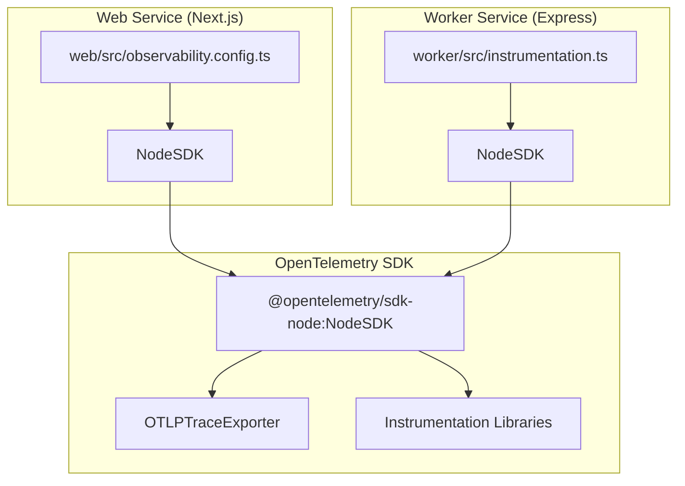
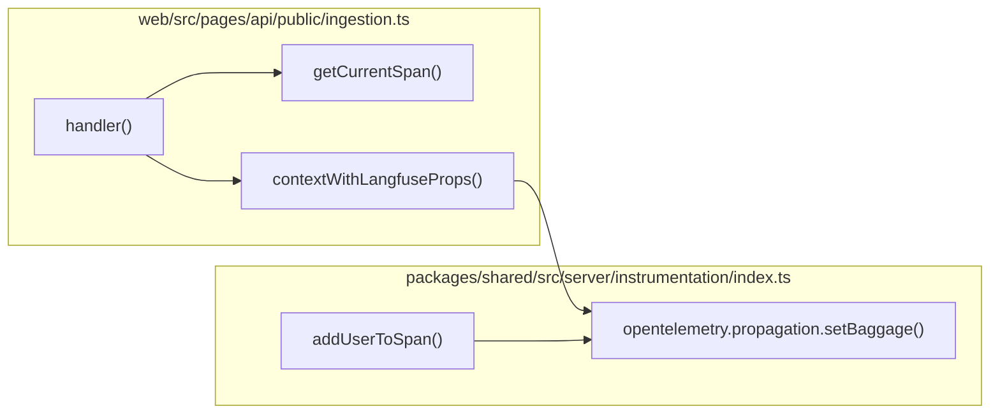
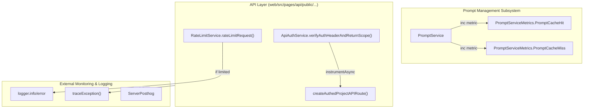

# Observability 및 Monitoring

<details>
<summary>관련 소스 파일</summary>

다음 파일들은 이 위키 페이지를 생성하기 위한 컨텍스트로 사용되었습니다.

- [packages/shared/src/features/prompts/types.ts](packages/shared/src/features/prompts/types.ts)
- [packages/shared/src/server/auth/types.ts](packages/shared/src/server/auth/types.ts)
- [packages/shared/src/server/headerPropagation.ts](packages/shared/src/server/headerPropagation.ts)
- [packages/shared/src/server/instrumentation/index.ts](packages/shared/src/server/instrumentation/index.ts)
- [packages/shared/src/server/services/PromptService/index.ts](packages/shared/src/server/services/PromptService/index.ts)
- [packages/shared/src/server/services/PromptService/types.ts](packages/shared/src/server/services/PromptService/types.ts)
- [web/src/__tests__/server/promptCache.servertest.ts](web/src/__tests__/server/promptCache.servertest.ts)
- [web/src/__tests__/server/unit/api-auth-span.servertest.ts](web/src/__tests__/server/unit/api-auth-span.servertest.ts)
- [web/src/__tests__/server/unit/langfuse-context-propagation.servertest.ts](web/src/__tests__/server/unit/langfuse-context-propagation.servertest.ts)
- [web/src/features/mcp/features/prompts/index.ts](web/src/features/mcp/features/prompts/index.ts)
- [web/src/features/mcp/features/prompts/tools/getPrompt.ts](web/src/features/mcp/features/prompts/tools/getPrompt.ts)
- [web/src/features/mcp/features/prompts/tools/getPromptUnresolved.ts](web/src/features/mcp/features/prompts/tools/getPromptUnresolved.ts)
- [web/src/features/mcp/features/prompts/tools/promptReadToolFactory.ts](web/src/features/mcp/features/prompts/tools/promptReadToolFactory.ts)
- [web/src/features/prompts/server/actions/deletePrompt.ts](web/src/features/prompts/server/actions/deletePrompt.ts)
- [web/src/features/prompts/server/actions/getPromptByName.ts](web/src/features/prompts/server/actions/getPromptByName.ts)
- [web/src/features/prompts/server/handlers/promptNameHandler.ts](web/src/features/prompts/server/handlers/promptNameHandler.ts)
- [web/src/features/public-api/server/apiAuth.ts](web/src/features/public-api/server/apiAuth.ts)
- [web/src/features/public-api/server/createAuthedProjectAPIRoute.ts](web/src/features/public-api/server/createAuthedProjectAPIRoute.ts)
- [web/src/features/telemetry/index.ts](web/src/features/telemetry/index.ts)
- [web/src/observability.config.ts](web/src/observability.config.ts)
- [web/src/pages/api/public/ingestion.ts](web/src/pages/api/public/ingestion.ts)
- [web/src/pages/api/public/projects/[projectId]/apiKeys/[apiKeyId].ts](web/src/pages/api/public/projects/[projectId]/apiKeys/[apiKeyId].ts)
- [web/src/pages/api/public/projects/[projectId]/apiKeys/index.ts](web/src/pages/api/public/projects/[projectId]/apiKeys/index.ts)
- [web/src/pages/api/public/prompts.ts](web/src/pages/api/public/prompts.ts)
- [worker/src/instrumentation.ts](worker/src/instrumentation.ts)

</details>


이 문서는 distributed tracing, APM integration, error tracking, metrics collection을 포함한 Langfuse의 observability 및 monitoring infrastructure를 설명합니다. Web service와 worker service 모두에 대한 instrumentation을 다룹니다.

Queue architecture와 background processing에 대한 정보는 [7. Queue & Worker System]()을 참고하세요. Deployment 및 infrastructure에 대해서는 [11.2. Docker & Deployment]()를 참고하세요.

---

## 개요

Langfuse는 multi-layered observability strategy를 사용합니다.

1.  Distributed tracing과 instrumentation을 위한 **OpenTelemetry**.
2.  Application performance monitoring을 위한 **DataDog APM**(Cloud deployment).
3.  Error tracking과 monitoring을 위한 **Sentry**(Web service).
4.  Product analytics와 user behavior tracking을 위한 **PostHog**.
5.  Queue monitoring과 operational metric을 위한 **Custom Metrics**.
6.  Metric publishing을 위한 **AWS CloudWatch**(optional).

Web service와 worker service는 독립적으로 instrument되지만 유사한 pattern을 따릅니다. Instrumentation은 다른 code가 실행되기 전 application startup 시점에 initialize됩니다.

---

## OpenTelemetry Instrumentation

### Initialization Flow

OpenTelemetry instrumentation은 subsequent module이 모두 올바르게 wrap되도록 두 service 모두에서 가능한 가장 이른 시점에 initialize됩니다. Web service에서는 `observability.config.ts`를 통해 처리되고 [web/src/observability.config.ts:1-83](), worker는 dedicated `instrumentation.ts`를 사용합니다 [worker/src/instrumentation.ts:1-79]().

Title: OpenTelemetry Initialization Flow

출처: [web/src/observability.config.ts:2-26](), [worker/src/instrumentation.ts:2-26]()

### Configuration

두 service는 다음 component를 포함하는 동일한 OpenTelemetry SDK configuration을 사용합니다.

| Component | Purpose | Configuration |
|-----------|---------|---------------|
| `NodeSDK` | Main SDK instance | Service name, `BUILD_ID`에서 가져온 version |
| `OTLPTraceExporter` | OTLP protocol을 통해 trace export | `OTEL_EXPORTER_OTLP_ENDPOINT`에서 가져온 endpoint |
| Resource Detectors | Deployment context 자동 감지 | AWS ECS, Container, Process, Environment |
| Sampler (Web only) | Trace sampling rate 제어 | `OTEL_TRACE_SAMPLING_RATIO`를 사용하는 `TraceIdRatioBasedSampler` |

**Environment Variables:**

*   `OTEL_EXPORTER_OTLP_ENDPOINT`: OTLP endpoint URL(예: `http://localhost:4318/v1/traces`) [worker/src/instrumentation.ts:32-32]().
*   `OTEL_SERVICE_NAME`: Service identifier(예: "worker") [worker/src/instrumentation.ts:28-28]().
*   `OTEL_TRACE_SAMPLING_RATIO`: Sampling ratio 0.0-1.0(web service only) [web/src/observability.config.ts:79-79]().
*   `BUILD_ID`: Trace correlation을 위한 service version으로 사용 [web/src/observability.config.ts:29-29]().

출처: [web/src/observability.config.ts:26-80](), [worker/src/instrumentation.ts:26-78]()

### Instrumentation Libraries

Core dependency에서 telemetry를 capture하기 위해 다음 OpenTelemetry instrumentation library가 registered됩니다.

*   **HttpInstrumentation**: Incoming 및 outgoing HTTP request를 capture합니다. Health check endpoint(`/api/public/health`, `/api/public/ready`, `/api/health`)를 ignore하도록 구성되어 있습니다 [web/src/observability.config.ts:38-42](), [worker/src/instrumentation.ts:38-42]().
*   **IORedisInstrumentation**: Redis operation을 instrument합니다. `ioredisRequestHook`을 사용해 sensitive credential과 API key cache value를 redact하는 `requestHook` [worker/src/instrumentation.ts:35-35]()을 포함합니다 [web/src/observability.config.ts:35-35]().
*   **BullMQInstrumentation**: `{ useProducerSpanAsConsumerParent: true }` configuration은 queue boundary를 넘어 consumer span을 producer span에 link합니다 [web/src/observability.config.ts:71-71](), [worker/src/instrumentation.ts:68-68]().
*   **PrismaInstrumentation**: Database query를 instrument하며, serialization 같은 noisy span type은 ignore합니다 [web/src/observability.config.ts:60-68](), [worker/src/instrumentation.ts:57-65]().
*   **WinstonInstrumentation**: Direct log sending은 disable하면서 active trace와 log를 correlate합니다 [web/src/observability.config.ts:70-70](), [worker/src/instrumentation.ts:67-67]().

출처: [web/src/observability.config.ts:34-72](), [worker/src/instrumentation.ts:34-69]()

---

## Context Propagation & Baggage

Langfuse는 service boundary 전반에 metadata를 propagate하기 위해 OpenTelemetry Baggage를 많이 사용합니다. `contextWithLangfuseProps` 함수는 `userId`, `projectId`, `apiKeyId`에 대한 baggage entry를 포함하는 새 context를 생성합니다 [packages/shared/src/server/headerPropagation.ts:17-65]().

또한 특정 `x-langfuse-*` header가 자동으로 extract되어 downstream tracing을 위해 active span과 baggage 모두에 추가됩니다 [web/src/pages/api/public/ingestion.ts:61-71](), [packages/shared/src/server/headerPropagation.ts:35-48]().

Title: Context and Header Propagation

출처: [web/src/pages/api/public/ingestion.ts:58-102](), [packages/shared/src/server/headerPropagation.ts:17-65](), [packages/shared/src/server/instrumentation/index.ts:190-247]()

---

## DataDog APM Integration

DataDog의 `dd-trace` library는 Langfuse Cloud deployment에서 production monitoring을 위해 initialize됩니다.

### Initialization

두 service 모두 automatic monkey-patching이 가능하도록 다른 module보다 먼저 `dd-trace`를 initialize합니다.

```javascript
// web/src/observability.config.ts & worker/src/instrumentation.ts
dd.init({
  runtimeMetrics: true,
  plugins: false, // OpenTelemetry handles standard instrumentations
});
```
출처: [web/src/observability.config.ts:21-24](), [worker/src/instrumentation.ts:21-24]()

---

## PostHog Analytics

Langfuse는 product analytics와 telemetry를 위해 PostHog를 사용합니다.

### Server-side Telemetry
Dedicated `telemetry()` 함수는 self-hosted instance에 대한 system metric을 PostHog로 주기적으로 report합니다 [web/src/features/telemetry/index.ts:20-58](). 이 job은 여러 instance에 걸쳐 12시간마다 한 번만 실행되도록 PostgreSQL의 `cronJobs` table을 통해 관리됩니다 [web/src/features/telemetry/index.ts:15-124]().

Telemetry job은 다음 data point를 collect합니다.
*   Total project count [web/src/features/telemetry/index.ts:161-165]().
*   해당 timeframe의 ClickHouse trace, score, observation aggregate count [web/src/features/telemetry/index.ts:168-198]().
*   Dataset 및 Dataset Item count [web/src/features/telemetry/index.ts:201-213]().

출처: [web/src/features/telemetry/index.ts:1-213]()

---

## Metrics & Instrumentation Utilities

### Application Service Monitoring

Title: Service-Level Observability (Code Entity Space)


**Internal Metrics:**
*   **PromptService**: `PromptServiceMetrics.PromptCacheHit`와 `PromptServiceMetrics.PromptCacheMiss`를 사용해 cache performance를 추적합니다 [packages/shared/src/server/services/PromptService/index.ts:55-59](). 이를 OpenTelemetry 또는 다른 provider로 report하기 위해 `metricIncrementer` callback을 활용합니다 [packages/shared/src/server/services/PromptService/index.ts:32-34]().
*   **Rate Limiting**: `RateLimitService`는 project/organization별 request volume을 monitor하고 limit에 도달하면 report합니다 [web/src/pages/api/public/prompts.ts:55-63]().
*   **Authentication Tracing**: `ApiAuthService`는 authentication performance에 대한 detailed span을 제공하기 위해 core verification logic을 `instrumentAsync`로 wrap합니다 [web/src/features/public-api/server/apiAuth.ts:94-96]().

출처: [packages/shared/src/server/services/PromptService/index.ts:32-66](), [web/src/pages/api/public/prompts.ts:55-63](), [web/src/features/public-api/server/apiAuth.ts:94-118]()

---

## Error Handling & Reporting

### Public API Error Management
Public API handler는 structured error reporting을 사용합니다. Exception은 catch된 뒤 APM tool에서 visibility를 보장하기 위해 `traceException()`과 `logger.error()`로 전달됩니다 [web/src/pages/api/public/prompts.ts:111-113]().

`traceException` utility [packages/shared/src/server/instrumentation/index.ts:141-188]()는 자동으로 다음을 수행합니다.
1.  Exception을 OpenTelemetry event로 record합니다 [packages/shared/src/server/instrumentation/index.ts:175-175]().
2.  Datadog-specific error tag(`error.stack`, `error.message`, `error.type`)를 설정합니다 [packages/shared/src/server/instrumentation/index.ts:178-182]().
3.  Span status를 `ERROR`로 설정합니다 [packages/shared/src/server/instrumentation/index.ts:184-187]().

올바른 HTTP status code를 제공하기 위해 specific error type이 처리됩니다.
*   **UnauthorizedError / ForbiddenError**: Auth failure에 대해 401/403을 반환합니다 [web/src/pages/api/public/prompts.ts:36-44]().
*   **LangfuseNotFoundError**: Prompt 같은 resource가 누락된 경우 404를 반환합니다 [web/src/pages/api/public/prompts.ts:71-71]().

출처: [web/src/pages/api/public/prompts.ts:110-140](), [packages/shared/src/server/instrumentation/index.ts:141-188]()
