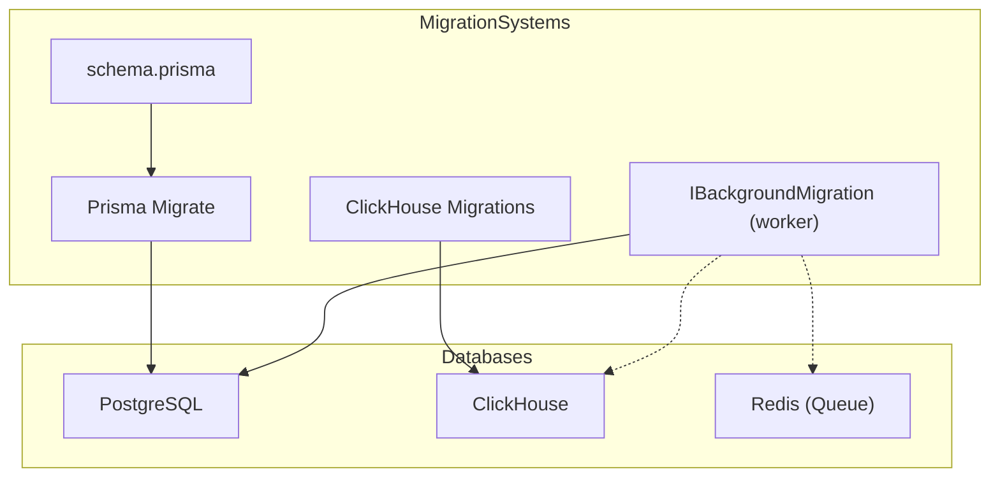
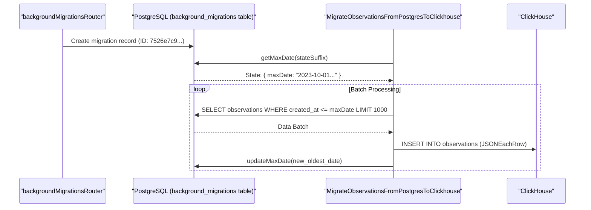
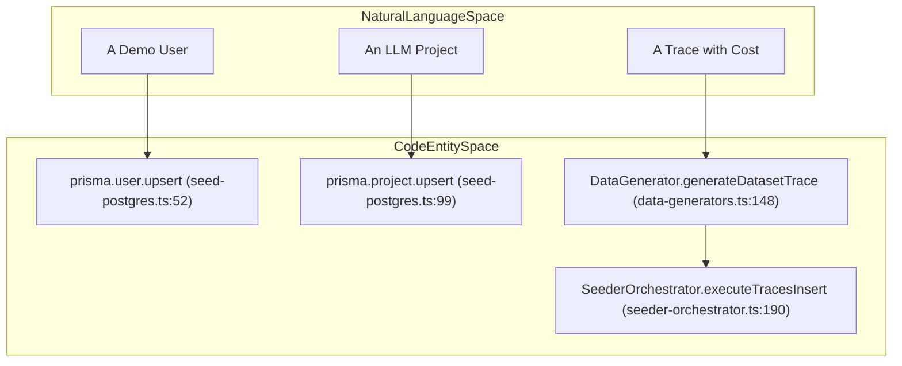

# 데이터베이스 마이그레이션

관련 소스 파일

다음 파일들은 이 위키 페이지를 생성하기 위한 컨텍스트로 사용되었습니다.

- [packages/shared/prisma/schema.prisma](packages/shared/prisma/schema.prisma)
- [packages/shared/scripts/seeder/load-seed-clickhouse.ts](packages/shared/scripts/seeder/load-seed-clickhouse.ts)
- [packages/shared/scripts/seeder/prepare-clickhouse.ts](packages/shared/scripts/seeder/prepare-clickhouse.ts)
- [packages/shared/scripts/seeder/seed-clickhouse.ts](packages/shared/scripts/seeder/seed-clickhouse.ts)
- [packages/shared/scripts/seeder/seed-dataset-versions.ts](packages/shared/scripts/seeder/seed-dataset-versions.ts)
- [packages/shared/scripts/seeder/seed-postgres.ts](packages/shared/scripts/seeder/seed-postgres.ts)
- [packages/shared/scripts/seeder/utils/README.md](packages/shared/scripts/seeder/utils/README.md)
- [packages/shared/scripts/seeder/utils/clickhouse-builder.ts](packages/shared/scripts/seeder/utils/clickhouse-builder.ts)
- [packages/shared/scripts/seeder/utils/data-generators.ts](packages/shared/scripts/seeder/utils/data-generators.ts)
- [packages/shared/scripts/seeder/utils/postgres-seed-constants.ts](packages/shared/scripts/seeder/utils/postgres-seed-constants.ts)
- [packages/shared/scripts/seeder/utils/seed-helpers.ts](packages/shared/scripts/seeder/utils/seed-helpers.ts)
- [packages/shared/scripts/seeder/utils/seeder-orchestrator.ts](packages/shared/scripts/seeder/utils/seeder-orchestrator.ts)
- [packages/shared/scripts/seeder/utils/types.ts](packages/shared/scripts/seeder/utils/types.ts)
- [web/src/__tests__/organization-settings-pages.clienttest.tsx](web/src/__tests__/organization-settings-pages.clienttest.tsx)
- [web/src/features/audit-logs/auditLog.ts](web/src/features/audit-logs/auditLog.ts)
- [web/src/features/datasets/components/DatasetIOCells.tsx](web/src/features/datasets/components/DatasetIOCells.tsx)
- [web/src/features/datasets/components/DatasetRunItemsByItemTable.tsx](web/src/features/datasets/components/DatasetRunItemsByItemTable.tsx)
- [web/src/features/datasets/components/DatasetRunItemsByRunTable.tsx](web/src/features/datasets/components/DatasetRunItemsByRunTable.tsx)
- [web/src/features/datasets/components/NotFoundCard.tsx](web/src/features/datasets/components/NotFoundCard.tsx)
- [web/src/features/datasets/lib/convertRunItemDataToUiTableRow.ts](web/src/features/datasets/lib/convertRunItemDataToUiTableRow.ts)
- [web/src/features/datasets/lib/types.ts](web/src/features/datasets/lib/types.ts)
- [web/src/features/models/components/ModelSettings.tsx](web/src/features/models/components/ModelSettings.tsx)
- [web/src/features/organizations/components/AIFeatureSwitch.tsx](web/src/features/organizations/components/AIFeatureSwitch.tsx)
- [web/src/pages/organization/[organizationId]/settings/index.tsx](web/src/pages/organization/[organizationId]/settings/index.tsx)
- [web/src/pages/project/[projectId]/settings/index.tsx](web/src/pages/project/[projectId]/settings/index.tsx)
- [web/src/server/api/root.ts](web/src/server/api/root.ts)
- [web/src/server/api/routers/public.ts](web/src/server/api/routers/public.ts)
- [worker/src/__tests__/inMemoryFilterService.test.ts](worker/src/__tests__/inMemoryFilterService.test.ts)
- [worker/src/backgroundMigrations/IBackgroundMigration.ts](worker/src/backgroundMigrations/IBackgroundMigration.ts)
- [worker/src/backgroundMigrations/addGenerationsCostBackfill.ts](worker/src/backgroundMigrations/addGenerationsCostBackfill.ts)
- [worker/src/backgroundMigrations/migrateObservationsFromPostgresToClickhouse.ts](worker/src/backgroundMigrations/migrateObservationsFromPostgresToClickhouse.ts)
- [worker/src/backgroundMigrations/migrateScoresFromPostgresToClickhouse.ts](worker/src/backgroundMigrations/migrateScoresFromPostgresToClickhouse.ts)
- [worker/src/backgroundMigrations/migrateTracesFromPostgresToClickhouse.ts](worker/src/backgroundMigrations/migrateTracesFromPostgresToClickhouse.ts)
- [worker/src/ee/cloudUsageMetering/constants.ts](worker/src/ee/cloudUsageMetering/constants.ts)

이 문서는 Langfuse의 database migration system을 설명하며, PostgreSQL schema migration(Prisma를 통해 관리), ClickHouse schema management, large-scale data transformation을 위한 background migration, data seeding workflow를 다룹니다.

## Migration Architecture Overview

Langfuse는 각 system에 대해 별도의 migration strategy가 필요한 dual-database architecture를 사용합니다.

- **PostgreSQL**: Metadata, configuration, relational data를 저장합니다. Migration은 `schema.prisma`의 declarative schema definition을 사용하는 Prisma Migrate를 통해 관리됩니다. [packages/shared/prisma/schema.prisma:1-14]()
- **ClickHouse**: High-volume event data, trace, metric을 저장합니다. Schema change는 SQL script와 versioned migration을 통해 관리됩니다.
- **Background Migrations**: 단일 transaction에서 실행할 수 없는 long-running data backfill 및 transformation입니다. Production database locking을 피하고 system stability를 보장하기 위해 dedicated worker-based system을 통해 관리됩니다. [web/src/server/api/root.ts:109]()

Title: Migration System Architecture

**출처:** [packages/shared/prisma/schema.prisma:9-14](), [web/src/server/api/root.ts:109](), [worker/src/backgroundMigrations/IBackgroundMigration.ts:1-1]()

## Background Migrations

Large-scale data move나 schema backfill을 위해 Langfuse는 asynchronous background migration system을 사용합니다. 이러한 migration은 `backgroundMigrationsRouter`에 registered되고 background worker가 실행합니다. [web/src/server/api/root.ts:109]()

### Migration Implementation
`IBackgroundMigration`을 구현하는 class는 특정 data transformation을 위한 logic을 정의합니다. 예를 들어 `MigrateObservationsFromPostgresToClickhouse`는 legacy relational data를 columnar store로 이동하는 작업을 처리합니다. [worker/src/backgroundMigrations/migrateObservationsFromPostgresToClickhouse.ts:14-14]()

주요 behavior는 다음과 같습니다.
- **Resumability**: Progress는 `background_migrations` table에 persisted됩니다. Worker는 current state(예: `maxDate`)를 `state` JSON column에 저장하므로, worker가 restart되면 마지막 successful batch부터 이어서 처리합니다. [worker/src/backgroundMigrations/migrateObservationsFromPostgresToClickhouse.ts:18-38]()
- **Batching**: Memory exhaustion과 long-running database lock을 방지하기 위해 data는 chunk(default 1000 rows) 단위로 처리됩니다. [worker/src/backgroundMigrations/migrateObservationsFromPostgresToClickhouse.ts:105-130]()
- **Validation**: `validate` method는 execution이 시작되기 전에 target ClickHouse table이나 필요한 credential의 존재 여부를 확인합니다. [worker/src/backgroundMigrations/migrateObservationsFromPostgresToClickhouse.ts:53-94]()

Title: Background Migration Logic Flow

**출처:** [web/src/server/api/root.ts:109](), [worker/src/backgroundMigrations/migrateObservationsFromPostgresToClickhouse.ts:12-51](), [worker/src/backgroundMigrations/migrateObservationsFromPostgresToClickhouse.ts:122-155]()

## ClickHouse Schema Management

ClickHouse migration은 특히 clustered environment에서 performance와 consistency를 유지합니다.

- **Index Management**: `user_id`, `session_id`, `trace_id` 기준 filtering 같은 특정 query pattern을 optimize하기 위해 index가 추가됩니다.
- **Materialized Views**: ClickHouse는 event를 trace, observation, score로 real-time aggregate하기 위해 materialized view를 사용합니다. Schema migration은 새 field를 지원하기 위해 이러한 view를 update하는 경우가 많습니다.
- **Partitioning**: Schema는 일반적으로 efficient data retention과 TTL management를 위해 time 기준으로 data를 partition합니다.
- **Bulk Operations**: Migration 또는 seeding 중 large-scale data insertion은 ClickHouse의 `numbers()` function이나 `JSONEachRow` format을 사용해 optimize됩니다. [packages/shared/scripts/seeder/utils/clickhouse-builder.ts:105-130](), [worker/src/backgroundMigrations/migrateScoresFromPostgresToClickhouse.ts:119-123]()

## Seeding Data

Seeding은 `packages/shared/scripts/seeder/`의 script를 통해 처리되며, development와 testing을 위한 reproducible environment를 제공합니다.

### PostgreSQL Seeding
`seed-postgres.ts` script는 relational database에 essential demo data를 populate합니다.
- **Auth**: "Demo User"(`demo@langfuse.com`)와 "Seed Org"를 생성합니다. [packages/shared/scripts/seeder/seed-postgres.ts:52-97]()
- **Projects**: ID가 `7a88fb47-b4e2-43b8-a06c-a5ce950dc53a`인 project `llm-app`을 생성합니다. [packages/shared/scripts/seeder/seed-postgres.ts:99-110]()
- **API Keys**: Hashed secret이 있는 default project-scoped API key(`pk-lf-1234567890`)를 생성합니다. [packages/shared/scripts/seeder/seed-postgres.ts:182-205]()
- **Prompts**: Prompt management testing을 위해 initial prompt version과 label을 seed합니다. [packages/shared/scripts/seeder/seed-postgres.ts:163-180]()

### ClickHouse Seeding
ClickHouse seeding은 `DataGenerator`와 `SeederOrchestrator` class를 사용해 high-volume observability data를 generate하고 insert합니다. [packages/shared/scripts/seeder/utils/seeder-orchestrator.ts:39-48]()

- **Dataset Experiments**: `SeederOrchestrator.createDatasetExperimentData`는 `SEED_DATASETS` constant를 사용해 A/B testing scenario용 trace, observation, score를 생성합니다. [packages/shared/scripts/seeder/utils/seeder-orchestrator.ts:118-174]()
- **Observations**: `DataGenerator.generateDatasetObservation`은 realistic LLM provider usage를 simulate하며 variable token usage와 cost detail이 있는 generation을 생성합니다. [packages/shared/scripts/seeder/utils/data-generators.ts:195-211]()
- **Bulk Inserts**: `ClickHouseQueryBuilder`를 사용해 large batch의 trace와 score에 대한 optimized insert를 실행하며, 보통 `createTracesCh`와 `createObservationsCh`를 활용합니다. [packages/shared/scripts/seeder/utils/clickhouse-builder.ts:46-60](), [packages/shared/scripts/seeder/utils/seeder-orchestrator.ts:189-197]()

Title: Seeding Entity Space Mapping

**출처:** [packages/shared/scripts/seeder/seed-postgres.ts:52-110](), [packages/shared/scripts/seeder/utils/data-generators.ts:148-189](), [packages/shared/scripts/seeder/utils/seeder-orchestrator.ts:189-197]()

## 주요 Migration 및 Seeding 파일

| Path | Purpose |
|------|---------|
| `packages/shared/prisma/schema.prisma` | PostgreSQL schema와 Prisma migration의 source of truth. [packages/shared/prisma/schema.prisma:1-14]() |
| `packages/shared/scripts/seeder/seed-postgres.ts` | PostgreSQL data seeding을 위한 main entry point. [packages/shared/scripts/seeder/seed-postgres.ts:42-112]() |
| `packages/shared/scripts/seeder/utils/data-generators.ts` | Realistic ClickHouse observability data를 생성하는 logic. [packages/shared/scripts/seeder/utils/data-generators.ts:48-57]() |
| `packages/shared/scripts/seeder/utils/seeder-orchestrator.ts` | PG와 CH 전반의 seeding을 orchestrate. [packages/shared/scripts/seeder/utils/seeder-orchestrator.ts:39-48]() |
| `worker/src/backgroundMigrations/` | Resumable background data migration 구현(예: `MigrateScoresFromPostgresToClickhouse`). [worker/src/backgroundMigrations/migrateScoresFromPostgresToClickhouse.ts:14-14]() |

**출처:** [packages/shared/prisma/schema.prisma:1-14](), [packages/shared/scripts/seeder/seed-postgres.ts:42-112](), [packages/shared/scripts/seeder/utils/data-generators.ts:48-57](), [packages/shared/scripts/seeder/utils/seeder-orchestrator.ts:39-48](), [worker/src/backgroundMigrations/migrateScoresFromPostgresToClickhouse.ts:14-14]()
