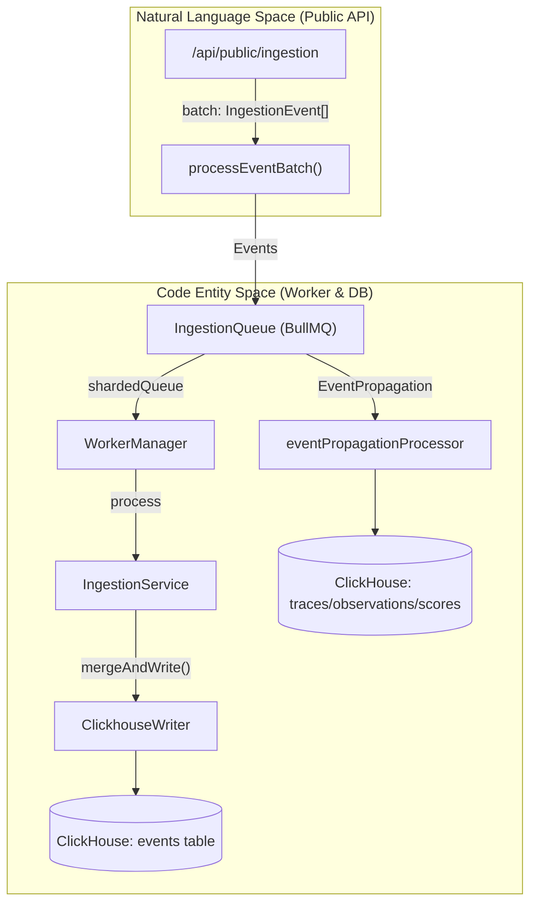
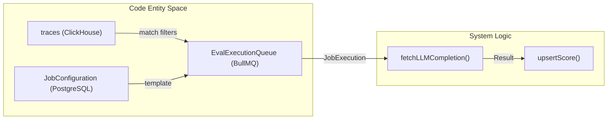

# 용어집

관련 소스 파일

다음 파일들은 이 위키 페이지를 생성하기 위한 컨텍스트로 사용되었습니다.

- [.env.dev-redis-cluster.example](.env.dev-redis-cluster.example)
- [.vscode/launch.json](.vscode/launch.json)
- [fern/apis/server/definition/ingestion.yml](fern/apis/server/definition/ingestion.yml)
- [packages/shared/clickhouse/scripts/dev-tables.sh](packages/shared/clickhouse/scripts/dev-tables.sh)
- [packages/shared/prisma/migrations/20250123103200_add_retention_days_to_projects/migration.sql](packages/shared/prisma/migrations/20250123103200_add_retention_days_to_projects/migration.sql)
- [packages/shared/src/domain/automations.ts](packages/shared/src/domain/automations.ts)
- [packages/shared/src/env.ts](packages/shared/src/env.ts)
- [packages/shared/src/features/entitlements/plans.ts](packages/shared/src/features/entitlements/plans.ts)
- [packages/shared/src/features/evals/types.ts](packages/shared/src/features/evals/types.ts)
- [packages/shared/src/features/monitors/service/helpers.test.ts](packages/shared/src/features/monitors/service/helpers.test.ts)
- [packages/shared/src/features/monitors/service/helpers.ts](packages/shared/src/features/monitors/service/helpers.ts)
- [packages/shared/src/features/monitors/service/service.ts](packages/shared/src/features/monitors/service/service.ts)
- [packages/shared/src/features/monitors/service/types.test.ts](packages/shared/src/features/monitors/service/types.test.ts)
- [packages/shared/src/features/monitors/service/types.ts](packages/shared/src/features/monitors/service/types.ts)
- [packages/shared/src/interfaces/rate-limits.ts](packages/shared/src/interfaces/rate-limits.ts)
- [packages/shared/src/server/automations.test.ts](packages/shared/src/server/automations.test.ts)
- [packages/shared/src/server/automations.ts](packages/shared/src/server/automations.ts)
- [packages/shared/src/server/index.ts](packages/shared/src/server/index.ts)
- [packages/shared/src/server/ingestion/types.ts](packages/shared/src/server/ingestion/types.ts)
- [packages/shared/src/server/queries/clickhouse-sql/clickhouse-filter.ts](packages/shared/src/server/queries/clickhouse-sql/clickhouse-filter.ts)
- [packages/shared/src/server/queries/clickhouse-sql/search.ts](packages/shared/src/server/queries/clickhouse-sql/search.ts)
- [packages/shared/src/server/queues.ts](packages/shared/src/server/queues.ts)
- [packages/shared/src/server/redis/eventPropagationQueue.ts](packages/shared/src/server/redis/eventPropagationQueue.ts)
- [packages/shared/src/server/redis/getQueue.ts](packages/shared/src/server/redis/getQueue.ts)
- [packages/shared/src/server/repositories/automation-repository.ts](packages/shared/src/server/repositories/automation-repository.ts)
- [packages/shared/src/server/repositories/definitions.ts](packages/shared/src/server/repositories/definitions.ts)
- [packages/shared/src/server/repositories/observations.ts](packages/shared/src/server/repositories/observations.ts)
- [packages/shared/src/server/repositories/scores.ts](packages/shared/src/server/repositories/scores.ts)
- [packages/shared/src/server/repositories/traces.ts](packages/shared/src/server/repositories/traces.ts)
- [packages/shared/src/server/services/sessions-ui-table-service.ts](packages/shared/src/server/services/sessions-ui-table-service.ts)
- [packages/shared/src/server/services/traces-ui-table-service.ts](packages/shared/src/server/services/traces-ui-table-service.ts)
- [packages/shared/src/server/test-utils/tracing-factory.ts](packages/shared/src/server/test-utils/tracing-factory.ts)
- [packages/shared/src/utils/json.ts](packages/shared/src/utils/json.ts)
- [web/src/__tests__/server/automations-trpc.servertest.ts](web/src/__tests__/server/automations-trpc.servertest.ts)
- [web/src/__tests__/server/clickhouseSearchCondition.servertest.ts](web/src/__tests__/server/clickhouseSearchCondition.servertest.ts)
- [web/src/__tests__/server/monitorService.servertest.ts](web/src/__tests__/server/monitorService.servertest.ts)
- [web/src/__tests__/server/monitors.servertest.ts](web/src/__tests__/server/monitors.servertest.ts)
- [web/src/components/VersionLabel.tsx](web/src/components/VersionLabel.tsx)
- [web/src/ee/features/ui-customization/uiCustomizationRouter.ts](web/src/ee/features/ui-customization/uiCustomizationRouter.ts)
- [web/src/ee/features/ui-customization/useUiCustomization.ts](web/src/ee/features/ui-customization/useUiCustomization.ts)
- [web/src/features/auth/lib/projectRetentionSchema.ts](web/src/features/auth/lib/projectRetentionSchema.ts)
- [web/src/features/automations/server/router.ts](web/src/features/automations/server/router.ts)
- [web/src/features/background-migrations/components/background-migrations.tsx](web/src/features/background-migrations/components/background-migrations.tsx)
- [web/src/features/background-migrations/components/retry-background-migration.tsx](web/src/features/background-migrations/components/retry-background-migration.tsx)
- [web/src/features/background-migrations/server/background-migrations-router.ts](web/src/features/background-migrations/server/background-migrations-router.ts)
- [web/src/features/entitlements/constants/entitlements.ts](web/src/features/entitlements/constants/entitlements.ts)
- [web/src/features/entitlements/server/getPlan.ts](web/src/features/entitlements/server/getPlan.ts)
- [web/src/features/evals/components/template-selector.tsx](web/src/features/evals/components/template-selector.tsx)
- [web/src/features/evals/hooks/useEvaluationModel.ts](web/src/features/evals/hooks/useEvaluationModel.ts)
- [web/src/features/experiments/components/MultiStepExperimentForm.tsx](web/src/features/experiments/components/MultiStepExperimentForm.tsx)
- [web/src/features/experiments/components/steps/EvaluatorsStep.tsx](web/src/features/experiments/components/steps/EvaluatorsStep.tsx)
- [web/src/features/experiments/components/steps/PromptModelStep.tsx](web/src/features/experiments/components/steps/PromptModelStep.tsx)
- [web/src/features/experiments/hooks/useEvaluatorDefaults.ts](web/src/features/experiments/hooks/useEvaluatorDefaults.ts)
- [web/src/features/experiments/hooks/useExperimentEvaluatorData.ts](web/src/features/experiments/hooks/useExperimentEvaluatorData.ts)
- [web/src/features/experiments/hooks/useExperimentPromptData.ts](web/src/features/experiments/hooks/useExperimentPromptData.ts)
- [web/src/features/experiments/types/stepProps.ts](web/src/features/experiments/types/stepProps.ts)
- [web/src/features/experiments/utils/evaluatorMappingUtils.ts](web/src/features/experiments/utils/evaluatorMappingUtils.ts)
- [web/src/features/feature-flags/available-flags.ts](web/src/features/feature-flags/available-flags.ts)
- [web/src/features/playground/page/hooks/useModelParams.ts](web/src/features/playground/page/hooks/useModelParams.ts)
- [web/src/features/projects/components/ConfigureRetention.tsx](web/src/features/projects/components/ConfigureRetention.tsx)
- [web/src/features/public-api/server/RateLimitService.ts](web/src/features/public-api/server/RateLimitService.ts)
- [web/src/features/rbac/constants/projectAccessRights.ts](web/src/features/rbac/constants/projectAccessRights.ts)
- [web/src/pages/api/admin/bullmq/index.ts](web/src/pages/api/admin/bullmq/index.ts)
- [web/src/pages/background-migrations.tsx](web/src/pages/background-migrations.tsx)
- [web/src/server/api/routers/generations/filterOptionsQuery.ts](web/src/server/api/routers/generations/filterOptionsQuery.ts)
- [web/src/server/api/routers/scores.ts](web/src/server/api/routers/scores.ts)
- [web/src/server/api/routers/sessions.ts](web/src/server/api/routers/sessions.ts)
- [web/src/server/api/routers/surveys.ts](web/src/server/api/routers/surveys.ts)
- [web/src/server/api/routers/traces.ts](web/src/server/api/routers/traces.ts)
- [web/src/utils/getFinalModelParams.tsx](web/src/utils/getFinalModelParams.tsx)
- [worker/src/app.ts](worker/src/app.ts)
- [worker/src/backgroundMigrations/backfillEventsHistoric.ts](worker/src/backgroundMigrations/backfillEventsHistoric.ts)
- [worker/src/backgroundMigrations/backfillEventsHistoricFromParts.ts](worker/src/backgroundMigrations/backfillEventsHistoricFromParts.ts)
- [worker/src/backgroundMigrations/backfillExperimentsHistoric.ts](worker/src/backgroundMigrations/backfillExperimentsHistoric.ts)
- [worker/src/env.ts](worker/src/env.ts)
- [worker/src/features/entityChange/promptVersionProcessor.ts](worker/src/features/entityChange/promptVersionProcessor.ts)
- [worker/src/features/eventPropagation/handleEventPropagationJob.ts](worker/src/features/eventPropagation/handleEventPropagationJob.ts)
- [worker/src/features/eventPropagation/handleExperimentBackfill.ts](worker/src/features/eventPropagation/handleExperimentBackfill.ts)
- [worker/src/features/tokenisation/usage.ts](worker/src/features/tokenisation/usage.ts)
- [worker/src/queues/ingestionQueue.ts](worker/src/queues/ingestionQueue.ts)
- [worker/src/queues/workerManager.ts](worker/src/queues/workerManager.ts)
- [worker/src/services/IngestionService/index.ts](worker/src/services/IngestionService/index.ts)
- [worker/src/services/IngestionService/tests/IngestionService.integration.test.ts](worker/src/services/IngestionService/tests/IngestionService.integration.test.ts)
- [worker/src/services/IngestionService/tests/calculateTokenCost.unit.test.ts](worker/src/services/IngestionService/tests/calculateTokenCost.unit.test.ts)
- [worker/src/services/IngestionService/tests/utils.unit.test.ts](worker/src/services/IngestionService/tests/utils.unit.test.ts)
- [worker/src/services/IngestionService/utils.ts](worker/src/services/IngestionService/utils.ts)
- [worker/src/utils/shutdown.ts](worker/src/utils/shutdown.ts)

이 페이지는 Langfuse platform 내에서 사용되는 codebase-specific term, abbreviation, domain concept를 정의합니다. Dual-database architecture와 event-driven pipeline을 탐색하는 onboarding engineer를 위한 technical reference 역할을 합니다.

## 핵심 도메인 엔티티

Primary data model은 Prisma schema에 정의되어 있으며, high-performance analytics를 위해 ClickHouse에 mirror됩니다.

| Term | Definition | Key Code Reference |
| :--- | :--- | :--- |
| **Trace** | 단일 request 또는 execution flow의 top-level container입니다. LLM interaction의 overall latency와 metadata를 추적합니다. | `TraceRecordReadType` [packages/shared/src/server/repositories/definitions.ts:18-18]() |
| **Observation** | Trace 내부의 granular event입니다. Type에는 `SPAN`, `GENERATION`, `EVENT`, `TOOL`이 포함됩니다. | `ObservationRecordReadType` [packages/shared/src/server/repositories/definitions.ts:11-11]() |
| **Generation** | Prompt input, completion output, token usage를 포함해 LLM call을 추적하는 특정 Observation type입니다. | `ObservationType` [packages/shared/src/domain/index.ts:47-47]() |
| **Score** | Trace, Observation, 또는 Session에 연결된 evaluation metric입니다(예: accuracy, sentiment, user feedback). | `ScoreDomain` [packages/shared/src/domain/scores.ts:3-3]() |
| **ScoreConfig** | Manual 및 automated evaluation의 consistency를 보장하기 위한 predefined score configuration(numeric, categorical, boolean)입니다. | `ScoreConfig` [packages/shared/src/server/repositories/scores.ts:46-46]() |
| **Session** | 단일 user interaction 또는 conversation thread에 속한 여러 trace의 collection입니다. | `getTracesGroupedBySessionId` [web/src/server/api/routers/traces.ts:50-50]() |
| **Prompt** | LLM input을 위한 versioned template이며, ChatML 및 text format을 지원합니다. `PromptService`를 통해 관리됩니다. | `PromptService` [packages/shared/src/server/services/PromptService/index.ts:1-10]() |
| **Dataset** | Benchmarking과 evaluation에 사용되는 `DatasetItem`의 collection입니다. | `DatasetService` [packages/shared/src/server/index.ts:19-19]() |
| **DatasetRun** | Dataset에 대해 특정 prompt 또는 model version을 실행한 것입니다. | `DatasetRunItemEventType` [worker/src/services/IngestionService/index.ts:31-31]() |
| **Monitor** | Observability metric에 대한 threshold-based alerting system입니다. | `MonitorService` [packages/shared/src/server/index.ts:118-118]() |

**출처:** [packages/shared/src/server/repositories/definitions.ts:11-18](), [packages/shared/src/domain/index.ts:47-47](), [web/src/server/api/routers/traces.ts:79-95](), [packages/shared/src/domain/scores.ts:3-3](), [worker/src/services/IngestionService/index.ts:185-193]()

## Data Architecture & ClickHouse

### Dual-Write / Event Sourcing
Langfuse는 incoming data가 final analytical table로 propagate되기 전에 먼저 staging area에 write되는 event-sourcing pattern을 사용합니다.

*   **Events Table**: 모든 raw ingestion data를 위한 ClickHouse의 primary landing table입니다. [worker/src/services/IngestionService/index.ts:154-155]()
*   **Final Tables**: Deduplication을 위해 `ReplacingMergeTree` engine을 사용하는 ClickHouse의 `traces`, `observations`, `scores` 같은 table입니다. [packages/shared/src/server/repositories/traces.ts:162-162]()
*   **V4 Beta**: Synthetic trace가 observation에서 derive되는 architectural shift로, 더 flexible한 event-first ingestion을 가능하게 합니다. [web/src/server/api/routers/traces.ts:87-88]()
*   **`ClickhouseWriter`**: Ingestion throughput을 개선하기 위해 ClickHouse write를 batch 처리하는 worker의 service입니다. [worker/src/services/IngestionService/index.ts:56-56]()
*   **`EventPropagationQueue`**: Staging table(`observations_batch_staging`)에서 final `events_full` table로 data를 이동하는 BullMQ queue입니다. [worker/src/features/eventPropagation/handleEventPropagationJob.ts:58-60]()

### ClickHouse Repository Pattern
Codebase는 deduplication(`FINAL` 또는 `LIMIT 1 BY id` 사용)과 time-window filtering을 처리하는 repository function 뒤에 복잡한 ClickHouse SQL을 abstract합니다.

*   **`checkTraceExistsAndGetTimestamp`**: Evaluation job creation 중 eventual consistency를 보장하기 위해 주어진 timestamp의 window 내에 trace가 존재하는지 validate하는 utility입니다. [packages/shared/src/server/repositories/traces.ts:58-72]()
*   **`upsertClickhouse`**: ClickHouse에 record를 insert 또는 update하기 위한 shared utility입니다. [packages/shared/src/server/repositories/observations.ts:115-115]()
*   **`measureAndReturn`**: OpenTelemetry와 performance metric으로 ClickHouse query를 instrument하기 위해 repository 전반에서 사용되는 wrapper입니다. [packages/shared/src/server/repositories/traces.ts:128-155]()
*   **`shardedQueue`**: Scalability를 위해 여러 Redis shard 전반에 ingestion과 processing을 distribute하는 logic입니다. [packages/shared/src/env.ts:129-141]()

**출처:** [packages/shared/src/server/repositories/traces.ts:58-192](), [packages/shared/src/server/repositories/observations.ts:64-126](), [packages/shared/src/env.ts:129-141](), [worker/src/features/eventPropagation/handleEventPropagationJob.ts:94-103]()

## Ingestion & Processing

### Ingestion Pipeline
External SDK에서 Langfuse storage layer로 data가 흐르는 과정입니다. Incoming request에는 unique `EventBodyId`가 있는 `IngestionEvent`가 포함됩니다.

**Diagram: Ingestion Data Flow**

**출처:** [worker/src/services/IngestionService/index.ts:136-155](), [packages/shared/src/server/repositories/traces.ts:198-204](), [packages/shared/src/env.ts:125-141](), [worker/src/app.ts:48-48]()

### OTel (OpenTelemetry) Ingestion
Langfuse는 native OTel trace를 지원합니다. `OtelIngestionProcessor`는 OTel resource span을 Langfuse entity로 mapping합니다.

*   **`OtelIngestionProcessor`**: OpenTelemetry resource span을 Langfuse ingestion event로 변환하는 logic을 encapsulate합니다. [worker/src/env.ts:70-74]()
*   **`ObservationTypeMapper`**: OTel span kind와 attribute를 Langfuse observation type에 mapping하는 registry입니다. [packages/shared/src/domain/index.ts:47-47]()

**출처:** [worker/src/env.ts:70-74](), [packages/shared/src/server/repositories/observations.ts:148-150](), [worker/src/app.ts:79-79]()

## Evaluation & Automation

### Eval System
Trace에 대해 LLM-based evaluation을 실행하는 automated process입니다.

*   **`JobConfiguration`**: 어떤 trace가 evaluation 대상이 되어야 하는지에 대한 filter와 sampling을 정의합니다. [worker/src/env.ts:111-114]()
*   **`JobExecution`**: 특정 evaluation run의 status와 result를 추적합니다. [worker/src/env.ts:127-130]()
*   **`fetchLLMCompletion`**: Evaluation 중 LLM provider(OpenAI, Anthropic 등)를 호출하기 위한 core abstraction입니다. [packages/shared/src/server/index.ts:30-30]()
*   **`compileChatMessages`**: Trace variable을 evaluation prompt에 inject하기 위해 사용되는 함수입니다. [packages/shared/src/server/index.ts:35-35]()

### Automation System
Platform event를 기반으로 실행되는 trigger와 action입니다.

*   **`Trigger`**: Automation을 시작하는 condition입니다(예: 새 score 또는 trace). [packages/shared/src/domain/automations.ts:1-10]()
*   **`Action`**: 수행할 task입니다(예: Slack notification, Webhook). [packages/shared/src/domain/automations.ts:11-20]()
*   **`AnnotationQueue`**: Annotator의 manual scoring을 위해 trace가 queue에 들어가는 human-in-the-loop system입니다. [packages/shared/src/server/index.ts:106-107]()

**Diagram: Evaluation Lifecycle**

**출처:** [packages/shared/src/server/repositories/scores.ts:151-166](), [worker/src/env.ts:111-130](), [packages/shared/src/domain/automations.ts:1-20](), [worker/src/app.ts:140-153]()

## UI & Application State

*   **`FilterState`**: UI의 table filter를 위한 standardized object structure입니다. [packages/shared/src/server/repositories/traces.ts:12-12]()
*   **`OrderByState`**: Table data sorting을 위한 standardized structure입니다. [packages/shared/src/server/repositories/observations.ts:25-25]()
*   **`TableViewPreset`**: User를 위한 saved filter 및 column configuration입니다. [packages/shared/src/server/index.ts:119-119]()
*   **`protectedProjectProcedure`**: Request의 특정 project ID에 대해 user가 access 권한을 갖는지 보장하는 tRPC middleware입니다. [web/src/server/api/routers/traces.ts:9-10]()

## 기술 약어

| Abbreviation | Full Term | Description |
| :--- | :--- | :--- |
| **RBAC** | Role-Based Access Control | `ProjectMembership`과 `OrganizationMembership`을 통해 관리됩니다. [web/src/server/api/trpc.ts:1-10]() |
| **SSO** | Single Sign-On | `SsoConfig`를 통해 구성되고 `VerifiedDomain`으로 enforce됩니다. [packages/shared/src/env.ts:13-18]() |
| **tRPC** | Typed RPC | Type-safe internal API communication에 사용됩니다. [web/src/server/api/routers/traces.ts:97-97]() |
| **BullMQ** | Bull Message Queue | Langfuse worker queue system의 underlying library입니다. [worker/src/queues/workerManager.ts:24-24]() |
| **LLMAdapter** | LLM Provider Adapter | 서로 다른 LLM provider(OpenAI, Anthropic 등)를 위한 abstraction layer입니다. [packages/shared/src/server/index.ts:30-33]() |
| **Entitlement** | Feature Flag/Quota | EE feature 또는 usage limit에 대한 access를 결정합니다. [web/src/server/api/routers/traces.ts:56-56]() |
| **BatchAction** | Bulk Operation | 여러 trace 또는 score에 대해 한 번에 수행되는 action입니다(예: delete, export). [web/src/server/api/routers/traces.ts:12-15]() |
| **MonitorSeverity** | Alert Level | Monitor trigger의 severity(`ok`, `warning`, `alert`)를 정의합니다. [packages/shared/src/features/monitors/server/index.ts:5-15]() |

**출처:** [packages/shared/src/env.ts:1-150](), [worker/src/env.ts:1-150](), [web/src/server/api/routers/traces.ts:1-100](), [packages/shared/src/server/index.ts:1-120]()
