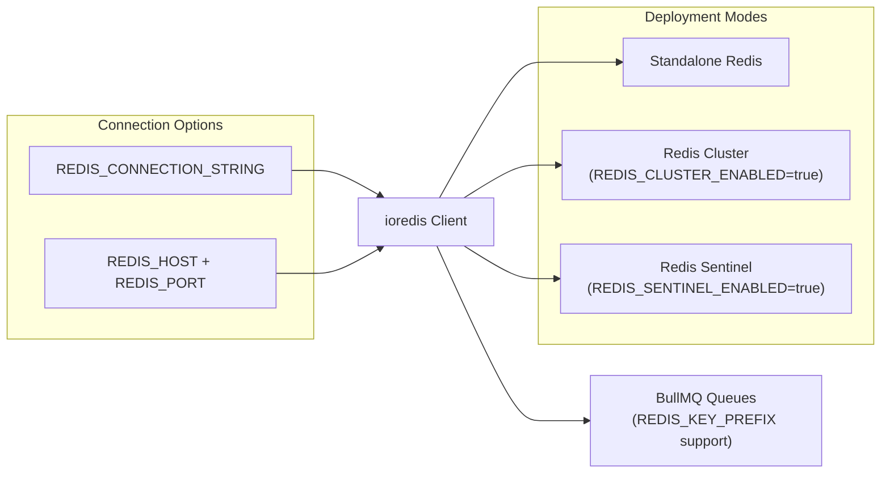
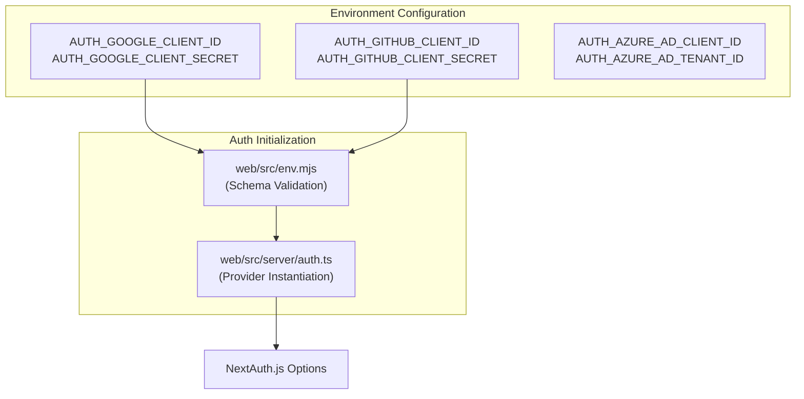

# 환경 구성

<details>
<summary>관련 소스 파일</summary>

다음 파일들은 이 위키 페이지를 생성하기 위한 컨텍스트로 사용되었습니다.

- [.env.dev-azure.example](.env.dev-azure.example)
- [.env.dev-redis-cluster.example](.env.dev-redis-cluster.example)
- [.env.dev.example](.env.dev.example)
- [.env.prod.example](.env.prod.example)
- [.vscode/launch.json](.vscode/launch.json)
- [packages/shared/src/env.ts](packages/shared/src/env.ts)
- [packages/shared/src/server/auth/jumpcloudProvider.ts](packages/shared/src/server/auth/jumpcloudProvider.ts)
- [packages/shared/src/server/index.ts](packages/shared/src/server/index.ts)
- [packages/shared/src/server/queues.ts](packages/shared/src/server/queues.ts)
- [packages/shared/src/server/redis/getQueue.ts](packages/shared/src/server/redis/getQueue.ts)
- [web/src/components/layouts/app-layout/utils/pathClassification.ts](web/src/components/layouts/app-layout/utils/pathClassification.ts)
- [web/src/ee/features/multi-tenant-sso/types.ts](web/src/ee/features/multi-tenant-sso/types.ts)
- [web/src/ee/features/multi-tenant-sso/utils.ts](web/src/ee/features/multi-tenant-sso/utils.ts)
- [web/src/env.mjs](web/src/env.mjs)
- [web/src/features/auth-credentials/components/ResetPasswordButton.tsx](web/src/features/auth-credentials/components/ResetPasswordButton.tsx)
- [web/src/features/auth-credentials/components/ResetPasswordPage.tsx](web/src/features/auth-credentials/components/ResetPasswordPage.tsx)
- [web/src/features/auth-credentials/lib/credentialsUtils.ts](web/src/features/auth-credentials/lib/credentialsUtils.ts)
- [web/src/features/auth-credentials/server/signupApiHandler.ts](web/src/features/auth-credentials/server/signupApiHandler.ts)
- [web/src/features/posthog-analytics/usePostHogClientCapture.ts](web/src/features/posthog-analytics/usePostHogClientCapture.ts)
- [web/src/pages/api/admin/bullmq/index.ts](web/src/pages/api/admin/bullmq/index.ts)
- [web/src/pages/api/auth/signup-verify.ts](web/src/pages/api/auth/signup-verify.ts)
- [web/src/pages/auth/setup-password.tsx](web/src/pages/auth/setup-password.tsx)
- [web/src/pages/auth/sign-in.tsx](web/src/pages/auth/sign-in.tsx)
- [web/src/pages/auth/sign-up.tsx](web/src/pages/auth/sign-up.tsx)
- [web/src/server/auth.ts](web/src/server/auth.ts)
- [web/types/next-auth.d.ts](web/types/next-auth.d.ts)
- [worker/src/app.ts](worker/src/app.ts)
- [worker/src/env.ts](worker/src/env.ts)
- [worker/src/features/tokenisation/usage.ts](worker/src/features/tokenisation/usage.ts)
- [worker/src/queues/ingestionQueue.ts](worker/src/queues/ingestionQueue.ts)
- [worker/src/queues/workerManager.ts](worker/src/queues/workerManager.ts)
- [worker/src/utils/shutdown.ts](worker/src/utils/shutdown.ts)

</details>


## 목적과 범위

이 문서는 Langfuse service를 구성하는 데 사용되는 environment variable configuration system을 설명합니다. environment variable이 web 및 worker application 전반에서 어떻게 validate, load, use되는지 다룹니다. 이 시스템은 Next.js web service와 Express 기반 worker service 모두가 일관된 infrastructure configuration에 access할 수 있게 하면서, service-specific tuning parameter를 유지하도록 보장합니다.

---

## Configuration Architecture

### Validation System

Langfuse는 startup 시 environment variable을 validate하기 위해 web service에는 [t3-oss/env-nextjs](https://github.com/t3-oss/env-nextjs)를 사용하고, worker 및 shared package에는 Zod schema를 사용합니다. 이를 통해 누락되었거나 잘못된 configuration으로 인한 runtime error를 방지합니다.

**Environment Validation Flow**

```mermaid
graph TB
    ["process.env / .env file"] --> WebEnv["web/src/env.mjs<br/>createEnv()"]
    ["process.env / .env file"] --> WorkerEnv["worker/src/env.ts<br/>EnvSchema.parse()"]
    ["process.env / .env file"] --> SharedEnv["packages/shared/src/env.ts<br/>EnvSchema.parse()"]
    
    subgraph "Web Service"
        WebEnv --> WebValidation["Zod Schema Validation<br/>(Server + Client)"]
        WebValidation -->|Valid| WebApp["Next.js Application"]
    end
    
    subgraph "Worker Service"
        WorkerEnv --> WorkerValidation["Zod Schema Validation"]
        WorkerValidation -->|Valid| WorkerApp["Express Application"]
    end
    
    subgraph "Shared Package"
        SharedEnv --> SharedValidation["Zod Schema Validation"]
        SharedValidation -->|Valid| SharedExports["Exported env object"]
    end
    
    WebValidation -->|Invalid| Error["Startup Error<br/>Descriptive validation message"]
    WorkerValidation -->|Invalid| Error
    SharedValidation -->|Invalid| Error
    
    SharedExports --> WebApp
    SharedExports --> WorkerApp
```

**출처:** [web/src/env.mjs:40-45](), [worker/src/env.ts:4-222](), [packages/shared/src/env.ts:1-10]()

### Configuration Files

| File | Purpose | Validation Library |
|------|---------|-------------------|
| `web/src/env.mjs` | Web-specific configuration(Auth provider, UI flag, Public API) | `@t3-oss/env-nextjs` [web/src/env.mjs:2-40]() |
| `worker/src/env.ts` | Worker-specific configuration(Queue concurrency, Batch limit) | `zod` [worker/src/env.ts:4-222]() |
| `packages/shared/src/env.ts` | Shared infra(PostgreSQL, ClickHouse, Redis, S3, Queue) | `zod` [packages/shared/src/env.ts:4-346]() |
| `.env.prod.example` | Production reference template | N/A |

**Docker Build Skip Validation:** `DOCKER_BUILD=1`이 설정되면 web 및 worker environment 모두 validation을 건너뜁니다 [web/src/env.mjs:800](), [worker/src/env.ts:428](). 이를 통해 모든 runtime secret이 없어도 container를 build할 수 있습니다.

**출처:** [web/src/env.mjs:1-800](), [worker/src/env.ts:1-431](), [packages/shared/src/env.ts:1-346]()

---

## Core Infrastructure Configuration

### Database Configuration

**PostgreSQL (Metadata Store)**

Langfuse는 PostgreSQL ORM으로 Prisma를 사용합니다. `DATABASE_URL`은 일반 application query에 사용되며, PgBouncer 같은 connection pooler를 사용하는 경우 migration에는 `DIRECT_URL`이 권장됩니다.

| Variable | Required | Default | Description |
|----------|----------|---------|-------------|
| `DATABASE_URL` | Yes | - | PostgreSQL connection string [web/src/env.mjs:46]() |
| `DIRECT_URL` | No | `DATABASE_URL` | migration을 위한 direct connection [.env.prod.example:10]() |
| `LANGFUSE_AUTO_POSTGRES_MIGRATION_DISABLED` | No | `false` | Docker start 시 automatic migration 비활성화 [.env.prod.example:13]() |

**ClickHouse (Analytics & Events)**

ClickHouse는 대용량 event data를 저장합니다. configuration은 성능을 위해 cluster mode와 asynchronous insert를 지원합니다.

| Variable | Required | Default | Description |
|----------|----------|---------|-------------|
| `CLICKHOUSE_URL` | Yes | - | ClickHouse HTTP endpoint [packages/shared/src/env.ts:81]() |
| `CLICKHOUSE_USER` | Yes | - | ClickHouse username [packages/shared/src/env.ts:86]() |
| `CLICKHOUSE_PASSWORD` | Yes | - | ClickHouse password [packages/shared/src/env.ts:87]() |
| `CLICKHOUSE_CLUSTER_ENABLED` | No | `true` | cluster mode 활성화 [worker/src/env.ts:110]() |
| `CLICKHOUSE_ASYNC_INSERT_BUSY_TIMEOUT_MS` | No | - | async insert timeout [packages/shared/src/env.ts:92]() |
| `CLICKHOUSE_USE_LIGHTWEIGHT_UPDATE` | No | `false` | deletion에 lightweight update 사용 [packages/shared/src/env.ts:101]() |

**출처:** [packages/shared/src/env.ts:81-116](), [worker/src/env.ts:105-110]()

### Redis Configuration

Redis는 BullMQ queue와 distributed caching에 필수적입니다. Langfuse는 Standalone, Cluster, Sentinel mode를 지원합니다.



| Variable | Default | Description |
|----------|---------|-------------|
| `REDIS_CONNECTION_STRING` | - | 전체 connection URL(우선 적용) [packages/shared/src/env.ts:29]() |
| `REDIS_HOST` | - | Redis host [packages/shared/src/env.ts:20]() |
| `REDIS_KEY_PREFIX` | - | multi-tenant Redis isolation을 위한 prefix [packages/shared/src/env.ts:32]() |
| `REDIS_TLS_ENABLED` | `false` | TLS 활성화 [packages/shared/src/env.ts:33]() |
| `REDIS_CLUSTER_ENABLED` | `false` | Cluster mode 활성화 [packages/shared/src/env.ts:46]() |
| `REDIS_SENTINEL_ENABLED` | `false` | Sentinel mode 활성화 [packages/shared/src/env.ts:53]() |

**출처:** [packages/shared/src/env.ts:20-57](), [.env.dev.example:118-129]()

### S3 and Blob Storage

Langfuse는 ingestion event, multimodal media, batch export라는 서로 다른 목적을 위해 S3-compatible storage를 사용합니다.

| Feature | Bucket Variable | Prefix Variable |
|---------|-----------------|-----------------|
| **Events** | `LANGFUSE_S3_EVENT_UPLOAD_BUCKET` | `LANGFUSE_S3_EVENT_UPLOAD_PREFIX` |
| **Media** | `LANGFUSE_S3_MEDIA_UPLOAD_BUCKET` | `LANGFUSE_S3_MEDIA_UPLOAD_PREFIX` |
| **Exports** | `LANGFUSE_S3_BATCH_EXPORT_BUCKET` | `LANGFUSE_S3_BATCH_EXPORT_PREFIX` |

**Common S3 Settings:**
- `LANGFUSE_S3_*_ENDPOINT`: MinIO/S3-compatible service를 위한 custom endpoint [worker/src/env.ts:46]().
- `LANGFUSE_S3_*_FORCE_PATH_STYLE`: MinIO에 필요합니다 [worker/src/env.ts:49]().
- `LANGFUSE_S3_*_SSE`: Server-side encryption(`AES256` 또는 `aws:kms`) [worker/src/env.ts:52]().

**출처:** [worker/src/env.ts:27-53](), [packages/shared/src/env.ts:174-204]()

---

## Authentication Configuration

### Static OAuth Providers

Langfuse는 다양한 identity provider를 지원하기 위해 NextAuth.js와 통합됩니다. 이들은 environment variable을 통해 구성되며 web service의 `staticProviders` array에 load됩니다 [web/src/server/auth.ts:90-161]().



| Provider | Key Variables |
|----------|---------------|
| **Google** | `AUTH_GOOGLE_CLIENT_ID`, `AUTH_GOOGLE_CLIENT_SECRET` [web/src/env.mjs:113-114]() |
| **GitHub** | `AUTH_GITHUB_CLIENT_ID`, `AUTH_GITHUB_CLIENT_SECRET` [web/src/env.mjs:120-121]() |
| **Azure AD** | `AUTH_AZURE_AD_CLIENT_ID`, `AUTH_AZURE_AD_TENANT_ID` [web/src/env.mjs:141-143]() |
| **Okta** | `AUTH_OKTA_CLIENT_ID`, `AUTH_OKTA_ISSUER` [web/src/env.mjs:148-150]() |
| **Custom OIDC** | `AUTH_CUSTOM_CLIENT_ID`, `AUTH_CUSTOM_ISSUER`, `AUTH_CUSTOM_NAME` [web/src/env.mjs:199-202]() |

**Global Auth Variables:**
- `NEXTAUTH_SECRET`: session cookie signing을 위한 secret [web/src/env.mjs:49]().
- `SALT`: API key hashing에 사용됩니다 [web/src/env.mjs:70]().
- `ENCRYPTION_KEY`: sensitive data를 위한 256-bit key [packages/shared/src/env.ts:58]().
- `AUTH_DISABLE_SIGNUP`: new user registration을 비활성화합니다 [web/src/env.mjs:228]().

**출처:** [web/src/env.mjs:94-230](), [web/src/server/auth.ts:90-523]()

---

## Service Tuning (Worker)

worker service는 서로 다른 workload를 처리하기 위해 concurrency 및 batching parameter로 조정됩니다.

### Queue Concurrency

Worker는 특정 concurrency limit과 함께 `WorkerManager`에 등록됩니다 [worker/src/app.ts:126-200]().

| Variable | Default | Description |
|----------|---------|-------------|
| `LANGFUSE_INGESTION_QUEUE_PROCESSING_CONCURRENCY` | `20` | 표준 ingestion job [worker/src/env.ts:81]() |
| `LANGFUSE_TRACE_UPSERT_WORKER_CONCURRENCY` | `25` | Trace metadata update [worker/src/env.ts:119]() |
| `LANGFUSE_EVAL_EXECUTION_WORKER_CONCURRENCY` | `5` | LLM-as-a-judge execution [worker/src/env.ts:127]() |
| `LANGFUSE_OTEL_INGESTION_QUEUE_PROCESSING_CONCURRENCY` | `5` | OTel span processing [worker/src/env.ts:70]() |

### ClickHouse Write Performance

worker는 configurable batch size와 interval을 통해 ClickHouse에 대한 대용량 write를 최적화합니다.

| Variable | Default | Description |
|----------|---------|-------------|
| `LANGFUSE_INGESTION_CLICKHOUSE_WRITE_BATCH_SIZE` | `1000` | batch당 record 수 [worker/src/env.ts:90]() |
| `LANGFUSE_INGESTION_CLICKHOUSE_WRITE_INTERVAL_MS` | `1000` | Flush interval [worker/src/env.ts:94]() |
| `LANGFUSE_INGESTION_CLICKHOUSE_MAX_ATTEMPTS` | `3` | transient error에 대한 retry [worker/src/env.ts:98]() |

**출처:** [worker/src/env.ts:70-134](), [worker/src/app.ts:126-200]()

---

## Feature Flags and Operational Controls

| Variable | Default | Description |
|----------|---------|-------------|
| `LANGFUSE_ENABLE_EXPERIMENTAL_FEATURES` | `false` | unreleased UI/API feature를 활성화합니다 [web/src/env.mjs:69]() |
| `LANGFUSE_ENABLE_BACKGROUND_MIGRATIONS` | `true` | background에서 ClickHouse schema update를 허용합니다 [worker/src/env.ts:161]() |
| `LANGFUSE_ENABLE_REDIS_SEEN_EVENT_CACHE` | `false` | ingestion event deduplication [worker/src/env.ts:165]() |
| `LANGFUSE_SKIP_INGESTION_CLICKHOUSE_READ_PROJECT_IDS` | `""` | ingestion 중 read를 건너뛰기 위한 performance optimization [worker/src/env.ts:150]() |
| `LANGFUSE_LOG_LEVEL` | `info` | Logging verbosity [packages/shared/src/env.ts:169]() |
| `LANGFUSE_ENABLE_BLOB_STORAGE_FILE_LOG` | `true` | ClickHouse `blob_storage_file_log` table에서 S3 upload를 추적합니다 [worker/src/env.ts:169]() |
| `LANGFUSE_INGESTION_QUEUE_DELAY_MS` | `15000` | out-of-order write 처리를 위한 event processing delay [packages/shared/src/env.ts:125-128]() |

**출처:** [web/src/env.mjs:69](), [worker/src/env.ts:150-171](), [packages/shared/src/env.ts:125-172]()
