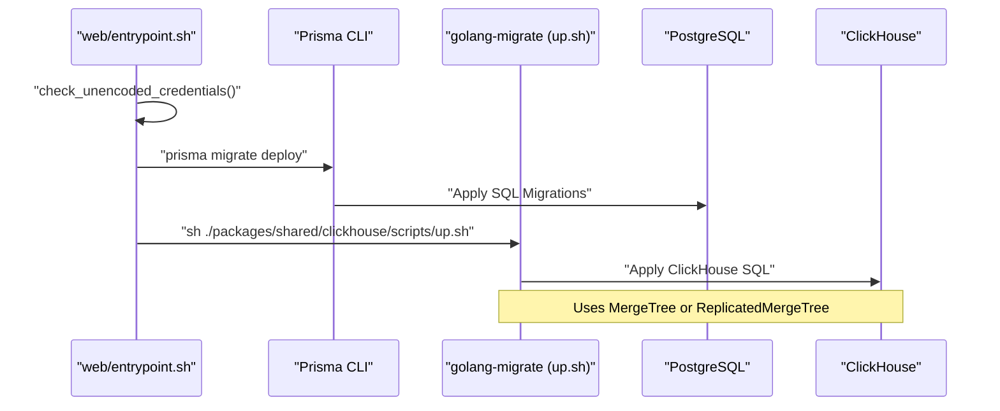

# 서비스 실행

<details>
<summary>관련 소스 파일</summary>

다음 파일들은 이 위키 페이지를 생성하기 위한 컨텍스트로 사용되었습니다.

- [.dockerignore](.dockerignore)
- [docker-compose.build.yml](docker-compose.build.yml)
- [docker-compose.dev-azure.yml](docker-compose.dev-azure.yml)
- [docker-compose.dev-redis-cluster.yml](docker-compose.dev-redis-cluster.yml)
- [docker-compose.dev.yml](docker-compose.dev.yml)
- [docker-compose.yml](docker-compose.yml)
- [packages/shared/clickhouse/scripts/down.sh](packages/shared/clickhouse/scripts/down.sh)
- [packages/shared/clickhouse/scripts/drop.sh](packages/shared/clickhouse/scripts/drop.sh)
- [packages/shared/clickhouse/scripts/up.sh](packages/shared/clickhouse/scripts/up.sh)
- [packages/shared/src/db.ts](packages/shared/src/db.ts)
- [web/entrypoint.sh](web/entrypoint.sh)
- [web/src/pages/api/public/health.ts](web/src/pages/api/public/health.ts)
- [web/src/pages/api/public/ready.ts](web/src/pages/api/public/ready.ts)
- [web/src/utils/shutdown.ts](web/src/utils/shutdown.ts)
- [worker/entrypoint.sh](worker/entrypoint.sh)
- [worker/src/api/index.ts](worker/src/api/index.ts)
- [worker/src/features/health/index.ts](worker/src/features/health/index.ts)

</details>


이 페이지는 development 및 production environment 모두에서 Langfuse service를 시작하고 실행하는 방법을 문서화합니다. infrastructure setup, database migration, service startup command, health monitoring을 다룹니다.

environment variable 구성에 대한 정보는 [Environment Configuration (2.2)]()를 참조하세요. monorepo structure와 package organization에 대한 자세한 내용은 [Monorepo Structure (1.2)]()를 참조하세요.

---

## Infrastructure Services

Langfuse가 작동하려면 여러 infrastructure service가 필요합니다. 이들은 local development 및 self-hosting을 위해 Docker Compose로 orchestrate됩니다.

### Core Components
*   **PostgreSQL**: Transactional data(User, Organization, Project, Prompt 등)를 저장합니다 [docker-compose.yml:11]().
*   **ClickHouse**: 대용량 observability data(Trace, Observation, Score)를 저장합니다 [docker-compose.yml:17]().
*   **Redis**: queue system(BullMQ), rate limiting, caching을 구동합니다 [docker-compose.yml:15](), [web/src/utils/shutdown.ts:10-13]().
*   **MinIO**: raw event upload, media, batch export를 위한 S3-compatible blob storage를 제공합니다 [docker-compose.yml:111-131]().

### Service Orchestration
시스템은 environment에 따라 서로 다른 Docker Compose file을 사용합니다.
*   `docker-compose.yml`: web 및 worker service용 production-ready image [docker-compose.yml:7-72]().
*   `docker-compose.dev.yml`: local development를 위한 infrastructure-only setup입니다. testing을 위해 ClickHouse 25.12 같은 최신 version을 사용합니다 [docker-compose.dev.yml:1-5]().
*   `docker-compose.build.yml`: local source code에서 service를 build하는 데 사용되며, 모든 component에 대한 health check를 제공합니다 [docker-compose.build.yml:3-67]().

**Diagram: Infrastructure Architecture**

```mermaid
flowchart TB
    subgraph "Client_Space"
        [User] --> ["UI, API, SDKs"]
    end

    subgraph "Service_Space"
        [Web_Service] --> ["Next.js (web/Dockerfile)"]
        [Worker_Service] --> ["Express/BullMQ (worker/Dockerfile)"]
    end

    subgraph "Infrastructure_Space"
        [Postgres_DB] --> ["PostgreSQL (OLTP)<br/>Transactional Data"]
        [Redis_Server] --> ["Redis (BullMQ)<br/>Cache, Queue, RateLimit"]
        [Clickhouse_DB] --> ["ClickHouse (OLAP)<br/>Observability Data"]
        [Minio_S3] --> ["MinIO / S3 Storage<br/>Raw events, media"]
    end

    [User] --> [Web_Service]
    [Web_Service] --> [Postgres_DB]
    [Web_Service] --> [Clickhouse_DB]
    [Web_Service] --> [Redis_Server]
    [Web_Service] --> [Minio_S3]

    [Redis_Server] --> [Worker_Service]
    [Worker_Service] --> [Clickhouse_DB]
    [Worker_Service] --> [Postgres_DB]
    [Worker_Service] --> [Minio_S3]
```

출처: [docker-compose.yml:6-145](), [docker-compose.dev.yml:1-86](), [docker-compose.build.yml:2-81]()

---

## Database Migrations

Langfuse는 relational database와 analytical database에 대해 이중 migration strategy를 사용합니다. `web/entrypoint.sh` script는 startup 중 이 process를 자동화합니다.

### PostgreSQL Migrations (Prisma)
PostgreSQL migration은 Prisma를 통해 관리됩니다. 
1.  **Credential Validation**: `check_unencoded_credentials()`는 Prisma `P1013` error를 방지하기 위해 `DATABASE_URL`에 percent-encoding이 필요한 특수 문자(예: `@`, `:`, `/`, `#`)가 포함되어 있는지 확인합니다 [web/entrypoint.sh:8-37]().
2.  **Cleanup**: `cleanup.sql`로 `prisma db execute`를 실행합니다 [web/entrypoint.sh:91]().
3.  **Deployment**: shared schema를 사용해 `prisma migrate deploy`를 실행합니다 [web/entrypoint.sh:94]().

### ClickHouse Migrations (golang-migrate)
ClickHouse migration은 `golang-migrate`를 감싼 shell wrapper를 통해 실행됩니다.
1.  **Password Validation**: `check_clickhouse_password()`는 password가 query-string interpolation을 깨뜨리지 않도록 보장합니다 [web/entrypoint.sh:42-57]().
2.  **Engine Selection**: `up.sh` script는 `CLICKHOUSE_CLUSTER_ENABLED`에 따라 `MergeTree`(unclustered)와 `ReplicatedMergeTree`(clustered) 중 하나를 선택합니다 [packages/shared/clickhouse/scripts/up.sh:54-72]().
3.  **Migration Execution**: SQL file은 `clickhouse/migrations/unclustered` 또는 `clustered`에서 적용됩니다 [packages/shared/clickhouse/scripts/up.sh:62,71]().

**Diagram: Migration Sequence**



출처: [web/entrypoint.sh:8-125](), [packages/shared/clickhouse/scripts/up.sh:1-73]()

---

## Health Monitoring & Shutdown

### Health Checks
두 service 모두 container orchestrator에서 사용하는 health 및 readiness endpoint를 제공합니다.
*   **Web Health**: `/api/public/health`는 PostgreSQL connectivity를 확인하고 선택적으로 ClickHouse의 recent event ingestion을 검증합니다 [web/src/pages/api/public/health.ts:14-113]().
*   **Worker Health**: `/health` 및 `/ready` endpoint는 worker process와 dependency가 정상적으로 작동하는지 확인하기 위해 `checkContainerHealth()`를 호출합니다 [worker/src/api/index.ts:8-30]().

### Graceful Shutdown
application은 특히 Docker/Kubernetes environment에서 중요한 `SIGTERM` 및 `SIGINT` signal을 처리하기 위해 custom shutdown logic을 구현합니다.
1.  **Signal Capture**: global `sigtermReceived` flag를 설정합니다 [web/src/utils/shutdown.ts:23-30]().
2.  **Timeout**: inflight request가 완료되도록 110초 동안 기다립니다 [web/src/utils/shutdown.ts:15,39]().
3.  **Connection Cleanup**: `RateLimitService`, `ClickHouseClientManager`, Redis, Prisma에 대한 connection을 닫습니다 [web/src/utils/shutdown.ts:40-58]().

출처: [web/src/pages/api/public/health.ts:14-113](), [worker/src/api/index.ts:1-32](), [web/src/utils/shutdown.ts:1-63]()

---

## Running Services

### Local Development Commands
Service execution은 `turbo`와 `pnpm`으로 orchestrate됩니다.

| Service | Command | Description |
| :--- | :--- | :--- |
| **Full Stack** | `pnpm run dev` | web 및 worker service를 동시에 시작합니다. |
| **Web Only** | `pnpm run dev:web` | Next.js app을 development mode로 시작합니다. |
| **Worker Only** | `pnpm run dev:worker` | worker service를 watch mode로 시작합니다. |
| **Infrastructure** | `docker compose up` | 필요한 database와 storage를 시작합니다. |

### Container Execution Flow
Docker environment에서 web 및 worker service 모두 application을 시작하기 전에 environment가 준비되었는지 확인하기 위해 entrypoint script를 활용합니다.

1.  **Environment Check**: `DATABASE_URL`, `CLICKHOUSE_URL` 같은 필수 variable을 validate합니다. 누락된 경우 개별 host/user/pass variable에서 구성하려고 시도합니다 [web/entrypoint.sh:61-82]().
2.  **Migration**: `LANGFUSE_AUTO_POSTGRES_MIGRATION_DISABLED` 또는 `LANGFUSE_AUTO_CLICKHOUSE_MIGRATION_DISABLED`를 통해 명시적으로 비활성화되지 않는 한 PostgreSQL 및 ClickHouse migration을 실행합니다 [web/entrypoint.sh:89-115]().
3.  **Process Handover**: `exec "$@"`를 사용해 container에 전달된 command를 실행합니다 [web/entrypoint.sh:128]().

출처: [web/entrypoint.sh:1-128](), [docker-compose.yml:7-89](), [docker-compose.build.yml:1-154]()
