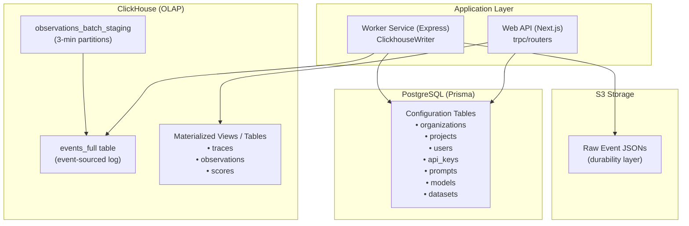
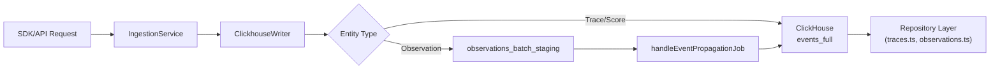
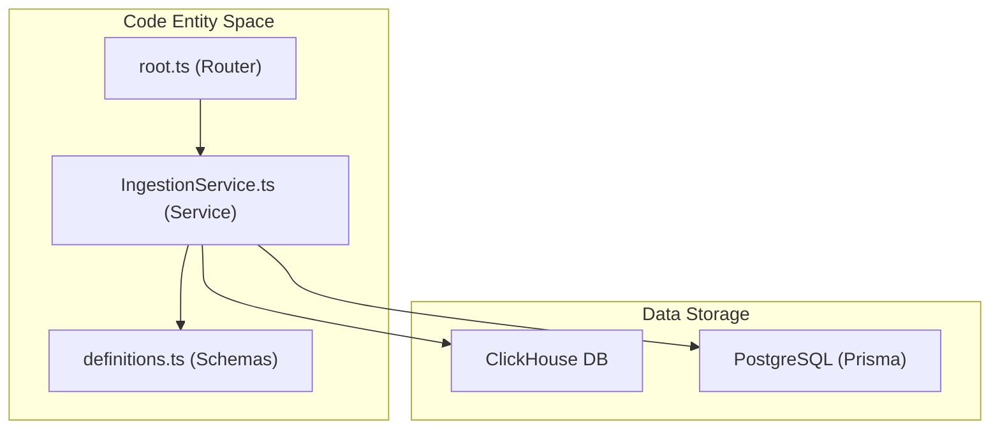

# 데이터 아키텍처

관련 소스 파일

다음 파일들은 이 위키 페이지를 생성하기 위한 컨텍스트로 사용되었습니다.

- [fern/apis/server/definition/ingestion.yml](fern/apis/server/definition/ingestion.yml)
- [packages/shared/clickhouse/scripts/dev-tables.sh](packages/shared/clickhouse/scripts/dev-tables.sh)
- [packages/shared/prisma/schema.prisma](packages/shared/prisma/schema.prisma)
- [packages/shared/src/server/ingestion/types.ts](packages/shared/src/server/ingestion/types.ts)
- [packages/shared/src/server/queries/clickhouse-sql/clickhouse-filter.ts](packages/shared/src/server/queries/clickhouse-sql/clickhouse-filter.ts)
- [packages/shared/src/server/redis/eventPropagationQueue.ts](packages/shared/src/server/redis/eventPropagationQueue.ts)
- [packages/shared/src/server/repositories/definitions.ts](packages/shared/src/server/repositories/definitions.ts)
- [packages/shared/src/server/test-utils/tracing-factory.ts](packages/shared/src/server/test-utils/tracing-factory.ts)
- [packages/shared/src/utils/json.ts](packages/shared/src/utils/json.ts)
- [web/src/__tests__/organization-settings-pages.clienttest.tsx](web/src/__tests__/organization-settings-pages.clienttest.tsx)
- [web/src/features/audit-logs/auditLog.ts](web/src/features/audit-logs/auditLog.ts)
- [web/src/features/models/components/ModelSettings.tsx](web/src/features/models/components/ModelSettings.tsx)
- [web/src/pages/organization/[organizationId]/settings/index.tsx](web/src/pages/organization/[organizationId]/settings/index.tsx)
- [web/src/pages/project/[projectId]/settings/index.tsx](web/src/pages/project/[projectId]/settings/index.tsx)
- [web/src/server/api/root.ts](web/src/server/api/root.ts)
- [web/src/server/api/routers/public.ts](web/src/server/api/routers/public.ts)
- [worker/src/backgroundMigrations/backfillEventsHistoric.ts](worker/src/backgroundMigrations/backfillEventsHistoric.ts)
- [worker/src/backgroundMigrations/backfillEventsHistoricFromParts.ts](worker/src/backgroundMigrations/backfillEventsHistoricFromParts.ts)
- [worker/src/backgroundMigrations/backfillExperimentsHistoric.ts](worker/src/backgroundMigrations/backfillExperimentsHistoric.ts)
- [worker/src/features/eventPropagation/handleEventPropagationJob.ts](worker/src/features/eventPropagation/handleEventPropagationJob.ts)
- [worker/src/features/eventPropagation/handleExperimentBackfill.ts](worker/src/features/eventPropagation/handleExperimentBackfill.ts)
- [worker/src/services/IngestionService/index.ts](worker/src/services/IngestionService/index.ts)
- [worker/src/services/IngestionService/tests/IngestionService.integration.test.ts](worker/src/services/IngestionService/tests/IngestionService.integration.test.ts)
- [worker/src/services/IngestionService/tests/calculateTokenCost.unit.test.ts](worker/src/services/IngestionService/tests/calculateTokenCost.unit.test.ts)
- [worker/src/services/IngestionService/tests/utils.unit.test.ts](worker/src/services/IngestionService/tests/utils.unit.test.ts)
- [worker/src/services/IngestionService/utils.ts](worker/src/services/IngestionService/utils.ts)

이 페이지는 Langfuse의 데이터 저장 및 검색 시스템 기반이 되는 이중 database 아키텍처를 설명합니다. PostgreSQL(metadata/configuration)과 ClickHouse(observability event)의 분리, trace data를 위한 event-sourcing pattern, 그리고 data access를 추상화하는 repository layer를 다룹니다.

이러한 database로 데이터를 공급하는 ingestion pipeline에 대한 정보는 [Data Ingestion Pipeline](#6)을 참조하세요. 데이터를 비동기적으로 처리하는 worker queue에 대한 자세한 내용은 [Queue & Worker System](#7)을 참조하세요.

## 개요

Langfuse는 transactional metadata와 대용량 observability data의 관심사를 분리하는 **이중 database 아키텍처**를 사용합니다. 이 분리는 configuration change에 대한 ACID 보장을 유지하면서 analytics workload의 horizontal scalability를 가능하게 합니다.

### Database 책임

system architecture는 transactional application state와 높은 처리량의 analytical event 사이의 간극을 연결합니다.

**System Components and Data Storage**

출처: [worker/src/services/ClickhouseWriter/index.ts:56-59](), [packages/shared/clickhouse/scripts/dev-tables.sh:81-137](), [worker/src/services/IngestionService/index.ts:136-146]()

이 아키텍처는 다음을 사용합니다.
- **PostgreSQL**: 사용자 계정, project configuration, dataset, prompt, API key를 위한 ACID-compliant storage입니다. Prisma로 관리됩니다. [packages/shared/prisma/schema.prisma:10-14](), [worker/src/services/IngestionService/index.ts:7-10]()
- **ClickHouse**: trace, observation, score에 대한 analytical query에 최적화된 column-oriented database입니다. [packages/shared/src/server/repositories/definitions.ts:4-15](), [packages/shared/clickhouse/scripts/dev-tables.sh:137-140]()
- **Redis**: rate limiting, BullMQ를 통한 job queuing, event propagation을 위해 마지막으로 처리된 partition tracking에 사용됩니다. [worker/src/features/eventPropagation/handleEventPropagationJob.ts:15-29](), [worker/src/services/IngestionService/index.ts:1-3]()

### Data Flow Pattern

**Data Ingestion and Processing Flow**

출처: [worker/src/services/IngestionService/index.ts:148-194](), [worker/src/features/eventPropagation/handleEventPropagationJob.ts:58-140](), [packages/shared/src/server/repositories/definitions.ts:127-143]()

## PostgreSQL Schema

PostgreSQL은 transactional consistency가 필요한 configuration, user management, metadata를 저장합니다. schema는 Prisma에 정의되어 있으며 multi-tenancy와 configuration을 위한 core entity를 포함합니다.

### Core Entity Groups

| Entity Group | Purpose |
|-------------|---------|
| Multi-tenancy | `Organization` 및 `Project` model을 통한 계층적 isolation. [packages/shared/prisma/schema.prisma:93-116]() |
| Datasets | benchmarking을 위한 `Dataset` 및 `DatasetItem` entity 저장. [packages/shared/prisma/schema.prisma:129-129]() |
| Prompts | versioned prompt management 및 lifecycle tracking. [packages/shared/prisma/schema.prisma:132-132]() |
| Evaluations | evaluation run tracking을 위한 `JobConfiguration` 및 `JobExecution`. [packages/shared/prisma/schema.prisma:135-136]() |

출처: [packages/shared/prisma/schema.prisma:93-150](), [worker/src/services/IngestionService/index.ts:136-146]()

## ClickHouse Schema

ClickHouse는 높은 처리량의 write와 analytical query에 최적화된 event-sourced architecture로 observability data를 저장합니다.

### Events Table Structure

`events_full` table은 tracing data의 주요 destination이며, immutable하게 설계되어 최종적으로 legacy observation table을 대체합니다. core property(trace_id, span_id), model detail, 그리고 performance를 위한 `MATERIALIZED` column을 사용하는 cost calculation field를 포함합니다. [packages/shared/clickhouse/scripts/dev-tables.sh:137-183]()

### Event Propagation and Staging

Langfuse는 incoming observation data를 buffering하기 위해 staging table `observations_batch_staging`을 사용합니다. 이 table은 `s3_first_seen_timestamp` 기반 3분 partition과 12시간 TTL을 사용합니다. [packages/shared/clickhouse/scripts/dev-tables.sh:81-130]() 

`handleEventPropagationJob`은 다음을 수행합니다.
1.  Redis에 저장된 cursor(`LAST_PROCESSED_PARTITION_KEY`)를 사용해 처리할 다음 partition을 가져옵니다. [worker/src/features/eventPropagation/handleEventPropagationJob.ts:15-29](), [worker/src/features/eventPropagation/handleEventPropagationJob.ts:74-102]()
2.  `observations_batch_staging`을 `traces` table과 join하여 trace-level metadata(user_id, session_id, tags)로 event를 enrich합니다. [worker/src/features/eventPropagation/handleEventPropagationJob.ts:142-183]()
3.  enrich된 record를 `events_full`에 insert합니다. [worker/src/features/eventPropagation/handleEventPropagationJob.ts:185-190]()

### Batch Writing

`ClickhouseWriter` class는 record를 buffering하고 ClickHouse로 flush하여 높은 처리량의 write를 관리합니다. write failure를 방지하기 위해 field를 truncate하여 oversized record를 처리합니다. [worker/src/services/ClickhouseWriter/index.ts:56-61]()

## Repository Pattern

repository layer는 ClickHouse query construction을 추상화하고 raw database row와 application domain object 사이의 bridge를 제공합니다.

### Repository Architecture

출처: [packages/shared/src/server/repositories/definitions.ts:1-40](), [web/src/server/api/root.ts:65-123](), [worker/src/services/IngestionService/index.ts:136-146]()

### Core Repository Logic

- **Standardized Schema**: Repository는 `traceRecordReadSchema` 및 `observationRecordReadSchema` 같은 Zod schema를 사용해 ClickHouse type(예: string-encoded Int64)을 TypeScript-native type으로 변환합니다. [packages/shared/src/server/repositories/definitions.ts:155-161](), [packages/shared/src/server/repositories/definitions.ts:63-74]()
- **Data Enrichment**: `IngestionService`는 ClickHouse에 쓰기 전에 prompt 및 model/usage enrichment를 위해 parallel lookup을 수행합니다. [worker/src/services/IngestionService/index.ts:225-235]()
- **Background Migrations**: 대규모 data move를 위해 Langfuse는 database에 과부하를 주지 않도록 ClickHouse data를 chunk 단위로 처리하는 background migration system을 사용합니다. [worker/src/backgroundMigrations/backfillEventsHistoric.ts:23-52]()

---

**자세한 내용은 다음을 참조하세요:**
- [Database Overview](#3.1) — PostgreSQL, ClickHouse, Redis의 목적.
- [PostgreSQL Schema](#3.2) — Organization, Project, User를 위한 Prisma model.
- [ClickHouse Schema](#3.3) — events table structure, materialized view, partitioning strategy 문서화.
- [Events Table & Dual-Write Architecture](#3.4) — event-sourcing pattern 및 propagation logic 설명.
- [Repository Pattern](#3.5) — ClickHouse query를 추상화하는 repository layer 설명.
- [Query Optimization](#3.6) — 복잡한 aggregation을 위한 CTE와 performance pattern 다루기.
