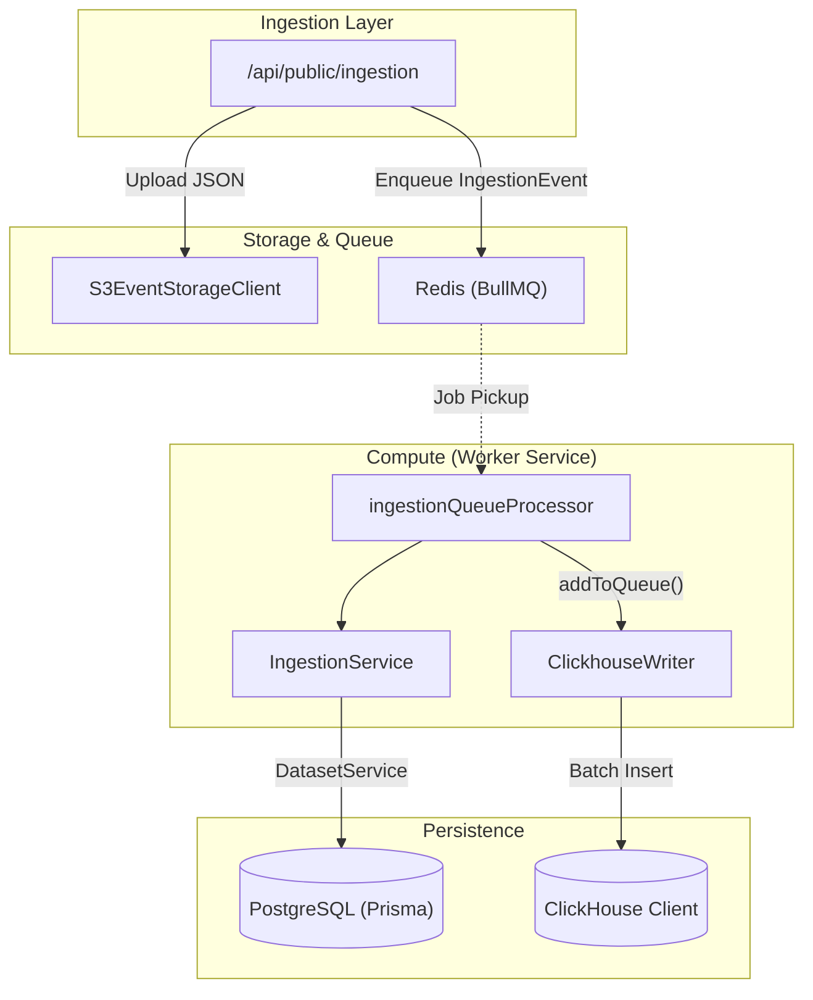
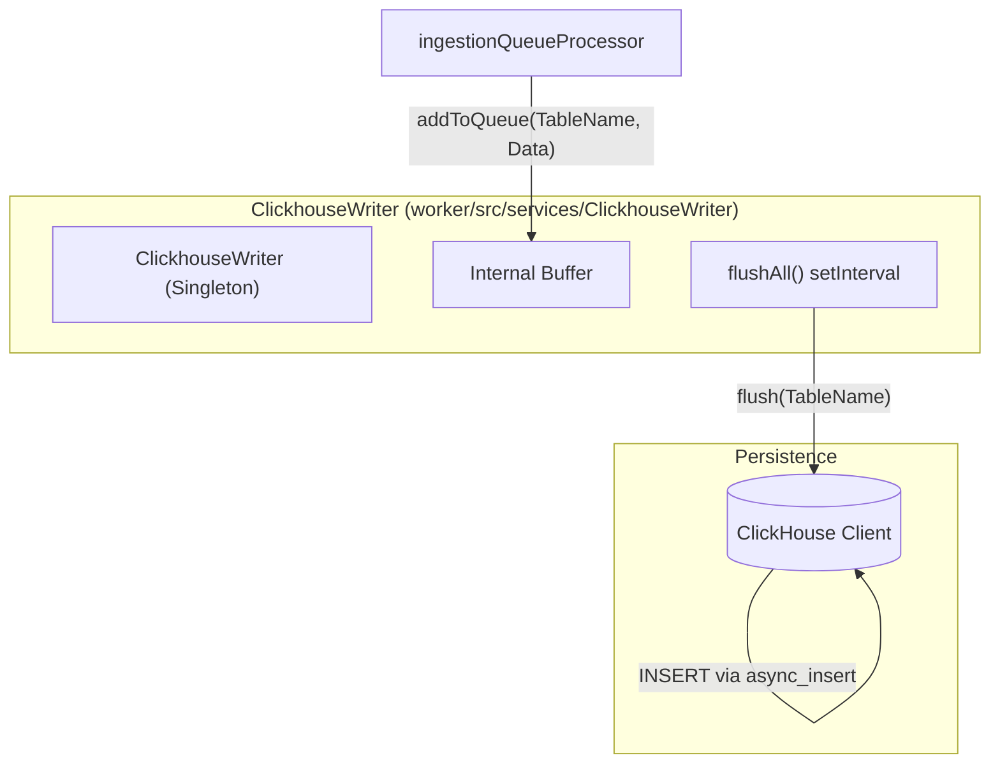

# Database 개요

관련 소스 파일

다음 파일들은 이 위키 페이지를 생성하기 위한 컨텍스트로 사용되었습니다.

- [.env.dev-redis-cluster.example](.env.dev-redis-cluster.example)
- [.vscode/launch.json](.vscode/launch.json)
- [packages/shared/prisma/schema.prisma](packages/shared/prisma/schema.prisma)
- [packages/shared/src/env.ts](packages/shared/src/env.ts)
- [packages/shared/src/server/index.ts](packages/shared/src/server/index.ts)
- [packages/shared/src/server/queues.ts](packages/shared/src/server/queues.ts)
- [packages/shared/src/server/redis/batchExport.ts](packages/shared/src/server/redis/batchExport.ts)
- [packages/shared/src/server/redis/blobStorageIntegrationProcessingQueue.ts](packages/shared/src/server/redis/blobStorageIntegrationProcessingQueue.ts)
- [packages/shared/src/server/redis/createEvalQueue.ts](packages/shared/src/server/redis/createEvalQueue.ts)
- [packages/shared/src/server/redis/datasetRunItemUpsert.ts](packages/shared/src/server/redis/datasetRunItemUpsert.ts)
- [packages/shared/src/server/redis/dlqRetryQueue.ts](packages/shared/src/server/redis/dlqRetryQueue.ts)
- [packages/shared/src/server/redis/getQueue.ts](packages/shared/src/server/redis/getQueue.ts)
- [packages/shared/src/server/redis/ingestionQueue.ts](packages/shared/src/server/redis/ingestionQueue.ts)
- [packages/shared/src/server/redis/redis.ts](packages/shared/src/server/redis/redis.ts)
- [packages/shared/src/server/redis/traceUpsert.ts](packages/shared/src/server/redis/traceUpsert.ts)
- [web/src/__tests__/organization-settings-pages.clienttest.tsx](web/src/__tests__/organization-settings-pages.clienttest.tsx)
- [web/src/features/audit-logs/auditLog.ts](web/src/features/audit-logs/auditLog.ts)
- [web/src/features/models/components/ModelSettings.tsx](web/src/features/models/components/ModelSettings.tsx)
- [web/src/pages/api/admin/bullmq/index.ts](web/src/pages/api/admin/bullmq/index.ts)
- [web/src/pages/organization/[organizationId]/settings/index.tsx](web/src/pages/organization/[organizationId]/settings/index.tsx)
- [web/src/pages/project/[projectId]/settings/index.tsx](web/src/pages/project/[projectId]/settings/index.tsx)
- [web/src/server/api/root.ts](web/src/server/api/root.ts)
- [web/src/server/api/routers/public.ts](web/src/server/api/routers/public.ts)
- [worker/src/__tests__/redisConsumer.test.ts](worker/src/__tests__/redisConsumer.test.ts)
- [worker/src/app.ts](worker/src/app.ts)
- [worker/src/env.ts](worker/src/env.ts)
- [worker/src/features/blobstorage/handleBlobStorageIntegrationSchedule.ts](worker/src/features/blobstorage/handleBlobStorageIntegrationSchedule.ts)
- [worker/src/features/tokenisation/usage.ts](worker/src/features/tokenisation/usage.ts)
- [worker/src/queues/ingestionQueue.ts](worker/src/queues/ingestionQueue.ts)
- [worker/src/queues/workerManager.ts](worker/src/queues/workerManager.ts)
- [worker/src/utils/shutdown.ts](worker/src/utils/shutdown.ts)

이 페이지는 Langfuse에서 사용되는 이중 database 아키텍처를 설명하며 PostgreSQL, ClickHouse, Redis의 목적과 구조를 자세히 다룹니다. 각각의 schema, data flow pattern, 그리고 대용량 LLM observability를 지원하기 위해 이들이 상호작용하는 방식을 설명합니다.

## 아키텍처 목적

Langfuse는 서로 다른 workload 특성에 최적화하기 위해 **split-database architecture**를 사용합니다.

- **PostgreSQL**: 강력한 ACID consistency가 필요한 relational metadata, configuration, low-tenancy data를 위한 primary transactional store입니다. Prisma를 통해 관리됩니다. [packages/shared/prisma/schema.prisma:9-14](), [packages/shared/src/env.ts:1145-1145]()
- **ClickHouse**: analytical query와 time-series aggregation에 최적화된 대용량 observability data(trace, observation, score)를 위한 OLAP database입니다. [packages/shared/src/env.ts:81-87](), [packages/shared/src/server/index.ts:46-48]()
- **Redis**: BullMQ queue management, rate limiting, caching에 사용되는 in-memory store입니다. [packages/shared/src/server/redis/redis.ts:1-12](), [packages/shared/src/env.ts:20-57]()
- **S3/Blob Storage**: ingestion event의 intermediate buffer와 대용량 trace payload 및 batch export의 long-term storage로 사용됩니다. [worker/src/env.ts:41-53](), [worker/src/queues/ingestionQueue.ts:135-137]()

### System Data Flow

다음 다이어그램은 상위 수준 ingestion flow를 data persistence 및 processing을 담당하는 구체적인 code entity에 연결합니다.

**Diagram: Data Flow from Ingestion to Code Persistence Entities**

출처: [worker/src/queues/ingestionQueue.ts:29-80](), [worker/src/services/IngestionService.ts:1-20](), [packages/shared/src/server/queues.ts:14-28](), [packages/shared/src/server/index.ts:54-54]()

## Database 책임

### PostgreSQL (Transactional & Metadata)
PostgreSQL은 strongly-typed relational data를 처리합니다. administrative entity, configuration, experiment의 source of truth입니다.

| Category | Key Models/Tables | Purpose |
|----------|-------------------|---------|
| **Identity** | `User`, `Organization`, `Project` | 핵심 multi-tenancy 및 RBAC hierarchy. [packages/shared/prisma/schema.prisma:48-128]() |
| **Config** | `Prompt`, `Model`, `ScoreConfig` | versioned template, pricing metadata, score definition. [packages/shared/prisma/schema.prisma:132-141]() |
| **Datasets** | `Dataset`, `DatasetItem` | evaluation set을 위한 metadata 및 input. [packages/shared/prisma/schema.prisma:129-129]() |
| **Orchestration**| `JobConfiguration`, `JobExecution` | background evaluation job을 위한 state management. [packages/shared/prisma/schema.prisma:135-136]() |

### ClickHouse (Analytics & Observability)
ClickHouse는 high-cardinality event stream을 저장합니다. 이 아키텍처는 대용량 insert를 관리하기 위해 batched writer를 사용합니다.

| Table/View | Purpose |
|------------|---------|
| `events` | 통합 observability event의 primary destination. [packages/shared/src/server/index.ts:48-48]() |
| `traces` | trace-level metadata 및 indexing을 저장합니다. [packages/shared/src/server/index.ts:107-107]() |
| `observations` | span, generation, event를 저장합니다. [packages/shared/src/server/index.ts:106-106]() |
| `scores` | evaluation result 및 manual annotation을 저장합니다. [packages/shared/src/server/index.ts:5-5]() |
| `blob_storage_file_log` | retention 및 deletion을 위해 S3의 ingestion file을 추적합니다. [worker/src/queues/ingestionQueue.ts:68-81]() |

### Redis (Coordination & Caching)
Redis는 background task coordination과 ingestion performance에 중요합니다.

- **Queue Management**: BullMQ processor를 위한 job data를 저장합니다. Langfuse는 throughput scale을 위해 ingestion 및 trace upsert에 sharded queue를 사용합니다. [packages/shared/src/env.ts:129-158](), [worker/src/app.ts:126-137]()
- **Deduplication Cache**: `langfuse:ingestion:recently-processed`를 통해 짧은 window 내 동일한 S3 event file이 재처리되는 것을 방지합니다. [worker/src/queues/ingestionQueue.ts:84-106]()
- **ClickhouseReadSkipCache**: historic update에 의존하지 않는 project에 대해 ClickHouse read를 건너뛰기 위한 specialized cache입니다. [worker/src/app.ts:119-124]()
- **Rate Limiting**: traffic을 secondary queue로 redirect하기 위한 S3 slowdown tracking에 사용됩니다. [worker/src/queues/ingestionQueue.ts:112-133]()

## Ingestion and Write Path

Langfuse는 높은 throughput을 유지하고 ClickHouse에 대한 작은 insert 수를 최소화하기 위해 `ClickhouseWriter`를 통한 batched write strategy를 사용합니다.

**Diagram: ClickhouseWriter Batched Write Flow**

출처: [worker/src/queues/ingestionQueue.ts:60-81](), [packages/shared/src/env.ts:91-93](), [worker/src/env.ts:90-97]()

## Implementation Details

### Redis Instance Management
Redis connection은 robust retry strategy로 관리되며 다양한 topology(Standalone, Cluster, Sentinel)를 지원합니다.

- **Retry Strategy**: retry 사이에 최소 1초, 최대 20초의 exponential backoff를 구현합니다. [packages/shared/src/server/redis/redis.ts:16-24]()
- **TLS Support**: managed Redis instance에 대한 secure connection을 위해 environment variable로 구성 가능합니다. [packages/shared/src/server/redis/redis.ts:62-103]()
- **Cluster/Sentinel**: `REDIS_CLUSTER_ENABLED` 및 `REDIS_SENTINEL_ENABLED`를 위한 specialized instantiation logic입니다. [packages/shared/src/server/redis/redis.ts:105-181]()

### Data Access Patterns
codebase는 이중 database 분리를 처리하기 위해 database operation을 추상화합니다.

- **tRPC API**: 내부 web UI는 PostgreSQL(Prisma를 통해)과 ClickHouse(repository를 통해) 모두와 상호작용하는 tRPC router(예: `traceRouter`, `observationsRouter`)를 사용합니다. [web/src/server/api/root.ts:65-123]()
- **Worker Manager**: BullMQ worker 등록을 중앙화하며, queue length, processing time, failure rate에 대한 표준화된 metric으로 processor를 wrapping합니다. [worker/src/queues/workerManager.ts:41-109]()
- **ClickhouseReadSkipCache**: newer project에 대한 불필요한 OLAP lookup을 피하여 ingestion을 최적화하기 위해 worker startup 시 초기화됩니다. [worker/src/app.ts:119-124]()

출처: [packages/shared/src/server/redis/redis.ts:1-225](), [worker/src/queues/workerManager.ts:127-185](), [web/src/server/api/root.ts:1-127]()
