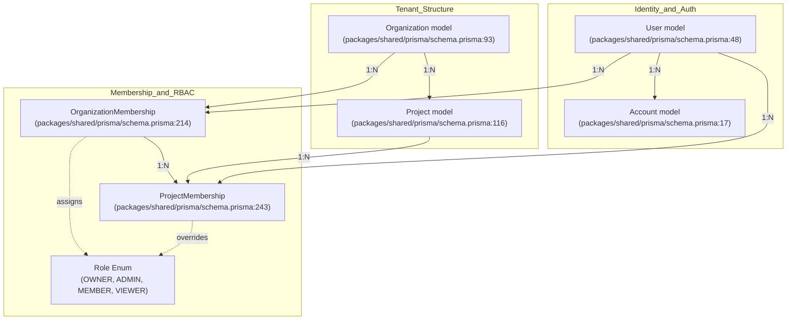
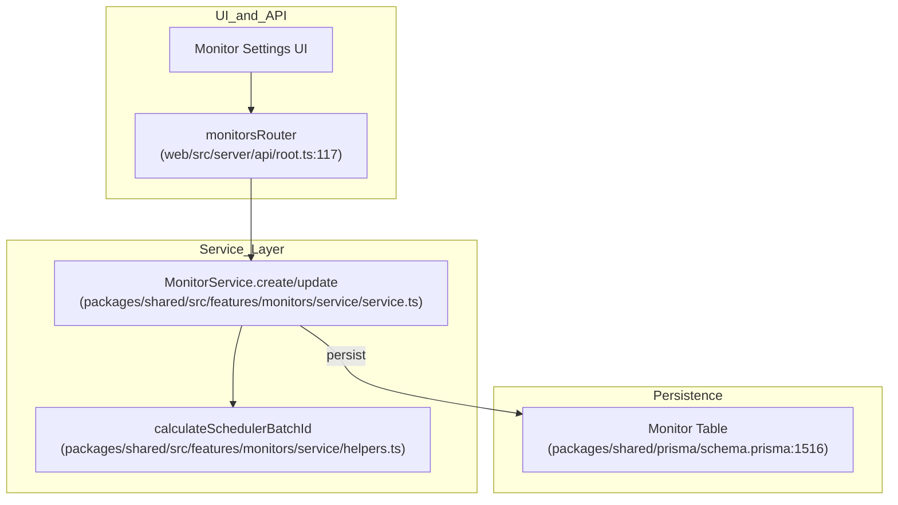

# PostgreSQL Schema

관련 소스 파일

다음 파일들은 이 위키 페이지를 생성하기 위한 컨텍스트로 사용되었습니다.

- [packages/shared/prisma/schema.prisma](packages/shared/prisma/schema.prisma)
- [packages/shared/src/features/monitors/service/helpers.test.ts](packages/shared/src/features/monitors/service/helpers.test.ts)
- [packages/shared/src/features/monitors/service/helpers.ts](packages/shared/src/features/monitors/service/helpers.ts)
- [packages/shared/src/features/monitors/service/service.ts](packages/shared/src/features/monitors/service/service.ts)
- [packages/shared/src/features/monitors/service/types.test.ts](packages/shared/src/features/monitors/service/types.test.ts)
- [packages/shared/src/features/monitors/service/types.ts](packages/shared/src/features/monitors/service/types.ts)
- [web/src/__tests__/organization-settings-pages.clienttest.tsx](web/src/__tests__/organization-settings-pages.clienttest.tsx)
- [web/src/__tests__/server/monitorService.servertest.ts](web/src/__tests__/server/monitorService.servertest.ts)
- [web/src/__tests__/server/monitors.servertest.ts](web/src/__tests__/server/monitors.servertest.ts)
- [web/src/features/audit-logs/auditLog.ts](web/src/features/audit-logs/auditLog.ts)
- [web/src/features/feature-flags/available-flags.ts](web/src/features/feature-flags/available-flags.ts)
- [web/src/features/models/components/ModelSettings.tsx](web/src/features/models/components/ModelSettings.tsx)
- [web/src/features/rbac/constants/projectAccessRights.ts](web/src/features/rbac/constants/projectAccessRights.ts)
- [web/src/pages/organization/[organizationId]/settings/index.tsx](web/src/pages/organization/[organizationId]/settings/index.tsx)
- [web/src/pages/project/[projectId]/settings/index.tsx](web/src/pages/project/[projectId]/settings/index.tsx)
- [web/src/server/api/root.ts](web/src/server/api/root.ts)
- [web/src/server/api/routers/public.ts](web/src/server/api/routers/public.ts)

PostgreSQL은 Langfuse의 primary metadata 및 configuration database 역할을 합니다. organization structure, user account, project setting, evaluation configuration, dataset definition, prompt version을 저장합니다. 대용량 observability event는 ClickHouse에 저장되지만, PostgreSQL은 platform의 configuration 및 management layer에 대한 relational integrity를 유지합니다.

이중 database 아키텍처에 대한 정보는 [3.1 Database Overview]()를 참조하세요. observability event를 포함하는 ClickHouse schema는 [3.3 ClickHouse Schema]()를 참조하세요.

## Schema 개요

PostgreSQL schema는 Prisma ORM을 통해 관리되며 [packages/shared/prisma/schema.prisma:1-1254]()에 정의되어 있습니다. 유연한 metadata를 위한 JSONB, 효율적인 검색을 위한 GIN index, 성능 좋은 data retrieval을 위한 relation join 같은 고급 PostgreSQL 기능을 활용합니다.

**주요 기술적 특성:**
- **ORM**: `views`, `relationJoins`, `metrics`를 지원하는 Prisma Client [packages/shared/prisma/schema.prisma:4-7]().
- **Multi-tenancy**: `Organization` 및 `Project` hierarchy를 통해 엄격하게 강제됩니다.
- **Auditability**: 민감한 resource change에 대한 광범위한 audit logging [web/src/features/audit-logs/auditLog.ts:7-48]().
- **Backward Compatibility**: Legacy observability table(`LegacyPrismaTrace`, `LegacyPrismaObservation`, `LegacyPrismaScore`)은 historical data 및 특정 migration path를 위해 유지됩니다 [packages/shared/prisma/schema.prisma:151-153]().

출처: [packages/shared/prisma/schema.prisma:1-153](), [web/src/features/audit-logs/auditLog.ts:7-48]()

## Multi-Tenancy and Access Control

Langfuse는 중첩된 multi-tenant model을 사용합니다. Organization은 billing 및 top-level administrative unit 역할을 하고, Project는 observability data를 위한 operational silo 역할을 합니다.

### Organizational Hierarchy

**Natural Language Space to Code Entity Space: Access Control**

- **Organization**: cloud billing(`cloudBillingCycleAnchor`), usage limit(`cloudCurrentCycleUsage`), `aiFeaturesEnabled` 같은 enterprise feature를 관리합니다 [packages/shared/prisma/schema.prisma:100-104]().
- **Project**: API key, trace, configuration의 scope를 지정합니다. data lifecycle 관리를 위한 `retentionDays` setting을 포함합니다 [packages/shared/prisma/schema.prisma:123]().
- **User**: profile information과 global `admin` status를 저장합니다 [packages/shared/prisma/schema.prisma:49-55]().

출처: [packages/shared/prisma/schema.prisma:17-262](), [web/src/pages/organization/[organizationId]/settings/index.tsx:68-103]()

### API Key Authentication

`ApiKey` model은 Langfuse API에 대한 programmatic access를 지원합니다. Key는 전체 organization 또는 특정 project로 scope를 지정할 수 있습니다.

| Field | Description |
| :--- | :--- |
| `publicKey` | API request에 사용되는 identifier [packages/shared/prisma/schema.prisma:194](). |
| `hashedSecretKey` | verification을 위한 secret key의 secure hash [packages/shared/prisma/schema.prisma:195](). |
| `scope` | `ORGANIZATION` 또는 `PROJECT` [packages/shared/prisma/schema.prisma:197](). |

출처: [packages/shared/prisma/schema.prisma:190-212](), [web/src/features/rbac/constants/projectAccessRights.ts:9-10]()

## Configuration Tables

### Score Configurations

Score configuration은 metric(예: user feedback, model evaluation)에 대한 validation logic과 UI representation을 정의합니다.

- **ScoreConfig**: `dataType`(`NUMERIC`, `CATEGORICAL`, `BOOLEAN`) 및 `minValue`, `maxValue`, categorical `categories` 같은 metadata를 정의합니다 [packages/shared/prisma/schema.prisma:1052-1065]().
- **Integration**: `appRouter`는 이를 `scoreConfigs`를 통해 노출합니다 [web/src/server/api/root.ts:76]().

출처: [packages/shared/prisma/schema.prisma:1052-1077](), [web/src/server/api/root.ts:76]()

### Prompt Management and LLM Definitions

Prompt는 versioned entity로 관리되어 사용자가 label을 사용해 특정 version을 production에 배포할 수 있게 합니다.

- **Prompt**: text 및 chat format을 모두 지원하며 template content를 JSON으로 저장합니다 [packages/shared/prisma/schema.prisma:763-770]().
- **Labels**: SDK에서 dynamic retrieval을 위해 version에 label(예: "production")을 tag할 수 있습니다 [packages/shared/prisma/schema.prisma:774]().
- **PromptDependency**: 복잡한 template resolution을 위해 prompt 간의 relationship을 추적합니다 [packages/shared/prisma/schema.prisma:792-810]().
- **LlmSchema & LlmTool**: prompt variable 및 tool-calling capability를 위한 재사용 가능한 structured definition입니다. `LlmSchema`는 model parameter 또는 output을 위한 JSON schema definition을 저장하고, `LlmTool`은 LLM interaction을 위한 executable function을 정의합니다 [packages/shared/prisma/schema.prisma:153-154]().
- **LlmApiKeys**: playground 및 evaluation system에서 사용되는 다양한 LLM provider(OpenAI, Anthropic 등)의 encrypted credential을 안전하게 저장합니다 [packages/shared/prisma/schema.prisma:137]().

출처: [packages/shared/prisma/schema.prisma:763-810](), [packages/shared/prisma/schema.prisma:153-154](), [web/src/pages/project/[projectId]/settings/index.tsx:140-157]()

### Model and Pricing

`Model` table은 trace의 model name matching을 위한 regex pattern과 pricing detail을 포함해 LLM definition을 저장합니다.

- **Model**: identification을 위한 `matchPattern`과 cost calculation을 위한 `unit`(예: TOKENS, CHARACTERS)을 포함합니다 [packages/shared/prisma/schema.prisma:825-831]().
- **PricingTier**: 조건 기반의 복잡한 pricing model을 지원합니다(예: context window size 기반 tiered pricing) [packages/shared/prisma/schema.prisma:868-886]().

출처: [packages/shared/prisma/schema.prisma:825-886]()

## Evaluation and Automation

Langfuse는 background evaluation job과 automation을 조정하기 위해 PostgreSQL을 사용합니다.

- **EvalTemplate**: LLM-as-a-judge evaluation을 위한 prompt와 configuration을 저장합니다 [packages/shared/prisma/schema.prisma:920-945]().
- **JobConfiguration**: filter 및 sampling rate를 포함해 어떤 trace 또는 observation을 evaluate할지 정의합니다 [packages/shared/prisma/schema.prisma:967-975]().
- **JobExecution**: evaluation job의 lifecycle(예: `PENDING`, `COMPLETED`, `ERROR`)을 추적합니다 [packages/shared/prisma/schema.prisma:1004-1014]().
- **Automation**: trigger(예: `trace-create`)를 action(예: `webhook` 또는 `slack`)에 매핑합니다 [packages/shared/prisma/schema.prisma:1454-1560]().

출처: [packages/shared/prisma/schema.prisma:920-1042](), [packages/shared/prisma/schema.prisma:1454-1560]()

## Monitors and Alerting

`Monitor` model은 observability metric에 대한 threshold-based alerting을 가능하게 합니다. 이는 `MonitorService`를 통해 관리됩니다 [packages/shared/src/features/monitors/service/service.ts:43]().

- **Monitor**: `view`(예: `OBSERVATIONS`), `filters`, `metric`, `windowMs`, `alertThreshold`를 포함한 configuration을 저장합니다 [packages/shared/prisma/schema.prisma:1516-1555]().
- **Lifecycle Management**: service는 background execution을 최적화하기 위해 `cadenceMs` 및 `schedulerBatchId` 같은 derived field를 계산합니다 [packages/shared/src/features/monitors/service/service.ts:48-61]().
- **State Tracking**: `severity`(`OK`, `WARNING`, `ALERT`, `NO_DATA`) 및 `lastCompletedRunAt` 같은 field는 monitor의 real-time status를 추적합니다 [packages/shared/src/features/monitors/service/service.ts:107-108]().

**Natural Language Space to Code Entity Space: Monitor Data Flow**

출처: [packages/shared/src/features/monitors/service/service.ts:43-189](), [packages/shared/prisma/schema.prisma:1516-1555](), [web/src/server/api/root.ts:117]()

## Datasets and Experiments

Dataset은 사용자가 testing 및 benchmarking을 위한 golden set을 만들 수 있게 합니다.

- **Dataset**: item을 위한 top-level container [packages/shared/prisma/schema.prisma:590-611]().
- **DatasetItem**: 단일 test case를 나타내며 versioning을 위해 `validFrom` 및 `validTo`를 사용합니다 [packages/shared/prisma/schema.prisma:613-624]().
- **DatasetRun**: 특정 model 또는 prompt version을 통해 dataset을 실행한 result를 group화합니다 [packages/shared/prisma/schema.prisma:647-664]().

출처: [packages/shared/prisma/schema.prisma:590-686]()

## Batch Operations

시스템은 batch export 및 action을 통해 대규모 data operation을 지원합니다.

- **BatchExport**: query parameter, format(CSV/JSONL), resulting file URL을 저장하며 asynchronous export job을 추적합니다 [packages/shared/prisma/schema.prisma:1134-1153]().
- **Status Tracking**: Job은 `QUEUED`, `PROCESSING`, `COMPLETED`, `FAILED` state를 거칩니다.

출처: [packages/shared/prisma/schema.prisma:1134-1153](), [web/src/server/api/root.ts:69]()

## Integrations and Audit Logs

### External Integrations

PostgreSQL은 third-party platform으로 data를 sync하기 위한 configuration을 저장합니다.

- **BlobStorageIntegration**: `exportFrequency` 및 `exportMode`를 포함해 S3 또는 Azure Blob Storage로의 export를 구성합니다 [packages/shared/prisma/schema.prisma:1105-1132]().
- **Analytics**: **PosthogIntegration** 및 **MixpanelIntegration**에 대한 setting을 저장합니다 [packages/shared/prisma/schema.prisma:1079-1103]().

### Audit Logging

Langfuse는 `AuditLog` model을 통해 중요한 change에 대한 immutable record를 유지합니다.

- **AuditLog**: `resourceType`(예: `prompt`, `apiKey`), `action`(예: `create`, `update`), `before`/`after` state를 캡처합니다 [packages/shared/prisma/schema.prisma:894-918]().
- **Implementation**: web layer의 `auditLog` function은 codebase 전반에서 log creation을 표준화합니다 [web/src/features/audit-logs/auditLog.ts:82-119]().

출처: [packages/shared/prisma/schema.prisma:894-918](), [packages/shared/prisma/schema.prisma:1105-1169](), [web/src/features/audit-logs/auditLog.ts:1-120](), [web/src/server/api/root.ts:1-123]()
