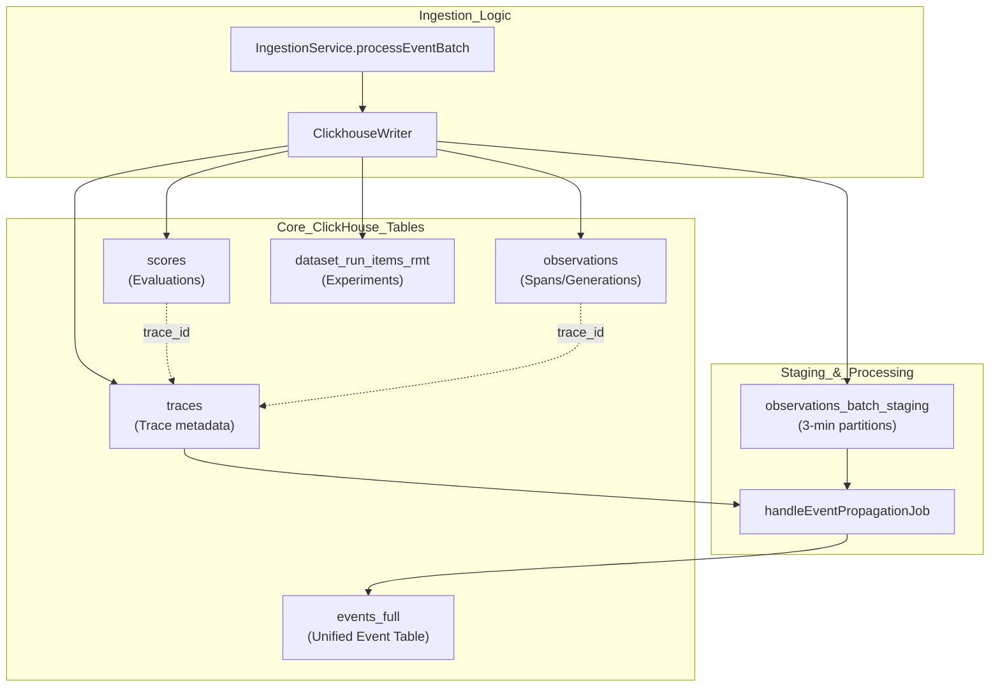

# ClickHouse Schema

관련 소스 파일

다음 파일들은 이 위키 페이지를 생성하기 위한 컨텍스트로 사용되었습니다.

- [fern/apis/server/definition/ingestion.yml](fern/apis/server/definition/ingestion.yml)
- [packages/shared/clickhouse/scripts/dev-tables.sh](packages/shared/clickhouse/scripts/dev-tables.sh)
- [packages/shared/src/domain/observations.ts](packages/shared/src/domain/observations.ts)
- [packages/shared/src/eventsTable.ts](packages/shared/src/eventsTable.ts)
- [packages/shared/src/server/clickhouse/client.ts](packages/shared/src/server/clickhouse/client.ts)
- [packages/shared/src/server/clickhouse/schema.ts](packages/shared/src/server/clickhouse/schema.ts)
- [packages/shared/src/server/ingestion/types.ts](packages/shared/src/server/ingestion/types.ts)
- [packages/shared/src/server/queries/clickhouse-sql/clickhouse-filter.ts](packages/shared/src/server/queries/clickhouse-sql/clickhouse-filter.ts)
- [packages/shared/src/server/queries/clickhouse-sql/event-query-builder.ts](packages/shared/src/server/queries/clickhouse-sql/event-query-builder.ts)
- [packages/shared/src/server/queries/clickhouse-sql/query-fragments.ts](packages/shared/src/server/queries/clickhouse-sql/query-fragments.ts)
- [packages/shared/src/server/queries/index.ts](packages/shared/src/server/queries/index.ts)
- [packages/shared/src/server/queries/public-api-filter-builder.ts](packages/shared/src/server/queries/public-api-filter-builder.ts)
- [packages/shared/src/server/redis/eventPropagationQueue.ts](packages/shared/src/server/redis/eventPropagationQueue.ts)
- [packages/shared/src/server/repositories/dataset-run-items.ts](packages/shared/src/server/repositories/dataset-run-items.ts)
- [packages/shared/src/server/repositories/definitions.ts](packages/shared/src/server/repositories/definitions.ts)
- [packages/shared/src/server/repositories/events.ts](packages/shared/src/server/repositories/events.ts)
- [packages/shared/src/server/repositories/observations_converters.ts](packages/shared/src/server/repositories/observations_converters.ts)
- [packages/shared/src/server/tableMappings/mapEventsTable.ts](packages/shared/src/server/tableMappings/mapEventsTable.ts)
- [packages/shared/src/server/test-utils/tracing-factory.ts](packages/shared/src/server/test-utils/tracing-factory.ts)
- [packages/shared/src/utils/json.ts](packages/shared/src/utils/json.ts)
- [web/src/__tests__/server/observations-api-v2.servertest.ts](web/src/__tests__/server/observations-api-v2.servertest.ts)
- [web/src/__tests__/server/repositories/event-repository.servertest.ts](web/src/__tests__/server/repositories/event-repository.servertest.ts)
- [web/src/__tests__/server/unit/observations-converters.servertest.ts](web/src/__tests__/server/unit/observations-converters.servertest.ts)
- [web/src/components/table/peek/hooks/usePeekData.ts](web/src/components/table/peek/hooks/usePeekData.ts)
- [web/src/features/datasets/components/DatasetItemsTable.tsx](web/src/features/datasets/components/DatasetItemsTable.tsx)
- [web/src/features/datasets/components/DatasetRunsTable.tsx](web/src/features/datasets/components/DatasetRunsTable.tsx)
- [web/src/features/datasets/components/DatasetsTable.tsx](web/src/features/datasets/components/DatasetsTable.tsx)
- [web/src/features/datasets/server/dataset-router.ts](web/src/features/datasets/server/dataset-router.ts)
- [web/src/features/datasets/server/service.ts](web/src/features/datasets/server/service.ts)
- [web/src/features/events/config/filter-config.ts](web/src/features/events/config/filter-config.ts)
- [web/src/features/events/hooks/useEventsFilterOptions.ts](web/src/features/events/hooks/useEventsFilterOptions.ts)
- [web/src/features/events/hooks/useEventsTableData.ts](web/src/features/events/hooks/useEventsTableData.ts)
- [web/src/features/events/hooks/useEventsTraceData.ts](web/src/features/events/hooks/useEventsTraceData.ts)
- [web/src/features/events/lib/eventsToTraceAdapter.clienttest.ts](web/src/features/events/lib/eventsToTraceAdapter.clienttest.ts)
- [web/src/features/events/lib/eventsToTraceAdapter.ts](web/src/features/events/lib/eventsToTraceAdapter.ts)
- [web/src/features/events/server/eventsRouter.ts](web/src/features/events/server/eventsRouter.ts)
- [web/src/features/events/server/eventsService.ts](web/src/features/events/server/eventsService.ts)
- [web/src/features/public-api/types/observations.ts](web/src/features/public-api/types/observations.ts)
- [web/src/hooks/useParsedObservation.ts](web/src/hooks/useParsedObservation.ts)
- [web/src/utils/clientSideDomainTypes.ts](web/src/utils/clientSideDomainTypes.ts)
- [worker/src/backgroundMigrations/backfillEventsHistoric.ts](worker/src/backgroundMigrations/backfillEventsHistoric.ts)
- [worker/src/backgroundMigrations/backfillEventsHistoricFromParts.ts](worker/src/backgroundMigrations/backfillEventsHistoricFromParts.ts)
- [worker/src/backgroundMigrations/backfillExperimentsHistoric.ts](worker/src/backgroundMigrations/backfillExperimentsHistoric.ts)
- [worker/src/features/eventPropagation/handleEventPropagationJob.ts](worker/src/features/eventPropagation/handleEventPropagationJob.ts)
- [worker/src/features/eventPropagation/handleExperimentBackfill.ts](worker/src/features/eventPropagation/handleExperimentBackfill.ts)
- [worker/src/services/ClickhouseWriter/ClickhouseWriter.unit.test.ts](worker/src/services/ClickhouseWriter/ClickhouseWriter.unit.test.ts)
- [worker/src/services/ClickhouseWriter/index.ts](worker/src/services/ClickhouseWriter/index.ts)
- [worker/src/services/IngestionService/index.ts](worker/src/services/IngestionService/index.ts)
- [worker/src/services/IngestionService/tests/IngestionService.integration.test.ts](worker/src/services/IngestionService/tests/IngestionService.integration.test.ts)
- [worker/src/services/IngestionService/tests/calculateTokenCost.unit.test.ts](worker/src/services/IngestionService/tests/calculateTokenCost.unit.test.ts)
- [worker/src/services/IngestionService/tests/utils.unit.test.ts](worker/src/services/IngestionService/tests/utils.unit.test.ts)
- [worker/src/services/IngestionService/utils.ts](worker/src/services/IngestionService/utils.ts)

이 문서는 Langfuse에서 대용량 observability data를 저장하는 데 사용되는 ClickHouse schema를 설명합니다. ClickHouse는 trace, observation, score, dataset run item을 위한 analytical database 역할을 하며, configuration과 metadata를 저장하는 PostgreSQL을 보완합니다.

이중 database 아키텍처와 각 database가 사용되는 시점에 대한 정보는 [Database Overview](3.1)를 참조하세요. event-sourcing ingestion pattern과 write path에 대한 자세한 내용은 [Events Table & Dual-Write Architecture](3.4)를 참조하세요.

---

## Core Tables Overview

ClickHouse는 대용량 write와 analytical query에 최적화된 table로 primary entity type을 저장합니다. 현재 시스템은 split architecture(별도의 trace와 observation)에서 unified events-first architecture로 전환 중입니다.

### Data Flow and Table Relationships

다음 다이어그램은 ingestion event가 ClickHouse table로 흐르는 방식과 그 관계를 보여주며, unified event construction에 사용되는 batch staging 및 event propagation path를 포함합니다.

**ClickHouse Ingestion and Propagation Flow**

**Table Engines and Strategy:**
- `traces`, `observations`, `scores`: deduplication 및 soft delete를 위해 `event_ts`와 `is_deleted`를 포함한 `ReplacingMergeTree`를 사용합니다 [packages/shared/clickhouse/scripts/dev-tables.sh:120-120]().
- `observations_batch_staging`: batch propagation을 용이하게 하기 위해 12시간 TTL과 3분 partitioning으로 short-term storage에 최적화되어 있습니다. `ReplacingMergeTree(event_ts, is_deleted)`를 사용합니다 [packages/shared/clickhouse/scripts/dev-tables.sh:120-130]().
- `events_full`: split architecture를 대체하도록 설계된 unified table이며, span data와 함께 denormalized trace metadata를 포함합니다 [packages/shared/clickhouse/scripts/dev-tables.sh:137-158]().

**출처:** [packages/shared/clickhouse/scripts/dev-tables.sh:75-130](), [worker/src/features/eventPropagation/handleEventPropagationJob.ts:58-72](), [worker/src/services/ClickhouseWriter/index.ts:50-59]()

---

## Unified Events Schema (`events_full`)

Langfuse는 analysis 중 expensive join을 제거하기 위해 trace-level context와 observation-level data를 결합하는 unified `events_full` table로 migration하고 있습니다.

### Schema Structure

| Field | Type | Description |
|-------|------|-------------|
| `project_id` | String | Primary partition key |
| `trace_id` | String | Trace identifier |
| `span_id` | String | 이 event/span의 unique identifier(domain의 `id`에 mapping됨) |
| `parent_span_id` | String | tree structure를 위한 parent span identifier |
| `start_time` | DateTime64(6) | event의 시작 |
| `end_time` | Nullable(DateTime64(6)) | event의 종료 |
| `name` | String | Event/Span name |
| `type` | LowCardinality(String) | SPAN, GENERATION, EVENT, TOOL 등 |
| `trace_name` | String | parent trace의 denormalized name |
| `user_id` | String | denormalized user identifier |
| `session_id` | String | denormalized session identifier |
| `input` | String | Event input(ZSTD compressed) |
| `output` | String | Event output(ZSTD compressed) |
| `metadata_names` | Array(String) | optimized search를 위한 flattened metadata key |
| `metadata_values` | Array(String) | flattened metadata value |

**출처:** [packages/shared/clickhouse/scripts/dev-tables.sh:137-200](), [packages/shared/src/server/queries/clickhouse-sql/event-query-builder.ts:57-146]()

### Materialized Columns
`events_full` table은 write-time에 metric을 계산하기 위해 ClickHouse `MATERIALIZED` column을 활용합니다.
- `calculated_input_cost`: 'input' key로 filter된 cost의 합계 [packages/shared/clickhouse/scripts/dev-tables.sh:180-180]().
- `calculated_output_cost`: 'output' key로 filter된 cost의 합계 [packages/shared/clickhouse/scripts/dev-tables.sh:181-181]().
- `calculated_total_cost`: input 및 output cost의 합계 [packages/shared/clickhouse/scripts/dev-tables.sh:182-182]().
- `input_length` / `output_length`: `lengthUTF8`로 계산된 I/O string의 character length [packages/shared/clickhouse/scripts/dev-tables.sh:195-197]().

---

## Partitioning and TTL Strategy

Langfuse는 대용량 ingestion 및 event propagation을 관리하기 위해 tiered partitioning strategy를 사용합니다.

### Staging Partitioning
`observations_batch_staging` table은 `toStartOfInterval(s3_first_seen_timestamp, INTERVAL 3 MINUTE)`로 partitioning됩니다 [packages/shared/clickhouse/scripts/dev-tables.sh:121-121](). 이를 통해 `handleEventPropagationJob`은 data를 작고 순차적인 chunk로 처리할 수 있습니다. job은 순차 처리를 보장하기 위해 Redis에서 `LAST_PROCESSED_PARTITION_KEY`를 tracking합니다 [worker/src/features/eventPropagation/handleEventPropagationJob.ts:15-24]().

### TTL Management
- **Staging Data**: `TTL s3_first_seen_timestamp + INTERVAL 12 HOUR`를 통해 12시간 후 자동으로 만료됩니다 [packages/shared/clickhouse/scripts/dev-tables.sh:129-129]().
- **Partition Cleanup**: `ttl_only_drop_parts = 1` setting은 ClickHouse가 row-by-row delete를 수행하는 대신 전체 partition을 효율적으로 drop하도록 보장합니다 [packages/shared/clickhouse/scripts/dev-tables.sh:130-130]().

**출처:** [packages/shared/clickhouse/scripts/dev-tables.sh:120-130](), [worker/src/features/eventPropagation/handleEventPropagationJob.ts:94-109]()

---

## Event Propagation and Enrichment

시스템은 staging data에서 unified `events_full` table을 채우고 model pricing으로 enrich하는 mechanism을 제공합니다.

### Event Propagation Job
`handleEventPropagationJob`은 `events_full`에 insert하기 전에 span data를 trace-level metadata(`user_id`, `session_id`, `tags`, `release` 등)로 enrich하기 위해 `observations_batch_staging`과 `traces` table 간 join을 수행합니다 [worker/src/features/eventPropagation/handleEventPropagationJob.ts:140-210](). join scope를 제한하기 위해 trace에 대한 time window를 사용합니다 [worker/src/features/eventPropagation/handleEventPropagationJob.ts:174-180]().

### Model Enrichment logic
observation을 query할 때, 시스템은 raw ClickHouse record를 model pricing data로 enrich합니다.
1. **Model Lookup**: `enrichObservationsWithModelData` function은 ClickHouse record에서 unique `internal_model_id`를 식별합니다 [packages/shared/src/server/repositories/events.ts:157-163]().
2. **Prisma Fetch**: 이 ID들에 대해 PostgreSQL `Model` table(`Price` relation 포함)을 query합니다 [packages/shared/src/server/repositories/events.ts:165-176]().
3. **Price Mapping**: `enrichObservationWithModelData` helper는 특정 usage type(`input`, `output`, `total`)을 observation domain object에 mapping합니다 [packages/shared/src/server/repositories/observations_converters.ts:125-137]().

**출처:** [worker/src/features/eventPropagation/handleEventPropagationJob.ts:58-134](), [packages/shared/src/server/repositories/events.ts:131-180](), [packages/shared/src/server/repositories/observations_converters.ts:125-137]()

---

## Repository Layer

`EventsRepository`와 관련 query builder는 application의 나머지 부분을 위해 ClickHouse schema를 추상화합니다.

### EventsQueryBuilder
`EventsQueryBuilder`는 일반적인 query pattern을 위한 표준 field set을 정의합니다.
- **`base`**: UI list를 위한 표준 field(ID, name, start/end time, level, status) [packages/shared/src/server/queries/clickhouse-sql/event-query-builder.ts:157-196]().
- **`full`**: `input`, `output`, `metadata` 같은 대용량 field를 포함합니다 [packages/shared/src/server/queries/clickhouse-sql/event-query-builder.ts:241-246]().
- **Calculated Fields**: Latency와 `time_to_first_token`은 SQL에서 `date_diff`를 사용해 계산됩니다 [packages/shared/src/server/queries/clickhouse-sql/event-query-builder.ts:142-145]().

### ClickhouseWriter
`ClickhouseWriter` singleton은 ClickHouse에 대한 실제 `INSERT` operation을 관리합니다 [worker/src/services/ClickhouseWriter/index.ts:32-43](). 다음을 구현합니다.
- **Batching**: `batchSize` 또는 `writeInterval`에 도달할 때까지 record를 buffer합니다 [worker/src/services/ClickhouseWriter/index.ts:44-46]().
- **Error Handling**: network error 시 retry하고, batch를 split하거나 field를 truncate하여 ClickHouse "extremely large JSON object" error를 처리합니다 [worker/src/services/ClickhouseWriter/index.ts:143-206]().

**출처:** [packages/shared/src/server/queries/clickhouse-sql/event-query-builder.ts:57-250](), [worker/src/services/ClickhouseWriter/index.ts:32-132](), [packages/shared/src/server/repositories/events.ts:75-82]()
