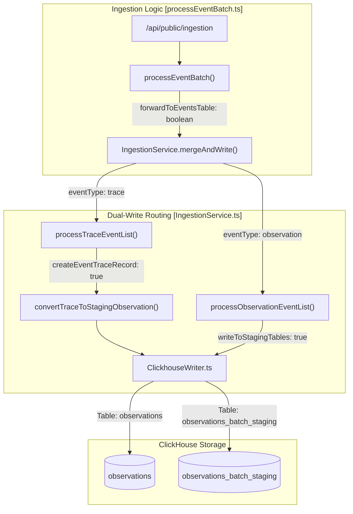
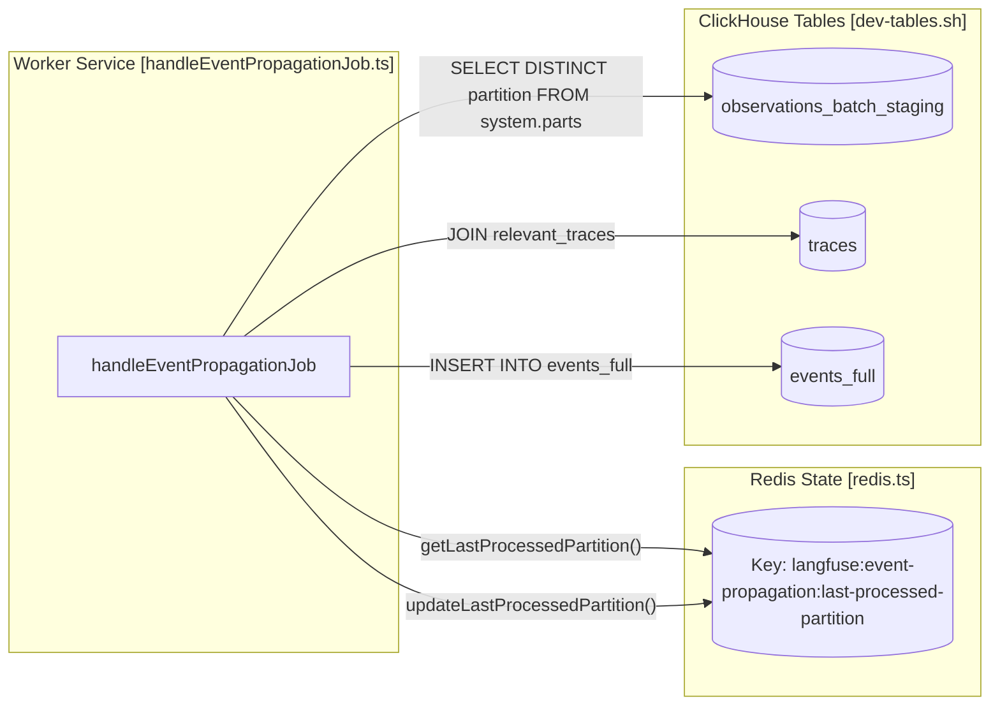

# Events Table & Dual-Write Architecture

관련 소스 파일

다음 파일들은 이 위키 페이지를 생성하기 위한 컨텍스트로 사용되었습니다.

- [fern/apis/server/definition/ingestion.yml](fern/apis/server/definition/ingestion.yml)
- [packages/shared/clickhouse/scripts/dev-tables.sh](packages/shared/clickhouse/scripts/dev-tables.sh)
- [packages/shared/prisma/migrations/20241029130802_prices_drop_excess_index/migration.sql](packages/shared/prisma/migrations/20241029130802_prices_drop_excess_index/migration.sql)
- [packages/shared/src/domain/observations.ts](packages/shared/src/domain/observations.ts)
- [packages/shared/src/eventsTable.ts](packages/shared/src/eventsTable.ts)
- [packages/shared/src/server/clickhouse/schema.ts](packages/shared/src/server/clickhouse/schema.ts)
- [packages/shared/src/server/ingestion/processEventBatch.ts](packages/shared/src/server/ingestion/processEventBatch.ts)
- [packages/shared/src/server/ingestion/types.ts](packages/shared/src/server/ingestion/types.ts)
- [packages/shared/src/server/otel/ObservationTypeMapper.ts](packages/shared/src/server/otel/ObservationTypeMapper.ts)
- [packages/shared/src/server/otel/OtelIngestionProcessor.ts](packages/shared/src/server/otel/OtelIngestionProcessor.ts)
- [packages/shared/src/server/queries/clickhouse-sql/clickhouse-filter.ts](packages/shared/src/server/queries/clickhouse-sql/clickhouse-filter.ts)
- [packages/shared/src/server/queries/clickhouse-sql/event-query-builder.ts](packages/shared/src/server/queries/clickhouse-sql/event-query-builder.ts)
- [packages/shared/src/server/queries/clickhouse-sql/query-fragments.ts](packages/shared/src/server/queries/clickhouse-sql/query-fragments.ts)
- [packages/shared/src/server/queries/index.ts](packages/shared/src/server/queries/index.ts)
- [packages/shared/src/server/queries/public-api-filter-builder.ts](packages/shared/src/server/queries/public-api-filter-builder.ts)
- [packages/shared/src/server/redis/eventPropagationQueue.ts](packages/shared/src/server/redis/eventPropagationQueue.ts)
- [packages/shared/src/server/redis/otelIngestionQueue.ts](packages/shared/src/server/redis/otelIngestionQueue.ts)
- [packages/shared/src/server/repositories/definitions.ts](packages/shared/src/server/repositories/definitions.ts)
- [packages/shared/src/server/repositories/events.ts](packages/shared/src/server/repositories/events.ts)
- [packages/shared/src/server/repositories/observations_converters.ts](packages/shared/src/server/repositories/observations_converters.ts)
- [packages/shared/src/server/tableMappings/mapEventsTable.ts](packages/shared/src/server/tableMappings/mapEventsTable.ts)
- [packages/shared/src/server/test-utils/tracing-factory.ts](packages/shared/src/server/test-utils/tracing-factory.ts)
- [packages/shared/src/utils/json.ts](packages/shared/src/utils/json.ts)
- [web/src/__tests__/server/api/otel/otelMapping.servertest.ts](web/src/__tests__/server/api/otel/otelMapping.servertest.ts)
- [web/src/__tests__/server/observations-api-v2.servertest.ts](web/src/__tests__/server/observations-api-v2.servertest.ts)
- [web/src/__tests__/server/repositories/event-repository.servertest.ts](web/src/__tests__/server/repositories/event-repository.servertest.ts)
- [web/src/__tests__/server/unit/observations-converters.servertest.ts](web/src/__tests__/server/unit/observations-converters.servertest.ts)
- [web/src/components/table/peek/hooks/usePeekData.ts](web/src/components/table/peek/hooks/usePeekData.ts)
- [web/src/features/events/config/filter-config.ts](web/src/features/events/config/filter-config.ts)
- [web/src/features/events/hooks/useEventsFilterOptions.ts](web/src/features/events/hooks/useEventsFilterOptions.ts)
- [web/src/features/events/hooks/useEventsTableData.ts](web/src/features/events/hooks/useEventsTableData.ts)
- [web/src/features/events/hooks/useEventsTraceData.ts](web/src/features/events/hooks/useEventsTraceData.ts)
- [web/src/features/events/lib/eventsToTraceAdapter.clienttest.ts](web/src/features/events/lib/eventsToTraceAdapter.clienttest.ts)
- [web/src/features/events/lib/eventsToTraceAdapter.ts](web/src/features/events/lib/eventsToTraceAdapter.ts)
- [web/src/features/events/server/eventsRouter.ts](web/src/features/events/server/eventsRouter.ts)
- [web/src/features/events/server/eventsService.ts](web/src/features/events/server/eventsService.ts)
- [web/src/features/models/components/pricing-tiers/TierPrefillButtons.tsx](web/src/features/models/components/pricing-tiers/TierPrefillButtons.tsx)
- [web/src/features/public-api/types/observations.ts](web/src/features/public-api/types/observations.ts)
- [web/src/hooks/useParsedObservation.ts](web/src/hooks/useParsedObservation.ts)
- [web/src/pages/api/public/otel/v1/traces/index.ts](web/src/pages/api/public/otel/v1/traces/index.ts)
- [web/src/utils/clientSideDomainTypes.ts](web/src/utils/clientSideDomainTypes.ts)
- [worker/src/backgroundMigrations/backfillEventsHistoric.ts](worker/src/backgroundMigrations/backfillEventsHistoric.ts)
- [worker/src/backgroundMigrations/backfillEventsHistoricFromParts.ts](worker/src/backgroundMigrations/backfillEventsHistoricFromParts.ts)
- [worker/src/backgroundMigrations/backfillExperimentsHistoric.ts](worker/src/backgroundMigrations/backfillExperimentsHistoric.ts)
- [worker/src/constants/default-model-prices.json](worker/src/constants/default-model-prices.json)
- [worker/src/features/eventPropagation/handleEventPropagationJob.ts](worker/src/features/eventPropagation/handleEventPropagationJob.ts)
- [worker/src/features/eventPropagation/handleExperimentBackfill.ts](worker/src/features/eventPropagation/handleExperimentBackfill.ts)
- [worker/src/queues/__tests__/otelDirectEventWrite.test.ts](worker/src/queues/__tests__/otelDirectEventWrite.test.ts)
- [worker/src/queues/otelIngestionQueue.ts](worker/src/queues/otelIngestionQueue.ts)
- [worker/src/queues/shardedQueueRegistry.ts](worker/src/queues/shardedQueueRegistry.ts)
- [worker/src/scripts/upsertDefaultModelPrices.ts](worker/src/scripts/upsertDefaultModelPrices.ts)
- [worker/src/services/IngestionService/index.ts](worker/src/services/IngestionService/index.ts)
- [worker/src/services/IngestionService/tests/IngestionService.integration.test.ts](worker/src/services/IngestionService/tests/IngestionService.integration.test.ts)
- [worker/src/services/IngestionService/tests/calculateTokenCost.unit.test.ts](worker/src/services/IngestionService/tests/calculateTokenCost.unit.test.ts)
- [worker/src/services/IngestionService/tests/utils.unit.test.ts](worker/src/services/IngestionService/tests/utils.unit.test.ts)
- [worker/src/services/IngestionService/utils.ts](worker/src/services/IngestionService/utils.ts)

이 페이지는 ClickHouse의 `events` table family 설계와 구현, 기존 `observations` pipeline에서 이를 채우는 dual-write mechanism, `EventPropagationQueue`를 통한 real-time partition propagation, 그리고 이 data를 query하는 데 사용되는 repository pattern을 다룹니다.

---

## 목적과 Context

Langfuse의 전통적인 `observations` table은 span과 generation을 parent trace metadata와 독립적으로 저장합니다. `events` table architecture(v2)는 observation data를 write time에 trace property(`user_id`, `session_id`, `tags`, `trace_name` 등)와 merge하는 denormalized layer를 도입합니다. 이를 통해 read operation 중 expensive join을 제거하여 analytical query를 훨씬 빠르게 수행할 수 있습니다.

시스템은 backward compatibility를 보장하기 위해 **dual-write** 접근 방식을 사용합니다.
1. Data가 legacy `observations` table에 write됩니다.
2. 동시에 staging table(`observations_batch_staging`)에도 data가 write됩니다.
3. 비동기 worker가 이 data를 final `events_full` table로 propagate하고 denormalize합니다.

출처: [worker/src/services/IngestionService/index.ts:149-156](), [worker/src/features/eventPropagation/handleEventPropagationJob.ts:58-72]()

---

## Table Family 개요

이 아키텍처는 development schema script에 정의된 특정 역할을 가진 여러 ClickHouse table로 구성됩니다.

| Table | Engine | Purpose |
| :--- | :--- | :--- |
| `observations_batch_staging` | `ReplacingMergeTree` | raw observation을 위한 short-lived buffer이며, 3분 interval로 partitioning됩니다. |
| `events_full` | `ReplacingMergeTree` | full I/O와 trace metadata를 포함하는 primary denormalized table입니다. |

### `observations_batch_staging`
이 table은 임시 landing zone 역할을 합니다. 세밀한 partitioning strategy인 `PARTITION BY toStartOfInterval(s3_first_seen_timestamp, INTERVAL 3 MINUTE)`를 사용합니다 [packages/shared/clickhouse/scripts/dev-tables.sh:121](). 

*   **TTL**: Data는 12시간 후 자동으로 만료됩니다(`TTL s3_first_seen_timestamp + INTERVAL 12 HOUR`) [packages/shared/clickhouse/scripts/dev-tables.sh:129]().
*   **Settings**: `ttl_only_drop_parts = 1`은 ClickHouse가 complete partition만 drop하도록 보장하여 propagation 중 data integrity를 유지합니다 [packages/shared/clickhouse/scripts/dev-tables.sh:130]().

### `events_full`
`events_full`은 denormalized event-sourcing pattern의 source of truth입니다 [packages/shared/clickhouse/scripts/dev-tables.sh:135-198](). `ZSTD(3)` compression을 사용해 full `input` 및 `output` string을 저장합니다 [packages/shared/clickhouse/scripts/dev-tables.sh:192-194]().

*   **Materialized Columns**: `cost_details` map에 `mapFilter`를 사용해 input 및 output cost를 합산하는 `calculated_total_cost` 같은 cost calculation용 materialized column을 포함합니다 [packages/shared/clickhouse/scripts/dev-tables.sh:180-183]().
*   **Metadata Storage**: 효율적인 filtering과 reconstruction을 위해 metadata는 두 개의 parallel array(`metadata_names` 및 `metadata_values`)로 저장됩니다 [packages/shared/clickhouse/scripts/dev-tables.sh:198-199]().

출처: [packages/shared/clickhouse/scripts/dev-tables.sh:81-130](), [packages/shared/clickhouse/scripts/dev-tables.sh:135-200]()

---

## Dual-Write Architecture

`IngestionService`는 incoming event의 routing을 관리합니다. events table에 write할지 여부는 `mergeAndWrite`의 `forwardToEventsTable` parameter로 제어됩니다 [worker/src/services/IngestionService/index.ts:154-156]().

### Ingestion Flow
event(Trace 또는 Observation)가 도착하면:
1.  **Traces**: Trace는 `convertTraceToStagingObservation`을 통해 "synthetic" observation으로 변환되고 [worker/src/services/IngestionService/index.ts:17](), `processTraceEventList`에서 처리됩니다 [worker/src/services/IngestionService/index.ts:162-168](). 이를 통해 propagation job은 trace metadata update를 `events_full` table로 merge되어야 하는 event로 취급할 수 있습니다.
2.  **Observations**: 표준 observation은 `ObservationRecordInsertType`에 mapping되며, `forwardToEventsTable`이 true이면 legacy `observations` table과 `observations_batch_staging` table 모두에 write됩니다 [worker/src/services/IngestionService/index.ts:170-176]().

### ClickhouseWriter
`ClickhouseWriter` class는 이러한 write의 physical batching을 처리합니다. `TableName`에 정의된 서로 다른 table(예: `TableName.Observations`, `TableName.ObservationsBatchStaging`)에 대해 별도 buffer를 유지합니다 [worker/src/services/ClickhouseWriter.ts:56]().

**Diagram: Data Ingestion & Dual-Write Path**

출처: [worker/src/services/IngestionService/index.ts:148-194](), [packages/shared/src/server/ingestion/processEventBatch.ts:104-125](), [worker/src/services/IngestionService/index.ts:56-57]()

---

## Real-Time Propagation: `EventPropagationQueue`

`handleEventPropagationJob`은 denormalization join을 수행하여 staging table에서 final `events_full` table로 data를 이동합니다.

### Propagation Logic
worker는 sequential, partition-based migration을 실행합니다 [worker/src/features/eventPropagation/handleEventPropagationJob.ts:58-72]().

1.  **Cursor Check**: 마지막으로 성공적으로 처리된 3분 window를 확인하기 위해 Redis에서 `LAST_PROCESSED_PARTITION_KEY`를 읽습니다 [worker/src/features/eventPropagation/handleEventPropagationJob.ts:22-29]().
2.  **Partition Selection**: `observations_batch_staging`에서 `LANGFUSE_EXPERIMENT_EVENT_PROPAGATION_PARTITION_DELAY_MINUTES`보다 오래된 다음 available partition을 식별합니다 [worker/src/features/eventPropagation/handleEventPropagationJob.ts:94-103]().
3.  **The Denormalization Join**: `observations_batch_staging`와 `traces` table을 join하는 `INSERT INTO events_full`을 실행합니다 [worker/src/features/eventPropagation/handleEventPropagationJob.ts:140-182]().
    *   `limit 1 by t.project_id, t.id`를 사용해 batch 내 각 `trace_id`에 대한 최신 trace metadata를 선택합니다 [worker/src/features/eventPropagation/handleEventPropagationJob.ts:181-182]().
    *   `user_id`, `session_id`, `tags` 같은 trace field를 observation record에 merge합니다 [worker/src/features/eventPropagation/handleEventPropagationJob.ts:185-196]().
4.  **Cursor Update**: 성공하면 `updateLastProcessedPartition`을 통해 Redis의 cursor를 update합니다 [worker/src/features/eventPropagation/handleEventPropagationJob.ts:35-40]().

**Diagram: Propagation and Denormalization [Code Entity Space]**

출처: [worker/src/features/eventPropagation/handleEventPropagationJob.ts:15-50](), [worker/src/features/eventPropagation/handleEventPropagationJob.ts:94-103](), [worker/src/features/eventPropagation/handleEventPropagationJob.ts:140-210]()

---

## Data Access and Repositories

events architecture query는 underlying ClickHouse SQL을 추상화하는 `events.ts` repository가 처리합니다.

### `EventsQueryBuilder`
시스템은 denormalized table용 SQL을 생성하기 위해 structured `EventsQueryBuilder`를 사용합니다 [packages/shared/src/server/queries/clickhouse-sql/event-query-builder.ts:75](). 이 builder는 다음을 처리합니다.
*   **Field Mapping**: 내부 field name을 적절한 alias가 있는 SQL expression에 mapping합니다(예: `e.span_id as id`) [packages/shared/src/server/queries/clickhouse-sql/event-query-builder.ts:57-146]().
*   **Calculated Latency**: `start_time` 및 `end_time`에 `date_diff`를 사용해 latency를 계산합니다 [packages/shared/src/server/queries/clickhouse-sql/event-query-builder.ts:142-143]().
*   **Enrichment**: repository는 `enrichObservationsWithModelData`를 사용해 raw ClickHouse record를 model pricing data로 enrich합니다 [packages/shared/src/server/repositories/events.ts:125-130]().

### Data Conversion
Raw ClickHouse result는 `convertEventsObservation`을 통해 domain entity로 변환됩니다 [packages/shared/src/server/repositories/observations_converters.ts:140-165](). 이 process는 다음을 보장합니다.
*   Timestamp가 ClickHouse format에서 올바르게 parse됩니다 [packages/shared/src/server/repositories/observations_converters.ts:110-113]().
*   Metadata parallel array가 object로 reconstruct됩니다 [packages/shared/src/server/repositories/observations_converters.ts:15]().
*   Input 및 Output string은 `RenderingProps`에 따라 선택적으로 JSON으로 parse됩니다 [packages/shared/src/server/repositories/observations_converters.ts:153-165]().

출처: [packages/shared/src/server/repositories/events.ts:125-178](), [packages/shared/src/server/queries/clickhouse-sql/event-query-builder.ts:57-146](), [packages/shared/src/server/repositories/observations_converters.ts:140-210]()
