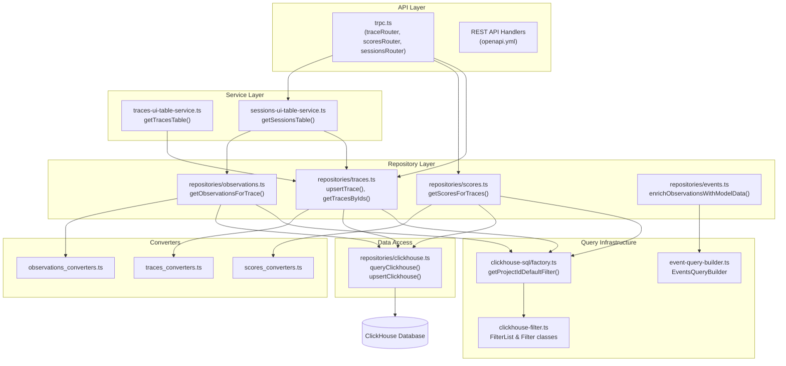
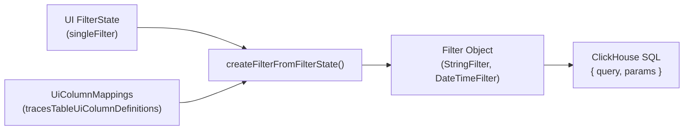

# Repository Pattern

관련 소스 파일

다음 파일들은 이 위키 페이지를 생성하기 위한 컨텍스트로 사용되었습니다.

- [packages/shared/src/domain/observations.ts](packages/shared/src/domain/observations.ts)
- [packages/shared/src/eventsTable.ts](packages/shared/src/eventsTable.ts)
- [packages/shared/src/server/clickhouse/schema.ts](packages/shared/src/server/clickhouse/schema.ts)
- [packages/shared/src/server/queries/clickhouse-sql/event-query-builder.ts](packages/shared/src/server/queries/clickhouse-sql/event-query-builder.ts)
- [packages/shared/src/server/queries/clickhouse-sql/query-fragments.ts](packages/shared/src/server/queries/clickhouse-sql/query-fragments.ts)
- [packages/shared/src/server/queries/clickhouse-sql/search.ts](packages/shared/src/server/queries/clickhouse-sql/search.ts)
- [packages/shared/src/server/queries/index.ts](packages/shared/src/server/queries/index.ts)
- [packages/shared/src/server/queries/public-api-filter-builder.ts](packages/shared/src/server/queries/public-api-filter-builder.ts)
- [packages/shared/src/server/repositories/clickhouse.ts](packages/shared/src/server/repositories/clickhouse.ts)
- [packages/shared/src/server/repositories/events.ts](packages/shared/src/server/repositories/events.ts)
- [packages/shared/src/server/repositories/observations.ts](packages/shared/src/server/repositories/observations.ts)
- [packages/shared/src/server/repositories/observations_converters.ts](packages/shared/src/server/repositories/observations_converters.ts)
- [packages/shared/src/server/repositories/scores.ts](packages/shared/src/server/repositories/scores.ts)
- [packages/shared/src/server/repositories/traces.ts](packages/shared/src/server/repositories/traces.ts)
- [packages/shared/src/server/services/sessions-ui-table-service.ts](packages/shared/src/server/services/sessions-ui-table-service.ts)
- [packages/shared/src/server/services/traces-ui-table-service.ts](packages/shared/src/server/services/traces-ui-table-service.ts)
- [packages/shared/src/server/tableMappings/mapEventsTable.ts](packages/shared/src/server/tableMappings/mapEventsTable.ts)
- [web/src/__tests__/server/clickhouseSearchCondition.servertest.ts](web/src/__tests__/server/clickhouseSearchCondition.servertest.ts)
- [web/src/__tests__/server/observations-api-v2.servertest.ts](web/src/__tests__/server/observations-api-v2.servertest.ts)
- [web/src/__tests__/server/repositories/clickhouse-resource-errors.servertest.ts](web/src/__tests__/server/repositories/clickhouse-resource-errors.servertest.ts)
- [web/src/__tests__/server/repositories/event-repository.servertest.ts](web/src/__tests__/server/repositories/event-repository.servertest.ts)
- [web/src/__tests__/server/trpc-error-formatting.servertest.ts](web/src/__tests__/server/trpc-error-formatting.servertest.ts)
- [web/src/__tests__/server/unit/observations-converters.servertest.ts](web/src/__tests__/server/unit/observations-converters.servertest.ts)
- [web/src/__tests__/server/withMiddlewares.servertest.ts](web/src/__tests__/server/withMiddlewares.servertest.ts)
- [web/src/components/table/peek/hooks/usePeekData.ts](web/src/components/table/peek/hooks/usePeekData.ts)
- [web/src/features/events/config/filter-config.ts](web/src/features/events/config/filter-config.ts)
- [web/src/features/events/hooks/useEventsFilterOptions.ts](web/src/features/events/hooks/useEventsFilterOptions.ts)
- [web/src/features/events/hooks/useEventsTableData.ts](web/src/features/events/hooks/useEventsTableData.ts)
- [web/src/features/events/hooks/useEventsTraceData.ts](web/src/features/events/hooks/useEventsTraceData.ts)
- [web/src/features/events/lib/eventsToTraceAdapter.clienttest.ts](web/src/features/events/lib/eventsToTraceAdapter.clienttest.ts)
- [web/src/features/events/lib/eventsToTraceAdapter.ts](web/src/features/events/lib/eventsToTraceAdapter.ts)
- [web/src/features/events/server/eventsRouter.ts](web/src/features/events/server/eventsRouter.ts)
- [web/src/features/events/server/eventsService.ts](web/src/features/events/server/eventsService.ts)
- [web/src/features/notifications/ErrorNotification.tsx](web/src/features/notifications/ErrorNotification.tsx)
- [web/src/features/notifications/showErrorToast.tsx](web/src/features/notifications/showErrorToast.tsx)
- [web/src/features/public-api/server/withMiddlewares.ts](web/src/features/public-api/server/withMiddlewares.ts)
- [web/src/features/public-api/types/observations.ts](web/src/features/public-api/types/observations.ts)
- [web/src/hooks/useParsedObservation.ts](web/src/hooks/useParsedObservation.ts)
- [web/src/server/api/routers/generations/filterOptionsQuery.ts](web/src/server/api/routers/generations/filterOptionsQuery.ts)
- [web/src/server/api/routers/scores.ts](web/src/server/api/routers/scores.ts)
- [web/src/server/api/routers/sessions.ts](web/src/server/api/routers/sessions.ts)
- [web/src/server/api/routers/traces.ts](web/src/server/api/routers/traces.ts)
- [web/src/server/api/trpc.ts](web/src/server/api/trpc.ts)
- [web/src/utils/clientSideDomainTypes.ts](web/src/utils/clientSideDomainTypes.ts)
- [web/src/utils/trpcErrorToast.tsx](web/src/utils/trpcErrorToast.tsx)

Langfuse의 repository pattern은 ClickHouse operation을 위한 구조화된 data access layer를 제공합니다. Repository는 핵심 domain entity(trace, observation, score, session)에 대한 모든 query를 캡슐화하여 data retrieval, insertion, deletion을 위한 일관된 interface를 제공합니다. 이 abstraction은 business logic을 database implementation detail에서 격리하고, query optimization 및 instrumentation을 위한 중앙 위치를 제공합니다.

ClickHouse schema와 table structure에 대한 정보는 [3.3]()을 참조하세요. events table architecture에 대한 자세한 내용은 [3.4]()를 참조하세요.

---

## Repository Architecture

repository layer는 service/router code와 raw ClickHouse client 사이에 위치하며, entity type별로 구성된 domain-specific query function을 제공합니다.

### Repository Data Flow

**출처:**
- [packages/shared/src/server/repositories/traces.ts:1-40]()
- [packages/shared/src/server/repositories/observations.ts:1-50]()
- [packages/shared/src/server/repositories/scores.ts:1-58]()
- [web/src/server/api/routers/traces.ts:97-152]()
- [packages/shared/src/server/repositories/events.ts:75-83]()

---

## Core Repository Structure

각 repository는 특정 query operation을 캡슐화하는 exported function의 collection으로 구현됩니다. Repository는 일관된 naming convention과 structure를 따릅니다.

### Traces Repository

traces repository는 ClickHouse의 trace record를 관리하는 function을 제공합니다.

| Function | Purpose | Return Type |
|----------|---------|-------------|
| `checkTraceExistsAndGetTimestamp` | time window filtering으로 trace 존재 여부 validate | `Promise<{exists: boolean, timestamp?: Date}>` |
| `upsertTrace` | trace record insert 또는 update | `Promise<void>` |
| `getTracesByIds` | ID로 여러 trace retrieve | `Promise<TraceDomain[]>` |

**주요 Implementation Details:**

`checkTraceExistsAndGetTimestamp` function은 evaluation job creation 전에 trace를 validate하기 위해 ±2일 window와 CTE 기반 aggregation을 사용합니다 [packages/shared/src/server/repositories/traces.ts:58-72](). aggregated level과 latency를 계산하기 위해 `observations_agg` CTE를 구성합니다 [packages/shared/src/server/repositories/traces.ts:102-126]().

**출처:**
- [packages/shared/src/server/repositories/traces.ts:58-192]()
- [packages/shared/src/server/repositories/traces.ts:198-204]()

### Observations Repository

observations repository는 observation record(span, generation, event)를 관리합니다.

| Function | Purpose | Return Type |
|----------|---------|-------------|
| `checkObservationExists` | observation 존재 여부 validate | `Promise<boolean>` |
| `upsertObservation` | observation record insert 또는 update | `Promise<void>` |
| `getObservationsForTrace` | trace의 모든 observation retrieve | `Promise<ObservationRecordReadType[]>` |

**주요 Implementation Details:**

`getObservationsForTrace`는 memory exhaustion을 방지하기 위해 input/output/metadata field size를 `LANGFUSE_API_TRACE_OBSERVATIONS_SIZE_LIMIT_BYTES` environment variable로 제한하여 대용량 payload를 처리합니다 [packages/shared/src/server/repositories/observations.ts:206-231]().

**출처:**
- [packages/shared/src/server/repositories/observations.ts:64-97]()
- [packages/shared/src/server/repositories/observations.ts:103-126]()
- [packages/shared/src/server/repositories/observations.ts:136-205]()

### Scores Repository

scores repository는 trace, observation 또는 session에 attached된 score record를 관리합니다.

| Function | Purpose | Return Type |
|----------|---------|-------------|
| `searchExistingAnnotationScore` | criteria로 기존 annotation score 찾기 | `Promise<ScoreDomain \| undefined>` |
| `getScoreById` | 단일 score를 ID로 retrieve | `Promise<ScoreDomain \| undefined>` |
| `upsertScore` | score record insert 또는 update | `Promise<void>` |
| `getScoresForTraces` | 주어진 trace ID에 대한 모든 score retrieve | `Promise<ScoreDomain[]>` |
| `getScoresForSessions` | 주어진 session ID에 대한 모든 score retrieve | `Promise<ScoreDomain[]>` |

**출처:**
- [packages/shared/src/server/repositories/scores.ts:63-114]()
- [packages/shared/src/server/repositories/scores.ts:116-131]()
- [packages/shared/src/server/repositories/scores.ts:151-166]()
- [packages/shared/src/server/repositories/scores.ts:224-249]()

### Events Repository (V4 Architecture)

events repository는 최신 `events_full` 및 `events_core` table을 추상화하며, trace와 observation이 단일 event stream으로 통합되는 V4 architecture에서 주로 사용됩니다.

| Function | Purpose | Return Type |
|----------|---------|-------------|
| `enrichObservationsWithModelData` | raw ClickHouse record를 domain object로 mapping하고 model pricing으로 enrich | `Promise<EventsObservation[]>` |
| `convertEventsObservation` | event-based observation용 converter [packages/shared/src/server/repositories/events.ts:73]() | `EventsObservation` |

**주요 Implementation Details:**
`enrichObservationsWithModelData` function은 V1(complete) 및 V2(partial) API request를 모두 지원합니다. request되었거나 version에 필요한 경우에만 `prisma.model.findMany`를 통해 model data를 fetch하여 pricing detail이 observation에 attached되도록 보장합니다 [packages/shared/src/server/repositories/events.ts:125-180]().

**출처:**
- [packages/shared/src/server/repositories/events.ts:125-180]()
- [packages/shared/src/server/repositories/events.ts:181-211]()

---

## Write Path Abstraction

repository pattern은 `upsertClickhouse`와 ClickHouse client를 통해 write path로 확장됩니다.

### Direct Upsert
shared package의 `upsertClickhouse` function은 ClickHouse에 직접 write하는 방법을 제공하며, `LANGFUSE_ENABLE_BLOB_STORAGE_FILE_LOG`가 활성화된 경우 동시에 S3 blob storage에 event를 logging합니다 [packages/shared/src/server/repositories/clickhouse.ts:157-180]().

- **Event Mapping**: record를 `trace-create` 또는 `span-create` 같은 event type에 mapping합니다 [packages/shared/src/server/repositories/clickhouse.ts:148-152]().
- **Blob Storage**: record는 `StorageService`를 사용해 JSON으로 S3에 upload됩니다 [packages/shared/src/server/repositories/clickhouse.ts:182-192]().
- **ClickHouse Insert**: record는 최종적으로 `event_ts`와 함께 target table에 insert됩니다 [packages/shared/src/server/repositories/clickhouse.ts:195-205]().

**출처:**
- [packages/shared/src/server/repositories/clickhouse.ts:128-206]()

---

## Query Patterns and Optimization Strategies

### Deduplication Pattern
ClickHouse의 `ReplacingMergeTree` engine은 `ORDER BY event_ts DESC`와 `LIMIT 1 BY id, project_id`를 사용한 query 내 명시적 deduplication을 요구합니다 [packages/shared/src/server/repositories/observations.ts:187-188](). immutable span을 사용하는 OTel project의 경우 `shouldSkipObservationsFinal(projectId)`를 통해 deduplication을 건너뜁니다 [packages/shared/src/server/repositories/observations.ts:148-150]().

### Time-Based Filtering
Repository는 성능을 위해 query 범위를 제한하는 standard time interval을 사용합니다.
- `TRACE_TO_OBSERVATIONS_INTERVAL`: `INTERVAL 2 DAY` [packages/shared/src/server/repositories/observations.ts:40-41]().
- `OBSERVATIONS_TO_TRACE_INTERVAL`: `INTERVAL 5 MINUTE` [packages/shared/src/server/repositories/traces.ts:29-31]().
- `SCORE_TO_TRACE_OBSERVATIONS_INTERVAL`: `INTERVAL 2 DAY` [packages/shared/src/server/repositories/scores.ts:34]().

### CTE-Based Aggregations
복잡한 query는 multi-step aggregation을 위해 Common Table Expressions(CTE)를 사용합니다. 예를 들어 `checkTraceExistsAndGetTimestamp`는 traces table과 join하기 전에 latency를 계산하고 level을 aggregate하기 위해 `observations_agg`를 정의합니다 [packages/shared/src/server/repositories/traces.ts:102-126]().

### Structured Query Building
`EventsQueryBuilder`와 `SplitQueryBuilder`는 unified events table에 대한 query를 type-safe하게 구성하는 방법을 제공합니다. 이들은 여러 query type(list, count, metrics)에서 일관성을 보장하기 위해 중앙화된 `EVENTS_FIELDS` mapping을 정의합니다 [packages/shared/src/server/queries/clickhouse-sql/event-query-builder.ts:57-146]().

---

## Filter and Search System

repository layer는 UI state를 ClickHouse SQL로 변환하는 정교한 filter system과 통합됩니다.

### Filter Mapping

**주요 Filter Classes:**
- `StringFilter`: equality 및 partial match를 처리합니다 [packages/shared/src/server/repositories/traces.ts:88-93]().
- `DateTimeFilter`: timestamp comparison을 처리합니다 [packages/shared/src/server/repositories/traces.ts:77-80]().

**출처:**
- [packages/shared/src/server/repositories/traces.ts:73-101]()
- [packages/shared/src/server/queries/clickhouse-sql/factory.ts:9-11]()

---

## Integration with Service Layer

상위 수준 service는 web UI와 Public API를 위한 data를 제공하기 위해 repository를 사용합니다.

### Session Router
`sessionRouter`는 trace ID를 chunk(예: 500개 batch)로 나누고 `getScoresForTraces`와 `getCostForTraces`를 병렬로 호출하여 복잡한 lookup을 조정합니다 [web/src/server/api/routers/sessions.ts:97-124]().

### Scores Router
`scoresRouter`는 UI용 paginated score list를 fetch하기 위해 repository를 사용하며, 선택적으로 `getScoresUiTableFromEvents`를 통해 V4 architecture용 event-based metadata와 join합니다 [web/src/server/api/routers/scores.ts:211-224]().

**출처:**
- [web/src/server/api/routers/sessions.ts:97-124]()
- [web/src/server/api/routers/traces.ts:125-152]()
- [web/src/server/api/routers/scores.ts:107-168]()
- [web/src/server/api/routers/scores.ts:211-224]()
