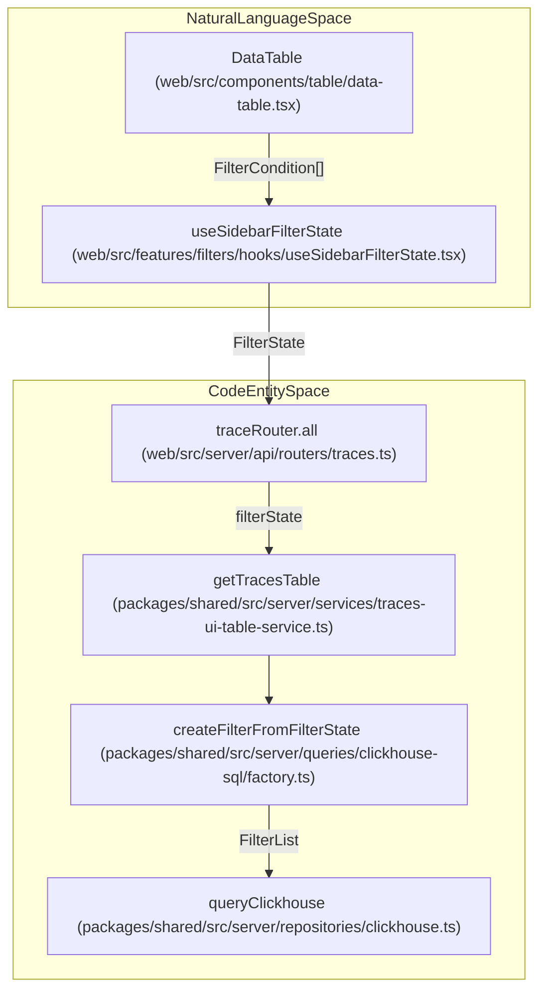
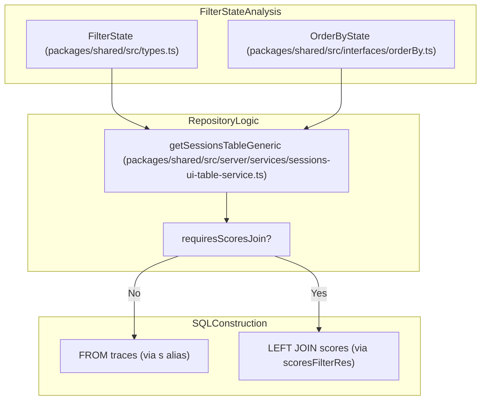

# Query Optimization

관련 소스 파일

다음 파일들은 이 위키 페이지를 생성하기 위한 컨텍스트로 사용되었습니다.

- [packages/shared/src/server/queries/clickhouse-sql/factory.ts](packages/shared/src/server/queries/clickhouse-sql/factory.ts)
- [packages/shared/src/server/queries/clickhouse-sql/search.ts](packages/shared/src/server/queries/clickhouse-sql/search.ts)
- [packages/shared/src/server/queries/createGenerationsQuery.ts](packages/shared/src/server/queries/createGenerationsQuery.ts)
- [packages/shared/src/server/repositories/observations.ts](packages/shared/src/server/repositories/observations.ts)
- [packages/shared/src/server/repositories/scores.ts](packages/shared/src/server/repositories/scores.ts)
- [packages/shared/src/server/repositories/traces.ts](packages/shared/src/server/repositories/traces.ts)
- [packages/shared/src/server/services/InMemoryFilterService.ts](packages/shared/src/server/services/InMemoryFilterService.ts)
- [packages/shared/src/server/services/sessions-ui-table-service.ts](packages/shared/src/server/services/sessions-ui-table-service.ts)
- [packages/shared/src/server/services/traces-ui-table-service.ts](packages/shared/src/server/services/traces-ui-table-service.ts)
- [packages/shared/src/tableDefinitions/types.ts](packages/shared/src/tableDefinitions/types.ts)
- [web/src/__tests__/server/clickhouseSearchCondition.servertest.ts](web/src/__tests__/server/clickhouseSearchCondition.servertest.ts)
- [web/src/__tests__/server/createFilterFromFilterState-filterTypeValidation.servertest.ts](web/src/__tests__/server/createFilterFromFilterState-filterTypeValidation.servertest.ts)
- [web/src/__tests__/server/observations-api.servertest.ts](web/src/__tests__/server/observations-api.servertest.ts)
- [web/src/features/evals/hooks/useEvalConfigFilterOptions.ts](web/src/features/evals/hooks/useEvalConfigFilterOptions.ts)
- [web/src/features/evals/pages/remap-evaluator.tsx](web/src/features/evals/pages/remap-evaluator.tsx)
- [web/src/features/evals/utils/evaluator-constants.ts](web/src/features/evals/utils/evaluator-constants.ts)
- [web/src/features/public-api/types/metrics.ts](web/src/features/public-api/types/metrics.ts)
- [web/src/features/public-api/types/sessions.ts](web/src/features/public-api/types/sessions.ts)
- [web/src/pages/api/public/metrics/index.ts](web/src/pages/api/public/metrics/index.ts)
- [web/src/pages/api/public/v2/metrics.ts](web/src/pages/api/public/v2/metrics.ts)
- [web/src/pages/api/public/v2/observations/index.ts](web/src/pages/api/public/v2/observations/index.ts)
- [web/src/server/api/routers/generations/db/getAllGenerationsSqlQuery.ts](web/src/server/api/routers/generations/db/getAllGenerationsSqlQuery.ts)
- [web/src/server/api/routers/generations/filterOptionsQuery.ts](web/src/server/api/routers/generations/filterOptionsQuery.ts)
- [web/src/server/api/routers/generations/getAllQueries.ts](web/src/server/api/routers/generations/getAllQueries.ts)
- [web/src/server/api/routers/observations.ts](web/src/server/api/routers/observations.ts)
- [web/src/server/api/routers/scores.ts](web/src/server/api/routers/scores.ts)
- [web/src/server/api/routers/sessions.ts](web/src/server/api/routers/sessions.ts)
- [web/src/server/api/routers/traces.ts](web/src/server/api/routers/traces.ts)

이 페이지는 ClickHouse query performance를 개선하기 위해 Langfuse codebase 전반에서 사용되는 query optimization strategy를 문서화합니다. 이러한 최적화는 구조화된 Repository pattern과 특화된 Query Builder를 통해 table scan을 줄이고, expensive JOIN을 최소화하며, time-based partitioning을 활용하는 데 초점을 둡니다.

## 개요

Langfuse는 대용량 observability data를 효율적으로 처리하기 위해 여러 query optimization strategy를 구현합니다.

- **Common Table Expressions (CTEs)**: `traces`와 join하기 전에 `observations` table에서 trace-level metric(latency, cost, usage)을 계산하는 등 복잡한 aggregation에 CTE를 사용합니다 [packages/shared/src/server/repositories/traces.ts:102-126]().
- **Conditional JOINs**: filter 또는 requested measure가 요구할 때만 table join을 동적으로 추가합니다. 예를 들어 observation-level filter가 활성화된 경우에만 `observations_agg`를 join합니다 [packages/shared/src/server/repositories/traces.ts:163-164]().
- **Time Window Constraints**: partition scan을 제한하기 위해 time-based filter를 사용합니다. 시스템은 search 범위를 좁히기 위해 lookback window(예: `±2 day` 또는 특정 interval)를 적용합니다 [packages/shared/src/server/repositories/traces.ts:166-168]().
- **Deduplication Control**: 여러 read path에서 `FINAL`의 performance penalty 없이 record의 최신 version을 가져오기 위해 `ORDER BY event_ts DESC`와 함께 `LIMIT 1 BY id, project_id`를 활용합니다 [packages/shared/src/server/repositories/observations.ts:75-76]().
- **Skip Final for OTel**: span이 immutable인 OpenTelemetry 기반 project의 경우, `shouldSkipObservationsFinal`을 사용해 expensive deduplication logic을 건너뜁니다 [packages/shared/src/server/repositories/observations.ts:148-188]().
- **V4 Beta Synthetic Trace Optimization**: V4 architecture에서는 `traces` table join을 완전히 피하기 위해 `getScoresUiTableFromEvents` 및 `getTraceMetadataByIdsFromEvents`를 사용해 observation event에서 trace metadata를 직접 derive하는 경우가 많습니다 [web/src/server/api/routers/scores.ts:211-224]().

출처: [packages/shared/src/server/repositories/traces.ts:102-168](), [packages/shared/src/server/repositories/observations.ts:75-188](), [web/src/server/api/routers/scores.ts:211-224]()

## Repository Query Architecture

Repository layer는 tRPC API router를 optimized ClickHouse SQL에 연결합니다. UI `FilterState`를 ClickHouse-specific SQL fragment로 변환하는 작업을 처리합니다.

### Data Flow Diagram
다음 다이어그램은 시스템이 UI filter state를 Repository layer로 연결하는 방식을 보여줍니다.

**Diagram: Relationship between UI filter interactions and ClickHouse repository execution.**

### Implementation Detail
`getTracesTableGeneric` 같은 function은 base project-level security를 설정하기 위해 `getProjectIdDefaultFilter`를 활용한 뒤, UI에서 생성된 dynamic filter를 append합니다 [packages/shared/src/server/services/traces-ui-table-service.ts:222-225](). 이를 통해 모든 query가 `project_id`로 partitioning되고, 보통 `FilterState`에서 derive된 time range로도 제한됩니다.

출처: [packages/shared/src/server/services/traces-ui-table-service.ts:206-225](), [web/src/server/api/routers/traces.ts:125-152](), [packages/shared/src/server/queries/clickhouse-sql/factory.ts:186-203]()

## Complex Aggregation Patterns

Langfuse는 계층적 구조(Traces -> Observations -> Scores) 전반에서 data를 aggregate하기 위해 특화된 ClickHouse function과 CTE structure를 활용합니다.

### CTE Aggregation
`checkTraceExistsAndGetTimestamp`에서는 `observations_agg`라는 CTE를 사용해 trace에 속한 모든 observation 전반의 aggregated level(ERROR, WARNING 등)과 latency를 미리 계산합니다 [packages/shared/src/server/repositories/traces.ts:102-126](). 이를 통해 main `traces` query 중 `observations` table을 반복적으로 scan하지 않도록 방지합니다.

### Optimized Functions
- `sumMap(usage_details)`: 여러 span의 token usage map을 효율적으로 aggregate합니다 [packages/shared/src/server/repositories/traces.ts:116]().
- `multiIf`: aggregation 내에서 "worst" status level을 결정하는 데 사용됩니다(예: observation 중 하나라도 'ERROR'이면 trace level은 'ERROR') [packages/shared/src/server/repositories/traces.ts:105-110]().
- `date_diff`: 가장 이른 `start_time`과 가장 늦은 `end_time` 사이의 span을 찾아 millisecond 단위 latency를 계산합니다 [packages/shared/src/server/repositories/traces.ts:115]().
- `reduceUsageOrCostDetails`: 복잡한 ClickHouse `usage_details` map을 표준 UI metric으로 flatten하는 데 사용되는 TypeScript utility입니다 [packages/shared/src/server/services/traces-ui-table-service.ts:108-116]().

출처: [packages/shared/src/server/repositories/traces.ts:102-126](), [packages/shared/src/server/services/traces-ui-table-service.ts:105-145]()

## Conditional JOIN Optimization

repository layer는 `FilterState`와 requested column을 분석하여 secondary table join이 필요한지 판단합니다.

### Join Decision Logic
`getSessionsTableGeneric`에서 시스템은 filter가 `scores` table을 reference하는지 또는 `orderBy` clause가 score metric을 target하는지 감지합니다. 둘 다 해당되지 않으면 scores table에 대한 expensive join을 생략합니다 [packages/shared/src/server/services/sessions-ui-table-service.ts:218-221]().

**Diagram: Conditional JOIN logic for session metrics based on active filters and sorting.**

출처: [packages/shared/src/server/services/sessions-ui-table-service.ts:175-221]()

## Filter Optimization

`createFilterFromFilterState` function은 UI filter를 `StringFilter`, `DateTimeFilter`, `StringOptionsFilter` 같은 특화된 ClickHouse filter class에 mapping합니다 [packages/shared/src/server/queries/clickhouse-sql/factory.ts:75-161]().

### Performance Patterns
- **Time-based Pruning**: 시스템은 ClickHouse `timestamp` 또는 `start_time` column에 직접 `WHERE` condition으로 적용하기 위해 `DateTimeFilter` value를 자동으로 extract하여 partition pruning을 보장합니다 [packages/shared/src/server/services/sessions-ui-table-service.ts:188-204]().
- **Interval-based Lookups**: 관련 entity를 확인할 때(예: trace에 대한 observation 찾기), 시스템은 ClickHouse search window를 제한하기 위해 `TRACE_TO_OBSERVATIONS_INTERVAL` 같은 predefined constant를 사용합니다 [packages/shared/src/server/repositories/observations.ts:186]().
- **Batch Processing**: session view의 경우, 시스템은 큰 trace ID list를 chunk(예: 한 번에 500개)로 나누고 score 및 cost에 대한 parallelized query를 실행하여 ClickHouse memory limit에 걸리지 않도록 방지합니다 [web/src/server/api/routers/sessions.ts:97-124]().
- **Metadata Exclusion**: internal UI route는 해당 view에 metadata가 필요하지 않은 경우 network payload와 memory overhead를 줄이기 위해 `excludeMetadata: true`로 `getScoresForTraces`를 호출하는 경우가 많습니다 [packages/shared/src/server/repositories/scores.ts:210-222]().

출처: [packages/shared/src/server/services/sessions-ui-table-service.ts:188-204](), [packages/shared/src/server/repositories/observations.ts:183-188](), [web/src/server/api/routers/sessions.ts:97-124](), [packages/shared/src/server/repositories/scores.ts:210-222]()

## Performance Instrumentation

Langfuse는 `measureAndReturn` wrapper를 사용해 query performance를 monitor합니다. 이 utility는 다음을 캡처합니다.
- **Operation Name**: 예: `checkTraceExistsAndGetTimestamp` [packages/shared/src/server/repositories/traces.ts:129]().
- **Project Context**: performance metric을 특정 `projectId`와 연결합니다 [packages/shared/src/server/repositories/traces.ts:130]().
- **Tags**: 세분화된 dashboarding을 위해 `feature: "tracing"` 및 `kind: "exists"` 같은 metadata를 추가합니다 [packages/shared/src/server/repositories/traces.ts:146-152]().

출처: [packages/shared/src/server/repositories/traces.ts:128-155](), [packages/shared/src/server/repositories/observations.ts:28](), [packages/shared/src/server/repositories/scores.ts:47]()
