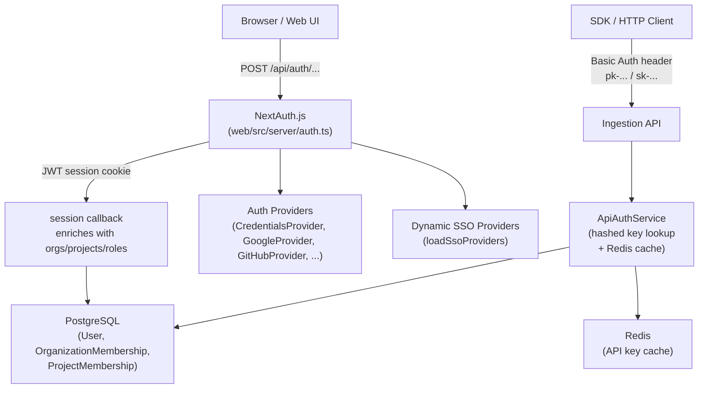
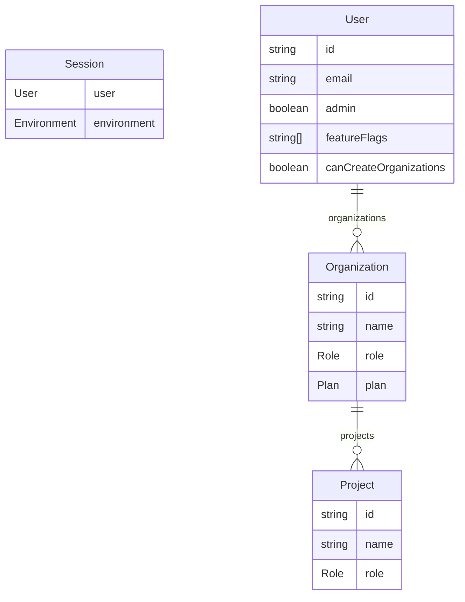
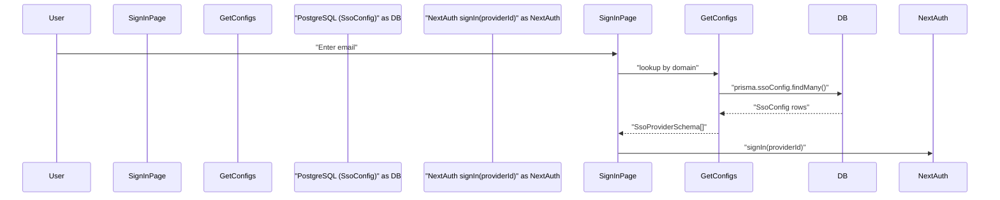

# Authentication & Authorization

관련 소스 파일

다음 파일들은 이 위키 페이지를 생성하기 위한 컨텍스트로 사용되었습니다.

- [.env.dev-azure.example](.env.dev-azure.example)
- [.env.dev.example](.env.dev.example)
- [.env.prod.example](.env.prod.example)
- [packages/shared/src/features/monitors/service/helpers.test.ts](packages/shared/src/features/monitors/service/helpers.test.ts)
- [packages/shared/src/features/monitors/service/helpers.ts](packages/shared/src/features/monitors/service/helpers.ts)
- [packages/shared/src/features/monitors/service/service.ts](packages/shared/src/features/monitors/service/service.ts)
- [packages/shared/src/features/monitors/service/types.test.ts](packages/shared/src/features/monitors/service/types.test.ts)
- [packages/shared/src/features/monitors/service/types.ts](packages/shared/src/features/monitors/service/types.ts)
- [packages/shared/src/server/auth/jumpcloudProvider.ts](packages/shared/src/server/auth/jumpcloudProvider.ts)
- [web/src/__tests__/server/monitorService.servertest.ts](web/src/__tests__/server/monitorService.servertest.ts)
- [web/src/__tests__/server/monitors.servertest.ts](web/src/__tests__/server/monitors.servertest.ts)
- [web/src/components/layouts/app-layout/utils/pathClassification.ts](web/src/components/layouts/app-layout/utils/pathClassification.ts)
- [web/src/ee/features/multi-tenant-sso/types.ts](web/src/ee/features/multi-tenant-sso/types.ts)
- [web/src/ee/features/multi-tenant-sso/utils.ts](web/src/ee/features/multi-tenant-sso/utils.ts)
- [web/src/env.mjs](web/src/env.mjs)
- [web/src/features/auth-credentials/components/ResetPasswordButton.tsx](web/src/features/auth-credentials/components/ResetPasswordButton.tsx)
- [web/src/features/auth-credentials/components/ResetPasswordPage.tsx](web/src/features/auth-credentials/components/ResetPasswordPage.tsx)
- [web/src/features/auth-credentials/lib/credentialsUtils.ts](web/src/features/auth-credentials/lib/credentialsUtils.ts)
- [web/src/features/auth-credentials/server/signupApiHandler.ts](web/src/features/auth-credentials/server/signupApiHandler.ts)
- [web/src/features/feature-flags/available-flags.ts](web/src/features/feature-flags/available-flags.ts)
- [web/src/features/posthog-analytics/usePostHogClientCapture.ts](web/src/features/posthog-analytics/usePostHogClientCapture.ts)
- [web/src/features/rbac/constants/projectAccessRights.ts](web/src/features/rbac/constants/projectAccessRights.ts)
- [web/src/pages/api/auth/signup-verify.ts](web/src/pages/api/auth/signup-verify.ts)
- [web/src/pages/auth/setup-password.tsx](web/src/pages/auth/setup-password.tsx)
- [web/src/pages/auth/sign-in.tsx](web/src/pages/auth/sign-in.tsx)
- [web/src/pages/auth/sign-up.tsx](web/src/pages/auth/sign-up.tsx)
- [web/src/server/auth.ts](web/src/server/auth.ts)
- [web/types/next-auth.d.ts](web/types/next-auth.d.ts)

이 페이지는 Langfuse platform 전반에서 사용자와 API client가 어떻게 authenticate되고 access가 어떻게 control되는지에 대한 개요를 제공합니다. NextAuth.js 기반 web UI authentication stack, enterprise multi-tenant SSO system, API key authentication, role-based access control(RBAC) model을 다룹니다.

특정 sub-system에 대한 자세한 내용은 다음을 참조하세요.
- [Authentication System](#4.1) — NextAuth.js configuration, user/org/project data로 JWT를 enrich하는 session callback, provider setup을 문서화합니다.
- [Multi-tenant SSO](#4.2) — domain-based SSO provider detection, organization별 OAuth credential을 위한 SsoConfig table, credential encryption, automatic SSO enforcement를 위한 verified domain을 설명합니다.
- [API Key Management](#4.3) — API key creation, scope(ORGANIZATION vs PROJECT), hashed secret storage, verification flow를 문서화합니다.
- [RBAC & Permissions](#4.4) — role system(OrganizationMembership, ProjectMembership), role resolution, scope-based access control을 설명합니다.

---

## High-Level Architecture

Langfuse에는 두 가지 distinct authentication path가 있습니다.

1.  **Browser sessions** — NextAuth.js(credentials, OAuth 또는 SSO)를 통해 web UI에 sign in하는 사용자.
2.  **API clients** — project-scoped 또는 organization-scoped API key로 authenticate하는 SDK 또는 HTTP client.

**Authentication paths overview**

출처: [web/src/server/auth.ts:1-60](), [web/src/ee/features/multi-tenant-sso/utils.ts:103-116](), [web/src/env.mjs:40-105]()

---

## Session Authentication (NextAuth.js)

web application은 **JWT session strategy**와 함께 [NextAuth.js](https://next-auth.js.org/)를 사용합니다. main configuration은 `web/src/server/auth.ts`에서 assemble됩니다.

### Session Strategy

Session은 configurable lifetime을 가진 signed JWT로 저장됩니다. `NEXTAUTH_SECRET`은 signing에 사용됩니다 [web/src/env.mjs:49-52](). session max age는 `AUTH_SESSION_MAX_AGE`로 구성할 수 있습니다 [.env.prod.example:63]().

### Session Enrichment

NextAuth session을 touch하는 모든 request는 `session` callback을 실행하며, 이 callback은 PostgreSQL에서 user를 다시 fetch하고 다음을 attach합니다.

*   User identity field(`id`, `name`, `email`, `image`, `admin`) [web/types/next-auth.d.ts:29-35]()
*   Feature flag(`featureFlags`) [web/types/next-auth.d.ts:59-59]()
*   `canCreateOrganizations` flag(`LANGFUSE_ALLOWED_ORGANIZATION_CREATORS` allowlist로 제어됨 [web/src/server/auth.ts:70-88]())
*   사용자의 각 `role`을 포함한 `organizations` 및 nested `projects`의 전체 hierarchy [web/types/next-auth.d.ts:40-58]().

**Session data shape**

출처: [web/src/server/auth.ts:147-158](), [web/types/next-auth.d.ts:18-61](), [web/src/env.mjs:78-105]()

---

## Authentication Providers

### Static Providers

Provider는 `web/src/server/auth.ts`에 register되며, 해당 environment variable이 설정된 경우 startup 시 activate됩니다.

| Provider | Environment Variables Required | Notes |
| :--- | :--- | :--- |
| `CredentialsProvider` | _(항상 활성화됨, 단 `AUTH_DISABLE_USERNAME_PASSWORD=true`인 경우 제외)_ | Email + password [web/src/server/auth.ts:91-161]() |
| `EmailProvider` | `SMTP_CONNECTION_URL`, `EMAIL_FROM_ADDRESS` | OTP-based password reset [web/src/server/auth.ts:164-176]() |
| `GoogleProvider` | `AUTH_GOOGLE_CLIENT_ID`, `AUTH_GOOGLE_CLIENT_SECRET` | [web/src/env.mjs:113-114]() |
| `GitHubProvider` | `AUTH_GITHUB_CLIENT_ID`, `AUTH_GITHUB_CLIENT_SECRET` | [web/src/env.mjs:120-121]() |
| `AzureADProvider` | `AUTH_AZURE_AD_CLIENT_ID`, `AUTH_AZURE_AD_TENANT_ID` | [web/src/env.mjs:141-143]() |
| `OktaProvider` | `AUTH_OKTA_CLIENT_ID`, `AUTH_OKTA_ISSUER` | [web/src/env.mjs:148-150]() |
| `AuthentikProvider` | `AUTH_AUTHENTIK_CLIENT_ID`, `AUTH_AUTHENTIK_ISSUER` | [web/src/env.mjs:155-157]() |
| `Auth0Provider` | `AUTH_AUTH0_CLIENT_ID`, `AUTH_AUTH0_ISSUER` | [web/src/env.mjs:176-178]() |

출처: [web/src/server/auth.ts:90-200](), [web/src/env.mjs:113-205]()

### Dynamic (Multi-tenant) SSO Providers

request time에 `loadSsoProviders()`는 PostgreSQL에서 `SsoConfig` row를 읽고 이를 NextAuth `Provider` instance로 변환합니다. 이는 Enterprise Edition 기능입니다 [web/src/ee/features/multi-tenant-sso/utils.ts:103-116]().

### Credentials Flow

`CredentialsProvider.authorize` function [web/src/server/auth.ts:101-159]()은 다음을 수행합니다.
1.  `AUTH_DISABLE_USERNAME_PASSWORD` flag를 확인합니다 [web/src/server/auth.ts:103-106]().
2.  email domain이 SSO-blocked-domains list에 있는지 확인합니다 [web/src/server/auth.ts:108-114]().
3.  enterprise SSO enforcement를 위해 `getSsoAuthProviderIdForDomain`을 호출합니다 [web/src/server/auth.ts:117-121]().
4.  PostgreSQL에서 user를 lookup하고 password hash를 verify합니다 [web/src/server/auth.ts:123-145]().

출처: [web/src/server/auth.ts:101-159](), [web/src/ee/features/multi-tenant-sso/utils.ts:133-143]()

---

## Multi-tenant SSO (Enterprise Edition)

Multi-tenant SSO는 organization이 `SsoConfig` table을 통해 database에 저장되는 domain-specific SSO provider를 구성할 수 있게 합니다 [web/src/ee/features/multi-tenant-sso/utils.ts:53-62]().

**Multi-tenant SSO flow**

출처: [web/src/ee/features/multi-tenant-sso/utils.ts:39-96](), [web/src/pages/auth/sign-in.tsx:99-185]()

### Key Functions

| Function | File | Description |
| :--- | :--- | :--- |
| `getSsoConfigs()` | [web/src/ee/features/multi-tenant-sso/utils.ts:39-96]() | `SsoConfig` row를 fetch하고 cache합니다(TTL 10분). |
| `loadSsoProviders()` | [web/src/ee/features/multi-tenant-sso/utils.ts:103-116]() | `SsoProviderSchema` object를 NextAuth `Provider` instance로 변환합니다. |
| `getSsoAuthProviderIdForDomain()` | [web/src/ee/features/multi-tenant-sso/utils.ts:133-143]() | SSO enforcement를 위해 주어진 domain의 provider ID를 반환합니다. |

출처: [web/src/ee/features/multi-tenant-sso/utils.ts](), [web/src/ee/features/multi-tenant-sso/types.ts:49-214]()

---

## API Key Management

SDK 및 HTTP client는 project-scoped 또는 organization-scoped API key pair를 사용해 authenticate합니다. API key는 public key와 secret key로 구성됩니다. Secret key는 `SALT`를 사용해 hash됩니다 [web/src/env.mjs:70-75]().

API key creation 및 deletion event는 analytics를 위해 tracking됩니다 [web/src/features/posthog-analytics/usePostHogClientCapture.ts:192-193]().

출처: [web/src/env.mjs:70-75](), [web/src/features/posthog-analytics/usePostHogClientCapture.ts:192-193]()

---

## RBAC & Permissions

### Role Hierarchy

role system은 organization 및 project level 모두에 적용됩니다: `OWNER`, `ADMIN`, `MEMBER`, `VIEWER`, `NONE` [web/src/env.mjs:89-105]().

### Membership Model

-   **Organization Level**: `OrganizationMembership` role로 정의됩니다.
-   **Project Level**: `ProjectMembership` role로 정의됩니다.
-   **Default Access**: 새 user는 `LANGFUSE_DEFAULT_ORG_ID` 및 `LANGFUSE_DEFAULT_PROJECT_ID`를 통해 default organization 및 project에 auto-assigned될 수 있습니다 [web/src/env.mjs:78-105]().

### Enforcement via Scopes

Langfuse는 `projectRoleAccessRights`에 정의된 granular scope system을 사용합니다 [web/src/features/rbac/constants/projectAccessRights.ts:88-262](). 각 role은 `traces:delete`, `scores:CUD`, `prompts:read` 같은 `ProjectScope` string set에 mapping됩니다.

| Role | Access Level Summary |
| :--- | :--- |
| `OWNER` | project deletion 및 member management를 포함한 full access [web/src/features/rbac/constants/projectAccessRights.ts:89-144](). |
| `ADMIN` | project deletion을 제외한 full project access [web/src/features/rbac/constants/projectAccessRights.ts:145-199](). |
| `MEMBER` | 대부분의 resource(trace, prompt, dataset)를 read 및 create할 수 있습니다 [web/src/features/rbac/constants/projectAccessRights.ts:200-241](). |
| `VIEWER` | project data에 대한 read-only access [web/src/features/rbac/constants/projectAccessRights.ts:242-260](). |

출처: [web/src/features/rbac/constants/projectAccessRights.ts:5-262](), [web/src/env.mjs:78-105]()

---

## Key Environment Variables Summary

| Category | Variable | Description |
| :--- | :--- | :--- |
| NextAuth | `NEXTAUTH_SECRET` | JWT signing secret [web/src/env.mjs:49-52]() |
| NextAuth | `NEXTAUTH_URL` | application의 canonical URL [web/src/env.mjs:54-63]() |
| API Keys | `SALT` | API secret key hashing에 필요 [web/src/env.mjs:70-75]() |
| SSO (EE) | `ENCRYPTION_KEY` | 민감한 SSO credential을 encrypt하기 위한 hex key [.env.prod.example:26]() |
| Defaults | `LANGFUSE_DEFAULT_ORG_ID` | 새 user를 이 org에 auto-enroll합니다 [web/src/env.mjs:78-88]() |

출처: [web/src/env.mjs:40-230](), [.env.prod.example:1-180]()
