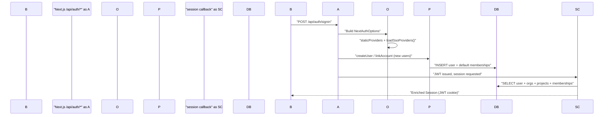
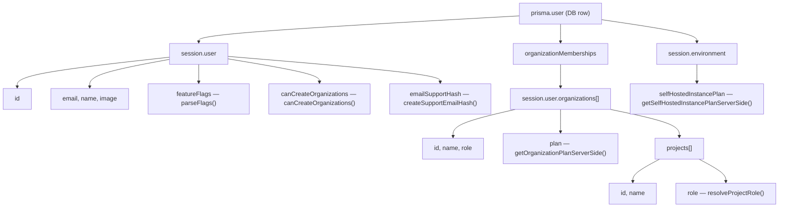

# Authentication System

관련 소스 파일

다음 파일들은 이 위키 페이지를 생성하기 위한 컨텍스트로 사용되었습니다.

- [.env.dev-azure.example](.env.dev-azure.example)
- [.env.dev.example](.env.dev.example)
- [.env.prod.example](.env.prod.example)
- [packages/shared/src/server/auth/jumpcloudProvider.ts](packages/shared/src/server/auth/jumpcloudProvider.ts)
- [web/src/components/layouts/app-layout/utils/pathClassification.ts](web/src/components/layouts/app-layout/utils/pathClassification.ts)
- [web/src/ee/features/multi-tenant-sso/types.ts](web/src/ee/features/multi-tenant-sso/types.ts)
- [web/src/ee/features/multi-tenant-sso/utils.ts](web/src/ee/features/multi-tenant-sso/utils.ts)
- [web/src/env.mjs](web/src/env.mjs)
- [web/src/features/auth-credentials/components/ResetPasswordButton.tsx](web/src/features/auth-credentials/components/ResetPasswordButton.tsx)
- [web/src/features/auth-credentials/components/ResetPasswordPage.tsx](web/src/features/auth-credentials/components/ResetPasswordPage.tsx)
- [web/src/features/auth-credentials/lib/credentialsUtils.ts](web/src/features/auth-credentials/lib/credentialsUtils.ts)
- [web/src/features/auth-credentials/server/signupApiHandler.ts](web/src/features/auth-credentials/server/signupApiHandler.ts)
- [web/src/features/auth/lib/createProjectMembershipsOnSignup.ts](web/src/features/auth/lib/createProjectMembershipsOnSignup.ts)
- [web/src/features/posthog-analytics/ServerPosthog.ts](web/src/features/posthog-analytics/ServerPosthog.ts)
- [web/src/features/posthog-analytics/usePostHogClientCapture.ts](web/src/features/posthog-analytics/usePostHogClientCapture.ts)
- [web/src/features/rbac/components/CreateProjectMemberButton.tsx](web/src/features/rbac/components/CreateProjectMemberButton.tsx)
- [web/src/initialize.ts](web/src/initialize.ts)
- [web/src/pages/api/auth/signup-verify.ts](web/src/pages/api/auth/signup-verify.ts)
- [web/src/pages/auth/setup-password.tsx](web/src/pages/auth/setup-password.tsx)
- [web/src/pages/auth/sign-in.tsx](web/src/pages/auth/sign-in.tsx)
- [web/src/pages/auth/sign-up.tsx](web/src/pages/auth/sign-up.tsx)
- [web/src/server/auth.ts](web/src/server/auth.ts)
- [web/types/next-auth.d.ts](web/types/next-auth.d.ts)

이 페이지는 web application의 authentication layer를 문서화합니다. NextAuth.js가 어떻게 구성되는지, 어떤 provider가 지원되는지, Prisma adapter가 어떻게 확장되는지, session이 organization 및 project membership data로 어떻게 enrich되는지를 설명합니다. 또한 sign-in 및 sign-up UI page도 다룹니다.

public REST API에서 사용되는 API key authentication은 [API Key Management](#4.3)를 참조하세요. multi-tenant SSO configuration management는 [Multi-tenant SSO](#4.2)를 참조하세요. role-based access control enforcement는 [RBAC & Permissions](#4.4)를 참조하세요.

---

## 개요

Authentication은 **NextAuth.js**로 구현되며 `web/src/server/auth.ts`에서 완전히 구성됩니다. configuration은 async function `getAuthOptions`가 생성하며, static provider list와 request time에 database에서 동적으로 load되는 provider를 merge합니다.

Session은 **JWT strategy**를 사용하며, session callback에 대한 모든 request에서 database를 기준으로 validate됩니다. session object는 사용자의 전체 organization 및 project membership tree로 확장되어, 추가 query 없이 application 어디서나 RBAC data를 사용할 수 있게 합니다.

**Authentication Flow Summary:**

Title: Authentication Sequence

출처: [web/src/server/auth.ts:654-660](), [web/src/server/auth.ts:500-633]()

---

## `getAuthOptions` and Provider Loading

`getAuthOptions`는 각 NextAuth route request마다 호출되는 async factory입니다. 이 함수는 다음을 수행합니다.

1. database에 저장된 enterprise SSO provider를 fetch하기 위해 `loadSsoProviders()`를 호출합니다 [web/src/ee/features/multi-tenant-sso/utils.ts:103-116]().
2. 이를 module-level `staticProviders` array와 concatenate합니다 [web/src/server/auth.ts:646-648]().
3. 전체 `NextAuthOptions` object를 반환합니다.

**Provider Architecture:**

Title: Provider Resolution Architecture

```mermaid
flowchart TD
    getAuthOptions["getAuthOptions()"] --> staticProviders["staticProviders (module-level array)"]
    getAuthOptions --> loadSsoProviders["loadSsoProviders() — from DB via getSsoConfigs()"]

    staticProviders --> CP["CredentialsProvider (email/password)"]
    staticProviders --> EP["EmailProvider (SMTP password reset)"]
    staticProviders --> GP["GoogleProvider"]
    staticProviders --> GHP["GitHubProvider"]
    staticProviders --> GHEP["GitHubEnterpriseProvider"]
    staticProviders --> GLP["GitLabProvider"]
    staticProviders --> AP["AzureADProvider"]
    staticProviders --> OP["OktaProvider"]
    staticProviders --> A0P["Auth0Provider"]
    staticProviders --> COGP["CognitoProvider"]
    staticProviders --> KP["KeycloakProvider"]
    staticProviders --> AUP["AuthentikProvider"]
    staticProviders --> OLP["OneLoginProvider"]
    staticProviders --> JCP["JumpCloudProvider"]
    staticProviders --> WOP["WorkOSProvider"]
    staticProviders --> WPP["WordPressProvider"]
    staticProviders --> CSSO["CustomSSOProvider"]

    loadSsoProviders --> dbToNextAuthProvider["dbToNextAuthProvider() per SsoConfig row"]
    dbToNextAuthProvider --> dynProv["Dynamic provider — id format: getAuthProviderIdForSsoConfig(provider)"]
```

출처: [web/src/server/auth.ts:88-648](), [web/src/ee/features/multi-tenant-sso/utils.ts:103-116]()

### Static Providers

모든 static provider는 `env.mjs`의 해당 environment variable 설정 여부에 따라 `staticProviders` array에 조건부로 추가됩니다.

| Provider | Env Vars Required | Notes |
|---|---|---|
| `CredentialsProvider` | _(항상 존재)_ | `AUTH_DISABLE_USERNAME_PASSWORD=true`로 비활성화됨 [web/src/server/auth.ts:102-105]() |
| `EmailProvider` | `SMTP_CONNECTION_URL`, `EMAIL_FROM_ADDRESS` | password-reset OTP flow에 사용됨; 3분 token TTL [web/src/server/auth.ts:163-175]() |
| `GoogleProvider` | `AUTH_GOOGLE_CLIENT_ID`, `AUTH_GOOGLE_CLIENT_SECRET` | `AUTH_GOOGLE_ALLOWED_DOMAINS`를 통한 optional domain allowlist [web/src/env.mjs:113-115]() |
| `GitHubProvider` | `AUTH_GITHUB_CLIENT_ID`, `AUTH_GITHUB_CLIENT_SECRET` | [web/src/env.mjs:120-121]() |
| `GitHubEnterpriseProvider` | `AUTH_GITHUB_ENTERPRISE_CLIENT_ID`, `AUTH_GITHUB_ENTERPRISE_CLIENT_SECRET`, `AUTH_GITHUB_ENTERPRISE_BASE_URL` | [web/src/env.mjs:125-127]() |
| `GitLabProvider` | `AUTH_GITLAB_CLIENT_ID`, `AUTH_GITLAB_CLIENT_SECRET` | `AUTH_GITLAB_URL`을 통한 self-hosted [web/src/env.mjs:133-140]() |
| `AzureADProvider` | `AUTH_AZURE_AD_CLIENT_ID`, `AUTH_AZURE_AD_CLIENT_SECRET`, `AUTH_AZURE_AD_TENANT_ID` | [web/src/env.mjs:141-143]() |
| `OktaProvider` | `AUTH_OKTA_CLIENT_ID`, `AUTH_OKTA_CLIENT_SECRET`, `AUTH_OKTA_ISSUER` | [web/src/env.mjs:148-150]() |
| `Auth0Provider` | `AUTH_AUTH0_CLIENT_ID`, `AUTH_AUTH0_CLIENT_SECRET`, `AUTH_AUTH0_ISSUER` | [web/src/env.mjs:176-178]() |
| `CognitoProvider` | `AUTH_COGNITO_CLIENT_ID`, `AUTH_COGNITO_CLIENT_SECRET`, `AUTH_COGNITO_ISSUER` | [web/src/env.mjs:186-188]() |
| `KeycloakProvider` | `AUTH_KEYCLOAK_CLIENT_ID`, `AUTH_KEYCLOAK_CLIENT_SECRET`, `AUTH_KEYCLOAK_ISSUER` | `AUTH_KEYCLOAK_NAME`을 통한 custom display name [web/src/env.mjs:195-202]() |
| `AuthentikProvider` | `AUTH_AUTHENTIK_CLIENT_ID`, `AUTH_AUTHENTIK_CLIENT_SECRET`, `AUTH_AUTHENTIK_ISSUER` | [web/src/env.mjs:155-163]() |
| `OneLoginProvider` | `AUTH_ONELOGIN_CLIENT_ID`, `AUTH_ONELOGIN_CLIENT_SECRET`, `AUTH_ONELOGIN_ISSUER` | [web/src/env.mjs:169-171]() |
| `JumpCloudProvider` | `AUTH_JUMPCLOUD_CLIENT_ID`, `AUTH_JUMPCLOUD_CLIENT_SECRET`, `AUTH_JUMPCLOUD_ISSUER` | [web/src/env.mjs:223-225]() |
| `WorkOSProvider` | `AUTH_WORKOS_CLIENT_ID`, `AUTH_WORKOS_CLIENT_SECRET` | [web/src/env.mjs:212-213]() |
| `WordPressProvider` | `AUTH_WORDPRESS_CLIENT_ID`, `AUTH_WORDPRESS_CLIENT_SECRET` | [web/src/env.mjs:235-236]() |
| `CustomSSOProvider` | `AUTH_CUSTOM_CLIENT_ID`, `AUTH_CUSTOM_CLIENT_SECRET`, `AUTH_CUSTOM_ISSUER`, `AUTH_CUSTOM_NAME` | [web/src/env.mjs:241-244]() |

출처: [web/src/server/auth.ts:88-648](), [web/src/env.mjs:113-244]()

### Dynamic SSO Providers

Enterprise multi-tenant SSO provider는 `SsoConfig` Prisma table에 저장되며 runtime에 `loadSsoProviders()`가 load합니다 [web/src/ee/features/multi-tenant-sso/utils.ts:103-116](). 이들은 `dbToNextAuthProvider()`에 의해 NextAuth `Provider` instance로 변환됩니다 [web/src/ee/features/multi-tenant-sso/utils.ts:196-201](). provider ID는 동일한 provider type을 사용하는 여러 organization을 처리하기 위해 domain-specific입니다.

SSO config list는 module-level `cachedSsoConfigs` variable을 통해 memory에 10분 동안 cache됩니다(fetch failure 시 1분) [web/src/ee/features/multi-tenant-sso/utils.ts:26-95]().

---

## Extended Prisma Adapter

표준 `PrismaAdapter`는 [web/src/server/auth.ts:500-633]()에서 `extendedPrismaAdapter`로 wrapping 및 확장됩니다. 세 가지 method가 override됩니다.

### `createUser`

새 user가 OAuth provider를 통해 처음 sign up할 때 호출됩니다.

- `AUTH_DISABLE_SIGNUP`을 확인하며, `true`이면 throw합니다 [web/src/server/auth.ts:510-514]().
- profile에 null이 아닌 email이 필요합니다 [web/src/server/auth.ts:516]().
- base `prismaAdapter.createUser`에 delegate합니다 [web/src/server/auth.ts:519]().
- `LANGFUSE_DEFAULT_ORG_ID` / `LANGFUSE_DEFAULT_PROJECT_ID`로 구성된 default org/project membership을 할당하기 위해 `createProjectMembershipsOnSignup(user)`를 호출합니다 [web/src/server/auth.ts:522]().

### `linkAccount`

기존 user가 OAuth account를 link할 때 호출됩니다(예: 기존 email-only account에서 SSO로 첫 sign-in).

- Keycloak payload에서 호환되지 않는 field(`refresh_expires_in`, `not-before-policy`)를 제거합니다 [web/src/server/auth.ts:543-547]().
- WorkOS payload에서 `profile`을 제거합니다 [web/src/server/auth.ts:548]().
- `AUTH_IGNORE_ACCOUNT_FIELDS`에 나열된 모든 field를 제거합니다 [web/src/server/auth.ts:553-559]().
- `createProjectMembershipsOnSignup`를 호출합니다. 이는 idempotent하며 SSO user도 default membership을 얻도록 보장합니다 [web/src/server/auth.ts:566]().

### `useVerificationToken`

OTP-based password reset을 위해 `EmailProvider`에서 사용됩니다.

- 성공 시: event를 log하고 token을 반환합니다 [web/src/server/auth.ts:586-590]().
- 실패 또는 token 없음: identifier에 대한 모든 token을 삭제하고(anti-enumeration measure) `null`을 반환합니다 [web/src/server/auth.ts:592-598]().

출처: [web/src/server/auth.ts:500-633]()

---

## NextAuth Callbacks

### `session` Callback

**모든 session access에서 호출됩니다**. stateless JWT를 rich `Session` object로 확장하기 위해 database에서 user를 다시 fetch합니다.

**Database query fields:**
query는 associated project 및 project membership을 포함한 전체 organization membership hierarchy와 함께 user를 retrieve합니다 [web/src/server/auth.ts:661-683]().

**Session enrichment diagram:**

Title: Session Object Construction

각 project의 project role은 project-level `ProjectMembership`과 organization-level role을 모두 고려하는 `resolveProjectRole()`로 계산됩니다 [web/src/server/auth.ts:756-764]().

출처: [web/src/server/auth.ts:656-782](), [web/types/next-auth.d.ts:18-68]()

### `signIn` Callback

**모든 sign-in attempt에서 session이 생성되기 전에 호출됩니다**.

Validation step은 다음 순서로 진행됩니다.
1. **Email presence** — `user.email`이 없으면 throw합니다 [web/src/server/auth.ts:786]().
2. **Multi-tenant SSO enforcement** — `getSsoAuthProviderIdForDomain(userDomain)`을 호출합니다. domain-specific SSO provider가 구성되어 있고 user가 다른 provider로 sign in하는 경우 sign-in이 block됩니다 [web/src/server/auth.ts:805-812]().
3. **Google domain allowlist** — `AUTH_GOOGLE_ALLOWED_DOMAINS`가 설정되어 있고 provider가 `google`이면, user의 email domain이 allowlist에 있어야 합니다 [web/src/server/auth.ts:835-847]().

출처: [web/src/server/auth.ts:783-850]()

---

## Sign-In and Sign-Up UI

**Files:** `web/src/pages/auth/sign-in.tsx`, `web/src/pages/auth/sign-up.tsx`

### `getServerSideProps`

environment variable과 database configuration을 inspect하여 `PageProps` object를 build합니다.
- `authProviders` — environment variable 존재 여부에 따라 어떤 provider가 active인지 나타내는 map [web/src/pages/auth/sign-in.tsx:103-176]().
- `sso` — `isAnySsoConfigured()`를 통해 database에 enterprise SSO가 하나라도 구성되어 있으면 `true` [web/src/pages/auth/sign-in.tsx:100]().
- `signUpDisabled` — `AUTH_DISABLE_SIGNUP=true`이면 `true` [web/src/pages/auth/sign-in.tsx:177]().

### Two-Step Login/Signup Flow

sign-in과 sign-up 모두 SSO가 활성화된 경우 two-step flow를 구현합니다.
1. User가 email을 입력합니다.
2. application은 `/api/auth/check-sso` endpoint를 통해 domain-specific SSO provider를 확인합니다 [web/src/pages/auth/sign-up.tsx:148-155]().
3. enterprise SSO provider가 발견되면 `signIn(providerId)`를 통해 user를 identity provider로 즉시 redirect합니다 [web/src/pages/auth/sign-up.tsx:165]().
4. SSO가 없으면 credential-based login 또는 signup을 위한 password field를 UI에 표시합니다 [web/src/pages/auth/sign-up.tsx:170]().

출처: [web/src/pages/auth/sign-in.tsx:99-185](), [web/src/pages/auth/sign-up.tsx:77-190]()

---

## Password Management

### Password Reset Flow
`SMTP_CONNECTION_URL`이 구성된 경우 Langfuse는 password reset에 `EmailProvider`를 사용합니다 [web/src/server/auth.ts:163-175](). user는 `ResetPasswordPage`에서 새 password를 설정하기 전에 email을 verify하기 위한 6자리 OTP를 받습니다.

### Signup Verification
email verification이 필요한 경우 Langfuse는 "Verified Signup Flow"를 사용합니다 [web/src/pages/auth/sign-up.tsx:60-67](). 이 flow는 먼저 password 없이 user record를 생성합니다. 그런 다음 user는 `setup-password` page 또는 reset flow를 통해 password를 설정합니다.

출처: [web/src/pages/auth/sign-up.tsx:60-75](), [web/src/server/auth.ts:163-175]()

---

## Key Environment Variables

| Variable | Purpose | Default |
|---|---|---|
| `NEXTAUTH_SECRET` | JWT signing secret | production에서 필수 [web/src/env.mjs:49-52]() |
| `NEXTAUTH_URL` | NextAuth callback용 Base URL | 필수 [web/src/env.mjs:54-63]() |
| `SALT` | API key hashing에 사용되는 salt | 필수 [web/src/env.mjs:70-75]() |
| `AUTH_DISABLE_USERNAME_PASSWORD` | credentials provider 비활성화 | — [web/src/env.mjs:275]() |
| `AUTH_DISABLE_SIGNUP` | new user registration 방지 | — [web/src/env.mjs:276]() |
| `LANGFUSE_DEFAULT_ORG_ID` | 새 user를 auto-add할 org | — [web/src/env.mjs:78-88]() |
| `LANGFUSE_DEFAULT_PROJECT_ID` | 새 user를 auto-add할 project | — [web/src/env.mjs:92-102]() |

출처: [web/src/env.mjs:40-276](), [.env.prod.example:15-152]()
