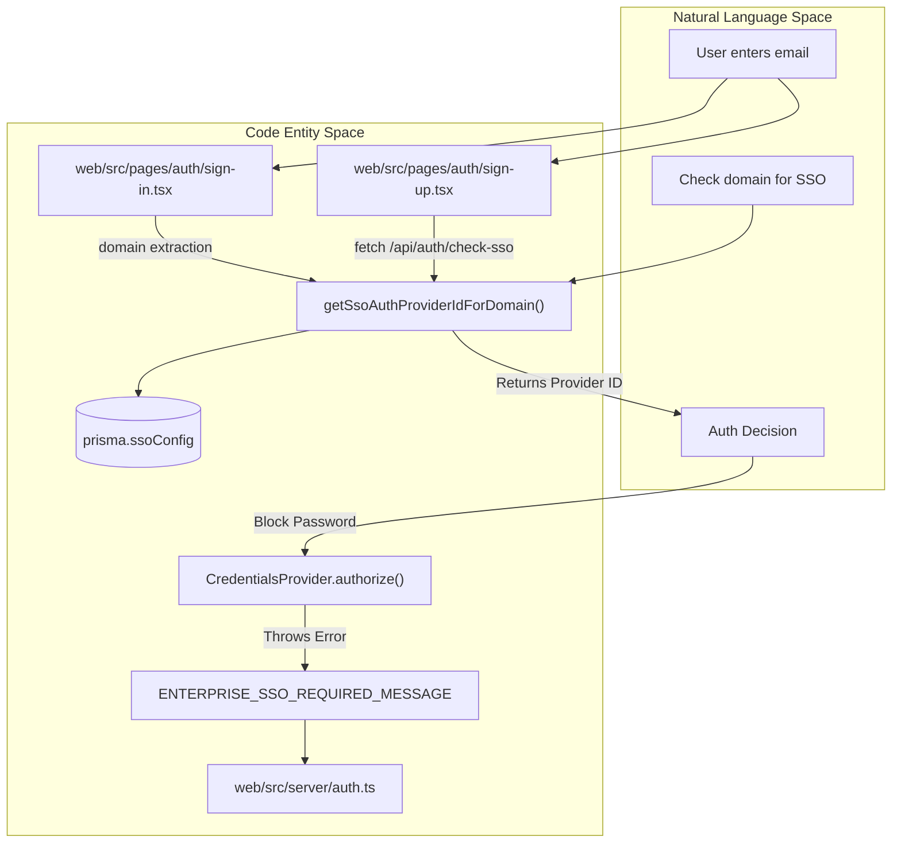
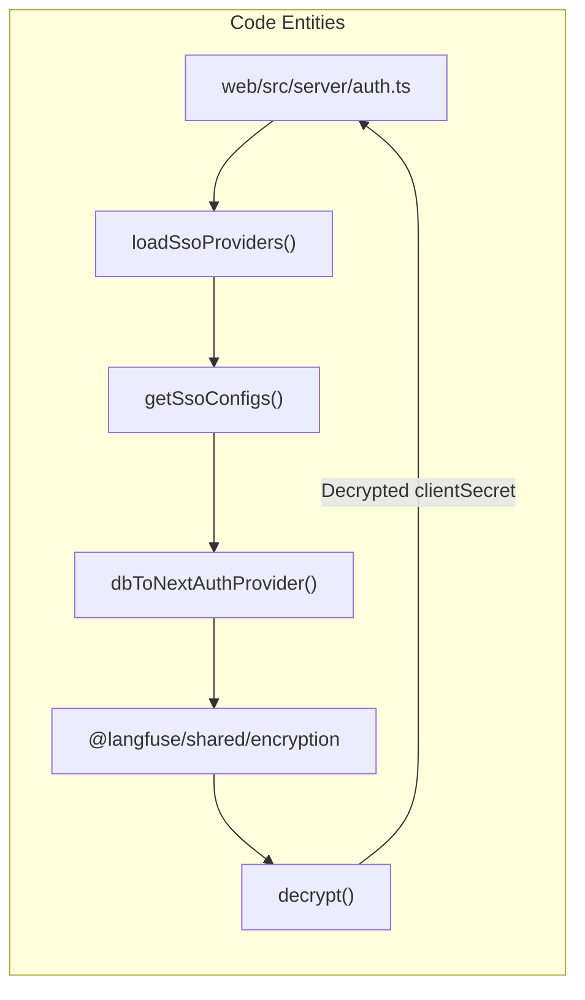

# Multi-tenant SSO

<details>
<summary>관련 소스 파일</summary>

다음 파일들은 이 위키 페이지를 생성하기 위한 컨텍스트로 사용되었습니다.

- [.env.dev-azure.example](.env.dev-azure.example)
- [.env.dev.example](.env.dev.example)
- [.env.prod.example](.env.prod.example)
- [packages/shared/prisma/migrations/20260506144028_add_verified_domains/migration.sql](packages/shared/prisma/migrations/20260506144028_add_verified_domains/migration.sql)
- [packages/shared/prisma/migrations/20260507120000_share_pending_verified_domains/migration.sql](packages/shared/prisma/migrations/20260507120000_share_pending_verified_domains/migration.sql)
- [packages/shared/src/server/auth/jumpcloudProvider.ts](packages/shared/src/server/auth/jumpcloudProvider.ts)
- [web/src/__tests__/server/ssoConfigRouter.servertest.ts](web/src/__tests__/server/ssoConfigRouter.servertest.ts)
- [web/src/__tests__/server/verifiedDomainRouter.servertest.ts](web/src/__tests__/server/verifiedDomainRouter.servertest.ts)
- [web/src/components/layouts/app-layout/utils/pathClassification.ts](web/src/components/layouts/app-layout/utils/pathClassification.ts)
- [web/src/ee/features/multi-tenant-sso/createNewSsoConfigHandler.ts](web/src/ee/features/multi-tenant-sso/createNewSsoConfigHandler.ts)
- [web/src/ee/features/multi-tenant-sso/server/ssoConfigRouter.ts](web/src/ee/features/multi-tenant-sso/server/ssoConfigRouter.ts)
- [web/src/ee/features/multi-tenant-sso/types.ts](web/src/ee/features/multi-tenant-sso/types.ts)
- [web/src/ee/features/multi-tenant-sso/utils.ts](web/src/ee/features/multi-tenant-sso/utils.ts)
- [web/src/ee/features/multi-tenant-sso/validateSsoConfig.ts](web/src/ee/features/multi-tenant-sso/validateSsoConfig.ts)
- [web/src/ee/features/sso-settings/components/SSOSettings.tsx](web/src/ee/features/sso-settings/components/SSOSettings.tsx)
- [web/src/ee/features/verified-domains/components/VerifiedDomainsSettings.tsx](web/src/ee/features/verified-domains/components/VerifiedDomainsSettings.tsx)
- [web/src/env.mjs](web/src/env.mjs)
- [web/src/features/auth-credentials/components/ResetPasswordButton.tsx](web/src/features/auth-credentials/components/ResetPasswordButton.tsx)
- [web/src/features/auth-credentials/components/ResetPasswordPage.tsx](web/src/features/auth-credentials/components/ResetPasswordPage.tsx)
- [web/src/features/auth-credentials/lib/credentialsUtils.ts](web/src/features/auth-credentials/lib/credentialsUtils.ts)
- [web/src/features/auth-credentials/server/signupApiHandler.ts](web/src/features/auth-credentials/server/signupApiHandler.ts)
- [web/src/features/posthog-analytics/usePostHogClientCapture.ts](web/src/features/posthog-analytics/usePostHogClientCapture.ts)
- [web/src/pages/api/auth/signup-verify.ts](web/src/pages/api/auth/signup-verify.ts)
- [web/src/pages/auth/setup-password.tsx](web/src/pages/auth/setup-password.tsx)
- [web/src/pages/auth/sign-in.tsx](web/src/pages/auth/sign-in.tsx)
- [web/src/pages/auth/sign-up.tsx](web/src/pages/auth/sign-up.tsx)
- [web/src/server/auth.ts](web/src/server/auth.ts)
- [web/types/next-auth.d.ts](web/types/next-auth.d.ts)

</details>


## 목적과 범위

이 페이지는 Langfuse의 multi-tenant Single Sign-On(SSO) system을 문서화합니다. 이 system은 organization이 authentication time에 동적으로 detect되고 enforce되는 domain-specific SSO provider를 구성할 수 있게 합니다. 이를 통해 각 organization은 global environment variable이나 application restart 없이 email domain을 기준으로 자체 identity provider(예: Okta, Azure AD, Keycloak)를 사용할 수 있습니다.

NextAuth.js configuration과 static SSO provider를 포함한 일반 authentication system 정보는 [Authentication System (4.1)](4.1)을 참조하세요. authentication 이후 role-based access control에 대한 자세한 내용은 [RBAC & Permissions (4.4)](4.4)를 참조하세요.

---

## System Overview

multi-tenant SSO system은 domain-based SSO routing을 가능하게 합니다. 사용자가 sign-in 또는 sign-up 중 email address를 입력하면, system은 다음을 수행합니다.

1.  **Detection**: email domain(예: `example.com`)을 extract하고 `SsoConfig` table을 query합니다 [web/src/ee/features/multi-tenant-sso/utils.ts:133-143]().
2.  **Routing**: configuration이 존재하면 domain에서 derive된 unique `providerId`를 사용해 사용자를 organization-specific SSO provider로 redirect합니다 [web/src/ee/features/multi-tenant-sso/utils.ts:259-262]().
3.  **Enforcement**: organization security policy 준수를 보장하기 위해 해당 domain에 대한 password-based login을 block합니다 [web/src/server/auth.ts:117-121]().
4.  **Credential Management**: organization별 OAuth credential을 system-wide `ENCRYPTION_KEY`를 사용해 at rest 암호화하여 저장합니다 [web/src/ee/features/multi-tenant-sso/utils.ts:204]().

이 기능은 `multiTenantSsoAvailable`의 enterprise edition license check로 gate됩니다 [web/src/ee/features/multi-tenant-sso/utils.ts:13]().

**출처:** [web/src/ee/features/multi-tenant-sso/utils.ts:13-45](), [web/src/server/auth.ts:41-45](), [web/src/ee/features/multi-tenant-sso/utils.ts:133-143]()

---

## Architecture Diagram

### Sign-in Flow and SSO Detection



**출처:** [web/src/server/auth.ts:117-121](), [web/src/ee/features/multi-tenant-sso/utils.ts:133-143](), [web/src/pages/auth/sign-in.tsx:99-185](), [web/src/pages/auth/sign-up.tsx:145-166]()

---

## Database Schema: SsoConfig Table

`SsoConfig` table은 PostgreSQL에 domain-specific SSO configuration을 저장합니다. 각 record는 email domain을 SSO provider 및 해당 encrypted credential과 연결합니다.

| Field | Type | Description |
| :--- | :--- | :--- |
| `domain` | `string` | Email domain(lowercase), primary key [web/src/ee/features/multi-tenant-sso/types.ts:4-7](). |
| `authProvider` | `enum` | 지원되는 provider type 중 하나(예: `google`, `okta`, `azure-ad`). |
| `authConfig` | `JSON` | `clientId`와 `clientSecret`을 포함하는 encrypted provider-specific configuration. |

`authConfig`가 채워져 있으면, `env.mjs`에 정의된 global environment variable을 override하는 domain-specific OAuth credential을 포함합니다.

**출처:** [web/src/ee/features/multi-tenant-sso/utils.ts:14-16](), [web/src/ee/features/multi-tenant-sso/types.ts:3-7](), [web/src/env.mjs:113-182]()

---

## Supported SSO Provider Types

system은 광범위한 SSO provider를 지원하며, 각 provider에는 `web/src/ee/features/multi-tenant-sso/types.ts`에서 Zod discriminated union을 사용해 정의된 `SsoProviderSchema`의 특정 configuration schema가 있습니다.

| Provider | Type Literal | Required Config Fields |
| :--- | :--- | :--- |
| Google | `"google"` | `clientId`, `clientSecret` [web/src/ee/features/multi-tenant-sso/types.ts:49-60]() |
| GitHub | `"github"` | `clientId`, `clientSecret` [web/src/ee/features/multi-tenant-sso/types.ts:62-72]() |
| GitHub Enterprise | `"github-enterprise"` | `clientId`, `clientSecret`, `enterprise.baseUrl` [web/src/ee/features/multi-tenant-sso/types.ts:74-91]() |
| GitLab | `"gitlab"` | `clientId`, `clientSecret`, optional `issuer` [web/src/ee/features/multi-tenant-sso/types.ts:93-105]() |
| Azure AD | `"azure-ad"` | `clientId`, `clientSecret`, `tenantId` [web/src/ee/features/multi-tenant-sso/types.ts:166-184]() |
| Okta | `"okta"` | `clientId`, `clientSecret`, `issuer` [web/src/ee/features/multi-tenant-sso/types.ts:121-133]() |
| Authentik | `"authentik"` | `clientId`, `clientSecret`, `issuer` (regex validated) [web/src/ee/features/multi-tenant-sso/types.ts:135-150]() |
| OneLogin | `"onelogin"` | `clientId`, `clientSecret`, `issuer` [web/src/ee/features/multi-tenant-sso/types.ts:152-164]() |
| Auth0 | `"auth0"` | `clientId`, `clientSecret`, `issuer` [web/src/ee/features/multi-tenant-sso/types.ts:107-119]() |
| Cognito | `"cognito"` | `clientId`, `clientSecret`, `issuer` [web/src/ee/features/multi-tenant-sso/types.ts:186-198]() |
| Keycloak | `"keycloak"` | `clientId`, `clientSecret`, `issuer`, optional `name` [web/src/ee/features/multi-tenant-sso/types.ts:200-213]() |
| Custom OIDC | `"custom"` | `clientId`, `clientSecret`, `issuer`, `name` [web/src/ee/features/multi-tenant-sso/types.ts:215-226]() |

**출처:** [web/src/ee/features/multi-tenant-sso/types.ts:49-226](), [web/src/ee/features/multi-tenant-sso/utils.ts:196-256]()

---

## Dynamic Provider Loading System

### Provider Loading at Startup



system은 `auth.ts`에서 NextAuth initialization 중 호출되는 `loadSsoProviders()` function을 통해 custom SSO provider를 동적으로 load합니다 [web/src/server/auth.ts:41-45]().

1.  **Fetch configurations**: `getSsoConfigs()`는 caching을 사용해 `SsoConfig` table을 query합니다 [web/src/ee/features/multi-tenant-sso/utils.ts:39-96]().
2.  **Parse and validate**: 각 record는 Zod를 사용해 `SsoProviderSchema`에 대해 validate됩니다 [web/src/ee/features/multi-tenant-sso/utils.ts:71-86]().
3.  **Transform to NextAuth providers**: `dbToNextAuthProvider()`는 database config를 NextAuth `Provider` instance로 변환합니다. 올바른 routing을 보장하기 위해 provider에 domain-specific ID를 사용합니다 [web/src/ee/features/multi-tenant-sso/utils.ts:196-256]().
4.  **Decrypt credentials**: Client secret은 `@langfuse/shared/encryption`의 `decrypt()`를 사용해 decrypt됩니다 [web/src/ee/features/multi-tenant-sso/utils.ts:15-15](), [web/src/ee/features/multi-tenant-sso/utils.ts:204]().

### Configuration Caching

`getSsoConfigs()`의 caching strategy는 performance를 최적화합니다.

*   **Cache TTL**: successful fetch의 경우 10분 [web/src/ee/features/multi-tenant-sso/utils.ts:42]().
*   **Failure retry**: failed fetch의 경우 1분 [web/src/ee/features/multi-tenant-sso/utils.ts:43]().
*   **Database timeout**: authentication process가 hang되지 않도록 Prisma `$transaction`을 통해 2초 max wait 및 3초 timeout을 적용합니다 [web/src/ee/features/multi-tenant-sso/utils.ts:56-62]().

**출처:** [web/src/ee/features/multi-tenant-sso/utils.ts:39-96](), [web/src/server/auth.ts:41-45]()

---

## SSO Enforcement and Detection

### Domain-based Blocking

`auth.ts`의 `CredentialsProvider`는 SSO-enforced domain에 대한 password authentication을 적극적으로 block합니다. `getSsoAuthProviderIdForDomain(domain)`을 통해 해당 domain의 matching configuration이 발견되면, user가 enterprise identity provider를 사용하도록 강제하기 위해 error를 throw합니다 [web/src/server/auth.ts:117-121]().

```typescript
// web/src/server/auth.ts:117-121
const multiTenantSsoProvider =
  await getSsoAuthProviderIdForDomain(domain);
if (multiTenantSsoProvider) {
  throw new Error(ENTERPRISE_SSO_REQUIRED_MESSAGE);
}
```

### Sign-up Flow Integration

`sign-up.tsx`에는 two-step flow가 구현되어 있습니다. user가 email을 입력하면 client는 `/api/auth/check-sso`를 호출하여 해당 domain에 enterprise SSO가 구성되어 있는지 detect합니다. 발견되면 user를 SSO provider로 자동 redirect합니다 [web/src/pages/auth/sign-up.tsx:145-166]().

**출처:** [web/src/server/auth.ts:117-121](), [web/src/pages/auth/sign-up.tsx:145-166](), [web/src/ee/features/multi-tenant-sso/utils.ts:133-143]()

---

## Credential Encryption and Management

### Encryption Logic
SSO provider credential(특히 OAuth `clientSecret`)은 민감한 organization data를 보호하기 위해 저장 전에 encrypt됩니다.

*   **Encryption Key**: `ENCRYPTION_KEY` environment variable은 64-character hex string(256-bit)이어야 합니다. 이 key는 일관된 decryption을 위해 web 및 worker service 전체에서 공유됩니다 [.env.prod.example:26](), [.env.dev.example:131]().
*   **Implementation**:
    *   **Retrieval**: Decryption은 shared encryption package의 `decrypt(provider.authConfig.clientSecret)`를 사용해 `dbToNextAuthProvider`에서 발생합니다 [web/src/ee/features/multi-tenant-sso/utils.ts:204](), [web/src/ee/features/multi-tenant-sso/utils.ts:212]().

### Verified Domains
Organization은 해당 email domain을 가진 모든 user에게 SSO를 enforce하기 위해 domain ownership을 verify할 수 있습니다.
*   **Enforcement**: domain이 verify되면 Langfuse는 해당 domain의 모든 user가 configured SSO provider를 통해 sign in하도록 enforce할 수 있으며, 해당 account에 대한 standard email/password login을 비활성화합니다 [web/src/features/auth-credentials/server/signupApiHandler.ts:46-49]().
*   **Global Enforcement**: Administrator는 environment variable의 `AUTH_DOMAINS_WITH_SSO_ENFORCEMENT`를 사용하여 특정 domain에 대한 password login을 global하게 block할 수도 있습니다 [web/src/features/auth-credentials/server/signupApiHandler.ts:10-16]().

**출처:** [web/src/ee/features/multi-tenant-sso/utils.ts:184-212](), [.env.prod.example:26](), [web/src/features/auth-credentials/server/signupApiHandler.ts:10-49]()
