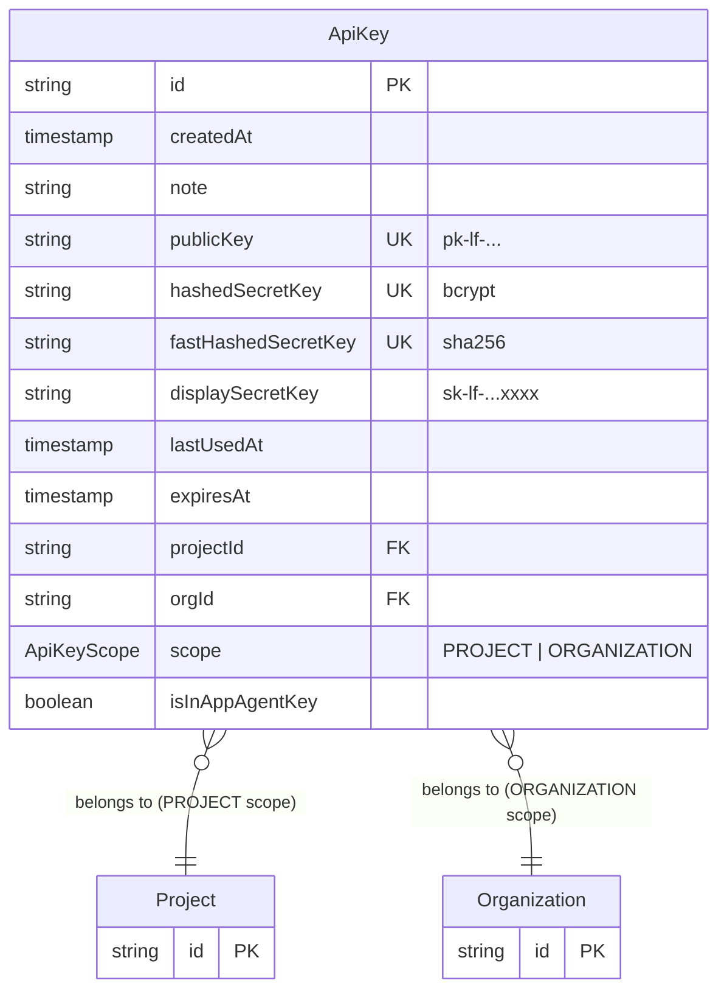
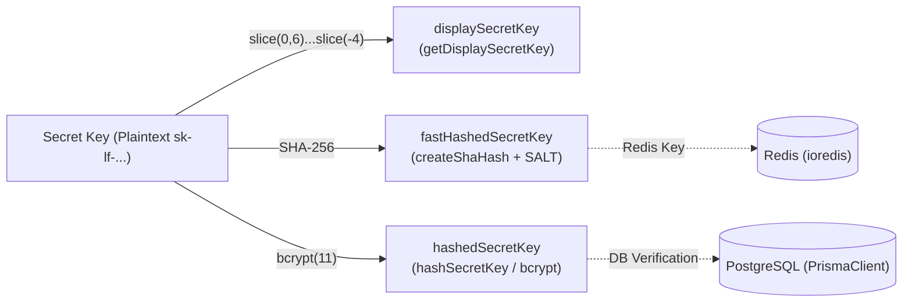
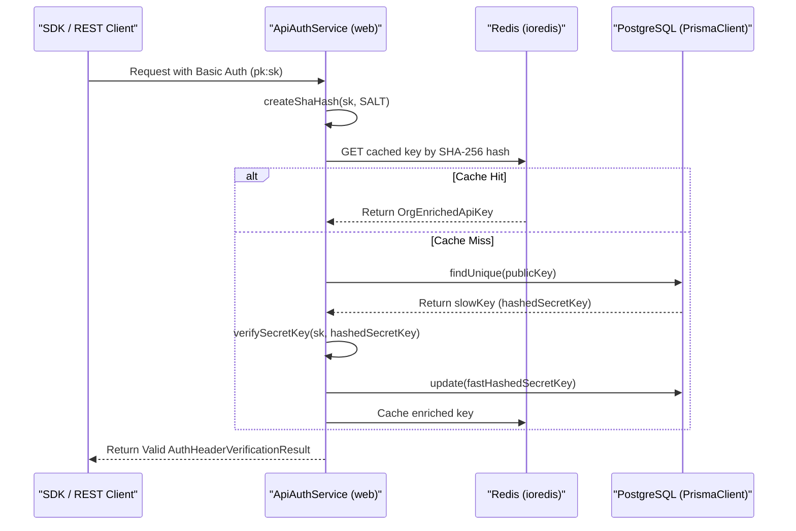

# API Key Management

<details>
<summary>관련 소스 파일</summary>

다음 파일들은 이 위키 페이지를 생성하기 위한 컨텍스트로 사용되었습니다.

- [fern/apis/server/definition/projects.yml](fern/apis/server/definition/projects.yml)
- [packages/shared/prisma/migrations/20250711134738_add_patch_llm_tool_schema_audit_logs_background_migration/migration.sql](packages/shared/prisma/migrations/20250711134738_add_patch_llm_tool_schema_audit_logs_background_migration/migration.sql)
- [packages/shared/src/server/auth/types.ts](packages/shared/src/server/auth/types.ts)
- [packages/shared/src/server/headerPropagation.ts](packages/shared/src/server/headerPropagation.ts)
- [packages/shared/src/server/instrumentation/index.ts](packages/shared/src/server/instrumentation/index.ts)
- [web/src/__tests__/server/projects-api.servertest.ts](web/src/__tests__/server/projects-api.servertest.ts)
- [web/src/__tests__/server/unit/api-auth-span.servertest.ts](web/src/__tests__/server/unit/api-auth-span.servertest.ts)
- [web/src/__tests__/server/unit/langfuse-context-propagation.servertest.ts](web/src/__tests__/server/unit/langfuse-context-propagation.servertest.ts)
- [web/src/components/JSONSchemaEditor.tsx](web/src/components/JSONSchemaEditor.tsx)
- [web/src/components/SettingsDangerZone.tsx](web/src/components/SettingsDangerZone.tsx)
- [web/src/components/layouts/header.tsx](web/src/components/layouts/header.tsx)
- [web/src/ee/features/admin-api/server/projects.ts](web/src/ee/features/admin-api/server/projects.ts)
- [web/src/ee/features/admin-api/server/projects/createProject.ts](web/src/ee/features/admin-api/server/projects/createProject.ts)
- [web/src/ee/features/admin-api/server/projects/projectById/index.ts](web/src/ee/features/admin-api/server/projects/projectById/index.ts)
- [web/src/features/llm-schemas/server/router.ts](web/src/features/llm-schemas/server/router.ts)
- [web/src/features/llm-tools/server/router.ts](web/src/features/llm-tools/server/router.ts)
- [web/src/features/organizations/components/DeleteOrganizationButton.tsx](web/src/features/organizations/components/DeleteOrganizationButton.tsx)
- [web/src/features/organizations/components/RenameOrganization.tsx](web/src/features/organizations/components/RenameOrganization.tsx)
- [web/src/features/projects/components/DeleteProjectButton.tsx](web/src/features/projects/components/DeleteProjectButton.tsx)
- [web/src/features/projects/components/HostNameProject.tsx](web/src/features/projects/components/HostNameProject.tsx)
- [web/src/features/projects/components/RenameProject.tsx](web/src/features/projects/components/RenameProject.tsx)
- [web/src/features/projects/components/TransferProjectButton.tsx](web/src/features/projects/components/TransferProjectButton.tsx)
- [web/src/features/public-api/components/ApiKeyList.tsx](web/src/features/public-api/components/ApiKeyList.tsx)
- [web/src/features/public-api/components/CreateApiKeyButton.tsx](web/src/features/public-api/components/CreateApiKeyButton.tsx)
- [web/src/features/public-api/hooks/useLangfuseEnvCode.ts](web/src/features/public-api/hooks/useLangfuseEnvCode.ts)
- [web/src/features/public-api/server/apiAuth.ts](web/src/features/public-api/server/apiAuth.ts)
- [web/src/features/public-api/server/createAuthedProjectAPIRoute.ts](web/src/features/public-api/server/createAuthedProjectAPIRoute.ts)
- [web/src/pages/api/public/ingestion.ts](web/src/pages/api/public/ingestion.ts)
- [web/src/pages/api/public/projects/[projectId]/index.ts](web/src/pages/api/public/projects/[projectId]/index.ts)
- [web/src/pages/api/public/projects/index.ts](web/src/pages/api/public/projects/index.ts)
- [worker/src/__tests__/patchLLMToolAndLLLMSchemaAuditLogs.test.ts](worker/src/__tests__/patchLLMToolAndLLLMSchemaAuditLogs.test.ts)
- [worker/src/backgroundMigrations/patchLLMToolAndLLLMSchemaAuditLogs.ts](worker/src/backgroundMigrations/patchLLMToolAndLLLMSchemaAuditLogs.ts)

</details>


## 목적과 범위

이 문서는 Langfuse에서 programmatic authentication에 사용되는 API key management system을 설명합니다. API key는 session-based authentication의 대안을 제공하며 SDK 및 REST API access를 가능하게 합니다.

Langfuse의 API key에는 두 가지 distinct scope가 있습니다. 특정 project 내 data에 access하기 위한 **project-level**(`PROJECT`)과 organization 전반의 administrative operation을 위한 **organization-level**(`ORGANIZATION`)입니다. 각 key pair는 public key(visible)와 secret key(hashed되어 안전하게 저장됨)로 구성됩니다.

출처: [packages/shared/src/server/auth/types.ts:22-31]()

---

## API Key Data Model

### Database Schema

PostgreSQL의 `ApiKey` table(Prisma로 관리됨)은 모든 API key metadata와 credential을 저장합니다.



**Key Fields:**

| Field | Type | Purpose |
|-------|------|---------|
| `publicKey` | string (unique) | client에 보이는 identifier이며 Basic Auth의 username으로 사용됩니다. [packages/shared/src/server/auth/types.ts:9-9]() |
| `hashedSecretKey` | string (unique) | verification을 위한 slow hash(bcrypt)이며 cache miss 시 사용됩니다. [packages/shared/src/server/auth/types.ts:15-15]() |
| `fastHashedSecretKey` | string (unique) | Redis cache lookup을 위한 fast hash(SHA-256)입니다. [packages/shared/src/server/auth/types.ts:14-14]() |
| `displaySecretKey` | string | UI에 표시되는 partial key(예: `sk-lf-...abc123`)입니다. [packages/shared/src/server/auth/types.ts:10-10]() |
| `scope` | `ApiKeyScope` | Enum: `PROJECT` 또는 `ORGANIZATION`. [packages/shared/src/server/auth/types.ts:25-31]() |
| `projectId` | string | `PROJECT` scope에는 필수이며 `ORGANIZATION`에는 null입니다. [packages/shared/src/server/auth/types.ts:26-30]() |
| `isInAppAgentKey` | boolean | 특수 internal agent access를 위한 flag입니다. [packages/shared/src/server/auth/types.ts:20-20]() |

출처: [web/src/features/public-api/server/apiAuth.ts:16-21](), [packages/shared/src/server/auth/types.ts:7-32]()

---

## API Key Security

### Triple-Hash Strategy

Langfuse는 performance와 safety의 균형을 맞추기 위해 API key security에 three-tier hashing strategy를 사용합니다.



### Security Components

| Component | Logic | Purpose |
|-----------|-----------|---------|
| `SALT` | `env.SALT` | rainbow table attack을 방지하기 위해 SHA-256 hashing 전에 secret key와 섞입니다. [web/src/features/public-api/server/apiAuth.ts:111-112]() |
| `fastHashedSecretKey` | `createShaHash(secretKey, salt)` | Redis에서 빠른 lookup에 사용됩니다. system은 cache에서 발견되면 이 hash를 신뢰합니다. [web/src/features/public-api/server/apiAuth.ts:112-117]() |
| `hashedSecretKey` | `bcrypt.hash(key, 11)` | "Slow Path"(cache miss) 중 사용되는 secure verification입니다. [web/src/features/public-api/server/apiAuth.ts:144-147]() |
| `displaySecretKey` | `sk-lf-...xxxx` | full secret을 노출하지 않고도 UI에서 사용자가 key를 식별할 수 있을 만큼 표시합니다. [web/src/features/public-api/components/ApiKeyList.tsx:154-154]() |

출처: [web/src/features/public-api/server/apiAuth.ts:111-166](), [web/src/features/public-api/components/ApiKeyList.tsx:154-154]()

---

## API Key Authentication Flow

`ApiAuthService` class는 `Authorization` header에 제공된 credential의 verification을 처리합니다.

### Authentication Service Logic



### Verification Steps

1.  **Header Extraction**: service는 `extractBasicAuthCredentials`를 사용해 `Authorization` header에서 credential을 extract합니다. [web/src/features/public-api/server/apiAuth.ts:108-109]()
2.  **Fast Path (Redis)**: 제공된 secret의 SHA-256 hash를 생성하고 `fetchApiKeyAndAddToRedis`를 통해 Redis에서 key fetch를 시도합니다. [web/src/features/public-api/server/apiAuth.ts:112-117]()
3.  **Slow Path (Postgres)**: cache miss 시 Postgres에서 record를 fetch하고 `verifySecretKey`를 사용해 secure bcrypt verification을 수행합니다. [web/src/features/public-api/server/apiAuth.ts:144-147]()
4.  **Cache Warmup**: bcrypt check가 성공했지만 `fastHashedSecretKey`가 없는 경우(legacy key), future request에서 "Fast Path"를 사용할 수 있도록 database가 SHA-256 hash로 update됩니다. [web/src/features/public-api/server/apiAuth.ts:156-161]()

출처: [web/src/features/public-api/server/apiAuth.ts:90-166]()

---

## API Key Management Operations

### Creation and Scoping

API key는 tRPC procedure 또는 Public API를 통해 생성됩니다. backend logic은 새 `pk-lf-...` 및 `sk-lf-...` pair를 생성하고, 이를 hash한 뒤 적절한 `ApiKeyScope`로 record를 저장합니다.

-   **Project Scope**: 특정 project 내 ingestion 및 data에 대한 access를 부여합니다. [web/src/features/public-api/components/ApiKeyList.tsx:35-35]()
-   **Organization Scope**: project 생성 또는 삭제 같은 organization-level operation에 대한 access를 부여합니다. [web/src/pages/api/public/projects/index.ts:88-96]()

frontend는 이러한 key 생성을 위한 mutation을 trigger하는 `CreateApiKeyButton`을 제공합니다. [web/src/features/public-api/components/CreateApiKeyButton.tsx:45-50]()

### UI Implementation

`ApiKeyList` component는 creation date, optional note, public key, `displaySecretKey`를 포함해 existing key table을 render합니다. [web/src/features/public-api/components/ApiKeyList.tsx:105-171]()

-   **Access Control**: visibility와 management는 `useHasProjectAccess` 및 `useHasOrganizationAccess`로 guard됩니다. [web/src/features/public-api/components/ApiKeyList.tsx:48-58]()
-   **Deletion**: `DeleteApiKeyButton`은 destructive removal을 처리하며, `invalidateCachedApiKeys`를 통해 Redis의 key도 invalidate합니다. [web/src/features/public-api/server/apiAuth.ts:63-88](), [web/src/features/public-api/components/ApiKeyList.tsx:160-165]()
-   **Sensitive Data**: full secret key는 `ApiKeyRender` component를 사용해 creation 시 한 번만 표시됩니다. [web/src/features/public-api/components/CreateApiKeyButton.tsx:173-183]()

출처: [web/src/features/public-api/components/ApiKeyList.tsx:38-174](), [web/src/features/public-api/server/apiAuth.ts:63-88](), [web/src/features/public-api/components/CreateApiKeyButton.tsx:160-197]()

---

## API Layer Integration

### Ingestion API

`/api/public/ingestion` endpoint는 SDK data의 primary entry point입니다. 이 endpoint는 `ApiAuthService`를 사용해 key를 verify하고, ingestion에서 금지되는 organization-scoped key가 아닌지 확인합니다. [web/src/pages/api/public/ingestion.ts:76-88]()

### Verification Logic

Public API route는 `createAuthedProjectAPIRoute` 내의 `verifyApiKeyAuth`에 위임합니다. 이 logic은 제공된 key가 특정 endpoint에 필요한 access level(예: `project`, `scores`)을 가지고 있는지 확인합니다. [web/src/features/public-api/server/createAuthedProjectAPIRoute.ts:90-130]()

```mermaid
graph TD
    A[API Request] --> B{Authorization Header?};
    B -- Yes --> C{Extract Public/Secret Key};
    C --> D[ApiAuthService.verifyAuthHeaderAndReturnScope];
    D --> E{Cache Lookup (fastHashedSecretKey)};
    E -- Cache Hit --> F[Return Cached ApiKey];
    E -- Cache Miss --> G{DB Lookup (publicKey)};
    G --> H{Verify Secret Key (bcrypt)};
    H -- Success --> I[Update DB with fastHashedSecretKey];
    I --> J[Cache ApiKey];
    J --> F;
    F --> K{Check ApiAccessLevel against allowedAccessLevels};
    K -- Allowed --> L[Proceed with API Route Logic];
    K -- Not Allowed --> M[403 Forbidden];
    B -- No --> N[401 Unauthorized];
```

출처: [web/src/features/public-api/server/createAuthedProjectAPIRoute.ts:90-130](), [web/src/pages/api/public/ingestion.ts:76-88]()

### Admin API Key (Self-Hosted)

self-hosted instance의 administrative operation을 위해 `ADMIN_API_KEY`를 구성할 수 있습니다. `verifyAdminApiKeyAuth` function은 이 특정 authentication flow를 처리합니다.
- `NEXT_PUBLIC_LANGFUSE_CLOUD_REGION`이 unset이어야 합니다. [web/src/features/public-api/server/createAuthedProjectAPIRoute.ts:162-168]()
- `crypto.timingSafeEqual`을 사용해 `Authorization` Bearer token 및 `x-langfuse-admin-api-key` header를 server-side `ADMIN_API_KEY`와 비교합니다. [web/src/features/public-api/server/createAuthedProjectAPIRoute.ts:184-190]()

출처: [web/src/features/public-api/server/createAuthedProjectAPIRoute.ts:148-200]()
