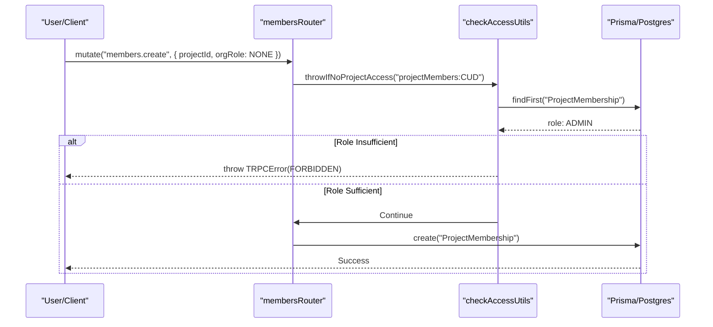

# RBAC & Permissions

<details>
<summary>관련 소스 파일</summary>

다음 파일들은 이 위키 페이지를 생성하기 위한 컨텍스트로 사용되었습니다.

- [packages/shared/prisma/migrations/20250123103200_add_retention_days_to_projects/migration.sql](packages/shared/prisma/migrations/20250123103200_add_retention_days_to_projects/migration.sql)
- [packages/shared/prisma/migrations/20250403153555_membership_invitations_no_duplicates/migration.sql](packages/shared/prisma/migrations/20250403153555_membership_invitations_no_duplicates/migration.sql)
- [packages/shared/src/features/entitlements/plans.ts](packages/shared/src/features/entitlements/plans.ts)
- [packages/shared/src/features/monitors/service/helpers.test.ts](packages/shared/src/features/monitors/service/helpers.test.ts)
- [packages/shared/src/features/monitors/service/helpers.ts](packages/shared/src/features/monitors/service/helpers.ts)
- [packages/shared/src/features/monitors/service/service.ts](packages/shared/src/features/monitors/service/service.ts)
- [packages/shared/src/features/monitors/service/types.test.ts](packages/shared/src/features/monitors/service/types.test.ts)
- [packages/shared/src/features/monitors/service/types.ts](packages/shared/src/features/monitors/service/types.ts)
- [packages/shared/src/interfaces/rate-limits.ts](packages/shared/src/interfaces/rate-limits.ts)
- [packages/shared/src/server/services/email/organizationInvitation/MembershipInvitationEmailTemplate.tsx](packages/shared/src/server/services/email/organizationInvitation/MembershipInvitationEmailTemplate.tsx)
- [packages/shared/src/server/utils/formatAuthProvider.ts](packages/shared/src/server/utils/formatAuthProvider.ts)
- [web/src/__tests__/server/members-trpc.servertest.ts](web/src/__tests__/server/members-trpc.servertest.ts)
- [web/src/__tests__/server/monitorService.servertest.ts](web/src/__tests__/server/monitorService.servertest.ts)
- [web/src/__tests__/server/monitors.servertest.ts](web/src/__tests__/server/monitors.servertest.ts)
- [web/src/components/VersionLabel.tsx](web/src/components/VersionLabel.tsx)
- [web/src/ee/features/ui-customization/uiCustomizationRouter.ts](web/src/ee/features/ui-customization/uiCustomizationRouter.ts)
- [web/src/ee/features/ui-customization/useUiCustomization.ts](web/src/ee/features/ui-customization/useUiCustomization.ts)
- [web/src/features/annotation-queues/server/annotationQueueAssignmentsRouter.ts](web/src/features/annotation-queues/server/annotationQueueAssignmentsRouter.ts)
- [web/src/features/auth/lib/projectRetentionSchema.ts](web/src/features/auth/lib/projectRetentionSchema.ts)
- [web/src/features/background-migrations/components/background-migrations.tsx](web/src/features/background-migrations/components/background-migrations.tsx)
- [web/src/features/background-migrations/components/retry-background-migration.tsx](web/src/features/background-migrations/components/retry-background-migration.tsx)
- [web/src/features/background-migrations/server/background-migrations-router.ts](web/src/features/background-migrations/server/background-migrations-router.ts)
- [web/src/features/entitlements/constants/entitlements.ts](web/src/features/entitlements/constants/entitlements.ts)
- [web/src/features/entitlements/server/getPlan.ts](web/src/features/entitlements/server/getPlan.ts)
- [web/src/features/feature-flags/available-flags.ts](web/src/features/feature-flags/available-flags.ts)
- [web/src/features/projects/components/ConfigureRetention.tsx](web/src/features/projects/components/ConfigureRetention.tsx)
- [web/src/features/public-api/server/RateLimitService.ts](web/src/features/public-api/server/RateLimitService.ts)
- [web/src/features/rbac/components/MembersTable.tsx](web/src/features/rbac/components/MembersTable.tsx)
- [web/src/features/rbac/components/MembershipInvitesPage.tsx](web/src/features/rbac/components/MembershipInvitesPage.tsx)
- [web/src/features/rbac/constants/projectAccessRights.ts](web/src/features/rbac/constants/projectAccessRights.ts)
- [web/src/features/rbac/server/allInvitesRoutes.ts](web/src/features/rbac/server/allInvitesRoutes.ts)
- [web/src/features/rbac/server/allMembersRoutes.ts](web/src/features/rbac/server/allMembersRoutes.ts)
- [web/src/features/rbac/server/membersRouter.ts](web/src/features/rbac/server/membersRouter.ts)
- [web/src/pages/background-migrations.tsx](web/src/pages/background-migrations.tsx)
- [web/src/server/api/routers/surveys.ts](web/src/server/api/routers/surveys.ts)

</details>


이 문서는 organization 및 project 전반에서 user와 API key permission을 관리하는 Langfuse의 Role-Based Access Control(RBAC) system을 설명합니다. 이 system은 organization-level role이 project level에서 inherit되거나 override될 수 있는 hierarchical dual-role model을 구현하며, fine-grained permission scope로 특정 operation에 대한 access를 control합니다.

## 개요

Langfuse는 두 가지 membership level을 가진 hierarchical RBAC system을 구현합니다.

1.  **Organization-level memberships**: 각 user는 자신이 속한 각 organization 내 role을 가지며, 이는 PostgreSQL의 `OrganizationMembership` model을 통해 tracking됩니다.
2.  **Project-level memberships**: user는 organization role보다 우선하는 project-specific role override를 `ProjectMembership` model을 통해 가질 수 있습니다 [web/src/features/rbac/server/membersRouter.ts:94-99]().

API key는 전체 organization 또는 특정 project 중 하나로 scoped되며, scope에 따라 적절한 permission을 inherit합니다.

출처: [web/src/features/rbac/server/membersRouter.ts:112-169]()

## Role Hierarchy

### Role Enum

system은 privilege 내림차순으로 role을 정의합니다. `Role` enum은 `@langfuse/shared`에서 import됩니다 [web/src/features/rbac/components/MembersTable.tsx:21-21]().

| Role | Description |
| :--- | :--- |
| `OWNER` | full administrative access를 가지며, member, billing을 관리하고 project/org를 삭제할 수 있습니다 [web/src/features/rbac/constants/projectAccessRights.ts:89-144](). |
| `ADMIN` | administrative access를 가지며, 대부분의 resource와 member를 관리할 수 있지만 project는 삭제할 수 없습니다 [web/src/features/rbac/constants/projectAccessRights.ts:145-199](). |
| `MEMBER` | standard access를 가지며, resource(trace, prompt 등)를 create 및 manage할 수 있습니다 [web/src/features/rbac/constants/projectAccessRights.ts:200-241](). |
| `VIEWER` | read-only access를 가지며, resource를 볼 수 있지만 수정할 수 없습니다 [web/src/features/rbac/constants/projectAccessRights.ts:242-260](). |
| `NONE` | access를 명시적으로 deny하거나 override가 없음을 나타냅니다(project-specific override를 요구하기 위해 organization-level role에 사용됨) [web/src/features/rbac/constants/projectAccessRights.ts:261-261](). |

출처: [web/src/features/rbac/constants/projectAccessRights.ts:88-262](), [web/src/features/rbac/server/membersRouter.ts:18-19]()

### Role Ordering and Validation

system은 user가 자신의 role보다 높은 role을 grant하거나 edit할 수 없도록 internal ordering을 사용합니다. 이는 `membersRouter`에서 `throwIfHigherRole` [web/src/features/rbac/server/membersRouter.ts:53-60]() 및 `throwIfHigherProjectRole` [web/src/features/rbac/server/membersRouter.ts:66-107]()을 통해 enforce됩니다.

```typescript
function throwIfHigherRole({ ownRole, role }: { ownRole: Role; role: Role }) {
  if (orderedRoles[ownRole] < orderedRoles[role]) {
    throw new TRPCError({
      code: "FORBIDDEN",
      message: "You cannot grant/edit a role higher than your own",
    });
  }
}
```

출처: [web/src/features/rbac/server/membersRouter.ts:53-60](), [web/src/features/rbac/server/membersRouter.ts:30-30]()

## Membership Models & Data Flow

### Entity Relationship

다음 다이어그램은 "Organizations" 및 "Projects"라는 자연어 개념을 Prisma schema와 `membersRouter`에 정의된 RBAC용 code entity에 연결합니다.

**Langfuse RBAC Entity Relationships**
```mermaid
classDiagram
    class "User"["User"] {
        +String id
        +String email
        +OrganizationMembership[] organizationMemberships
    }
    class "Organization"["Organization"] {
        +String id
        +String name
        +Project[] projects
        +OrganizationMembership[] organizationMemberships
    }
    class "OrganizationMembership"["OrganizationMembership"] {
        +String id
        +Role role
        +String orgId
        +String userId
        +ProjectMembership[] projectMemberships
    }
    class "Project"["Project"] {
        +String id
        +String orgId
        +ProjectMembership[] projectMembers
    }
    class "ProjectMembership"["ProjectMembership"] {
        +String id
        +Role role
        +String projectId
        +String orgMembershipId
    }

    "User" "1" -- "*" "OrganizationMembership" : "has"
    "Organization" "1" -- "*" "OrganizationMembership" : "contains"
    "Organization" "1" -- "*" "Project" : "owns"
    "OrganizationMembership" "1" -- "*" "ProjectMembership" : "linked_to"
    "Project" "1" -- "*" "ProjectMembership" : "has_members"
```

출처: [web/src/features/rbac/server/membersRouter.ts:84-92]()

### Role Resolution Logic

특정 project에서 user의 effective role은 `OrganizationMembership.role`과 `ProjectMembership.role` 중 더 높은 privilege를 선택하여 결정됩니다 [web/src/features/rbac/server/membersRouter.ts:94-99]().

1.  user와 project에 대한 `ProjectMembership`이 존재하면 해당 role을 fetch합니다 [web/src/features/rbac/server/membersRouter.ts:84-92]().
2.  system은 project role과 organization role 양쪽의 `orderedRoles` value에 대해 `Math.max`를 취해 `ownRoleValue`를 계산합니다 [web/src/features/rbac/server/membersRouter.ts:94-99]().
3.  project membership이 없으면 organization role을 default로 사용합니다 [web/src/features/rbac/server/membersRouter.ts:99-99]().

출처: [web/src/features/rbac/server/membersRouter.ts:94-106](), [web/src/features/rbac/server/membersRouter.ts:30-30]()

## Access Scopes (Permissions)

Langfuse는 role이 실제로 무엇을 할 수 있는지 정의하기 위해 fine-grained "Scopes"를 사용합니다. 이는 `resource:action` 형식의 string으로 정의됩니다 [web/src/features/rbac/constants/projectAccessRights.ts:85-86]().

### Project Scopes

Project-level scope는 tracing data, prompt, project setting에 대한 access를 control합니다. 예시는 다음과 같습니다.
*   `projectMembers:CUD`: project member Create, Update, Delete [web/src/features/rbac/constants/projectAccessRights.ts:7-7]().
*   `llmTools:CUD`: LLM tool create 또는 update [web/src/features/rbac/constants/projectAccessRights.ts:64-64]().
*   `scoreConfigs:read`: score configuration read [web/src/features/rbac/constants/projectAccessRights.ts:21-21]().
*   `prompts:CUD`: prompt Create, Update 또는 Delete [web/src/features/rbac/constants/projectAccessRights.ts:36-36]().
*   `auditLogs:read`: audit log view access [web/src/features/rbac/constants/projectAccessRights.ts:73-73]().
*   `monitors:CUD`: monitor Create, Update 또는 Delete [web/src/features/rbac/constants/projectAccessRights.ts:82-82]().

role과 이 scope들의 mapping은 `projectRoleAccessRights`에서 유지됩니다 [web/src/features/rbac/constants/projectAccessRights.ts:88-262]().

출처: [web/src/features/rbac/constants/projectAccessRights.ts:5-83](), [web/src/features/rbac/constants/projectAccessRights.ts:88-262]()

### Organization Scopes

Organization-level scope는 org level의 billing, SSO, membership을 control합니다.
*   `organizationMembers:read`: organization member 보기 [web/src/features/rbac/components/MembersTable.tsx:75-75]().
*   `organizationMembers:CUD`: organization-wide membership 관리 [web/src/features/rbac/server/membersRouter.ts:167-167]().

출처: [web/src/features/rbac/components/MembersTable.tsx:73-76](), [web/src/features/rbac/server/membersRouter.ts:162-169]()

## Enforcement Mechanisms

### Server-Side: tRPC Procedures

permission은 `membersRouter.ts`와 `allInvitesRoutes.ts`에 정의된 tRPC procedure와 utility function을 사용해 API layer에서 enforce됩니다.

*   `throwIfNoProjectAccess`: 특정 scope를 확인하기 위해 procedure 내에서 호출되는 utility function [web/src/features/rbac/server/membersRouter.ts:26-27](), [web/src/features/rbac/server/membersRouter.ts:157-161]().
*   `throwIfNoOrganizationAccess`: organization-level scope에 대한 유사한 check [web/src/features/rbac/server/membersRouter.ts:11-12](), [web/src/features/rbac/server/membersRouter.ts:164-168]().

**RBAC Enforcement via tRPC**


출처: [web/src/features/rbac/server/membersRouter.ts:112-169](), [web/src/features/rbac/server/allInvitesRoutes.ts:86-125]()

### Client-Side: UI Guards

UI는 permission에 따라 element를 조건부로 show/hide하기 위해 React hook을 사용합니다.

*   `useHasProjectAccess`: current user가 active project에서 특정 scope를 가지고 있는지 나타내는 boolean을 반환합니다 [web/src/features/rbac/components/MembersTable.tsx:27-27]().
*   `useHasOrganizationAccess`: project access와 유사하지만 organization-level scope용입니다 [web/src/features/rbac/components/MembersTable.tsx:17-17]().
*   `useHasEntitlement`: organization plan을 기준으로 feature availability(예: `rbac-project-roles`)를 확인합니다 [web/src/features/rbac/components/MembersTable.tsx:25-25]().

출처: [web/src/features/rbac/components/MembersTable.tsx:73-81](), [web/src/features/rbac/components/MembersTable.tsx:138-147]()

## Entitlements & Limits

system은 organization의 plan과 entitlement를 기준으로 membership 및 feature access 제한을 enforce합니다.

### Membership Limits
`membersRouter`는 새 membership 또는 invitation을 생성하기 전에 membership count를 확인합니다 [web/src/features/rbac/server/membersRouter.ts:223-228]().

*   `throwIfExceedsLimit`: maximum organization member count 같은 limit을 enforce합니다 [web/src/features/rbac/server/membersRouter.ts:23-23]().
*   `organization-member-count`: 특정 entitlement limit(예: Hobby plan의 경우 2) [web/src/features/entitlements/constants/entitlements.ts:61-61]().
*   이 check에는 current member와 pending invitation이 모두 포함됩니다 [web/src/features/rbac/server/membersRouter.ts:223-231]().

출처: [web/src/features/entitlements/constants/entitlements.ts:51-171](), [web/src/features/rbac/server/membersRouter.ts:223-231](), [web/src/__tests__/server/members-trpc.servertest.ts:119-142]()

### Feature Entitlements
특정 feature는 `entitlements.ts`에 정의된 entitlement로 gate됩니다 [web/src/features/entitlements/constants/entitlements.ts:6-21]().
*   `rbac-project-roles`: project별로 다른 role을 assign하는 데 필요합니다 [web/src/features/rbac/server/membersRouter.ts:177-189](), [web/src/features/rbac/components/MembersTable.tsx:147-147]().
*   `cloud-multi-tenant-sso`: multi-tenant SSO feature에 필요합니다 [web/src/features/entitlements/constants/entitlements.ts:11-11]().
*   `audit-logs`: audit log feature access에 필요합니다 [web/src/features/entitlements/constants/entitlements.ts:15-15]().
*   `admin-api`: organization-level administrative API access에 필요합니다 [web/src/features/entitlements/constants/entitlements.ts:19-19]().

출처: [web/src/features/entitlements/constants/entitlements.ts:51-171](), [web/src/features/rbac/server/membersRouter.ts:177-189]()

## Rate Limiting

Access는 organization ID, plan, resource를 기준으로 limit을 적용하는 `RateLimitService`를 통해 추가로 control됩니다 [web/src/features/public-api/server/RateLimitService.ts:30-35]().

*   **Strategy**: Redis를 사용해 duration 내 organization별 consumed point를 tracking합니다 [web/src/features/public-api/server/RateLimitService.ts:108-116]().
*   **Resources**: `ingestion`, `public-api`, `prompts`, `datasets` 같은 특정 resource에 limit이 적용됩니다 [packages/shared/src/interfaces/rate-limits.ts:4-14]().
*   **Plan-based**: limit은 organization plan(예: Hobby vs. Enterprise)에 따라 달라집니다 [web/src/features/public-api/server/RateLimitService.ts:153-155]().

출처: [web/src/features/public-api/server/RateLimitService.ts:35-164](), [packages/shared/src/interfaces/rate-limits.ts:4-36]()
