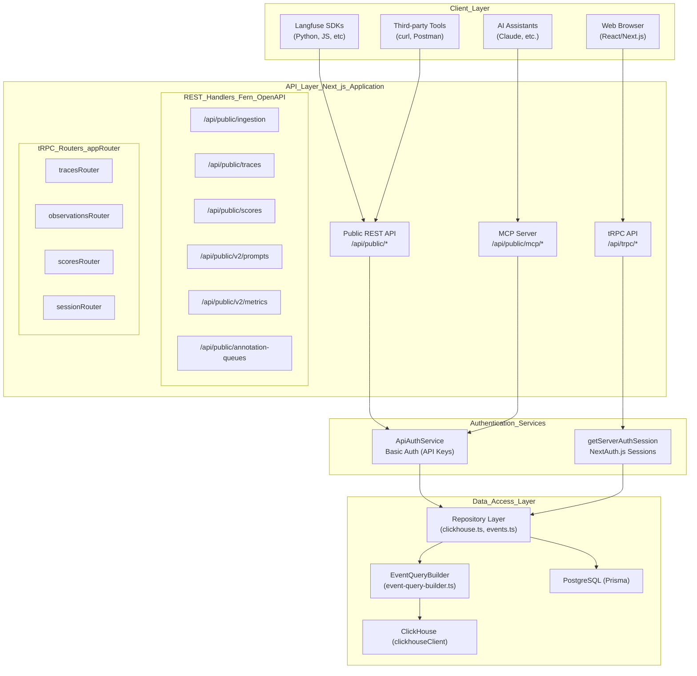

# API 계층

관련 소스 파일

다음 파일들은 이 위키 페이지를 생성하는 컨텍스트로 사용되었습니다.

- [fern/apis/server/definition/commons.yml](fern/apis/server/definition/commons.yml)
- [fern/apis/server/definition/metrics.yml](fern/apis/server/definition/metrics.yml)
- [fern/apis/server/definition/observations.yml](fern/apis/server/definition/observations.yml)
- [fern/apis/server/definition/prompt-version.yml](fern/apis/server/definition/prompt-version.yml)
- [fern/apis/server/definition/prompts.yml](fern/apis/server/definition/prompts.yml)
- [packages/shared/src/domain/observation-field-groups.ts](packages/shared/src/domain/observation-field-groups.ts)
- [packages/shared/src/server/repositories/clickhouse.ts](packages/shared/src/server/repositories/clickhouse.ts)
- [web/public/generated/api/openapi.yml](web/public/generated/api/openapi.yml)
- [web/src/__tests__/server/repositories/clickhouse-resource-errors.servertest.ts](web/src/__tests__/server/repositories/clickhouse-resource-errors.servertest.ts)
- [web/src/__tests__/server/trpc-error-formatting.servertest.ts](web/src/__tests__/server/trpc-error-formatting.servertest.ts)
- [web/src/__tests__/server/withMiddlewares.servertest.ts](web/src/__tests__/server/withMiddlewares.servertest.ts)
- [web/src/features/notifications/ErrorNotification.tsx](web/src/features/notifications/ErrorNotification.tsx)
- [web/src/features/notifications/showErrorToast.tsx](web/src/features/notifications/showErrorToast.tsx)
- [web/src/features/prompts/server/actions/getPromptsMeta.ts](web/src/features/prompts/server/actions/getPromptsMeta.ts)
- [web/src/features/public-api/server/dailyMetrics.ts](web/src/features/public-api/server/dailyMetrics.ts)
- [web/src/features/public-api/server/withMiddlewares.ts](web/src/features/public-api/server/withMiddlewares.ts)
- [web/src/pages/api/public/metrics/daily.ts](web/src/pages/api/public/metrics/daily.ts)
- [web/src/pages/api/public/v2/prompts/[promptName]/index.ts](web/src/pages/api/public/v2/prompts/[promptName]/index.ts)
- [web/src/pages/api/public/v2/prompts/[promptName]/versions/[promptVersion].ts](web/src/pages/api/public/v2/prompts/[promptName]/versions/[promptVersion].ts)
- [web/src/server/api/trpc.ts](web/src/server/api/trpc.ts)
- [web/src/utils/trpcErrorToast.tsx](web/src/utils/trpcErrorToast.tsx)

## 목적과 범위

이 문서는 Langfuse 기능을 외부 클라이언트와 웹 애플리케이션에 노출하는 이중 API 아키텍처를 설명합니다. API 계층은 두 개의 구별되는 표면으로 구성됩니다. 언어에 구애받지 않는 프로그래밍 방식 접근을 위한 **Public REST API**(주로 SDK에서 사용)와 Next.js 웹 애플리케이션과 서버 간 타입 안전 통신을 위한 **tRPC API**입니다.

인증 메커니즘과 권한 확인에 대한 자세한 내용은 [API Authentication & Rate Limiting](#5.3)을 참조하세요. API 요청이 수신된 뒤 발생하는 데이터 수집 처리에 대한 정보는 [Data Ingestion Pipeline](#6)을 참조하세요.

## 이중 API 아키텍처

Langfuse는 서로 다른 요구사항을 가진 다양한 클라이언트 유형을 지원하는 두 개의 병렬 API 아키텍처를 구현합니다. 이 아키텍처는 고수준 클라이언트 요청을 `enrichObservationsWithModelData` [packages/shared/src/server/repositories/events.ts:32-32]() 및 ClickHouse 쿼리 빌더 같은 저수준 repository 작업으로 연결합니다.

### API 시스템 개요

**핵심 아키텍처 결정:**

| 측면 | Public REST API | tRPC API |
|--------|----------------|----------|
| **주 사용자** | SDK, CLI 도구, 외부 통합 | 웹 애플리케이션 프론트엔드 |
| **인증** | HTTP Basic Auth(API 키) | `getServerAuthSession` [web/src/server/api/trpc.ts:61-61]()을 통한 NextAuth.js 세션 |
| **타입 안전성** | 런타임의 OpenAPI/Fern 검증 | `initTRPC` [web/src/server/api/trpc.ts:103-103]()를 통한 완전한 TypeScript 타입 추론 |
| **스키마 정의** | Fern YAML 정의 [fern/apis/server/definition/commons.yml:4-4]() | Zod 스키마와 `superjson` transformer [web/src/server/api/trpc.ts:104-105]() |
| **코드 생성** | Fern이 OpenAPI 사양과 SDK를 생성 | Next.js 클라이언트용 타입 생성 |
| **기본 경로** | `/api/public/*` [web/public/generated/api/openapi.yml:23-24]() | `/api/trpc/*` |

**출처:**
- [web/src/server/api/trpc.ts:57-124]()
- [web/public/generated/api/openapi.yml:1-24]()
- [packages/shared/src/server/repositories/clickhouse.ts:128-135]()
- [packages/shared/src/domain/observation-field-groups.ts:34-45]()

## Public REST API

Public REST API는 외부 시스템을 위한 기본 통합 지점입니다. 이 API는 Fern을 사용해 정의되며 OpenAPI 사양으로 내보내집니다 [web/public/generated/api/openapi.yml:22-22](). 모든 엔드포인트는 API 키(사용자 이름으로 Public Key, 비밀번호로 Secret Key)를 통한 인증을 요구합니다 [web/public/generated/api/openapi.yml:9-17]().

### 핵심 기능
- **V2 고성능 엔드포인트**: API에는 규모 확장을 위해 ClickHouse를 활용하는 `observations` [fern/apis/server/definition/observations.yml:36-36]() 및 `metrics` [fern/apis/server/definition/metrics.yml:113-113]()용 최적화된 V2 엔드포인트가 포함됩니다.
- **CRUD 작업**: traces [fern/apis/server/definition/commons.yml:4-44](), observations [fern/apis/server/definition/commons.yml:95-160](), prompts [fern/apis/server/definition/prompts.yml:9-82]() 관리.
- **필드 선택**: V2 Observations API는 클라이언트가 페이로드 크기를 최소화하기 위해 `fields` 그룹(예: `core`, `usage`, `model`)을 지정할 수 있게 합니다 [packages/shared/src/domain/observation-field-groups.ts:34-45]().
- **Annotation Queues**: queue 목록 조회 및 item 추가를 포함해 human-in-the-loop 라벨링 워크플로를 관리하는 엔드포인트입니다 [web/public/generated/api/openapi.yml:24-81]().
- **Metrics API**: `observations`, `scores-numeric`, `scores-categorical` 쿼리를 지원하며 `p99` 또는 `histogram` 같은 복잡한 집계도 지원합니다 [fern/apis/server/definition/metrics.yml:106-110]().

자세한 내용은 [Public REST API](#5.1)를 참조하세요.

**출처:**
- [web/public/generated/api/openapi.yml:1-118]()
- [fern/apis/server/definition/commons.yml:4-160]()
- [fern/apis/server/definition/observations.yml:36-116]()
- [fern/apis/server/definition/metrics.yml:9-56]()
- [packages/shared/src/domain/observation-field-groups.ts:1-56]()

## tRPC 내부 API

tRPC API는 Langfuse 웹 UI에서만 사용됩니다. React 프론트엔드와 Node.js 백엔드 사이에 타입 안전한 브리지를 제공합니다.

### 아키텍처
- **Router 구조**: `createTRPCRouter` [web/src/server/api/trpc.ts:138-138]()를 통해 초기화되는 router의 계층적 트리입니다.
- **Context 주입**: `createTRPCContext` 함수는 모든 procedure에 `prisma`, 사용자 세션, 요청 헤더를 주입합니다 [web/src/server/api/trpc.ts:57-72]().
- **전역 오류 처리**: `withErrorHandling` middleware는 오류를 가로채며, 특히 민감한 스택 트레이스 노출을 방지하기 위해 사용자 친화적인 조언과 함께 `ClickHouseResourceError`를 표시합니다 [web/src/server/api/trpc.ts:167-208]().
- **Telemetry**: procedure 성능과 컨텍스트를 추적하기 위해 `withOtelInstrumentation`를 통해 OpenTelemetry instrumentation이 통합됩니다 [web/src/server/api/trpc.ts:211-211]().

자세한 내용은 [tRPC Internal API](#5.2)를 참조하세요.

**출처:**
- [web/src/server/api/trpc.ts:43-72]()
- [web/src/server/api/trpc.ts:138-138]()
- [web/src/server/api/trpc.ts:167-208]()

## API 인증 및 Rate Limiting

Langfuse는 보안과 리소스 관리를 위한 다층 접근 방식으로 API 표면을 보호합니다.

- **인증**: Public API 요청은 `BasicAuth` [web/public/generated/api/openapi.yml:77-78]()를 사용해 인증됩니다. Admin API는 `AdminApiAuthService` [web/src/server/api/trpc.ts:94-94]() 같은 특화된 인증 서비스를 사용합니다.
- **리소스 보호**: `ClickHouseResourceError` 클래스는 데이터베이스 고갈을 방지하기 위해 메모리 제한, timeout, overcommit을 추적합니다 [packages/shared/src/server/repositories/clickhouse.ts:29-67]().
- **오류 전파**: 오류는 구체적인 가이드를 제공하도록 포맷됩니다. 예를 들어 ClickHouse 리소스 오류는 쿼리 최적화 방법에 대한 조언과 함께 422 상태를 반환합니다 [web/src/features/public-api/server/withMiddlewares.ts:141-158]().
- **쿼리 보호 장치**: `assertNoLegacyEventsRead` 같은 내부 검사는 ClickHouse의 deprecated table에 실수로 쿼리하는 것을 방지합니다 [packages/shared/src/server/repositories/clickhouse.ts:120-126]().

자세한 내용은 [API Authentication & Rate Limiting](#5.3)을 참조하세요.

**출처:**
- [web/public/generated/api/openapi.yml:9-17]()
- [packages/shared/src/server/repositories/clickhouse.ts:29-91]()
- [web/src/features/public-api/server/withMiddlewares.ts:130-158]()
- [web/src/utils/trpcErrorToast.tsx:37-65]()

## MCP Server

Model Context Protocol(MCP) server는 AI assistant가 Langfuse에 직접 연결해 prompts 및 기타 리소스를 관리할 수 있게 합니다.

- **Stateless 아키텍처**: server는 요청별로 동작하며 REST API와 동일한 인증 기반을 활용합니다 [web/public/generated/api/openapi.yml:6-17]().
- **도구화**: Prompts V2 시스템에 정의된 prompt template 가져오기처럼 assistant가 호출할 수 있는 "tools"로 Langfuse 기능을 노출합니다. 이를 통해 LLM이 Langfuse prompt registry와 직접 상호작용할 수 있습니다.

자세한 내용은 [MCP Server](#5.4)를 참조하세요.

**출처:**
- [web/public/generated/api/openapi.yml:1-17]()
- [fern/apis/server/definition/prompts.yml:9-32]()
