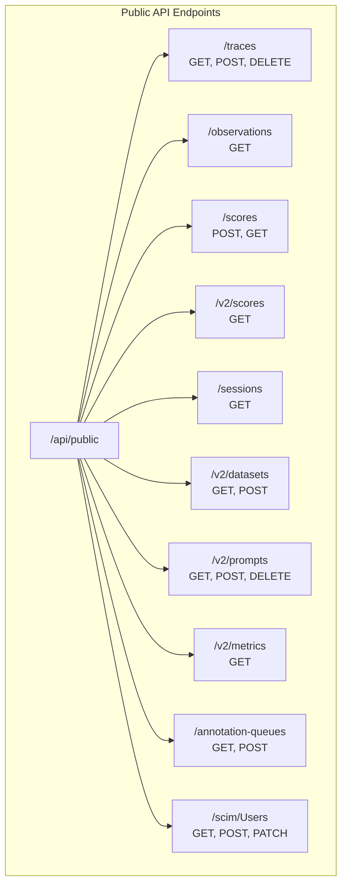
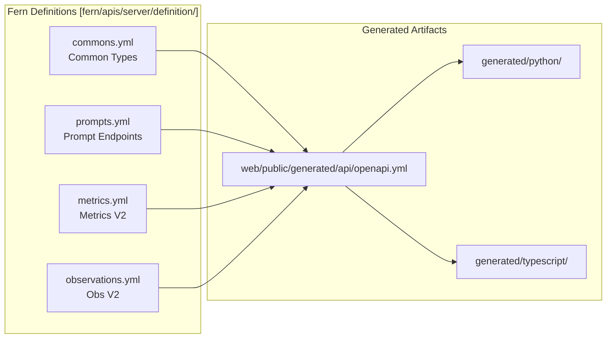
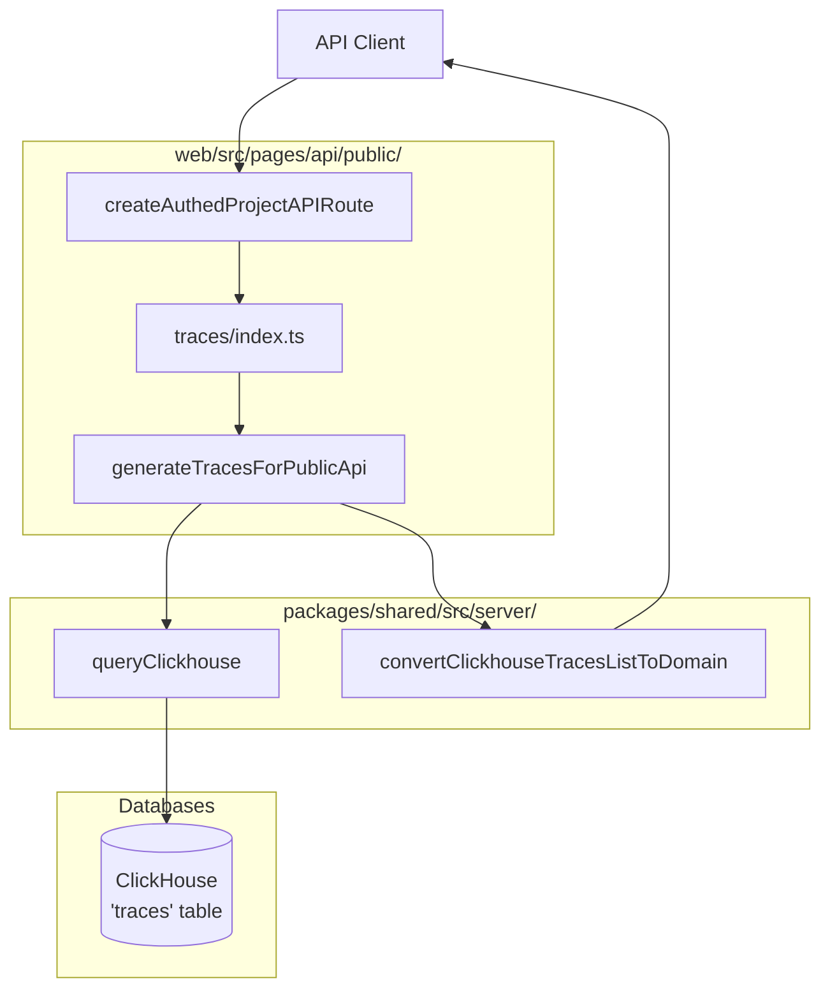

# Public REST API

<details>
<summary>관련 소스 파일</summary>

다음 파일들은 이 위키 페이지를 생성하는 컨텍스트로 사용되었습니다.

- [fern/apis/server/definition/commons.yml](fern/apis/server/definition/commons.yml)
- [fern/apis/server/definition/legacy/metrics-v1.yml](fern/apis/server/definition/legacy/metrics-v1.yml)
- [fern/apis/server/definition/legacy/observations-v1.yml](fern/apis/server/definition/legacy/observations-v1.yml)
- [fern/apis/server/definition/metrics.yml](fern/apis/server/definition/metrics.yml)
- [fern/apis/server/definition/observations.yml](fern/apis/server/definition/observations.yml)
- [fern/apis/server/definition/prompt-version.yml](fern/apis/server/definition/prompt-version.yml)
- [fern/apis/server/definition/prompts.yml](fern/apis/server/definition/prompts.yml)
- [fern/apis/server/definition/scim.yml](fern/apis/server/definition/scim.yml)
- [fern/apis/server/definition/scores.yml](fern/apis/server/definition/scores.yml)
- [fern/apis/server/definition/trace.yml](fern/apis/server/definition/trace.yml)
- [packages/shared/src/domain/observation-field-groups.ts](packages/shared/src/domain/observation-field-groups.ts)
- [packages/shared/src/features/scores/interfaces/api/v2/endpoints.ts](packages/shared/src/features/scores/interfaces/api/v2/endpoints.ts)
- [web/public/generated/api/openapi.yml](web/public/generated/api/openapi.yml)
- [web/src/__tests__/server/scim-api.servertest.ts](web/src/__tests__/server/scim-api.servertest.ts)
- [web/src/__tests__/server/scores-api-v2.servertest.ts](web/src/__tests__/server/scores-api-v2.servertest.ts)
- [web/src/features/prompts/server/actions/getPromptsMeta.ts](web/src/features/prompts/server/actions/getPromptsMeta.ts)
- [web/src/features/public-api/server/dailyMetrics.ts](web/src/features/public-api/server/dailyMetrics.ts)
- [web/src/features/public-api/server/observations.ts](web/src/features/public-api/server/observations.ts)
- [web/src/features/public-api/server/scores.ts](web/src/features/public-api/server/scores.ts)
- [web/src/features/public-api/server/traces.ts](web/src/features/public-api/server/traces.ts)
- [web/src/features/public-api/types/traces.ts](web/src/features/public-api/types/traces.ts)
- [web/src/pages/api/public/events.ts](web/src/pages/api/public/events.ts)
- [web/src/pages/api/public/generations.ts](web/src/pages/api/public/generations.ts)
- [web/src/pages/api/public/metrics/daily.ts](web/src/pages/api/public/metrics/daily.ts)
- [web/src/pages/api/public/observations/[observationId].ts](web/src/pages/api/public/observations/[observationId].ts)
- [web/src/pages/api/public/observations/index.ts](web/src/pages/api/public/observations/index.ts)
- [web/src/pages/api/public/scim/ResourceTypes.ts](web/src/pages/api/public/scim/ResourceTypes.ts)
- [web/src/pages/api/public/scim/Schemas.ts](web/src/pages/api/public/scim/Schemas.ts)
- [web/src/pages/api/public/scim/ServiceProviderConfig.ts](web/src/pages/api/public/scim/ServiceProviderConfig.ts)
- [web/src/pages/api/public/scim/Users/[id].ts](web/src/pages/api/public/scim/Users/[id].ts)
- [web/src/pages/api/public/scim/Users/index.ts](web/src/pages/api/public/scim/Users/index.ts)
- [web/src/pages/api/public/scores/index.ts](web/src/pages/api/public/scores/index.ts)
- [web/src/pages/api/public/spans.ts](web/src/pages/api/public/spans.ts)
- [web/src/pages/api/public/traces/[traceId].ts](web/src/pages/api/public/traces/[traceId].ts)
- [web/src/pages/api/public/traces/index.ts](web/src/pages/api/public/traces/index.ts)
- [web/src/pages/api/public/v2/prompts/[promptName]/index.ts](web/src/pages/api/public/v2/prompts/[promptName]/index.ts)
- [web/src/pages/api/public/v2/prompts/[promptName]/versions/[promptVersion].ts](web/src/pages/api/public/v2/prompts/[promptName]/versions/[promptVersion].ts)
- [web/src/pages/api/public/v2/scores/index.ts](web/src/pages/api/public/v2/scores/index.ts)

</details>


## 목적과 범위

Public REST API는 외부 통합, SDK, 자동화 도구가 Langfuse 기능에 프로그래밍 방식으로 접근할 수 있게 합니다. 이 문서는 `/api/public/*` 엔드포인트에서 API가 노출하는 구조, 인증, 리소스 유형을 다룹니다. OpenAPI 사양, 요청부터 저장소까지의 데이터 흐름, 핵심 엔티티에 대한 CRUD 작업 구현을 자세히 설명합니다.

내부 웹 애플리케이션 API는 [tRPC Internal API](5.2)를 참조하세요. 데이터 수집에 특화된 내용은 [Data Ingestion Pipeline](6)을 참조하세요. 인증 메커니즘은 [Authentication & Authorization](4)을 참조하세요.

---

## API 개요

### 기본 경로와 버전 관리

Public REST API는 `/api/public` 기본 경로 아래에서 제공되며, breaking change에는 선택적 버전 관리를 사용합니다.

| 기본 경로 | 설명 | 예시 |
|-----------|-------------|---------|
| `/api/public` | 주요 API 엔드포인트(v1 암시) | `/api/public/traces` |
| `/api/public/v2` | 개선 사항이 포함된 버전 2 엔드포인트 | `/api/public/v2/prompts` |
| `/api/public/otel` | OpenTelemetry 수집 | `/api/public/otel/v1/traces` |

**출처:** [web/public/generated/api/openapi.yml:23-25](), [fern/apis/server/definition/prompts.yml:8-8](), [fern/apis/server/definition/trace.yml:7-7]()

### 인증

API는 프로젝트 설정의 API 키로 HTTP Basic Authentication을 사용합니다.

- **Username**: Langfuse Public Key
- **Password**: Langfuse Secret Key

```
Authorization: Basic base64(publicKey:secretKey)
```

API 키는 `ApiAuthService`를 통해 검증되며, 이 서비스는 키를 권한이 있는 프로젝트 또는 조직 범위로 해석합니다. `createAuthedProjectAPIRoute` wrapper는 요청이 유효한 `projectId` 범위로 제한되도록 보장합니다.

**출처:** [web/public/generated/api/openapi.yml:6-18](), [web/src/pages/api/public/scim/Users/index.ts:30-40](), [web/src/pages/api/public/traces/[traceId].ts:33-37]()

---

## API 구조

### 엔드포인트 구성

API는 표준 REST 작업을 갖춘 리소스 기반 엔드포인트로 구성됩니다.

제목: Public API Endpoint Map


**출처:** [web/public/generated/api/openapi.yml:24-172](), [fern/apis/server/definition/prompts.yml:6-83](), [fern/apis/server/definition/metrics.yml:5-113](), [fern/apis/server/definition/trace.yml:9-36]()

---

## Fern을 통한 스키마 관리

### Fern 빌드 파이프라인

API 스키마는 Fern으로 정의되며, Fern은 OpenAPI 사양과 SDK를 생성합니다. Langfuse는 이러한 정의를 사용해 Python 및 TypeScript SDK 전반의 일관성을 유지합니다.

제목: Fern Build Pipeline


**출처:** [web/public/generated/api/openapi.yml:1-5](), [fern/apis/server/definition/commons.yml:1-208](), [fern/apis/server/definition/prompts.yml:1-216]()

### 공통 타입 정의

모든 엔드포인트에서 공유되는 핵심 타입은 `commons.yml`에 정의됩니다.

| 타입 | 설명 | 주요 속성 |
|------|-------------|----------------|
| `Trace` | 최상위 실행 trace | `id`, `timestamp`, `name`, `input`, `output`, `metadata`, `tags` |
| `Observation` | 실행 단위(span/gen) | `id`, `traceId`, `type`, `name`, `startTime`, `usageDetails`, `costDetails` |
| `Prompt` | 관리형 prompt template | `name`, `version`, `prompt`(text/chat), `config`, `labels` |
| `Session` | Trace 그룹화 | `id`, `createdAt`, `projectId`, `environment` |

**출처:** [fern/apis/server/definition/commons.yml:4-208](), [fern/apis/server/definition/prompts.yml:142-208]()

---

## 핵심 리소스

### Traces

#### GET /api/public/traces

고급 필터링으로 trace 목록을 조회합니다. 이 엔드포인트는 복잡한 쿼리를 위해 조건의 JSON 인코딩 배열을 받는 `filter` 쿼리 파라미터를 지원합니다.

**구현 세부사항:**
- metrics 및 score 집계를 위한 복잡한 CTE로 ClickHouse를 직접 쿼리합니다 [web/src/features/public-api/server/traces.ts:132-201]().
- 쿼리 빌더 `buildTracesBaseQuery`는 `shouldUseSkipIndexes` 같은 ClickHouse 최적화와 `observation_stats` 또는 `score_stats`에 대한 조건부 CTE 포함을 처리합니다 [web/src/features/public-api/server/traces.ts:48-170]().
- CTE `observation_stats`는 `observations` table의 비용과 지연 시간을 집계합니다 [web/src/features/public-api/server/traces.ts:149-169]().
- IO, metrics 또는 scores를 포함하기 위해 `fields` 파라미터를 통한 필드 선택을 지원합니다 [web/src/features/public-api/server/traces.ts:48-64]().
- `useEventsTable` 파라미터를 통해 legacy `traces` table과 새로운 `events` table 아키텍처 사이를 전환할 수 있습니다 [web/src/pages/api/public/traces/index.ts:127-132]().

**출처:** [web/src/features/public-api/server/traces.ts:48-170](), [web/src/features/public-api/server/traces.ts:29-46](), [web/src/pages/api/public/traces/index.ts:127-157]()

#### GET /api/public/traces/{traceId}

ID로 단일 trace를 조회합니다.
- `getTraceById`를 통해 trace record를 가져옵니다 [web/src/pages/api/public/traces/[traceId].ts:58-65]().
- `getObservationsForTrace`와 `getScoresForTraces`를 사용해 observations와 scores를 조건부로 포함합니다 [web/src/pages/api/public/traces/[traceId].ts:73-91]().
- `metrics` field group이 요청된 경우 `latency`와 `totalCost` 같은 집계 metrics를 계산합니다 [web/src/pages/api/public/traces/[traceId].ts:156-186]().

**출처:** [web/src/pages/api/public/traces/[traceId].ts:33-189]()

### Observations

#### GET /api/public/v2/observations

V2 observations 엔드포인트는 ClickHouse를 사용한 고성능 조회를 제공합니다.
- 효율적인 pagination을 위해 `clickhouse_keys`에 대한 subquery와 함께 최적화된 SQL을 실행하도록 `generateObservationsForPublicApi`를 사용합니다 [web/src/features/public-api/server/observations.ts:29-90]().
- 데이터 전송을 최소화하기 위해 field selection group(core, basic, time, io, metadata, model, usage, prompt, metrics)을 허용합니다 [fern/apis/server/definition/observations.yml:18-27]().
- 가능할 때 `FINAL` keyword를 피함으로써 쿼리 성능을 최적화하기 위해 `shouldSkipObservationsFinal` 검사를 구현합니다 [web/src/features/public-api/server/observations.ts:35-37]().

**출처:** [web/src/features/public-api/server/observations.ts:29-121](), [fern/apis/server/definition/observations.yml:35-135]()

### Scores

#### POST /api/public/scores

`ScoresApiService.createScore`를 호출해 score를 생성합니다.
- legacy 이유로, 특정 event type에는 `processEventBatch`를 사용할 수 있습니다 [web/src/pages/api/public/traces/index.ts:52-59]().
- `ScoresApiService`는 score가 올바른 project와 연결되도록 보장하면서 실제 persistence logic을 처리합니다 [web/src/pages/api/public/scores/index.ts:36-40]().

**출처:** [web/src/pages/api/public/scores/index.ts:16-54](), [web/src/pages/api/public/traces/index.ts:36-65]()

#### GET /api/public/v2/scores

선택적 trace metadata join과 함께 scores를 조회합니다.
- 구현체 `_handleGenerateScoresForPublicApi`는 trace metadata(tags, userId 등)가 요청된 경우 `traces` table에 `LEFT JOIN`을 수행합니다 [web/src/features/public-api/server/scores.ts:104-136]().
- `CORRECTION` score type의 경우 API 호환성을 위해 `longStringValue`가 `stringValue`로 매핑됩니다 [web/src/features/public-api/server/scores.ts:41-47]().
- `TEXT` score type의 경우 의미가 없으므로 numeric `value` field가 제거됩니다 [web/src/features/public-api/server/scores.ts:49-51]().

**출처:** [web/src/features/public-api/server/scores.ts:87-164](), [web/src/features/public-api/server/scores.ts:34-54]()

### Prompts

#### GET /api/public/v2/prompts/{promptName}

특정 prompt version 또는 label과 연결된 prompt를 조회합니다(기본값은 `production`).
- `resolutionGraph`를 통해 모든 dependency가 resolve된 prompt를 반환하기 위해 `resolve=true`(기본값)를 지원합니다 [fern/apis/server/definition/prompts.yml:29-31]().
- `config`, `labels`, `tags`를 포함하는 `BasePrompt`를 확장해 `TextPrompt` 또는 `ChatPrompt` union type을 반환합니다 [fern/apis/server/definition/prompts.yml:142-208]().

**출처:** [fern/apis/server/definition/prompts.yml:10-32](), [fern/apis/server/definition/prompts.yml:152-168]()

---

## 구현 아키텍처

### 요청 흐름과 데이터 변환

제목: Public API Data Retrieval Flow


**출처:** [web/src/pages/api/public/traces/index.ts:68-186](), [web/src/features/public-api/server/traces.ts:48-170](), [web/src/features/public-api/server/traces.ts:1-14]()

### Metrics V2(최적화된 분석)

`/api/public/v2/metrics` 엔드포인트는 ClickHouse에서 직접 집계 데이터를 쿼리하기 위한 고성능 인터페이스를 제공합니다. `observations`, `scores-numeric`, `scores-categorical`의 세 가지 view를 지원합니다.

- **Dimensions:** `environment`, `model`, `promptName`, `type` 및 `startTimeMonth` 같은 시간 기반 dimensions로 그룹화합니다 [fern/apis/server/definition/metrics.yml:26-40]().
- **Measures:** `latency`, `inputTokens`, `totalCost` 같은 field에 대해 `sum`, `avg`, `p95`, `histogram` 같은 집계를 수행합니다 [fern/apis/server/definition/metrics.yml:42-55]().
- **Constraints:** 성능 저하를 방지하기 위해 `traceId` 또는 `userId` 같은 high cardinality field는 dimensions가 아니라 filters에서 사용해야 합니다 [fern/apis/server/definition/metrics.yml:88-105]().

**출처:** [fern/apis/server/definition/metrics.yml:9-113]()

---

## SCIM 프로비저닝

Langfuse는 identity provider로부터 자동화된 사용자 프로비저닝을 위해 SCIM 2.0 protocol을 지원합니다.

- **Endpoints:** `/api/public/scim/Users`.
- **Authentication:** `ApiAuthService`가 검증한 organization-scoped API key가 필요합니다 [web/src/pages/api/public/scim/Users/index.ts:30-54]().
- **Operations:** 
    - `GET`: SCIM 호환 필터링(예: `userName eq "..."`)으로 조직 내 사용자를 나열합니다 [web/src/pages/api/public/scim/Users/index.ts:60-130]().
    - `POST`: `User` table에 사용자를 생성하거나 upsert하고 `OrganizationMembership`을 생성합니다 [web/src/pages/api/public/scim/Users/index.ts:141-219]().
- **Role Mapping:** SCIM role을 `OWNER`, `ADMIN`, `MEMBER`, `VIEWER` 같은 internal role로 매핑하는 것을 지원합니다 [web/src/pages/api/public/scim/Users/index.ts:168-184]().

**출처:** [web/src/pages/api/public/scim/Users/index.ts:1-219]()

---

## 오류 처리

API는 표준 HTTP status code를 사용합니다. batch operation(예: ingestion)의 경우, 일부 event는 validation에 실패하고 다른 event는 성공했다면 `207 Multi-Status`가 반환될 수 있습니다.

| 상태 | 설명 |
|--------|-------------|
| 400 | Validation failure 또는 malformed JSON [web/src/pages/api/public/scim/Users/index.ts:149-153]() |
| 401 | 유효하지 않거나 누락된 API key [web/src/pages/api/public/scim/Users/index.ts:35-39]() |
| 403 | Forbidden(예: SCIM에 project-scoped key 사용) [web/src/pages/api/public/scim/Users/index.ts:44-54]() |
| 405 | Method not allowed [web/src/pages/api/public/scim/Users/index.ts:18-26]() |
| 409 | Conflict(예: user already exists) [web/src/pages/api/public/scim/Users/index.ts:200-209]() |

**출처:** [web/src/pages/api/public/scim/Users/index.ts:18-209](), [web/public/generated/api/openapi.yml:52-76]()
