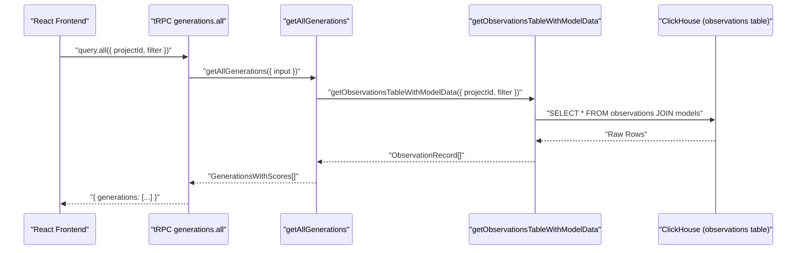

# tRPC 내부 API

<details>
<summary>관련 소스 파일</summary>

다음 파일들은 이 위키 페이지를 생성하는 컨텍스트로 사용되었습니다.

- [packages/shared/prisma/schema.prisma](packages/shared/prisma/schema.prisma)
- [packages/shared/src/server/queries/createGenerationsQuery.ts](packages/shared/src/server/queries/createGenerationsQuery.ts)
- [packages/shared/src/server/repositories/clickhouse.ts](packages/shared/src/server/repositories/clickhouse.ts)
- [web/src/__tests__/organization-settings-pages.clienttest.tsx](web/src/__tests__/organization-settings-pages.clienttest.tsx)
- [web/src/__tests__/server/repositories/clickhouse-resource-errors.servertest.ts](web/src/__tests__/server/repositories/clickhouse-resource-errors.servertest.ts)
- [web/src/__tests__/server/trpc-error-formatting.servertest.ts](web/src/__tests__/server/trpc-error-formatting.servertest.ts)
- [web/src/__tests__/server/withMiddlewares.servertest.ts](web/src/__tests__/server/withMiddlewares.servertest.ts)
- [web/src/features/audit-logs/auditLog.ts](web/src/features/audit-logs/auditLog.ts)
- [web/src/features/models/components/ModelSettings.tsx](web/src/features/models/components/ModelSettings.tsx)
- [web/src/features/notifications/ErrorNotification.tsx](web/src/features/notifications/ErrorNotification.tsx)
- [web/src/features/notifications/showErrorToast.tsx](web/src/features/notifications/showErrorToast.tsx)
- [web/src/features/public-api/server/withMiddlewares.ts](web/src/features/public-api/server/withMiddlewares.ts)
- [web/src/features/public-api/types/metrics.ts](web/src/features/public-api/types/metrics.ts)
- [web/src/features/public-api/types/sessions.ts](web/src/features/public-api/types/sessions.ts)
- [web/src/pages/api/public/metrics/index.ts](web/src/pages/api/public/metrics/index.ts)
- [web/src/pages/api/public/v2/metrics.ts](web/src/pages/api/public/v2/metrics.ts)
- [web/src/pages/api/public/v2/observations/index.ts](web/src/pages/api/public/v2/observations/index.ts)
- [web/src/pages/organization/[organizationId]/settings/index.tsx](web/src/pages/organization/[organizationId]/settings/index.tsx)
- [web/src/pages/project/[projectId]/settings/index.tsx](web/src/pages/project/[projectId]/settings/index.tsx)
- [web/src/server/api/root.ts](web/src/server/api/root.ts)
- [web/src/server/api/routers/generations/db/getAllGenerationsSqlQuery.ts](web/src/server/api/routers/generations/db/getAllGenerationsSqlQuery.ts)
- [web/src/server/api/routers/generations/getAllQueries.ts](web/src/server/api/routers/generations/getAllQueries.ts)
- [web/src/server/api/routers/observations.ts](web/src/server/api/routers/observations.ts)
- [web/src/server/api/routers/public.ts](web/src/server/api/routers/public.ts)
- [web/src/server/api/trpc.ts](web/src/server/api/trpc.ts)
- [web/src/utils/trpcErrorToast.tsx](web/src/utils/trpcErrorToast.tsx)

</details>


이 페이지는 동일한 웹 애플리케이션 프로세스 안에서 Next.js 프론트엔드와 서버 측 백엔드 간 통신에 사용되는 tRPC 기반 내부 API를 문서화합니다. 이는 외부 SDK 클라이언트가 사용하는 public REST API와는 다릅니다. 해당 내용은 [Public REST API](#5.1)를 참조하고, API key 인증과 rate limiting은 [API Authentication & Rate Limiting](#5.3)을 참조하세요.

---

## 개요

tRPC 내부 API는 전적으로 `web` package 안에 정의됩니다. React 프론트엔드가 애플리케이션 데이터를 읽고 변경하기 위해 호출하는 타입 안전한 remote procedure call을 제공합니다. 모든 tRPC procedure는 Pages Router adapter를 사용해 `/api/trpc`의 Next.js API route 안에서 실행됩니다 [web/src/server/api/trpc.ts:1-8]().

API는 router의 트리로 구성되며, 각 router는 domain entity(traces, observations, sessions, scores, generations, datasets, evaluations, dashboard 등)를 담당합니다. Procedure는 Prisma를 통해 PostgreSQL과 통신하고, `packages/shared`의 repository function 및 service layer를 통해 ClickHouse와 통신합니다.

---

## Context

모든 tRPC 요청은 `createTRPCContext` [web/src/server/api/trpc.ts:57-72]()에서 구성된 **context** 객체를 받습니다.

**Diagram: Context construction**

```mermaid
flowchart LR
  "HTTPRequest[/api/trpc]" --> "createTRPCContext()"
  "createTRPCContext()" --> "getServerAuthSession()"
  "createTRPCContext()" --> "createInnerTRPCContext()"
  "createInnerTRPCContext()" --> "CTX[Context Object]"
  "CTX" --> "session(NextAuth)"
  "CTX" --> "prisma(PrismaClient)"
  "CTX" --> "headers"
```

출처: [web/src/server/api/trpc.ts:43-72]()

| Context Field | Type | 설명 |
|---|---|---|
| `session` | `Session \| null` | 사용자, org, project data를 포함하는 NextAuth session [web/src/server/api/trpc.ts:29]() |
| `prisma` | `PrismaClient` | `@langfuse/shared/src/db`의 공유 Prisma instance [web/src/server/api/trpc.ts:21]() |
| `headers` | `IncomingHttpHeaders` | 요청의 원시 HTTP headers [web/src/server/api/trpc.ts:64]() |

Context는 procedure logic이 실행되기 전에 사용자 identity와 project-level access를 확인하는 데 사용됩니다.

---

## tRPC 초기화

tRPC instance는 `initTRPC`를 사용해 [web/src/server/api/trpc.ts:103-124]()에서 생성됩니다.

- **Transformer**: `superjson` — `Date`, `bigint`, `Decimal` 및 기타 JSON-safe하지 않은 type을 wire를 통해 serialize할 수 있게 합니다 [web/src/server/api/trpc.ts:104]().
- **Error formatter**: ZodErrors는 flatten되어 response의 `data.zodError` 아래에 첨부됩니다 [web/src/server/api/trpc.ts:110-111](). 또한 `ClickHouseResourceError`를 처리하며, ClickHouse 오류가 아닌 경우에만 원래 stack trace를 보존합니다 [web/src/server/api/trpc.ts:113-121]().

`createTRPCRouter`(`t.router`)는 모든 router를 위한 factory로 export됩니다 [web/src/server/api/trpc.ts:138]().

---

## Middleware Stack 및 Procedure Type

Middleware stack은 OpenTelemetry instrumentation, error normalization, authorization을 처리합니다.

**Diagram: Procedure types and their middleware chains**

```mermaid
flowchart TD
  "BaseProcedure[t.procedure]"

  "withOtelInstrumentation[withOtelInstrumentation]"
  "OtelTracingMiddleware[tracing()]"
  "withErrorHandling[withErrorHandling]"
  "enforceUserIsAuthed[enforceUserIsAuthed]"
  "protectedProjectProcedure[protectedProjectProcedure]"

  "BaseProcedure" --> "withOtelInstrumentation"
  "withOtelInstrumentation" --> "OtelTracingMiddleware"
  "OtelTracingMiddleware" --> "withErrorHandling"
  "withErrorHandling" --> "publicProcedure"

  "withErrorHandling" --> "enforceUserIsAuthed"
  "enforceUserIsAuthed" --> "authenticatedProcedure"

  "enforceUserIsAuthed" --> "protectedProjectProcedure"
```

출처: [web/src/server/api/trpc.ts:167-211]()

### Procedure Type 참조

| Export | 인증 필요 | Project 확인 | 사용 사례 |
|---|---|---|---|
| `publicProcedure` | 아니요 | 아니요 | 인증되지 않은 query(예: public trace access) |
| `protectedProjectProcedure` | 예 | 예(input의 `projectId`) | 가장 일반적: project-scoped data fetching [web/src/server/api/routers/generations/getAllQueries.ts:16](). |
| `protectedGetTraceProcedure` | 예 | 예 + trace access | Trace detail page(public traces 지원) [web/src/server/api/routers/observations.ts:11](). |

### `withErrorHandling` 세부사항

[web/src/server/api/trpc.ts:167-208]()

- `ClickHouseResourceError`를 catch → 표준 조언 메시지와 함께 `UNPROCESSABLE_CONTENT`를 반환합니다 [web/src/server/api/trpc.ts:171-185]().
- 다른 오류를 catch → 내부 stack trace를 숨기면서 `TRPCError`로 normalize합니다. 4xx 오류는 원래 메시지를 노출하고, 5xx 오류는 Langfuse Cloud에서 generic message를 반환합니다 [web/src/server/api/trpc.ts:190-204]().

---

## Root Router 구성

Root router는 feature-specific sub-router를 병합합니다. 주요 router에는 `traceRouter`, `observationsRouter`, `sessionRouter`, `scoresRouter`, `datasetRouter`가 포함됩니다.

출처: [web/src/server/api/root.ts:65-123]()

---

## 주요 Router

### `observationsRouter`

파일: [web/src/server/api/routers/observations.ts]()

| Procedure | Type | 설명 |
|---|---|---|
| `byId` | query | parsed input/output이 포함된 단일 observation을 가져옵니다. `protectedGetTraceProcedure`를 사용합니다 [web/src/server/api/routers/observations.ts:11-45](). |

`byId` procedure는 shared server package의 `getObservationById`를 활용하고, 일관된 데이터 구조를 보장하기 위해 `toDomainWithStringifiedMetadata`를 적용합니다 [web/src/server/api/routers/observations.ts:33-40]().

### `generationsRouter`

파일: [web/src/server/api/routers/generations/getAllQueries.ts]()

| Procedure | Type | 설명 |
|---|---|---|
| `all` | query | score aggregation 및 comment filtering이 포함된 paginated generation list [web/src/server/api/routers/generations/getAllQueries.ts:16-38](). |
| `countAll` | query | generation table pagination을 위한 total count [web/src/server/api/routers/generations/getAllQueries.ts:39-63](). |

`all` query는 observation data를 model definitions와 join하고 scores를 aggregate하는 `getAllGenerations`를 사용합니다 [web/src/server/api/routers/generations/db/getAllGenerationsSqlQuery.ts:13-59]().

---

## 데이터 Fetching 패턴

tRPC 계층은 프론트엔드와 data repositories/services 사이의 orchestrator 역할을 합니다.

**Diagram: Generation Data Flow**



출처: [web/src/server/api/routers/generations/getAllQueries.ts:30-37](), [web/src/server/api/routers/generations/db/getAllGenerationsSqlQuery.ts:13-30](), [packages/shared/src/server/repositories/clickhouse.ts:128-143]()

### ClickHouse Repositories
`packages/shared/src/server/repositories/`의 repositories는 low-level ClickHouse 통신을 처리합니다.
- `upsertClickhouse`: records를 event bodies로 매핑하고 ClickHouse에 insert하기 전에 S3에 upload하여 write를 처리합니다 [packages/shared/src/server/repositories/clickhouse.ts:128-205]().
- `ClickHouseResourceError`: memory limit 또는 timeout을 wrapping하는 custom error class입니다 [packages/shared/src/server/repositories/clickhouse.ts:48-92]().

---

## 오류 처리와 UI 통합

1.  **Input Validation**: 모든 procedure는 들어오는 payload를 검증하기 위해 `zod` schema(예: `paginationZod`, `GetAllGenerationsInput`)를 사용합니다 [web/src/server/api/routers/generations/getAllQueries.ts:9-11]().
2.  **Client-Side Toasts**: `trpcErrorToast` utility는 tRPC error code를 사용자 친화적인 notification으로 매핑합니다 [web/src/utils/trpcErrorToast.tsx:82-113]().
3.  **ClickHouse Feedback**: `ClickHouseResourceError`가 발생하면 UI는 query optimization에 대한 구체적인 guidance와 함께 "Request Timed Out" 메시지를 표시합니다 [web/src/utils/trpcErrorToast.tsx:41-50]().

출처: [web/src/server/api/trpc.ts:105-123](), [web/src/utils/trpcErrorToast.tsx:20-35](), [packages/shared/src/server/repositories/clickhouse.ts:48-50]()
