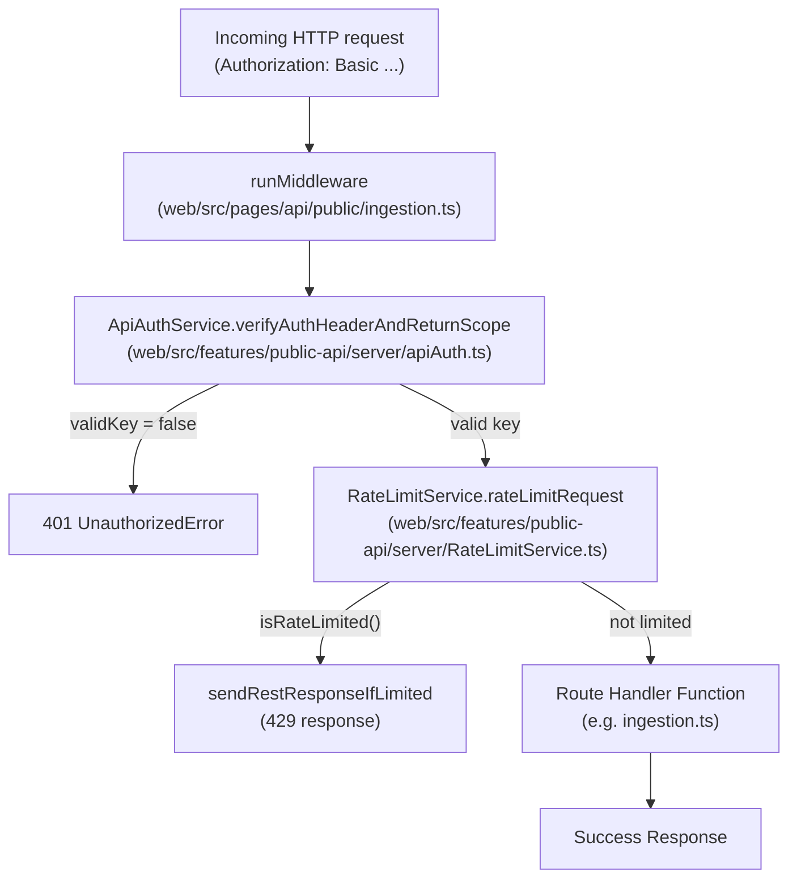
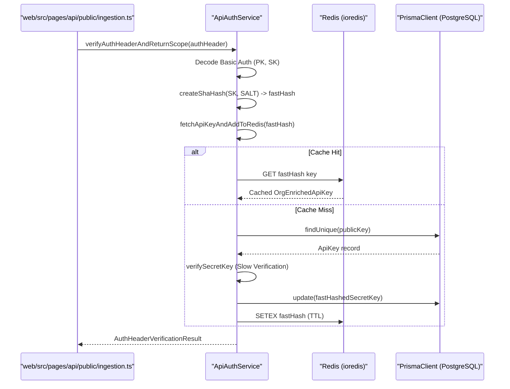
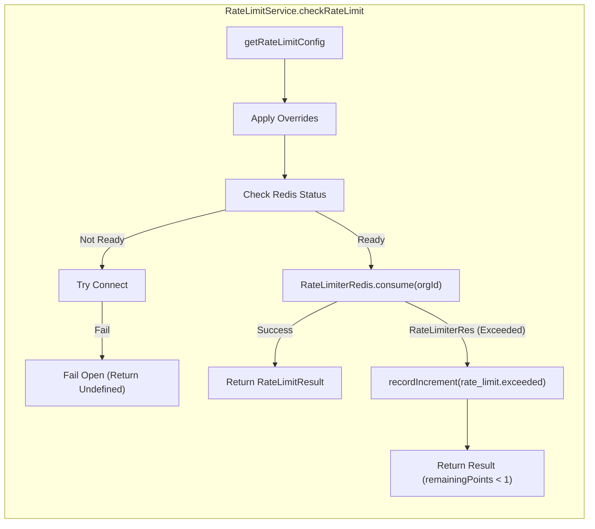

# API 인증 및 Rate Limiting

관련 소스 파일

다음 파일들은 이 위키 페이지를 생성하는 컨텍스트로 사용되었습니다.

- [packages/shared/prisma/migrations/20250123103200_add_retention_days_to_projects/migration.sql](packages/shared/prisma/migrations/20250123103200_add_retention_days_to_projects/migration.sql)
- [packages/shared/src/features/entitlements/plans.ts](packages/shared/src/features/entitlements/plans.ts)
- [packages/shared/src/interfaces/rate-limits.ts](packages/shared/src/interfaces/rate-limits.ts)
- [packages/shared/src/server/auth/types.ts](packages/shared/src/server/auth/types.ts)
- [packages/shared/src/server/headerPropagation.ts](packages/shared/src/server/headerPropagation.ts)
- [packages/shared/src/server/instrumentation/index.ts](packages/shared/src/server/instrumentation/index.ts)
- [web/src/__tests__/server/unit/api-auth-span.servertest.ts](web/src/__tests__/server/unit/api-auth-span.servertest.ts)
- [web/src/__tests__/server/unit/langfuse-context-propagation.servertest.ts](web/src/__tests__/server/unit/langfuse-context-propagation.servertest.ts)
- [web/src/components/VersionLabel.tsx](web/src/components/VersionLabel.tsx)
- [web/src/ee/features/ui-customization/uiCustomizationRouter.ts](web/src/ee/features/ui-customization/uiCustomizationRouter.ts)
- [web/src/ee/features/ui-customization/useUiCustomization.ts](web/src/ee/features/ui-customization/useUiCustomization.ts)
- [web/src/features/auth/lib/projectRetentionSchema.ts](web/src/features/auth/lib/projectRetentionSchema.ts)
- [web/src/features/background-migrations/components/background-migrations.tsx](web/src/features/background-migrations/components/background-migrations.tsx)
- [web/src/features/background-migrations/components/retry-background-migration.tsx](web/src/features/background-migrations/components/retry-background-migration.tsx)
- [web/src/features/background-migrations/server/background-migrations-router.ts](web/src/features/background-migrations/server/background-migrations-router.ts)
- [web/src/features/entitlements/constants/entitlements.ts](web/src/features/entitlements/constants/entitlements.ts)
- [web/src/features/entitlements/server/getPlan.ts](web/src/features/entitlements/server/getPlan.ts)
- [web/src/features/projects/components/ConfigureRetention.tsx](web/src/features/projects/components/ConfigureRetention.tsx)
- [web/src/features/public-api/server/RateLimitService.ts](web/src/features/public-api/server/RateLimitService.ts)
- [web/src/features/public-api/server/apiAuth.ts](web/src/features/public-api/server/apiAuth.ts)
- [web/src/features/public-api/server/createAuthedProjectAPIRoute.ts](web/src/features/public-api/server/createAuthedProjectAPIRoute.ts)
- [web/src/pages/api/public/ingestion.ts](web/src/pages/api/public/ingestion.ts)
- [web/src/pages/background-migrations.tsx](web/src/pages/background-migrations.tsx)
- [web/src/server/api/routers/surveys.ts](web/src/server/api/routers/surveys.ts)

이 페이지는 들어오는 public REST API 요청이 인증되는 방식, `ApiAuthService`가 credential을 resolve하고 cache하는 방식, 그리고 Redis를 사용해 project scope별 rate limiting을 적용하는 방식을 설명합니다. 모든 `POST /api/public/*` 및 `GET /api/public/*` 엔드포인트의 경계에 위치한 runtime enforcement layer를 다룹니다.

- API key가 생성, hash, 저장되는 방식은 [4.3]()을 참조하세요.
- 전체 public REST API surface는 [5.1]()을 참조하세요.
- tRPC 내부 인증(session 기반)은 [4.1]()을 참조하세요.
- 인증 후 적용되는 RBAC는 [4.4]()를 참조하세요.

---

## 개요

모든 public REST API 요청은 다단계 gate를 거칩니다. 예를 들어 ingestion endpoint는 event를 processing pipeline으로 dispatch하기 전에 permission, rate limit, request structure를 검증합니다 [web/src/pages/api/public/ingestion.ts:34-49]().

1.  **CORS 및 Method Validation**: `cors`와 기본 method check가 포함된 `runMiddleware`에서 처리됩니다 [web/src/pages/api/public/ingestion.ts:55-73]().
2.  **Authentication**: `ApiAuthService`가 `Authorization` header를 decode하고, PostgreSQL(Redis cache layer 포함)에 대해 API key를 resolve한 뒤 `AuthHeaderVerificationResult`를 생성합니다 [web/src/features/public-api/server/apiAuth.ts:90-198]().
3.  **Rate Limiting**: 요청이 처리되기 전에 `RateLimitService`가 resolved scope를 configurable limit(organization plan 또는 custom override 기반)에 대해 검사합니다 [web/src/features/public-api/server/RateLimitService.ts:63-82]().

**Public API의 request lifecycle diagram**

출처: [web/src/pages/api/public/ingestion.ts:50-139](), [web/src/features/public-api/server/apiAuth.ts:90-198](), [web/src/features/public-api/server/RateLimitService.ts:63-82]()

---

## 인증 방식

Langfuse Public API는 환경과 필요한 access level에 따라 여러 인증 메커니즘을 지원합니다.

### Basic Authentication
주로 전체 project/org access에 사용됩니다. 클라이언트는 `publicKey:secretKey`를 base64로 encode하고 `Authorization: Basic <encoded>`로 전송합니다 [web/src/features/public-api/server/apiAuth.ts:107-109]().

| Field | Value |
|---|---|
| Username | Langfuse **Public Key**(prefix `pk-lf-...`) |
| Password | Langfuse **Secret Key**(prefix `sk-lf-...`) |

### Bearer Authentication(Public Key)
제한된 public access(예: client-side 환경의 scoring) 또는 self-hosted instance의 Admin API access에 사용됩니다 [web/src/features/public-api/server/apiAuth.ts:200-201](). 

### Admin API Key Authentication
self-hosted instance에서는 global `ADMIN_API_KEY`를 사용해 표준 project-key auth를 우회할 수 있습니다. 이를 위해서는 `x-langfuse-admin-api-key` 및 `x-langfuse-project-id` header가 필요합니다 [web/src/features/public-api/server/createAuthedProjectAPIRoute.ts:148-183]().

출처: [web/src/features/public-api/server/apiAuth.ts:102-201](), [web/src/features/public-api/server/createAuthedProjectAPIRoute.ts:148-183]()

---

## ApiAuthService

`ApiAuthService`(`web/src/features/public-api/server/apiAuth.ts`)는 credential 검증을 위한 중심 class입니다.

### Credential Resolution Flow

서비스는 "fast-hash" 전략을 사용합니다. 먼저 Redis/PostgreSQL에서 secret key의 SHA-256 hash를 확인합니다. 찾지 못하면 legacy hashed key에 대해 "slow" verification을 수행한 뒤 향후 요청을 위해 `fastHashedSecretKey`를 포함하도록 record를 upgrade합니다 [web/src/features/public-api/server/apiAuth.ts:111-161]().

출처: [web/src/features/public-api/server/apiAuth.ts:90-161](), [web/src/features/public-api/server/apiAuth.ts:111-112]()

### API Key Caching 및 Invalidation

Redis caching은 모든 API call마다 비용이 큰 database lookup을 피하기 위해 사용됩니다.
- **Invalidation**: `invalidateCachedOrgApiKeys` 및 `invalidateCachedProjectApiKeys` 같은 method는 project 이동, plan 변경, key 삭제 시 Redis에서 key를 purge합니다 [web/src/features/public-api/server/apiAuth.ts:45-55]().
- **Deletion**: API key가 `deleteApiKey`를 통해 삭제되면 consistency를 위해 database에서 제거되고 Redis에서 invalidate됩니다 [web/src/features/public-api/server/apiAuth.ts:63-88]().

---

## Redis를 사용한 Rate Limiting

`RateLimitService`(`web/src/features/public-api/server/RateLimitService.ts`)는 Redis를 backend로 사용하는 `rate-limiter-flexible` library로 rate limiting을 구현합니다 [web/src/features/public-api/server/RateLimitService.ts:3-33]().

### 전략 및 설정

Limit은 특정 **Resources**에 대해 **Organization ID**별로 적용됩니다. 시스템은 `RateLimitResource` enum을 통해 서로 다른 operation type을 구분합니다 [packages/shared/src/interfaces/rate-limits.ts:4-14]().

| Resource Type | 설명 |
|---|---|
| `ingestion` | 주요 event ingestion endpoint(`/api/public/ingestion`) [web/src/pages/api/public/ingestion.ts:107](). |
| `public-api` | traces, scores 등에 대한 일반 GET/POST CRUD 작업. |
| `prompts` | prompt management API access. |

### Plan-Based Limits

Limit은 `entitlementAccess`에 정의된 organization plan(예: `cloud:hobby`, `cloud:pro`)에 의해 결정됩니다 [web/src/features/entitlements/constants/entitlements.ts:51-171]().
- **Cloud**: `NEXT_PUBLIC_LANGFUSE_CLOUD_REGION`이 설정되어 있으면 Redis를 사용해 rate limit이 엄격히 enforce됩니다 [web/src/features/public-api/server/RateLimitService.ts:68-70]().
- **Self-Hosted/OSS**: 기본적으로 rate limiting이 disabled(`fail open`)되거나 Redis를 사용할 수 없으면 disabled됩니다 [web/src/features/public-api/server/RateLimitService.ts:68-79]().
- **Overrides**: `ApiAccessScope`는 plan default보다 우선하는 `rateLimitOverrides`를 포함할 수 있습니다 [web/src/features/public-api/server/apiAuth.ts:202]().

### Fail-Open Design

서비스는 resilient하도록 설계되었습니다. Redis가 down되었거나 connection이 실패하면 시스템은 error를 log하고 request가 계속 진행되도록 허용합니다 [web/src/features/public-api/server/RateLimitService.ts:141-148]().

출처: [web/src/features/public-api/server/RateLimitService.ts:84-159](), [web/src/features/entitlements/constants/entitlements.ts:51-171]()

---

## 구현 세부사항

### 오류 처리

Ingestion handler는 Public API를 위한 통합 error formatting을 제공합니다.
- **BaseError**: 알려진 internal error에 대해 매핑된 HTTP code를 반환합니다 [web/src/pages/api/public/ingestion.ts:147-152]().
- **UnauthorizedError**: API key가 invalid이거나 `projectId`가 누락된 경우 throw됩니다 [web/src/pages/api/public/ingestion.ts:81-88]().
- **ForbiddenError**: usage threshold로 인해 ingestion이 suspended된 경우 throw됩니다 [web/src/pages/api/public/ingestion.ts:90-94]().
- **ZodError**: request body가 올바르지 않으면 validation details와 함께 `400 Bad Request`를 반환합니다 [web/src/pages/api/public/ingestion.ts:160-166]().

### Observability 및 Instrumentation

Authentication 및 Redis operation은 OpenTelemetry를 사용해 instrument됩니다.
- **ioredisRequestHook**: `AUTH`와 `HELLO` command에서 credential을 redact하고 Redis trace의 API key value를 mask합니다 [packages/shared/src/server/instrumentation/index.ts:16-35]().
- **addUserToSpan**: authentication phase 동안 `userId`, `projectId`, `orgId`, `plan`으로 telemetry span을 enrich합니다 [packages/shared/src/server/instrumentation/index.ts:190-243]().
- **instrumentAsync**: `ApiAuthService` 안에서 `api-auth-verify` operation을 trace하는 데 사용됩니다 [web/src/features/public-api/server/apiAuth.ts:94-96]().

### Context Propagation
`contextWithLangfuseProps` function은 header와 auth metadata(예: `projectId`, `apiKeyId`)가 OpenTelemetry baggage를 통해 downstream span으로 propagate되도록 보장합니다 [packages/shared/src/server/headerPropagation.ts:17-65]().

---

## Environment Variable 요약

| Variable | 설명 |
|---|---|
| `SALT` | API secret key의 SHA-256 hashing에 사용됩니다 [web/src/features/public-api/server/apiAuth.ts:111](). |
| `LANGFUSE_RATE_LIMITS_ENABLED` | `RateLimitService`에 대한 global toggle [web/src/features/public-api/server/RateLimitService.ts:72](). |
| `NEXT_PUBLIC_LANGFUSE_CLOUD_REGION` | strict rate limiting 같은 cloud-specific behavior를 활성화합니다 [web/src/features/public-api/server/RateLimitService.ts:68](). |
| `ADMIN_API_KEY` | self-hosted instance에서 administrative operation에 사용하는 global key [web/src/features/public-api/server/createAuthedProjectAPIRoute.ts:170](). |

출처: [web/src/features/public-api/server/apiAuth.ts:111](), [web/src/features/public-api/server/RateLimitService.ts:68-72](), [packages/shared/src/server/instrumentation/index.ts:16-35](), [web/src/features/public-api/server/createAuthedProjectAPIRoute.ts:170](), [packages/shared/src/server/headerPropagation.ts:17-65]()
