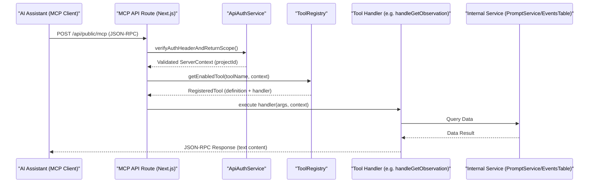
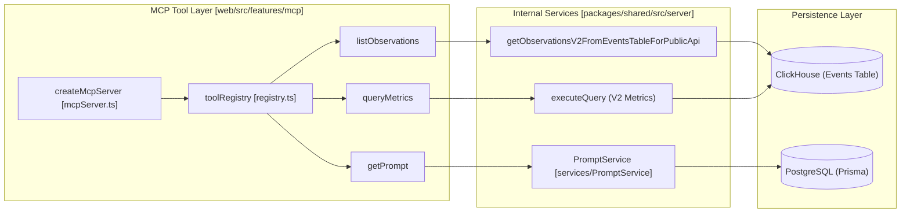

# MCP Server

관련 소스 파일

다음 파일들은 이 위키 페이지를 생성하는 컨텍스트로 사용되었습니다.

- [packages/shared/src/features/prompts/types.ts](packages/shared/src/features/prompts/types.ts)
- [packages/shared/src/server/services/PromptService/index.ts](packages/shared/src/server/services/PromptService/index.ts)
- [packages/shared/src/server/services/PromptService/types.ts](packages/shared/src/server/services/PromptService/types.ts)
- [web/src/__tests__/server/mcp-tools-read.servertest.ts](web/src/__tests__/server/mcp-tools-read.servertest.ts)
- [web/src/__tests__/server/promptCache.servertest.ts](web/src/__tests__/server/promptCache.servertest.ts)
- [web/src/features/mcp/README.md](web/src/features/mcp/README.md)
- [web/src/features/mcp/features/metrics/index.ts](web/src/features/mcp/features/metrics/index.ts)
- [web/src/features/mcp/features/metrics/tools/getMetricsSchema.ts](web/src/features/mcp/features/metrics/tools/getMetricsSchema.ts)
- [web/src/features/mcp/features/metrics/tools/queryMetrics.ts](web/src/features/mcp/features/metrics/tools/queryMetrics.ts)
- [web/src/features/mcp/features/observations/index.ts](web/src/features/mcp/features/observations/index.ts)
- [web/src/features/mcp/features/observations/schema.ts](web/src/features/mcp/features/observations/schema.ts)
- [web/src/features/mcp/features/observations/tools/getObservation.ts](web/src/features/mcp/features/observations/tools/getObservation.ts)
- [web/src/features/mcp/features/prompts/index.ts](web/src/features/mcp/features/prompts/index.ts)
- [web/src/features/mcp/features/prompts/tools/getPrompt.ts](web/src/features/mcp/features/prompts/tools/getPrompt.ts)
- [web/src/features/mcp/features/prompts/tools/getPromptUnresolved.ts](web/src/features/mcp/features/prompts/tools/getPromptUnresolved.ts)
- [web/src/features/mcp/features/prompts/tools/promptReadToolFactory.ts](web/src/features/mcp/features/prompts/tools/promptReadToolFactory.ts)
- [web/src/features/mcp/server/bootstrap.ts](web/src/features/mcp/server/bootstrap.ts)
- [web/src/features/mcp/server/mcpServer.ts](web/src/features/mcp/server/mcpServer.ts)
- [web/src/features/mcp/server/registry.ts](web/src/features/mcp/server/registry.ts)
- [web/src/features/prompts/server/actions/deletePrompt.ts](web/src/features/prompts/server/actions/deletePrompt.ts)
- [web/src/features/prompts/server/actions/getPromptByName.ts](web/src/features/prompts/server/actions/getPromptByName.ts)
- [web/src/features/prompts/server/handlers/promptNameHandler.ts](web/src/features/prompts/server/handlers/promptNameHandler.ts)
- [web/src/features/telemetry/index.ts](web/src/features/telemetry/index.ts)
- [web/src/pages/api/public/mcp/index.ts](web/src/pages/api/public/mcp/index.ts)
- [web/src/pages/api/public/projects/[projectId]/apiKeys/[apiKeyId].ts](web/src/pages/api/public/projects/[projectId]/apiKeys/[apiKeyId].ts)
- [web/src/pages/api/public/projects/[projectId]/apiKeys/index.ts](web/src/pages/api/public/projects/[projectId]/apiKeys/index.ts)
- [web/src/pages/api/public/prompts.ts](web/src/pages/api/public/prompts.ts)

Langfuse MCP(Model Context Protocol) Server는 AI assistant(예: Claude Desktop, Claude Code, Cursor)가 Langfuse 리소스와 직접 상호작용할 수 있게 합니다. LLM이 prompt를 가져오고, version을 관리하며, Langfuse project 내 observations와 metrics 같은 observability data를 검사할 수 있는 표준화된 interface를 제공합니다.

## 개요

Langfuse의 MCP 구현은 `/api/public/mcp` endpoint의 Next.js 웹 애플리케이션 계층에 통합된 **요청별 stateless architecture**를 따릅니다 [web/src/pages/api/public/mcp/index.ts:1-10](). 여러 domain(prompts, observations, metrics, scores)에 걸쳐 특정 "tools"를 노출하여 AI agent가 Langfuse data를 query하고 관리할 수 있게 합니다.

### 주요 특징
- **Stateless Architecture**: 각 MCP request는 `createMcpServer(context)`를 통해 새로운 server instance를 생성합니다. Authentication context는 handler closure에 capture되며, request 사이에 session state는 유지되지 않습니다 [web/src/features/mcp/server/mcpServer.ts:8-13](), [web/src/features/mcp/README.md:142-156]().
- **Transport Layer**: **Streamable HTTP transport**(2025-03-26 spec)를 구현하며, GET stream에는 SSE(Server-Sent Events)를, POST message에는 JSON-RPC를 사용합니다 [web/src/pages/api/public/mcp/index.ts:9-17]().
- **Feature Registry**: Tools는 feature module(예: `promptsFeature`, `observationsFeature`, `scoresFeature`)로 구성되며 중앙 `toolRegistry`를 통해 startup 시 등록됩니다 [web/src/features/mcp/server/bootstrap.ts:33-48]().
- **Unified Authentication**: Basic Auth를 통해 project-scoped API key(Public Key + Secret Key)를 요구하는 `ApiAuthService`를 사용합니다 [web/src/pages/api/public/mcp/index.ts:79-99]().

**출처:** [web/src/pages/api/public/mcp/index.ts:1-100](), [web/src/features/mcp/README.md:140-160]().

## 아키텍처 및 데이터 흐름

MCP server는 Model Context Protocol과 Langfuse 내부 service 사이의 bridge 역할을 합니다. AI assistant가 tool을 호출하면 request가 인증되고, server가 instantiate되며, registry가 call을 적절한 domain handler로 route합니다.

### 요청 흐름 다이어그램

Title: MCP Tool Execution Flow

**출처:** [web/src/pages/api/public/mcp/index.ts:65-145](), [web/src/features/mcp/server/mcpServer.ts:73-101](), [web/src/features/mcp/server/registry.ts:156-175]().

## 사용 가능한 Tools

MCP server는 prompt management, observation inspection, scores management, metrics analysis를 위한 tools를 제공합니다.

### Prompt Management Tools
이 tools는 `PromptService`를 활용해 versioning과 중첩 prompt의 recursive resolution을 처리합니다 [web/src/features/mcp/README.md:86-118]().

| Tool Name | 설명 |
| :--- | :--- |
| `getPrompt` | name 및 label/version으로 prompt를 가져오며, dependency tag를 recursive하게 resolve합니다 [web/src/features/mcp/README.md:90-99](). |
| `getPromptUnresolved` | dependency를 resolve하지 않고 prompt를 가져옵니다(`@@@langfusePrompt:...@@@` tag 보존) [web/src/features/mcp/README.md:101-110](). |
| `listPrompts` | pagination과 함께 project 내 prompt를 나열하고 filter합니다 [web/src/features/mcp/README.md:56](). |
| `createTextPrompt` | 새 text prompt version을 생성합니다 [web/src/features/mcp/README.md:57](). |
| `createChatPrompt` | 새 chat prompt version(OpenAI-style messages)을 생성합니다 [web/src/features/mcp/README.md:58](). |

### Observation 및 Metrics Tools
이 tools는 **Events Table V2** backend와 상호작용하여 고성능 observability data를 제공합니다 [web/src/features/mcp/features/observations/index.ts:24-56]().

| Tool Name | 설명 |
| :--- | :--- |
| `listObservations` | 고급 filter와 field projection으로 generations, spans, events를 찾습니다 [web/src/features/mcp/README.md:67](). |
| `getObservation` | payload와 metadata를 포함해 ID로 단일 observation을 가져옵니다 [web/src/features/mcp/features/observations/tools/getObservation.ts:24-33](). |
| `queryMetrics` | V2 metrics engine을 사용해 usage, cost, quality metrics를 query합니다 [web/src/features/mcp/features/metrics/tools/queryMetrics.ts:9-12](). |
| `getMetricsSchema` | 사용 가능한 metrics views, dimensions, measures를 탐색합니다 [web/src/features/mcp/features/metrics/tools/getMetricsSchema.ts:16-19](). |

### Score Tools
`scoresFeature`는 AI assistant가 evaluations와 human-in-the-loop feedback을 관리할 수 있게 합니다 [web/src/features/mcp/server/bootstrap.ts:41]().

| Tool Name | 설명 |
| :--- | :--- |
| `createScore` | trace 또는 observation에 대한 새 score를 생성합니다 [web/src/__tests__/server/mcp-tools-read.servertest.ts:89-91](). |
| `listScores` | filtering과 함께 project 내 scores를 나열합니다 [web/src/__tests__/server/mcp-tools-read.servertest.ts:113-115](). |
| `createScoreConfig` | 새 score configuration(categorical, numeric 등)을 정의합니다 [web/src/__tests__/server/mcp-tools-read.servertest.ts:85-87](). |

Title: MCP Tool to Code Entity Bridge

**출처:** [web/src/features/mcp/server/registry.ts:75-113](), [web/src/features/mcp/server/mcpServer.ts:46-104](), [packages/shared/src/server/services/PromptService/index.ts:20-47]().

## 인증 및 보안

MCP server는 엄격한 security boundary를 enforce합니다.
1.  **Project Scoping**: project-scoped API key만 허용됩니다. Organization-level key와 Bearer token은 거부됩니다 [web/src/pages/api/public/mcp/index.ts:92-99]().
2.  **In-App Agent Keys**: 특정 tools는 `RegisteredTool` definition의 `allowInAppAgentKey` flag를 사용해 "In-App Agent" key용으로 gate될 수 있습니다 [web/src/features/mcp/server/registry.ts:22-32](). Registry의 `canUseTool` method는 이를 `ServerContext`에 대해 확인합니다 [web/src/features/mcp/server/registry.ts:177-183]().
3.  **CORS 및 Headers**: `validateMcpRequestSecurity`를 통해 Host/Origin header를 검증하고 MCP client compatibility를 위한 특정 CORS header를 적용합니다 [web/src/pages/api/public/mcp/index.ts:70-71]().
4.  **Rate Limiting**: `public-api` bucket을 사용해 `RateLimitService`와 통합됩니다 [web/src/pages/api/public/mcp/index.ts:109-117]().

**출처:** [web/src/pages/api/public/mcp/index.ts:79-137](), [web/src/features/mcp/server/registry.ts:156-183]().

## 구현 세부사항

### Stateless Server Creation
`createMcpServer` function은 `@modelcontextprotocol/sdk` Server를 instantiate합니다. 두 가지 주요 request handler를 정의합니다.
- `ListToolsRequestSchema`: 현재 project의 context와 enabled features를 기반으로 사용 가능한 tools를 반환하기 위해 `toolRegistry`를 query합니다 [web/src/features/mcp/server/mcpServer.ts:60-70]().
- `CallToolRequestSchema`: `toolRegistry.getEnabledTool`을 통해 tool execution을 registered handler로 route하고 result를 MCP content format으로 wrapping합니다 [web/src/features/mcp/server/mcpServer.ts:73-101]().

### Feature Bootstrapping
Langfuse는 circular dependency를 피하기 위해 registration pattern을 사용합니다. Feature module(예: `observationsFeature`)은 자체 tools와 선택적 `isEnabled` check(예: `LANGFUSE_ENABLE_EVENTS_TABLE_V2_APIS` flag 확인)를 정의합니다 [web/src/features/mcp/features/observations/index.ts:24-56](). 모든 features(prompts, observations, scores, metrics, models 등)는 application startup 시 `bootstrapMcpFeatures()`에 등록됩니다 [web/src/features/mcp/server/bootstrap.ts:33-48]().

### Prompt Resolution Graph
`getPrompt`가 호출되면 `PromptService`는 중첩 dependency를 resolve하기 위해 `PromptGraph`를 build합니다. 최대 `MAX_PROMPT_NESTING_DEPTH` 5까지 참조된 prompt를 recursive하게 fetch합니다 [packages/shared/src/server/services/PromptService/index.ts:18-47](). `getPromptUnresolved` tool은 `PromptParams`에서 `resolve: false`를 설정해 이 resolution을 bypass합니다 [packages/shared/src/server/services/PromptService/index.ts:48-50]().

**출처:** [web/src/features/mcp/server/mcpServer.ts:46-104](), [web/src/features/mcp/server/registry.ts:85-113](), [web/src/features/mcp/server/bootstrap.ts:1-56](), [packages/shared/src/server/services/PromptService/index.ts:18-145]().
