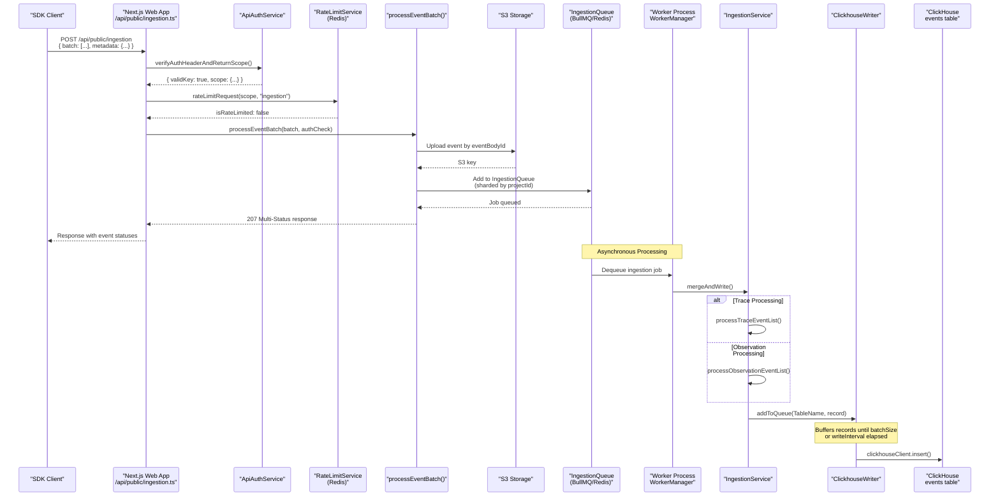
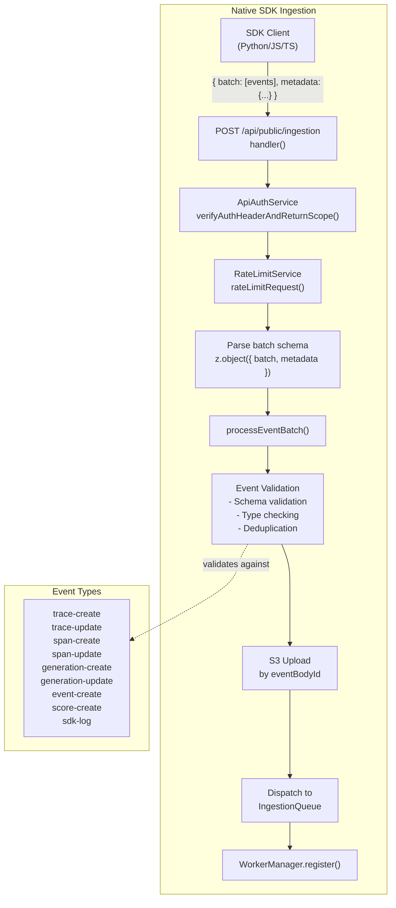

# Ingestion 개요

관련 소스 파일

다음 파일들은 이 위키 페이지를 생성하는 컨텍스트로 사용되었습니다.

- [.env.dev-redis-cluster.example](.env.dev-redis-cluster.example)
- [.vscode/launch.json](.vscode/launch.json)
- [fern/apis/server/definition/ingestion.yml](fern/apis/server/definition/ingestion.yml)
- [packages/shared/clickhouse/scripts/dev-tables.sh](packages/shared/clickhouse/scripts/dev-tables.sh)
- [packages/shared/src/env.ts](packages/shared/src/env.ts)
- [packages/shared/src/server/auth/types.ts](packages/shared/src/server/auth/types.ts)
- [packages/shared/src/server/headerPropagation.ts](packages/shared/src/server/headerPropagation.ts)
- [packages/shared/src/server/index.ts](packages/shared/src/server/index.ts)
- [packages/shared/src/server/ingestion/types.ts](packages/shared/src/server/ingestion/types.ts)
- [packages/shared/src/server/instrumentation/index.ts](packages/shared/src/server/instrumentation/index.ts)
- [packages/shared/src/server/queries/clickhouse-sql/clickhouse-filter.ts](packages/shared/src/server/queries/clickhouse-sql/clickhouse-filter.ts)
- [packages/shared/src/server/queues.ts](packages/shared/src/server/queues.ts)
- [packages/shared/src/server/redis/eventPropagationQueue.ts](packages/shared/src/server/redis/eventPropagationQueue.ts)
- [packages/shared/src/server/redis/getQueue.ts](packages/shared/src/server/redis/getQueue.ts)
- [packages/shared/src/server/repositories/definitions.ts](packages/shared/src/server/repositories/definitions.ts)
- [packages/shared/src/server/test-utils/tracing-factory.ts](packages/shared/src/server/test-utils/tracing-factory.ts)
- [packages/shared/src/utils/json.ts](packages/shared/src/utils/json.ts)
- [web/src/__tests__/server/unit/api-auth-span.servertest.ts](web/src/__tests__/server/unit/api-auth-span.servertest.ts)
- [web/src/__tests__/server/unit/langfuse-context-propagation.servertest.ts](web/src/__tests__/server/unit/langfuse-context-propagation.servertest.ts)
- [web/src/features/public-api/server/apiAuth.ts](web/src/features/public-api/server/apiAuth.ts)
- [web/src/features/public-api/server/createAuthedProjectAPIRoute.ts](web/src/features/public-api/server/createAuthedProjectAPIRoute.ts)
- [web/src/pages/api/admin/bullmq/index.ts](web/src/pages/api/admin/bullmq/index.ts)
- [web/src/pages/api/public/ingestion.ts](web/src/pages/api/public/ingestion.ts)
- [worker/src/app.ts](worker/src/app.ts)
- [worker/src/backgroundMigrations/backfillEventsHistoric.ts](worker/src/backgroundMigrations/backfillEventsHistoric.ts)
- [worker/src/backgroundMigrations/backfillEventsHistoricFromParts.ts](worker/src/backgroundMigrations/backfillEventsHistoricFromParts.ts)
- [worker/src/backgroundMigrations/backfillExperimentsHistoric.ts](worker/src/backgroundMigrations/backfillExperimentsHistoric.ts)
- [worker/src/env.ts](worker/src/env.ts)
- [worker/src/features/eventPropagation/handleEventPropagationJob.ts](worker/src/features/eventPropagation/handleEventPropagationJob.ts)
- [worker/src/features/eventPropagation/handleExperimentBackfill.ts](worker/src/features/eventPropagation/handleExperimentBackfill.ts)
- [worker/src/features/tokenisation/usage.ts](worker/src/features/tokenisation/usage.ts)
- [worker/src/queues/ingestionQueue.ts](worker/src/queues/ingestionQueue.ts)
- [worker/src/queues/workerManager.ts](worker/src/queues/workerManager.ts)
- [worker/src/services/IngestionService/index.ts](worker/src/services/IngestionService/index.ts)
- [worker/src/services/IngestionService/tests/IngestionService.integration.test.ts](worker/src/services/IngestionService/tests/IngestionService.integration.test.ts)
- [worker/src/services/IngestionService/tests/calculateTokenCost.unit.test.ts](worker/src/services/IngestionService/tests/calculateTokenCost.unit.test.ts)
- [worker/src/services/IngestionService/tests/utils.unit.test.ts](worker/src/services/IngestionService/tests/utils.unit.test.ts)
- [worker/src/services/IngestionService/utils.ts](worker/src/services/IngestionService/utils.ts)
- [worker/src/utils/shutdown.ts](worker/src/utils/shutdown.ts)

이 문서는 SDK client와 OpenTelemetry 통합에서 들어오는 observability event를 처리하는 Langfuse 데이터 수집 시스템의 상위 수준 아키텍처를 설명합니다. 초기 API 인증부터 비동기 처리, ClickHouse의 최종 저장까지 request flow를 다룹니다.

## 목적과 아키텍처

수집 시스템은 다음 목표를 가지고 대용량 telemetry data를 처리하도록 설계되었습니다.

- **Durability**: event는 수신 즉시 event cache 및 장기 저장을 위해 S3에 persist됩니다 [web/src/pages/api/public/ingestion.ts:42-45]().
- **Scalability**: 비동기 queue-based processing은 BullMQ와 Redis를 통한 horizontal scaling을 가능하게 합니다 [web/src/pages/api/public/ingestion.ts:44-44]().
- **Reliability**: 시스템은 오류 발생 시 synchronous processing으로 fallback하는 것을 지원하며, eventual consistency를 위한 dual-write architecture를 활용합니다 [web/src/pages/api/public/ingestion.ts:45-45]().
- **Flexibility**: native Langfuse SDK events와 OpenTelemetry OTLP traces를 모두 지원합니다.

시스템은 PostgreSQL이 metadata와 configuration을 저장하고 ClickHouse가 대용량 event data를 저장하는 **dual-database architecture**를 사용합니다.

**출처:** [web/src/pages/api/public/ingestion.ts:34-49](), [packages/shared/src/env.ts:81-101]()

## 수집 흐름: Request에서 Storage까지

다음 다이어그램은 수집 흐름을 담당하는 특정 code entity와 상위 수준 system component를 연결합니다.

**출처:** [web/src/pages/api/public/ingestion.ts:50-140](), [worker/src/queues/ingestionQueue.ts:29-147](), [worker/src/services/IngestionService/index.ts:136-194](), [worker/src/services/ClickhouseWriter.ts:25-25]()

## 이중 수집 경로

Langfuse는 서로 다른 두 가지 수집 메커니즘을 지원하며, 각각 고유한 endpoint와 processing logic을 가집니다.

| 경로 | Endpoint | Event Format | 사용 사례 |
|---------|----------|--------------|----------|
| **Native SDK** | `/api/public/ingestion` | Langfuse event schema(trace-create, span-create, score-create 등) | Langfuse Python/JS SDK를 사용하는 애플리케이션 |
| **OpenTelemetry** | `/api/public/otel/v1/traces` | OTLP(OpenTelemetry Protocol) format | 표준 OpenTelemetry instrumentation을 사용하는 애플리케이션 |

### Native SDK Ingestion Path

Native path는 들어오는 batch를 S3에 persist하고 worker queue로 dispatch하기 전에 Zod schema에 대해 검증합니다.

**출처:** [web/src/pages/api/public/ingestion.ts:119-140](), [packages/shared/src/server/queues.ts:14-28](), [packages/shared/src/server/index.ts:54-54]()

## 인증 및 Rate Limiting

event processing이 발생하기 전에 ingestion endpoint는 `ApiAuthService`와 `RateLimitService`를 사용해 authentication과 rate limiting을 enforce합니다.

- **ApiAuthService**: `Basic` 또는 `Bearer` auth header를 검증합니다. Database lookup을 최소화하기 위해 Redis caching과 함께 fast-hashing mechanism(`fastHashedSecretKey`)을 활용합니다 [web/src/features/public-api/server/apiAuth.ts:107-166]().
- **RateLimitService**: project-specific ingestion limit을 확인합니다. 가용성을 보장하기 위해 rate limiter 자체가 error를 반환하면 "fail open"할 수 있습니다 [web/src/pages/api/public/ingestion.ts:104-117]().

**출처:** [web/src/pages/api/public/ingestion.ts:76-117](), [web/src/features/public-api/server/apiAuth.ts:33-206]()

## Event Propagation 및 V4 Beta Architecture

V4 architecture에서 Langfuse는 event-sourcing pattern을 사용합니다. Observations는 최종 `events_full` table로 propagate되기 전에 먼저 staging table(`observations_batch_staging`)에 기록됩니다.

- **Staging Table**: batch processing을 위해 observations를 그룹화하도록 3분 partition을 사용합니다 [packages/shared/clickhouse/scripts/dev-tables.sh:75-81]().
- **Event Propagation Job**: `handleEventPropagationJob`은 staged observations를 trace metadata와 join하고 `events_full`에 insert합니다. 순차 처리를 보장하기 위해 Redis에서 `last-processed-partition`을 추적합니다 [worker/src/features/eventPropagation/handleEventPropagationJob.ts:58-126]().
- **TTL**: staging table의 partition은 12시간 후 자동으로 expire됩니다 [packages/shared/clickhouse/scripts/dev-tables.sh:129-130]().

**출처:** [worker/src/features/eventPropagation/handleEventPropagationJob.ts:15-185](), [packages/shared/clickhouse/scripts/dev-tables.sh:75-130]()

## 핵심 Component: IngestionService

`IngestionService`는 loose event input을 strict ClickHouse record로 변환하는 heavy lifting을 처리합니다.

- **mergeAndWrite**: type(`trace`, `observation`, `score`, `dataset_run_item`)에 따라 event를 dispatch합니다 [worker/src/services/IngestionService/index.ts:148-194]().
- **createEventRecord**: `PromptService`를 통한 prompt lookup, model/usage cost calculation, metadata flattening을 포함한 핵심 enrichment를 수행합니다 [worker/src/services/IngestionService/index.ts:211-235]().
- **ClickhouseReadSkipCache**: S3 ingestion이 활성화된 뒤 생성된 project에 대해 불필요한 ClickHouse read를 건너뛰어 ingestion을 최적화합니다 [worker/src/services/IngestionService/index.ts:65-65](), [worker/src/app.ts:119-124]().

**출처:** [worker/src/services/IngestionService/index.ts:136-235](), [worker/src/app.ts:119-124]()

## ClickhouseWriter Component

`ClickhouseWriter`는 record를 buffer하고 throughput을 최적화하기 위해 ClickHouse에 batch write를 수행하는 singleton service입니다.

- **Buffering**: record는 local queue에 추가되고 `batchSize`에 도달하거나 `writeInterval`이 만료되면 flush됩니다. Configuration은 `LANGFUSE_INGESTION_CLICKHOUSE_WRITE_BATCH_SIZE` 및 `LANGFUSE_INGESTION_CLICKHOUSE_WRITE_INTERVAL_MS`를 통해 제어됩니다 [worker/src/env.ts:90-97]().
- **Table Logging**: 추적과 retention 목적을 위해 file metadata를 `BlobStorageFileLog`에 log할 수 있습니다 [worker/src/queues/ingestionQueue.ts:68-81]().

**출처:** [worker/src/queues/ingestionQueue.ts:60-81](), [worker/src/env.ts:90-101]()

## IngestionQueue Processor

`ingestionQueueProcessorBuilder`는 ingestion job 처리를 위한 processor를 생성합니다. 몇 가지 중요한 기능을 포함합니다.

- **Secondary Queue Redirection**: project가 S3 slowdown으로 flag되었거나 `LANGFUSE_SECONDARY_INGESTION_QUEUE_ENABLED_PROJECT_IDS`를 통해 수동 구성된 경우, job은 performance issue를 격리하기 위해 secondary queue로 redirect됩니다 [worker/src/queues/ingestionQueue.ts:108-133]().
- **S3 Download Strategy**: Processor는 prefix의 file을 list하거나 `skipS3List`가 설정된 경우 direct download를 수행할 수 있습니다(OTel observations에서 흔함) [worker/src/queues/ingestionQueue.ts:158-180]().
- **Redis Cache Check**: `LANGFUSE_ENABLE_REDIS_SEEN_EVENT_CACHE`를 통해 활성화된 경우, 최근에 본 event 처리를 건너뛰기 위해 Redis를 확인합니다 [worker/src/queues/ingestionQueue.ts:84-106]().

**출처:** [worker/src/queues/ingestionQueue.ts:29-180](), [worker/src/env.ts:150-155]()

## Monitoring 및 Resource Management

수집 파이프라인은 여러 계층의 observability를 구현합니다.
- **WorkerManager Metrics**: processor를 wrapping하여 `wait_time`, `processing_time`, queue length를 metrics에 기록합니다 [worker/src/queues/workerManager.ts:24-24]().
- **Instrumentation**: OpenTelemetry span을 사용해 job execution을 추적하며, `projectId`, `eventBodyId`, `fileKey`에 대한 attribute를 포함합니다 [worker/src/queues/ingestionQueue.ts:38-57]().
- **Graceful Shutdown**: `onShutdown` handler는 process가 exit하기 전에 worker가 close되고 pending ClickHouse write가 flush되도록 보장합니다 [worker/src/utils/shutdown.ts:55-63]().

**출처:** [worker/src/queues/ingestionQueue.ts:38-57](), [worker/src/utils/shutdown.ts:19-63]()
