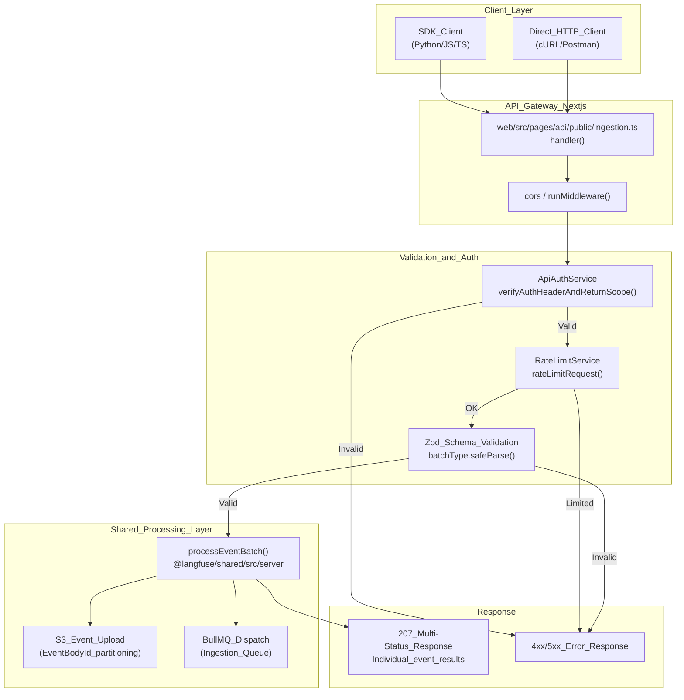
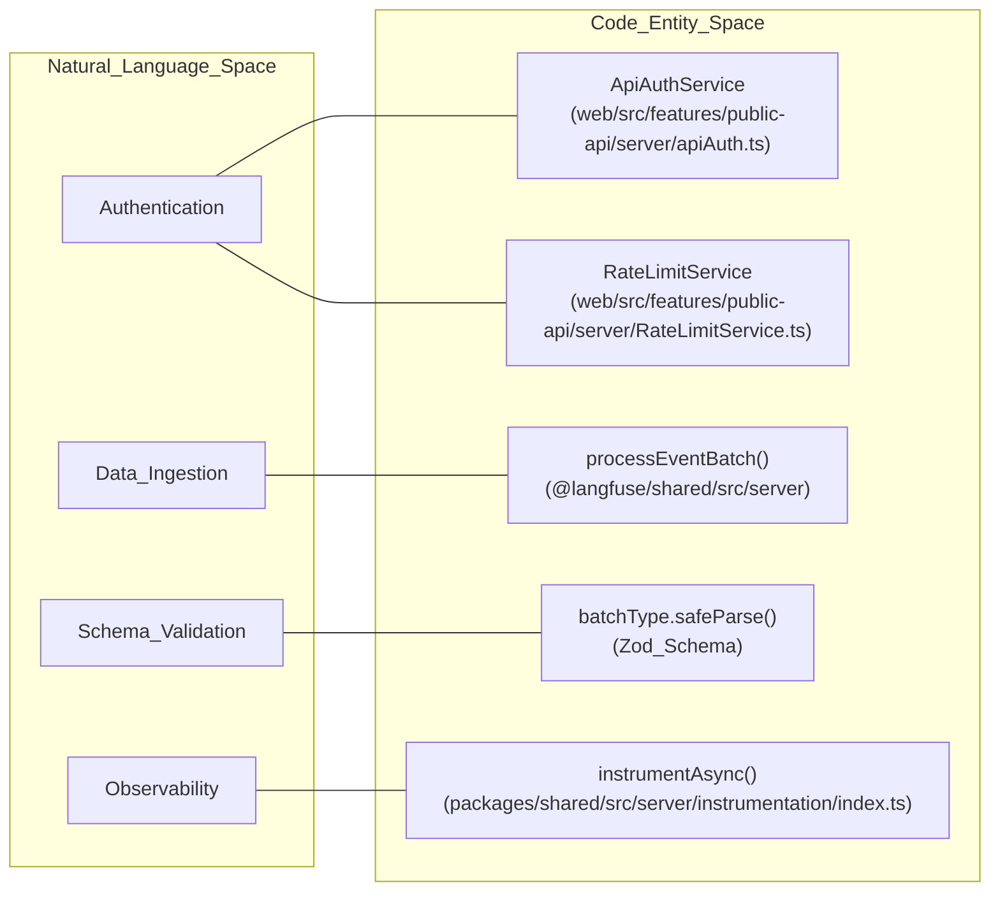
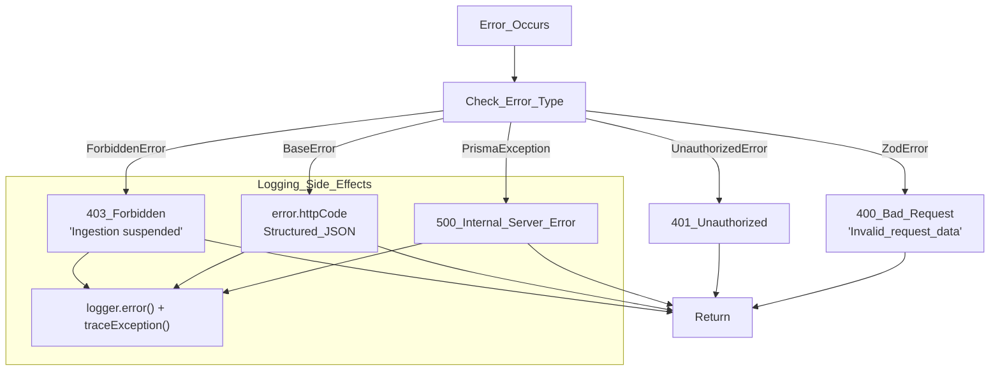

# Ingestion API 엔드포인트

<details>
<summary>관련 소스 파일</summary>

다음 파일들은 이 위키 페이지를 생성하는 컨텍스트로 사용되었습니다.

- [fern/apis/server/definition/trace.yml](fern/apis/server/definition/trace.yml)
- [packages/shared/src/server/auth/types.ts](packages/shared/src/server/auth/types.ts)
- [packages/shared/src/server/headerPropagation.ts](packages/shared/src/server/headerPropagation.ts)
- [packages/shared/src/server/instrumentation/index.ts](packages/shared/src/server/instrumentation/index.ts)
- [web/src/__tests__/server/unit/api-auth-span.servertest.ts](web/src/__tests__/server/unit/api-auth-span.servertest.ts)
- [web/src/__tests__/server/unit/langfuse-context-propagation.servertest.ts](web/src/__tests__/server/unit/langfuse-context-propagation.servertest.ts)
- [web/src/features/public-api/server/apiAuth.ts](web/src/features/public-api/server/apiAuth.ts)
- [web/src/features/public-api/server/createAuthedProjectAPIRoute.ts](web/src/features/public-api/server/createAuthedProjectAPIRoute.ts)
- [web/src/features/public-api/types/traces.ts](web/src/features/public-api/types/traces.ts)
- [web/src/pages/api/public/events.ts](web/src/pages/api/public/events.ts)
- [web/src/pages/api/public/generations.ts](web/src/pages/api/public/generations.ts)
- [web/src/pages/api/public/ingestion.ts](web/src/pages/api/public/ingestion.ts)
- [web/src/pages/api/public/observations/[observationId].ts](web/src/pages/api/public/observations/[observationId].ts)
- [web/src/pages/api/public/observations/index.ts](web/src/pages/api/public/observations/index.ts)
- [web/src/pages/api/public/spans.ts](web/src/pages/api/public/spans.ts)
- [web/src/pages/api/public/traces/[traceId].ts](web/src/pages/api/public/traces/[traceId].ts)
- [web/src/pages/api/public/traces/index.ts](web/src/pages/api/public/traces/index.ts)

</details>


이 페이지는 외부 클라이언트(SDK, 통합, OpenTelemetry instrumentation)로부터 tracing data를 수신하는 HTTP API endpoint를 문서화합니다. 이러한 endpoint는 Langfuse 데이터 수집 파이프라인의 진입점 역할을 하며, event를 비동기 처리 시스템으로 전달하기 전에 authentication, validation, rate limiting을 담당합니다.

event가 수신된 뒤의 내부 처리 로직에 대한 정보는 [Ingestion Overview (6.1)]() 및 [Event Processing & Validation (6.3)]()을 참조하세요.

## 개요

ingestion API는 data submission을 위한 여러 endpoint를 제공합니다. 기본 endpoint는 단일 request에서 다양한 event type(traces, spans, generations, scores)을 받는 batch-oriented route입니다.

| Endpoint | 목적 | Auth Method | Max Body Size |
|----------|---------|-------------|---------------|
| `POST /api/public/ingestion` | traces, spans, generations, scores를 위한 주요 batch ingestion endpoint | Basic Auth(Public Key + Secret Key) | 4.5 MB |
| `POST /api/public/traces` | Legacy single-trace ingestion(batch system으로 proxy) | Basic Auth | 4.5 MB |
| `POST /api/public/otel/v1/traces` | OpenTelemetry-specific ingestion endpoint | Basic Auth | 4.5 MB |

출처: [web/src/pages/api/public/ingestion.ts:26-32](), [web/src/pages/api/public/ingestion.ts:50-53](), [web/src/pages/api/public/traces/index.ts:36-41](), [fern/apis/server/definition/trace.yml:122-124]()

## 주요 Ingestion Endpoint 아키텍처

`/api/public/ingestion` endpoint는 비동기 처리를 위해 설계된 high-throughput entry point입니다. 데이터를 S3와 Redis-backed queue로 offload하기 전에 최소한의 동기 작업(validation 및 auth)을 수행합니다.

### Ingestion Request Flow



출처: [web/src/pages/api/public/ingestion.ts:50-139](), [web/src/pages/api/public/ingestion.ts:34-49](), [web/src/features/public-api/server/apiAuth.ts:90-102]()

## Request Format

### HTTP Method 및 Headers
ingestion endpoint는 `POST` request만 허용합니다. Authentication은 username이 `Public Key`, password가 `Secret Key`인 Basic Auth를 사용합니다.

`x-langfuse-` 또는 `x_langfuse_` prefix가 붙은 optional header는 capture되어 observability를 위해 `currentSpan?.setAttributes`를 통해 OpenTelemetry span attribute에 추가됩니다. 이 context는 `contextWithLangfuseProps`를 사용해 execution 전반에 propagate됩니다.

출처: [web/src/pages/api/public/ingestion.ts:73](), [web/src/pages/api/public/ingestion.ts:61-71](), [web/src/pages/api/public/ingestion.ts:96-102](), [packages/shared/src/server/headerPropagation.ts:17-49]()

### Request Body Schema
request body는 `batch` array와 optional `metadata`를 포함해야 합니다.

```typescript
{
  batch: Array<IngestionEvent>,
  metadata?: any
}
```

`batch`는 runtime에 Zod를 사용해 object array인지 검증됩니다. Array의 각 object는 `type` field를 기반으로 하는 discriminated union입니다.

출처: [web/src/pages/api/public/ingestion.ts:118-131](), [web/src/features/public-api/types/traces.ts:123-124]()

### Event Types
ingestion API는 단일 batch 내에서 여러 event type을 지원합니다.

| Type | 설명 | Entity Target |
|------|-------------|---------------|
| `trace-create` | trace를 생성하거나 update합니다 | `trace` |
| `span-create` | 새 span observation을 생성합니다 | `observation` |
| `span-update` | 기존 span을 update합니다 | `observation` |
| `generation-create` | generation(LLM call)을 생성합니다 | `observation` |
| `generation-update` | generation을 update합니다 | `observation` |
| `score-create` | 새 evaluation score를 생성합니다 | `score` |
| `event-create` | basic event observation을 생성합니다 | `observation` |
| `sdk-log` | debugging을 위한 SDK internal logging | N/A |

출처: [web/src/pages/api/public/traces/index.ts:19-24](), [web/src/pages/api/public/traces/index.ts:43-48]()

## Authentication 및 Rate Limiting

### API Key Verification
Authentication은 `ApiAuthService.verifyAuthHeaderAndReturnScope()`가 처리합니다. 이 service는 PostgreSQL(`prisma` 사용)에 대해 key를 검증하고 project가 usage threshold를 초과했는지 확인합니다. Service는 제공된 credential을 저장된 `fastHashedSecretKey` value와 비교하기 위해 `createShaHash`를 활용하며, 이 값은 `fetchApiKeyAndAddToRedis`를 통해 Redis에도 cache됩니다.

`authCheck.scope.isIngestionSuspended`가 true이면 API는 "Ingestion suspended: Usage threshold exceeded. Please upgrade your plan." 메시지와 함께 `403 Forbidden` error를 반환합니다.

출처: [web/src/pages/api/public/ingestion.ts:76-94](), [web/src/features/public-api/server/apiAuth.ts:90-117](), [web/src/features/public-api/server/apiAuth.ts:154-161](), [packages/shared/src/server/auth/types.ts:23-32]()

### Rate Limit Enforcement
Rate limit은 Redis를 backend로 사용하는 `RateLimitService`를 통해 확인됩니다. Service는 project별 "ingestion" specific limit을 추적합니다. Request가 rate-limited되면 `sendRestResponseIfLimited`를 통해 response를 반환합니다.

시스템은 rate limiting에 대해 "fails open"합니다. Redis check가 실패하면 `logger.error`를 통해 error가 log되지만, data availability를 보장하기 위해 request는 계속 진행될 수 있습니다.

출처: [web/src/pages/api/public/ingestion.ts:103-117](), [web/src/features/public-api/server/createAuthedProjectAPIRoute.ts:14]()

## Code Entity Association

이 다이어그램은 자연어 개념을 ingestion layer에서 사용되는 특정 Code Entity와 연결합니다.



출처: [web/src/pages/api/public/ingestion.ts:20-23](), [web/src/features/public-api/server/apiAuth.ts:33](), [packages/shared/src/server/instrumentation/index.ts:53]()

## Processing 및 Response

### 207 Multi-Status Response
단일 request에 event batch가 포함되므로 Langfuse는 HTTP `207 Multi-Status`를 사용합니다. Response body는 `processEventBatch`가 생성한 `successes`와 `errors`라는 두 array를 포함합니다.

출처: [web/src/pages/api/public/ingestion.ts:134-139]()

### Error Handling Flow



출처: [web/src/pages/api/public/ingestion.ts:141-175](), [packages/shared/src/server/instrumentation/index.ts:141-145]()

## 기술적 제약

- **Batch Size Limit**: Request는 API route의 Next.js `bodyParser` config를 통해 **4.5 MB**로 제한됩니다.
- **Async Workflow**: `processEventBatch` function은 long-term storage를 위해 각 event를 S3에 upload하고 async processing을 위해 event batch를 queue에 추가합니다.
- **Instrumentation**: 전체 ingestion handler는 모든 downstream operation(database call, Redis check)이 특정 project와 API key에 올바르게 attribution되도록 `opentelemetry.context.with(ctx, ...)`로 wrapping됩니다.

출처: [web/src/pages/api/public/ingestion.ts:26-32](), [web/src/pages/api/public/ingestion.ts:34-49](), [web/src/pages/api/public/ingestion.ts:102](), [packages/shared/src/server/instrumentation/index.ts:190-200]()

## Code Entity Reference

| Entity | Source File | 역할 |
|--------|-------------|------|
| `handler` | [web/src/pages/api/public/ingestion.ts:50]() | `/api/public/ingestion`의 entry point |
| `processEventBatch` | [web/src/pages/api/public/ingestion.ts:20]() | S3 upload와 queue dispatch를 orchestrate합니다 |
| `ApiAuthService` | [web/src/features/public-api/server/apiAuth.ts:33]() | Basic Auth와 project scope를 검증합니다 |
| `createAuthedProjectAPIRoute` | [web/src/features/public-api/server/createAuthedProjectAPIRoute.ts:30]() | project-authenticated API route(traces, observations)를 위한 factory |
| `instrumentAsync` | [packages/shared/src/server/instrumentation/index.ts:53]() | tracing을 위해 authentication과 ingestion logic을 wrapping합니다 |
| `contextWithLangfuseProps` | [packages/shared/src/server/headerPropagation.ts:17]() | Langfuse-specific header를 OpenTelemetry baggage로 propagate합니다 |

출처: [web/src/pages/api/public/ingestion.ts:1-175](), [web/src/features/public-api/server/apiAuth.ts:33-40](), [packages/shared/src/server/instrumentation/index.ts:53-93](), [web/src/features/public-api/server/createAuthedProjectAPIRoute.ts:78-130]()
