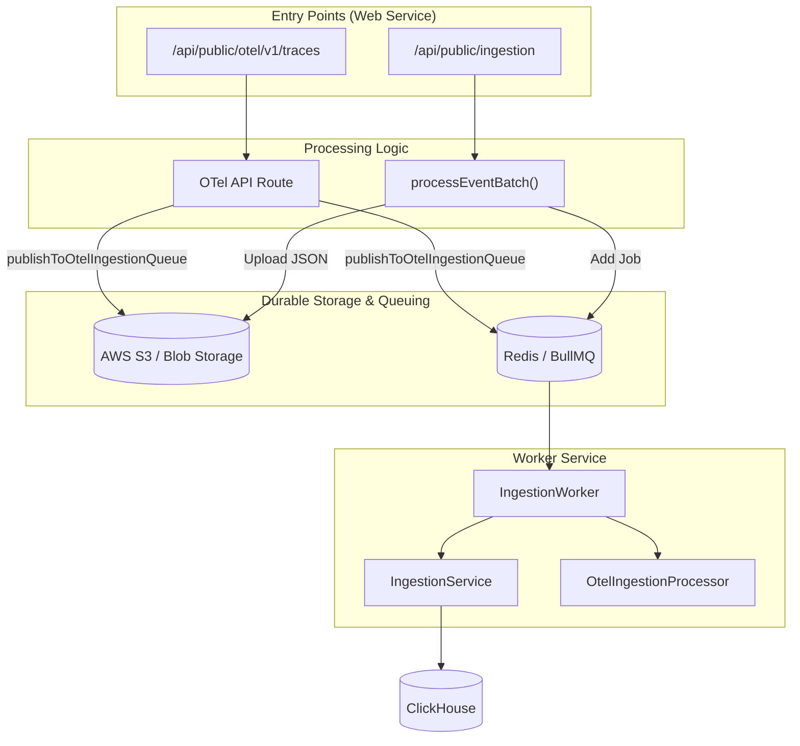
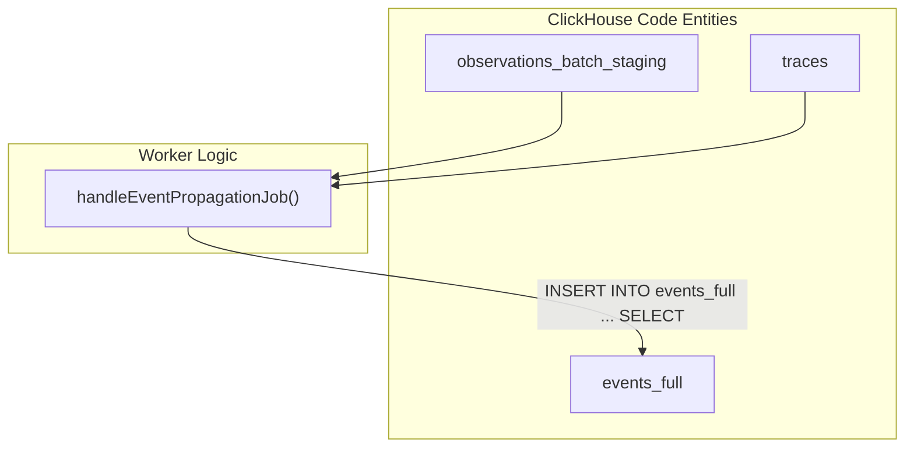

# Event Processing 및 Validation

관련 소스 파일

다음 파일들은 이 위키 페이지를 생성하는 컨텍스트로 사용되었습니다.

- [fern/apis/client/definition/score.yml](fern/apis/client/definition/score.yml)
- [fern/apis/server/definition/ingestion.yml](fern/apis/server/definition/ingestion.yml)
- [fern/apis/server/definition/legacy/score-v1.yml](fern/apis/server/definition/legacy/score-v1.yml)
- [packages/shared/AGENTS.md](packages/shared/AGENTS.md)
- [packages/shared/clickhouse/scripts/dev-tables.sh](packages/shared/clickhouse/scripts/dev-tables.sh)
- [packages/shared/src/domain/scores.ts](packages/shared/src/domain/scores.ts)
- [packages/shared/src/encryption/signature.ts](packages/shared/src/encryption/signature.ts)
- [packages/shared/src/features/scores/interfaces/api/shared.ts](packages/shared/src/features/scores/interfaces/api/shared.ts)
- [packages/shared/src/server/cache/index.ts](packages/shared/src/server/cache/index.ts)
- [packages/shared/src/server/cache/localCache.ts](packages/shared/src/server/cache/localCache.ts)
- [packages/shared/src/server/ingestion/modelMatch.ts](packages/shared/src/server/ingestion/modelMatch.ts)
- [packages/shared/src/server/ingestion/types.ts](packages/shared/src/server/ingestion/types.ts)
- [packages/shared/src/server/ingestion/validateAndInflateScore.ts](packages/shared/src/server/ingestion/validateAndInflateScore.ts)
- [packages/shared/src/server/queries/clickhouse-sql/clickhouse-filter.ts](packages/shared/src/server/queries/clickhouse-sql/clickhouse-filter.ts)
- [packages/shared/src/server/redis/eventPropagationQueue.ts](packages/shared/src/server/redis/eventPropagationQueue.ts)
- [packages/shared/src/server/repositories/definitions.ts](packages/shared/src/server/repositories/definitions.ts)
- [packages/shared/src/server/test-utils/tracing-factory.ts](packages/shared/src/server/test-utils/tracing-factory.ts)
- [packages/shared/src/utils/json.ts](packages/shared/src/utils/json.ts)
- [web/public/generated/api-client/openapi.yml](web/public/generated/api-client/openapi.yml)
- [web/src/__tests__/server/scores-api-v1.servertest.ts](web/src/__tests__/server/scores-api-v1.servertest.ts)
- [web/src/__tests__/server/validateAndInflateScore.servertest.ts](web/src/__tests__/server/validateAndInflateScore.servertest.ts)
- [worker/AGENTS.md](worker/AGENTS.md)
- [worker/src/__tests__/localCache.test.ts](worker/src/__tests__/localCache.test.ts)
- [worker/src/__tests__/modelMatch.test.ts](worker/src/__tests__/modelMatch.test.ts)
- [worker/src/__tests__/signature.test.ts](worker/src/__tests__/signature.test.ts)
- [worker/src/backgroundMigrations/backfillEventsHistoric.ts](worker/src/backgroundMigrations/backfillEventsHistoric.ts)
- [worker/src/backgroundMigrations/backfillEventsHistoricFromParts.ts](worker/src/backgroundMigrations/backfillEventsHistoricFromParts.ts)
- [worker/src/backgroundMigrations/backfillExperimentsHistoric.ts](worker/src/backgroundMigrations/backfillExperimentsHistoric.ts)
- [worker/src/features/entityChange/entityChangeWorker.ts](worker/src/features/entityChange/entityChangeWorker.ts)
- [worker/src/features/eventPropagation/handleEventPropagationJob.ts](worker/src/features/eventPropagation/handleEventPropagationJob.ts)
- [worker/src/features/eventPropagation/handleExperimentBackfill.ts](worker/src/features/eventPropagation/handleExperimentBackfill.ts)
- [worker/src/queues/entityChangeQueue.ts](worker/src/queues/entityChangeQueue.ts)
- [worker/src/services/IngestionService/index.ts](worker/src/services/IngestionService/index.ts)
- [worker/src/services/IngestionService/tests/IngestionService.integration.test.ts](worker/src/services/IngestionService/tests/IngestionService.integration.test.ts)
- [worker/src/services/IngestionService/tests/calculateTokenCost.unit.test.ts](worker/src/services/IngestionService/tests/calculateTokenCost.unit.test.ts)
- [worker/src/services/IngestionService/tests/utils.unit.test.ts](worker/src/services/IngestionService/tests/utils.unit.test.ts)
- [worker/src/services/IngestionService/utils.ts](worker/src/services/IngestionService/utils.ts)

## 목적과 범위

Event Processing & Validation은 Langfuse ingestion pipeline의 중요한 진입 단계입니다. Public API(REST 또는 OpenTelemetry)의 raw data를 storage와 asynchronous processing에 적합한 구조화되고 검증된 format으로 전환하는 작업을 처리합니다. 이 단계는 synchronous validation, S3를 durable buffer로 사용하는 deduplication, BullMQ queue로 event를 dispatch하는 일을 담당합니다.

이 페이지는 `processEventBatch` 구현, `IngestionService`의 event transformation logic, 그리고 staging table과 최신 ClickHouse events schema 사이의 data consistency를 보장하는 ingestion architecture를 자세히 설명합니다.

---

## Ingestion Flow 개요

ingestion process는 source에 따라 standard Ingestion API와 OpenTelemetry(OTEL) collector라는 두 가지 주요 경로를 따릅니다. 두 경로 모두 S3 storage와 BullMQ dispatch로 수렴합니다.

### High-Level Ingestion Architecture

**출처:** [packages/shared/src/server/ingestion/processEventBatch.ts:104-116](), [web/src/pages/api/public/otel/v1/traces/index.ts:33-38](), [packages/shared/src/server/otel/OtelIngestionProcessor.ts:183-219]()

---

## Event Validation 및 Deduplication

### processEventBatch
`packages/shared`의 `processEventBatch` function은 Public REST API에서 들어오는 event array를 처리하는 핵심 utility입니다. 몇 가지 중요한 단계를 수행합니다.

1.  **Schema Validation**: `createIngestionEventSchema`를 사용해 batch의 모든 event를 검증합니다. Invalid event는 `errors` array에 수집되어 `207 Multi-Status` response와 함께 반환됩니다. [packages/shared/src/server/ingestion/processEventBatch.ts:154-169]()
2.  **Authorization**: `isAuthorized`를 통해 API key scope가 event에서 참조하는 특정 project ID를 허용하는지 확인합니다. [packages/shared/src/server/ingestion/processEventBatch.ts:170-176]()
3.  **eventBodyId별 Grouping**: event는 `eventBodyId`(일반적으로 trace 또는 observation의 ID)별로 grouping됩니다. 이를 통해 Langfuse는 같은 entity에 대한 여러 update를 단일 S3 object와 queue job으로 batch 처리할 수 있으며, high-frequency update를 효과적으로 deduplicate합니다. [packages/shared/src/server/ingestion/processEventBatch.ts:192-209]()
4.  **S3 Upload**: Raw event는 `StorageService`를 사용해 S3에 upload됩니다. Path는 S3 partitioning을 최적화하기 위해 project ID와 timestamp(예: `yyyy/mm/dd/hh/mm`)를 사용해 구성됩니다. [packages/shared/src/server/ingestion/processEventBatch.ts:241-255]()
5.  **Queue Dispatch**: 성공적으로 upload한 뒤 job이 `IngestionQueue`에 추가됩니다. Job payload에는 S3 object의 `fileKey`가 포함되어 worker가 전체 event body를 retrieve할 수 있습니다. [packages/shared/src/server/ingestion/processEventBatch.ts:285-300]()

**출처:** [packages/shared/src/server/ingestion/processEventBatch.ts:104-116](), [packages/shared/src/server/ingestion/processEventBatch.ts:154-186](), [packages/shared/src/server/ingestion/processEventBatch.ts:192-215]()

### OpenTelemetry Processing
OpenTelemetry endpoint는 OTLP resource spans를 처리합니다. Standard API와 달리 변환 관리를 위해 `OtelIngestionProcessor`를 사용합니다.

-   **OtelIngestionProcessor**: 이 class는 OTel span을 Langfuse event로 변환하는 logic을 캡슐화합니다. Batch 내 deduplication을 위해 내부 `seenTraces` set을 유지합니다. [packages/shared/src/server/otel/OtelIngestionProcessor.ts:145-146]()
-   **Async Processing**: Processor는 standard ingestion logic을 미러링하는 `publishToOtelIngestionQueue`를 호출합니다. 이 함수는 raw `resourceSpans`를 S3에 upload하고 `OtelIngestionJob`을 `OtelIngestionQueue`에 추가합니다. [packages/shared/src/server/otel/OtelIngestionProcessor.ts:182-219]()

**출처:** [packages/shared/src/server/otel/OtelIngestionProcessor.ts:141-219](), [web/src/pages/api/public/otel/v1/traces/index.ts:172-187]()

---

## Ingestion Service 및 Entity Routing

Worker가 ingestion job을 가져오면 `IngestionService.mergeAndWrite`는 `eventType`을 기반으로 batch를 처리하는 방식을 결정합니다.

### Entity Processing Matrix

| Method | 역할 | Entity Type |
| :--- | :--- | :--- |
| `processTraceEventList` | trace update를 merge하고 `traces` table에 씁니다. | `trace` |
| `processObservationEventList` | spans/generations를 검증하고 `observations` table에 씁니다. | `observation` |
| `processScoreEventList` | scores(categorical/boolean)를 검증하고 inflate합니다. | `score` |
| `processDatasetRunItemEventList` | experiments용 dataset run items를 처리합니다. | `dataset_run_item` |

**출처:** [worker/src/services/IngestionService/index.ts:148-194]()

### Event Record Creation 및 Enrichment
`IngestionService`의 `createEventRecord` method는 loose `EventInput`(internal OTel format)을 strict `EventRecordInsertType`으로 변환하는 단일 지점입니다. Data를 enrich하기 위해 lookup을 수행합니다.

1.  **Prompt Lookup**: `PromptService`를 사용해 name과 version으로 prompt ID를 resolve합니다. [worker/src/services/IngestionService/index.ts:226-233]()
2.  **Model Enrichment**: `findModel`을 통해 제공된 model name을 match하여 cost와 token usage를 `tokenCountAsync`로 계산합니다. [worker/src/services/IngestionService/index.ts:235-245](), [packages/shared/src/server/ingestion/modelMatch.ts:44-50]()
3.  **Metadata Flattening**: 효율적인 ClickHouse query를 위해 nested JSON metadata를 path array(`metadata_names` 및 `metadata_values`)로 flatten합니다. [worker/src/services/IngestionService/index.ts:304-307]()

**출처:** [worker/src/services/IngestionService/index.ts:211-307](), [packages/shared/src/server/ingestion/modelMatch.ts:44-156]()

---

## Event Propagation System

Langfuse는 modern `events_full` table을 legacy staging table과 함께 유지하기 위해 dual-write 및 propagation strategy를 사용합니다.

### Batch Staging to Events Table
Observations는 처음에 `observations_batch_staging`에 기록됩니다. Background job인 `handleEventPropagationJob`은 주기적으로 이 data를 `events_full` table로 이동합니다.

- **Partitioning**: staging table은 `s3_first_seen_timestamp`를 기준으로 3분 partition을 사용합니다. [packages/shared/clickhouse/scripts/dev-tables.sh:121-122]()
- **Sequential Processing**: job은 data가 순서대로 이동되도록 Redis에서 `lastProcessedPartition`을 추적합니다. [worker/src/features/eventPropagation/handleEventPropagationJob.ts:22-29]()
- **Join Logic**: propagation query는 `observations_batch_staging`을 `traces` table과 join하여 trace-level attribute(`user_id`, `session_id`, `tags` 등)를 `events_full` record에 직접 denormalize합니다. [worker/src/features/eventPropagation/handleEventPropagationJob.ts:158-185]()

**출처:** [worker/src/features/eventPropagation/handleEventPropagationJob.ts:58-185](), [packages/shared/clickhouse/scripts/dev-tables.sh:81-130]()

### Experiment Backfill
특화된 process인 `handleExperimentBackfill`은 dataset run item이 events system으로 propagate되는 것을 처리합니다. 관련 observations를 fetch하고 experiment metadata(dataset run name, description 등)로 enrich한 뒤 events table에 씁니다. [worker/src/features/eventPropagation/handleExperimentBackfill.ts:110-179]()

**출처:** [worker/src/features/eventPropagation/handleExperimentBackfill.ts:19-104]()

---

## Data Transformation Logic

### Usage Normalization
`UsageCostSchema`는 ClickHouse의 string-encoded Int64/Decimal value를 application layer를 위한 numeric format으로 다시 변환합니다. [packages/shared/src/server/repositories/definitions.ts:13-31]()

### Token 및 Cost Calculation
`IngestionService`에는 SDK가 cost를 제공하지 않은 경우 cost를 계산하는 logic이 포함됩니다. 
- **Model Matching**: `findModel`은 Redis/Postgres에서 lookup을 수행해 model definition과 관련 pricing tier를 찾습니다. [packages/shared/src/server/ingestion/modelMatch.ts:44-103]()
- **Local Caching**: Database load를 최소화하기 위해 model match는 짧은 TTL로 `modelMatchLocalCache`에 cache됩니다. [packages/shared/src/server/ingestion/modelMatch.ts:31-42]()

**출처:** [worker/src/services/IngestionService/index.ts:235-245](), [packages/shared/src/server/ingestion/modelMatch.ts:31-156]()
