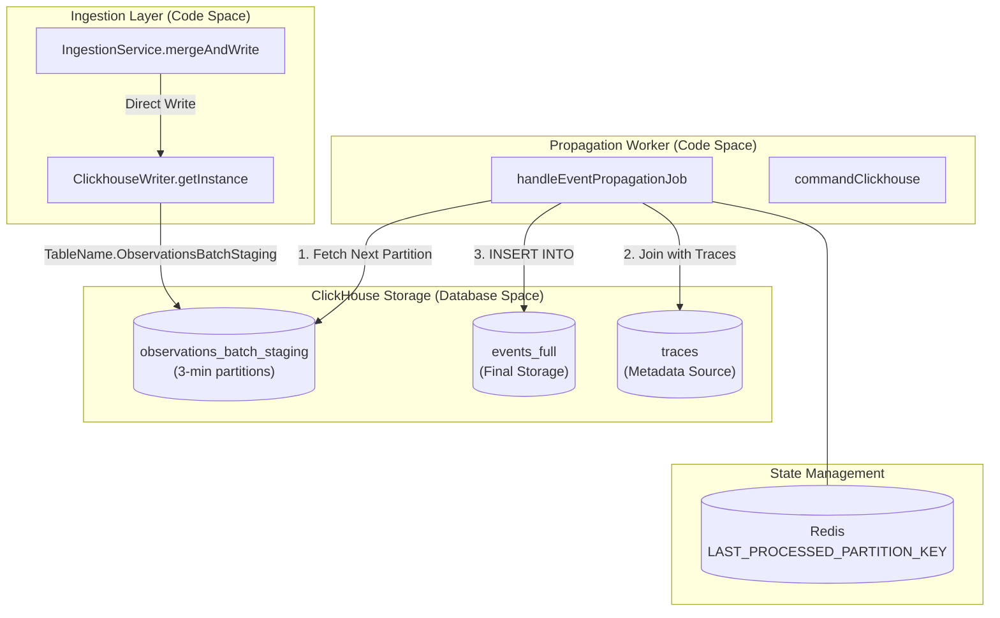
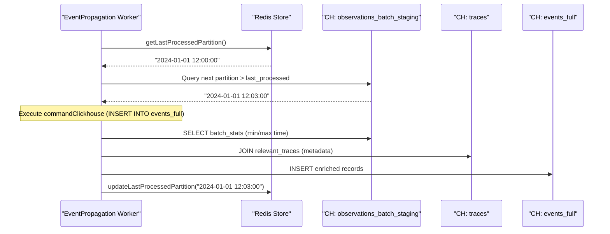

# Event Propagation System

관련 소스 파일

다음 파일들은 이 위키 페이지를 생성하는 컨텍스트로 사용되었습니다.

- [fern/apis/server/definition/ingestion.yml](fern/apis/server/definition/ingestion.yml)
- [packages/shared/clickhouse/scripts/dev-tables.sh](packages/shared/clickhouse/scripts/dev-tables.sh)
- [packages/shared/src/domain/observations.ts](packages/shared/src/domain/observations.ts)
- [packages/shared/src/eventsTable.ts](packages/shared/src/eventsTable.ts)
- [packages/shared/src/server/clickhouse/schema.ts](packages/shared/src/server/clickhouse/schema.ts)
- [packages/shared/src/server/ingestion/types.ts](packages/shared/src/server/ingestion/types.ts)
- [packages/shared/src/server/queries/clickhouse-sql/clickhouse-filter.ts](packages/shared/src/server/queries/clickhouse-sql/clickhouse-filter.ts)
- [packages/shared/src/server/queries/clickhouse-sql/event-query-builder.ts](packages/shared/src/server/queries/clickhouse-sql/event-query-builder.ts)
- [packages/shared/src/server/queries/clickhouse-sql/query-fragments.ts](packages/shared/src/server/queries/clickhouse-sql/query-fragments.ts)
- [packages/shared/src/server/queries/index.ts](packages/shared/src/server/queries/index.ts)
- [packages/shared/src/server/queries/public-api-filter-builder.ts](packages/shared/src/server/queries/public-api-filter-builder.ts)
- [packages/shared/src/server/redis/eventPropagationQueue.ts](packages/shared/src/server/redis/eventPropagationQueue.ts)
- [packages/shared/src/server/repositories/definitions.ts](packages/shared/src/server/repositories/definitions.ts)
- [packages/shared/src/server/repositories/events.ts](packages/shared/src/server/repositories/events.ts)
- [packages/shared/src/server/repositories/observations_converters.ts](packages/shared/src/server/repositories/observations_converters.ts)
- [packages/shared/src/server/tableMappings/mapEventsTable.ts](packages/shared/src/server/tableMappings/mapEventsTable.ts)
- [packages/shared/src/server/test-utils/tracing-factory.ts](packages/shared/src/server/test-utils/tracing-factory.ts)
- [packages/shared/src/utils/json.ts](packages/shared/src/utils/json.ts)
- [web/src/__tests__/server/observations-api-v2.servertest.ts](web/src/__tests__/server/observations-api-v2.servertest.ts)
- [web/src/__tests__/server/repositories/event-repository.servertest.ts](web/src/__tests__/server/repositories/event-repository.servertest.ts)
- [web/src/__tests__/server/unit/observations-converters.servertest.ts](web/src/__tests__/server/unit/observations-converters.servertest.ts)
- [web/src/components/table/peek/hooks/usePeekData.ts](web/src/components/table/peek/hooks/usePeekData.ts)
- [web/src/features/events/config/filter-config.ts](web/src/features/events/config/filter-config.ts)
- [web/src/features/events/hooks/useEventsFilterOptions.ts](web/src/features/events/hooks/useEventsFilterOptions.ts)
- [web/src/features/events/hooks/useEventsTableData.ts](web/src/features/events/hooks/useEventsTableData.ts)
- [web/src/features/events/hooks/useEventsTraceData.ts](web/src/features/events/hooks/useEventsTraceData.ts)
- [web/src/features/events/lib/eventsToTraceAdapter.clienttest.ts](web/src/features/events/lib/eventsToTraceAdapter.clienttest.ts)
- [web/src/features/events/lib/eventsToTraceAdapter.ts](web/src/features/events/lib/eventsToTraceAdapter.ts)
- [web/src/features/events/server/eventsRouter.ts](web/src/features/events/server/eventsRouter.ts)
- [web/src/features/events/server/eventsService.ts](web/src/features/events/server/eventsService.ts)
- [web/src/features/public-api/types/observations.ts](web/src/features/public-api/types/observations.ts)
- [web/src/hooks/useParsedObservation.ts](web/src/hooks/useParsedObservation.ts)
- [web/src/utils/clientSideDomainTypes.ts](web/src/utils/clientSideDomainTypes.ts)
- [worker/src/__tests__/inMemoryFilterService.test.ts](worker/src/__tests__/inMemoryFilterService.test.ts)
- [worker/src/backgroundMigrations/IBackgroundMigration.ts](worker/src/backgroundMigrations/IBackgroundMigration.ts)
- [worker/src/backgroundMigrations/addGenerationsCostBackfill.ts](worker/src/backgroundMigrations/addGenerationsCostBackfill.ts)
- [worker/src/backgroundMigrations/backfillEventsHistoric.ts](worker/src/backgroundMigrations/backfillEventsHistoric.ts)
- [worker/src/backgroundMigrations/backfillEventsHistoricFromParts.ts](worker/src/backgroundMigrations/backfillEventsHistoricFromParts.ts)
- [worker/src/backgroundMigrations/backfillExperimentsHistoric.ts](worker/src/backgroundMigrations/backfillExperimentsHistoric.ts)
- [worker/src/backgroundMigrations/migrateObservationsFromPostgresToClickhouse.ts](worker/src/backgroundMigrations/migrateObservationsFromPostgresToClickhouse.ts)
- [worker/src/backgroundMigrations/migrateScoresFromPostgresToClickhouse.ts](worker/src/backgroundMigrations/migrateScoresFromPostgresToClickhouse.ts)
- [worker/src/backgroundMigrations/migrateTracesFromPostgresToClickhouse.ts](worker/src/backgroundMigrations/migrateTracesFromPostgresToClickhouse.ts)
- [worker/src/ee/cloudUsageMetering/constants.ts](worker/src/ee/cloudUsageMetering/constants.ts)
- [worker/src/features/eventPropagation/handleEventPropagationJob.ts](worker/src/features/eventPropagation/handleEventPropagationJob.ts)
- [worker/src/features/eventPropagation/handleExperimentBackfill.ts](worker/src/features/eventPropagation/handleExperimentBackfill.ts)
- [worker/src/services/IngestionService/index.ts](worker/src/services/IngestionService/index.ts)
- [worker/src/services/IngestionService/tests/IngestionService.integration.test.ts](worker/src/services/IngestionService/tests/IngestionService.integration.test.ts)
- [worker/src/services/IngestionService/tests/calculateTokenCost.unit.test.ts](worker/src/services/IngestionService/tests/calculateTokenCost.unit.test.ts)
- [worker/src/services/IngestionService/tests/utils.unit.test.ts](worker/src/services/IngestionService/tests/utils.unit.test.ts)
- [worker/src/services/IngestionService/utils.ts](worker/src/services/IngestionService/utils.ts)

## 목적과 범위

Event Propagation System은 초기 ingestion부터 validation, storage, ClickHouse events table의 최종 persistence까지 observability event의 흐름을 관리합니다. 이 시스템은 SDK version compatibility에 따라 event를 서로 다른 path로 route하는 dual-write architecture를 구현하고, 대용량 data consistency를 위해 staging-to-events propagation mechanism을 활용합니다.

V4 Beta events-first architecture에서 trace는 더 이상 static metadata에 그치지 않습니다. `events_full` table에 저장된 observations로부터 synthetic하게 derive될 수 있습니다.

이 문서에서 다루는 내용:
- API ingestion에서 최종 storage까지의 event flow.
- Dual write path architecture(staging tables vs. direct writes).
- `observations_batch_staging` mechanism과 `EventPropagationQueue`.
- ClickHouse propagation logic 및 partition-based processing.
- events-first architecture의 synthetic trace derivation.

출처: [worker/src/features/eventPropagation/handleEventPropagationJob.ts:58-71](), [packages/shared/src/server/repositories/definitions.ts:107-111]()

## 아키텍처 개요

다음 다이어그램은 ingestion의 자연어 개념을 propagation을 담당하는 특정 code entity와 연결합니다.

### Ingestion to Storage Data Flow

출처: [packages/shared/clickhouse/scripts/dev-tables.sh:81-130](), [worker/src/features/eventPropagation/handleEventPropagationJob.ts:15-57](), [worker/src/services/IngestionService/index.ts:149-195]()

## Dual Write Architecture

Langfuse는 legacy observation structure에서 unified immutable events schema로 전환하기 위해 dual-write pattern을 활용합니다.

1.  **Direct Path**: SDK requirement가 충족되면 event를 `events_full` table에 직접 쓸 수 있습니다. 이는 `mergeAndWrite`의 `forwardToEventsTable` flag로 제어됩니다 [worker/src/services/IngestionService/index.ts:149-156]().
2.  **Staging Path**: Event는 `ClickhouseWriter`를 통해 ClickHouse의 `observations_batch_staging` table에 기록됩니다. 이 table은 buffer 역할을 하여 즉각적인 heavy join 없이 high-throughput ingestion을 가능하게 합니다 [packages/shared/clickhouse/scripts/dev-tables.sh:81-130]().

### Staging Table Schema(`observations_batch_staging`)
Staging table은 다음 특성을 가진 temporary storage로 설계되었습니다.
- **Partitioning**: `toStartOfInterval(s3_first_seen_timestamp, INTERVAL 3 MINUTE)`를 사용해 `s3_first_seen_timestamp` 기준 3분 interval로 partition됩니다 [packages/shared/clickhouse/scripts/dev-tables.sh:121-121]().
- **TTL**: `ttl_only_drop_parts = 1`과 함께 `TTL s3_first_seen_timestamp + INTERVAL 12 HOUR`로 data가 12시간 후 자동 expire되어 complete partition만 drop되도록 보장합니다 [packages/shared/clickhouse/scripts/dev-tables.sh:129-130]().
- **Engine**: `ReplacingMergeTree(event_ts, is_deleted)`는 staging phase 동안 deduplication을 처리합니다 [packages/shared/clickhouse/scripts/dev-tables.sh:120-120]().

출처: [packages/shared/clickhouse/scripts/dev-tables.sh:81-130]()

## Propagation Mechanism

`handleEventPropagationJob`은 staging에서 최종 `events_full` table로 data를 이동하는 역할을 담당합니다.

### Sequential Partition Processing
Consistency를 보장하고 data 누락을 피하기 위해 시스템은 Redis에 저장된 cursor를 사용해 partition을 sequentially 처리합니다.

1.  **Cursor Retrieval**: Worker는 Redis에서 `LAST_PROCESSED_PARTITION_KEY`(`"langfuse:event-propagation:last-processed-partition"`)를 가져옵니다 [worker/src/features/eventPropagation/handleEventPropagationJob.ts:15-29]().
2.  **Partition Discovery**: `observations_batch_staging`에서 active 상태이고 configured delay `LANGFUSE_EXPERIMENT_EVENT_PROPAGATION_PARTITION_DELAY_MINUTES`보다 오래된 다음 available partition을 찾기 위해 `system.parts`를 query합니다 [worker/src/features/eventPropagation/handleEventPropagationJob.ts:94-109]().
3.  **Data Propagation**: 복잡한 `INSERT INTO events_full` query는 staging data를 `traces` table과 join하여 trace-level metadata(user IDs, session IDs, tags, releases)로 event를 enrich합니다 [worker/src/features/eventPropagation/handleEventPropagationJob.ts:185-201]().
4.  **State Update**: 성공적으로 완료되면 `updateLastProcessedPartition`을 통해 Redis cursor가 처리된 partition timestamp로 update됩니다 [worker/src/features/eventPropagation/handleEventPropagationJob.ts:35-50]().

### Event Enrichment Logic
Propagation 중 시스템은 `traces` table과 "Point-in-Time" join을 수행합니다. Join scope는 다음 방식으로 제한됩니다.
- Observation의 `start_time`에 상대적인 time window 안의 trace를 filtering합니다 [worker/src/features/eventPropagation/handleEventPropagationJob.ts:142-148]().
- Unbounded scan을 방지하기 위해 activity를 최근 7일로 제한하는 fallback condition을 사용합니다 [worker/src/features/eventPropagation/handleEventPropagationJob.ts:178-178]().
- 최신 version의 trace metadata만 propagate되도록 `event_ts DESC`로 정렬된 `LIMIT 1 BY t.project_id, t.id`를 사용합니다 [worker/src/features/eventPropagation/handleEventPropagationJob.ts:181-182]().

출처: [worker/src/features/eventPropagation/handleEventPropagationJob.ts:74-201]()

## V4 Beta: Events-First Architecture

Updated architecture에서는 `events_full` table이 primary source of truth가 됩니다. 이를 통해 dedicated trace record가 없는 경우 observation event에서 trace data가 직접 derive되는 **synthetic traces**가 가능해집니다.

### Synthetic Trace Derivation
- **Events Service**: `eventsService.ts`는 events table을 직접 query하는 `getEventList` 및 `getEventCount` 같은 function을 제공합니다 [web/src/features/events/server/eventsService.ts:97-116]().
- **Trace Reconstruction**: `getObservationsForTraceFromEventsTable`은 개별 event로부터 trace hierarchy를 reconstruct하는 데 사용됩니다 [web/src/features/events/server/eventsRouter.ts:228-232]().
- **Experiment Backfill**: `handleExperimentBackfill` job은 대응되는 event record가 없는 dataset run item을 식별하고, 관련 observations와 traces를 fetch한 뒤 events system에 insert하여 backfill을 수행합니다 [worker/src/features/eventPropagation/handleExperimentBackfill.ts:110-169]().

출처: [web/src/features/events/server/eventsService.ts:97-116](), [packages/shared/clickhouse/scripts/dev-tables.sh:135-210](), [worker/src/features/eventPropagation/handleExperimentBackfill.ts:19-93](), [web/src/features/events/server/eventsRouter.ts:228-232]()

## Event Consistency Guarantees

시스템은 다음 parameter를 통해 **eventual consistency**를 제공합니다.

| Component | Guarantee / Behavior |
| :--- | :--- |
| **Ingestion Delay** | `PARTITION_DELAY_MINUTES`를 통해 configure됩니다 [worker/src/features/eventPropagation/handleEventPropagationJob.ts:100-100](). |
| **Ordering** | Redis cursor를 통한 sequential processing으로 보장됩니다 [worker/src/features/eventPropagation/handleEventPropagationJob.ts:102-102](). |
| **Deduplication** | staging의 `ReplacingMergeTree`가 처리합니다 [packages/shared/clickhouse/scripts/dev-tables.sh:120-120](). |
| **Trace Metadata** | 최대 propagation interval은 7일입니다. 이보다 오래된 metadata는 join되지 않을 수 있습니다 [worker/src/features/eventPropagation/handleEventPropagationJob.ts:178-178](). |

### Propagation Sequence Diagram

출처: [worker/src/features/eventPropagation/handleEventPropagationJob.ts:22-50](), [worker/src/features/eventPropagation/handleEventPropagationJob.ts:141-201]()

## 구현 세부사항

### 주요 Class 및 Function

- **`handleEventPropagationJob`**: ClickHouse migration logic을 실행하는 BullMQ processor입니다 [worker/src/features/eventPropagation/handleEventPropagationJob.ts:58-60]().
- **`IngestionService.mergeAndWrite`**: 모든 ingested event의 entry point로, staging 또는 legacy table 중 어디에 쓸지 결정합니다 [worker/src/services/IngestionService/index.ts:149-195]().
- **`EventsQueryBuilder`**: `events_full` table에 대한 복잡한 SQL query를 구성하는 utility로 field selection, filtering, joining을 지원합니다 [packages/shared/src/server/queries/clickhouse-sql/event-query-builder.ts:51-146]().
- **`enrichObservationsWithModelData`**: UI 또는 API 표시를 위해 raw ClickHouse event record를 model pricing 및 usage metadata로 enrich합니다 [packages/shared/src/server/repositories/events.ts:125-180]().

### Background Migrations
Historical data를 위해 시스템은 `ConcurrentQueryManager`를 사용해 서로 다른 data chunk에 걸친 parallel ClickHouse `INSERT INTO ... SELECT` operation을 관리하는 `BackfillEventsHistoric` 같은 background migration script를 포함합니다 [worker/src/backgroundMigrations/backfillEventsHistoric.ts:72-161](). 이러한 migration은 Prisma를 통해 `background_migrations` table에서 progress를 추적합니다 [worker/src/backgroundMigrations/backfillEventsHistoric.ts:182-212]().

출처: [worker/src/features/eventPropagation/handleEventPropagationJob.ts:58-71](), [worker/src/backgroundMigrations/backfillEventsHistoric.ts:72-212](), [worker/src/services/IngestionService/index.ts:149-195](), [packages/shared/src/server/queries/clickhouse-sql/event-query-builder.ts:51-146](), [packages/shared/src/server/repositories/events.ts:125-180]()
