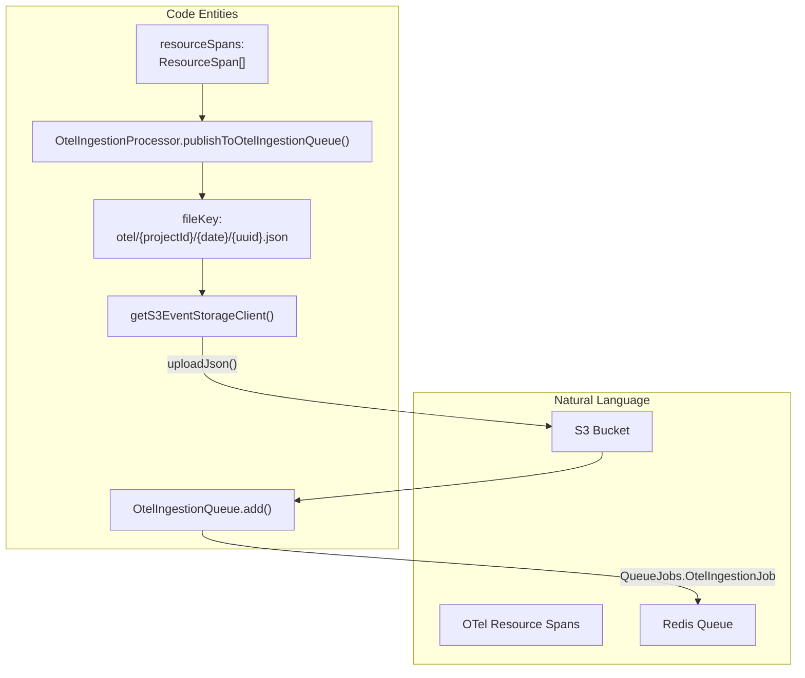

# OpenTelemetry Ingestion

관련 소스 파일

다음 파일들은 이 위키 페이지를 생성하는 컨텍스트로 사용되었습니다.

- [packages/shared/prisma/migrations/20241029130802_prices_drop_excess_index/migration.sql](packages/shared/prisma/migrations/20241029130802_prices_drop_excess_index/migration.sql)
- [packages/shared/src/server/ingestion/extractToolsBackend.ts](packages/shared/src/server/ingestion/extractToolsBackend.ts)
- [packages/shared/src/server/ingestion/processEventBatch.ts](packages/shared/src/server/ingestion/processEventBatch.ts)
- [packages/shared/src/server/otel/ObservationTypeMapper.ts](packages/shared/src/server/otel/ObservationTypeMapper.ts)
- [packages/shared/src/server/otel/OtelIngestionProcessor.ts](packages/shared/src/server/otel/OtelIngestionProcessor.ts)
- [packages/shared/src/server/redis/otelIngestionQueue.ts](packages/shared/src/server/redis/otelIngestionQueue.ts)
- [packages/shared/src/utils/chatml/adapters/aisdk.ts](packages/shared/src/utils/chatml/adapters/aisdk.ts)
- [packages/shared/src/utils/chatml/adapters/gemini.ts](packages/shared/src/utils/chatml/adapters/gemini.ts)
- [packages/shared/src/utils/chatml/adapters/langgraph.ts](packages/shared/src/utils/chatml/adapters/langgraph.ts)
- [packages/shared/src/utils/chatml/adapters/microsoft-agent.ts](packages/shared/src/utils/chatml/adapters/microsoft-agent.ts)
- [packages/shared/src/utils/chatml/adapters/openai.ts](packages/shared/src/utils/chatml/adapters/openai.ts)
- [packages/shared/src/utils/chatml/adapters/pydantic-ai.ts](packages/shared/src/utils/chatml/adapters/pydantic-ai.ts)
- [packages/shared/src/utils/chatml/helpers.ts](packages/shared/src/utils/chatml/helpers.ts)
- [web/src/__tests__/server/api/otel/otelMapping.servertest.ts](web/src/__tests__/server/api/otel/otelMapping.servertest.ts)
- [web/src/features/models/components/pricing-tiers/TierPrefillButtons.tsx](web/src/features/models/components/pricing-tiers/TierPrefillButtons.tsx)
- [web/src/pages/api/public/otel/v1/traces/index.ts](web/src/pages/api/public/otel/v1/traces/index.ts)
- [web/src/utils/chatml/extractTools.ts](web/src/utils/chatml/extractTools.ts)
- [worker/src/__tests__/extractToolsBackend.test.ts](worker/src/__tests__/extractToolsBackend.test.ts)
- [worker/src/constants/default-model-prices.json](worker/src/constants/default-model-prices.json)
- [worker/src/queues/__tests__/otelDirectEventWrite.test.ts](worker/src/queues/__tests__/otelDirectEventWrite.test.ts)
- [worker/src/queues/__tests__/otelToObservationForEval.test.ts](worker/src/queues/__tests__/otelToObservationForEval.test.ts)
- [worker/src/queues/otelIngestionQueue.ts](worker/src/queues/otelIngestionQueue.ts)
- [worker/src/queues/shardedQueueRegistry.ts](worker/src/queues/shardedQueueRegistry.ts)
- [worker/src/scripts/upsertDefaultModelPrices.ts](worker/src/scripts/upsertDefaultModelPrices.ts)

이 문서는 Langfuse의 OpenTelemetry(OTel) ingestion pipeline을 설명합니다. 이 pipeline은 OpenTelemetry로 instrument된 모든 애플리케이션에서 traces와 observations를 capture할 수 있게 합니다. OTel ingestion system은 semantic information을 보존하고 여러 instrumentation library를 지원하면서 OpenTelemetry span을 Langfuse observation으로 변환합니다.

SDK-native events를 처리하는 일반 데이터 수집 파이프라인에 대한 정보는 [Ingestion Overview](6.1)를 참조하세요. Observation type system에 대한 자세한 내용은 [Traces & Observations](9.1)를 참조하세요.

---

## 아키텍처 개요

OpenTelemetry ingestion pipeline은 두 단계 architecture를 따릅니다. 먼저 API endpoint가 raw OTel data를 수신하고 저장한 뒤, asynchronous worker processing이 span을 Langfuse observation으로 변환합니다.

### End-to-End Flow

```mermaid
graph TB
    subgraph "Natural Language Space"
    Client["OTel Instrumented App"]
    IngestionAPI["OTel Ingestion Endpoint"]
    Storage["Blob Storage (S3)"]
    WorkerNode["Background Worker"]
    end

    subgraph "Code Entity Space"
    OtelClient["OpenTelemetry Client<br/>(Langfuse SDK, Vercel AI SDK, etc.)"]
    
    APIEndpoint["POST /api/public/otel/v1/traces<br/>(web/src/pages/api/public/otel/v1/traces/index.ts)"]
    AuthCheck["createAuthedProjectAPIRoute()"]
    S3Upload["OtelIngestionProcessor.publishToOtelIngestionQueue()"]
    QueueAdd["OtelIngestionQueue.add()"]
    
    Worker["otelIngestionQueueProcessor<br/>(worker/src/queues/otelIngestionQueue.ts)"]
    Download["getS3EventStorageClient().download()"]
    Processor["OtelIngestionProcessor<br/>(packages/shared/src/server/otel/OtelIngestionProcessor.ts)"]
    ProcessMethod["processToEvent()"]
    TypeMapper["ObservationTypeMapperRegistry<br/>.mapToObservationType()"]
    
    IngestionService["IngestionService.createEventRecord()"]
    EventBatch["processEventBatch()"]
    
    ClickHouse[("ClickHouse<br/>observations, traces")]
    
    OtelClient -->|"POST protobuf/json"| APIEndpoint
    APIEndpoint --> AuthCheck
    AuthCheck --> S3Upload
    S3Upload --> QueueAdd
    
    QueueAdd --> Worker
    Worker --> Download
    Download --> Processor
    Processor --> ProcessMethod
    ProcessMethod --> TypeMapper
    
    ProcessMethod --> EventBatch
    EventBatch --> IngestionService
    
    IngestionService --> ClickHouse
    end
```

**출처**: [web/src/pages/api/public/otel/v1/traces/index.ts:32-174](), [packages/shared/src/server/otel/OtelIngestionProcessor.ts:183-220](), [worker/src/queues/otelIngestionQueue.ts:193-204]()

---

## API Endpoint

`/api/public/otel/v1/traces`의 OTel traces endpoint는 Protobuf와 JSON format 모두로 OpenTelemetry trace data를 받습니다.

### Request Processing

[web/src/pages/api/public/otel/v1/traces/index.ts:32-174]()의 endpoint는 다음 단계로 request를 처리합니다.

| Step | Function/Method | 설명 |
|------|----------------|-------------|
| **Authentication** | `createAuthedProjectAPIRoute` | API key를 validate하고 `authCheck` scope를 반환합니다 [web/src/pages/api/public/otel/v1/traces/index.ts:33-38]() |
| **Ingestion Suspension Check** | Scope validation | `authCheck.scope.isIngestionSuspended`가 true이면 block합니다 [web/src/pages/api/public/otel/v1/traces/index.ts:40-44]() |
| **Project Marking** | `markProjectAsOtelUser()` | Analytics를 위해 project를 OTel user로 기록합니다 [web/src/pages/api/public/otel/v1/traces/index.ts:47-47]() |
| **Body Reading** | Raw body promise | Raw request body를 Buffer로 읽습니다 [web/src/pages/api/public/otel/v1/traces/index.ts:51-56]() |
| **Decompression** | `gunzip()` | `content-encoding: gzip` header가 있으면 body를 gunzip합니다 [web/src/pages/api/public/otel/v1/traces/index.ts:63-75]() |
| **Format Detection** | Content-type check | `content-type` header에서 protobuf인지 JSON인지 결정합니다 [web/src/pages/api/public/otel/v1/traces/index.ts:78-88]() |
| **Protobuf Parsing** | `ExportTraceServiceRequest.decode()` | generated OTLP proto definition을 사용해 binary protobuf를 decode합니다 [web/src/pages/api/public/otel/v1/traces/index.ts:91-98]() |
| **JSON Parsing** | `JSON.parse(body.toString())` | JSON을 parse하여 `resourceSpans`를 extract합니다 [web/src/pages/api/public/otel/v1/traces/index.ts:106-108]() |
| **SDK Header Extraction** | `getLangfuseHeader()` | `x-langfuse-sdk-name`, `x-langfuse-sdk-version`, `x-langfuse-ingestion-version`를 extract합니다 [web/src/pages/api/public/otel/v1/traces/index.ts:136-144]() |
| **S3 Upload & Queue** | `processor.publishToOtelIngestionQueue()` | Raw data를 S3에 upload하고 `OtelIngestionJob`을 enqueue합니다 [web/src/pages/api/public/otel/v1/traces/index.ts:187-187]() |

**출처**: [web/src/pages/api/public/otel/v1/traces/index.ts:32-190]()

### S3 Upload 및 Queue Job Creation

API endpoint는 span을 synchronously 처리하지 않습니다. 대신 raw `resourceSpans` data를 S3에 upload하고 `OtelIngestionQueue`에 job을 생성합니다.

SDK header(`sdkName`, `sdkVersion`, `ingestionVersion`)는 job payload에 포함되어 worker가 span을 다시 parse하지 않고 write path decision을 내릴 수 있게 합니다 [packages/shared/src/server/otel/OtelIngestionProcessor.ts:200-217](). Queue의 sharding key는 `projectId`와 `fileKey`에서 derive됩니다 [packages/shared/src/server/otel/OtelIngestionProcessor.ts:193-194]().

**출처**: [packages/shared/src/server/otel/OtelIngestionProcessor.ts:183-220](), [web/src/pages/api/public/otel/v1/traces/index.ts:162-187]()

---

## OtelIngestionProcessor

`OtelIngestionProcessor` class는 OpenTelemetry `ResourceSpan` object를 Langfuse `IngestionEventType` object로 변환하는 핵심 component입니다.

### Class Structure

[packages/shared/src/server/otel/OtelIngestionProcessor.ts:142-169]()의 `OtelIngestionProcessor` class는 다음 구조를 가집니다.

| Property/Method | Type | 목적 |
|----------------|------|---------|
| `seenTraces` | `Set<string>` | 중복 trace-create event를 방지하기 위한 trace ID cache [packages/shared/src/server/otel/OtelIngestionProcessor.ts:146-146]() |
| `projectId` | `string` | ingestion을 위한 Project ID [packages/shared/src/server/otel/OtelIngestionProcessor.ts:153-153]() |
| `processToEvent()` | `sync` | enriched event를 생성하는 main conversion method [packages/shared/src/server/otel/OtelIngestionProcessor.ts:227-227]() |
| `publishToOtelIngestionQueue()` | `async` | raw resourceSpans를 S3에 upload하고 job을 enqueue합니다 [packages/shared/src/server/otel/OtelIngestionProcessor.ts:183-183]() |

**출처**: [packages/shared/src/server/otel/OtelIngestionProcessor.ts:142-169]()

---

## Observation Type Mapping

`ObservationTypeMapperRegistry`는 OpenTelemetry span attribute에서 Langfuse observation type(`GENERATION`, `SPAN`, `EMBEDDING`, `TOOL` 등)을 결정합니다.

### Mapper Registry Architecture

Mapper는 `ObservationTypeMapperRegistry` 안에서 priority order(낮은 숫자 = 높은 priority)로 evaluate됩니다 [packages/shared/src/server/otel/ObservationTypeMapper.ts:165-166]().

| Priority | Mapper Name | Key Attribute | Mapping Examples |
|----------|-------------|---------------|------------------|
| 0 | `PythonSDKv330Override` | `langfuse.observation.type: "span"` | model attribute가 있으면 `GENERATION`으로 override합니다(SDK bug 수정) [packages/shared/src/server/otel/ObservationTypeMapper.ts:171-214]() |
| 1 | `LangfuseObservationTypeDirectMapping` | `langfuse.observation.type` | `"generation"` → `GENERATION`, `"span"` → `SPAN` [packages/shared/src/server/otel/ObservationTypeMapper.ts:217-226]() |
| 2 | `OpenInference` | `openinference.span.kind` | `"LLM"` → `GENERATION`, `"RETRIEVER"` → `RETRIEVER` [packages/shared/src/server/otel/ObservationTypeMapper.ts:229-238]() |
| 3 | `OTel_GenAI_Operation` | `gen_ai.operation.name` | `"chat"` → `GENERATION`, `"embeddings"` → `EMBEDDING` [packages/shared/src/server/otel/ObservationTypeMapper.ts:241-250]() |
| 6 | `GenAI_Tool_Call` | `gen_ai.tool.name` | 임의의 값 → `TOOL` [packages/shared/src/server/otel/ObservationTypeMapper.ts:376-382]() |

**출처**: [packages/shared/src/server/otel/ObservationTypeMapper.ts:165-399](), [packages/shared/src/server/otel/OtelIngestionProcessor.ts:114-114]()

---

## Worker Processing

Worker service의 `otelIngestionQueueProcessor`는 `OtelIngestionQueue`의 job processing을 처리합니다.

### Write Path Decision

Worker는 `checkHeaderBasedDirectWrite`를 사용해 SDK header를 기반으로 batch가 direct event write 대상인지 결정합니다 [worker/src/queues/otelIngestionQueue.ts:50-89]().

| Condition | Eligible for Direct Write |
|-----------|---------------------------|
| `x-langfuse-ingestion-version` >= 4 | 예 [worker/src/queues/otelIngestionQueue.ts:60-62]() |
| Python SDK >= 4.0.0 | 예 [worker/src/queues/otelIngestionQueue.ts:75-77]() |
| JS/JavaScript SDK >= 5.0.0 | 예 [worker/src/queues/otelIngestionQueue.ts:79-81]() |

### Processing Logic

1.  **Job Extraction**: Worker는 job payload에서 `fileKey`와 `publicKey`를 retrieve합니다 [worker/src/queues/otelIngestionQueue.ts:205-208]().
2.  **S3 Download**: `LANGFUSE_S3_EVENT_UPLOAD_BUCKET`에 지정된 bucket에서 raw `ResourceSpan[]`을 download합니다 [worker/src/queues/otelIngestionQueue.ts:240-244]().
3.  **Transformation**: `OtelIngestionProcessor.processToEvent()`를 사용해 OTel span을 Langfuse ingestion event로 변환합니다 [packages/shared/src/server/otel/OtelIngestionProcessor.ts:227-227]().
4.  **Ingestion**: Event를 final storage(PostgreSQL/ClickHouse)로 route하기 위해 `processEventBatch()`를 호출합니다 [packages/shared/src/server/ingestion/processEventBatch.ts:104-116]().
5.  **Tool Normalization**: Event record creation 중 `normalizeToolsForObservation`이 metadata와 attribute에서 tool definition 및 call을 extract합니다 [packages/shared/src/server/ingestion/extractToolsBackend.ts:249-260]().

**출처**: [packages/shared/src/server/otel/OtelIngestionProcessor.ts:227-227](), [packages/shared/src/server/ingestion/processEventBatch.ts:104-116](), [worker/src/queues/otelIngestionQueue.ts:201-260]()

---

## Trace Deduplication Logic

같은 trace의 여러 span이 한 batch에 들어올 때 중복 `trace-create` event를 방지하기 위해 processor는 내부 `seenTraces` Set을 사용합니다.

1.  **Initialization**: Processor는 project ID와 optional public key로 initialize됩니다 [packages/shared/src/server/otel/OtelIngestionProcessor.ts:161-169]().
2.  **Processing**: Span이 처리될 때 processor는 현재 batch 안에서 해당 `traceId`에 대해 `trace-create` event가 이미 생성되었는지 확인합니다 [packages/shared/src/server/otel/OtelIngestionProcessor.ts:146-146]().
3.  **Caching**: Trace가 "seen" 상태가 되면, 같은 processing context 안의 subsequent span은 추가 trace event 생성을 건너뜁니다.
4.  **Test/Bypass**: Test environment에서는 mapping logic 검증을 위해 initialization을 bypass하고 `seenTraces`를 직접 설정할 수 있습니다 [web/src/__tests__/server/api/otel/otelMapping.servertest.ts:18-21]().

**출처**: [packages/shared/src/server/otel/OtelIngestionProcessor.ts:142-169](), [web/src/__tests__/server/api/otel/otelMapping.servertest.ts:8-24]()
