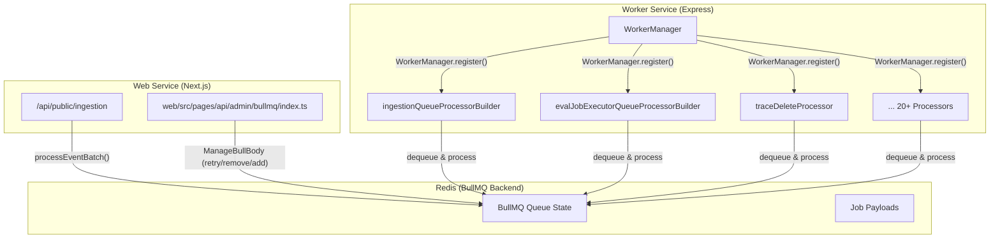
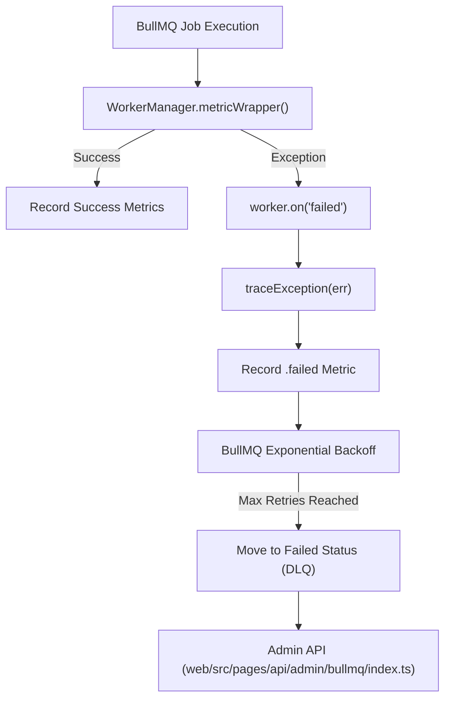

# Queue 및 Worker System

<details>
<summary>관련 소스 파일</summary>

다음 파일들은 이 위키 페이지를 생성하는 컨텍스트로 사용되었습니다.

- [.env.dev-redis-cluster.example](.env.dev-redis-cluster.example)
- [.vscode/launch.json](.vscode/launch.json)
- [packages/shared/src/env.ts](packages/shared/src/env.ts)
- [packages/shared/src/server/index.ts](packages/shared/src/server/index.ts)
- [packages/shared/src/server/queues.ts](packages/shared/src/server/queues.ts)
- [packages/shared/src/server/redis/batchExport.ts](packages/shared/src/server/redis/batchExport.ts)
- [packages/shared/src/server/redis/blobStorageIntegrationProcessingQueue.ts](packages/shared/src/server/redis/blobStorageIntegrationProcessingQueue.ts)
- [packages/shared/src/server/redis/createEvalQueue.ts](packages/shared/src/server/redis/createEvalQueue.ts)
- [packages/shared/src/server/redis/datasetRunItemUpsert.ts](packages/shared/src/server/redis/datasetRunItemUpsert.ts)
- [packages/shared/src/server/redis/dlqRetryQueue.ts](packages/shared/src/server/redis/dlqRetryQueue.ts)
- [packages/shared/src/server/redis/getQueue.ts](packages/shared/src/server/redis/getQueue.ts)
- [packages/shared/src/server/redis/ingestionQueue.ts](packages/shared/src/server/redis/ingestionQueue.ts)
- [packages/shared/src/server/redis/redis.ts](packages/shared/src/server/redis/redis.ts)
- [packages/shared/src/server/redis/traceUpsert.ts](packages/shared/src/server/redis/traceUpsert.ts)
- [web/src/pages/api/admin/bullmq/index.ts](web/src/pages/api/admin/bullmq/index.ts)
- [worker/src/__tests__/redisConsumer.test.ts](worker/src/__tests__/redisConsumer.test.ts)
- [worker/src/app.ts](worker/src/app.ts)
- [worker/src/env.ts](worker/src/env.ts)
- [worker/src/features/blobstorage/handleBlobStorageIntegrationSchedule.ts](worker/src/features/blobstorage/handleBlobStorageIntegrationSchedule.ts)
- [worker/src/features/tokenisation/usage.ts](worker/src/features/tokenisation/usage.ts)
- [worker/src/queues/ingestionQueue.ts](worker/src/queues/ingestionQueue.ts)
- [worker/src/queues/workerManager.ts](worker/src/queues/workerManager.ts)
- [worker/src/utils/shutdown.ts](worker/src/utils/shutdown.ts)

</details>


## 개요

Queue & Worker System은 Langfuse의 모든 background task를 처리하는 asynchronous processing infrastructure입니다. Redis 위에서 [BullMQ](https://optimalbits.github.io/bull/)를 사용해 data ingestion, evaluation execution, data deletion, exports, integrations 등을 포함한 event를 처리하는 20개 이상의 specialized queue를 관리합니다. 이 시스템은 web service와 분리되어 있으며 `worker/src/app.ts`에 정의된 dedicated worker service에서 실행됩니다 [worker/src/app.ts:1-107]().

이 문서는 queue architecture, worker management, queue processors, error handling, background services를 다룹니다. Ingestion 또는 evaluation 같은 특정 queue processing logic에 대한 정보는 [Data Ingestion Pipeline](#6) 및 [Evaluation System](#10)을 참조하세요.

**출처**: [worker/src/app.ts:1-107](), [packages/shared/src/server/queues.ts:1-250]()

## Queue Architecture

### Redis 기반 BullMQ

시스템은 Redis를 backend로 하는 BullMQ를 queue manager로 사용합니다. Configuration은 standalone Redis, Redis Cluster, Redis Sentinel을 지원합니다 [packages/shared/src/env.ts:20-57](). Queue instance는 singleton pattern을 통해 생성되며 다음 기능을 지원합니다.

- **Job delays**: Job은 지정된 시간만큼 delay될 수 있습니다(예: `LANGFUSE_INGESTION_QUEUE_DELAY_MS`는 기본값 15s [packages/shared/src/env.ts:125-128]()).
- **Concurrency control**: 각 queue는 worker registration을 통해 concurrent job processing을 제한할 수 있습니다 [worker/src/app.ts:126-137]().
- **Global Rate limiting**: BullMQ limiter는 worker instance 전체에서 job processing을 globally throttle하는 데 사용됩니다(예: `CreateEvalQueue` [worker/src/app.ts:140-153]()).
- **Job retries**: Transient failure에 대한 automatic exponential backoff [worker/src/queues/workerManager.ts:11-13]().
- **Dead letter management**: Failed job은 Admin API를 통해 retry하거나 clean할 수 있습니다 [web/src/pages/api/admin/bullmq/index.ts:33-48]().

Title: BullMQ Queue Architecture


**출처**: [worker/src/queues/workerManager.ts:20-160](), [packages/shared/src/env.ts:20-57](), [web/src/pages/api/admin/bullmq/index.ts:1-141]()

### Queue Types 및 Naming

Queue는 `QueueName` enum에 정의됩니다 [worker/src/app.ts:31-46](). 각 queue는 `packages/shared/src/server/queues.ts`에 대응되는 Zod-validated payload를 가집니다 [packages/shared/src/server/queues.ts:14-222]().

| Category | Queue Name | Job Schema | Sharded | 목적 |
|----------|------------|------------|---------|---------|
| **Ingestion** | `IngestionQueue` | `IngestionEvent` | Yes | legacy batch events 처리 [packages/shared/src/server/queues.ts:14-28]() |
| | `OtelIngestionQueue` | `OtelIngestionEvent` | Yes | OpenTelemetry spans 처리 [packages/shared/src/server/queues.ts:30-47]() |
| | `SecondaryIngestionQueue` | `IngestionEvent` | No | High-priority project ingestion [worker/src/app.ts:36]() |
| **Evaluation** | `TraceUpsertQueue` | `TraceQueueEventSchema` | Yes | trace upsert 시 eval creation trigger [packages/shared/src/server/queues.ts:56-61]() |
| | `CreateEvalQueue` | `CreateEvalQueueEventSchema` | No | eval jobs(batch 및 live) 생성 [packages/shared/src/server/queues.ts:204-217]() |
| | `EvalExecutionQueue` | `EvalExecutionEvent` | No | LLM-as-Judge evals 실행 [packages/shared/src/server/queues.ts:96-100]() |
| | `LLMAsJudgeExecutionQueue` | `LLMAsJudgeExecutionEventSchema`| No | Observation-level evals [packages/shared/src/server/queues.ts:103-107]() |
| **Deletion** | `TraceDelete` | `TraceQueueEventSchema` | No | traces 및 관련 data 삭제 [worker/src/app.ts:53]() |
| | `ProjectDelete` | `ProjectQueueEventSchema` | No | project cascade delete [worker/src/app.ts:54]() |
| **Integrations** | `PostHogIntegrationQueue` | `PostHogIntegrationProcessingEventSchema` | No | PostHog로 data sync [packages/shared/src/server/queues.ts:108-110]() |
| | `BlobStorageIntegrationQueue` | `BlobStorageIntegrationProcessingEventSchema` | No | S3/Azure Blob으로 data sync [packages/shared/src/server/queues.ts:114-116]() |

자세한 내용은 [Queue Architecture](#7.1)를 참조하세요.

**출처**: [packages/shared/src/server/queues.ts:14-222](), [worker/src/app.ts:25-86]()

### Sharded Queues

High-throughput queue는 load를 분산하기 위해 sharding을 사용합니다. Shard count는 `LANGFUSE_INGESTION_QUEUE_SHARD_COUNT` 같은 environment variable로 configure됩니다 [packages/shared/src/env.ts:129](). Job은 project ID의 hash를 사용해 shard 전체에 분산됩니다. Sharded queue는 shard name을 iterate하여 등록됩니다(예: `TraceUpsertQueue.getShardNames()`) [worker/src/app.ts:127-137]().

**출처**: [packages/shared/src/env.ts:129-158](), [worker/src/app.ts:126-137]()

## Worker Manager

`WorkerManager` class는 built-in instrumentation이 포함된 BullMQ worker 등록용 unified interface를 제공합니다 [worker/src/queues/workerManager.ts:20-186]().

### Worker Registration
Worker는 `WorkerManager.register()` method를 사용해 `worker/src/app.ts`에서 등록됩니다. 이 method는 `Worker` instance를 생성하고 processor를 metric collector로 wrapping합니다.

```typescript
// Example from worker/src/app.ts:140-153
WorkerManager.register(
  QueueName.CreateEvalQueue,
  evalJobCreatorQueueProcessor,
  {
    concurrency: env.LANGFUSE_EVAL_CREATOR_WORKER_CONCURRENCY,
    limiter: {
      // Process at most `max` jobs per `duration` milliseconds globally
      max: env.LANGFUSE_EVAL_CREATOR_WORKER_CONCURRENCY,
      duration: env.LANGFUSE_EVAL_CREATOR_LIMITER_DURATION,
    },
  },
);
```

### Metrics Instrumentation
`WorkerManager`는 metric wrapper `metricWrapper`를 사용해 등록된 모든 queue의 metrics를 자동으로 추적합니다 [worker/src/queues/workerManager.ts:41-110]().
- `request`: Job count [worker/src/queues/workerManager.ts:52]().
- `processing_time`: Execution duration [worker/src/queues/workerManager.ts:99-101]().
- `wait_time`: Queue에서 보낸 시간 [worker/src/queues/workerManager.ts:50-51]().
- `length`, `dlq_length`, `active`: Sampled queue depth gauges [worker/src/queues/workerManager.ts:74-92]().

자세한 내용은 [Worker Manager](#7.2)를 참조하세요.

**출처**: [worker/src/queues/workerManager.ts:20-186](), [worker/src/app.ts:140-153]()

## Queue Processors

Processor는 특정 queue의 job execution을 처리하는 specialized function입니다.

- **Ingestion**: `ingestionQueueProcessorBuilder`는 S3에서 event를 download하고 metadata를 ClickHouse에 기록하여 event batch processing을 처리합니다 [worker/src/queues/ingestionQueue.ts:29-180]().
- **Evaluations**: `evalJobExecutorQueueProcessorBuilder`와 `evalJobCreatorQueueProcessor`는 evaluation lifecycle을 관리합니다 [worker/src/app.ts:11-17]().
- **Exports**: `batchExportQueueProcessor`는 ClickHouse에서 large-scale data export를 처리합니다 [worker/src/app.ts:18]().
- **Cloud Metering**: `cloudUsageMeteringQueueProcessor`는 billing을 위한 organization usage를 계산합니다 [worker/src/app.ts:21]().

자세한 내용은 [Queue Processors](#7.3)를 참조하세요.

**출처**: [worker/src/app.ts:11-80](), [worker/src/queues/ingestionQueue.ts:29-180]()

## Error Handling 및 Retries

시스템은 multi-tier retry strategy를 구현합니다.
1. **BullMQ Native Retries**: `redisQueueRetryOptions`를 사용해 exponential backoff 및 custom retry strategy로 configure됩니다 [packages/shared/src/server/redis/redis.ts:16-36]().
2. **Worker Error Logging**: `WorkerManager`는 `failed` 및 `error` event를 listen하여 failure를 기록하고 exception을 trace합니다 [worker/src/queues/workerManager.ts:161-184]().
3. **Dead Letter Queue(DLQ)**: Failed job은 `DlqRetryService` 또는 Admin API를 통해 관리할 수 있습니다 [worker/src/app.ts:75](), [web/src/pages/api/admin/bullmq/index.ts:33-48]().
4. **Retry Service**: `DeadLetterRetryQueue`는 failed job의 scheduled retry를 처리합니다 [worker/src/app.ts:34]().

Title: Queue Error Handling Flow


자세한 내용은 [Error Handling & Retries](#7.4)를 참조하세요.

**출처**: [worker/src/queues/workerManager.ts:144-184](), [web/src/pages/api/admin/bullmq/index.ts:33-48](), [packages/shared/src/server/queues.ts:219-221](), [packages/shared/src/server/redis/redis.ts:16-36]()

## Background Services

Worker service는 standard BullMQ flow를 사용하지 않는 여러 background manager를 host합니다.
- **Background Migration Manager**: asynchronous database migration `BackgroundMigrationManager.run()`을 실행합니다 [worker/src/app.ts:112-117]().
- **ClickHouseReadSkipCache**: 성능을 위해 ingestion 중 ClickHouse read를 건너뛸 수 있는 project ID cache를 유지합니다 [worker/src/app.ts:119-124]().
- **Cleanup Services**: `BatchProjectCleaner`, `MediaRetentionCleaner`, 다양한 project blob/media cleaner 같은 periodic task [worker/src/app.ts:83-93]().

자세한 내용은 [Background Services](#7.5)를 참조하세요.

**출처**: [worker/src/app.ts:83-124](), [worker/src/utils/shutdown.ts:30-53]()

## Scheduled Jobs

Langfuse는 periodic task를 위해 repeatable job(cron-like)을 사용합니다.
- **Cloud Usage Metering**: Billing을 위한 hourly sync [worker/src/app.ts:21](), [worker/src/env.ts:185-187]().
- **Core Data Export**: `CoreDataS3ExportQueue`를 통한 scheduled S3 exports [worker/src/app.ts:155-162]().
- **Integration Jobs**: PostHog, Mixpanel, Blob Storage를 위한 periodic sync [worker/src/app.ts:55-66]().
- **Data Retention**: `DataRetentionQueue`를 통한 aged data scheduled cleanup [worker/src/app.ts:69-72]().

자세한 내용은 [Scheduled Jobs](#7.6)를 참조하세요.

**출처**: [worker/src/app.ts:55-181](), [worker/src/env.ts:185-191]()
