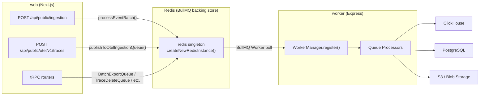

# Queue Architecture

관련 소스 파일

다음 파일들은 이 위키 페이지를 생성하는 컨텍스트로 사용되었습니다.

- [.env.dev-redis-cluster.example](.env.dev-redis-cluster.example)
- [.vscode/launch.json](.vscode/launch.json)
- [packages/shared/src/env.ts](packages/shared/src/env.ts)
- [packages/shared/src/server/index.ts](packages/shared/src/server/index.ts)
- [packages/shared/src/server/queues.ts](packages/shared/src/server/queues.ts)
- [packages/shared/src/server/redis/batchExport.ts](packages/shared/src/server/redis/batchExport.ts)
- [packages/shared/src/server/redis/blobStorageIntegrationProcessingQueue.ts](packages/shared/src/server/redis/blobStorageIntegrationProcessingQueue.ts)
- [packages/shared/src/server/redis/createEvalQueue.ts](packages/shared/src/server/redis/createEvalQueue.ts)
- [packages/shared/src/server/redis/datasetRunItemUpsert.ts](packages/shared/src/server/redis/datasetRunItemUpsert.ts)
- [packages/shared/src/server/redis/dlqRetryQueue.ts](packages/shared/src/server/redis/dlqRetryQueue.ts)
- [packages/shared/src/server/redis/getQueue.ts](packages/shared/src/server/redis/getQueue.ts)
- [packages/shared/src/server/redis/ingestionQueue.ts](packages/shared/src/server/redis/ingestionQueue.ts)
- [packages/shared/src/server/redis/redis.ts](packages/shared/src/server/redis/redis.ts)
- [packages/shared/src/server/redis/traceUpsert.ts](packages/shared/src/server/redis/traceUpsert.ts)
- [web/src/pages/api/admin/bullmq/index.ts](web/src/pages/api/admin/bullmq/index.ts)
- [worker/src/__tests__/redisConsumer.test.ts](worker/src/__tests__/redisConsumer.test.ts)
- [worker/src/app.ts](worker/src/app.ts)
- [worker/src/env.ts](worker/src/env.ts)
- [worker/src/features/blobstorage/handleBlobStorageIntegrationSchedule.ts](worker/src/features/blobstorage/handleBlobStorageIntegrationSchedule.ts)
- [worker/src/features/tokenisation/usage.ts](worker/src/features/tokenisation/usage.ts)
- [worker/src/queues/ingestionQueue.ts](worker/src/queues/ingestionQueue.ts)
- [worker/src/queues/workerManager.ts](worker/src/queues/workerManager.ts)
- [worker/src/utils/shutdown.ts](worker/src/utils/shutdown.ts)

이 페이지는 BullMQ 기반 queue system을 설명합니다. Queue가 정의되고, 이름 붙여지고, type이 지정되는 방식과 worker와의 관계를 다룹니다. `WorkerManager` class와 worker startup sequencing은 [7.2]()를 참조하세요. 개별 job processor는 [7.3]()을 참조하세요. Retry 및 error handling strategy는 [7.4]()를 참조하세요. Scheduled 및 repeating job은 [7.6]()을 참조하세요.

---

## BullMQ 및 Redis 기반

Langfuse의 모든 asynchronous work는 web server(producer)와 worker process(consumer)가 공유하는 Redis instance를 backend로 하는 BullMQ를 통해 조정됩니다.

Redis는 `packages/shared/src/env.ts`에 정의된 environment variable을 통해 configure됩니다 [packages/shared/src/env.ts:20-57](). 세 가지 connection mode가 지원됩니다.

| Mode | Env Vars |
|---|---|
| Single-node | `REDIS_HOST`, `REDIS_PORT`, `REDIS_AUTH`, `REDIS_USERNAME` |
| Connection string | `REDIS_CONNECTION_STRING` |
| Cluster | `REDIS_CLUSTER_ENABLED=true`, `REDIS_CLUSTER_NODES` |
| Sentinel | `REDIS_SENTINEL_ENABLED=true`, `REDIS_SENTINEL_NODES`, `REDIS_SENTINEL_MASTER_NAME` |

`createNewRedisInstance` function은 이러한 mode의 initialization을 처리하며, 각 BullMQ queue 또는 worker가 적절한 retry strategy가 적용된 dedicated connection을 받도록 보장합니다 [packages/shared/src/server/redis/redis.ts:183-228]().

### Connection Configuration
Queue connection은 retry 사이에 최소 1초, 최대 20초를 기다리는 exponential backoff strategy를 구현하는 `redisQueueRetryOptions`를 사용합니다 [packages/shared/src/server/redis/redis.ts:16-24](). Connection은 다음과 같이도 configure됩니다.
* `enableReadyCheck: true` [packages/shared/src/server/redis/redis.ts:7]()
* `maxRetriesPerRequest: null`(BullMQ에서 요구됨) [packages/shared/src/server/redis/redis.ts:8]()
* `keepAlive: 10000`(10초)로 middlebox에 의한 idle connection termination 방지 [packages/shared/src/server/redis/redis.ts:10]()
* `socketTimeout: 30000`(30초)로 hung operation이 concurrency slot을 block하지 않도록 방지 [packages/shared/src/server/redis/redis.ts:11]()

**High-level system diagram: Queue Data Flow**

Title: "System Queue Data Flow"

출처: [packages/shared/src/server/redis/redis.ts:183-228](), [packages/shared/src/env.ts:20-57](), [worker/src/app.ts:96-105](), [packages/shared/src/server/index.ts:54-54]()

---

## Queue Names 및 Job Types

모든 queue name은 `QueueName` enum에 정의됩니다 [worker/src/app.ts:31-46](). 각 job payload는 `packages/shared/src/server/queues.ts`에 정의된 Zod schema로 validate됩니다.

| Schema | Used By |
|---|---|
| `IngestionEvent` | `QueueName.IngestionQueue`, `QueueName.IngestionSecondaryQueue` [packages/shared/src/server/queues.ts:14-28]() |
| `OtelIngestionEvent` | `QueueName.OtelIngestionQueue`, `QueueName.SecondaryOtelIngestionQueue` [packages/shared/src/server/queues.ts:30-47]() |
| `TraceQueueEventSchema` | `QueueName.TraceUpsert`, `QueueName.TraceDelete` [packages/shared/src/server/queues.ts:56-61]() |
| `EvalExecutionEvent` | `QueueName.EvaluationExecution`, `QueueName.SecondaryEvalExecutionQueue` [packages/shared/src/server/queues.ts:96-100]() |
| `CreateEvalQueueEventSchema` | `QueueName.CreateEvalQueue` [packages/shared/src/server/queues.ts:204-217]() |
| `BatchExportJobSchema` | `QueueName.BatchExport` [packages/shared/src/server/queues.ts:49-52]() |
| `BatchActionProcessingEventSchema` | `QueueName.BatchActionQueue` [packages/shared/src/server/queues.ts:127-202]() |
| `ProjectQueueEventSchema` | `QueueName.ProjectDelete` [packages/shared/src/server/queues.ts:85-88]() |
| `DatasetQueueEventSchema` | `QueueName.DatasetDelete` [packages/shared/src/server/queues.ts:70-84]() |
| `ExperimentCreateEventSchema` | `QueueName.ExperimentCreate` [packages/shared/src/server/queues.ts:117-122]() |
| `NotificationEventSchema` | `QueueName.NotificationQueue` [packages/shared/src/server/queues.ts:223-226]() |
| `LLMAsJudgeExecutionEventSchema` | `QueueName.LLMAsJudgeExecution` [packages/shared/src/server/queues.ts:103-107]() |

출처: [packages/shared/src/server/queues.ts:14-226](), [worker/src/app.ts:25-46]()

---

## Queue Class Pattern

각 queue는 BullMQ `Queue` instance를 보유하는 static singleton class(예: `IngestionQueue`, `TraceUpsertQueue`)로 wrapping됩니다. Queue instance는 `getQueue()` factory를 통해 name으로 lookup되거나, sharded queue의 경우 class-specific `getInstance()` method를 통해 lookup됩니다 [packages/shared/src/server/redis/getQueue.ts:33-45]().

**Diagram: Queue Class → Redis Queue Name → Processor mapping (code entity space)**

Title: "Queue Class to Code Entity Mapping"

```mermaid
flowchart TD
    subgraph "packages/shared/src/server/redis/"
        IQ["IngestionQueue\n(sharded)"]
        OIQ["OtelIngestionQueue\n(sharded)"]
        TUQ["TraceUpsertQueue\n(sharded)"]
        CEQ["CreateEvalQueue"]
        EEQ["EvalExecutionQueue\nSecondaryEvalExecutionQueue"]
        LAJ["LLMAsJudgeExecutionQueue"]
        BEQ["BatchExportQueue"]
        BAQ["BatchActionQueue"]
        TDQ["TraceDeleteQueue"]
        PDQ["ProjectDeleteQueue"]
        SDQ["ScoreDeleteQueue"]
        DDQ["DatasetDeleteQueue"]
        EXQ["ExperimentCreateQueue"]
        WQ["WebhookQueue"]
        ECQ["EntityChangeQueue"]
        NQ["NotificationQueue"]
        DLRQ["DeadLetterRetryQueue"]
        EPQ["EventPropagationQueue"]
    end

    subgraph "QueueName enum values (packages/shared/src/server/index.ts)"
        IQN["ingestion-queue"]
        OIQN["otel-ingestion-queue"]
        TUQN["trace-upsert"]
        CEQN["create-eval-queue"]
        EEQN["evaluation-execution-queue"]
        LAJN["llm-as-a-judge-execution-queue"]
        BEQN["batch-export-queue"]
        BAQN["batch-action-queue"]
        TDQN["trace-delete"]
        PDQN["project-delete"]
        SDQN["score-delete"]
        DDQN["dataset-delete-queue"]
        EXQN["experiment-create-queue"]
        WQN["webhook-queue"]
        ECQN["entity-change-queue"]
        NQN["notification-queue"]
    end

    IQ --> IQN
    OIQ --> OIQN
    TUQ --> TUQN
    CEQ --> CEQN
    EEQ --> EEQN
    LAJ --> LAJN
    BEQ --> BEQN
    BAQ --> BAQN
    TDQ --> TDQN
    PDQ --> PDQN
    SDQ --> SDQN
    DDQ --> DDQN
    EXQ --> EXQN
    WQ --> WQN
    ECQ --> ECQN
    NQ --> NQN
```

출처: [packages/shared/src/server/index.ts:59-92](), [packages/shared/src/server/redis/getQueue.ts:33-106](), [worker/src/app.ts:25-46]()

---

## Sharded Queues

High-throughput queue는 Redis Cluster 환경에서 load를 여러 Redis key로 분산하고 single-key bottleneck을 피하기 위해 horizontal sharding을 지원합니다 [packages/shared/src/env.ts:129-158]().

| Queue Class | Base `QueueName` | Shard Count Env Var | Default Shards |
|---|---|---|---|
| `IngestionQueue` | `ingestion-queue` | `LANGFUSE_INGESTION_QUEUE_SHARD_COUNT` | 1 |
| `SecondaryIngestionQueue` | `ingestion-secondary-queue` | `LANGFUSE_INGESTION_SECONDARY_QUEUE_SHARD_COUNT` | 1 |
| `OtelIngestionQueue` | `otel-ingestion-queue` | `LANGFUSE_OTEL_INGESTION_QUEUE_SHARD_COUNT` | 1 |
| `SecondaryOtelIngestionQueue` | `otel-ingestion-secondary-queue` | `LANGFUSE_OTEL_INGESTION_SECONDARY_QUEUE_SHARD_COUNT` | 1 |
| `TraceUpsertQueue` | `trace-upsert` | `LANGFUSE_TRACE_UPSERT_QUEUE_SHARD_COUNT` | 1 |
| `EvalExecutionQueue`| `evaluation-execution-queue` | `LANGFUSE_EVAL_EXECUTION_QUEUE_SHARD_COUNT` | 1 |
| `SecondaryEvalExecutionQueue`| `evaluation-execution-secondary-queue` | `LANGFUSE_EVAL_EXECUTION_SECONDARY_QUEUE_SHARD_COUNT` | 1 |
| `LLMAsJudgeExecutionQueue` | `llm-as-a-judge-execution-queue` | `LANGFUSE_LLM_AS_JUDGE_EXECUTION_QUEUE_SHARD_COUNT` | 1 |

**Worker registration for shards:** Worker process는 특정 queue type의 모든 shard name을 iterate하고 각 shard마다 dedicated `Worker` instance를 등록합니다 [worker/src/app.ts:128-137]().

출처: [packages/shared/src/env.ts:129-158](), [worker/src/app.ts:126-138](), [web/src/pages/api/admin/bullmq/index.ts:70-82]()

---

## Queue-to-Worker Registration

Queue worker는 `WorkerManager.register()`를 사용해 `worker/src/app.ts`에서 등록됩니다. 각 registration은 일반적으로 `QUEUE_CONSUMER_*_IS_ENABLED` environment flag로 guard됩니다 [worker/src/app.ts:126-200]().

| `QueueName` | Processor | Default Concurrency | Env Var |
|---|---|---|---|
| `TraceUpsert` (shards) | `evalJobTraceCreatorQueueProcessor` | 25 | `LANGFUSE_TRACE_UPSERT_WORKER_CONCURRENCY` [worker/src/env.ts:119-122]() |
| `CreateEvalQueue` | `evalJobCreatorQueueProcessor` | 2 | `LANGFUSE_EVAL_CREATOR_WORKER_CONCURRENCY` [worker/src/env.ts:115-118]() |
| `TraceDelete` | `traceDeleteProcessor` | 1 | `LANGFUSE_TRACE_DELETE_CONCURRENCY` [worker/src/env.ts:123]() |
| `ScoreDelete` | `scoreDeleteProcessor` | 1 | `LANGFUSE_SCORE_DELETE_CONCURRENCY` [worker/src/env.ts:124]() |
| `IngestionQueue` | `ingestionQueueProcessorBuilder` | 20 | `LANGFUSE_INGESTION_QUEUE_PROCESSING_CONCURRENCY` [worker/src/env.ts:81-84]() |
| `OtelIngestionQueue` | `otelIngestionQueueProcessorBuilder` | 5 | `LANGFUSE_OTEL_INGESTION_QUEUE_PROCESSING_CONCURRENCY` [worker/src/env.ts:70-73]() |

출처: [worker/src/app.ts:126-200](), [worker/src/env.ts:70-138]()

---

## Rate Limiters

BullMQ limiter는 모든 worker instance에 걸쳐 job processing의 global rate를 제어하는 데 사용됩니다 [worker/src/app.ts:140-194]().

| Queue | Limiter: max | Limiter: duration | 목적 |
|---|---|---|---|
| `CreateEvalQueue` | Concurrency (2) | 500 ms | evaluation job creation throttle [worker/src/app.ts:148-149]() |
| `TraceDelete` | Concurrency (1) | `DURATION_MS` | ClickHouse deletion throttle [worker/src/app.ts:188-192]() |
| `MeteringDataPostgresExportQueue` | 1 | 30 s | metering export to PostgreSQL 빈도 제한 [worker/src/app.ts:173-174]() |

출처: [worker/src/app.ts:140-194](), [worker/src/env.ts:111-114]()

---

## Secondary Queues

Secondary queue는 high-volume project를 격리하여 massive ingestion 또는 evaluation spike가 다른 tenant의 processing을 막지 않도록 보장합니다.

*   **Ingestion:** `LANGFUSE_SECONDARY_INGESTION_QUEUE_ENABLED_PROJECT_IDS`에 나열된 project는 `SecondaryIngestionQueue`로 route됩니다 [worker/src/env.ts:85-89]().
*   **OTel Ingestion:** `LANGFUSE_SECONDARY_OTEL_INGESTION_QUEUE_ENABLED_PROJECT_IDS`의 project는 `SecondaryOtelIngestionQueue`를 사용합니다 [worker/src/env.ts:74-80]().
*   **Eval Execution:** `LANGFUSE_SECONDARY_EVAL_EXECUTION_QUEUE_ENABLED_PROJECT_IDS`의 project는 `SecondaryEvalExecutionQueue`를 사용합니다 [worker/src/env.ts:135-141]().

출처: [worker/src/env.ts:74-141](), [worker/src/app.ts:36-44]()

---

## Event Propagation Queue

`EventPropagationQueue` [worker/src/app.ts:42]()는 staging table(event가 처음 기록되는 위치)에서 ClickHouse의 primary events table로 data를 asynchronous하게 이동하는 작업을 관리합니다. 이는 events-first architecture의 핵심 component로, raw observation event에서 synthetic trace를 derive할 수 있도록 보장합니다 [worker/src/app.ts:80]().

출처: [worker/src/app.ts:42](), [worker/src/app.ts:80]()
