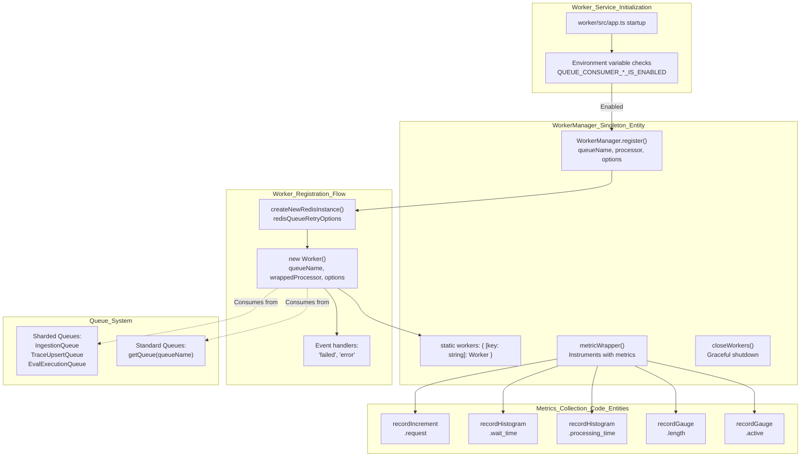
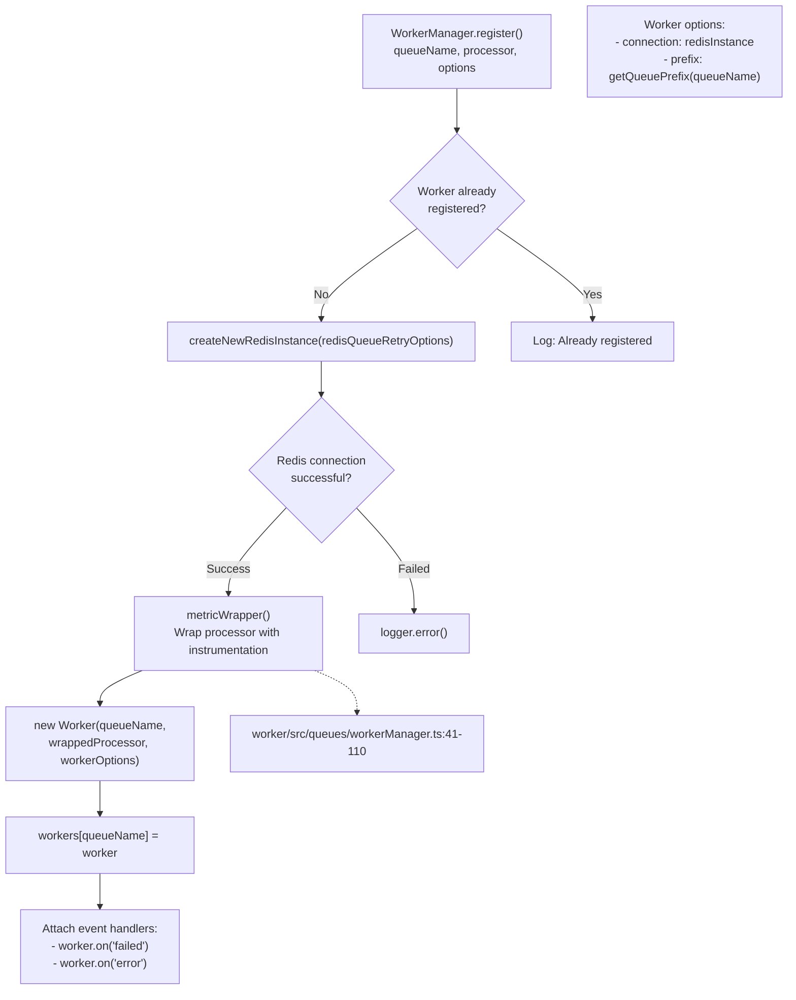

# Worker Manager

<details>
<summary>관련 소스 파일</summary>

다음 파일들은 이 위키 페이지를 생성하는 컨텍스트로 사용되었습니다.

- [.env.dev-redis-cluster.example](.env.dev-redis-cluster.example)
- [.vscode/launch.json](.vscode/launch.json)
- [packages/shared/src/db.ts](packages/shared/src/db.ts)
- [packages/shared/src/env.ts](packages/shared/src/env.ts)
- [packages/shared/src/server/index.ts](packages/shared/src/server/index.ts)
- [packages/shared/src/server/queues.ts](packages/shared/src/server/queues.ts)
- [packages/shared/src/server/redis/getQueue.ts](packages/shared/src/server/redis/getQueue.ts)
- [web/src/pages/api/admin/bullmq/index.ts](web/src/pages/api/admin/bullmq/index.ts)
- [web/src/pages/api/public/health.ts](web/src/pages/api/public/health.ts)
- [web/src/pages/api/public/ready.ts](web/src/pages/api/public/ready.ts)
- [web/src/utils/shutdown.ts](web/src/utils/shutdown.ts)
- [worker/src/api/index.ts](worker/src/api/index.ts)
- [worker/src/app.ts](worker/src/app.ts)
- [worker/src/env.ts](worker/src/env.ts)
- [worker/src/features/health/index.ts](worker/src/features/health/index.ts)
- [worker/src/features/tokenisation/usage.ts](worker/src/features/tokenisation/usage.ts)
- [worker/src/queues/ingestionQueue.ts](worker/src/queues/ingestionQueue.ts)
- [worker/src/queues/workerManager.ts](worker/src/queues/workerManager.ts)
- [worker/src/utils/shutdown.ts](worker/src/utils/shutdown.ts)

</details>


`WorkerManager`는 Langfuse worker service에서 background job processing을 위한 중앙 orchestration layer입니다. Redis-backed queue에서 job을 consume하는 BullMQ worker의 lifecycle, registration, instrumentation을 관리합니다. Queue architecture 자체에 대한 정보는 [Queue Architecture (7.1)]()을 참조하세요. 개별 queue processor에 대한 자세한 내용은 [Queue Processors (7.3)]()을 참조하세요.

## 목적과 책임

`WorkerManager` class는 다음을 수행하는 singleton registry 역할을 합니다.

1.  각 queue에 대해 대응되는 processor function으로 **worker를 등록**합니다 [worker/src/queues/workerManager.ts:127-131]().
2.  종합적인 metrics(request counts, wait times, processing times, queue lengths, active counts)로 **모든 queue processing을 instrument**합니다 [worker/src/queues/workerManager.ts:41-110]().
3.  Graceful shutdown을 포함해 **worker lifecycle을 관리**합니다 [worker/src/queues/workerManager.ts:112-117]().
4.  중앙화된 logging과 exception tracking으로 **error를 처리**합니다 [worker/src/queues/workerManager.ts:161-184]().
5.  Concurrency, rate limits, connection prefixes 같은 **worker option을 configure**합니다 [worker/src/queues/workerManager.ts:145-153]().

출처: [worker/src/queues/workerManager.ts:20-186]()

## 아키텍처 개요



**Worker Manager System Architecture**

`WorkerManager`는 application startup logic과 BullMQ worker instance 사이의 중앙 coordination point 역할을 합니다. 각 queue consumer는 `app.ts`의 environment variable에 따라 조건부로 등록됩니다 [worker/src/app.ts:126-280]().

출처: [worker/src/queues/workerManager.ts:20-186](), [worker/src/app.ts:126-280]()

## Worker Registration Process

### Registration Method

`WorkerManager.register()` static method는 worker를 생성하고 등록하기 위한 기본 interface입니다. 같은 queue에 대해 worker가 여러 번 등록되지 않도록 보장합니다 [worker/src/queues/workerManager.ts:132-135]().

출처: [worker/src/queues/workerManager.ts:127-186]()

### Registration Flow



**Worker Registration Flow Diagram**

Registration process에는 validation, `createNewRedisInstance`를 사용한 Redis connection setup [worker/src/queues/workerManager.ts:138](), instrumentation을 위한 processor wrapping [worker/src/queues/workerManager.ts:147](), error handler attachment [worker/src/queues/workerManager.ts:161-184]()가 포함됩니다.

출처: [worker/src/queues/workerManager.ts:127-186]()

### app.ts의 Registration 예시

| Queue Name | Processor | Concurrency | Rate Limiter |
| :--- | :--- | :--- | :--- |
| `TraceUpsert` (sharded) | `evalJobTraceCreatorQueueProcessor` | `env.LANGFUSE_TRACE_UPSERT_WORKER_CONCURRENCY` | None |
| `CreateEvalQueue` | `evalJobCreatorQueueProcessor` | `env.LANGFUSE_EVAL_CREATOR_WORKER_CONCURRENCY` | `max: concurrency, duration: env.LANGFUSE_EVAL_CREATOR_LIMITER_DURATION` |
| `TraceDelete` | `traceDeleteProcessor` | `env.LANGFUSE_TRACE_DELETE_CONCURRENCY` | `max: concurrency, duration: ClickHouse duration` |
| `IngestionQueue` | `ingestionQueueProcessorBuilder(true)` | `env.LANGFUSE_INGESTION_QUEUE_PROCESSING_CONCURRENCY` | None |

출처: [worker/src/app.ts:126-193](), [worker/src/env.ts:81-122]()

## Metrics Instrumentation

### Metrics Wrapper

`metricWrapper()` private static method는 모든 processor function을 wrapping하여 종합적인 metrics를 자동 수집합니다 [worker/src/queues/workerManager.ts:41-110]().

```mermaid
graph LR
    JobReceived["Job received from queue"]
    
    StartTimer["startTime = Date.now()"]
    
    CalcWait["waitTime = now - job.timestamp"]
    
    RecordRequest["recordIncrement()<br/>.request"]
    
    RecordWait["recordHistogram()<br/>.wait_time"]
    
    ExecuteProcessor["await processor(job)"]
    
    GetQueue["resolveQueueInstance(queueName)"]
    
    GetCounts["Promise.allSettled:<br/>- getWaitingCount()<br/>- getFailedCount()<br/>- getActiveCount()"]
    
    RecordGauges["recordGauge:<br/>- .length<br/>- .dlq_length<br/>- .active"]
    
    CalcProcessing["processingTime = now - startTime"]
    
    RecordProcessing["recordHistogram()<br/>.processing_time"]
    
    JobReceived --> StartTimer
    StartTimer --> CalcWait
    CalcWait --> RecordRequest
    RecordRequest --> RecordWait
    RecordWait --> ExecuteProcessor
    ExecuteProcessor --> GetQueue
    GetQueue --> GetCounts
    GetCounts --> RecordGauges
    RecordGauges --> CalcProcessing
    CalcProcessing --> RecordProcessing
```



**Metrics Collection Flow**

모든 job execution은 `recordIncrement`, `recordHistogram`, `recordGauge`를 사용해 timing, throughput, queue depth metrics를 capture하는 instrumentation으로 wrapping됩니다 [worker/src/queues/workerManager.ts:52-91](). Sharded queue의 metric volume을 줄이기 위해 `env.LANGFUSE_QUEUE_METRICS_SAMPLE_RATE`를 통한 sampling mechanism을 사용합니다 [worker/src/queues/workerManager.ts:71-72]().

출처: [worker/src/queues/workerManager.ts:41-110]()

### 수집되는 Metrics

`WorkerManager`는 transition period를 지원하기 위해 legacy naming convention과 sharded naming convention을 모두 사용해 metrics를 생성합니다 [worker/src/queues/workerManager.ts:45-46]().

| Metric Name Pattern | Type | 목적 |
| :--- | :--- | :--- |
| `{queueName}.request` | Counter | 처리된 전체 job 수 [worker/src/queues/workerManager.ts:52]() |
| `{queueName}.wait_time` | Histogram | processing 전 job이 queue에서 기다린 시간 [worker/src/queues/workerManager.ts:58-60]() |
| `{queueName}.processing_time` | Histogram | job 처리에 걸린 시간 [worker/src/queues/workerManager.ts:99-101]() |
| `{queueName}.length` | Gauge | queue의 waiting job 수 [worker/src/queues/workerManager.ts:78-81]() |
| `{queueName}.dlq_length` | Gauge | dead letter queue의 failed job 수 [worker/src/queues/workerManager.ts:83-86]() |
| `{queueName}.active` | Gauge | 현재 처리 중인 job 수 [worker/src/queues/workerManager.ts:88-91]() |

출처: [worker/src/queues/workerManager.ts:41-110]()

## Worker Lifecycle Management

### Initialization

Worker는 `worker/src/app.ts`의 application startup 중 initialize됩니다. Initialization은 environment flag에 따라 조건부로 수행됩니다 [worker/src/app.ts:126-280]().

Sharded queue initialization 예시:
```typescript
if (env.QUEUE_CONSUMER_TRACE_UPSERT_QUEUE_IS_ENABLED === "true") {
  // Register workers for all trace upsert queue shards
  const traceUpsertShardNames = TraceUpsertQueue.getShardNames();
  traceUpsertShardNames.forEach((shardName) => {
    WorkerManager.register(
      shardName as QueueName,
      evalJobTraceCreatorQueueProcessor,
      {
        concurrency: env.LANGFUSE_TRACE_UPSERT_WORKER_CONCURRENCY,
      },
    );
  });
}
```
출처: [worker/src/app.ts:126-138]()

### Graceful Shutdown

`closeWorkers()` static method는 등록된 모든 worker에서 `.close()`를 호출해 graceful shutdown 기능을 제공합니다 [worker/src/queues/workerManager.ts:112-117](). 이는 worker process의 `onShutdown` handler가 호출합니다 [worker/src/utils/shutdown.ts:22-56]().

출처: [worker/src/queues/workerManager.ts:112-117](), [worker/src/utils/shutdown.ts:22-56]()

## Error Handling

### Error Event Handlers

`WorkerManager`는 registration 중 각 worker에 두 개의 error event handler를 attach합니다 [worker/src/queues/workerManager.ts:161-184]().

1.  **Failed Job Handler**: job이 실패했을 때 trigger됩니다. Failure를 log하고, `traceException`을 통해 exception을 trace하며, `{queueName}.failed` metric을 increment합니다 [worker/src/queues/workerManager.ts:161-172]().
2.  **Worker Error Handler**: worker 자체에서 error가 발생했을 때 trigger됩니다. Error를 log하고 `{queueName}.error` metric을 increment합니다 [worker/src/queues/workerManager.ts:173-184]().

출처: [worker/src/queues/workerManager.ts:161-184]()

## Configuration

### Environment Variables

Queue consumer behavior는 `worker/src/env.ts`에 정의된 environment variable로 제어됩니다.

| Environment Variable | Default | 목적 |
| :--- | :--- | :--- |
| `QUEUE_CONSUMER_INGESTION_QUEUE_IS_ENABLED` | `"true"` | ingestion queue worker toggle [worker/src/env.ts:203-205]() |
| `QUEUE_CONSUMER_TRACE_UPSERT_QUEUE_IS_ENABLED` | `"true"` | trace upsert worker toggle [worker/src/env.ts:221-223]() |
| `LANGFUSE_TRACE_UPSERT_WORKER_CONCURRENCY` | `25` | trace upsert용 concurrency [worker/src/env.ts:119-122]() |
| `LANGFUSE_INGESTION_QUEUE_PROCESSING_CONCURRENCY` | `20` | ingestion용 concurrency [worker/src/env.ts:81-84]() |

출처: [worker/src/env.ts:4-225](), [worker/src/queues/workerManager.ts:72]()

### Redis Connection Configuration

모든 worker는 공유 Redis configuration strategy를 사용합니다.
- **Connection**: `createNewRedisInstance(redisQueueRetryOptions)`를 통해 생성됩니다 [worker/src/queues/workerManager.ts:138]().
- **Retry Logic**: Connection stability를 위해 `redisQueueRetryOptions`를 사용합니다 [worker/src/queues/workerManager.ts:11]().
- **Prefix**: 올바른 Redis key isolation을 보장하기 위해 `getQueuePrefix(queueName)`을 사용합니다 [worker/src/queues/workerManager.ts:150]().

출처: [worker/src/queues/workerManager.ts:11-150]()

## Queue System과의 통합

### Queue Discovery

`WorkerManager`는 metrics를 report하기 위해 sharded queue 및 standard queue와 모두 상호작용합니다.

1.  **Sharded Queues**: `IngestionQueue`와 `TraceUpsertQueue` 같은 high-throughput queue입니다. Shard name은 retrieve되어 `resolveMetricInfo`를 사용한 metric reporting을 위해 특별히 처리됩니다 [worker/src/queues/workerManager.ts:23-39]().
2.  **Standard Queues**: `resolveQueueInstance(queueName)`를 통해 resolve되는 single-instance queue입니다 [worker/src/queues/workerManager.ts:69]().

출처: [worker/src/queues/workerManager.ts:23-69]()

### Worker Discovery API

`/api/admin/bullmq`의 admin API는 관련 queue instance를 instantiate하여 등록된 모든 queue와 shard 전반의 job count를 inspect할 수 있게 합니다 [web/src/pages/api/admin/bullmq/index.ts:70-139]().

출처: [web/src/pages/api/admin/bullmq/index.ts:70-139]()
