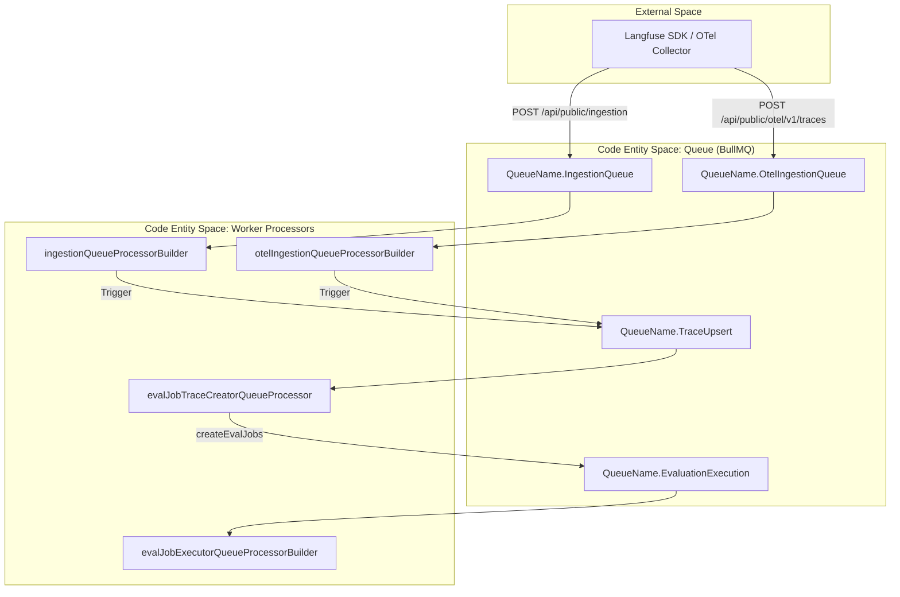
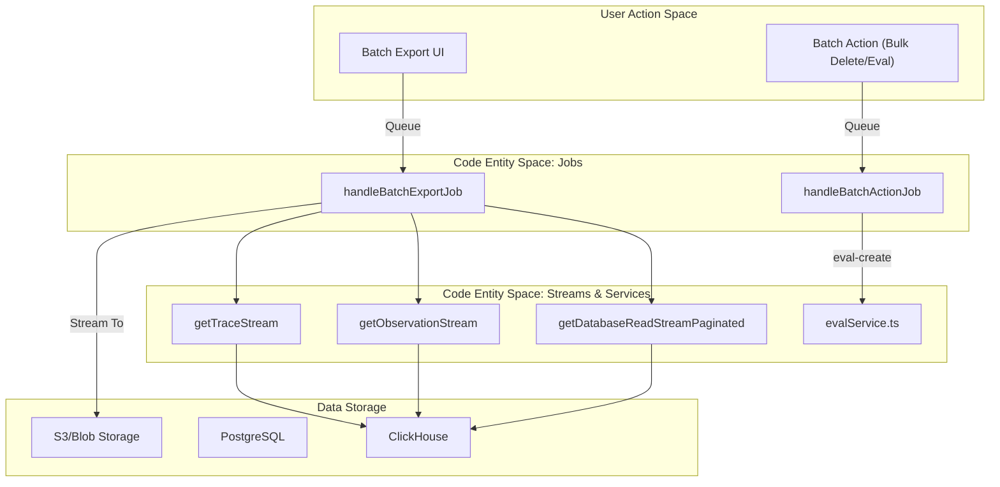

# Queue Processors

관련 소스 파일

다음 파일들은 이 위키 페이지를 생성하는 컨텍스트로 사용되었습니다.

- [packages/shared/prisma/migrations/20241029130802_prices_drop_excess_index/migration.sql](packages/shared/prisma/migrations/20241029130802_prices_drop_excess_index/migration.sql)
- [packages/shared/src/features/batchAction/types.ts](packages/shared/src/features/batchAction/types.ts)
- [packages/shared/src/features/batchExport/types.ts](packages/shared/src/features/batchExport/types.ts)
- [packages/shared/src/interfaces/tableNames.ts](packages/shared/src/interfaces/tableNames.ts)
- [packages/shared/src/server/ingestion/processEventBatch.ts](packages/shared/src/server/ingestion/processEventBatch.ts)
- [packages/shared/src/server/otel/ObservationTypeMapper.ts](packages/shared/src/server/otel/ObservationTypeMapper.ts)
- [packages/shared/src/server/otel/OtelIngestionProcessor.ts](packages/shared/src/server/otel/OtelIngestionProcessor.ts)
- [packages/shared/src/server/redis/otelIngestionQueue.ts](packages/shared/src/server/redis/otelIngestionQueue.ts)
- [web/src/__tests__/server/api/otel/otelMapping.servertest.ts](web/src/__tests__/server/api/otel/otelMapping.servertest.ts)
- [web/src/features/evals/components/evaluator-table.tsx](web/src/features/evals/components/evaluator-table.tsx)
- [web/src/features/evals/components/inner-evaluator-form.tsx](web/src/features/evals/components/inner-evaluator-form.tsx)
- [web/src/features/evals/server/router.ts](web/src/features/evals/server/router.ts)
- [web/src/features/models/components/pricing-tiers/TierPrefillButtons.tsx](web/src/features/models/components/pricing-tiers/TierPrefillButtons.tsx)
- [web/src/features/table/components/targetOptionsQueryMap.tsx](web/src/features/table/components/targetOptionsQueryMap.tsx)
- [web/src/pages/api/public/otel/v1/traces/index.ts](web/src/pages/api/public/otel/v1/traces/index.ts)
- [worker/src/__tests__/batchAction.test.ts](worker/src/__tests__/batchAction.test.ts)
- [worker/src/__tests__/batchExport.test.ts](worker/src/__tests__/batchExport.test.ts)
- [worker/src/__tests__/evalService.filtering.test.ts](worker/src/__tests__/evalService.filtering.test.ts)
- [worker/src/__tests__/evalService.test.ts](worker/src/__tests__/evalService.test.ts)
- [worker/src/constants/default-model-prices.json](worker/src/constants/default-model-prices.json)
- [worker/src/ee/cloudUsageMetering/handleCloudUsageMeteringJob.ts](worker/src/ee/cloudUsageMetering/handleCloudUsageMeteringJob.ts)
- [worker/src/features/batchAction/handleBatchActionJob.ts](worker/src/features/batchAction/handleBatchActionJob.ts)
- [worker/src/features/batchAction/processAddToQueue.ts](worker/src/features/batchAction/processAddToQueue.ts)
- [worker/src/features/batchExport/handleBatchExportJob.ts](worker/src/features/batchExport/handleBatchExportJob.ts)
- [worker/src/features/database-read-stream/event-stream.ts](worker/src/features/database-read-stream/event-stream.ts)
- [worker/src/features/database-read-stream/getDatabaseReadStream.ts](worker/src/features/database-read-stream/getDatabaseReadStream.ts)
- [worker/src/features/database-read-stream/observation-stream.ts](worker/src/features/database-read-stream/observation-stream.ts)
- [worker/src/features/database-read-stream/trace-stream.ts](worker/src/features/database-read-stream/trace-stream.ts)
- [worker/src/features/evaluation/evalService.ts](worker/src/features/evaluation/evalService.ts)
- [worker/src/queues/__tests__/otelDirectEventWrite.test.ts](worker/src/queues/__tests__/otelDirectEventWrite.test.ts)
- [worker/src/queues/batchExportQueue.ts](worker/src/queues/batchExportQueue.ts)
- [worker/src/queues/cloudUsageMeteringQueue.ts](worker/src/queues/cloudUsageMeteringQueue.ts)
- [worker/src/queues/evalQueue.ts](worker/src/queues/evalQueue.ts)
- [worker/src/queues/otelIngestionQueue.ts](worker/src/queues/otelIngestionQueue.ts)
- [worker/src/queues/shardedQueueRegistry.ts](worker/src/queues/shardedQueueRegistry.ts)
- [worker/src/scripts/upsertDefaultModelPrices.ts](worker/src/scripts/upsertDefaultModelPrices.ts)

이 페이지는 Langfuse worker service 내 개별 queue processor를 자세히 설명합니다. 이러한 processor는 data ingestion, OpenTelemetry(OTel) processing, evaluation execution, large-scale data exports, cloud usage metering을 포함한 background task를 담당하는 BullMQ consumer입니다.

Queue architecture와 sharding strategy에 대한 정보는 **7.1 Queue Architecture**를 참조하세요. Worker lifecycle management에 대한 자세한 내용은 **7.2 Worker Manager**를 참조하세요.

---

## 핵심 Ingestion Processors

### Ingestion Queue Processor
**목적:** S3에서 event batch를 download하고 ClickHouse에 기록하여 standard SDK ingestion events(traces, spans, generations, scores)를 처리합니다.

**구현 세부사항:**
- **Registration:** Processor는 `ingestionQueueProcessorBuilder` [worker/src/queues/ingestionQueue.ts:29-31]()를 통해 initialize되고 `worker/src/app.ts`에서 `WorkerManager`에 등록됩니다.
- **Deduplication:** 짧은 time window 내에 처리된 event를 건너뛰기 위해 Redis 기반 cache를 사용합니다 [worker/src/queues/ingestionQueue.ts:84-106]().
- **Batch Processing:** `processEventBatch`를 사용해 event를 validate, deduplicate, store합니다 [packages/shared/src/server/ingestion/processEventBatch.ts:104-116]().
- **Secondary Queue:** High-volume project 또는 S3 slowdown을 겪는 project는 `SecondaryIngestionQueue`로 redirect됩니다 [worker/src/queues/ingestionQueue.ts:125-133]().

### OTel Ingestion Processor
**목적:** OpenTelemetry `ResourceSpans`를 Langfuse-native ingestion events로 변환합니다.

**구현:**
- **Processor:** `otelIngestionQueueProcessorBuilder`는 `OtelIngestionQueue`의 job을 처리합니다 [worker/src/queues/otelIngestionQueue.ts:13-13]().
- **Mapping Logic:** `OtelIngestionProcessor` class는 OTel span을 Langfuse observation type(SPAN, GENERATION 등)으로 변환하는 작업을 관리합니다 [packages/shared/src/server/otel/OtelIngestionProcessor.ts:141-168]().
- **Observation Mapping:** Span을 generation, tool call, standard span 중 무엇으로 다룰지 결정하기 위해 `ObservationTypeMapperRegistry`를 사용합니다 [packages/shared/src/server/otel/OtelIngestionProcessor.ts:114-114]().
- **Storage:** Span은 processing queue에 추가되기 전에 먼저 JSON으로 S3에 upload됩니다 [packages/shared/src/server/otel/OtelIngestionProcessor.ts:182-190]().

**출처:** [worker/src/queues/ingestionQueue.ts:29-180](), [worker/src/queues/otelIngestionQueue.ts:13-13](), [packages/shared/src/server/ingestion/processEventBatch.ts:104-116](), [packages/shared/src/server/otel/OtelIngestionProcessor.ts:141-220]()

---

## Evaluation Processors

Evaluation system은 LLM-based scoring을 자동화하기 위해 multi-stage pipeline을 사용합니다.

### Eval Job Creator
**목적:** 들어오는 trace 또는 dataset item을 `JobConfiguration` filter와 match하여 어떤 evaluation이 실행되어야 하는지 결정합니다.

| Processor Function | Trigger Source | Time Scope |
| :--- | :--- | :--- |
| `evalJobTraceCreatorQueueProcessor` | `TraceUpsert` | `NEW` [worker/src/queues/evalQueue.ts:25-33]() |
| `evalJobDatasetCreatorQueueProcessor` | `DatasetRunItemUpsert` | `NEW` [worker/src/queues/evalQueue.ts:46-54]() |
| `evalJobCreatorQueueProcessor` | `CreateEvalQueue` (Manual/UI) | All [worker/src/queues/evalQueue.ts:98-106]() |

**Logic:** 이러한 processor는 `createEvalJobs` [worker/src/features/evaluation/evalService.ts:113-113]()를 호출합니다. 이 함수는 execution job을 `EvalExecutionQueue`에 dispatch하기 전에 `traceExists` [worker/src/features/evaluation/evalService.ts:134-134]() 및 `observationExists` [worker/src/features/evaluation/evalService.ts:138-140]() 같은 validation check를 수행합니다.

### Evaluation Execution Processor
**목적:** LLM-as-a-judge logic을 실행합니다.

**구현 세부사항:**
- **Execution:** `evaluate({ event: job.data.payload })`를 호출합니다 [worker/src/queues/evalQueue.ts:176-176]().
- **Variable Extraction:** `extractVariablesFromTracingData`를 통해 job configuration에 정의된 mapping을 사용해 trace data에서 value를 extract합니다 [worker/src/features/evaluation/evalService.test.ts:33-34]().
- **Redirection:** 특정 project ID에 대해 high-volume project가 main queue를 block하지 않도록 `SecondaryEvalExecutionQueue` [worker/src/queues/evalQueue.ts:142-142]()를 지원합니다 [worker/src/queues/evalQueue.ts:132-157]().
- **Error Handling:** `LLMCompletionError` [worker/src/queues/evalQueue.ts:14-14]() 같은 error를 classify하여 BullMQ retry와 exponential backoff를 사용한 internal delayed retry 중 무엇을 사용할지 결정합니다 [worker/src/queues/evalQueue.ts:185-201]().

**출처:** [worker/src/queues/evalQueue.ts:25-201](), [worker/src/features/evaluation/evalService.ts:84-176](), [worker/src/features/evaluation/evalService.test.ts:33-34]()

---

## Batch Export 및 Batch Action Processors

### Batch Export Processor
**목적:** ClickHouse 또는 PostgreSQL의 large dataset을 external blob storage(S3, Azure)로 stream합니다.

**Key Function:** `handleBatchExportJob` [worker/src/features/batchExport/handleBatchExportJob.ts:34-36]()
- **Status Management:** Job status를 `QUEUED`에서 `PROCESSING`으로 전환합니다 [worker/src/features/batchExport/handleBatchExportJob.ts:115-123]().
- **Comment Filtering:** Streaming 전에 `applyCommentFilters`를 통해 comment-based filter를 적용합니다 [worker/src/features/batchExport/handleBatchExportJob.ts:145-150]().
- **Streaming:** Target table(Traces, Observations, Sessions, Scores)에 따라 `DatabaseReadStream`을 initialize합니다 [worker/src/features/batchExport/handleBatchExportJob.ts:174-202]().
- **Transformation:** `streamTransformations`를 사용해 database row를 CSV 또는 JSONL format으로 변환합니다 [worker/src/features/batchExport/handleBatchExportJob.ts:220-223]().

### Batch Action Processor
**목적:** Deletion 또는 annotation queue에 item 추가 같은 bulk operation을 실행합니다.
- **Actions:** `trace-delete`, `score-delete`, `eval-create`, annotation queue에 item 추가를 지원합니다.
- **Implementation:** `handleBatchActionJob`을 통해 bulk operation을 처리합니다 [worker/src/features/batchAction/handleBatchActionJob.ts:1-10]().

**출처:** [worker/src/features/batchExport/handleBatchExportJob.ts:34-231](), [worker/src/features/database-read-stream/getDatabaseReadStream.ts:99-114](), [worker/src/features/batchAction/handleBatchActionJob.ts:1-10]()

---

## Cloud Metering 및 System Processors

### Cloud Usage Metering
**목적:** Billing 및 tier enforcement를 위해 organization-level usage를 계산하고 기록합니다.
- **Processor:** `handleCloudUsageMeteringJob`은 event count를 aggregate하고 organization metrics를 update합니다 [worker/src/ee/cloudUsageMetering/handleCloudUsageMeteringJob.ts:1-10]().
- **Queue:** `CloudUsageMeteringQueue`를 통해 관리됩니다 [worker/src/queues/cloudUsageMeteringQueue.ts:1-10]().

### Model Pricing Updates
**목적:** System의 JSON configuration에서 database의 default model prices를 주기적으로 update합니다.
- **Implementation:** `upsertDefaultModelPrices`는 `default-model-prices.json`에서 읽고 PostgreSQL의 `Model` table을 synchronize합니다 [worker/src/scripts/upsertDefaultModelPrices.ts:1-20]().
- **Data Source:** Model pattern과 pricing tier의 종합 목록을 사용합니다 [worker/src/constants/default-model-prices.json:1-159]().

**출처:** [worker/src/ee/cloudUsageMetering/handleCloudUsageMeteringJob.ts:1-10](), [worker/src/scripts/upsertDefaultModelPrices.ts:1-20](), [worker/src/constants/default-model-prices.json:1-159]()

---

## System Integration Diagrams

### Ingestion to Evaluation Pipeline

이 다이어그램은 "Ingestion"이라는 자연어 공간을 `IngestionQueue` 및 `createEvalJobs` 같은 code entity와 연결합니다.

**출처:** [worker/src/queues/ingestionQueue.ts:29-36](), [worker/src/queues/evalQueue.ts:25-34](), [packages/shared/src/server/ingestion/processEventBatch.ts:104-116]()

### Export 및 Batch Action Architecture

이 다이어그램은 "Batch Export" 및 "Batch Action" 같은 system action을 그 기반 stream 및 processor implementation과 연결합니다.

**출처:** [worker/src/features/batchExport/handleBatchExportJob.ts:174-202](), [worker/src/features/database-read-stream/getDatabaseReadStream.ts:99-114](), [worker/src/features/batchAction/handleBatchActionJob.ts:1-10]()
