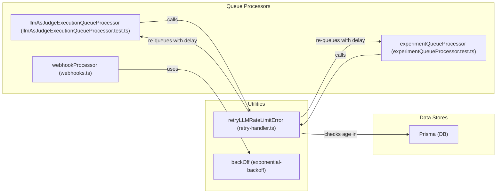
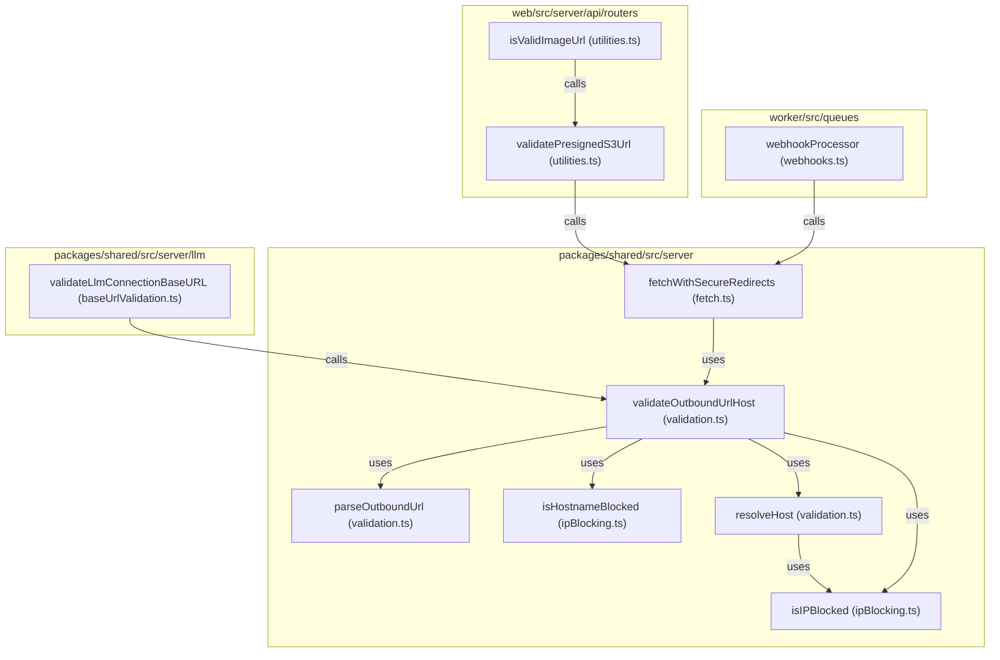

# Error Handling 및 Retries

<details>
<summary>관련 소스 파일</summary>

다음 파일들은 이 위키 페이지를 생성하는 컨텍스트로 사용되었습니다.

- [packages/shared/prisma/migrations/20250122152102_add_llm_api_keys_extra_headers/migration.sql](packages/shared/prisma/migrations/20250122152102_add_llm_api_keys_extra_headers/migration.sql)
- [packages/shared/src/domain/webhooks.ts](packages/shared/src/domain/webhooks.ts)
- [packages/shared/src/server/llm/baseUrlValidation.ts](packages/shared/src/server/llm/baseUrlValidation.ts)
- [packages/shared/src/server/llm/utils.ts](packages/shared/src/server/llm/utils.ts)
- [packages/shared/src/server/outbound-url/fetch.ts](packages/shared/src/server/outbound-url/fetch.ts)
- [packages/shared/src/server/outbound-url/validation.ts](packages/shared/src/server/outbound-url/validation.ts)
- [packages/shared/src/server/redis/evalExecutionQueue.ts](packages/shared/src/server/redis/evalExecutionQueue.ts)
- [packages/shared/src/server/redis/experimentCreateQueue.ts](packages/shared/src/server/redis/experimentCreateQueue.ts)
- [packages/shared/src/server/webhooks/ipBlocking.ts](packages/shared/src/server/webhooks/ipBlocking.ts)
- [packages/shared/src/server/webhooks/validation.ts](packages/shared/src/server/webhooks/validation.ts)
- [web/src/__tests__/server/datasets-trpc.servertest.ts](web/src/__tests__/server/datasets-trpc.servertest.ts)
- [web/src/__tests__/server/llm-api-key.servertest.ts](web/src/__tests__/server/llm-api-key.servertest.ts)
- [web/src/__tests__/server/unit/utilities.servertest.ts](web/src/__tests__/server/unit/utilities.servertest.ts)
- [web/src/server/api/routers/utilities.ts](web/src/server/api/routers/utilities.ts)
- [worker/src/__tests__/fetchLLMCompletionTimeout.test.ts](worker/src/__tests__/fetchLLMCompletionTimeout.test.ts)
- [worker/src/__tests__/ip-blocking.test.ts](worker/src/__tests__/ip-blocking.test.ts)
- [worker/src/__tests__/llm-base-url-validation.test.ts](worker/src/__tests__/llm-base-url-validation.test.ts)
- [worker/src/__tests__/outbound-connection-validation.test.ts](worker/src/__tests__/outbound-connection-validation.test.ts)
- [worker/src/__tests__/url-normalization.test.ts](worker/src/__tests__/url-normalization.test.ts)
- [worker/src/__tests__/webhook-redirect-headers.test.ts](worker/src/__tests__/webhook-redirect-headers.test.ts)
- [worker/src/__tests__/webhook-redirect.test.ts](worker/src/__tests__/webhook-redirect.test.ts)
- [worker/src/__tests__/webhook-validation.test.ts](worker/src/__tests__/webhook-validation.test.ts)
- [worker/src/__tests__/webhooks.test.ts](worker/src/__tests__/webhooks.test.ts)
- [worker/src/features/utils/index.ts](worker/src/features/utils/index.ts)
- [worker/src/features/utils/retry-handler.test.ts](worker/src/features/utils/retry-handler.test.ts)
- [worker/src/features/utils/retry-handler.ts](worker/src/features/utils/retry-handler.ts)
- [worker/src/queues/__tests__/experimentQueueProcessor.test.ts](worker/src/queues/__tests__/experimentQueueProcessor.test.ts)
- [worker/src/queues/__tests__/llmAsJudgeExecutionQueueProcessor.test.ts](worker/src/queues/__tests__/llmAsJudgeExecutionQueueProcessor.test.ts)
- [worker/src/queues/experimentQueue.ts](worker/src/queues/experimentQueue.ts)
- [worker/src/queues/utils/delays.ts](worker/src/queues/utils/delays.ts)
- [worker/src/queues/webhooks.ts](worker/src/queues/webhooks.ts)

</details>


이 문서는 Langfuse의 queue-based worker system과 API layer에서 사용하는 error handling 및 retry mechanism을 설명합니다. 다양한 failure mode에서 사용되는 retry strategy, error classification, failed job 관리를 다룹니다.

## 개요

Langfuse는 transient failure를 처리하면서 recover 불가능한 error에서는 빠르게 실패하기 위해 여러 계층의 retry logic을 구현합니다. 시스템은 네 가지 주요 failure category를 구분합니다.

1.  **Data Availability Issues**: Evaluation 또는 trace upsert가 trigger될 때 ClickHouse의 eventual consistency로 인해 observations 또는 traces가 누락되는 문제.
2.  **External Service Rate Limits**: Evaluation, playground 사용 또는 experiment generation 중 LLM provider의 429/5xx response.
3.  **Validation & Security Errors**: Invalid request data, webhook의 SSRF protection block, 잘못된 evaluation configuration.
4.  **Infrastructure Errors**: Redis connection loss, ClickHouse connection issue, S3 timeout.

각 category는 failure characteristic에 최적화된 별도의 retry strategy를 사용하며, 주로 `WorkerManager`, 특정 queue processor, utility handler 내에서 관리됩니다.

출처: [worker/src/queues/webhooks.ts:147-217](), [packages/shared/src/server/webhooks/validation.ts:28-50]()

## Error Classification 및 Retry Decision Flow

시스템은 failed job을 retry할지, delay할지, permanent error로 mark할지 결정하기 위해 hierarchical decision tree를 사용합니다.

### Job Failure Decision Logic
다음 다이어그램은 개별 processor가 다양한 error type을 처리하는 방식을 보여주며, 특히 ingestion 및 webhook execution path에 초점을 맞춥니다.

Title: "Job Failure Decision Logic"
```mermaid
graph TD
    ["Job Fails in WorkerManager"] --> CheckS3Slowdown{"isS3SlowDownError(e)?"}
    
    CheckS3Slowdown -->|Yes| MarkSlowdown["markProjectS3Slowdown(projectId)"]
    MarkSlowdown --> RethrowS3["Throw e (BullMQ Retry)"]
    
    CheckS3Slowdown -->|No| CheckWebhook{"Is Webhook Action?"}
    CheckWebhook -->|Yes| HttpRetry["backOff (Exponential)"]
    HttpRetry -->|Success| CompleteSuccess["Job Completed"]
    HttpRetry -->|Exhausted| LogError["logger.error & traceException"]
    
    CheckWebhook -->|No| GenericLog["Log Error & traceException(e)"]
    GenericLog --> RethrowGeneric["Throw e (BullMQ Default)"]
```
출처: [worker/src/queues/webhooks.ts:147-217]()

## Error Type Definitions

시스템은 fine-grained control을 가능하게 하기 위해 custom error class를 정의하고 standard exception을 사용합니다.

| Error Type | Retryable | Strategy | Use Case |
| :--- | :--- | :--- | :--- |
| `S3 Slowdown` (503) | Yes | Secondary Queue로 redirect | AWS S3 rate limiting; `markProjectS3Slowdown`을 trigger합니다. |
| `Webhook Timeout` | Yes | Exponential Backoff | 외부 webhook endpoint가 느리거나 일시적으로 down됨. |
| `DNS lookup failed` | No | Validation Error | Security check 중 webhook URL validation 실패. |
| `Blocked IP address` | No | Security Block | SSRF protection이 internal IP로의 webhook delivery를 차단. |
| `RedirectValidationError` | No | Security Block | Secure fetch가 invalid redirect target을 감지. |
| `CircularRedirectError` | No | Protocol Error | Outbound request 중 infinite redirect loop 감지. |

출처: [worker/src/queues/webhooks.ts:218-225](), [packages/shared/src/server/webhooks/validation.ts:28-50]()

## Retry Strategies

### 1. LLM Rate Limit Handling

`retryLLMRateLimitError` function [worker/src/features/utils/retry-handler.ts:49-173]()은 LLM 관련 queue job의 rate limiting 및 retry logic을 처리합니다. Exponential backoff strategy를 적용하고, 24시간보다 오래된 job은 retry하지 않습니다.

*   **Detection**: Rate limit을 나타내는 error를 catch합니다(예: LLM provider의 429 Too Many Requests, 5xx server error).
*   **Age Check**: Retry 전에 관련 record(예: `dataset_runs` 또는 `job_executions`)의 `createdAt` timestamp를 확인합니다 [worker/src/features/utils/retry-handler.ts:60-72](). Record가 `ONE_DAY_IN_MS`(24시간)보다 오래되면 retry를 건너뜁니다 [worker/src/features/utils/retry-handler.ts:74-83]().
*   **Exponential Backoff**: 다음 retry의 delay는 현재 attempt number를 기반으로 `delayFn`을 사용해 계산됩니다 [worker/src/features/utils/retry-handler.ts:86-86]().
*   **Retry Baggage**: `RetryBaggage`는 original job timestamp와 현재 retry attempt를 추적하는 데 사용됩니다 [worker/src/features/utils/retry-handler.ts:88-98]().
*   **Queueing**: Job은 계산된 delay와 함께 지정된 queue에 다시 추가됩니다 [worker/src/features/utils/retry-handler.ts:135-145]().
*   **Metrics**: Retry attempt 및 total retry delay에 대한 distribution metrics를 기록합니다 [worker/src/features/utils/retry-handler.ts:111-128]().

### 2. Webhook 및 HTTP Outbound Retries
Webhook과 automated action(Slack, GitHub Dispatch)은 network-level failure에 대해 exponential backoff strategy를 활용합니다.

*   **Implementation**: HTTP request logic을 wrapping하는 `backOff` utility를 사용합니다 [worker/src/queues/webhooks.ts:147-217]().
*   **Timeout**: Request는 `AbortController`를 사용해 `env.LANGFUSE_WEBHOOK_TIMEOUT_MS`의 적용을 받습니다 [worker/src/queues/webhooks.ts:154-157]().
*   **Status Validation**: 2xx response(GitLab case의 201 포함)만 successful로 간주됩니다. 다른 status는 retry를 trigger합니다 [worker/src/queues/webhooks.ts:210-217]().

### 3. Secure Outbound Fetching
Langfuse는 SSRF를 방지하고 redirect를 안전하게 처리하기 위해 `fetchWithSecureRedirects`를 사용합니다.

*   **Validation at Every Step**: Caller는 모든 redirect target에 대해 실행되는 `validateUrl` function을 포함하는 `redirectValidation` object를 제공합니다 [packages/shared/src/server/outbound-url/fetch.ts:87-89]().
*   **Image Validation**: Prompt playground 같은 feature에서 `isValidImageUrl`은 큰 payload를 download하지 않고 image accessibility를 검증하기 위해 secure redirect 및 timeout이 적용된 `HEAD` request를 수행합니다 [web/src/server/api/routers/utilities.ts:160-188]().

출처:
- [worker/src/features/utils/retry-handler.ts:49-173]()
- [worker/src/queues/webhooks.ts:147-217]()
- [packages/shared/src/server/outbound-url/fetch.ts:87-89]()
- [web/src/server/api/routers/utilities.ts:160-188]()

## Security Validation(SSRF Protection)

외부 connection(Webhooks, LLM Base URLs, Image URL validation)이 이루어지기 전에 시스템은 validation을 수행합니다.

*   **IP Blocking**: Hostname과 resolved IP를 loopback, private networks, cloud metadata endpoint를 포함하는 `BLOCKED_CIDRS`에 대해 확인합니다 [packages/shared/src/server/webhooks/ipBlocking.ts:4-35](). `isIPBlocked` function [packages/shared/src/server/webhooks/ipBlocking.ts:51-89]()이 이 check를 수행합니다.
*   **Hostname Blocking**: `isHostnameBlocked` [packages/shared/src/server/webhooks/ipBlocking.ts:109-144]()는 일반적인 internal hostname과 cloud metadata endpoint를 확인합니다.
*   **Whitelisting**: Self-hosted environment에서 특정 internal connection을 허용하기 위해 environment-based whitelist(`LANGFUSE_WEBHOOK_WHITELISTED_HOST`, `LANGFUSE_WEBHOOK_WHITELISTED_IPS`, `LANGFUSE_WEBHOOK_WHITELISTED_IP_SEGMENTS`)를 지원합니다 [packages/shared/src/server/webhooks/validation.ts:14-19]().
*   **URL Parsing**: Protocol을 제한(일반적으로 `https:` 또는 `http:`)하고 URL credential을 방지하기 위해 `parseOutboundUrl` [packages/shared/src/server/outbound-url/validation.ts:61-82]()를 사용합니다.
*   **LLM Base URL Validation**: `validateLlmConnectionBaseURL` [packages/shared/src/server/llm/baseUrlValidation.ts:26-56]()은 LLM connection base URL을 구체적으로 validate하며, Langfuse Cloud에서는 HTTPS를 enforce하고 whitelisting을 적용합니다.

출처:
- [packages/shared/src/server/webhooks/ipBlocking.ts:4-35]()
- [packages/shared/src/server/webhooks/ipBlocking.ts:51-89]()
- [packages/shared/src/server/webhooks/ipBlocking.ts:109-144]()
- [packages/shared/src/server/webhooks/validation.ts:14-19]()
- [packages/shared/src/server/outbound-url/validation.ts:61-82]()
- [packages/shared/src/server/llm/baseUrlValidation.ts:26-56]()
- [worker/src/__tests__/webhook-validation.test.ts:53-196]()
- [worker/src/__tests__/ip-blocking.test.ts:9-168]()
- [web/src/__tests__/server/llm-api-key.servertest.ts:187-195]()

## Monitoring 및 Dead Letter Queues(DLQ)

모든 error와 retry는 tracking을 위해 instrument됩니다.

*   **Worker Instrumentation**: `WorkerManager`는 processor를 wrapping하여 `failed` 및 `error` event의 metrics를 기록합니다.
*   **DLQ Visibility**: Admin API는 모든 sharded queue(예: `IngestionQueue`, `TraceUpsertQueue`) 전반의 DLQ length에 대한 visibility를 제공합니다.
*   **Manual Retries**: Langfuse Cloud administrator는 `/api/admin/bullmq` endpoint를 통해 특정 queue의 failed job에 대해 bulk retry를 trigger할 수 있습니다.

Title: "Retry Logic and Entity Mapping"

출처:
- [worker/src/queues/webhooks.ts:147-217]()
- [worker/src/features/utils/retry-handler.ts:49-173]()
- [worker/src/features/utils/retry-handler.test.ts:1-130]()
- [worker/src/queues/__tests__/llmAsJudgeExecutionQueueProcessor.test.ts:1-100]()
- [worker/src/queues/__tests__/experimentQueueProcessor.test.ts:1-100]()

Title: "Secure Fetch Validation Flow"

출처:
- [packages/shared/src/server/outbound-url/fetch.ts:120-124]()
- [packages/shared/src/server/outbound-url/validation.ts:84-89]()
- [packages/shared/src/server/outbound-url/validation.ts:61-82]()
- [packages/shared/src/server/webhooks/ipBlocking.ts:109-144]()
- [packages/shared/src/server/outbound-url/validation.ts:30-59]()
- [packages/shared/src/server/webhooks/ipBlocking.ts:51-89]()
- [web/src/server/api/routers/utilities.ts:160-188]()
- [web/src/server/api/routers/utilities.ts:101-148]()
- [worker/src/queues/webhooks.ts:147-217]()
- [packages/shared/src/server/llm/baseUrlValidation.ts:26-56]()
