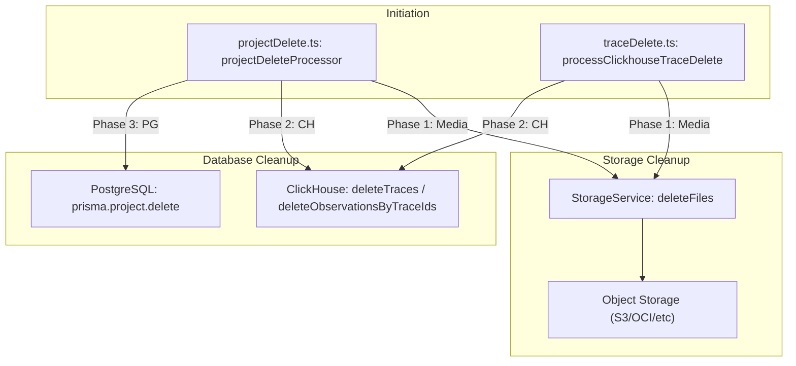
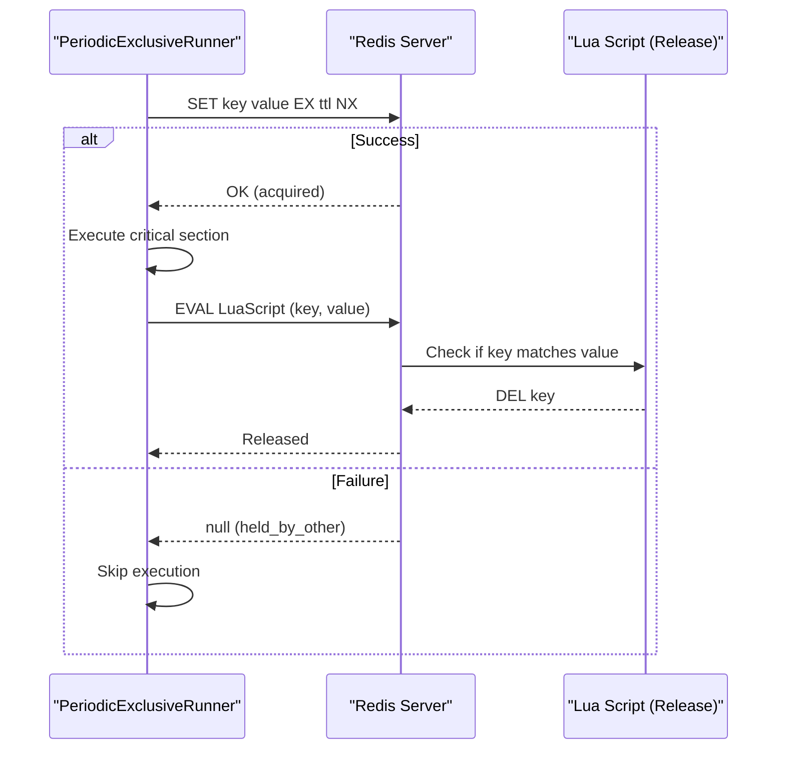

# Background Services

<details>
<summary>관련 소스 파일</summary>

다음 파일들은 이 위키 페이지를 생성하는 컨텍스트로 사용되었습니다.

- [packages/shared/src/server/data-deletion/ingestionFileDeletion.ts](packages/shared/src/server/data-deletion/ingestionFileDeletion.ts)
- [packages/shared/src/server/repositories/blobStorageLog.ts](packages/shared/src/server/repositories/blobStorageLog.ts)
- [packages/shared/src/utils/math.ts](packages/shared/src/utils/math.ts)
- [web/src/__e2e__/api.servertest.ts](web/src/__e2e__/api.servertest.ts)
- [web/src/__e2e__/otel-tenant-isolation.servertest.ts](web/src/__e2e__/otel-tenant-isolation.servertest.ts)
- [web/src/features/comments/validateCommentReferenceObject.ts](web/src/features/comments/validateCommentReferenceObject.ts)
- [web/src/server/api/routers/comments.ts](web/src/server/api/routers/comments.ts)
- [worker/src/__tests__/batchDataRetentionCleaner.test.ts](worker/src/__tests__/batchDataRetentionCleaner.test.ts)
- [worker/src/__tests__/batchProjectCleaner.test.ts](worker/src/__tests__/batchProjectCleaner.test.ts)
- [worker/src/__tests__/dataRetentionProcessing.test.ts](worker/src/__tests__/dataRetentionProcessing.test.ts)
- [worker/src/__tests__/inMemoryFilterService.test.ts](worker/src/__tests__/inMemoryFilterService.test.ts)
- [worker/src/__tests__/mediaRetentionCleaner.test.ts](worker/src/__tests__/mediaRetentionCleaner.test.ts)
- [worker/src/__tests__/projectDeletionProcessing.test.ts](worker/src/__tests__/projectDeletionProcessing.test.ts)
- [worker/src/__tests__/scoreDeletion.test.ts](worker/src/__tests__/scoreDeletion.test.ts)
- [worker/src/__tests__/traceDeletion.test.ts](worker/src/__tests__/traceDeletion.test.ts)
- [worker/src/backgroundMigrations/IBackgroundMigration.ts](worker/src/backgroundMigrations/IBackgroundMigration.ts)
- [worker/src/backgroundMigrations/addGenerationsCostBackfill.ts](worker/src/backgroundMigrations/addGenerationsCostBackfill.ts)
- [worker/src/backgroundMigrations/migrateObservationsFromPostgresToClickhouse.ts](worker/src/backgroundMigrations/migrateObservationsFromPostgresToClickhouse.ts)
- [worker/src/backgroundMigrations/migrateScoresFromPostgresToClickhouse.ts](worker/src/backgroundMigrations/migrateScoresFromPostgresToClickhouse.ts)
- [worker/src/backgroundMigrations/migrateTracesFromPostgresToClickhouse.ts](worker/src/backgroundMigrations/migrateTracesFromPostgresToClickhouse.ts)
- [worker/src/ee/cloudUsageMetering/constants.ts](worker/src/ee/cloudUsageMetering/constants.ts)
- [worker/src/ee/dataRetention/handleDataRetentionProcessingJob.ts](worker/src/ee/dataRetention/handleDataRetentionProcessingJob.ts)
- [worker/src/features/batch-data-retention-cleaner/index.ts](worker/src/features/batch-data-retention-cleaner/index.ts)
- [worker/src/features/batch-project-cleaner/index.ts](worker/src/features/batch-project-cleaner/index.ts)
- [worker/src/features/media-retention-cleaner/index.ts](worker/src/features/media-retention-cleaner/index.ts)
- [worker/src/features/scores/processClickhouseScoreDelete.ts](worker/src/features/scores/processClickhouseScoreDelete.ts)
- [worker/src/features/traces/processClickhouseTraceDelete.ts](worker/src/features/traces/processClickhouseTraceDelete.ts)
- [worker/src/queues/projectDelete.ts](worker/src/queues/projectDelete.ts)
- [worker/src/utils/RedisLock.ts](worker/src/utils/RedisLock.ts)

</details>


이 페이지는 application startup 시 worker process와 함께 시작되는 background services를 문서화합니다. 이들은 BullMQ queue system과 독립적으로 실행되는 long-running in-process loop 및 one-time initialization입니다. Timer를 기반으로 계속 동작하거나 one-shot initialization routine으로 실행됩니다.

**Scheduled 및 repeating BullMQ jobs**(예: `CloudUsageMeteringJob`)는 [7.6 Scheduled Jobs]()를 참조하세요. Queue worker 자체는 [7.1 Queue Architecture]() 및 [7.2 Worker Manager]()를 참조하세요. Background database migration에 특화된 내용은 [11.5 Database Migrations]()를 참조하세요.

---

## Startup Sequence

모든 background service는 Express app이 configure된 직후, queue worker가 등록되기 전에 `worker/src/app.ts`에서 시작됩니다. 각 service는 unconditional하게 시작되거나 feature flag 뒤에서 시작됩니다.

**Figure: Worker Startup — Background Service Initialization**

```mermaid
flowchart TD
    AppStart["worker/src/app.ts: startup"]

    AppStart --> BMM["BackgroundMigrationManager.run()"]
    AppStart --> CRSC["ClickhouseReadSkipCache.getInstance(prisma).initialize()"]
    AppStart --> QW["Queue workers registered (WorkerManager)"]
    AppStart --> BPC["BatchProjectCleaner.start() (per table)"]
    AppStart --> BDRC["BatchDataRetentionCleaner.start() (per table)"]
    AppStart --> MRC["MediaRetentionCleaner.start()"]
    AppStart --> BTDC["BatchTraceDeletionCleaner.start()"]
    AppStart --> QMR["QueueMetricsRunner.start()"]

    BMM -.->|"LANGFUSE_ENABLE_BACKGROUND_MIGRATIONS=true"| BMMRun["Runs migrations non-blocking"]
    BPC -.->|"QUEUE_CONSUMER_PROJECT_DELETE_QUEUE_IS_ENABLED=true"| BPCRun["Polling loop per ClickHouse table"]
    BDRC -.->|"LANGFUSE_BATCH_DATA_RETENTION_CLEANER_ENABLED=true"| BDRCRun["Polling loop per ClickHouse table"]
    MRC -.->|"LANGFUSE_BATCH_DATA_RETENTION_CLEANER_ENABLED=true"| MRCRun["S3 + PostgreSQL cleanup loop"]
    BTDC -.->|"LANGFUSE_BATCH_TRACE_DELETION_CLEANER_ENABLED=true"| BTDCRun["Trace deletion supplement loop"]
```



출처: `[worker/src/app.ts:112-124]`(), `[worker/src/app.ts:584-636]`()

---

## Background Migration System

### 목적

Background migration system은 application startup 또는 queue processing을 block하지 않고 large-scale data move 또는 schema update(특히 PostgreSQL과 ClickHouse 사이)를 수행할 수 있게 합니다. `BackgroundMigrationManager`가 관리하며 `LANGFUSE_ENABLE_BACKGROUND_MIGRATIONS` environment variable로 제어됩니다.

### 구현

Migration은 validation, execution, abortion을 위한 method를 정의하는 `IBackgroundMigration` interface를 구현합니다.

**Figure: Background Migration Entity Mapping**

```mermaid
flowchart LR
    subgraph "Code Entity Space"
        Interface["IBackgroundMigration"]
        Manager["BackgroundMigrationManager"]
        ObsMig["MigrateObservationsFromPostgresToClickhouse"]
        ScoreMig["MigrateScoresFromPostgresToClickhouse"]
        TraceMig["MigrateTracesFromPostgresToClickhouse"]
        CostMig["AddGenerationsCostBackfill"]
    end

    subgraph "Data Space"
        PG_Table[("PostgreSQL: background_migration")]
        CH_Table[("ClickHouse Tables")]
    end

    Interface <|-- ObsMig
    Interface <|-- ScoreMig
    Interface <|-- TraceMig
    Interface <|-- CostMig

    Manager --> ObsMig
    ObsMig --> PG_Table : "updates 'state' JSON"
    ObsMig --> CH_Table : "INSERT INTO observations"
    ScoreMig --> PG_Table : "persists 'maxDate'"
    ScoreMig --> CH_Table : "INSERT INTO scores"
```

출처: `[worker/src/backgroundMigrations/IBackgroundMigration.ts:1-8]`(), `[worker/src/backgroundMigrations/migrateObservationsFromPostgresToClickhouse.ts:14-16]`(), `[worker/src/backgroundMigrations/migrateScoresFromPostgresToClickhouse.ts:14-16]`(), `[worker/src/backgroundMigrations/migrateTracesFromPostgresToClickhouse.ts:14-16]`(), `[worker/src/backgroundMigrations/addGenerationsCostBackfill.ts:50-51]`()

### 주요 Migration Patterns

1.  **State Persistence**: Migration은 progress를 `background_migration` table의 `state` column에 저장합니다. 예를 들어 `MigrateObservationsFromPostgresToClickhouse`는 `updateMaxDate`를 사용해 마지막으로 처리한 record의 timestamp를 저장하여 restart 후 resume이 가능하게 합니다 `[worker/src/backgroundMigrations/migrateObservationsFromPostgresToClickhouse.ts:18-38]`().
2.  **Batching**: Record는 performance와 memory usage를 최적화하기 위해 `Prisma.sql` raw query를 사용해 batch(기본값 1000)로 fetch됩니다 `[worker/src/backgroundMigrations/migrateScoresFromPostgresToClickhouse.ts:100-108]`().
3.  **Validation**: 실행 전에 migration은 prerequisite를 verify합니다. `MigrateScoresFromPostgresToClickhouse`는 ClickHouse credential과 destination table의 존재 여부를 확인합니다 `[worker/src/backgroundMigrations/migrateScoresFromPostgresToClickhouse.ts:18-59]`().
4.  **Cost Backfilling**: `AddGenerationsCostBackfill`은 model price와 token count를 기반으로 `calculated_input_cost` 및 `calculated_output_cost`를 update하기 위해 PostgreSQL에서 복잡한 계산을 수행합니다 `[worker/src/backgroundMigrations/addGenerationsCostBackfill.ts:121-151]`().

---

## ClickhouseReadSkipCache

### 목적

`ClickhouseReadSkipCache`는 ingestion pipeline을 위한 optimization입니다. Event ingestion 중 시스템은 일반적으로 update를 merge하기 위해 ClickHouse에서 read합니다. Data가 S3-staging path를 통해서만 처리되는 newer project에서는 이러한 read가 불필요합니다. 이 cache는 read operation을 안전하게 건너뛸 수 있는 project ID를 추적합니다.

### Configuration

Cache는 `worker/src/app.ts`에서 startup 시 initialize되며 다음을 고려합니다.
-   **Static IDs**: `LANGFUSE_SKIP_INGESTION_CLICKHOUSE_READ_PROJECT_IDS`를 통해 제공됩니다 `[worker/src/env.ts:150]`().
-   **Creation Date**: `LANGFUSE_SKIP_INGESTION_CLICKHOUSE_READ_MIN_PROJECT_CREATE_DATE`의 날짜 이후 생성된 project `[worker/src/env.ts:153]`().

출처: `[worker/src/app.ts:119-124]`(), `[worker/src/env.ts:150-155]`()

---

## Batch Cleaner Services

Langfuse는 `PeriodicExclusiveRunner`를 상속하는 여러 "cleaner" service를 사용합니다. 이러한 service는 `RedisLock`을 사용해 특정 cleanup task를 한 번에 하나의 worker instance만 처리하도록 보장합니다.

### MediaRetentionCleaner

Project별 `retention_days`를 기반으로 media file(S3/PostgreSQL)과 blob storage entry 삭제를 처리합니다.

-   **Workflow**:
    1.  `getTopProjectWorkload`를 통해 expired media가 가장 많은 project를 찾도록 PostgreSQL을 query합니다 `[worker/src/features/media-retention-cleaner/index.ts:116-155]`().
    2.  `getRetentionCutoffDate`를 사용해 `cutoffDate`를 계산합니다 `[worker/src/features/media-retention-cleaner/index.ts:152]`().
    3.  `deleteMediaFiles`를 통해 S3에서 file을 삭제하고 PostgreSQL metadata를 제거합니다 `[worker/src/features/media-retention-cleaner/index.ts:177-209]`().
    4.  `LANGFUSE_ENABLE_BLOB_STORAGE_FILE_LOG`가 활성화되어 있으면 `removeIngestionEventsFromS3AndDeleteClickhouseRefsForProject`를 호출하여 blob storage를 clean up합니다 `[worker/src/features/media-retention-cleaner/index.ts:164-169]`().

### BatchDataRetentionCleaner

ClickHouse tables(`traces`, `observations`, `scores`, `events_full`, `events_core`)에서 expired data를 bulk delete합니다.

-   **Implementation**:
    -   ClickHouse query에서 hashed project ID(`toParamKey`)를 사용해 index mismatch bug를 방지하고 `OR` condition을 효율적으로 처리합니다 `[worker/src/features/batch-data-retention-cleaner/index.ts:53-96]`().
    -   `TIMESTAMP_COLUMN_MAP`에 정의된 table별 특정 timestamp column(예: `observations`의 `start_time`, `traces`의 `timestamp`)을 target으로 합니다 `[worker/src/features/batch-data-retention-cleaner/index.ts:34-40]`().

### BatchProjectCleaner

Soft-delete된 project(PostgreSQL에서 `deleted_at`이 설정된 경우)에 대한 data deletion을 처리합니다.

-   **Workflow**:
    1.  `getDeletedProjects`를 통해 PostgreSQL에서 deleted project를 fetch합니다.
    2.  작업이 필요한지 판단하기 위해 ClickHouse에서 existing count를 확인합니다.
    3.  Distributed lock 아래에서 ClickHouse의 `DELETE` command를 실행합니다.

출처: `[worker/src/app.ts:83-93]`(), `[worker/src/features/batch-project-cleaner/index.ts:25-30]`()

---

## Data Deletion Logic

Project 또는 특정 trace가 삭제되면 background logic이 ClickHouse 및 object storage(S3/Azure/GCS/OCI)의 관련 data도 purge되도록 보장합니다.

**Figure: Data Deletion Flow**



출처: `[worker/src/queues/projectDelete.ts:21-72]`(), `[worker/src/features/traces/processClickhouseTraceDelete.ts:121-154]`(), `[packages/shared/src/server/services/StorageService.ts:120-120]`()

### Trace 및 Project Deletion Details
- **Project Deletion**: `projectDeleteProcessor`는 먼저 S3에서 media를 삭제한 다음 ClickHouse tables(`traces`, `observations`, `scores`, `events`)를 비우고, 마지막으로 PostgreSQL에서 project record를 삭제합니다 `[worker/src/queues/projectDelete.ts:41-99]`().
- **Trace Deletion**: `processClickhouseTraceDelete`는 ClickHouse에서 record를 purge하기 전에 특정 trace가 참조하는 media item(및 orphaned media)을 clean up합니다 `[worker/src/features/traces/processClickhouseTraceDelete.ts:15-119]`().
- **Data Retention**: `handleDataRetentionProcessingJob`은 stale job이 data를 과도하게 delete하는 것을 방지하기 위해 DB에서 현재 retention setting을 다시 fetch합니다 `[worker/src/ee/dataRetention/handleDataRetentionProcessingJob.ts:26-39]`().

---

## Redis Distributed Locking

`RedisLock` class는 background service를 위한 coordination mechanism을 제공합니다.

**Figure: RedisLock Acquisition Flow**



출처: `[worker/src/utils/RedisLock.ts:54-60]`(), `[worker/src/utils/RedisLock.ts:117-152]`()

### Locking Behaviors

-   **Unique Ownership**: 각 lock attempt는 value로 `randomUUID`를 사용하여 worker가 실제로 소유한 lock만 release하도록 보장합니다 `[worker/src/utils/RedisLock.ts:77]`().
-   **Atomic Release**: 삭제 전에 value를 확인하는 Lua script를 사용하여 worker가 이미 expire되고 다른 instance가 다시 acquire한 lock을 삭제할 수 있는 race condition을 방지합니다 `[worker/src/utils/RedisLock.ts:54-60]`().
-   **Unavailable Behavior**: Redis가 down된 경우 `proceed`(optimistic) 또는 `fail`(pessimistic) 중 하나를 선택하도록 `OnUnavailableBehavior`로 configure할 수 있습니다 `[worker/src/utils/RedisLock.ts:7-11]`().

---

## Summary Table

| Service | Class | Purpose | Data Store |
| :--- | :--- | :--- | :--- |
| **Migration** | `BackgroundMigrationManager` | Resumable data moves | PG & ClickHouse |
| **Read Cache** | `ClickhouseReadSkipCache` | Ingestion performance | In-memory |
| **Media Cleanup** | `MediaRetentionCleaner` | Retention enforcement | S3 & PG |
| **Batch Retention** | `BatchDataRetentionCleaner` | Bulk row expiry | ClickHouse |
| **Project Cleanup** | `BatchProjectCleaner` | Soft-delete cleanup | ClickHouse |

출처: `[worker/src/app.ts:109-636]`(), `[worker/src/features/batch-data-retention-cleaner/index.ts:18-24]`()
