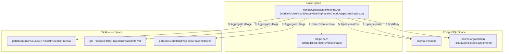
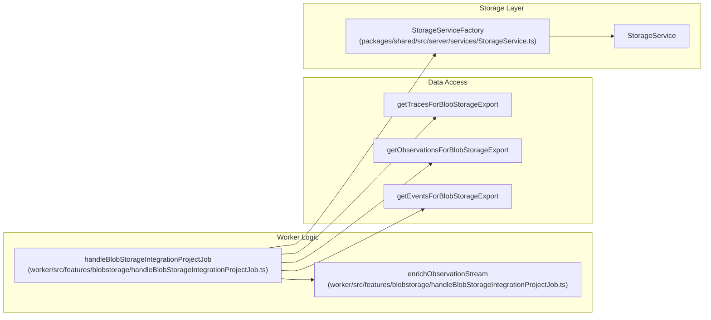
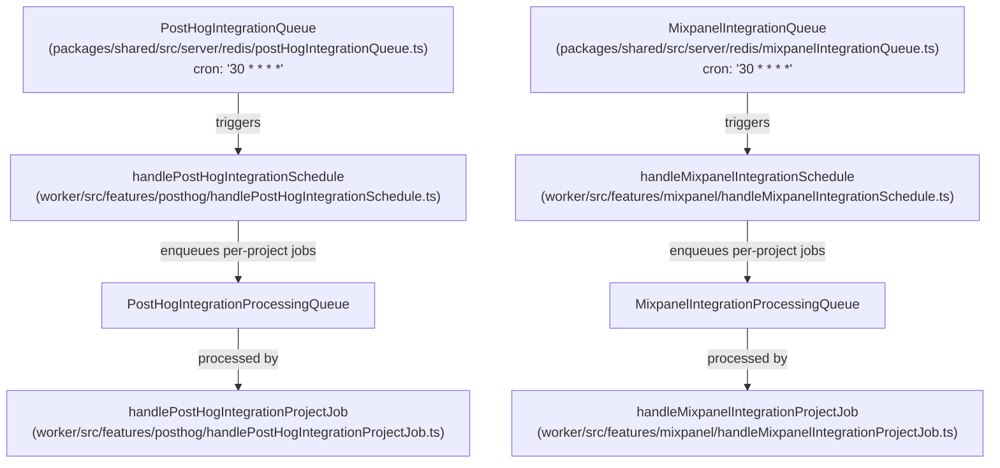

# Scheduled Jobs

<details>
<summary>관련 소스 파일</summary>

다음 파일들은 이 위키 페이지를 생성하는 컨텍스트로 사용되었습니다.

- [fern/apis/server/definition/blob-storage-integrations.yml](fern/apis/server/definition/blob-storage-integrations.yml)
- [packages/shared/src/features/analytics-integrations/index.ts](packages/shared/src/features/analytics-integrations/index.ts)
- [packages/shared/src/server/analytics-integrations/types.ts](packages/shared/src/server/analytics-integrations/types.ts)
- [packages/shared/src/server/services/StorageService.ts](packages/shared/src/server/services/StorageService.ts)
- [web/src/__tests__/blob-storage-form-field-groups.clienttest.ts](web/src/__tests__/blob-storage-form-field-groups.clienttest.ts)
- [web/src/__tests__/server/blob-storage-integration-api.servertest.ts](web/src/__tests__/server/blob-storage-integration-api.servertest.ts)
- [web/src/__tests__/server/blob-storage-integration-trpc.servertest.ts](web/src/__tests__/server/blob-storage-integration-trpc.servertest.ts)
- [web/src/__tests__/server/mixpanel-integration.servertest.ts](web/src/__tests__/server/mixpanel-integration.servertest.ts)
- [web/src/__tests__/server/posthog-integration.servertest.ts](web/src/__tests__/server/posthog-integration.servertest.ts)
- [web/src/features/blobstorage-integration/blobstorage-integration-router.ts](web/src/features/blobstorage-integration/blobstorage-integration-router.ts)
- [web/src/features/blobstorage-integration/service.ts](web/src/features/blobstorage-integration/service.ts)
- [web/src/features/blobstorage-integration/types.ts](web/src/features/blobstorage-integration/types.ts)
- [web/src/features/evals/components/evaluator-table.tsx](web/src/features/evals/components/evaluator-table.tsx)
- [web/src/features/evals/components/inner-evaluator-form.tsx](web/src/features/evals/components/inner-evaluator-form.tsx)
- [web/src/features/evals/server/router.ts](web/src/features/evals/server/router.ts)
- [web/src/features/mixpanel-integration/mixpanel-integration-router.ts](web/src/features/mixpanel-integration/mixpanel-integration-router.ts)
- [web/src/features/mixpanel-integration/types.ts](web/src/features/mixpanel-integration/types.ts)
- [web/src/features/posthog-integration/posthog-integration-router.ts](web/src/features/posthog-integration/posthog-integration-router.ts)
- [web/src/features/public-api/types/blob-storage-integrations.ts](web/src/features/public-api/types/blob-storage-integrations.ts)
- [web/src/pages/api/public/integrations/blob-storage/index.ts](web/src/pages/api/public/integrations/blob-storage/index.ts)
- [web/src/pages/project/[projectId]/settings/integrations/blobstorage.tsx](web/src/pages/project/[projectId]/settings/integrations/blobstorage.tsx)
- [web/src/pages/project/[projectId]/settings/integrations/mixpanel.tsx](web/src/pages/project/[projectId]/settings/integrations/mixpanel.tsx)
- [web/src/pages/project/[projectId]/settings/integrations/posthog.tsx](web/src/pages/project/[projectId]/settings/integrations/posthog.tsx)
- [worker/src/__tests__/blobStorageIntegrationProcessing.test.ts](worker/src/__tests__/blobStorageIntegrationProcessing.test.ts)
- [worker/src/__tests__/enrichObservationStream.unit.test.ts](worker/src/__tests__/enrichObservationStream.unit.test.ts)
- [worker/src/__tests__/evalService.filtering.test.ts](worker/src/__tests__/evalService.filtering.test.ts)
- [worker/src/__tests__/evalService.test.ts](worker/src/__tests__/evalService.test.ts)
- [worker/src/__tests__/mixpanelTransformers.test.ts](worker/src/__tests__/mixpanelTransformers.test.ts)
- [worker/src/__tests__/storageservice.test.ts](worker/src/__tests__/storageservice.test.ts)
- [worker/src/ee/cloudUsageMetering/handleCloudUsageMeteringJob.ts](worker/src/ee/cloudUsageMetering/handleCloudUsageMeteringJob.ts)
- [worker/src/features/blobstorage/handleBlobStorageIntegrationProjectJob.ts](worker/src/features/blobstorage/handleBlobStorageIntegrationProjectJob.ts)
- [worker/src/features/evaluation/evalService.ts](worker/src/features/evaluation/evalService.ts)
- [worker/src/features/mixpanel/handleMixpanelIntegrationProjectJob.ts](worker/src/features/mixpanel/handleMixpanelIntegrationProjectJob.ts)
- [worker/src/features/mixpanel/mixpanelClient.ts](worker/src/features/mixpanel/mixpanelClient.ts)
- [worker/src/features/mixpanel/transformers.ts](worker/src/features/mixpanel/transformers.ts)
- [worker/src/features/posthog/handlePostHogIntegrationProjectJob.ts](worker/src/features/posthog/handlePostHogIntegrationProjectJob.ts)
- [worker/src/features/posthog/transformers.ts](worker/src/features/posthog/transformers.ts)
- [worker/src/queues/batchExportQueue.ts](worker/src/queues/batchExportQueue.ts)
- [worker/src/queues/cloudUsageMeteringQueue.ts](worker/src/queues/cloudUsageMeteringQueue.ts)
- [worker/src/queues/evalQueue.ts](worker/src/queues/evalQueue.ts)

</details>


이 페이지는 Langfuse worker process에서 실행되는 recurring 및 scheduled job을 문서화합니다. 이들은 event-driven queue processor가 아니라 time-driven job입니다. User action(eval execution, batch export, trace delete 등)으로 trigger되는 one-off queue processor 문서는 [7.3]() 페이지를 참조하세요. Worker boot 시 시작되어 지속적으로 실행되는 background service는 [7.5]() 페이지를 참조하세요.

---

## Scheduled Job Inventory

모든 scheduled job은 BullMQ repeating job으로 구현됩니다. Schedule은 queue singleton이 initialize될 때, 일반적으로 worker startup 시 등록됩니다.

| Queue Class | Queue Name Constant | Cron Pattern | Frequency | Schedule Registered In |
|---|---|---|---|---|
| `EventPropagationQueue` | `QueueName.EventPropagationQueue` | `* * * * *` | 매분 | [packages/shared/src/server/redis/eventPropagationQueue.ts:13-68]() |
| `PostHogIntegrationQueue` | `QueueName.PostHogIntegrationQueue` | `30 * * * *` | 매시 30분 | [packages/shared/src/server/redis/postHogIntegrationQueue.ts:15-85]() |
| `MixpanelIntegrationQueue` | `QueueName.MixpanelIntegrationQueue` | `30 * * * *` | 매시 30분 | [packages/shared/src/server/redis/mixpanelIntegrationQueue.ts:15-85]() |
| `BlobStorageIntegrationQueue` | `QueueName.BlobStorageIntegrationQueue` | hourly | 매시간 | [packages/shared/src/server/redis/blobStorageIntegrationQueue.ts:1-30]() |
| `CloudUsageMeteringQueue` | `QueueName.CloudUsageMeteringQueue` | hourly | 매시간 | [packages/shared/src/server/redis/cloudUsageMeteringQueue.ts:1-30]() |

**Concurrency notes:** `EventPropagationQueue`는 sequential partition processing을 enforce하기 위해 global concurrency를 1로 설정합니다. Analytics integration queue는 fan-out을 위해 별도의 per-project processing queue(`PostHogIntegrationProcessingQueue`, `MixpanelIntegrationProcessingQueue`)를 사용합니다.

출처: [packages/shared/src/server/redis/eventPropagationQueue.ts:13-68](), [packages/shared/src/server/redis/postHogIntegrationQueue.ts:15-85](), [packages/shared/src/server/redis/mixpanelIntegrationQueue.ts:15-85](), [packages/shared/src/server/redis/blobStorageIntegrationQueue.ts:1-30]()

---

## Cloud Usage Metering Cron

**목적:** Organization-level usage metrics(traces, observations, scores)를 계산하고 billing을 위해 Stripe에 report합니다. 이 job은 Langfuse Cloud(EE) environment 전용입니다.

**구현:** `handleCloudUsageMeteringJob` function은 시간당 exactly-once processing을 보장하기 위해 PostgreSQL의 `CronJobs` table 안에서 custom cron state를 관리합니다 [worker/src/ee/cloudUsageMetering/handleCloudUsageMeteringJob.ts:34-42]().

### Execution Flow

1. **State Management:** `cloud-usage-metering`에 대해 `CronJobs` table을 확인합니다. `lastRun`이 정각 기준인지, 다른 job이 현재 `Processing` 상태가 아닌지 보장합니다 [worker/src/ee/cloudUsageMetering/handleCloudUsageMeteringJob.ts:34-72]().
2. **Data Collection:** 마지막 full hour interval 내 usage count를 ClickHouse에 query합니다.
    - `getObservationCountsByProjectInCreationInterval` [worker/src/ee/cloudUsageMetering/handleCloudUsageMeteringJob.ts:138-141]()
    - `getTraceCountsByProjectInCreationInterval` [worker/src/ee/cloudUsageMetering/handleCloudUsageMeteringJob.ts:142-145]()
    - `getScoreCountsByProjectInCreationInterval` [worker/src/ee/cloudUsageMetering/handleCloudUsageMeteringJob.ts:146-149]()
3. **Stripe Reporting:** `stripe.customerId`가 있는 각 organization에 대해 Stripe로 `meterEvents`를 전송합니다 [worker/src/ee/cloudUsageMetering/handleCloudUsageMeteringJob.ts:162-211]().
    - **Legacy Meter:** `tracing_observations`(observations count) [worker/src/ee/cloudUsageMetering/handleCloudUsageMeteringJob.ts:199-206]().
    - **Unified Meter:** `events`(traces + observations + scores의 합) [worker/src/ee/cloudUsageMetering/handleCloudUsageMeteringJob.ts:220-238]().
4. **Completion:** 새 `lastRun` timestamp로 `CronJobs` record를 update하고 state를 다시 `Queued`로 설정합니다 [worker/src/ee/cloudUsageMetering/handleCloudUsageMeteringJob.ts:275-285]().

**Cloud Usage Metering — Code Entities**



출처: [worker/src/ee/cloudUsageMetering/handleCloudUsageMeteringJob.ts:27-285](), [worker/src/queues/cloudUsageMeteringQueue.ts:14-70]()

---

## Blob Storage Integration Job

**목적:** Project data(traces, observations, scores, events)를 customer-managed blob storage(S3, Azure 또는 GCS)로 주기적으로 export합니다.

**구현:** `handleBlobStorageIntegrationProjectJob`은 특정 project와 table에 대한 실제 data transfer를 처리합니다 [worker/src/features/blobstorage/handleBlobStorageIntegrationProjectJob.ts:203-205]().

1. **Timestamp Resolution:** `lastSyncAt` 또는 `exportMode`(FULL_HISTORY, FROM_TODAY, FROM_CUSTOM_DATE)를 기반으로 `minTimestamp`를 결정합니다. `FULL_HISTORY`의 경우 모든 table에서 minimum timestamp를 찾기 위해 ClickHouse를 query합니다 [worker/src/features/blobstorage/handleBlobStorageIntegrationProjectJob.ts:95-158]().
2. **Data Fetching:** `getTracesForBlobStorageExport`, `getObservationsForBlobStorageExport`, `getEventsForBlobStorageExport` 같은 specialized function을 사용해 ClickHouse에서 data를 stream합니다 [worker/src/features/blobstorage/handleBlobStorageIntegrationProjectJob.ts:12-15]().
3. **Model Enrichment:** Observations의 경우 `enrichObservationStream` generator 안에서 `createModelCache`와 `enrichObservationWithModelData`를 사용해 stream이 model pricing data로 enrich됩니다 [worker/src/features/blobstorage/handleBlobStorageIntegrationProjectJob.ts:40-81]().
4. **Compression:** Integration이 `compressed`로 configure된 경우 stream을 선택적으로 `createGzip()`에 pipe합니다 [worker/src/features/blobstorage/handleBlobStorageIntegrationProjectJob.ts:2-4]().
5. **Manual Trigger:** 사용자는 `blobStorageIntegrationRouter`의 `runNow` mutation을 통해 즉시 export를 trigger할 수 있습니다 [web/src/features/blobstorage-integration/blobstorage-integration-router.ts:181-223]().

**Blob Storage Export — Code Entities**



출처: [worker/src/features/blobstorage/handleBlobStorageIntegrationProjectJob.ts:38-260](), [web/src/features/blobstorage-integration/blobstorage-integration-router.ts:181-223](), [packages/shared/src/server/services/StorageService.ts:188-220]()

---

## Analytics Integration Schedulers

PostHog 및 Mixpanel integration은 모두 two-tier pattern을 사용합니다.

1. **Scheduler queue**(cron-driven, 매시 30분 실행) — enabled integration 전체를 찾기 위해 Postgres를 query한 다음, project별 job 하나씩을 **processing queue**로 fan-out합니다.
2. **Processing queue**(event-driven) — 각 job은 하나의 project를 처리합니다. ClickHouse에서 data를 fetch하고, service SDK를 사용해 external service로 stream하며, `lastSyncAt`을 update합니다.

**Two-tier Analytics Scheduler Architecture**



출처: [packages/shared/src/server/redis/postHogIntegrationQueue.ts:15-85](), [packages/shared/src/server/redis/mixpanelIntegrationQueue.ts:15-85](), [worker/src/features/posthog/handlePostHogIntegrationProjectJob.ts:1-20](), [worker/src/features/mixpanel/handleMixpanelIntegrationProjectJob.ts:1-20]()

---

## Batch Export Job

**목적:** UI에서 large dataset을 CSV 또는 JSON format으로 user-initiated export하는 작업을 처리합니다. 사용자가 trigger하는 경우가 많지만, worker가 처리하는 background task입니다.

**구현:**
- `batchExportQueueProcessor`는 `batchExportId`를 받습니다 [worker/src/queues/batchExportQueue.ts:14-16]().
- Heavy lifting을 수행하기 위해 `handleBatchExportJob`을 호출합니다 [worker/src/queues/batchExportQueue.ts:19-19]().
- 실패 시 PostgreSQL의 `batchExport` record를 `FAILED` status 및 error log로 update합니다 [worker/src/queues/batchExportQueue.ts:34-44]().

출처: [worker/src/queues/batchExportQueue.ts:1-53]()

---

## Queue Registration Pattern

모든 scheduled queue는 동일한 singleton registration pattern을 따릅니다. Cron job은 `getInstance()` 안에서 추가되어 process lifetime 동안 한 번만 등록됩니다.

```typescript
// Typical registration pattern in Queue classes
public static getInstance(): TQueue | null {
  if (!this.instance) {
    this.instance = new BullMQ.Queue(QueueName.X, { connection });
    this.instance.add(
      QueueJobs.ScheduledJob,
      {},
      { repeat: { pattern: "0 * * * *" } } // Hourly example
    );
  }
  return this.instance;
}
```

출처: [packages/shared/src/server/redis/eventPropagationQueue.ts:13-67](), [packages/shared/src/server/redis/postHogIntegrationQueue.ts:15-85](), [packages/shared/src/server/redis/blobStorageIntegrationQueue.ts:1-30]()
