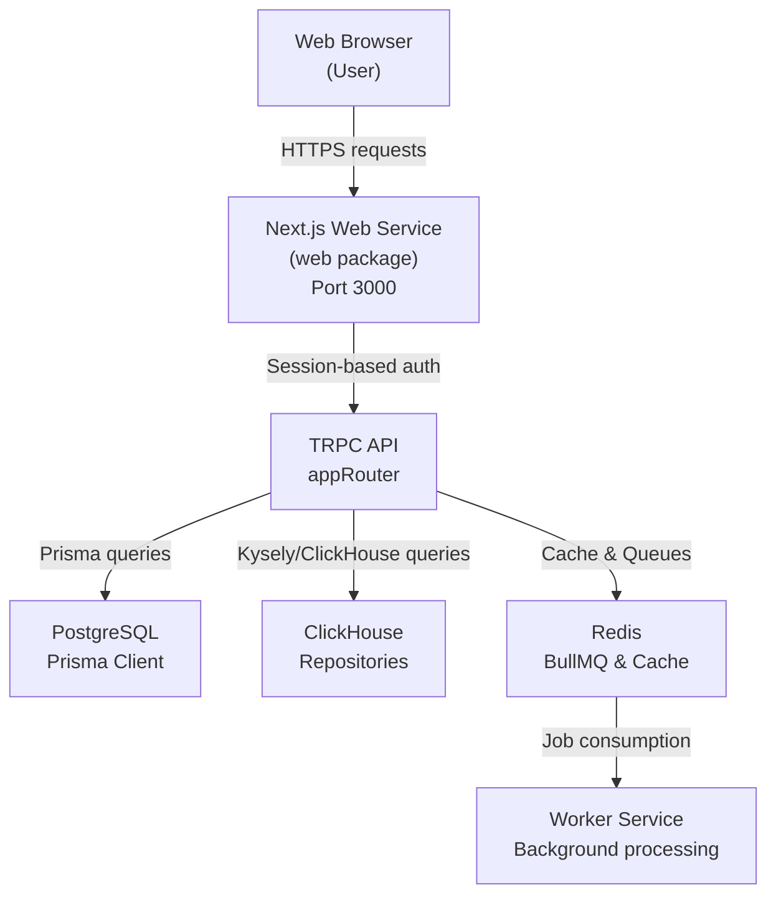
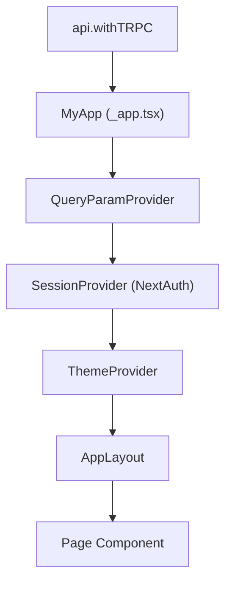
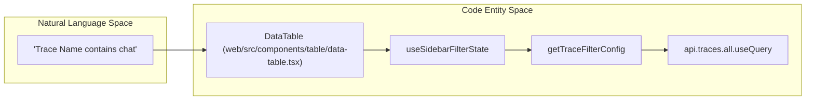
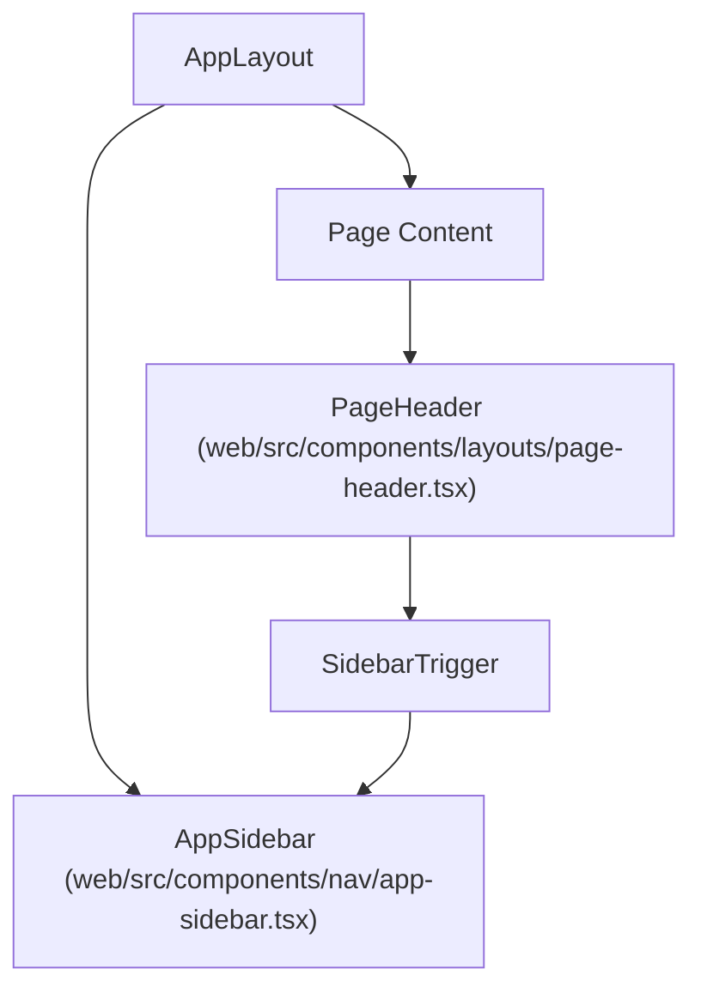

# 웹 애플리케이션

관련 소스 파일

이 위키 페이지를 생성하기 위한 컨텍스트로 다음 파일들이 사용되었습니다.

- [packages/shared/src/server/tableMappings/mapScoresColumnsTable.ts](packages/shared/src/server/tableMappings/mapScoresColumnsTable.ts)
- [web/instrumentation-client.ts](web/instrumentation-client.ts)
- [web/next.config.mjs](web/next.config.mjs)
- [web/playwright.config.ts](web/playwright.config.ts)
- [web/src/__e2e__/auth.spec.ts](web/src/__e2e__/auth.spec.ts)
- [web/src/__tests__/redirect.clienttest.ts](web/src/__tests__/redirect.clienttest.ts)
- [web/src/components/error-page.tsx](web/src/components/error-page.tsx)
- [web/src/components/grouped-score-badge.tsx](web/src/components/grouped-score-badge.tsx)
- [web/src/components/layouts/app-layout/hooks/useAuthGuard.ts](web/src/components/layouts/app-layout/hooks/useAuthGuard.ts)
- [web/src/components/layouts/app-layout/hooks/useAuthSession.ts](web/src/components/layouts/app-layout/hooks/useAuthSession.ts)
- [web/src/components/layouts/app-layout/hooks/useFilteredNavigation.ts](web/src/components/layouts/app-layout/hooks/useFilteredNavigation.ts)
- [web/src/components/layouts/app-layout/hooks/useLayoutConfiguration.ts](web/src/components/layouts/app-layout/hooks/useLayoutConfiguration.ts)
- [web/src/components/layouts/app-layout/hooks/useLayoutMetadata.ts](web/src/components/layouts/app-layout/hooks/useLayoutMetadata.ts)
- [web/src/components/layouts/app-layout/hooks/useProjectAccess.ts](web/src/components/layouts/app-layout/hooks/useProjectAccess.ts)
- [web/src/components/layouts/app-layout/index.tsx](web/src/components/layouts/app-layout/index.tsx)
- [web/src/components/layouts/app-layout/utils/navigationFilters.types.ts](web/src/components/layouts/app-layout/utils/navigationFilters.types.ts)
- [web/src/components/layouts/page-header.tsx](web/src/components/layouts/page-header.tsx)
- [web/src/components/nav/app-sidebar.tsx](web/src/components/nav/app-sidebar.tsx)
- [web/src/components/nav/nav-main.tsx](web/src/components/nav/nav-main.tsx)
- [web/src/components/scores-table-cell.tsx](web/src/components/scores-table-cell.tsx)
- [web/src/components/ui/hover-card.tsx](web/src/components/ui/hover-card.tsx)
- [web/src/components/ui/sidebar.tsx](web/src/components/ui/sidebar.tsx)
- [web/src/components/ui/tooltip.tsx](web/src/components/ui/tooltip.tsx)
- [web/src/features/experiments/components/ExperimentsBetaSwitch.tsx](web/src/features/experiments/components/ExperimentsBetaSwitch.tsx)
- [web/src/features/organizations/components/ProjectOverview.tsx](web/src/features/organizations/components/ProjectOverview.tsx)
- [web/src/features/scores/hooks/useScoreColumns.ts](web/src/features/scores/hooks/useScoreColumns.ts)
- [web/src/hooks/useTrpcError.tsx](web/src/hooks/useTrpcError.tsx)
- [web/src/instrumentation.ts](web/src/instrumentation.ts)
- [web/src/pages/_app.tsx](web/src/pages/_app.tsx)
- [web/src/pages/api/trpc/[trpc].ts](web/src/pages/api/trpc/[trpc].ts)
- [web/src/pages/auth/error.tsx](web/src/pages/auth/error.tsx)
- [web/src/pages/project/[projectId]/datasets/[datasetId]/compare/charts.tsx](web/src/pages/project/[projectId]/datasets/[datasetId]/compare/charts.tsx)
- [web/src/pages/project/[projectId]/datasets/[datasetId]/compare/index.tsx](web/src/pages/project/[projectId]/datasets/[datasetId]/compare/index.tsx)
- [web/src/utils/api.ts](web/src/utils/api.ts)
- [web/src/utils/redirect.ts](web/src/utils/redirect.ts)

웹 애플리케이션은 Next.js 애플리케이션으로 구현된 Langfuse의 기본 사용자 인터페이스입니다. 관찰 가능성 대시보드, trace 탐색, prompt 관리, 평가 설정, 시스템 관리를 위한 UI를 제공합니다. 이 애플리케이션은 type-safe tRPC API를 통해 backend와 통신하며 PostgreSQL(metadata)과 ClickHouse(observability data) 양쪽의 데이터를 렌더링합니다.

**더 큰 시스템과의 관계:**

출처: [web/src/pages/api/trpc/[trpc].ts:17-54](), [web/src/utils/api.ts:178-216]()

이 페이지는 웹 아키텍처에 대한 상위 수준 개요를 제공합니다. 특정 하위 시스템의 자세한 내용은 다음 하위 페이지를 참조하세요.

- [애플리케이션 구조](#8.1) — Next.js App Router 사용, middleware, page 구성.
- [테이블 컴포넌트 시스템](#8.2) — 재사용 가능한 `DataTable`과 특화된 table 정의(Traces, Observations, Scores).
- [UI 상태 관리](#8.3) — pagination, ordering, `use-query-params`를 통한 URL persistence를 위한 custom hook.
- [Trace & Session 뷰](#8.4) — trace tree 시각화, timeline, event에서 synthetic trace를 구성하는 V4 Beta viewer.
- [가상화와 성능](#8.5) — 대규모 dataset과 lazy loading을 위한 `@tanstack/react-virtual` 전략.
- [Filter & View 시스템](#8.6) — `PopoverFilterBuilder`, operator logic, 저장된 `TableViewPresets`.
- [Batch Actions & Selection](#8.7) — `useSelectAll` hook과 deletion, tagging, dataset addition 같은 bulk operation.

---

## 기술 스택

웹 애플리케이션은 `web/` workspace에 있습니다. 인터페이스 대부분에는 Next.js Pages Router를 사용하며, styling에는 최신 React 19 기능과 Tailwind CSS를 통합합니다.

| 분류 | Library / Version |
|---|---|
| Framework | Next.js 15 (Pages Router) |
| UI runtime | React 19 |
| Styling | Tailwind CSS |
| Data Fetching | tRPC 11 + `@tanstack/react-query` 5 |
| State Persistence | `NextAdapterPages`와 함께 사용하는 `use-query-params` |
| Tables | `@tanstack/react-table` 8 + `@tanstack/react-virtual` 3 |
| Authentication | NextAuth.js 4 |
| Error Tracking | Sentry (`@sentry/nextjs`) |
| Analytics | PostHog JS |

출처: [web/src/pages/_app.tsx:1-30](), [web/src/utils/api.ts:178-230](), [web/next.config.mjs:49-56]()

---

## 핵심 아키텍처와 초기화

### Client-Side Entrypoint
애플리케이션은 `_app.tsx`에서 여러 provider로 감싸져 theming, tooltip, command menu, session management를 처리합니다. `_app.tsx`에는 Google Translate가 text node를 `` element로 감싸 DOM을 수정할 때 발생하는 React crash를 방지하기 위한 주목할 만한 polyfill이 구현되어 있습니다. 이 polyfill은 `removeChild`와 `insertBefore`에서 발생하는 `NotFoundError` 예외를 catch합니다.

출처: [web/src/pages/_app.tsx:39-70](), [web/src/pages/_app.tsx:108-171]()

### Data Table 아키텍처
UI는 중앙화된 `DataTable` component에 크게 의존합니다. 이 component는 "Natural Language Space"(예: "Trace Name contains 'chat'" 같은 사용자 filter)와 "Code Entity Space"(SQL filter와 tRPC parameter)를 연결합니다.

출처: [web/src/components/table/data-table.tsx:156-182](), [web/src/features/filters/hooks/useSidebarFilterState.ts:1-20]()

### Instrumentation & Observability
Server-side initialization script(OpenTelemetry와 system initialization)는 `instrumentation.ts`에서 처리됩니다. Client-side error tracking은 `instrumentation-client.ts`에서 Sentry를 통해 관리됩니다. `next.config.mjs`는 PostHog와 Stripe 같은 필요한 외부 service를 허용하면서 애플리케이션을 보호하기 위해 엄격한 Content Security Policy(CSP) header를 정의합니다.

출처: [web/src/instrumentation.ts:1-15](), [web/instrumentation-client.ts:8-90](), [web/next.config.mjs:13-29]()

---

## Navigation & UI Layout

### Sidebar and Header
애플리케이션은 `SIDEBAR_STORAGE_KEY`를 사용해 `localStorage`에 상태(expanded/collapsed)를 유지하는 responsive `Sidebar` system을 사용합니다. `PageHeader` component는 앱 전반에 걸쳐 일관된 breadcrumb, action button, environment label을 제공합니다.

출처: [web/src/components/ui/sidebar.tsx:23-48](), [web/src/components/nav/app-sidebar.tsx:43-72](), [web/src/components/layouts/page-header.tsx:57-106]()

### Project and Organization Overview
사용자의 진입점은 organization별로 grouping된 project tile을 렌더링하는 `OrganizationProjectOverview`입니다. 사용자가 새 project를 생성하거나 member를 볼 수 있는지 판단하기 위해 `useHasOrganizationAccess`를 사용합니다.

출처: [web/src/features/organizations/components/ProjectOverview.tsx:37-77](), [web/src/features/organizations/components/ProjectOverview.tsx:109-154]()

---

## API & Error Handling

### tRPC Integration
애플리케이션은 tRPC configuration에서 `splitLink`를 사용합니다. 현재는 특정 query pattern의 성능을 최적화하기 위해 모든 request에 대해 batching을 건너뛰는 방식(`alwaysSkipBatch = true`)을 기본값으로 사용하며, request를 `httpLink`를 통해 `/api/trpc`로 route합니다.

출처: [web/src/utils/api.ts:194-216]()

### Global Error Management
Error는 `handleTrpcError`를 통해 처리되며, 이 함수는 다음을 수행합니다.
1. `captureException`을 통해 system error를 Sentry에 보고합니다.
2. `trpcErrorToast`를 통해 user-facing toast를 표시합니다.
3. toast spam을 방지하기 위해 `recentErrorCache`(20s TTL 사용)로 반복 error를 debounce합니다.
4. client cache가 stale할 때 사용자가 refresh하도록 prompt하기 위해 server의 `x-build-id` header와 client의 `NEXT_PUBLIC_BUILD_ID`를 비교하여 version mismatch를 감지하고 `showVersionUpdateToast`를 표시합니다.

출처: [web/src/utils/api.ts:105-133](), [web/src/utils/api.ts:136-160](), [web/src/pages/api/trpc/[trpc].ts:20-44]()
