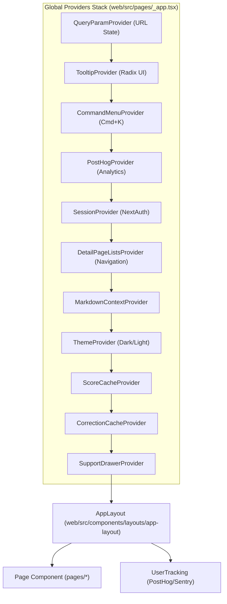
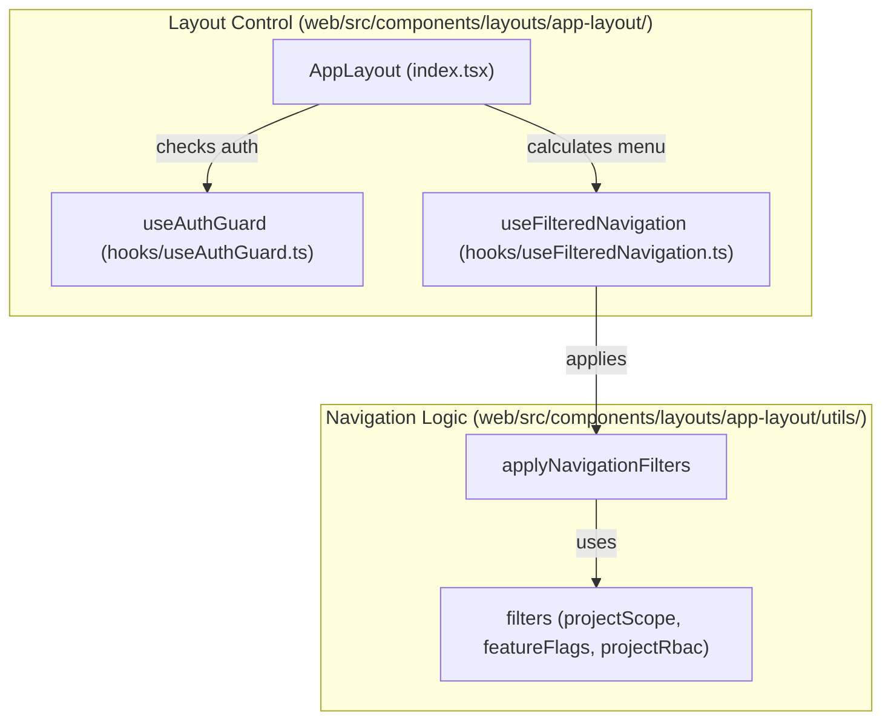
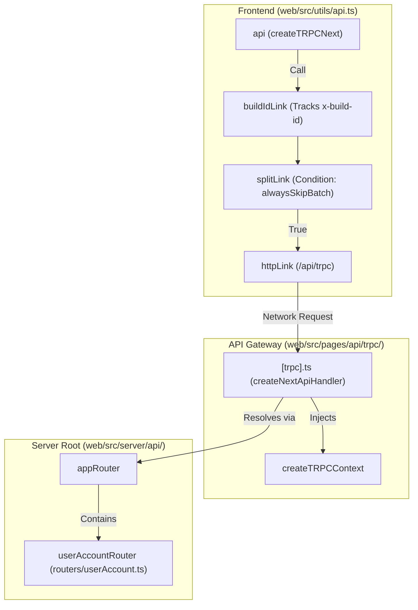

# 애플리케이션 구조

관련 소스 파일

이 위키 페이지를 생성하기 위한 컨텍스트로 다음 파일들이 사용되었습니다.

- [packages/shared/prisma/migrations/20260130000000_add_v4_beta_enabled/migration.sql](packages/shared/prisma/migrations/20260130000000_add_v4_beta_enabled/migration.sql)
- [web/instrumentation-client.ts](web/instrumentation-client.ts)
- [web/next.config.mjs](web/next.config.mjs)
- [web/playwright.config.ts](web/playwright.config.ts)
- [web/src/__e2e__/auth.spec.ts](web/src/__e2e__/auth.spec.ts)
- [web/src/__e2e__/create-project.spec.ts](web/src/__e2e__/create-project.spec.ts)
- [web/src/__tests__/experiments-access.clienttest.ts](web/src/__tests__/experiments-access.clienttest.ts)
- [web/src/__tests__/redirect.clienttest.ts](web/src/__tests__/redirect.clienttest.ts)
- [web/src/components/error-page.tsx](web/src/components/error-page.tsx)
- [web/src/components/layouts/app-layout/hooks/useAuthGuard.ts](web/src/components/layouts/app-layout/hooks/useAuthGuard.ts)
- [web/src/components/layouts/app-layout/hooks/useAuthSession.ts](web/src/components/layouts/app-layout/hooks/useAuthSession.ts)
- [web/src/components/layouts/app-layout/hooks/useFilteredNavigation.ts](web/src/components/layouts/app-layout/hooks/useFilteredNavigation.ts)
- [web/src/components/layouts/app-layout/hooks/useLayoutConfiguration.ts](web/src/components/layouts/app-layout/hooks/useLayoutConfiguration.ts)
- [web/src/components/layouts/app-layout/hooks/useLayoutMetadata.ts](web/src/components/layouts/app-layout/hooks/useLayoutMetadata.ts)
- [web/src/components/layouts/app-layout/hooks/useProjectAccess.ts](web/src/components/layouts/app-layout/hooks/useProjectAccess.ts)
- [web/src/components/layouts/app-layout/index.tsx](web/src/components/layouts/app-layout/index.tsx)
- [web/src/components/layouts/app-layout/utils/navigationFilters.ts](web/src/components/layouts/app-layout/utils/navigationFilters.ts)
- [web/src/components/layouts/app-layout/utils/navigationFilters.types.ts](web/src/components/layouts/app-layout/utils/navigationFilters.types.ts)
- [web/src/components/layouts/container-page.tsx](web/src/components/layouts/container-page.tsx)
- [web/src/components/layouts/page.tsx](web/src/components/layouts/page.tsx)
- [web/src/components/ui/sheet.tsx](web/src/components/ui/sheet.tsx)
- [web/src/features/events/lib/v4Rollout.ts](web/src/features/events/lib/v4Rollout.ts)
- [web/src/features/experiments/hooks/useExperimentAccess.ts](web/src/features/experiments/hooks/useExperimentAccess.ts)
- [web/src/features/experiments/utils/experimentsAccess.ts](web/src/features/experiments/utils/experimentsAccess.ts)
- [web/src/features/organizations/components/NewOrganizationForm.tsx](web/src/features/organizations/components/NewOrganizationForm.tsx)
- [web/src/features/organizations/utils/organizationNameSchema.ts](web/src/features/organizations/utils/organizationNameSchema.ts)
- [web/src/features/projects/components/NewProjectForm.tsx](web/src/features/projects/components/NewProjectForm.tsx)
- [web/src/features/setup/components/SetupPage.tsx](web/src/features/setup/components/SetupPage.tsx)
- [web/src/features/setup/components/SetupTracingButton.tsx](web/src/features/setup/components/SetupTracingButton.tsx)
- [web/src/features/setup/setupRoutes.ts](web/src/features/setup/setupRoutes.ts)
- [web/src/hooks/useTrpcError.tsx](web/src/hooks/useTrpcError.tsx)
- [web/src/instrumentation.ts](web/src/instrumentation.ts)
- [web/src/pages/_app.tsx](web/src/pages/_app.tsx)
- [web/src/pages/api/trpc/[trpc].ts](web/src/pages/api/trpc/[trpc].ts)
- [web/src/pages/auth/error.tsx](web/src/pages/auth/error.tsx)
- [web/src/pages/project/[projectId]/experiments/analytics.tsx](web/src/pages/project/[projectId]/experiments/analytics.tsx)
- [web/src/pages/project/[projectId]/experiments/results.tsx](web/src/pages/project/[projectId]/experiments/results.tsx)
- [web/src/server/api/routers/userAccount.ts](web/src/server/api/routers/userAccount.ts)
- [web/src/utils/api.ts](web/src/utils/api.ts)
- [web/src/utils/redirect.ts](web/src/utils/redirect.ts)

## 목적과 범위

이 문서는 page, component, API route, server-side code 구성을 포함한 Next.js 웹 애플리케이션 구조를 설명합니다. 웹 서비스가 Pages Router 패턴을 사용하는 Next.js 애플리케이션으로 어떻게 설계되었는지, code가 directory로 어떻게 구성되는지, 애플리케이션이 어떻게 build 및 deploy되는지 설명합니다.

worker service와 data layer를 포함한 전체 system architecture 정보는 [System Architecture](#1.1)를 참조하세요. tRPC API 구현 세부 정보는 [tRPC Internal API](#5.2)를 참조하세요. table과 form 같은 component별 구현은 [Table Components System](#8.2)을 참조하세요.

---

## Next.js 아키텍처

Langfuse는 **Pages Router** 패턴으로 Next.js를 사용합니다. 애플리케이션 진입점은 `web/src/pages/_app.tsx`이며, authentication, state management, UI context를 위한 global provider로 component tree를 감쌉니다 [web/src/pages/_app.tsx:108-171]().

### 애플리케이션 Bootstrap (`_app.tsx`)

`MyApp` component는 `array/to-reversed` 같은 최신 JavaScript feature를 위한 polyfill [web/src/pages/_app.tsx:23-29]()과 Google Translate가 text node를 `` element로 감쌀 때 발생하는 React crash를 방지하기 위한 DOM manipulation patch [web/src/pages/_app.tsx:39-70]()를 포함해 client-side environment를 초기화합니다.

#### Global Provider Stack

**출처:** [web/src/pages/_app.tsx:130-168](), [web/src/pages/_app.tsx:108-111]()

### Instrumentation과 Monitoring

애플리케이션은 observability를 위해 이중 instrumentation 전략을 사용합니다.
1.  **Sentry**: exception, browser profiling, session replay를 capture하기 위해 `web/instrumentation-client.ts`에서 초기화됩니다 [web/instrumentation-client.ts:8-90](). browser extension failure나 invalid Next.js router href 같은 benign error를 무시하는 filter를 포함합니다 [web/instrumentation-client.ts:13-33]().
2.  **PostHog**: product analytics를 위해 `_app.tsx`에서 초기화됩니다 [web/src/pages/_app.tsx:83-106](). `router.events`를 통해 page view를 추적하고 [web/src/pages/_app.tsx:114-127](), `UserTracking` component에서 authentication 성공 후 user를 identify합니다 [web/src/pages/_app.tsx:173-200]().
3.  **Server-side Init**: `web/src/instrumentation.ts` file은 Node.js runtime initialization을 처리하며, `isInitLoadingEnabled`가 true이면 `observability.config`와 `initialize` script를 import합니다 [web/src/instrumentation.ts:1-15]().

**출처:** [web/instrumentation-client.ts:1-94](), [web/src/pages/_app.tsx:83-106](), [web/src/pages/_app.tsx:173-200](), [web/src/instrumentation.ts:1-15]()

---

## Page와 Layout 구성

### Layout Management (`AppLayout`)

`AppLayout` component는 기본 structural controller 역할을 합니다. project context, organization context, feature flag, RBAC permission을 기반으로 route visibility를 결정하기 위해 `useFilteredNavigation`을 활용합니다 [web/src/components/layouts/app-layout/index.tsx:60]().

#### Authentication Guard와 Redirect

`useAuthGuard` hook은 authentication state를 평가하고 필요한 action(allow, loading, redirect, sign-out)을 결정합니다 [web/src/components/layouts/app-layout/hooks/useAuthGuard.ts:33-123](). 
- authentication 없이 접근할 수 있는 **publishable path**(예: shared traces/sessions)를 식별합니다 [web/src/components/layouts/app-layout/hooks/useAuthGuard.ts:53-69]().
- unauthenticated user를 sign-in page로 redirect하고, login 후 redirection을 허용하기 위해 `targetPath` query parameter를 추가합니다 [web/src/components/layouts/app-layout/hooks/useAuthGuard.ts:83-106]().
- sign-out을 trigger하여 "invalid users"(session은 존재하지만 user가 DB에서 삭제된 경우)가 protected route에 접근하지 못하게 합니다 [web/src/components/layouts/app-layout/hooks/useAuthGuard.ts:73-81]().

#### Navigation Filters Logic

`applyNavigationFilters` function은 일련의 pure filter function을 통해 route definition을 처리합니다 [web/src/components/layouts/app-layout/utils/navigationFilters.ts:181-219]().
- `projectScope`: router에 `projectId`가 없을 때 `projectId`가 필요한 route를 filter합니다 [web/src/components/layouts/app-layout/utils/navigationFilters.ts:23-28]().
- `featureFlags`: `v4BetaEnabled` 같은 특정 user flag를 확인합니다 [web/src/components/layouts/app-layout/utils/navigationFilters.ts:72-93]().
- `projectRbac`: `hasProjectAccess`를 사용해 user가 필요한 project-level permission을 가지고 있는지 확인합니다 [web/src/components/layouts/app-layout/utils/navigationFilters.ts:119-135]().
- `uiCustomization`: Enterprise UI setting을 기반으로 module을 숨깁니다 [web/src/components/layouts/app-layout/utils/navigationFilters.ts:50-62]().

**출처:** [web/src/components/layouts/app-layout/index.tsx:42-151](), [web/src/components/layouts/app-layout/hooks/useAuthGuard.ts:1-124](), [web/src/components/layouts/app-layout/utils/navigationFilters.ts:1-233]()

### Setup Flow (`SetupPage`)

초기 onboarding flow는 `SetupPage`가 처리하며, organization과 project 생성을 사용자에게 안내합니다 [web/src/features/setup/components/SetupPage.tsx:22-114]().
1.  **Organization Creation**: 새 organization entity를 생성하기 위해 `NewOrganizationForm`을 사용합니다 [web/src/features/setup/components/SetupPage.tsx:84-88]().
2.  **Project Creation**: 새 organization 안에서 첫 번째 project를 초기화하기 위해 `NewProjectForm`을 사용합니다 [web/src/features/setup/components/SetupPage.tsx:102-107]().

**출처:** [web/src/features/setup/components/SetupPage.tsx:19-114](), [web/src/features/organizations/components/NewOrganizationForm.tsx:19-92]()

---

## API와 Middleware 구조

### API Routes 구조

API route는 `web/src/pages/api/`에 위치합니다. internal tRPC handler는 web UI의 기본 communication channel입니다.

#### tRPC Handler (`/api/trpc/[trpc]`)
이 route는 들어오는 request를 `appRouter`로 mapping합니다 [web/src/pages/api/trpc/[trpc].ts:17-19]().
*   **Body Limit**: 4.5mb로 설정되어 있습니다 [web/src/pages/api/trpc/[trpc].ts:11]().
*   **Error Handling**: user error(info로 logging)와 system error(`traceException`을 통해 Sentry에 reporting)를 구분합니다 [web/src/pages/api/trpc/[trpc].ts:20-44]().
*   **Build ID**: handler는 client-server version alignment를 보장하기 위해 response header에 `x-build-id`를 첨부합니다 [web/src/pages/api/trpc/[trpc].ts:45-51]().

**출처:** [web/src/pages/api/trpc/[trpc].ts:1-54]()

### tRPC Client Configuration (`web/src/utils/api.ts`)

`api` object는 `createTRPCNext`와 `@tanstack/react-query` 위에 build됩니다 [web/src/utils/api.ts:178-179]().
*   **Links**: `httpLink`와 `httpBatchLink` 중 결정하기 위해 `splitLink`를 사용합니다. 현재는 performance experimentation을 위해 `alwaysSkipBatch = true`를 기본값으로 사용합니다 [web/src/utils/api.ts:194-215]().
*   **Error Debouncing**: 20초 window(`ERROR_DEBOUNCE_MS`) 안에서 동일한 recurring error에 대해 여러 toast로 UI가 flood되는 것을 방지하기 위해 `shouldShowToast`를 구현합니다 [web/src/utils/api.ts:86-103]().
*   **Version Management**: `buildIdLink`를 통해 server response의 `x-build-id`를 추적합니다 [web/src/utils/api.ts:136-160](). 404/400 error 중 client의 `NEXT_PUBLIC_BUILD_ID`가 server의 ID와 다르면 `showVersionUpdateToast`를 trigger합니다 [web/src/utils/api.ts:113-122]().

**출처:** [web/src/utils/api.ts:1-230]()

---

## Code Entity Mapping

다음 diagram들은 자연어 concept를 웹 애플리케이션 내 특정 code entity에 연결합니다.

### Layout and Route Resolution Flow

**출처:** [web/src/components/layouts/app-layout/index.tsx:53-60](), [web/src/components/layouts/app-layout/hooks/useAuthGuard.ts:47-69](), [web/src/components/layouts/app-layout/utils/navigationFilters.ts:19-174]()

### Client-Server Communication Path

**출처:** [web/src/utils/api.ts:178-216](), [web/src/pages/api/trpc/[trpc].ts:17-19](), [web/src/server/api/routers/userAccount.ts:74]()
