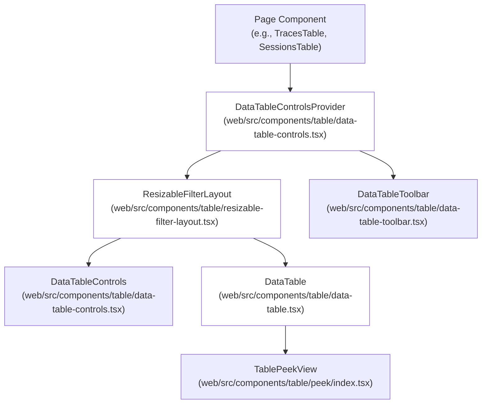
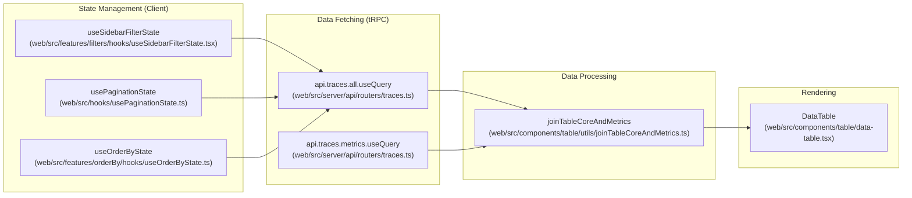

# 테이블 컴포넌트 시스템

관련 소스 파일

이 위키 페이지를 생성하기 위한 컨텍스트로 다음 파일들이 사용되었습니다.

- [packages/shared/src/interfaces/filters.ts](packages/shared/src/interfaces/filters.ts)
- [packages/shared/src/server/repositories/index.ts](packages/shared/src/server/repositories/index.ts)
- [packages/shared/src/tableDefinitions/index.ts](packages/shared/src/tableDefinitions/index.ts)
- [packages/shared/src/types.ts](packages/shared/src/types.ts)
- [web/src/components/schemas/ChatMlSchema.ts](web/src/components/schemas/ChatMlSchema.ts)
- [web/src/components/session/index.tsx](web/src/components/session/index.tsx)
- [web/src/components/table/ValueCell.tsx](web/src/components/table/ValueCell.tsx)
- [web/src/components/table/data-table-controls.tsx](web/src/components/table/data-table-controls.tsx)
- [web/src/components/table/data-table.tsx](web/src/components/table/data-table.tsx)
- [web/src/components/table/table-link.tsx](web/src/components/table/table-link.tsx)
- [web/src/components/table/use-cases/observations.tsx](web/src/components/table/use-cases/observations.tsx)
- [web/src/components/table/use-cases/scores.tsx](web/src/components/table/use-cases/scores.tsx)
- [web/src/components/table/use-cases/sessions.tsx](web/src/components/table/use-cases/sessions.tsx)
- [web/src/components/table/use-cases/traces.tsx](web/src/components/table/use-cases/traces.tsx)
- [web/src/components/ui/CodeJsonViewer.tsx](web/src/components/ui/CodeJsonViewer.tsx)
- [web/src/components/ui/Codeblock.tsx](web/src/components/ui/Codeblock.tsx)
- [web/src/components/ui/IOTableCell.tsx](web/src/components/ui/IOTableCell.tsx)
- [web/src/components/ui/MarkdownJsonView.tsx](web/src/components/ui/MarkdownJsonView.tsx)
- [web/src/components/ui/MarkdownViewer.tsx](web/src/components/ui/MarkdownViewer.tsx)
- [web/src/components/ui/PrettyJsonView.clienttest.ts](web/src/components/ui/PrettyJsonView.clienttest.ts)
- [web/src/components/ui/PrettyJsonView.tsx](web/src/components/ui/PrettyJsonView.tsx)
- [web/src/components/ui/resizable-image.tsx](web/src/components/ui/resizable-image.tsx)
- [web/src/components/ui/safe-url.clienttest.ts](web/src/components/ui/safe-url.clienttest.ts)
- [web/src/components/ui/safe-url.ts](web/src/components/ui/safe-url.ts)
- [web/src/features/events/components/EventsTable.tsx](web/src/features/events/components/EventsTable.tsx)
- [web/src/features/experiments/components/table/ExperimentItemsTable.tsx](web/src/features/experiments/components/table/ExperimentItemsTable.tsx)
- [web/src/features/experiments/components/table/ExperimentsTable.tsx](web/src/features/experiments/components/table/ExperimentsTable.tsx)
- [web/src/features/filters/filter-integration.clienttest.ts](web/src/features/filters/filter-integration.clienttest.ts)
- [web/src/features/filters/hooks/useFilterState.ts](web/src/features/filters/hooks/useFilterState.ts)
- [web/src/features/filters/hooks/useSidebarFilterState.tsx](web/src/features/filters/hooks/useSidebarFilterState.tsx)
- [web/src/features/filters/lib/filter-query-encoding-decoding.clienttest.ts](web/src/features/filters/lib/filter-query-encoding-decoding.clienttest.ts)
- [web/src/features/filters/lib/filter-query-encoding.ts](web/src/features/filters/lib/filter-query-encoding.ts)
- [web/src/features/prompts/components/prompts-table.tsx](web/src/features/prompts/components/prompts-table.tsx)
- [web/src/features/prompts/server/actions/createPrompt.ts](web/src/features/prompts/server/actions/createPrompt.ts)
- [web/src/features/prompts/server/routers/promptRouter.ts](web/src/features/prompts/server/routers/promptRouter.ts)
- [web/src/hooks/useClickWithoutSelection.ts](web/src/hooks/useClickWithoutSelection.ts)
- [web/src/server/api/services/tableDefinitions.ts](web/src/server/api/services/tableDefinitions.ts)

## 목적과 범위

이 문서는 Langfuse 웹 애플리케이션의 **Table Components System**을 설명합니다. 이 시스템은 filtering, sorting, pagination, column management, batch action을 갖춘 풍부한 기능의 data table을 만들기 위한 재사용 가능한 framework입니다. TanStack Table(React Table) 위에 build되며, 애플리케이션의 모든 table view 전반에 일관된 UX pattern을 제공합니다.

이 페이지에서 다루는 내용은 다음과 같습니다.
- 핵심 table component와 그 조합
- Data flow pattern(fetch, join, transform)
- Column definition system
- State management hook
- 일반적인 table feature(filtering, sorting, pagination, selection)
- 고급 feature(peek view, dynamic cell, table preset)

---

## 시스템 아키텍처

### Component Hierarchy

table system은 layout component가 data component를 감싸고, state provider가 component 간 communication을 가능하게 하는 계층적 component 구조를 따릅니다.

Title: Table Component Hierarchy

**Component Roles**:
- **DataTableControlsProvider**: `useSessionStorage`를 사용해 sidebar visibility와 collapse state를 위한 shared context를 제공합니다 [web/src/components/table/data-table-controls.tsx:54-81]().
- **ResizableFilterLayout**: filter sidebar와 table content로 구성된 resizable split pane을 구현합니다 [web/src/components/table/resizable-filter-layout.tsx:13]().
- **DataTableToolbar**: search, date range picker, export button, action menu가 있는 상단 toolbar입니다 [web/src/components/table/data-table-toolbar.tsx:3]().
- **DataTableControls**: grouped filter control(Categorical, Numeric, String, Key-Value)과 AI-powered filter generation이 있는 왼쪽 sidebar입니다 [web/src/components/table/data-table-controls.tsx:108-208]().
- **DataTable**: row와 column을 렌더링하고 sorting/pagination을 처리하는 핵심 table component입니다 [web/src/components/table/data-table.tsx:156-182]().
- **TablePeekView**: navigation 없이 inline detail view를 제공하는 optional drawer입니다 [web/src/components/table/data-table.tsx:76]().

출처: [web/src/components/table/use-cases/traces.tsx:2-13](), [web/src/components/table/data-table-controls.tsx:54-108](), [web/src/components/table/data-table.tsx:156-182]()

---

## 핵심 테이블 컴포넌트

### DataTable Component

`DataTable` component는 standardized rendering, sorting, pagination control을 제공하는 TanStack Table wrapper입니다.

**위치**: `web/src/components/table/data-table.tsx` [web/src/components/table/data-table.tsx:156]()

**주요 기능**:
- **Sticky Pinning**: sticky positioning과 z-index management를 통해 ID나 selection checkbox 같은 fixed column에 대해 `isPinnedLeft`를 지원합니다 [web/src/components/table/data-table.tsx:127-140]().
- **Column Sizing**: `useColumnSizing` hook을 통해 user-defined column width를 localStorage에 유지합니다 [web/src/components/table/data-table.tsx:198]().
- **Group Headers**: Usage나 Cost 같은 복잡한 data type을 위한 multi-level header rendering을 선택적으로 제공합니다 [web/src/components/table/data-table.tsx:173]().
- **Row Click Handling**: interactive element 클릭을 무시하는 logic과 함께 `onRowClick`을 통해 detail view를 여는 integrated support를 제공합니다 [web/src/components/table/data-table.tsx:120-124]().

출처: [web/src/components/table/data-table.tsx:116-229]()

### TablePeekView Component

table에서 벗어나 navigation하지 않고 trace나 observation detail을 볼 수 있는 inline detail drawer를 제공합니다.

**구현 세부 정보**:
- **Peek Detail Views**: `TablePeekViewTraceDetail` [web/src/components/table/use-cases/traces.tsx:88]()과 `TablePeekViewObservationDetail` [web/src/components/table/use-cases/observations.tsx:70]() 같은 specialized wrapper가 drawer 안에 content를 렌더링합니다.
- **Navigation**: `usePeekNavigation` hook을 사용해 현재 table list의 item들을 순환하는 detail page navigation을 포함합니다 [web/src/components/table/use-cases/traces.tsx:89]().

출처: [web/src/components/table/use-cases/traces.tsx:88-90](), [web/src/components/table/use-cases/observations.tsx:70-71]()

---

## Data Flow Architecture

### Standard Data Flow Pattern

모든 table 구현은 core data와 metrics에 대한 별도 fetch를 사용하는 일관된 data flow pattern을 따릅니다.

Title: Table Data Flow (Natural Language to Code Entities)

**Dual-Query Pattern**:
이 pattern이 존재하는 이유는 core metadata(예: trace name, timestamp)는 primary PostgreSQL table에서 오지만, metrics(예: total cost, latency)는 aggregation이나 ClickHouse lookup이 필요한 경우가 많기 때문입니다. 둘을 분리하면 metrics가 asynchronously load되는 동안 UI가 table structure를 즉시 render할 수 있습니다. 이는 `TracesTable` [web/src/components/table/use-cases/traces.tsx:54]()과 `PromptTable` [web/src/features/prompts/components/prompts-table.tsx:147-156]()에서 사용됩니다.

출처: [web/src/components/table/use-cases/traces.tsx:54](), [web/src/features/prompts/components/prompts-table.tsx:102-156]()

---

## Column Definition System

### LangfuseColumnDef Type

table은 TanStack Table의 `ColumnDef`를 Langfuse-specific metadata로 확장한 `LangfuseColumnDef<TRow>` type을 사용합니다 [web/src/components/table/use-cases/traces.tsx:15]().

**확장된 속성**:
- **isPinnedLeft**: column을 scrollable area의 왼쪽에 고정합니다 [web/src/components/table/data-table.tsx:203-205]().
- **Grouping**: nested column group에 사용됩니다(예: "Input", "Output", "Total"을 grouping하는 "Usage") [web/src/components/table/data-table.tsx:186-196]().

### Dynamic Columns: Scores

Score column은 project에서 사용 가능한 score name을 fetch하고 그에 대한 column definition을 생성하는 `useScoreColumns` hook을 사용해 동적으로 생성됩니다 [web/src/components/table/use-cases/traces.tsx:99](). 이를 통해 table은 user가 정의한 custom scoring schema에 맞게 적응할 수 있습니다.

출처: [web/src/components/table/use-cases/traces.tsx:99](), [web/src/components/table/use-cases/observations.tsx:82](), [web/src/components/table/use-cases/sessions.tsx:64]()

---

## 특화된 테이블 구현

### Traces Table
LLM trace를 위한 primary view입니다. input/output을 위한 `MemoizedIOTableCell` [web/src/components/table/use-cases/traces.tsx:50]()과 nested observation status를 위한 `LevelCountsDisplay` [web/src/components/table/use-cases/traces.tsx:68]() 같은 복잡한 cell renderer를 포함합니다. 또한 `useSessionStorage`를 통한 real-time refresh interval도 지원합니다 [web/src/components/table/use-cases/traces.tsx:171-182]().

### Observations & Events Table
`ObservationsTable`은 개별 span과 generation을 표시합니다 [web/src/components/table/use-cases/observations.tsx:151](). `ObservationsEventsTable`(v4 beta)은 observation data의 high-performance retrieval을 위해 ClickHouse events table을 사용합니다 [web/src/features/events/components/EventsTable.tsx:183]().

### Prompts Table
`PromptTable`은 hierarchical folder structure를 지원합니다. nested prompt folder를 통한 navigation을 관리하기 위해 `useFolderPagination`을 사용합니다 [web/src/features/prompts/components/prompts-table.tsx:85-91](). backend `promptRouter`는 folder path로 SQL result를 filter하기 위해 `buildPathPrefixFilter`를 사용합니다 [web/src/features/prompts/server/routers/promptRouter.ts:44-51]().

### Sessions Table
session 내의 grouped trace를 표시합니다. V3와 V4(events-backed) data source 사이를 전환하기 위해 `isBetaEnabled`를 지원합니다 [web/src/components/table/use-cases/sessions.tsx:93-97](). `api.sessions.filterOptions` 또는 `api.sessions.filterOptionsFromEvents`를 사용해 filter option을 동적으로 fetch합니다 [web/src/components/table/use-cases/sessions.tsx:181-199]().

### Scores Table
trace나 observation의 score를 표시합니다. V4 beta에서는 events-backed endpoint만 사용합니다 [web/src/components/table/use-cases/scores.tsx:136-138](). score type을 기반으로 specialized column filtering을 지원합니다 [web/src/components/table/use-cases/scores.tsx:128-131]().

출처: [web/src/components/table/use-cases/traces.tsx:50-182](), [web/src/features/prompts/components/prompts-table.tsx:85-91](), [web/src/features/prompts/server/routers/promptRouter.ts:44-51](), [web/src/features/events/components/EventsTable.tsx:183](), [web/src/components/table/use-cases/scores.tsx:136-138](), [web/src/components/table/use-cases/sessions.tsx:181-199]()

---

## State Management & Persistence

### Persistence Strategy
system은 table state를 유지하기 위해 URL parameter와 Session/LocalStorage를 혼합해서 사용합니다.
- **Pagination/Filters**: `usePaginationState` [web/src/hooks/usePaginationState.ts:12]()와 `useSidebarFilterState` [web/src/features/filters/hooks/useSidebarFilterState.tsx:3]()를 통해 URL query string에 유지됩니다.
- **Column visibility/Order**: `useColumnVisibility` [web/src/components/table/use-cases/traces.tsx:17]()와 `useColumnOrder` [web/src/components/table/use-cases/traces.tsx:55]()를 통해 유지됩니다.
- **Refresh Intervals**: user가 선택한 refresh interval은 project별로 `SessionStorage`에 저장됩니다 [web/src/components/table/use-cases/traces.tsx:171-176]().

### Sidebar Filter State
`useSidebarFilterState` hook은 filtering system의 핵심입니다. 다음을 처리합니다.
- **Decoding**: `decodeAndNormalizeFilters`는 URL query string을 valid `FilterState`로 변환합니다 [web/src/features/filters/hooks/useSidebarFilterState.tsx:42-89]().
- **Categorical Facets**: categorical column을 위한 option selection과 count를 관리합니다 [web/src/features/filters/hooks/useSidebarFilterState.tsx:137-179]().
- **Key-Value Filters**: user가 key, operator, value를 선택하는 dynamic metadata/tag filter를 관리합니다 [web/src/features/filters/hooks/useSidebarFilterState.tsx:198-202]().

출처: [web/src/features/filters/hooks/useSidebarFilterState.tsx:42-202](), [web/src/components/table/use-cases/traces.tsx:171-184]()

---

## Batch Actions & Selection

### TableSelectionManager
column definition 안에서 "Select All" 기능을 제공하기 위해 사용되는 specialized component입니다. 다음을 처리합니다.
- **Select All on Page**: standard TanStack Table row selection입니다 [web/src/components/table/use-cases/traces.tsx:170]().
- **Select All in Project**: 현재 filter와 일치하는 모든 record에 batch action을 적용해야 함을 signal하기 위해 `useSelectAll` hook을 사용합니다 [web/src/components/table/use-cases/traces.tsx:62]().

### TableActionMenu
`TableActionMenu`는 user entitlement와 project permission을 기반으로 사용 가능한 operation(Delete, Add to Dataset 등)을 렌더링합니다 [web/src/components/table/use-cases/traces.tsx:61]().

출처: [web/src/components/table/use-cases/traces.tsx:61-62](), [web/src/components/table/use-cases/observations.tsx:76-79](), [web/src/components/table/data-table.tsx:60-61]()
