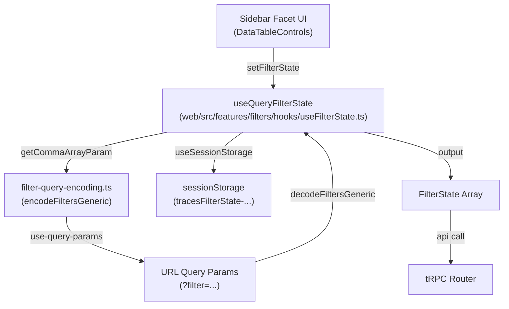

# UI 상태 관리

관련 소스 파일

이 위키 페이지를 생성하기 위한 컨텍스트로 다음 파일들이 사용되었습니다.

- [packages/shared/src/domain/table-view-presets.ts](packages/shared/src/domain/table-view-presets.ts)
- [packages/shared/src/interfaces/filters.ts](packages/shared/src/interfaces/filters.ts)
- [packages/shared/src/server/repositories/index.ts](packages/shared/src/server/repositories/index.ts)
- [packages/shared/src/server/services/DefaultViewService/DefaultViewService.ts](packages/shared/src/server/services/DefaultViewService/DefaultViewService.ts)
- [packages/shared/src/server/services/DefaultViewService/types.ts](packages/shared/src/server/services/DefaultViewService/types.ts)
- [packages/shared/src/server/services/TableViewService/TableViewService.ts](packages/shared/src/server/services/TableViewService/TableViewService.ts)
- [packages/shared/src/server/services/TableViewService/index.ts](packages/shared/src/server/services/TableViewService/index.ts)
- [packages/shared/src/server/services/TableViewService/systemPresets.ts](packages/shared/src/server/services/TableViewService/systemPresets.ts)
- [packages/shared/src/server/services/TableViewService/types.ts](packages/shared/src/server/services/TableViewService/types.ts)
- [packages/shared/src/tableDefinitions/index.ts](packages/shared/src/tableDefinitions/index.ts)
- [packages/shared/src/types.ts](packages/shared/src/types.ts)
- [web/src/__tests__/server/table-view-namespace-compat.servertest.ts](web/src/__tests__/server/table-view-namespace-compat.servertest.ts)
- [web/src/components/table/data-table-controls.tsx](web/src/components/table/data-table-controls.tsx)
- [web/src/components/table/data-table-toolbar.tsx](web/src/components/table/data-table-toolbar.tsx)
- [web/src/components/table/table-view-presets/components/data-table-view-presets-drawer.tsx](web/src/components/table/table-view-presets/components/data-table-view-presets-drawer.tsx)
- [web/src/components/table/table-view-presets/hooks/useDefaultViewMutations.ts](web/src/components/table/table-view-presets/hooks/useDefaultViewMutations.ts)
- [web/src/components/table/table-view-presets/hooks/useTableViewManager.ts](web/src/components/table/table-view-presets/hooks/useTableViewManager.ts)
- [web/src/components/table/table-view-presets/hooks/useViewData.ts](web/src/components/table/table-view-presets/hooks/useViewData.ts)
- [web/src/features/filters/components/filter-builder.tsx](web/src/features/filters/components/filter-builder.tsx)
- [web/src/features/filters/filter-integration.clienttest.ts](web/src/features/filters/filter-integration.clienttest.ts)
- [web/src/features/filters/hooks/useFilterState.ts](web/src/features/filters/hooks/useFilterState.ts)
- [web/src/features/filters/hooks/useSidebarFilterState.tsx](web/src/features/filters/hooks/useSidebarFilterState.tsx)
- [web/src/features/filters/lib/filter-query-encoding-decoding.clienttest.ts](web/src/features/filters/lib/filter-query-encoding-decoding.clienttest.ts)
- [web/src/features/filters/lib/filter-query-encoding.ts](web/src/features/filters/lib/filter-query-encoding.ts)
- [web/src/server/api/routers/tableViewPresets.ts](web/src/server/api/routers/tableViewPresets.ts)
- [web/src/server/api/services/tableDefinitions.ts](web/src/server/api/services/tableDefinitions.ts)

이 문서는 Langfuse 웹 애플리케이션에서 UI 상태가 어떻게 관리되는지 설명하며, 특히 table component, filter, pagination, URL persistence에 초점을 둡니다. 이 시스템은 URL query parameter, browser storage(`localStorage`와 `sessionStorage`), React hook을 조합해 page reload와 navigation 전반에서 UI 상태를 유지하고 지속시킵니다.

## 상태 관리 아키텍처

웹 애플리케이션은 UI 상태의 특성에 따라 서로 다른 위치에 지속되는 multi-layered state management 전략을 구현합니다. 각 table component(예: `TracesTable`, `ObservationsTable`, `EventsTable`, `SessionsTable`)는 pagination, filtering, sorting, display preference를 관리하기 위해 여러 custom hook을 조합합니다.

### State Management Hook 위치

다음 diagram은 table component, core state hook, persistence layer 사이의 관계를 mapping합니다.

**Natural Language to Code Entity Space: Table State Composition**

```mermaid
graph TB
    subgraph "Table Components"
        TracesTable["TracesTable<br/>web/src/components/table/use-cases/traces.tsx"]
        EventsTable["ObservationsEventsTable<br/>web/src/features/events/components/EventsTable.tsx"]
        SessionsTable["SessionsTable<br/>web/src/components/table/use-cases/sessions.tsx"]
        ObservationsTable["ObservationsTable<br/>web/src/components/table/use-cases/observations.tsx"]
    end
    
    subgraph "Core State Hooks"
        usePaginationState["usePaginationState<br/>web/src/hooks/usePaginationState.ts"]
        useOrderByState["useOrderByState<br/>web/src/features/orderBy/hooks/useOrderByState.ts"]
        useSidebarFilterState["useSidebarFilterState<br/>web/src/features/filters/hooks/useSidebarFilterState.tsx"]
        useTableDateRange["useTableDateRange<br/>web/src/hooks/useTableDateRange.ts"]
        useQueryFilterState["useQueryFilterState<br/>web/src/features/filters/hooks/useFilterState.ts"]
    end
    
    subgraph "Column & Display Hooks"
        useColumnVisibility["useColumnVisibility<br/>web/src/features/column-visibility/hooks/useColumnVisibility.ts"]
        useColumnOrder["useColumnOrder<br/>web/src/features/column-visibility/hooks/useColumnOrder.ts"]
        useRowHeightLocalStorage["useRowHeightLocalStorage<br/>web/src/components/table/data-table-row-height-switch.tsx"]
    end
    
    subgraph "Persistence"
        URL["URL Query Params<br/>'use-query-params'"]
        LocalStorage["localStorage<br/>Browser API"]
        SessionStorage["sessionStorage<br/>Browser API"]
    end
    
    EventsTable --> usePaginationState
    EventsTable --> useOrderByState
    EventsTable --> useSidebarFilterState
    EventsTable --> useTableDateRange
    EventsTable --> useColumnVisibility
    EventsTable --> useColumnOrder
    
    usePaginationState --> URL
    useOrderByState --> SessionStorage
    useSidebarFilterState --> URL
    useSidebarFilterState --> SessionStorage
    useQueryFilterState --> URL
    useQueryFilterState --> SessionStorage
    useTableDateRange --> SessionStorage
    useColumnVisibility --> LocalStorage
    useColumnOrder --> LocalStorage
```

**출처:**
- [web/src/features/filters/hooks/useFilterState.ts:127-138]()
- [web/src/features/filters/hooks/useSidebarFilterState.tsx:29-30]()

## 상태 지속 전략

### URL Query Parameters
URL query parameter는 link로 상태를 공유할 수 있게 하고 browser back/forward navigation을 가능하게 합니다.
- **Pagination**: `pageIndex`, `pageSize`.
- **Filters**: `filter` parameter를 통해 filtered view를 공유하기 위한 encoded filter state [web/src/features/filters/hooks/useFilterState.ts:157-160]().
- **Search**: `search` query parameter.
- **View IDs**: `viewId` parameter는 특정 saved Table View Preset을 식별합니다 [web/src/components/table/table-view-presets/hooks/useTableViewManager.ts:79-83]().

### Session Storage
Session storage는 browser tab session 안에서 상태를 유지하지만 tab을 닫으면 clear됩니다.
- **Filter state**: project ID와 table name을 key로 삼는 user의 현재 filter selection(예: `tracesFilterState-projectId`) [web/src/features/filters/hooks/useFilterState.ts:134-138]().
- **Date ranges**: time range selection.
- **Ordering**: `useOrderByState`를 통해 관리되는 sort column과 direction.
- **Sidebar State**: filter sidebar가 expanded인지 collapsed인지는 `data-table-controls-tableName` 같은 key로 `useSessionStorage`를 사용해 table별로 저장됩니다 [web/src/components/table/data-table-controls.tsx:64-69]().
- **View ID Persistence**: `useTableViewManager`는 table로 돌아올 때 복원하기 위해 마지막으로 사용한 `viewId`를 session storage에 저장합니다 [web/src/components/table/table-view-presets/hooks/useTableViewManager.ts:75-78]().

### Local Storage
Local storage는 browser session과 tab을 넘어 상태를 유지합니다.
- **Column visibility**: user가 숨기거나 표시한 column을 유지합니다.
- **Column order**: table column의 drag-and-drop arrangement를 유지합니다.
- **Row Height**: table row density(예: compact vs. comfortable)에 대한 user preference를 유지합니다 [web/src/components/table/data-table-row-height-switch.tsx:21-23]().

## Filter State Management

Filter state는 sidebar facet, URL persistence, legacy normalization을 지원합니다.

### Hook: `useQueryFilterState`
위치: `web/src/features/filters/hooks/useFilterState.ts`

이 hook은 URL 및 session storage 양쪽과 synchronize되는 filter를 관리하기 위한 기본 interface를 제공합니다. navigation 중 filter가 손실되지 않도록 initial state와 session state를 merge합니다 [web/src/features/filters/hooks/useFilterState.ts:140-149](). 또한 URL synchronization을 우회하는 side-drawer 안에서 렌더링되는 table을 위해 `PeekTableStateContext`를 지원합니다 [web/src/features/filters/hooks/useFilterState.ts:162-171]().

### Filter Encoding and Decoding
Langfuse는 `FilterState`를 URL string으로 encoding하기 위해 custom semicolon-delimited format을 사용합니다.

| Format Component | 설명 | 예시 |
| :--- | :--- | :--- |
| **Column ID** | column의 internal ID | `name` |
| **Type** | filter type(string, number 등) | `string` |
| **Key** | object/category type을 위한 optional key | `environment` |
| **Operator** | comparison operator | `contains` |
| **Value** | URI-encoded value | `production` |

**전체 형식**: `columnId;type;key;operator;value` [web/src/features/filters/lib/filter-query-encoding.ts:111-111](). 여러 filter는 comma로 join됩니다 [web/src/features/filters/lib/filter-query-encoding.ts:115-115]().

**Natural Language to Code Entity Space: Filter Data Flow**

**출처:**
- [web/src/features/filters/hooks/useFilterState.ts:39-124]()
- [web/src/features/filters/lib/filter-query-encoding.ts:76-117]()
- [web/src/features/filters/lib/filter-query-encoding.ts:123-205]()

### Normalization and Validation
`decodeAndNormalizeFilters` function은 legacy column name과 alias를 canonical ID로 mapping하여 backward compatibility를 처리합니다 [web/src/features/filters/hooks/useSidebarFilterState.tsx:42-84](). column definition이 변경되어도 old bookmark나 saved view의 filter가 계속 valid하도록 보장합니다 [web/src/features/filters/hooks/useSidebarFilterState.tsx:68-74]().

## Table View Presets

Table view preset을 사용하면 user가 filter, sorting, column order, visibility를 포함한 전체 table configuration을 저장할 수 있습니다.

### Hook: `useTableViewManager`
위치: `web/src/components/table/table-view-presets/hooks/useTableViewManager.ts`

이 hook은 database에서 저장된 configuration을 적용하기 위해 여러 state updater와 coordination합니다. initialization을 위해 다음 priority list를 순회합니다.
1. **URL**: URL query param에 `viewId`가 있는 경우 [web/src/components/table/table-view-presets/hooks/useTableViewManager.ts:79-83]().
2. **Session Storage**: 이 table/project에 대해 `viewId`가 이전에 저장된 경우 [web/src/components/table/table-view-presets/hooks/useTableViewManager.ts:75-78]().
3. **Default View**: `api.TableViewPresets.getDefault` query를 통해 user 또는 project의 default view를 resolve합니다 [web/src/components/table/table-view-presets/hooks/useTableViewManager.ts:90-97]().

hook은 preset이 load되면 `applyViewState`를 사용해 제공된 `stateUpdaters`(예: `setFilters`, `setOrderBy`, `setColumnVisibility`)를 trigger합니다 [web/src/components/table/table-view-presets/hooks/useTableViewManager.ts:204-245]().

### System Presets
Langfuse는 database가 아니라 code에 정의된 "System Presets"를 지원합니다. 이러한 ID에는 `__langfuse_` prefix가 붙습니다 [web/src/components/table/table-view-presets/components/data-table-view-presets-drawer.tsx:93-97](). 예시로 "Default View"(`__langfuse_default__`)가 있습니다 [web/src/components/table/table-view-presets/components/data-table-view-presets-drawer.tsx:120-126]().

| Feature | Persistence | Hook/Utility |
| :--- | :--- | :--- |
| **Filters** | URL / Session Storage | `useQueryFilterState` |
| **Sorting** | Session Storage | `useOrderByState` |
| **Pagination** | URL | `usePaginationState` |
| **Visibility** | Local Storage | `useColumnVisibility` |
| **Order** | Local Storage | `useColumnOrder` |
| **View ID** | URL / Session Storage | `useTableViewManager` |

**출처:**
- [web/src/components/table/table-view-presets/hooks/useTableViewManager.ts:57-245]()
- [web/src/components/table/table-view-presets/components/data-table-view-presets-drawer.tsx:88-126]()

## Filter UI Components

### `PopoverFilterBuilder`
`PopoverFilterBuilder`는 complex filter를 추가하기 위한 primary interface입니다. user가 table에 적용하기 전에 filter를 build할 수 있도록 `wipFilterState`(Work-In-Progress)를 유지합니다 [web/src/features/filters/components/filter-builder.tsx:102-103](). external `filterState`와 sync하지만, user가 invalid filter를 actively editing 중이면 update를 무시합니다 [web/src/features/filters/components/filter-builder.tsx:115-121]().

### `DataTableControls` (Sidebar)
sidebar filter system은 facet을 렌더링하기 위해 `DataTableControls`를 사용합니다. 다음을 지원합니다.
- **Categorical Facets**: count가 있는 checkbox list [web/src/components/table/data-table-controls.tsx:192-208]().
- **Numeric Facets**: range slider [web/src/components/table/data-table-controls.tsx:210-221]().
- **AI Filters**: `DataTableAIFilters`를 사용해 natural language prompt에서 `FilterState` 생성 [web/src/components/table/data-table-controls.tsx:113-134]().

**출처:**
- [web/src/features/filters/components/filter-builder.tsx:81-153]()
- [web/src/components/table/data-table-controls.tsx:108-221]()
