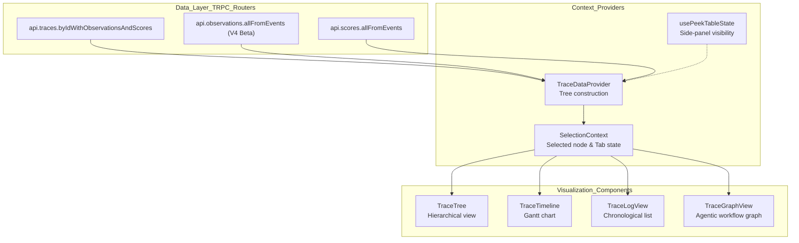
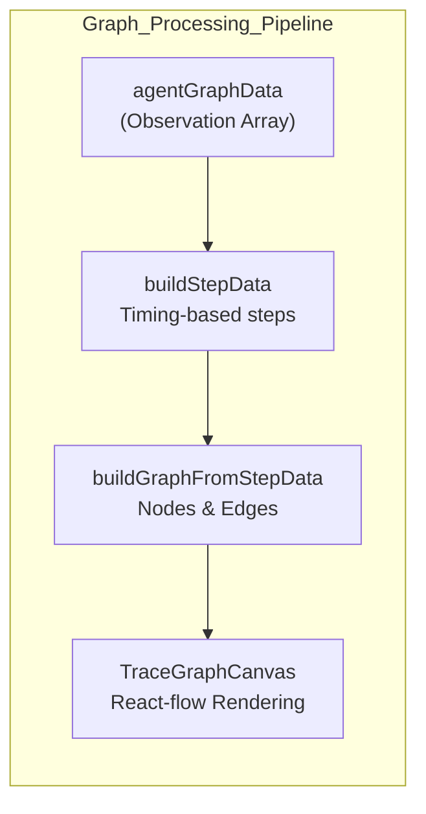

# Trace & Session 뷰

관련 소스 파일

이 위키 페이지를 생성하기 위한 컨텍스트로 다음 파일들이 사용되었습니다.

- [web/src/__tests__/buildStepData.clienttest.ts](web/src/__tests__/buildStepData.clienttest.ts)
- [web/src/components/ItemBadge.tsx](web/src/components/ItemBadge.tsx)
- [web/src/components/session/index.tsx](web/src/components/session/index.tsx)
- [web/src/components/table/data-table.tsx](web/src/components/table/data-table.tsx)
- [web/src/components/table/use-cases/observations.tsx](web/src/components/table/use-cases/observations.tsx)
- [web/src/components/table/use-cases/scores.tsx](web/src/components/table/use-cases/scores.tsx)
- [web/src/components/table/use-cases/sessions.tsx](web/src/components/table/use-cases/sessions.tsx)
- [web/src/components/table/use-cases/traces.tsx](web/src/components/table/use-cases/traces.tsx)
- [web/src/features/annotation-queues/components/shared/AnnotationProcessingLayout.tsx](web/src/features/annotation-queues/components/shared/AnnotationProcessingLayout.tsx)
- [web/src/features/events/components/EventsTable.tsx](web/src/features/events/components/EventsTable.tsx)
- [web/src/features/experiments/components/table/ExperimentItemsTable.tsx](web/src/features/experiments/components/table/ExperimentItemsTable.tsx)
- [web/src/features/experiments/components/table/ExperimentsTable.tsx](web/src/features/experiments/components/table/ExperimentsTable.tsx)
- [web/src/features/prompts/components/prompts-table.tsx](web/src/features/prompts/components/prompts-table.tsx)
- [web/src/features/prompts/server/actions/createPrompt.ts](web/src/features/prompts/server/actions/createPrompt.ts)
- [web/src/features/prompts/server/routers/promptRouter.ts](web/src/features/prompts/server/routers/promptRouter.ts)
- [web/src/features/trace-graph-view/buildGraphCanvasData.ts](web/src/features/trace-graph-view/buildGraphCanvasData.ts)
- [web/src/features/trace-graph-view/buildStepData.ts](web/src/features/trace-graph-view/buildStepData.ts)
- [web/src/features/trace-graph-view/components/TraceGraphCanvas.tsx](web/src/features/trace-graph-view/components/TraceGraphCanvas.tsx)
- [web/src/features/trace-graph-view/components/TraceGraphView.tsx](web/src/features/trace-graph-view/components/TraceGraphView.tsx)
- [web/src/features/trace-graph-view/types.ts](web/src/features/trace-graph-view/types.ts)
- [web/src/pages/project/[projectId]/sessions/[sessionId].tsx](web/src/pages/project/[projectId]/sessions/[sessionId].tsx)
- [web/src/pages/project/[projectId]/traces/[traceId].tsx](web/src/pages/project/[projectId]/traces/[traceId].tsx)
- [web/src/pages/project/[projectId]/users/[userId].tsx](web/src/pages/project/[projectId]/users/[userId].tsx)
- [web/src/pages/trace/[traceId].tsx](web/src/pages/trace/[traceId].tsx)
- [web/src/server/api/routers/users.ts](web/src/server/api/routers/users.ts)

이 페이지는 Langfuse 웹 애플리케이션의 trace 및 session detail view 구현을 문서화합니다. 이 view들은 개별 execution graph(trace)와 관련 trace collection(session)에 대한 심층 inspection을 제공하며, legacy PostgreSQL-backed data와 V4 Beta events-first architecture를 모두 지원합니다.

## Trace View Architecture

trace view는 data fetching, tree construction, 그리고 여러 visualization strategy(Tree, Timeline, Log, Graph)를 분리하는 modular architecture로 build됩니다.

### Component & Data Flow

**출처**: [web/src/components/table/use-cases/traces.tsx:88-98](), [web/src/features/events/hooks/useEventsTableData.ts:1-20](), [web/src/features/trace-graph-view/components/TraceGraphView.tsx:30-45]()

---

## Tree Visualization 구현

trace view의 핵심은 hierarchical tree structure입니다. Langfuse는 깊은 trace에서 stack overflow를 방지하기 위해 iterative processing으로 UI data를 build합니다.

### Tree Data Construction
trace data processing은 flat observation array를 UI를 위한 structured format으로 변환합니다.

- **Traditional Traces**: PostgreSQL과 ClickHouse의 metadata를 join하는 standard trace router를 통해 fetch됩니다.
- **Events-Based Traces (V4 Beta)**: `useV4Beta`를 통해 beta가 활성화된 경우 system은 event-backed endpoint를 사용합니다. Synthetic trace는 개별 observation event에서 구성됩니다 [web/src/features/events/hooks/useV4Beta.ts:1-10]().
- **Subtree Metrics**: UI는 trace tree 전반의 cost와 token usage를 aggregate합니다. `calculateAggregatedUsage` utility는 child node에서 parent span으로 usage metric을 합산합니다 [web/src/components/table/use-cases/observations.tsx:61-62]().

### Virtualized Rendering
수천 개 node가 있는 trace를 처리하기 위해 view는 `@tanstack/react-virtual`을 사용합니다.
- **Table Virtualization**: main `DataTable` component는 large dataset을 효율적으로 처리하기 위해 virtualization을 사용합니다 [web/src/components/table/data-table.tsx:34-43]().
- **Session Virtualization**: session detail page는 browser lag 없이 session 안의 긴 trace list를 렌더링하기 위해 `useVirtualizer`를 사용합니다 [web/src/components/session/index.tsx:19-19]().

**출처**: [web/src/components/table/data-table.tsx:211-230](), [web/src/components/session/index.tsx:19-19](), [web/src/components/table/use-cases/observations.tsx:61-62]()

---

## Log View & Timeline

### Log View 구현
Log View는 observation의 chronological list를 제공합니다. input과 output을 condensed, expandable format으로 렌더링하기 위해 `IOTableCell`을 활용합니다 [web/src/components/table/use-cases/observations.tsx:48-48]().
- **Deduplication**: V4 mode에서는 score를 event-backed endpoint에서 fetch하고 unique ID를 통해 observation에 mapping합니다 [web/src/components/table/use-cases/scores.tsx:137-138]().
- **Refresh Intervals**: table은 불필요한 polling을 방지하기 위해 `useSessionStorage`를 통해 session storage에 저장되는 configurable refresh interval(예: 10s, 30s)을 지원합니다 [web/src/components/table/use-cases/traces.tsx:171-181]().

### Timeline View
timeline은 span의 latency와 execution order를 시각화합니다. 
- **Latency Formatting**: latency는 `formatIntervalSeconds`를 사용해 format됩니다 [web/src/utils/dates.ts:1-20]().
- **Color Coding**: Observation level(Success, Warning, Error)은 `LevelColors`와 `LevelSymbols`를 사용해 시각적으로 구분됩니다 [web/src/components/level-colors.tsx:33-35]().

**출처**: [web/src/components/table/use-cases/traces.tsx:171-181](), [web/src/components/table/use-cases/scores.tsx:137-138](), [web/src/components/table/use-cases/observations.tsx:48-48]()

---

## Agent Graph Visualization

agentic workflow(예: LangGraph)가 포함된 trace를 위해 Langfuse는 graph visualization을 제공합니다.

- **Data Transformation**: `buildStepData`는 timestamp 또는 explicit metadata를 기반으로 raw observation을 graph를 위한 discrete step으로 처리합니다 [web/src/features/trace-graph-view/buildStepData.ts:1-50]().
- **Normalization**: `transformLanggraphToGeneralized`는 LangGraph-specific metadata를 general graph viewer와 호환되는 format으로 normalize합니다 [web/src/features/trace-graph-view/components/TraceGraphView.tsx:57-59]().
- **Interaction**: user는 node를 반복해서 click하여 단일 node에 mapping된 여러 observation을 순환할 수 있으며, 이때 `currentObservationIndices` state가 update됩니다 [web/src/features/trace-graph-view/components/TraceGraphView.tsx:147-151]().

**출처**: [web/src/features/trace-graph-view/buildStepData.ts:1-50](), [web/src/features/trace-graph-view/components/TraceGraphView.tsx:30-64](), [web/src/features/trace-graph-view/components/TraceGraphView.tsx:147-151]()

---

## Session Detail Page

Session view는 공통 `sessionId`를 공유하는 여러 trace를 aggregate합니다.

### Session Aggregation
`SessionsTable`은 total cost, token count, session duration을 포함해 session level에서 aggregate된 metric을 표시합니다 [web/src/components/table/use-cases/sessions.tsx:68-84]().

### Session Detail Component (`SessionDetail`)
- **User Tracking**: session에 관련된 모든 user를 표시합니다. user count가 매우 큰 session의 경우 `SessionUsers` component가 display를 paginate합니다 [web/src/components/session/index.tsx:76-100]().
- **Trace List**: initial page load를 최적화하기 위해 `LazyTraceRow` 또는 `LazyTraceEventsRow`(V4용)를 사용해 session에 속한 trace list를 렌더링합니다 [web/src/components/session/index.tsx:45-49]().
- **Filtering**: `SESSION_DETAIL_SYSTEM_PRESETS`를 통해 session-specific filter와 system preset(예: "Only Errors")을 지원합니다 [web/src/components/session/index.tsx:71-74]().

**출처**: [web/src/components/table/use-cases/sessions.tsx:68-84](), [web/src/components/session/index.tsx:71-122](), [web/src/components/session/index.tsx:45-49]()

---

## V4 Beta Viewer & Synthetic Traces

V4 Beta viewer는 ClickHouse에 저장된 observation event에서 trace가 derive되는 events-first architecture를 도입합니다.

### Events-First Architecture
V4에서 system은 legacy `traces` table보다 주로 `events` table과 interaction합니다.
- **Synthetic Trace Construction**: 개별 span에서 derive된 synthetic trace data를 fetch하고 관리하기 위해 `useEventsTableData`가 사용됩니다 [web/src/features/events/hooks/useEventsTableData.ts:1-20]().
- **Score Mapping**: score는 `scoreFilters`와 `addPrefixToScoreKeys`를 사용해 fetch되고 span/trace에 mapping됩니다 [web/src/features/events/components/EventsTable.tsx:167-168]().

### Table Interaction Patterns
viewer는 state management를 위해 표준화된 hook set을 사용합니다.
- `usePaginationState`: server-side pagination을 관리합니다 [web/src/hooks/usePaginationState.ts:1-10]().
- `useOrderByState`: column sorting을 관리합니다 [web/src/features/orderBy/hooks/useOrderByState.ts:1-10]().
- `useSidebarFilterState`: URL 또는 localStorage에 지속되는 complex filtering logic을 관리합니다 [web/src/features/filters/hooks/useSidebarFilterState.ts:1-15]().
- `usePeekNavigation`: "peek"(side-panel) mode에서 detail view 사이를 navigation할 수 있게 합니다 [web/src/components/table/peek/hooks/usePeekNavigation.ts:1-10]().

**출처**: [web/src/features/events/components/EventsTable.tsx:100-169](), [web/src/components/table/use-cases/traces.tsx:38-46](), [web/src/components/table/peek/hooks/usePeekNavigation.ts:1-10]()

---

## Performance & State Management

| Feature | Implementation | File |
|---------|----------------|------|
| **Trace List** | `@tanstack/react-virtual` + `DataTable` | [web/src/components/table/data-table.tsx:1-50]() |
| **Row Height** | persistence를 위한 `useRowHeightLocalStorage` | [web/src/components/table/data-table-row-height-switch.ts:1-15]() |
| **Full Text Search** | debouncing을 사용하는 `useFullTextSearch` | [web/src/components/table/use-cases/useFullTextSearch.ts:1-10]() |
| **Table State** | side-panel detail view를 위한 `usePeekTableState` | [web/src/components/table/peek/contexts/PeekTableStateContext.tsx:1-10]() |

**출처**: [web/src/components/table/data-table.tsx:211-230](), [web/src/components/table/use-cases/traces.tsx:49-49](), [web/src/components/table/use-cases/traces.tsx:91-91](), [web/src/components/table/use-cases/traces.tsx:98-98]()
