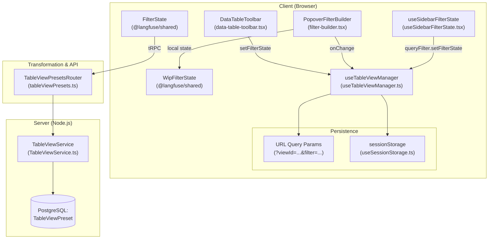
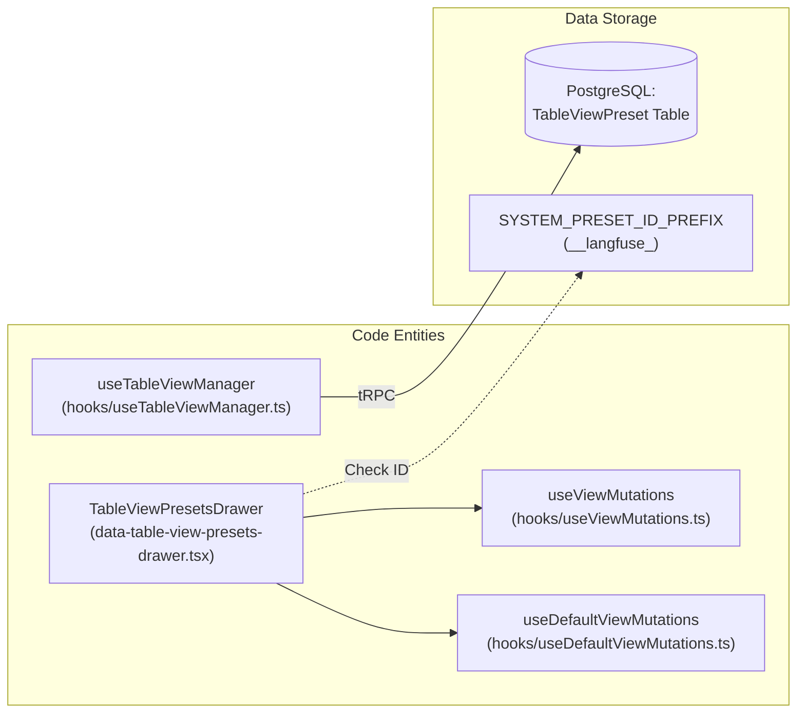

# Filter & View 시스템

관련 소스 파일

이 위키 페이지를 생성하기 위한 컨텍스트로 다음 파일들이 사용되었습니다.

- [packages/shared/src/domain/table-view-presets.ts](packages/shared/src/domain/table-view-presets.ts)
- [packages/shared/src/interfaces/filters.ts](packages/shared/src/interfaces/filters.ts)
- [packages/shared/src/observationsTable.ts](packages/shared/src/observationsTable.ts)
- [packages/shared/src/server/repositories/index.ts](packages/shared/src/server/repositories/index.ts)
- [packages/shared/src/server/repositories/trace-sessions.ts](packages/shared/src/server/repositories/trace-sessions.ts)
- [packages/shared/src/server/services/DefaultViewService/DefaultViewService.ts](packages/shared/src/server/services/DefaultViewService/DefaultViewService.ts)
- [packages/shared/src/server/services/DefaultViewService/types.ts](packages/shared/src/server/services/DefaultViewService/types.ts)
- [packages/shared/src/server/services/TableViewService/TableViewService.ts](packages/shared/src/server/services/TableViewService/TableViewService.ts)
- [packages/shared/src/server/services/TableViewService/index.ts](packages/shared/src/server/services/TableViewService/index.ts)
- [packages/shared/src/server/services/TableViewService/systemPresets.ts](packages/shared/src/server/services/TableViewService/systemPresets.ts)
- [packages/shared/src/server/services/TableViewService/types.ts](packages/shared/src/server/services/TableViewService/types.ts)
- [packages/shared/src/tableDefinitions/index.ts](packages/shared/src/tableDefinitions/index.ts)
- [packages/shared/src/tableDefinitions/sessionsView.ts](packages/shared/src/tableDefinitions/sessionsView.ts)
- [packages/shared/src/tableDefinitions/tracesTable.ts](packages/shared/src/tableDefinitions/tracesTable.ts)
- [packages/shared/src/types.ts](packages/shared/src/types.ts)
- [web/src/__tests__/server/table-view-namespace-compat.servertest.ts](web/src/__tests__/server/table-view-namespace-compat.servertest.ts)
- [web/src/components/table/data-table-controls.tsx](web/src/components/table/data-table-controls.tsx)
- [web/src/components/table/data-table-toolbar.tsx](web/src/components/table/data-table-toolbar.tsx)
- [web/src/components/table/table-view-presets/components/data-table-view-presets-drawer.tsx](web/src/components/table/table-view-presets/components/data-table-view-presets-drawer.tsx)
- [web/src/components/table/table-view-presets/hooks/useDefaultViewMutations.ts](web/src/components/table/table-view-presets/hooks/useDefaultViewMutations.ts)
- [web/src/components/table/table-view-presets/hooks/useTableViewManager.ts](web/src/components/table/table-view-presets/hooks/useTableViewManager.ts)
- [web/src/components/table/table-view-presets/hooks/useViewData.ts](web/src/components/table/table-view-presets/hooks/useViewData.ts)
- [web/src/features/column-visibility/hooks/useColumnOrder.ts](web/src/features/column-visibility/hooks/useColumnOrder.ts)
- [web/src/features/filters/components/filter-builder.tsx](web/src/features/filters/components/filter-builder.tsx)
- [web/src/features/filters/config/evaluators-config.ts](web/src/features/filters/config/evaluators-config.ts)
- [web/src/features/filters/config/observations-config.ts](web/src/features/filters/config/observations-config.ts)
- [web/src/features/filters/config/prompts-config.ts](web/src/features/filters/config/prompts-config.ts)
- [web/src/features/filters/config/scores-config.ts](web/src/features/filters/config/scores-config.ts)
- [web/src/features/filters/config/sessions-config.ts](web/src/features/filters/config/sessions-config.ts)
- [web/src/features/filters/config/traces-config.ts](web/src/features/filters/config/traces-config.ts)
- [web/src/features/filters/filter-integration.clienttest.ts](web/src/features/filters/filter-integration.clienttest.ts)
- [web/src/features/filters/hooks/useFilterState.ts](web/src/features/filters/hooks/useFilterState.ts)
- [web/src/features/filters/hooks/useSidebarFilterState.tsx](web/src/features/filters/hooks/useSidebarFilterState.tsx)
- [web/src/features/filters/lib/filter-config.ts](web/src/features/filters/lib/filter-config.ts)
- [web/src/features/filters/lib/filter-query-encoding-decoding.clienttest.ts](web/src/features/filters/lib/filter-query-encoding-decoding.clienttest.ts)
- [web/src/features/filters/lib/filter-query-encoding.ts](web/src/features/filters/lib/filter-query-encoding.ts)
- [web/src/server/api/definitions/scoresTable.ts](web/src/server/api/definitions/scoresTable.ts)
- [web/src/server/api/routers/tableViewPresets.ts](web/src/server/api/routers/tableViewPresets.ts)
- [web/src/server/api/services/tableDefinitions.ts](web/src/server/api/services/tableDefinitions.ts)

## 목적과 범위

Filter & View System은 Langfuse 웹 애플리케이션의 모든 data table을 위한 포괄적인 filtering 및 view management infrastructure를 제공합니다. 사용자가 table data를 interactive하게 filter하고, filter configuration을 재사용 가능한 view(preset)로 저장하며, session 전반에서 filter state를 지속할 수 있게 합니다. 이 system은 traces, observations, scores, sessions, prompts, user table 전반에서 사용됩니다.

filtered data를 렌더링하는 underlying table component에 대한 정보는 [Table Components System](8.2)을 참조하세요. filter에서 사용하는 state management pattern은 [UI State Management](8.3)를 참조하세요.

---

## Architecture Overview

filter system은 filter state가 client에서 관리되고, URL과 session storage에 지속되며, backend consumption을 위해 변환되고, server에서 SQL query로 실행되는 coordinated client-server architecture로 동작합니다.

### System Data Flow

다음 diagram은 Natural Language UI concept를 이를 구현하는 Code Entity와 연결합니다.

**Title: Filter Data Flow: UI to Database**

**출처:** [web/src/features/filters/components/filter-builder.tsx:81-153](), [web/src/components/table/table-view-presets/hooks/useTableViewManager.ts:57-88](), [web/src/features/filters/hooks/useSidebarFilterState.tsx:1-40]()

---

## Filter State Management

### Core State Hooks
filter persistence와 view resolution을 위한 system의 primary mechanism은 `useTableViewManager` hook입니다. 이 hook은 table state를 세 위치에 걸쳐 synchronize합니다.
1.  **React State**: parent table에서 전달된 `stateUpdaters`를 통해 관리됩니다 [web/src/components/table/table-view-presets/hooks/useTableViewManager.ts:22-29]().
2.  **URL Query Parameters**: `viewId`와 `filter` key에 `useQueryParam`을 사용합니다 [web/src/components/table/table-view-presets/hooks/useTableViewManager.ts:79-83](), [web/src/features/filters/hooks/useFilterState.ts:157-160]().
3.  **Session Storage**: project 안의 특정 table에 대해 마지막으로 선택한 view를 보존합니다 [web/src/components/table/table-view-presets/hooks/useTableViewManager.ts:75-78]().

### Work-in-Progress (WIP) State
`PopoverFilterBuilder`는 local `wipFilterState`를 관리합니다. 이를 통해 user는 filter가 valid해질 때까지 table reload를 즉시 trigger하거나 global URL state를 update하지 않고 filter를 추가하거나 수정할 수 있습니다(예: empty row 추가) [web/src/features/filters/components/filter-builder.tsx:102-153](). valid filter는 `@langfuse/shared`의 `singleFilter` schema를 사용해 parse됩니다 [web/src/features/filters/components/filter-builder.tsx:137-142]().

### Encoding & Decoding
filter는 semicolon-delimited string format인 `columnId;type;key;operator;value`로 encoding됩니다 [web/src/features/filters/hooks/useFilterState.ts:50-57](). 여러 filter는 comma로 구분됩니다 [web/src/features/filters/hooks/useFilterState.ts:75-76]().
- **Array Values**: pipe `|` character로 join됩니다 [web/src/features/filters/hooks/useFilterState.ts:63]().
- **Escaping**: value 안의 literal pipe character는 delimiter collision을 방지하기 위해 `\|`로 escape됩니다 [web/src/features/filters/lib/filter-query-encoding.ts:11-13]().

**출처:** [web/src/components/table/table-view-presets/hooks/useTableViewManager.ts:57-114](), [web/src/features/filters/components/filter-builder.tsx:102-153](), [web/src/features/filters/hooks/useFilterState.ts:39-124](), [web/src/features/filters/lib/filter-query-encoding.ts:11-43]()

---

## Filter Components & Operators

### Column Definitions & Facets
table은 data type과 internal SQL/ClickHouse mapping을 지정하는 `ColumnDefinition` object에 의해 구동됩니다. `observationsTableCols` 같은 feature-specific configuration은 UI에서 사용할 수 있는 facet(categorical, numeric, boolean, string)을 정의합니다 [packages/shared/src/observationsTable.ts:10-272]().

### Sidebar Filter System
`useSidebarFilterState` hook은 collapsible filter sidebar를 구동하는 UI-ready filter object(`CategoricalUIFilter`, `NumericUIFilter` 등)를 생성합니다 [web/src/features/filters/hooks/useSidebarFilterState.tsx:116-194](). 이 system은 다음을 지원합니다.
- **Categorical Facets**: "any of", "all of", "none of" logic을 사용하는 checkbox selection [web/src/features/filters/hooks/useSidebarFilterState.tsx:137-159]().
- **Text Filters**: categorical column에서 "contains" 또는 "does not contain" logic을 허용하는 checkbox selection과의 mutual exclusion [web/src/features/filters/hooks/useSidebarFilterState.tsx:161-179]().
- **Key-Value Filters**: user가 특정 key와 value를 선택하는 dynamic metadata 또는 score filtering에 사용됩니다 [web/src/features/filters/hooks/useSidebarFilterState.tsx:198-208]().

### Filter Operators
| Type | Operators | UI Component |
| :--- | :--- | :--- |
| `string` | `contains`, `does not contain`, `=`, `!=` | `Input` / `Textarea` [web/src/features/filters/components/filter-builder.tsx:2-3]() |
| `categorical` | `any of`, `none of`, `all of` | `MultiSelect` 또는 `CategoricalFacet` [web/src/components/table/data-table-controls.tsx:192]() |
| `datetime` | `>`, `<` | `DatePicker` [web/src/features/filters/components/filter-builder.tsx:11]() |
| `number` | `=`, `>`, `<`, `>=`, `<=` | `Input` (number) 또는 `Slider` [web/src/features/filters/components/filter-builder.tsx:2](), [web/src/components/table/data-table-controls.tsx:24]() |

**출처:** [web/src/features/filters/hooks/useSidebarFilterState.tsx:116-208](), [packages/shared/src/observationsTable.ts:10-272](), [web/src/components/table/data-table-controls.tsx:189-220]()

---

## Saved Views (TableViewPresets)

View System은 user가 filter, sorting, column visibility의 특정 조합을 PostgreSQL에 저장되는 "Preset"으로 저장할 수 있게 합니다.

### View Preset Logic
**Title: View Preset Management Entities**

**출처:** [web/src/components/table/table-view-presets/components/data-table-view-presets-drawer.tsx:172-189](), [web/src/components/table/table-view-presets/hooks/useTableViewManager.ts:57-88]()

### TableViewPresetsDrawer
`TableViewPresetsDrawer` component [web/src/components/table/table-view-presets/components/data-table-view-presets-drawer.tsx:172]()는 view의 lifecycle을 관리합니다.
- **System Presets**: code에 정의된 hardcoded view입니다(예: `__langfuse_default__`). database lookup을 우회하기 위해 `SYSTEM_PRESET_ID_PREFIX`를 사용합니다 [web/src/components/table/table-view-presets/components/data-table-view-presets-drawer.tsx:93-126]().
- **Default Views**: user는 view를 personal default 또는 project-wide default로 지정할 수 있습니다. system은 User Default > Project Default > System Default 순서로 이를 resolve합니다 [web/src/components/table/table-view-presets/hooks/useTableViewManager.ts:89-97]().

### View Lifecycle & Bootstrapping
`useTableViewManager` hook은 page load 시 saved view 적용을 조정합니다 [web/src/components/table/table-view-presets/hooks/useTableViewManager.ts:144-201](). bootstrapping을 위해 다음 priority list를 따릅니다.
1. **URL Parameters**: URL query string에 `viewId`가 있는 경우 [web/src/components/table/table-view-presets/hooks/useTableViewManager.ts:152-156]().
2. **Session Storage**: URL param이 없으면 해당 table/project에 대해 마지막으로 사용한 view를 복원합니다 [web/src/components/table/table-view-presets/hooks/useTableViewManager.ts:165-171]().
3. **Database Default**: user/project에 지정된 default view를 fetch합니다 [web/src/components/table/table-view-presets/hooks/useTableViewManager.ts:176-184]().

**출처:** [web/src/components/table/table-view-presets/components/data-table-view-presets-drawer.tsx:89-215](), [web/src/components/table/table-view-presets/hooks/useTableViewManager.ts:57-201]()

---

## Natural Language Filter Generation (Cloud-Only)

Langfuse Cloud에서 filter system은 natural language description에서 complex filter state를 생성하기 위해 AI와 통합됩니다.

1. **User Interface**: `DataTableAIFilters` component는 natural language prompt를 위한 text input을 제공합니다 [web/src/components/table/data-table-controls.tsx:174-177]().
2. **Generation**: prompt가 submit되면 system은 natural language request를 기반으로 `FilterState`를 생성합니다.
3. **Application**: 생성된 filter는 table의 filter state를 update하고 관련 sidebar filter category를 자동으로 expand하는 `handleFiltersGenerated`를 통해 적용됩니다 [web/src/components/table/data-table-controls.tsx:115-134]().
4. **Visibility**: 이 feature는 `filterWithAI`와 `isLangfuseCloud` check를 기반으로 conditional rendering됩니다 [web/src/components/table/data-table-controls.tsx:161]().

**출처:** [web/src/components/table/data-table-controls.tsx:108-181](), [web/src/features/filters/components/filter-builder.tsx:87-98]()
