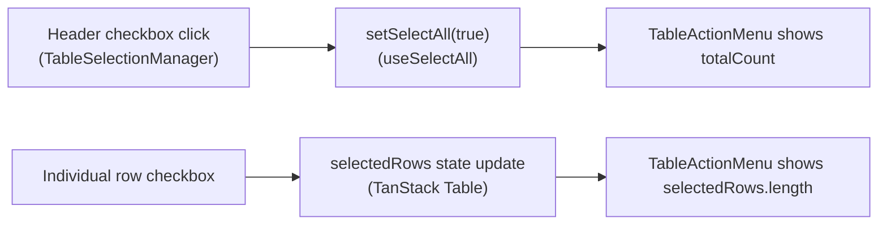
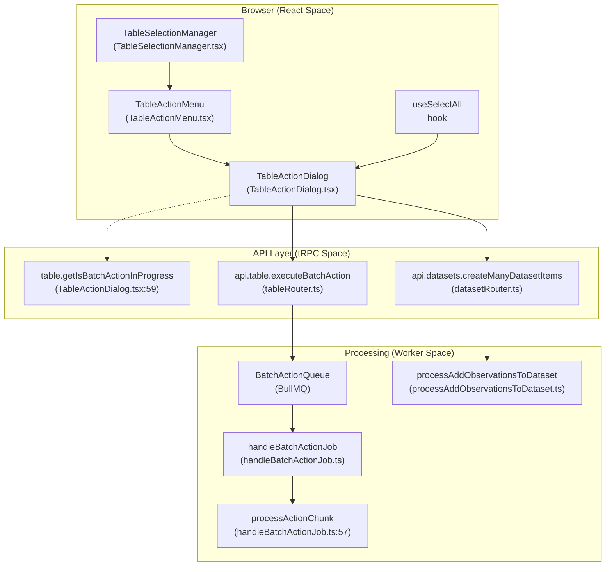
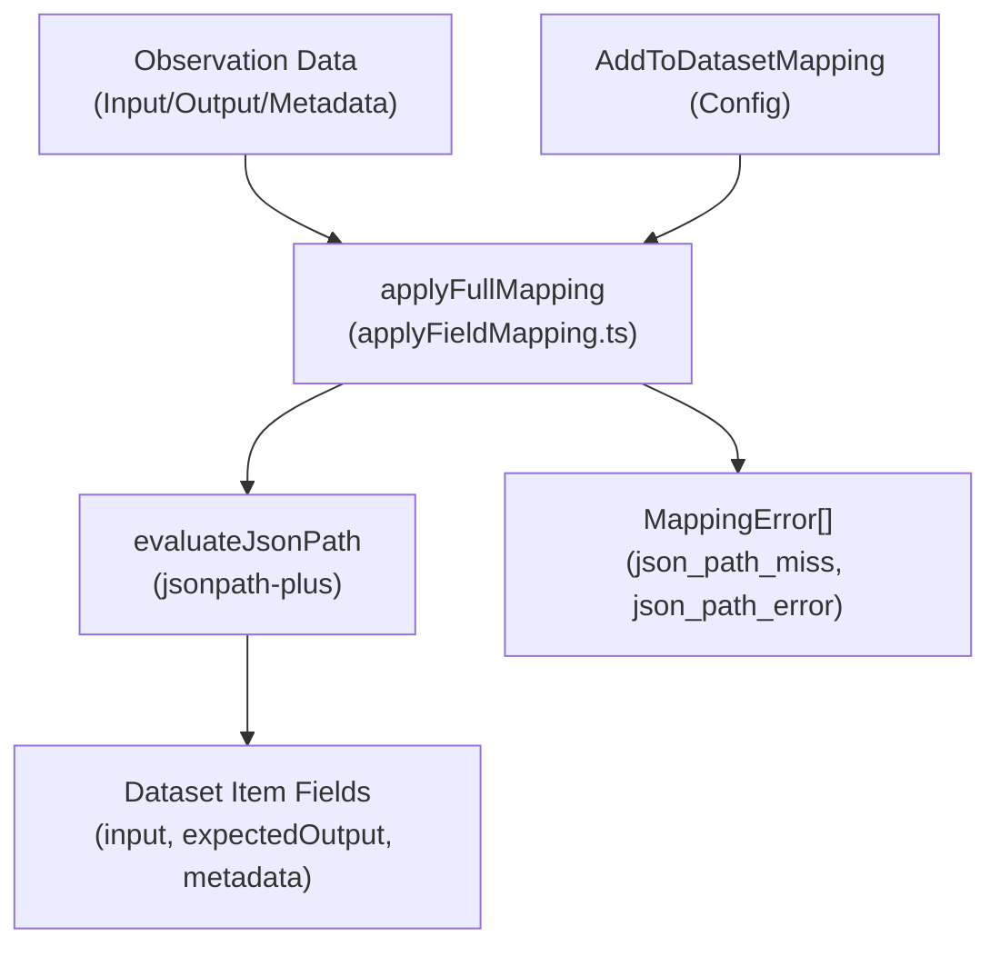
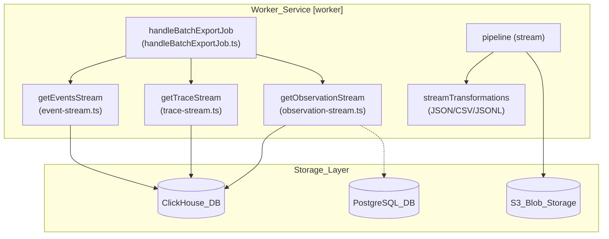

# Batch Actions & Selection

관련 소스 파일

이 위키 페이지를 생성하기 위한 컨텍스트로 다음 파일들이 사용되었습니다.

- [packages/shared/src/features/batchAction/applyFieldMapping.ts](packages/shared/src/features/batchAction/applyFieldMapping.ts)
- [packages/shared/src/features/batchAction/types.ts](packages/shared/src/features/batchAction/types.ts)
- [packages/shared/src/features/batchExport/types.ts](packages/shared/src/features/batchExport/types.ts)
- [packages/shared/src/interfaces/tableNames.ts](packages/shared/src/interfaces/tableNames.ts)
- [web/src/__tests__/server/observations-comment-filter.servertest.ts](web/src/__tests__/server/observations-comment-filter.servertest.ts)
- [web/src/components/table/data-table-multi-select-actions/data-table-select-all-banner.tsx](web/src/components/table/data-table-multi-select-actions/data-table-select-all-banner.tsx)
- [web/src/features/batch-actions/components/AddObservationsToDatasetDialog/FinalPreviewStep.tsx](web/src/features/batch-actions/components/AddObservationsToDatasetDialog/FinalPreviewStep.tsx)
- [web/src/features/batch-actions/components/AddObservationsToDatasetDialog/components/CustomMappingEditor.tsx](web/src/features/batch-actions/components/AddObservationsToDatasetDialog/components/CustomMappingEditor.tsx)
- [web/src/features/batch-actions/components/AddObservationsToDatasetDialog/components/IssueBanner.tsx](web/src/features/batch-actions/components/AddObservationsToDatasetDialog/components/IssueBanner.tsx)
- [web/src/features/batch-actions/components/AddObservationsToDatasetDialog/components/JsonPathInput.tsx](web/src/features/batch-actions/components/AddObservationsToDatasetDialog/components/JsonPathInput.tsx)
- [web/src/features/batch-actions/components/AddObservationsToDatasetDialog/components/MappingPreviewPanel.tsx](web/src/features/batch-actions/components/AddObservationsToDatasetDialog/components/MappingPreviewPanel.tsx)
- [web/src/features/batch-actions/components/RunEvaluationDialog/ConfirmationStep.tsx](web/src/features/batch-actions/components/RunEvaluationDialog/ConfirmationStep.tsx)
- [web/src/features/batch-actions/components/RunEvaluationDialog/CreateEvaluatorDialog.tsx](web/src/features/batch-actions/components/RunEvaluationDialog/CreateEvaluatorDialog.tsx)
- [web/src/features/batch-actions/components/RunEvaluationDialog/EvaluatorSelectionStep.tsx](web/src/features/batch-actions/components/RunEvaluationDialog/EvaluatorSelectionStep.tsx)
- [web/src/features/batch-actions/components/RunEvaluationDialog/utils.ts](web/src/features/batch-actions/components/RunEvaluationDialog/utils.ts)
- [web/src/features/batch-actions/server/addToDatasetRouter.ts](web/src/features/batch-actions/server/addToDatasetRouter.ts)
- [web/src/features/batch-actions/server/runEvaluationRouter.ts](web/src/features/batch-actions/server/runEvaluationRouter.ts)
- [web/src/features/batch-actions/validation.ts](web/src/features/batch-actions/validation.ts)
- [web/src/features/entitlements/hooks.ts](web/src/features/entitlements/hooks.ts)
- [web/src/features/evals/components/evaluation-prompt-preview.tsx](web/src/features/evals/components/evaluation-prompt-preview.tsx)
- [web/src/features/evals/hooks/useExtractVariables.ts](web/src/features/evals/hooks/useExtractVariables.ts)
- [web/src/features/table/components/TableActionDialog.tsx](web/src/features/table/components/TableActionDialog.tsx)
- [web/src/features/table/components/TableActionTargetOptions.tsx](web/src/features/table/components/TableActionTargetOptions.tsx)
- [web/src/features/table/components/TableSelectionManager.tsx](web/src/features/table/components/TableSelectionManager.tsx)
- [web/src/features/table/components/targetOptionsQueryMap.tsx](web/src/features/table/components/targetOptionsQueryMap.tsx)
- [web/src/features/table/server/createBatchActionJob.ts](web/src/features/table/server/createBatchActionJob.ts)
- [web/src/features/table/types.ts](web/src/features/table/types.ts)
- [worker/src/__tests__/applyFieldMapping.test.ts](worker/src/__tests__/applyFieldMapping.test.ts)
- [worker/src/__tests__/batchAction.test.ts](worker/src/__tests__/batchAction.test.ts)
- [worker/src/__tests__/batchExport.test.ts](worker/src/__tests__/batchExport.test.ts)
- [worker/src/features/batchAction/handleBatchActionJob.ts](worker/src/features/batchAction/handleBatchActionJob.ts)
- [worker/src/features/batchAction/processAddToQueue.ts](worker/src/features/batchAction/processAddToQueue.ts)
- [worker/src/features/batchExport/handleBatchExportJob.ts](worker/src/features/batchExport/handleBatchExportJob.ts)
- [worker/src/features/database-read-stream/event-stream.ts](worker/src/features/database-read-stream/event-stream.ts)
- [worker/src/features/database-read-stream/getDatabaseReadStream.ts](worker/src/features/database-read-stream/getDatabaseReadStream.ts)
- [worker/src/features/database-read-stream/observation-stream.ts](worker/src/features/database-read-stream/observation-stream.ts)
- [worker/src/features/database-read-stream/trace-stream.ts](worker/src/features/database-read-stream/trace-stream.ts)

이 페이지는 Langfuse data table에서 사용되는 batch action system을 문서화합니다. 여기에는 row selection state management, "select all" pattern, deletion, annotation, item을 dataset에 추가하는 것과 같은 bulk operation이 포함됩니다.

---

## Selection Model

batch action을 지원하는 table은 local(page-level) selection과 global(filter-level) selection을 모두 처리하기 위해 두 개의 독립적인 selection state를 유지합니다.

| State | Type | Source | Scope |
|---|---|---|---|
| `selectedRows` | `RowSelectionState` | table component의 `useState` | 현재 page에서 명시적으로 check된 row. |
| `selectAll` | `boolean` | `useSelectAll` hook | 모든 page에 걸쳐 현재 filter와 일치하는 모든 row. |

`TableSelectionManager`는 table(Traces, Observations, Sessions, Experiments)에서 selection checkbox column을 생성하기 위해 사용되는 generic component입니다 [web/src/features/table/components/TableSelectionManager.tsx:16-21](). page-level row를 toggle하고 global selection을 clear하는 logic을 포함하는 `selectActionColumn` definition을 제공합니다 [web/src/features/table/components/TableSelectionManager.tsx:23-69]().

### Selection UI Components

- **`DataTableSelectAllBanner`**: 현재 page의 모든 item이 selected되었을 때 나타납니다. user에게 "Select all X items across Y pages" option을 제공하며, 이는 `selectAll` state를 `true`로 설정합니다 [web/src/components/table/data-table-multi-select-actions/data-table-select-all-banner.tsx:5-52]().
- **`TableActionMenu`**: `selectedCount > 0`일 때 나타나는 floating bar입니다. selected item count를 표시하고 사용 가능한 `TableAction` button을 렌더링합니다 [web/src/features/table/components/TableActionMenu.tsx:64-116]().
- **`BatchExportTableButton`**: data export를 trigger하기 위한 specialized button입니다. comment나 cross-table filter 같은 특정 filter가 해당 export table에서 지원되지 않는 경우 warning을 표시합니다 [web/src/components/BatchExportTableButton.tsx:76-92]().

### Selection Data Flow

Title: Selection State Logic

출처: [web/src/features/table/components/TableSelectionManager.tsx:30-51](), [web/src/components/table/data-table-multi-select-actions/data-table-select-all-banner.tsx:15-50](), [web/src/features/table/components/TableActionMenu.tsx:67-72]()

---

## Batch Action Pipeline

system은 tRPC mutation을 통해 UI selection을 background processing에 연결합니다. `TableActionMenu`와 `TableActionDialog` 같은 UI component는 user intent에서 execution으로 전환되는 과정을 관리합니다.

Title: Batch Action Pipeline (Natural Language to Code Entities)

출처: [web/src/features/table/components/TableActionMenu.tsx:35-42](), [web/src/features/table/components/TableActionDialog.tsx:44-51](), [web/src/features/table/components/TableActionDialog.tsx:88-97](), [worker/src/features/batchAction/handleBatchActionJob.ts:141-148]()

### `TableAction` Type

각 table component는 `TableAction[]` array를 조립합니다. `TableActionMenu`는 이를 읽어 action button을 렌더링합니다 [web/src/features/table/components/TableActionMenu.tsx:83-113]().

| Field | Type | Purpose |
|---|---|---|
| `id` | `ActionId` | operation을 식별하는 string constant입니다(예: `ActionId.DeleteTraces`) [web/src/features/table/types.ts:7](). |
| `type` | `BatchActionType` | UI styling과 default icon(`create` 또는 `delete`)을 결정합니다 [web/src/features/table/types.ts:18-30](). |
| `execute` | `async function` | mutation trigger이며 `{ projectId, targetId? }`를 받습니다 [web/src/features/table/types.ts:20-26](). |
| `accessCheck` | `object` | 필요한 RBAC `scope`와 `entitlement`를 정의합니다 [web/src/features/table/types.ts:11-14](). |
| `customDialog` | `boolean?` | `true`이면 menu가 `TableActionDialog` 대신 specialized component에 위임합니다 [web/src/features/table/components/TableActionMenu.tsx:49](). |

---

## Add to Dataset Mapping

batch action을 통해 item을 dataset에 추가하는 과정에는 JSONPath selector를 사용해 trace나 observation에서 특정 field를 추출할 수 있게 하는 복잡한 mapping system이 포함됩니다.

### Field Mapping Configuration
mapping logic은 `applyFieldMapping.ts`에 정의되어 있으며 세 가지 mode를 지원합니다 [packages/shared/src/features/batchAction/applyFieldMapping.ts:137-211]().
- **`full`**: 전체 source field(input, output 또는 metadata)를 dataset item field에 mapping합니다 [packages/shared/src/features/batchAction/applyFieldMapping.ts:138-139]().
- **`none`**: dataset item field를 null로 설정합니다 [packages/shared/src/features/batchAction/applyFieldMapping.ts:141-143]().
- **`custom`**: `root` extraction(single JSONPath) 또는 `keyValueMap`(여러 JSONPath로 새 object build)을 허용합니다 [packages/shared/src/features/batchAction/applyFieldMapping.ts:145-208]().

### JSONPath Evaluation
system은 observation data에 대해 selector를 evaluate하기 위해 `jsonpath-plus`를 사용합니다 [packages/shared/src/features/batchAction/applyFieldMapping.ts:1-62]().
- `evaluateJsonPath`: `$`로 시작하는 path를 기반으로 JSON object에서 value를 추출합니다 [packages/shared/src/features/batchAction/applyFieldMapping.ts:62-72]().
- `testJsonPath`: JSONPath string의 syntax를 validate합니다 [packages/shared/src/features/batchAction/applyFieldMapping.ts:42-57]().

Title: Field Mapping Data Flow

출처: [packages/shared/src/features/batchAction/applyFieldMapping.ts:101-105](), [packages/shared/src/features/batchAction/applyFieldMapping.ts:221-232](), [worker/src/features/batchAction/processAddObservationsToDataset.ts:38-40]()

---

## Experiment Table Selection

`ExperimentItemsTable`은 selected item 전반에서 evaluation을 실행하는 것과 같은 experiment run에 대한 batch operation을 허용하기 위해 selection system을 활용합니다.

- checkbox를 제공하기 위해 `TableSelectionManager`를 통합합니다 [web/src/features/experiments/components/table/ExperimentItemsTable.tsx:41]().
- experiment item 전반의 global selection state를 추적하기 위해 `useSelectAll` hook을 사용합니다 [web/src/features/experiments/components/table/ExperimentItemsTable.tsx:42]().
- `ExperimentGridView`와 `ExperimentCompareTable`은 서로 다른 visualization 사이의 consistency를 유지하기 위해 selection state를 모두 받습니다 [web/src/features/experiments/components/table/ExperimentGridView.tsx:38](), [web/src/features/experiments/components/table/ExperimentCompareTable.tsx:61]().

출처: [web/src/features/experiments/components/table/ExperimentItemsTable.tsx:41-43](), [web/src/features/experiments/components/table/ExperimentItemsTable.tsx:320-330]()

---

## Worker-Side Execution

대규모 data set에 대해 batch action이 trigger되면(`selectAll`을 통해), web client는 `BatchAction` record를 생성합니다. worker service는 `handleBatchActionJob`을 통해 execution을 처리합니다 [worker/src/features/batchAction/handleBatchActionJob.ts:141-144]().

### Job Processing Flow
1.  **Job Dispatch**: tRPC mutation이 `BatchActionQueue`에 job을 추가합니다.
2.  **Streaming**: worker는 `getDatabaseReadStreamPaginated`, `getObservationStream` 또는 `getTraceIdentifierStream`을 사용해 original UI filter와 일치하는 record를 fetch합니다 [worker/src/features/batchAction/handleBatchActionJob.ts:176-202]().
3.  **Chunking**: record는 `CHUNK_SIZE`(기본값 1000)로 정의된 batch 단위로 collect되고 process됩니다 [worker/src/features/batchAction/handleBatchActionJob.ts:43](), [worker/src/features/batchAction/handleBatchActionJob.ts:211-220]().
4.  **Execution**: `processActionChunk`는 batch를 `traceDeletionProcessor`, `processAddTracesToQueue`, `processClickhouseScoreDelete` 같은 specific processor로 route합니다 [worker/src/features/batchAction/handleBatchActionJob.ts:58-101]().
5.  **Status Polling**: UI는 completion까지 loader를 표시하고 추가 action을 disable하기 위해 `getIsBatchActionInProgress`를 poll합니다 [web/src/features/table/components/TableActionDialog.tsx:59-68]().

### Batch Export Processing
Batch Export(`handleBatchExportJob.ts`에서 처리)는 data를 CSV, JSON 또는 JSONL format으로 S3에 stream합니다 [worker/src/features/batchExport/handleBatchExportJob.ts:34-40](), [packages/shared/src/features/batchExport/types.ts:18-22]().
- **Comment Filters**: comment filter가 적용된 경우 worker는 stream을 시작하기 전에 object ID를 resolve하기 위해 `applyCommentFilters`를 호출합니다 [worker/src/features/batchExport/handleBatchExportJob.ts:145-150]().
- **Streaming**: data는 score와 metadata를 포함하기 위해 complex ClickHouse join을 수행하는 `getObservationStream`, `getTraceStream`, `getEventsStream` 같은 specialized stream을 통해 읽습니다 [worker/src/features/batchExport/handleBatchExportJob.ts:174-202]().
- **Score Handling**: numeric 및 categorical score는 `scores_agg` 같은 CTE를 사용해 ClickHouse에서 aggregate된 뒤 export output을 위해 flatten됩니다 [worker/src/features/database-read-stream/observation-stream.ts:136-181](), [worker/src/features/database-read-stream/getDatabaseReadStream.ts:68-97]().
- **Transformation**: pipeline은 `streamTransformations`를 사용해 database row를 target format으로 transform합니다 [worker/src/features/batchExport/handleBatchExportJob.ts:220-223]().

Title: Batch Export Data Flow (System Entities)

출처: [worker/src/features/batchExport/handleBatchExportJob.ts:34-40](), [worker/src/features/batchExport/handleBatchExportJob.ts:174-202](), [worker/src/features/database-read-stream/observation-stream.ts:34-42](), [worker/src/features/database-read-stream/trace-stream.ts:29-36](), [worker/src/features/database-read-stream/event-stream.ts:46-53]()
