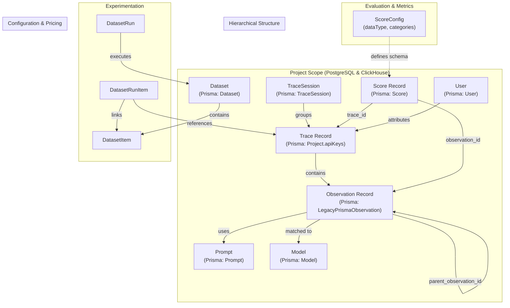
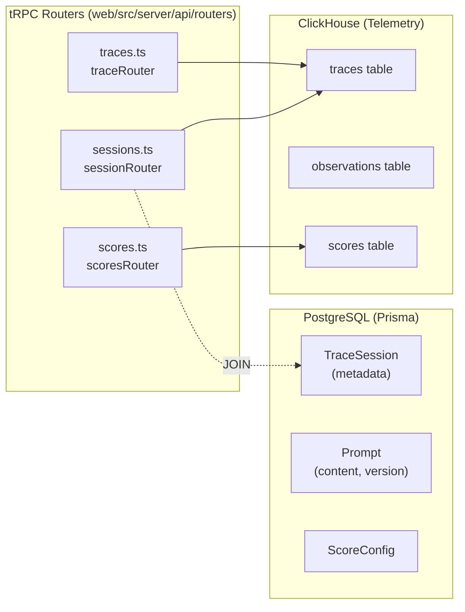

# 핵심 도메인 기능

관련 소스 파일

이 위키 페이지를 생성하기 위한 컨텍스트로 다음 파일들이 사용되었습니다.

- [packages/shared/prisma/schema.prisma](packages/shared/prisma/schema.prisma)
- [packages/shared/src/server/queries/clickhouse-sql/search.ts](packages/shared/src/server/queries/clickhouse-sql/search.ts)
- [packages/shared/src/server/repositories/observations.ts](packages/shared/src/server/repositories/observations.ts)
- [packages/shared/src/server/repositories/scores.ts](packages/shared/src/server/repositories/scores.ts)
- [packages/shared/src/server/repositories/traces.ts](packages/shared/src/server/repositories/traces.ts)
- [packages/shared/src/server/services/sessions-ui-table-service.ts](packages/shared/src/server/services/sessions-ui-table-service.ts)
- [packages/shared/src/server/services/traces-ui-table-service.ts](packages/shared/src/server/services/traces-ui-table-service.ts)
- [web/src/__tests__/organization-settings-pages.clienttest.tsx](web/src/__tests__/organization-settings-pages.clienttest.tsx)
- [web/src/__tests__/server/clickhouseSearchCondition.servertest.ts](web/src/__tests__/server/clickhouseSearchCondition.servertest.ts)
- [web/src/features/audit-logs/auditLog.ts](web/src/features/audit-logs/auditLog.ts)
- [web/src/features/models/components/ModelSettings.tsx](web/src/features/models/components/ModelSettings.tsx)
- [web/src/pages/organization/[organizationId]/settings/index.tsx](web/src/pages/organization/[organizationId]/settings/index.tsx)
- [web/src/pages/project/[projectId]/settings/index.tsx](web/src/pages/project/[projectId]/settings/index.tsx)
- [web/src/server/api/root.ts](web/src/server/api/root.ts)
- [web/src/server/api/routers/generations/filterOptionsQuery.ts](web/src/server/api/routers/generations/filterOptionsQuery.ts)
- [web/src/server/api/routers/public.ts](web/src/server/api/routers/public.ts)
- [web/src/server/api/routers/scores.ts](web/src/server/api/routers/scores.ts)
- [web/src/server/api/routers/sessions.ts](web/src/server/api/routers/sessions.ts)
- [web/src/server/api/routers/traces.ts](web/src/server/api/routers/traces.ts)

이 페이지는 Langfuse observability platform의 핵심 domain entity를 설명합니다. 이 entity들은 LLM application을 tracing하고, output을 evaluation하며, performance를 analysis하기 위한 기반을 형성합니다. 각 entity type에 대한 자세한 정보는 [Traces & Observations](#9.1)부터 [Monitors & Alerting](#9.9)까지의 하위 페이지를 참조하세요.

이 entity들이 ingest되고 저장되는 방식에 대한 정보는 [Data Ingestion Pipeline](#6)을 참조하세요. database architecture에 대한 자세한 내용은 [Data Architecture](#3)를 참조하세요.

## Domain Model Overview

다음 diagram은 primary domain entity 사이의 관계를 보여줍니다. repository layer와 database schema에서 사용되는 specific code entity에 natural language concept를 연결합니다.

**출처:**
- [packages/shared/prisma/schema.prisma:116-153]()
- [packages/shared/prisma/schema.prisma:344-386]()
- [packages/shared/prisma/schema.prisma:415-451]()
- [packages/shared/src/server/repositories/traces.ts:198-204]()

## Entity Storage and Access Patterns

Langfuse는 dual-database architecture를 활용합니다. metadata와 configuration은 Prisma를 통해 PostgreSQL에 저장되고, high-volume telemetry data(traces, observations, scores)는 analytical performance를 위해 ClickHouse에 저장됩니다. UI layer는 specialized tRPC router를 통해 이 data를 fetch합니다.

**출처:**
- [web/src/server/api/root.ts:1-60]()
- [web/src/server/api/root.ts:70-76]()
- [packages/shared/src/server/repositories/traces.ts:173-182]()
- [packages/shared/src/server/repositories/observations.ts:183-188]()

## Traces

**Primary Entity:** `TraceRecordReadType`은 repository layer에서 사용되는 trace data structure를 나타내며, core field와 metric을 aggregate합니다 [packages/shared/src/server/repositories/definitions.ts:1-100]().

Trace는 top-level execution unit을 나타냅니다. 각 trace는 단일 user request나 autonomous agent run 같은 complete workflow를 capture합니다. Trace는 모든 nested observation 전반의 latency, total cost, token usage를 추적합니다. `traceRouter`는 UI에서 이 data를 탐색하기 위한 primary interface를 제공합니다 [web/src/server/api/routers/traces.ts:97-152]().

### Key Attributes
- `id`: 고유한 trace identifier [packages/shared/src/server/repositories/traces.ts:159]().
- `timestamp`: trace의 start time [packages/shared/src/server/repositories/traces.ts:161]().
- `metadata`: custom attribute를 위한 flexible JSON storage.
- `tags`: categorization을 위한 string array [packages/shared/src/server/services/traces-ui-table-service.ts:45]().

**자세한 범위:** [Traces & Observations](#9.1) 참조

## Observations

**Primary Entity:** `ObservationRecordReadType`은 trace hierarchy 안의 개별 step을 나타냅니다 [packages/shared/src/server/repositories/definitions.ts:1-100]().

Observation에는 generic span과 LLM usage를 추적하는 specific `GENERATION` type이 포함됩니다. Observation은 `trace_id`를 통해 trace에 연결되며 `parent_observation_id`를 사용해 nested될 수 있습니다 [packages/shared/src/server/repositories/observations.ts:151-156]().

### Observation Types
- `SPAN`: duration이 있는 generic operation.
- `GENERATION`: `usage_details`와 `cost_details`를 추적하는 LLM completion call [packages/shared/src/server/repositories/observations.ts:168-171]().
- `EVENT`: point-in-time event.
- `TOOL`: external tool 또는 function execution.

**자세한 범위:** [Traces & Observations](#9.1) 참조

## Scores

**Primary Entity:** `Score`(PostgreSQL)와 `ScoreRecordReadType`(ClickHouse) [packages/shared/prisma/schema.prisma:344]().

Score는 trace 또는 observation의 evaluation을 나타냅니다. `dataType`(NUMERIC, CATEGORICAL, BOOLEAN)과 `source`(API, ANNOTATION, EVAL)로 categorized됩니다 [packages/shared/src/server/repositories/scores.ts:1-10](). Score는 quality analysis를 위한 high-level metric을 제공하기 위해 자주 aggregate됩니다. `ScoreConfig` entity는 score의 schema와 valid range/category를 정의합니다 [packages/shared/prisma/schema.prisma:388-406]().

**자세한 범위:** [Scores & Scoring](#9.2) 참조

## Sessions

**Dual Storage:** PostgreSQL(`TraceSession` model)의 metadata와 ClickHouse의 aggregated trace data [packages/shared/prisma/schema.prisma:297-313]().

Session은 관련 trace를 group합니다(예: multi-turn chat). `sessionRouter`는 ClickHouse에서 trace를 aggregate하여 `totalCost`와 관련 `users` 같은 session-level metric을 fetch합니다 [web/src/server/api/routers/sessions.ts:71-149]().

**자세한 범위:** [Sessions](#9.3) 참조

## Users

**Primary Entity:** `User`(PostgreSQL)와 `userId`(ClickHouse/Trace context) [packages/shared/prisma/schema.prisma:48-82]().

Langfuse는 LLM application의 end-user를 추적합니다. User는 trace 안의 `userId` string으로 식별됩니다 [packages/shared/src/server/services/traces-ui-table-service.ts:42](). system은 token usage와 total cost를 포함한 user별 metric을 aggregate하여 user-centric analysis와 cost tracking을 가능하게 합니다.

**자세한 범위:** [Sessions](#9.3) 참조

## Prompts & Templates

Langfuse는 prompt가 versioning되고 folder로 구성될 수 있는 Prompt Management system을 제공합니다.
- `Prompt`: prompt string, type(`text` 또는 `chat`), version을 저장하는 PostgreSQL model [packages/shared/prisma/schema.prisma:415-451]().
- `PromptLabel`: version management에 사용됩니다(예: "production", "latest") [packages/shared/prisma/schema.prisma:482-493]().
- `promptRouter`: prompt management를 위한 tRPC router [web/src/server/api/root.ts:18]().

**자세한 범위:** [Prompts & Templates](#9.5) 참조

## Models & Pricing

Model은 cost calculation과 token tracking을 가능하게 하기 위해 PostgreSQL에 정의됩니다.
- `Model`: unit(tokens, characters 등)별 pricing을 정의하는 PostgreSQL model [packages/shared/prisma/schema.prisma:315-342]().
- `ModelsSettings`: model definition과 pricing tier를 관리하기 위한 UI component [web/src/pages/project/[projectId]/settings/index.tsx:26]().

**자세한 범위:** [Models & Pricing](#9.6) 참조

## Dashboard & Analytics

dashboard는 project performance에 대한 high-level view를 제공합니다. `dashboardRouter`와 `scoreAnalyticsRouter` 같은 specialized router를 사용해 traces, observations, scores 전반의 data를 aggregate합니다 [web/src/server/api/root.ts:6-7](). Widget은 시간에 따른 cost, latency, quality score 같은 metric을 시각화합니다.

**자세한 범위:** [Dashboard & Analytics](#9.7) 참조

## Automation System

Automation은 webhook이나 Slack notification을 trigger하는 것과 같은 event-driven workflow를 허용합니다. 이는 database의 `Trigger`, `Action`, `Automation` model을 통해 configuration됩니다 [packages/shared/prisma/schema.prisma:731-768]().

**자세한 범위:** [Automation System](#9.8) 참조

## Monitors & Alerting

Monitor는 observability metric에 대한 threshold-based alerting을 제공합니다. 특정 view와 filter를 추적하고, metric(error rate나 latency 등)이 정의된 threshold를 초과하면 user에게 notification합니다 [packages/shared/prisma/schema.prisma:842-868]().

**자세한 범위:** [Monitors & Alerting](#9.9) 참조
