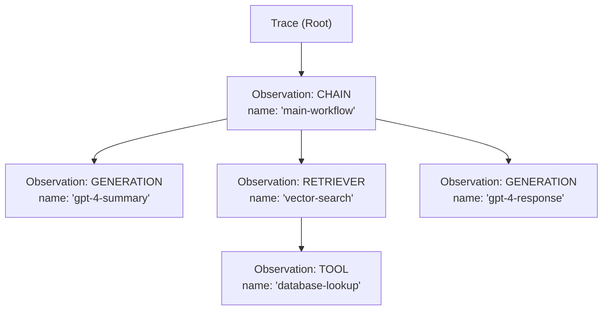
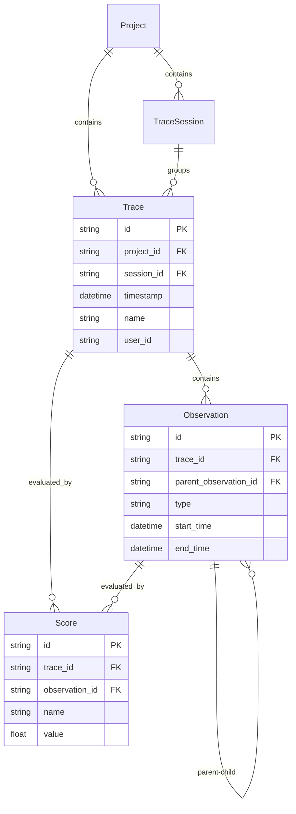
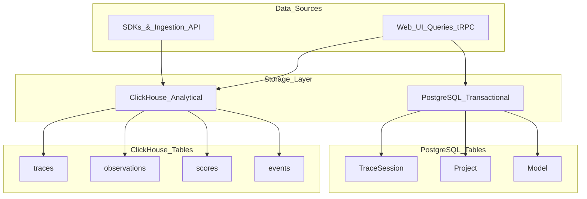
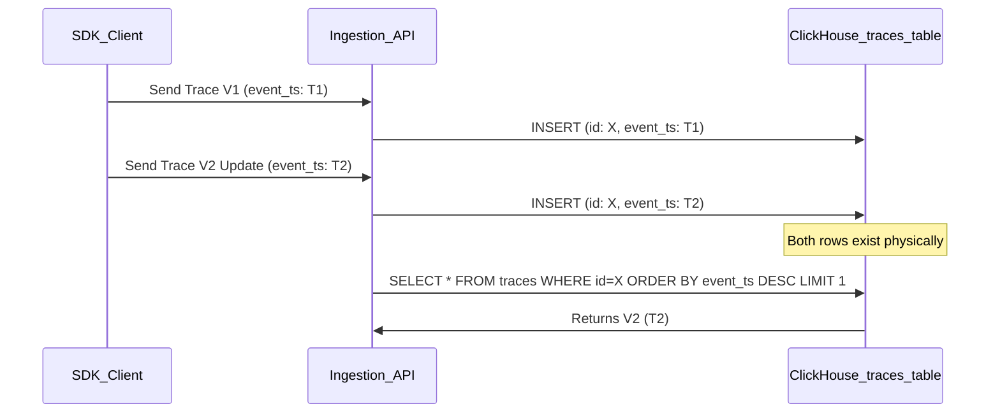
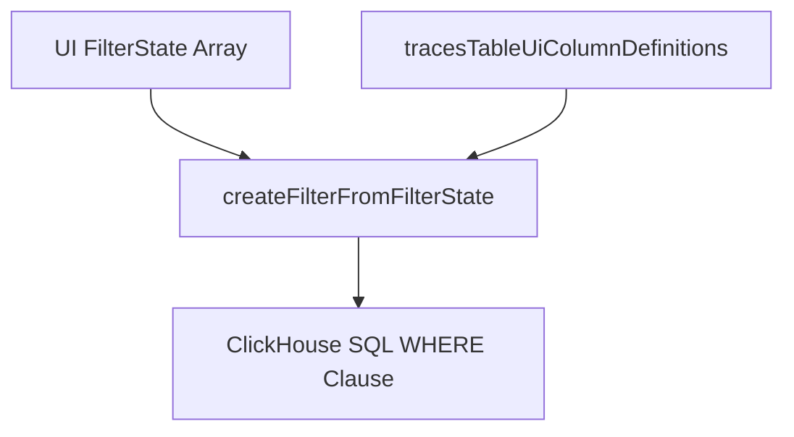

# Traces & Observations

관련 소스 파일

이 위키 페이지를 생성하기 위한 컨텍스트로 다음 파일들이 사용되었습니다.

- [fern/apis/server/definition/trace.yml](fern/apis/server/definition/trace.yml)
- [packages/shared/src/domain/observations.ts](packages/shared/src/domain/observations.ts)
- [packages/shared/src/eventsTable.ts](packages/shared/src/eventsTable.ts)
- [packages/shared/src/server/clickhouse/schema.ts](packages/shared/src/server/clickhouse/schema.ts)
- [packages/shared/src/server/queries/clickhouse-sql/event-query-builder.ts](packages/shared/src/server/queries/clickhouse-sql/event-query-builder.ts)
- [packages/shared/src/server/queries/clickhouse-sql/query-fragments.ts](packages/shared/src/server/queries/clickhouse-sql/query-fragments.ts)
- [packages/shared/src/server/queries/clickhouse-sql/search.ts](packages/shared/src/server/queries/clickhouse-sql/search.ts)
- [packages/shared/src/server/queries/index.ts](packages/shared/src/server/queries/index.ts)
- [packages/shared/src/server/queries/public-api-filter-builder.ts](packages/shared/src/server/queries/public-api-filter-builder.ts)
- [packages/shared/src/server/repositories/events.ts](packages/shared/src/server/repositories/events.ts)
- [packages/shared/src/server/repositories/observations.ts](packages/shared/src/server/repositories/observations.ts)
- [packages/shared/src/server/repositories/observations_converters.ts](packages/shared/src/server/repositories/observations_converters.ts)
- [packages/shared/src/server/repositories/scores.ts](packages/shared/src/server/repositories/scores.ts)
- [packages/shared/src/server/repositories/traces.ts](packages/shared/src/server/repositories/traces.ts)
- [packages/shared/src/server/services/sessions-ui-table-service.ts](packages/shared/src/server/services/sessions-ui-table-service.ts)
- [packages/shared/src/server/services/traces-ui-table-service.ts](packages/shared/src/server/services/traces-ui-table-service.ts)
- [packages/shared/src/server/tableMappings/mapEventsTable.ts](packages/shared/src/server/tableMappings/mapEventsTable.ts)
- [web/src/__tests__/server/clickhouseSearchCondition.servertest.ts](web/src/__tests__/server/clickhouseSearchCondition.servertest.ts)
- [web/src/__tests__/server/observations-api-v2.servertest.ts](web/src/__tests__/server/observations-api-v2.servertest.ts)
- [web/src/__tests__/server/repositories/event-repository.servertest.ts](web/src/__tests__/server/repositories/event-repository.servertest.ts)
- [web/src/__tests__/server/unit/observations-converters.servertest.ts](web/src/__tests__/server/unit/observations-converters.servertest.ts)
- [web/src/components/table/peek/hooks/usePeekData.ts](web/src/components/table/peek/hooks/usePeekData.ts)
- [web/src/features/events/config/filter-config.ts](web/src/features/events/config/filter-config.ts)
- [web/src/features/events/hooks/useEventsFilterOptions.ts](web/src/features/events/hooks/useEventsFilterOptions.ts)
- [web/src/features/events/hooks/useEventsTableData.ts](web/src/features/events/hooks/useEventsTableData.ts)
- [web/src/features/events/hooks/useEventsTraceData.ts](web/src/features/events/hooks/useEventsTraceData.ts)
- [web/src/features/events/lib/eventsToTraceAdapter.clienttest.ts](web/src/features/events/lib/eventsToTraceAdapter.clienttest.ts)
- [web/src/features/events/lib/eventsToTraceAdapter.ts](web/src/features/events/lib/eventsToTraceAdapter.ts)
- [web/src/features/events/server/eventsRouter.ts](web/src/features/events/server/eventsRouter.ts)
- [web/src/features/events/server/eventsService.ts](web/src/features/events/server/eventsService.ts)
- [web/src/features/public-api/types/observations.ts](web/src/features/public-api/types/observations.ts)
- [web/src/features/public-api/types/traces.ts](web/src/features/public-api/types/traces.ts)
- [web/src/hooks/useParsedObservation.ts](web/src/hooks/useParsedObservation.ts)
- [web/src/pages/api/public/events.ts](web/src/pages/api/public/events.ts)
- [web/src/pages/api/public/generations.ts](web/src/pages/api/public/generations.ts)
- [web/src/pages/api/public/observations/[observationId].ts](web/src/pages/api/public/observations/[observationId].ts)
- [web/src/pages/api/public/observations/index.ts](web/src/pages/api/public/observations/index.ts)
- [web/src/pages/api/public/spans.ts](web/src/pages/api/public/spans.ts)
- [web/src/pages/api/public/traces/[traceId].ts](web/src/pages/api/public/traces/[traceId].ts)
- [web/src/pages/api/public/traces/index.ts](web/src/pages/api/public/traces/index.ts)
- [web/src/server/api/routers/generations/filterOptionsQuery.ts](web/src/server/api/routers/generations/filterOptionsQuery.ts)
- [web/src/server/api/routers/scores.ts](web/src/server/api/routers/scores.ts)
- [web/src/server/api/routers/sessions.ts](web/src/server/api/routers/sessions.ts)
- [web/src/server/api/routers/traces.ts](web/src/server/api/routers/traces.ts)
- [web/src/utils/clientSideDomainTypes.ts](web/src/utils/clientSideDomainTypes.ts)

## 목적과 범위

이 문서는 Langfuse의 핵심 observability data model을 설명하며, **Traces**와 **Observations**에 초점을 둡니다. 이들은 monitoring 대상 application 안의 execution flow와 function call을 capture하는 primary entity입니다.

- **Traces**는 complete execution context를 나타냅니다(예: 단일 API request, batch job 또는 agent session).
- **Observations**는 trace 안의 개별 operation을 나타냅니다(예: LLM call, function execution, tool invocation).

trace가 ingest되고 processing되는 방식에 대한 정보는 [Data Ingestion Pipeline](#6)을 참조하세요. trace와 observation의 scoring 및 evaluation은 [Scores & Scoring](#9.2)을 참조하세요. trace를 conversation으로 grouping하는 내용은 [Sessions](#9.3)를 참조하세요.

## Data Model

### Trace Structure

trace는 execution flow의 top-level container입니다. trace는 주로 ClickHouse에 저장되며 다음 key attribute를 가집니다.

| Field | Type | Description |
|-------|------|-------------|
| `id` | String | 고유 identifier |
| `project_id` | String | project ownership |
| `timestamp` | DateTime | trace start time |
| `name` | String (optional) | user-defined trace name |
| `user_id` | String (optional) | end-user identifier |
| `session_id` | String (optional) | 관련 trace를 group |
| `input` | JSON (optional) | trace input data |
| `output` | JSON (optional) | trace output data |
| `metadata` | JSON (optional) | custom metadata |
| `tags` | Array[String] | classification tag |
| `release` | String (optional) | application version |
| `version` | String (optional) | trace version |
| `public` | Boolean | public visibility flag |
| `bookmarked` | Boolean | user bookmark flag |
| `environment` | String | environment identifier |

**출처**: [packages/shared/src/server/repositories/traces.ts:198-206](), [packages/shared/src/server/services/traces-ui-table-service.ts:33-47](), [packages/shared/src/server/repositories/definitions.ts:127-143]()

### Observation Structure and Types

Observation은 trace 안의 hierarchical span입니다. 각 observation은 semantic meaning을 정의하는 type을 가집니다.

**Trace and Observation Hierarchy**

**Observation Types** ([packages/shared/src/domain/observations.ts:1-15]()):

| Type | Purpose | Typical Use Case |
|------|---------|------------------|
| `GENERATION` | LLM completion | OpenAI, Anthropic API call |
| `SPAN` | generic operation | function execution, processing step |
| `EVENT` | point-in-time event | logging, state change |
| `AGENT` | autonomous agent | LangChain agent, AutoGPT |
| `TOOL` | tool invocation | function calling, API call |
| `CHAIN` | sequential operation | LangChain chain, workflow |
| `RETRIEVER` | document retrieval | vector search, database query |
| `EVALUATOR` | quality assessment | evaluation run |
| `EMBEDDING` | vector generation | embedding API call |
| `GUARDRAIL` | safety check | content filtering, validation |

**Key Observation Fields**:

| Field | Type | Description |
|-------|------|-------------|
| `id` | String | 고유 identifier |
| `trace_id` | String | parent trace reference |
| `parent_observation_id` | String (optional) | nesting을 위한 parent observation |
| `type` | ObservationType | semantic type |
| `name` | String (optional) | operation name |
| `start_time` | DateTime | start timestamp |
| `end_time` | DateTime (optional) | completion timestamp |
| `input` | JSON (optional) | operation input |
| `output` | JSON (optional) | operation output |
| `metadata` | JSON (optional) | custom metadata |
| `level` | Enum | log level: DEBUG, DEFAULT, WARNING, ERROR |
| `status_message` | String (optional) | status 또는 error message |
| `provided_model_name` | String (optional) | user-specified model |
| `internal_model_id` | String (optional) | matched model ID |
| `usage_details` | Map[String, Number] | type별 token/credit usage |
| `cost_details` | Map[String, Number] | cost breakdown |
| `total_cost` | Decimal (optional) | total calculated cost |

**출처**: [packages/shared/src/server/repositories/observations.ts:151-182](), [packages/shared/src/server/repositories/definitions.ts:63-74](), [packages/shared/src/server/repositories/observations_converters.ts:150-220]()

### Relationships

**Core Entity Relationships**

**Key Relationships**:

1. **Trace → Session**: trace는 선택적으로 session에 속할 수 있어 multi-turn conversation grouping을 가능하게 합니다([web/src/server/api/routers/sessions.ts:92-95]()).
2. **Trace → Observations**: observation이 trace 안에 포함되는 one-to-many relationship입니다([packages/shared/src/server/repositories/observations.ts:151-184]()).
3. **Observation → Observation**: `parent_observation_id`를 통한 nested operation의 parent-child hierarchy입니다([packages/shared/src/server/repositories/observations.ts:156]()).
4. **Trace/Observation → Scores**: 둘 다 multiple score로 evaluate될 수 있습니다([packages/shared/src/server/repositories/scores.ts:172-175]()).

**출처**: [packages/shared/src/server/repositories/observations.ts:151-184](), [packages/shared/src/server/repositories/scores.ts:172-175](), [web/src/server/api/routers/sessions.ts:92-95]()

## Storage Architecture

### Dual-Database Design

Langfuse는 서로 다른 access pattern에 최적화된 hybrid storage approach를 사용합니다.

**Storage Layer and Table Association**

**ClickHouse (Primary Storage)**:
- **Purpose**: high-volume analytical query, trace/observation data.
- **Tables**: `traces`, `observations`, `scores`, 그리고 `events`(V4/OTel data용).
- **Deduplication**: latest version을 얻기 위해 `LIMIT 1 BY id, project_id ORDER BY event_ts DESC`를 사용합니다([packages/shared/src/server/repositories/observations.ts:187-188]()).
- **Performance**: partition pruning이 있는 time-series query에 최적화되어 있습니다.

**PostgreSQL (Metadata)**:
- **Purpose**: ACID-compliant metadata, relationship, configuration.
- **Tables**: `TraceSession`, `Project`, `Model`.
- **Key Fields**: `bookmarked`, `public`, `environment` flag는 ClickHouse data를 enrich하기 전에 Prisma에서 자주 확인됩니다([web/src/server/api/routers/sessions.ts:200-213]()).

**출처**: [packages/shared/src/server/repositories/traces.ts:1-40](), [packages/shared/src/server/repositories/observations.ts:1-49](), [web/src/server/api/routers/sessions.ts:200-213](), [packages/shared/src/server/repositories/clickhouse.ts:1-7]()

### Deduplication Strategy

ClickHouse table은 record의 여러 version이 저장되지만 query에서는 latest만 조회하는 deduplication pattern을 통해 **upsert**를 지원합니다.

**Deduplication Pattern**

**Optimization for OTel Projects**: OpenTelemetry를 사용하는 project는 immutable span을 생성하므로, query performance를 개선하기 위해 `shouldSkipObservationsFinal()`을 통해 deduplication을 완전히 건너뛸 수 있습니다([packages/shared/src/server/repositories/observations.ts:148-188](), [packages/shared/src/server/services/traces-ui-table-service.ts:220]()).

**출처**: [packages/shared/src/server/repositories/observations.ts:148-189](), [packages/shared/src/server/repositories/traces.ts:198-206](), [packages/shared/src/server/services/traces-ui-table-service.ts:220]()

## Repository Layer

### Trace Repository Functions

trace repository([packages/shared/src/server/repositories/traces.ts]())는 핵심 CRUD operation을 제공합니다.

| Function | Purpose | Return Type |
|----------|---------|-------------|
| `upsertTrace()` | trace를 insert 또는 update | `Promise<void>` |
| `checkTraceExistsAndGetTimestamp()` | existence를 validate하고 time을 가져옴 | `{ exists: boolean, timestamp?: Date }` |
| `getTracesByIds()` | trace를 batch fetch | `Promise<TraceDomain[]>` |

**Timestamp Filtering Optimization**: query는 search scope를 제한하고 partition을 prune하기 위해 `TRACE_TO_OBSERVATIONS_INTERVAL`(2일) 같은 time window를 사용합니다([packages/shared/src/server/repositories/traces.ts:166-168]()).

**출처**: [packages/shared/src/server/repositories/traces.ts:58-192](), [packages/shared/src/server/repositories/traces.ts:198-206](), [packages/shared/src/server/repositories/traces.ts:211-215]()

### Observation Repository Functions

observation repository([packages/shared/src/server/repositories/observations.ts]())는 observation lifecycle을 관리합니다.

| Function | Purpose | Key Features |
|----------|---------|--------------|
| `upsertObservation()` | observation을 insert 또는 update | required core field validate |
| `getObservationsForTrace()` | trace 안의 모든 observation 조회 | `includeIO` flag 지원 |
| `checkObservationExists()` | observation 존재 여부 validate | lookback window로 filter |

**Input/Output Handling**: payload size를 최적화하기 위해 observation은 input/output field를 포함하거나 제외하고 fetch될 수 있습니다. system은 parsing 중 high memory consumption을 방지하기 위해 size limit(`env.LANGFUSE_API_TRACE_OBSERVATIONS_SIZE_LIMIT_BYTES`)을 강제합니다([packages/shared/src/server/repositories/observations.ts:207-236]()).

**출처**: [packages/shared/src/server/repositories/observations.ts:64-97](), [packages/shared/src/server/repositories/observations.ts:103-126](), [packages/shared/src/server/repositories/observations.ts:136-252]()

## UI Integration & Aggregations

### Table Services

Table view는 metric을 위한 join이 포함된 optimized ClickHouse query를 구성하는 specialized service function을 사용합니다.

**`getTracesTableMetrics`** ([packages/shared/src/server/services/traces-ui-table-service.ts:65-84]()):
- trace별 metric을 aggregate하기 위해 CTE `observations_agg`를 구성합니다([packages/shared/src/server/repositories/traces.ts:102-126]()).
- **Latency**: `date_diff('millisecond', least(min(start_time), min(end_time)), greatest(max(start_time), max(end_time)))`로 계산됩니다([packages/shared/src/server/repositories/traces.ts:115]()).
- **Cost/Usage**: `sumMap(usage_details)`와 `sumMap(cost_details)`를 통해 aggregate됩니다([packages/shared/src/server/repositories/traces.ts:116-117]()).
- **Level Aggregation**: trace의 모든 observation 전반에서 가장 높은 severity level을 결정하기 위해 `multiIf`를 사용합니다(`ERROR` > `WARNING` > `DEFAULT` > `DEBUG`)([packages/shared/src/server/repositories/traces.ts:105-110]()).

**출처**: [packages/shared/src/server/repositories/traces.ts:102-126](), [packages/shared/src/server/services/traces-ui-table-service.ts:65-84](), [packages/shared/src/server/services/traces-ui-table-service.ts:105-145]()

### Filter System

UI는 factory function을 통해 ClickHouse SQL filter에 mapping되는 `FilterState` array를 사용합니다.

**Filter Transformation**

**출처**: [packages/shared/src/server/repositories/traces.ts:82-94](), [packages/shared/src/server/services/traces-ui-table-service.ts:225-231](), [packages/shared/src/server/queries/clickhouse-sql/factory.ts:13-14]()

### Cost & Usage Aggregation

Langfuse는 개별 observation에서 trace level까지 cost와 token usage를 aggregate합니다.

1. **Observation Level**: `usage_details`와 `cost_details`는 ClickHouse에 map으로 저장됩니다([packages/shared/src/server/repositories/observations.ts:169-170]()).
2. **Aggregation**: ClickHouse `sumMap`은 `trace_id`에 연결된 모든 observation 전반에서 이 detail들을 aggregate합니다([packages/shared/src/server/repositories/traces.ts:116-117]()).
3. **UI Conversion**: `convertToUITableMetrics`는 frontend를 위해 이 map을 structured decimal과 bigint로 변환하고 total, input, output cost를 계산합니다([packages/shared/src/server/services/traces-ui-table-service.ts:105-145]()).

**출처**: [packages/shared/src/server/repositories/traces.ts:116-117](), [packages/shared/src/server/services/traces-ui-table-service.ts:105-145](), [packages/shared/src/server/repositories/observations.ts:169-170](), [packages/shared/src/server/repositories/definitions.ts:13-31]()
