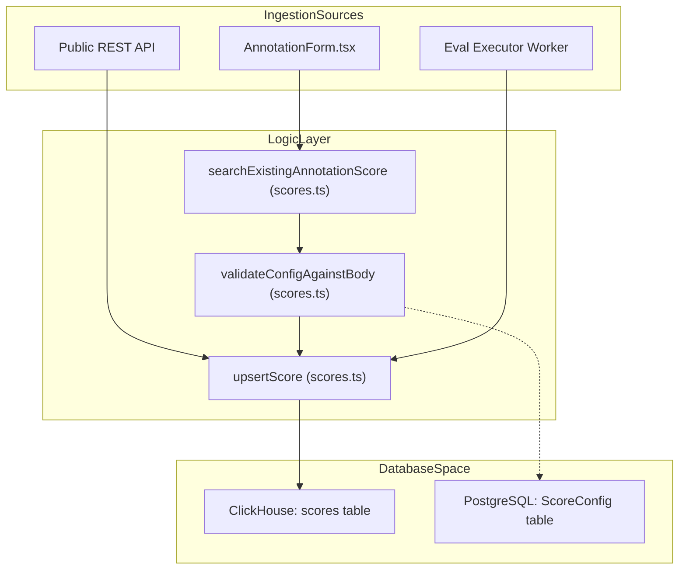
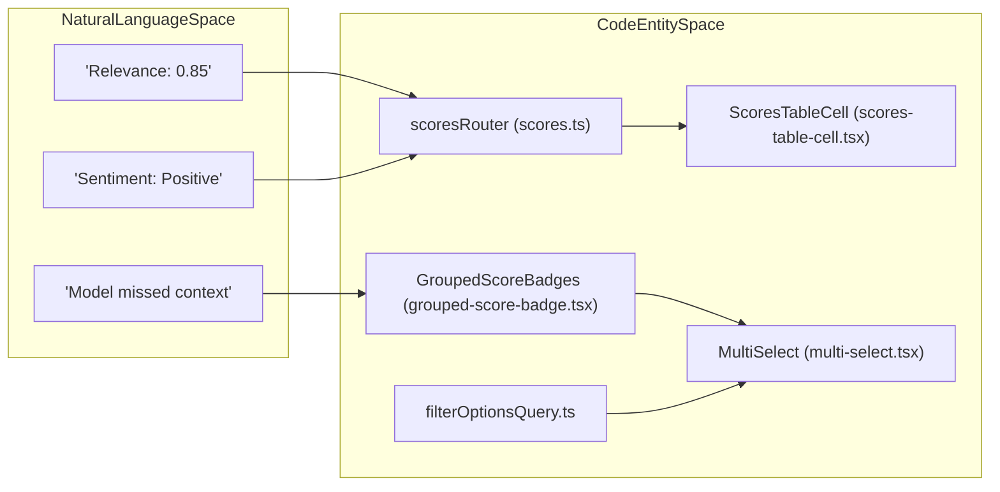

# Scores & Scoring

관련 소스 파일

이 위키 페이지를 생성하기 위한 컨텍스트로 다음 파일들이 사용되었습니다.

- [fern/apis/server/definition/score-configs.yml](fern/apis/server/definition/score-configs.yml)
- [packages/shared/src/domain/score-configs.ts](packages/shared/src/domain/score-configs.ts)
- [packages/shared/src/features/annotation/types.ts](packages/shared/src/features/annotation/types.ts)
- [packages/shared/src/features/scores/interfaces/ui/types.ts](packages/shared/src/features/scores/interfaces/ui/types.ts)
- [packages/shared/src/server/queries/clickhouse-sql/search.ts](packages/shared/src/server/queries/clickhouse-sql/search.ts)
- [packages/shared/src/server/repositories/observations.ts](packages/shared/src/server/repositories/observations.ts)
- [packages/shared/src/server/repositories/scores.ts](packages/shared/src/server/repositories/scores.ts)
- [packages/shared/src/server/repositories/scores_converters.ts](packages/shared/src/server/repositories/scores_converters.ts)
- [packages/shared/src/server/repositories/traces.ts](packages/shared/src/server/repositories/traces.ts)
- [packages/shared/src/server/services/sessions-ui-table-service.ts](packages/shared/src/server/services/sessions-ui-table-service.ts)
- [packages/shared/src/server/services/traces-ui-table-service.ts](packages/shared/src/server/services/traces-ui-table-service.ts)
- [web/src/__tests__/server/clickhouseSearchCondition.servertest.ts](web/src/__tests__/server/clickhouseSearchCondition.servertest.ts)
- [web/src/components/ui/combobox.tsx](web/src/components/ui/combobox.tsx)
- [web/src/components/ui/command.tsx](web/src/components/ui/command.tsx)
- [web/src/components/ui/table.tsx](web/src/components/ui/table.tsx)
- [web/src/features/filters/components/multi-select.tsx](web/src/features/filters/components/multi-select.tsx)
- [web/src/features/navigation/utils/scores-tabs.ts](web/src/features/navigation/utils/scores-tabs.ts)
- [web/src/features/public-api/server/scores-api-service.ts](web/src/features/public-api/server/scores-api-service.ts)
- [web/src/features/public-api/types/score-configs.ts](web/src/features/public-api/types/score-configs.ts)
- [web/src/features/scores/components/AnnotationForm.tsx](web/src/features/scores/components/AnnotationForm.tsx)
- [web/src/features/scores/contexts/ScoreCacheContext.tsx](web/src/features/scores/contexts/ScoreCacheContext.tsx)
- [web/src/features/scores/hooks/useScoreMutations.ts](web/src/features/scores/hooks/useScoreMutations.ts)
- [web/src/features/scores/lib/aggregateScores.ts](web/src/features/scores/lib/aggregateScores.ts)
- [web/src/features/scores/lib/transformScores.ts](web/src/features/scores/lib/transformScores.ts)
- [web/src/features/scores/schema.ts](web/src/features/scores/schema.ts)
- [web/src/features/scores/types.ts](web/src/features/scores/types.ts)
- [web/src/pages/api/public/score-configs/[configId].ts](web/src/pages/api/public/score-configs/[configId].ts)
- [web/src/pages/api/public/score-configs/index.ts](web/src/pages/api/public/score-configs/index.ts)
- [web/src/pages/api/public/scores/[scoreId].ts](web/src/pages/api/public/scores/[scoreId].ts)
- [web/src/server/api/routers/generations/filterOptionsQuery.ts](web/src/server/api/routers/generations/filterOptionsQuery.ts)
- [web/src/server/api/routers/scoreConfigs.ts](web/src/server/api/routers/scoreConfigs.ts)
- [web/src/server/api/routers/scores.ts](web/src/server/api/routers/scores.ts)
- [web/src/server/api/routers/sessions.ts](web/src/server/api/routers/sessions.ts)
- [web/src/server/api/routers/traces.ts](web/src/server/api/routers/traces.ts)

이 페이지는 Langfuse의 scoring system을 문서화합니다. score data model, creation flow(API, manual annotation, automated evaluator), ClickHouse repository layer, tRPC router, 그리고 display와 aggregation에 사용되는 UI component를 다룹니다.

---

## Score Data Model

score는 **trace**, **observation**, **session** 또는 **dataset run**에 연결되는 named measurement입니다. score는 주로 ClickHouse에 `ScoreRecordReadType` row로 저장되며 application에서 사용하기 위해 `ScoreDomain` object로 변환됩니다.

### Score Fields

| Field | Type | Description |
|---|---|---|
| `id` | string | UUID [packages/shared/src/server/repositories/scores.ts:152-152]() |
| `project_id` | string | owning project [packages/shared/src/server/repositories/scores.ts:152-152]() |
| `timestamp` | DateTime64(3) | score가 생성된 시각 [packages/shared/src/server/repositories/scores.ts:152-152]() |
| `trace_id` | string? | associated trace [packages/shared/src/server/repositories/scores.ts:82-82]() |
| `observation_id` | string? | associated observation(sub-span) [packages/shared/src/server/repositories/scores.ts:83-83]() |
| `session_id` | string? | associated session [packages/shared/src/server/repositories/scores.ts:84-84]() |
| `name` | string | score name(예: `relevance`) [packages/shared/src/server/repositories/scores.ts:152-152]() |
| `value` | float? | `NUMERIC` 또는 `BOOLEAN` score의 numeric value [packages/shared/src/server/repositories/scores_converters.ts:32-33]() |
| `string_value` | string? | `CATEGORICAL` score의 string value [packages/shared/src/server/repositories/scores_converters.ts:32-33]() |
| `data_type` | enum | `NUMERIC`, `BOOLEAN`, `CATEGORICAL` [packages/shared/src/domain/scores.ts:2-10]() |
| `source` | enum | `ANNOTATION`, `API`, `EVAL` [packages/shared/src/domain/scores.ts:4-4]() |
| `config_id` | string? | PostgreSQL의 `ScoreConfig`에 대한 reference [packages/shared/src/server/repositories/scores.ts:69-69]() |
| `metadata` | map | arbitrary key-value metadata [packages/shared/src/server/repositories/scores.ts:210-222]() |

### Data Types

| `data_type` | Description |
|---|---|
| `NUMERIC` | numeric score(예: 0-1 range) [packages/shared/src/domain/scores.ts:2-10]() |
| `BOOLEAN` | boolean score(0 또는 1로 저장) [packages/shared/src/domain/scores.ts:2-10]() |
| `CATEGORICAL` | named category(예: `positive`) [packages/shared/src/domain/scores.ts:2-10]() |

Langfuse는 model output에 대한 human correction을 나타내는 special `CORRECTION` score name도 지원합니다 [web/src/server/api/routers/scores.ts:34-35](). `AGGREGATABLE_SCORE_TYPES`에는 특히 `NUMERIC`, `BOOLEAN`, `CATEGORICAL`이 포함됩니다 [packages/shared/src/domain/scores.ts:5-6]().

출처: [packages/shared/src/server/repositories/scores.ts:1-166](), [packages/shared/src/domain/scores.ts:1-10](), [web/src/server/api/routers/scores.ts:32-35](), [packages/shared/src/server/repositories/scores_converters.ts:30-33]()

---

## Score Configurations (ScoreConfig)

`ScoreConfig` object는 score의 schema와 constraint를 정의합니다. PostgreSQL에 저장되며 UI에서 score creation을 validate하는 데 사용됩니다.

`validateConfigAgainstBody` function은 incoming score data가 정의된 `ScoreConfig`를 준수하는지 보장합니다(예: numeric value가 range 안에 있는지 확인) [web/src/server/api/routers/scores.ts:64-65](). UI에서 configuration은 structured data entry를 가능하게 하며, numeric type에는 일관된 scale을, categorical type에는 predefined option을 제공합니다.

출처: [web/src/server/api/routers/scores.ts:64-65](), [packages/shared/src/server/repositories/scores.ts:69-71]()

---

## Score Storage (ClickHouse Repository)

Score는 ClickHouse에 persist됩니다. repository layer는 `scores` table과 interaction하기 위한 high-level function을 제공합니다.

**Score Persistence Diagram**

출처: [packages/shared/src/server/repositories/scores.ts:148-166](), [web/src/server/api/routers/scores.ts:52-65]()

### Key Repository Functions

| Function | Description |
|---|---|
| `upsertScore` | score record를 ClickHouse에 write합니다. `id`, `project_id`, `name`, `timestamp`가 필요합니다 [packages/shared/src/server/repositories/scores.ts:151-166](). |
| `getScoreById` | UUID로 단일 score를 fetch합니다 [packages/shared/src/server/repositories/scores.ts:116-131](). |
| `getScoresForTraces` | trace ID list에 대한 score를 retrieve하며, `SCORE_TO_TRACE_OBSERVATIONS_INTERVAL`로 정의되는 optional lookback interval을 지원합니다 [packages/shared/src/server/repositories/scores.ts:168-182](). |
| `getScoresForSessions` | 특정 session ID와 associated된 score를 retrieve합니다 [packages/shared/src/server/repositories/scores.ts:224-246](). |
| `searchExistingAnnotationScore` | duplicate 대신 update를 허용하기 위해 특정 object(trace/observation/session)에 대한 기존 manual annotation을 찾는 데 사용됩니다 [packages/shared/src/server/repositories/scores.ts:63-114](). |

출처: [packages/shared/src/server/repositories/scores.ts:63-246]()

---

## tRPC Scores Router (`scoresRouter`)

`web/src/server/api/routers/scores.ts`의 `scoresRouter`는 scoring functionality를 frontend에 expose합니다.

### Procedures

*   **`all`**: paginated score list를 fetch합니다. `User` table의 `authorUserName`, `JobExecution`의 `jobConfigurationId` 같은 PostgreSQL metadata로 ClickHouse data를 enrich합니다 [web/src/server/api/routers/scores.ts:107-168]().
*   **`allFromEvents`**: events table에서 score를 retrieve하는 v4 procedure입니다 [web/src/server/api/routers/scores.ts:211-260]().
*   **`byId`**: 단일 score를 반환하며, client consumption을 위해 metadata를 stringify합니다 [web/src/server/api/routers/scores.ts:169-188]().
*   **`countAll`**: 특정 filter와 일치하는 score의 total count를 반환합니다 [web/src/server/api/routers/scores.ts:189-207]().
*   **`getScoreMetadataById`**: 특정 score의 detailed metadata를 fetch합니다 [web/src/server/api/routers/scores.ts:61-61]().

출처: [web/src/server/api/routers/scores.ts:61-260]()

---

## Score Aggregation & Metrics

Score는 performance metric을 제공하기 위해 trace와 session 전반에서 aggregate됩니다.

### Traces Table Aggregation
`traces-ui-table-service.ts`의 `getTracesTableMetrics` function은 trace의 average score를 계산합니다. trace와 associated된 각 unique score name에 대해 `{ name, avg_value }`를 포함하는 `scores_avg` array를 반환합니다 [packages/shared/src/server/services/traces-ui-table-service.ts:147-161]().

### Sessions Table Aggregation
`getSessionsWithMetrics` function은 session-level score aggregate를 계산합니다. session 안의 모든 trace에 대해 `scores_avg`(average numeric value)와 `score_categories`(categorical value distribution)를 계산합니다 [packages/shared/src/server/services/sessions-ui-table-service.ts:19-43]().

출처: [packages/shared/src/server/services/traces-ui-table-service.ts:65-161](), [packages/shared/src/server/services/sessions-ui-table-service.ts:19-112]()

---

## UI Components & Rendering

Langfuse는 manual scoring과 aggregated metric view를 위한 specialized component를 제공합니다.

**Score Rendering Entity Map**

### Rendering Logic
*   **`GroupedScoreBadges`**: 여러 score를 name별로 group하고 badge로 렌더링합니다. hover card를 통해 comment와 metadata를 처리합니다 [web/src/components/grouped-score-badge.tsx:125-190]().
*   **`ScoresTableCell`**: data table에서 score aggregate를 표시하는 데 사용됩니다. single value 또는 average(`Ø`)를 표시하기 위해 `smart` formatting을 사용하고 categorical value count를 지원합니다 [web/src/components/scores-table-cell.tsx:46-157]().
*   **`MultiSelect`**: 여러 score name 또는 value를 선택하기 위해 filter에서 사용하는 generic component입니다 [web/src/features/filters/components/multi-select.tsx:36-56]().
*   **`filterOptionsQuery`**: generations view의 filter dropdown을 채우기 위해 사용 가능한 numeric 및 categorical score name을 fetch합니다 [web/src/server/api/routers/generations/filterOptionsQuery.ts:68-83]().

출처: [web/src/components/grouped-score-badge.tsx:125-190](), [web/src/components/scores-table-cell.tsx:46-157](), [web/src/features/filters/components/multi-select.tsx:36-190](), [web/src/server/api/routers/generations/filterOptionsQuery.ts:68-110]()

---

## Score Analytics Dashboard

Score Analytics dashboard는 project 전반의 score에 대한 statistical overview를 제공합니다. aggregated data를 fetch하기 위해 ClickHouse repository function을 활용합니다.

### Statistical Metrics
*   **Numeric Scores**: 시간에 따른 average를 계산하는 `getNumericScoresGroupedByName`을 통해 aggregate됩니다 [web/src/server/api/routers/generations/filterOptionsQuery.ts:81-81]().
*   **Categorical Scores**: category distribution을 보여주기 위해 `getCategoricalScoresGroupedByName`을 통해 aggregate됩니다 [web/src/server/api/routers/generations/filterOptionsQuery.ts:83-83]().

### Data Flow for Analytics
1.  **Request**: UI가 `scoresRouter.all` 또는 specialized analytics procedure를 호출합니다 [web/src/server/api/routers/scores.ts:107-109]().
2.  **ClickHouse Query**: `getScoresUiTable` 같은 repository function이 ClickHouse `scores` table에 대해 SQL을 실행하고 time range 및 score name filter를 적용합니다 [web/src/server/api/routers/scores.ts:114-122]().
3.  **Aggregation**: ClickHouse가 numeric 및 categorical type에 대해 on-the-fly aggregation(AVG, COUNT)을 수행합니다 [packages/shared/src/server/repositories/scores.ts:30-33]().
4.  **UI Rendering**: dashboard widget이 chart library를 사용해 resulting statistical metric을 렌더링합니다 [packages/shared/src/server/repositories/scores.ts:25-28]().

출처: [web/src/server/api/routers/scores.ts:107-260](), [packages/shared/src/server/repositories/scores.ts:1-246](), [web/src/server/api/routers/generations/filterOptionsQuery.ts:68-110]()
