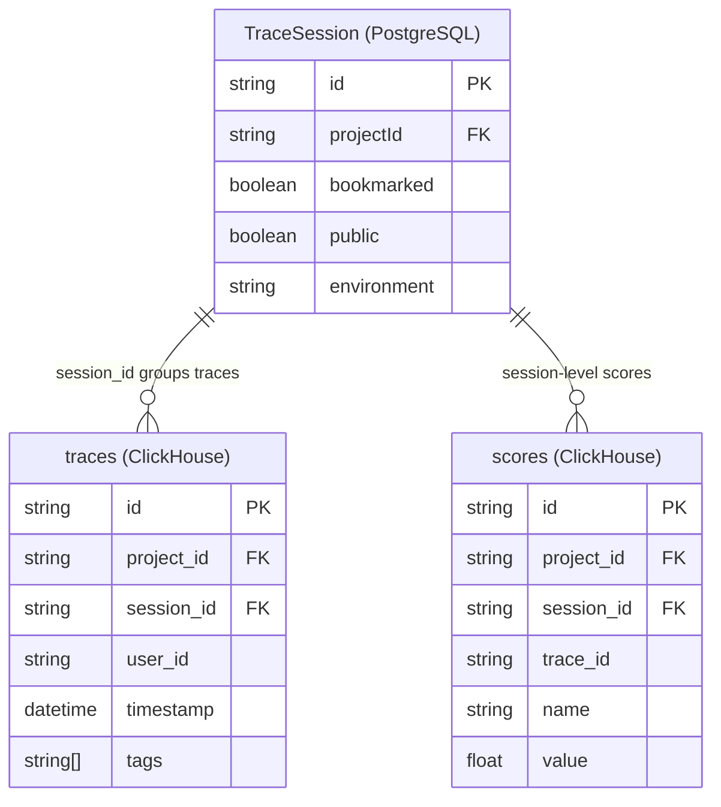
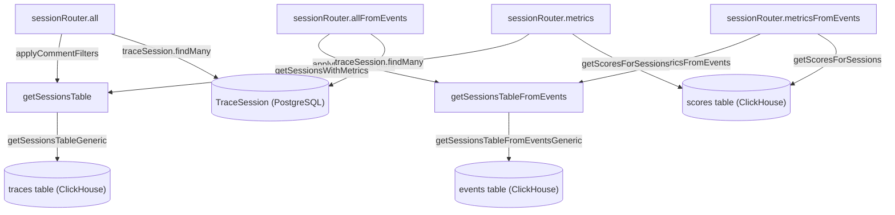
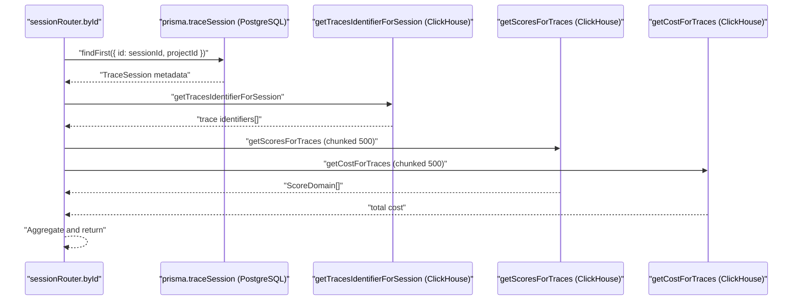

# Sessions

관련 소스 파일

이 위키 페이지를 생성하기 위한 컨텍스트로 다음 파일들이 사용되었습니다.

- [packages/shared/src/server/queries/clickhouse-sql/search.ts](packages/shared/src/server/queries/clickhouse-sql/search.ts)
- [packages/shared/src/server/repositories/observations.ts](packages/shared/src/server/repositories/observations.ts)
- [packages/shared/src/server/repositories/scores.ts](packages/shared/src/server/repositories/scores.ts)
- [packages/shared/src/server/repositories/traces.ts](packages/shared/src/server/repositories/traces.ts)
- [packages/shared/src/server/services/sessions-ui-table-service.ts](packages/shared/src/server/services/sessions-ui-table-service.ts)
- [packages/shared/src/server/services/traces-ui-table-service.ts](packages/shared/src/server/services/traces-ui-table-service.ts)
- [web/src/__tests__/server/clickhouseSearchCondition.servertest.ts](web/src/__tests__/server/clickhouseSearchCondition.servertest.ts)
- [web/src/components/session/index.tsx](web/src/components/session/index.tsx)
- [web/src/components/table/data-table.tsx](web/src/components/table/data-table.tsx)
- [web/src/components/table/use-cases/observations.tsx](web/src/components/table/use-cases/observations.tsx)
- [web/src/components/table/use-cases/scores.tsx](web/src/components/table/use-cases/scores.tsx)
- [web/src/components/table/use-cases/sessions.tsx](web/src/components/table/use-cases/sessions.tsx)
- [web/src/components/table/use-cases/traces.tsx](web/src/components/table/use-cases/traces.tsx)
- [web/src/features/events/components/EventsTable.tsx](web/src/features/events/components/EventsTable.tsx)
- [web/src/features/experiments/components/table/ExperimentItemsTable.tsx](web/src/features/experiments/components/table/ExperimentItemsTable.tsx)
- [web/src/features/experiments/components/table/ExperimentsTable.tsx](web/src/features/experiments/components/table/ExperimentsTable.tsx)
- [web/src/features/prompts/components/prompts-table.tsx](web/src/features/prompts/components/prompts-table.tsx)
- [web/src/features/prompts/server/actions/createPrompt.ts](web/src/features/prompts/server/actions/createPrompt.ts)
- [web/src/features/prompts/server/routers/promptRouter.ts](web/src/features/prompts/server/routers/promptRouter.ts)
- [web/src/server/api/routers/generations/filterOptionsQuery.ts](web/src/server/api/routers/generations/filterOptionsQuery.ts)
- [web/src/server/api/routers/scores.ts](web/src/server/api/routers/scores.ts)
- [web/src/server/api/routers/sessions.ts](web/src/server/api/routers/sessions.ts)
- [web/src/server/api/routers/traces.ts](web/src/server/api/routers/traces.ts)

이 페이지는 Langfuse의 session concept를 문서화합니다. trace가 session으로 grouping되는 방식, dual-database storage model, session data를 query하는 service layer, tRPC 및 public API endpoint를 다룹니다. trace와 observation 내부 구조는 [9.1]()을 참조하세요. session에 연결될 수 있는 score는 [9.2]()를 참조하세요. `*FromEvents` query variant를 뒷받침하는 events table architecture는 [3.4]()를 참조하세요.

---

## Session이란 무엇인가?

**session**은 동일한 `session_id` string을 공유하는 하나 이상의 trace grouping입니다. session을 위한 별도 ClickHouse table은 없습니다. session은 `traces` table 또는 `events` table의 row를 grouping하여 derive되는 logical entity입니다. mutable session metadata(bookmarked, public)는 PostgreSQL `TraceSession` record에 저장됩니다.

**두 storage 전반의 session data model:**

| Field | Store | Notes |
|---|---|---|
| `id` / `session_id` | PostgreSQL (`TraceSession`) + ClickHouse (derived) | `traces.session_id`의 grouping key [web/src/server/api/routers/sessions.ts:78-83]() |
| `bookmarked` | PostgreSQL `TraceSession` | user-defined bookmark flag [web/src/server/api/routers/sessions.ts:209-209]() |
| `public` | PostgreSQL `TraceSession` | public share access 제어 [web/src/server/api/routers/sessions.ts:210-210]() |
| `environment` | PostgreSQL `TraceSession` | trace에서 denormalized됨 [web/src/server/api/routers/sessions.ts:211-211]() |
| Aggregated metrics | ClickHouse (query time에 computed) | trace count, user ID, tag, cost, token usage, duration [packages/shared/src/server/services/sessions-ui-table-service.ts:19-30]() |
| Scores | ClickHouse `scores` table | `session_id`를 직접 reference하는 score [packages/shared/src/server/repositories/scores.ts:245-247]() |

Trace는 ingestion time에 trace event의 `session_id`를 설정하여 session과 associated됩니다.

**Entity relationship:**

출처: [web/src/server/api/routers/sessions.ts:78-83](), [packages/shared/src/server/repositories/scores.ts:245-247](), [web/src/server/api/routers/sessions.ts:200-213]()

---

## Session Table Services

Session list query는 두 parallel service implementation으로 제공됩니다. 기존 **traces-table** path와 새로운 **events-table** path(v4 architecture)입니다. 둘 다 동일한 logical interface를 expose하며, feature flag 또는 versioning을 기반으로 tRPC router level에서 선택됩니다.

### Traces-Table Service (`sessions-ui-table-service.ts`)

`getSessionsTableGeneric`은 세 가지 `select` mode를 가진 internal workhorse function입니다.

| Mode | Returns | Called by |
|---|---|---|
| `"count"` | `{ count: string }` | `getSessionsTableCount` [packages/shared/src/server/services/sessions-ui-table-service.ts:52-63]() |
| `"rows"` | `SessionDataReturnType` | `getSessionsTable` [packages/shared/src/server/services/sessions-ui-table-service.ts:72-86]() |
| `"metrics"` | `SessionWithMetricsReturnType` | `getSessionsWithMetrics` [packages/shared/src/server/services/sessions-ui-table-service.ts:96-112]() |

SQL query는 CTE를 사용해 `session_id`별로 trace를 group합니다. service는 `sessionCols`와 `sessionsViewCols`에 대해 `createFilterFromFilterState`를 사용하여 filter를 적용합니다 [packages/shared/src/server/services/sessions-ui-table-service.ts:179-181]().

**`SessionDataReturnType` fields:**
`session_id`, `max_timestamp`, `min_timestamp`, `trace_ids`, `user_ids`, `trace_count`, `trace_tags`, `trace_environment`, `scores_avg`, `score_categories` [packages/shared/src/server/services/sessions-ui-table-service.ts:19-30]().

출처: [packages/shared/src/server/services/sessions-ui-table-service.ts:19-43](), [packages/shared/src/server/services/sessions-ui-table-service.ts:126-250]()

### Events-Table Service (`sessions-ui-table-events-service.ts`)

이 service는 composable query builder를 통해 `events` ClickHouse table을 사용합니다. direct `traces` table scan을 pre-aggregated event data로 대체합니다.

Key functions:
- `getSessionsTableFromEvents`: pre-aggregated event data를 사용해 session을 list합니다 [web/src/server/api/routers/sessions.ts:31-31]().
- `getSessionsTableCountFromEvents`: event에서 session count를 계산합니다 [web/src/server/api/routers/sessions.ts:32-32]().
- `getSessionTracesFromEvents`: session의 개별 trace를 가져옵니다 [web/src/server/api/routers/sessions.ts:34-34]().

출처: [web/src/server/api/routers/sessions.ts:31-34]()

### Query Architecture Diagram

**Session list query paths — data flow and code entities:**

출처: [web/src/server/api/routers/sessions.ts:172-232](), [web/src/server/api/routers/sessions.ts:233-294](), [packages/shared/src/server/services/sessions-ui-table-service.ts:65-112]()

---

## tRPC Session Router

`sessionRouter`는 `web/src/server/api/routers/sessions.ts`에 정의되어 있으며 session lifecycle과 retrieval을 처리합니다.

### Procedure Reference

| Procedure | Type | Key behavior |
|---|---|---|
| `hasAny` | query | `hasAnySession(projectId)` — ClickHouse `traces` table을 확인합니다 [web/src/server/api/routers/sessions.ts:152-160](). |
| `hasAnyFromEvents` | query | `hasAnySessionFromEventsTable(projectId)` — events table을 확인합니다 [web/src/server/api/routers/sessions.ts:161-169](). |
| `all` | query | comment filter + `getSessionsTable`을 적용하고, PostgreSQL의 bookmarked/public을 merge합니다 [web/src/server/api/routers/sessions.ts:170-232](). |
| `allFromEvents` | query | `getSessionsTableFromEvents`를 사용하는 동일한 logic입니다 [web/src/server/api/routers/sessions.ts:233-294](). |
| `byId` | query | `handleGetSessionById`: PostgreSQL lookup + `getTracesIdentifierForSession` + scores + costs [web/src/server/api/routers/sessions.ts:71-149](). |

### `handleGetSessionById` Internals

`handleGetSessionById` helper function은 dual-database fetch pattern을 구현합니다.

ClickHouse parameter size limit을 피하기 위해 score와 cost를 query하기 전에 trace는 500개 group으로 chunking됩니다 [web/src/server/api/routers/sessions.ts:97-124]().

---

## Trace and Score Repository Integration

session feature는 trace와 score data를 연결하기 위해 specialized repository function에 의존합니다.

| Function | File | Purpose |
|---|---|---|
| `getTracesIdentifierForSession` | `packages/shared/src/server/repositories/traces.ts` | session 안의 trace identifier를 fetch합니다 [web/src/server/api/routers/sessions.ts:92-95](). |
| `getScoresForSessions` | `packages/shared/src/server/repositories/scores.ts` | `scores` table에서 `session_id IN (...)`인 score를 fetch합니다 [packages/shared/src/server/repositories/scores.ts:224-260](). |
| `searchExistingAnnotationScore` | `packages/shared/src/server/repositories/scores.ts` | duplicate를 방지하기 위해 session에 대한 기존 human annotation을 찾습니다 [packages/shared/src/server/repositories/scores.ts:63-114](). |

`getScoresForSessions`는 특히 `LISTABLE_SCORE_TYPES`를 사용해 `scores` table을 `session_id`와 `data_type`으로 filter합니다 [packages/shared/src/server/repositories/scores.ts:245-247]().

---

## Session Metrics and Aggregation

Session-level metric은 associated trace와 observation 전반에서 aggregate됩니다.

- **Usage and Cost**: `session_usage_details`, `session_cost_details`, total을 반환하는 `metrics` select mode를 통해 `getSessionsWithMetrics`에서 aggregate됩니다 [packages/shared/src/server/services/sessions-ui-table-service.ts:96-112]().
- **Scores**: session-level analysis를 위해 categorical score와 numeric score가 name별로 group됩니다 [web/src/server/api/routers/sessions.ts:46-47]().
- **Duration**: session 안의 trace timestamp 사이 delta를 나타내는 ClickHouse `duration` field로 계산됩니다 [packages/shared/src/server/services/sessions-ui-table-service.ts:34]().
- **User Tracking**: session과 associated된 user는 해당 session 안의 모든 trace에서 unique `user_id` value를 수집하여 식별됩니다 [web/src/server/api/routers/sessions.ts:143-148]().

출처: [packages/shared/src/server/services/sessions-ui-table-service.ts:19-43](), [web/src/server/api/routers/sessions.ts:101-124](), [packages/shared/src/server/repositories/scores.ts:224-260]()
