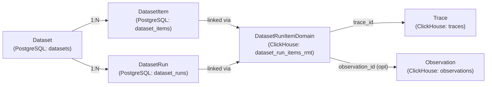
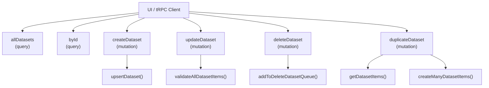
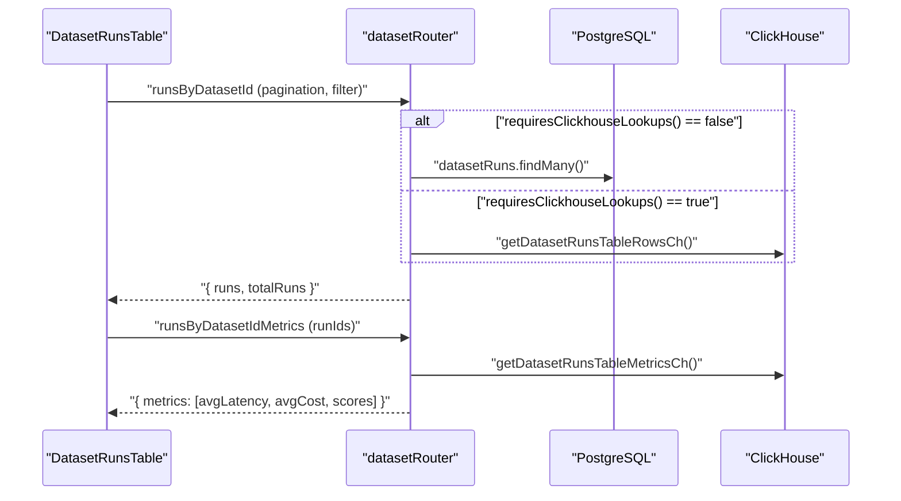
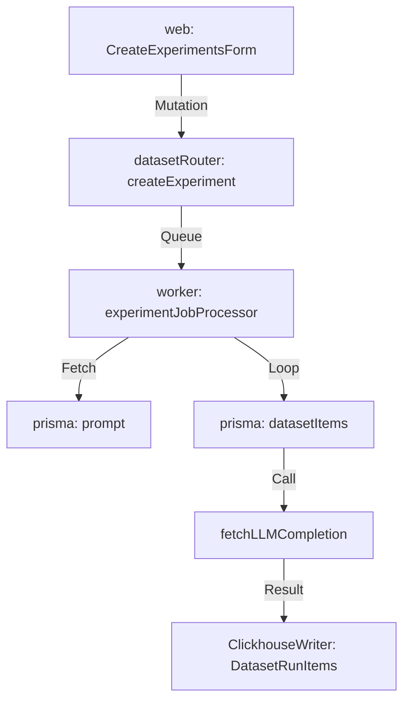

# Datasets & Experiments

관련 소스 파일

이 위키 페이지를 생성하기 위한 컨텍스트로 다음 파일들이 사용되었습니다.

- [fern/apis/server/definition/dataset-run-items.yml](fern/apis/server/definition/dataset-run-items.yml)
- [fern/apis/server/definition/datasets.yml](fern/apis/server/definition/datasets.yml)
- [fern/apis/server/definition/utils/pagination.yml](fern/apis/server/definition/utils/pagination.yml)
- [packages/shared/prisma/migrations/20260423084654_add_datasets_remote_experiment_enabled_col/migration.sql](packages/shared/prisma/migrations/20260423084654_add_datasets_remote_experiment_enabled_col/migration.sql)
- [packages/shared/src/features/experiments/utils.ts](packages/shared/src/features/experiments/utils.ts)
- [packages/shared/src/server/clickhouse/client.ts](packages/shared/src/server/clickhouse/client.ts)
- [packages/shared/src/server/llm/getInternalTracingHandler.ts](packages/shared/src/server/llm/getInternalTracingHandler.ts)
- [packages/shared/src/server/llm/testModelCall.ts](packages/shared/src/server/llm/testModelCall.ts)
- [packages/shared/src/server/repositories/dataset-items.ts](packages/shared/src/server/repositories/dataset-items.ts)
- [packages/shared/src/server/repositories/dataset-run-items.ts](packages/shared/src/server/repositories/dataset-run-items.ts)
- [web/src/__tests__/server/datasets-api.servertest.ts](web/src/__tests__/server/datasets-api.servertest.ts)
- [web/src/features/annotation-queues/components/CreateOrEditAnnotationQueueButton.tsx](web/src/features/annotation-queues/components/CreateOrEditAnnotationQueueButton.tsx)
- [web/src/features/annotation-queues/components/DeleteAnnotationQueueButton.tsx](web/src/features/annotation-queues/components/DeleteAnnotationQueueButton.tsx)
- [web/src/features/datasets/components/DatasetItemsTable.tsx](web/src/features/datasets/components/DatasetItemsTable.tsx)
- [web/src/features/datasets/components/DatasetRunsTable.tsx](web/src/features/datasets/components/DatasetRunsTable.tsx)
- [web/src/features/datasets/components/DatasetsTable.tsx](web/src/features/datasets/components/DatasetsTable.tsx)
- [web/src/features/datasets/server/actions/createDataset.ts](web/src/features/datasets/server/actions/createDataset.ts)
- [web/src/features/datasets/server/dataset-router.ts](web/src/features/datasets/server/dataset-router.ts)
- [web/src/features/datasets/server/service.ts](web/src/features/datasets/server/service.ts)
- [web/src/features/experiments/components/CreateExperimentsForm.tsx](web/src/features/experiments/components/CreateExperimentsForm.tsx)
- [web/src/features/experiments/components/RemoteExperimentTriggerModal.tsx](web/src/features/experiments/components/RemoteExperimentTriggerModal.tsx)
- [web/src/features/experiments/components/RemoteExperimentUpsertForm.tsx](web/src/features/experiments/components/RemoteExperimentUpsertForm.tsx)
- [web/src/features/experiments/server/router.ts](web/src/features/experiments/server/router.ts)
- [web/src/features/experiments/types.ts](web/src/features/experiments/types.ts)
- [web/src/features/natural-language-filters/server/router.ts](web/src/features/natural-language-filters/server/router.ts)
- [web/src/features/natural-language-filters/server/utils.ts](web/src/features/natural-language-filters/server/utils.ts)
- [web/src/features/playground/page/components/CreateOrEditLLMSchemaDialog.tsx](web/src/features/playground/page/components/CreateOrEditLLMSchemaDialog.tsx)
- [web/src/features/playground/page/components/CreateOrEditLLMToolDialog.tsx](web/src/features/playground/page/components/CreateOrEditLLMToolDialog.tsx)
- [web/src/features/public-api/server/dataset-runs.ts](web/src/features/public-api/server/dataset-runs.ts)
- [web/src/features/public-api/types/datasets.ts](web/src/features/public-api/types/datasets.ts)
- [web/src/pages/api/public/dataset-items/[datasetItemId].ts](web/src/pages/api/public/dataset-items/[datasetItemId].ts)
- [web/src/pages/api/public/dataset-items/index.ts](web/src/pages/api/public/dataset-items/index.ts)
- [web/src/pages/api/public/dataset-run-items.ts](web/src/pages/api/public/dataset-run-items.ts)
- [web/src/pages/api/public/datasets/[name]/index.ts](web/src/pages/api/public/datasets/[name]/index.ts)
- [web/src/pages/api/public/datasets/[name]/runs/[runName].ts](web/src/pages/api/public/datasets/[name]/runs/[runName].ts)
- [web/src/pages/api/public/datasets/[name]/runs/index.ts](web/src/pages/api/public/datasets/[name]/runs/index.ts)
- [web/src/pages/api/public/v2/datasets/[datasetName]/index.ts](web/src/pages/api/public/v2/datasets/[datasetName]/index.ts)
- [web/src/pages/api/public/v2/datasets/index.ts](web/src/pages/api/public/v2/datasets/index.ts)
- [worker/src/__tests__/experimentsService.test.ts](worker/src/__tests__/experimentsService.test.ts)
- [worker/src/backgroundMigrations/migrateDatasetRunItemsFromPostgresToClickhouse.ts](worker/src/backgroundMigrations/migrateDatasetRunItemsFromPostgresToClickhouse.ts)
- [worker/src/backgroundMigrations/migrateDatasetRunItemsFromPostgresToClickhouseRmt.ts](worker/src/backgroundMigrations/migrateDatasetRunItemsFromPostgresToClickhouseRmt.ts)
- [worker/src/features/experiments/__tests__/scheduleExperimentEvals.test.ts](worker/src/features/experiments/__tests__/scheduleExperimentEvals.test.ts)
- [worker/src/features/experiments/experimentServiceClickhouse.ts](worker/src/features/experiments/experimentServiceClickhouse.ts)
- [worker/src/features/experiments/scheduleExperimentEvals.ts](worker/src/features/experiments/scheduleExperimentEvals.ts)
- [worker/src/features/experiments/utils.ts](worker/src/features/experiments/utils.ts)
- [worker/src/features/utils/utilities.ts](worker/src/features/utils/utilities.ts)
- [worker/src/services/ClickhouseWriter/ClickhouseWriter.unit.test.ts](worker/src/services/ClickhouseWriter/ClickhouseWriter.unit.test.ts)
- [worker/src/services/ClickhouseWriter/index.ts](worker/src/services/ClickhouseWriter/index.ts)

이 페이지는 Langfuse의 dataset management system을 다룹니다. dataset과 그 item이 생성되고 관리되는 방식, experiment(dataset run)가 실행되고 비교되는 방식, 그리고 이러한 operation을 지원하는 API surface를 설명합니다. prompt management와 prompt를 experiment에 연결하는 내용은 [9.5]()를 참조하세요. dataset run을 scoring하는 automated evaluation system은 [10]()을 참조하세요.

---

## 개요

**dataset**은 input/output example pair(`DatasetItem`)의 named collection입니다. 각 item은 선택적으로 자신이 derive된 trace나 observation에 다시 linking될 수 있습니다. **experiment**는 `DatasetRun`입니다. 즉 dataset 위에서 model이나 pipeline을 named execution한 것이며, 각 item의 processing은 trace를 생성하고 이것이 `DatasetRunItem`으로 record됩니다. 그런 다음 동일 dataset에 대한 여러 run을 latency, cost, score dimension에서 비교할 수 있습니다.

### Entity Relationship Diagram
이 diagram은 natural language concept를 구현에서 사용되는 specific code entity 및 database table과 연결합니다.

출처: [web/src/features/datasets/server/dataset-router.ts:1-80](), [packages/shared/src/server/repositories/dataset-run-items.ts:1-100](), [packages/shared/src/server/repositories/dataset-items.ts:1-18]()

---

## Data Model

### PostgreSQL Entities
dataset의 metadata와 configuration은 Prisma를 통해 PostgreSQL에 저장됩니다 [packages/shared/src/server/repositories/dataset-items.ts:1-18]().

| Entity | Table | Key Fields |
|---|---|---|
| `Dataset` | `datasets` | `id`, `projectId`, `name`, `description`, `metadata`, `inputSchema`, `expectedOutputSchema`, `sortPriority` |
| `DatasetItem` | `dataset_items` | `id`, `projectId`, `datasetId`, `input`, `expectedOutput`, `metadata`, `sourceTraceId`, `sourceObservationId`, `status`, `validFrom` |
| `DatasetRun` | `dataset_runs` | `id`, `projectId`, `datasetId`, `name`, `description`, `metadata` |

`DatasetItem.validFrom`은 point-in-time versioning에 사용되는 timestamp입니다. 특정 `version` date로 item을 query하면 그 시점에 존재했던 dataset state를 반환합니다 [packages/shared/src/server/repositories/dataset-items.ts:132-135]().

`DatasetItem.status`는 `ACTIVE` 또는 `ARCHIVED` enum입니다. archived item은 새 experiment run에서 제외되지만 계속 query할 수 있습니다 [packages/shared/src/server/repositories/dataset-items.ts:129]().

### ClickHouse Entity
`dataset_run_items_rmt`(ReplicatedMergeTree)는 experiment run과 생성된 trace/observation 사이의 linkage를 저장합니다. 이는 experiment comparison view의 모든 latency, cost, score aggregation을 구동합니다 [packages/shared/src/server/repositories/dataset-run-items.ts:200-227]().

| Field | Description |
|---|---|
| `project_id` | project scope |
| `dataset_id` | parent dataset |
| `dataset_run_id` | 이 item이 속한 run |
| `dataset_run_name` | UI display를 위한 run name |
| `dataset_item_id` | 사용된 dataset item |
| `trace_id` | ClickHouse의 resulting trace |
| `observation_id` | trace 안의 optional observation |
| `dataset_run_created_at` | run의 timestamp |

출처: [packages/shared/src/server/repositories/dataset-run-items.ts:89-155](), [packages/shared/src/server/repositories/dataset-items.ts:123-157](), [worker/src/services/ClickhouseWriter/index.ts:57]()

---

## Folder Support

Dataset은 dataset name에서 `/`를 path separator로 사용해 hierarchical organization을 지원합니다(예: `experiments/qa/v2`). `allDatasets` tRPC procedure는 PostgreSQL의 Common Table Expressions(CTEs)를 사용해 각 path level에서 virtual folder tree를 표시합니다. router의 `generateDatasetQuery` function은 이러한 CTE를 동적으로 build합니다 [web/src/features/datasets/server/dataset-router.ts:143-213]().

- **Root level:** name에 `/`가 없는 개별 dataset과 unique top-level folder prefix별 representative row 하나를 반환합니다 [web/src/features/datasets/server/dataset-router.ts:154-161]().
- **Inside a folder (pathPrefix set):** relative name에 더 이상의 `/`가 없는 dataset과 더 깊은 subfolder의 representative를 반환합니다 [web/src/features/datasets/server/dataset-router.ts:174-213]().

search logic은 case-insensitive filtering을 위해 `ILIKE`를 사용하고 [web/src/features/datasets/server/dataset-router.ts:90](), folder isolation을 위해 escaped path prefix와 함께 `LIKE`를 사용합니다 [web/src/features/datasets/server/dataset-router.ts:98]().

출처: [web/src/features/datasets/server/dataset-router.ts:86-272]()

---

## tRPC API (`datasetRouter`)

Internal UI communication은 [web/src/features/datasets/server/dataset-router.ts]()의 `datasetRouter`를 통해 이루어집니다. 모든 procedure는 authenticated project access가 필요한 `protectedProjectProcedure`입니다.

### Dataset CRUD Logic

### Key Procedures

| Procedure | Type | Description |
|---|---|---|
| `itemsByDatasetId` | query | filter, search, version support가 있는 paginated item list [web/src/features/datasets/server/dataset-router.ts:335]() |
| `listDatasetVersions` | query | dataset의 모든 distinct version timestamp [web/src/features/datasets/server/dataset-router.ts:468]() |
| `runsByDatasetId` | query | paginated run list. `requiresClickhouseLookups`에 따라 PostgreSQL 또는 ClickHouse를 사용합니다 [web/src/features/datasets/server/dataset-router.ts:553]() |
| `runsByDatasetIdMetrics` | query | ClickHouse에서 run별 latency, cost, score aggregate [web/src/features/datasets/server/dataset-router.ts:608]() |
| `deleteDatasetRuns` | mutation | PG와 CH 양쪽에서 batch delete run [web/src/features/datasets/server/dataset-router.ts:771]() |

출처: [web/src/features/datasets/server/dataset-router.ts:274-1200](), [web/src/features/datasets/server/service.ts:1-233]()

---

## Ingestion & ClickHouse Writing

Dataset Run Item은 standard ingestion pipeline을 통해 ingest되지만 ClickHouse `dataset_run_items` table로 route됩니다.

### ClickhouseWriter
`ClickhouseWriter` singleton은 high throughput과 reliability를 보장하기 위해 ClickHouse로의 buffered write를 관리합니다 [worker/src/services/ClickhouseWriter/index.ts:32-78]().

- **Batching:** `LANGFUSE_INGESTION_CLICKHOUSE_WRITE_BATCH_SIZE` 또는 `LANGFUSE_INGESTION_CLICKHOUSE_WRITE_INTERVAL_MS`를 기준으로 queue를 flush합니다 [worker/src/services/ClickhouseWriter/index.ts:44-45]().
- **Error Handling:** network issue(`socket hang up`)에 대한 retry를 구현하고 batch를 split하여 JS string length error를 처리합니다 [worker/src/services/ClickhouseWriter/index.ts:134-206]().
- **Data Flow:** `dataset-run-item-create` 같은 ingestion event는 `ingestionQueue`에서 처리되며, S3에서 payload를 download한 뒤 `ClickhouseWriter` queue에 추가됩니다 [worker/src/services/ClickhouseWriter/index.ts:57]().

출처: [worker/src/services/ClickhouseWriter/index.ts:1-212](), [packages/shared/src/server/clickhouse/client.ts:35-135]()

---

## Dataset Items

### Schema Validation
Dataset은 `inputSchema`와 `expectedOutputSchema`(JSON Schema)를 정의할 수 있습니다. `DatasetItemValidator` class는 performance를 위해 operation당 한 번 schema를 compile합니다 [packages/shared/src/server/repositories/dataset-items.ts:33-36]().

### Versioning
Versioning은 `validFrom` timestamp를 통해 추적됩니다.
- `listDatasetVersions`: 모든 distinct `validFrom` timestamp를 반환합니다 [web/src/features/datasets/server/dataset-router.ts:468]().
- `version`이 포함된 `getDatasetItemById`: 해당 시점에 존재했던 item state를 반환합니다 [packages/shared/src/server/repositories/dataset-items.ts:111-159]().
- UI는 `DatasetItemsTable`의 `useDatasetVersion` hook을 통해 historical version을 browsing하고 selecting할 수 있게 합니다 [web/src/features/datasets/components/DatasetItemsTable.tsx:86-101]().

출처: [packages/shared/src/server/repositories/dataset-items.ts:49-217](), [web/src/features/datasets/components/DatasetItemsTable.tsx:144-217]()

---

## Experiments (Dataset Runs)

### Metrics Pipeline
Run metric은 느린 ClickHouse aggregation 때문에 main UI가 block되지 않도록 별도의 call로 fetch됩니다.

`getDatasetRunsTableInternal`의 ClickHouse metrics query는 CTE chain을 사용해 score를 aggregate하고 observation에서 latency/cost를 계산합니다 [packages/shared/src/server/repositories/dataset-run-items.ts:231-255]().

### Compare View
compare view는 `enrichAndMapToDatasetItemId`를 사용해 dataset item vs. experiment run matrix를 build합니다 [web/src/features/datasets/server/service.ts:199-233](). 이 service는 다음을 수행합니다.
1. run item을 run ID별로 group합니다 [web/src/features/datasets/server/service.ts:204]().
2. `getRunItemsByRunIdOrItemId`를 통해 score와 latency를 parallel하게 enrich합니다 [web/src/features/datasets/server/service.ts:207-218]().
3. side-by-side UI를 위해 다시 `datasetItemId`로 mapping합니다 [web/src/features/datasets/server/service.ts:223-230]().

`getRunItemsByRunIdOrItemId`는 `calculateRecursiveMetricsForRunItems`를 사용해 observation-level run item의 recursive metric(latency/cost)을 계산합니다 [web/src/features/datasets/server/service.ts:137-140]().

출처: [web/src/features/datasets/server/service.ts:95-233](), [packages/shared/src/server/repositories/dataset-run-items.ts:231-255](), [web/src/features/datasets/components/DatasetRunsTable.tsx:116-127]()

---

## Remote Experiments Feature

Langfuse는 platform에서 직접 model call을 trigger하여 scale 있게 experiment를 실행하는 기능을 지원합니다. 이 feature를 사용하면 custom evaluation script를 작성하지 않고도 dataset에 대해 서로 다른 prompt나 model을 비교할 수 있습니다.

### Execution Flow
experiment가 trigger되면 job이 worker system으로 dispatch됩니다.

1. **Validation:** `createExperimentJobClickhouse` function은 experiment configuration을 validate하며, 필요한 `prompt_id`, `provider`, `model`이 `DatasetRun` metadata에 있는지 보장합니다 [worker/src/features/experiments/experimentServiceClickhouse.ts]().
2. **Execution:** dataset의 각 item에 대해 worker는 item의 `input`을 variable로 사용하여 prompt를 compile하고, `fetchLLMCompletion`을 통해 LLM을 call하며, 결과를 `DatasetRunItem`으로 record합니다 [worker/src/__tests__/experimentsService.test.ts:104-118]().
3. **Error Handling:** validation이 실패하면(예: `prompt_id` 누락) system은 error를 log하지만 job state가 consistent하게 유지되도록 보장합니다 [worker/src/__tests__/experimentsService.test.ts:168-172]().

출처: [worker/src/__tests__/experimentsService.test.ts:1-260](), [web/src/features/datasets/server/dataset-router.ts:82]()

---

## UI Architecture

UI는 Datasets, Items, Runs를 위한 specialized table을 중심으로 구성됩니다.

| Component | File | Responsibility |
|---|---|---|
| `DatasetItemsTable` | `DatasetItemsTable.tsx` | item listing, version selection, source trace linking [web/src/features/datasets/components/DatasetItemsTable.tsx:54]() |
| `DatasetRunsTable` | `DatasetRunsTable.tsx` | experiment metric, comparison selection, deletion [web/src/features/datasets/components/DatasetRunsTable.tsx:181]() |
| `DatasetsTable` | `DatasetsTable.tsx` | top-level dataset 및 folder navigation [web/src/features/datasets/components/DatasetsTable.tsx:74]() |

### Experiment Management
UI는 user가 여러 run을 선택하고 "Compare" view를 trigger할 수 있게 합니다 [web/src/features/datasets/components/DatasetRunsTable.tsx:119-130](). 이 view는 `datasetItemsWithRunData`를 통해 data를 fetch하는 `DatasetCompareRunsTable`을 렌더링합니다 [web/src/features/datasets/server/service.ts:199-233]().

출처: [web/src/features/datasets/components/DatasetItemsTable.tsx](), [web/src/features/datasets/components/DatasetRunsTable.tsx](), [web/src/features/datasets/components/DatasetsTable.tsx]()
