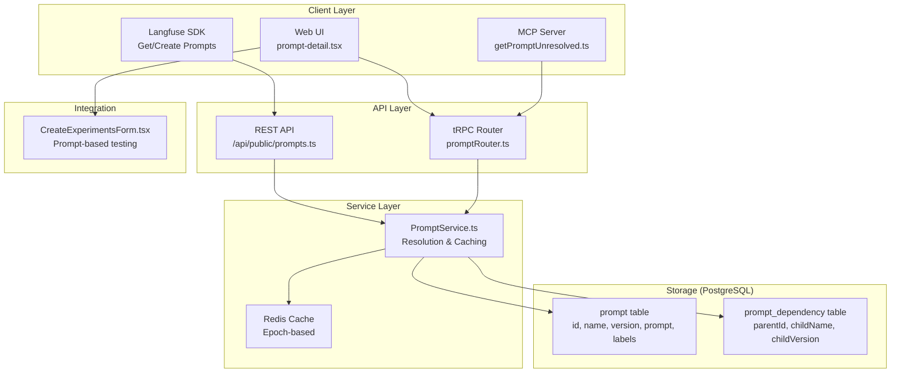
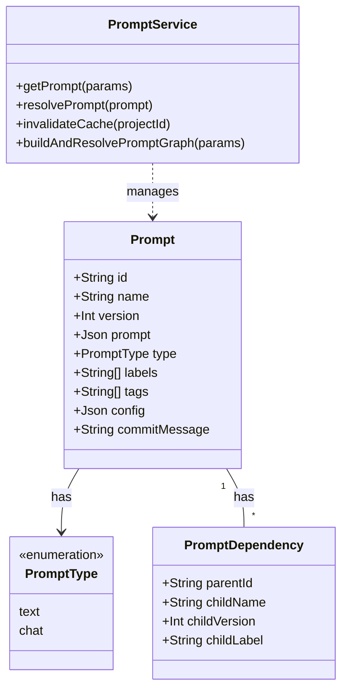
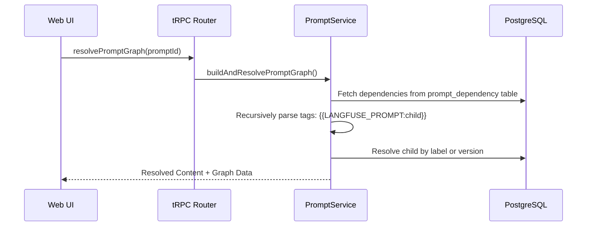

# Prompts & Templates

관련 소스 파일

이 위키 페이지를 생성하기 위한 컨텍스트로 다음 파일들이 사용되었습니다.

- [packages/shared/prisma/migrations/20250128163035_add_nullable_commit_message_prompts/migration.sql](packages/shared/prisma/migrations/20250128163035_add_nullable_commit_message_prompts/migration.sql)
- [packages/shared/src/features/prompts/types.ts](packages/shared/src/features/prompts/types.ts)
- [packages/shared/src/server/dataset-run-items/addToDeleteQueue.ts](packages/shared/src/server/dataset-run-items/addToDeleteQueue.ts)
- [packages/shared/src/server/redis/datasetDelete.ts](packages/shared/src/server/redis/datasetDelete.ts)
- [packages/shared/src/server/services/PromptService/index.ts](packages/shared/src/server/services/PromptService/index.ts)
- [packages/shared/src/server/services/PromptService/types.ts](packages/shared/src/server/services/PromptService/types.ts)
- [web/src/__tests__/server/promptCache.servertest.ts](web/src/__tests__/server/promptCache.servertest.ts)
- [web/src/components/ActionButton.tsx](web/src/components/ActionButton.tsx)
- [web/src/components/DiffViewer.tsx](web/src/components/DiffViewer.tsx)
- [web/src/components/TruncatedLabels.tsx](web/src/components/TruncatedLabels.tsx)
- [web/src/components/layouts/doc-popup.tsx](web/src/components/layouts/doc-popup.tsx)
- [web/src/components/session/index.tsx](web/src/components/session/index.tsx)
- [web/src/components/table/data-table.tsx](web/src/components/table/data-table.tsx)
- [web/src/components/table/use-cases/observations.tsx](web/src/components/table/use-cases/observations.tsx)
- [web/src/components/table/use-cases/scores.tsx](web/src/components/table/use-cases/scores.tsx)
- [web/src/components/table/use-cases/sessions.tsx](web/src/components/table/use-cases/sessions.tsx)
- [web/src/components/table/use-cases/traces.tsx](web/src/components/table/use-cases/traces.tsx)
- [web/src/components/ui/input-command.tsx](web/src/components/ui/input-command.tsx)
- [web/src/features/annotation-queues/components/AnnotationQueueItemsTable.tsx](web/src/features/annotation-queues/components/AnnotationQueueItemsTable.tsx)
- [web/src/features/annotation-queues/components/AnnotationQueuesTable.tsx](web/src/features/annotation-queues/components/AnnotationQueuesTable.tsx)
- [web/src/features/automations/components/DeleteAutomationButton.tsx](web/src/features/automations/components/DeleteAutomationButton.tsx)
- [web/src/features/datasets/components/DatasetAnalytics.tsx](web/src/features/datasets/components/DatasetAnalytics.tsx)
- [web/src/features/datasets/components/DeleteDatasetRunButton.tsx](web/src/features/datasets/components/DeleteDatasetRunButton.tsx)
- [web/src/features/evals/hooks/useEvalConfigMappingData.ts](web/src/features/evals/hooks/useEvalConfigMappingData.ts)
- [web/src/features/events/components/EventsTable.tsx](web/src/features/events/components/EventsTable.tsx)
- [web/src/features/experiments/components/table/ExperimentItemsTable.tsx](web/src/features/experiments/components/table/ExperimentItemsTable.tsx)
- [web/src/features/experiments/components/table/ExperimentsTable.tsx](web/src/features/experiments/components/table/ExperimentsTable.tsx)
- [web/src/features/mcp/features/prompts/index.ts](web/src/features/mcp/features/prompts/index.ts)
- [web/src/features/mcp/features/prompts/tools/getPrompt.ts](web/src/features/mcp/features/prompts/tools/getPrompt.ts)
- [web/src/features/mcp/features/prompts/tools/getPromptUnresolved.ts](web/src/features/mcp/features/prompts/tools/getPromptUnresolved.ts)
- [web/src/features/mcp/features/prompts/tools/promptReadToolFactory.ts](web/src/features/mcp/features/prompts/tools/promptReadToolFactory.ts)
- [web/src/features/navigate-detail-pages/DetailPageNav.tsx](web/src/features/navigate-detail-pages/DetailPageNav.tsx)
- [web/src/features/prompts/components/NewPromptForm/ReviewPromptDialog.tsx](web/src/features/prompts/components/NewPromptForm/ReviewPromptDialog.tsx)
- [web/src/features/prompts/components/NewPromptForm/index.tsx](web/src/features/prompts/components/NewPromptForm/index.tsx)
- [web/src/features/prompts/components/NewPromptForm/validation.ts](web/src/features/prompts/components/NewPromptForm/validation.ts)
- [web/src/features/prompts/components/PromptSelectionDialog.tsx](web/src/features/prompts/components/PromptSelectionDialog.tsx)
- [web/src/features/prompts/components/PromptVersionDiffDialog.tsx](web/src/features/prompts/components/PromptVersionDiffDialog.tsx)
- [web/src/features/prompts/components/SetPromptVersionLabels/index.tsx](web/src/features/prompts/components/SetPromptVersionLabels/index.tsx)
- [web/src/features/prompts/components/delete-prompt-version.tsx](web/src/features/prompts/components/delete-prompt-version.tsx)
- [web/src/features/prompts/components/delete-prompt.tsx](web/src/features/prompts/components/delete-prompt.tsx)
- [web/src/features/prompts/components/prompt-detail.tsx](web/src/features/prompts/components/prompt-detail.tsx)
- [web/src/features/prompts/components/prompt-history.tsx](web/src/features/prompts/components/prompt-history.tsx)
- [web/src/features/prompts/components/prompts-table.tsx](web/src/features/prompts/components/prompts-table.tsx)
- [web/src/features/prompts/server/actions/createPrompt.ts](web/src/features/prompts/server/actions/createPrompt.ts)
- [web/src/features/prompts/server/actions/deletePrompt.ts](web/src/features/prompts/server/actions/deletePrompt.ts)
- [web/src/features/prompts/server/actions/getPromptByName.ts](web/src/features/prompts/server/actions/getPromptByName.ts)
- [web/src/features/prompts/server/handlers/promptNameHandler.ts](web/src/features/prompts/server/handlers/promptNameHandler.ts)
- [web/src/features/prompts/server/routers/promptRouter.ts](web/src/features/prompts/server/routers/promptRouter.ts)
- [web/src/features/scores/components/multi-select-key-values.tsx](web/src/features/scores/components/multi-select-key-values.tsx)
- [web/src/features/tag/components/TagCommandItem.tsx](web/src/features/tag/components/TagCommandItem.tsx)
- [web/src/features/telemetry/index.ts](web/src/features/telemetry/index.ts)
- [web/src/pages/api/public/projects/[projectId]/apiKeys/[apiKeyId].ts](web/src/pages/api/public/projects/[projectId]/apiKeys/[apiKeyId].ts)
- [web/src/pages/api/public/projects/[projectId]/apiKeys/index.ts](web/src/pages/api/public/projects/[projectId]/apiKeys/index.ts)
- [web/src/pages/api/public/prompts.ts](web/src/pages/api/public/prompts.ts)
- [web/src/pages/project/[projectId]/datasets/[datasetId]/index.tsx](web/src/pages/project/[projectId]/datasets/[datasetId]/index.tsx)
- [web/src/pages/project/[projectId]/datasets/[datasetId]/runs/[runId].tsx](web/src/pages/project/[projectId]/datasets/[datasetId]/runs/[runId].tsx)
- [web/src/pages/project/[projectId]/prompts/[[...folder]].tsx](web/src/pages/project/[projectId]/prompts/[[...folder]].tsx)
- [web/src/pages/project/[projectId]/prompts/metrics.tsx](web/src/pages/project/[projectId]/prompts/metrics.tsx)
- [web/src/utils/string.ts](web/src/utils/string.ts)

이 문서는 Langfuse의 prompt management system을 설명합니다. Prompt는 versioning되는 template(text 또는 chat format)이며, folder로 구성하고 deployment를 위해 label을 붙이며 observation 전반의 usage를 추적할 수 있습니다. 이 system은 recursive prompt dependency, access control을 위한 protected label, epoch 기반 Redis caching strategy를 지원합니다.

---

## System Architecture

prompt management system은 metadata와 versioning을 위한 PostgreSQL storage, Redis caching을 포함한 service layer, 이중 API surface(REST와 tRPC), folder 기반 UI로 구성됩니다.

### High-Level Component Diagram

**출처:**
- [web/src/features/prompts/server/routers/promptRouter.ts:75-101]()
- [web/src/features/prompts/components/prompt-detail.tsx:109-142]()
- [packages/shared/src/server/services/PromptService/index.ts:20-45]()
- [web/src/features/mcp/features/prompts/tools/getPromptUnresolved.ts:10-25]()

---

## Data Model

Prompt는 PostgreSQL에 저장됩니다. 각 record는 prompt의 특정 version을 나타냅니다. `PromptService`는 lifecycle event의 primary orchestrator 역할을 합니다.

### Code Entity Association

**Key Characteristics:**

| Field | Type | Description |
|-------|------|-------------|
| `name` | `string` | project 안의 unique identifier입니다. folder path를 지원합니다(예: `folder/prompt-name`) [web/src/features/prompts/components/prompt-detail.tsx:116-120](). |
| `version` | `number` | prompt name별 auto-incrementing integer입니다 [web/src/features/prompts/components/prompt-detail.tsx:121-124](). |
| `type` | `PromptType` | `text` 또는 `chat`입니다 [web/src/features/prompts/server/actions/createPrompt.ts:78-78](). |
| `labels` | `string[]` | deployment target입니다(예: `production`). `SetPromptVersionLabels`를 통해 관리됩니다 [web/src/features/prompts/components/SetPromptVersionLabels/index.tsx:30-46](). |
| `tags` | `string[]` | prompt의 모든 version에 걸쳐 일관적인 organizational tag입니다 [web/src/features/prompts/server/actions/createPrompt.ts:186-200](). |
| `config` | `json` | model parameter(temperature, max_tokens)와 metadata입니다 [web/src/features/prompts/server/actions/createPrompt.ts:153-153](). |
| `commitMessage` | `string` | 특정 version의 change에 대한 optional description입니다 [web/src/features/prompts/server/actions/createPrompt.ts:154-154](). |

**출처:**
- [web/src/features/prompts/components/prompt-detail.tsx:155-163]()
- [web/src/features/prompts/server/actions/createPrompt.ts:74-115]()
- [web/src/features/prompts/components/SetPromptVersionLabels/index.tsx:59-65]()

---

## Prompt Resolution & Caching

`PromptService`는 올바른 prompt version을 찾고 dependency를 resolve하는 logic을 처리합니다.

### Resolution Logic
1. **By Version**: 특정 integer version을 fetch합니다 [web/src/features/prompts/components/prompt-detail.tsx:155-158]().
2. **By Label**: 특정 label(예: `production`)이 tag된 version을 fetch합니다. 새로 생성된 prompt에는 자동으로 `latest` label이 붙습니다 [web/src/features/prompts/server/actions/createPrompt.ts:110-110]().
3. **Unresolved vs Resolved**: UI는 `resolutionMode` state를 사용해 `tagged`(raw template)와 `resolved`(nested dependency가 replace됨) mode 사이를 toggle할 수 있습니다 [web/src/features/prompts/components/prompt-detail.tsx:136-138]().

### Epoch-based Caching
distributed node 전반에서 consistency를 보장하기 위해 Langfuse는 Redis에서 "Epoch" strategy를 사용합니다.
- **Cache Key Generation**: key에는 namespace를 isolate하기 위한 project-specific epoch token이 포함됩니다 [packages/shared/src/server/services/PromptService/index.ts:192-206]().
- **Invalidation**: Redis에서 cache epoch를 rotate하면 이후 모든 lookup이 namespace를 새로 사용하므로, successful database commit 이후 old entry가 사실상 invalidated됩니다 [packages/shared/src/server/services/PromptService/index.ts:177-190]().

**출처:**
- [web/src/features/prompts/server/actions/createPrompt.ts:208-209]()
- [packages/shared/src/server/services/PromptService/index.ts:47-79]()
- [packages/shared/src/server/services/PromptService/index.ts:214-232]()

---

## Prompt Dependencies

Langfuse는 recursive prompt template을 지원합니다. prompt는 `{{LANGFUSE_PROMPT:name}}` syntax를 사용해 다른 prompt를 include할 수 있습니다.

### Dependency Graph Resolution
system은 `ResolvedPromptGraph`를 구성하기 위해 recursive search를 수행합니다. dependency는 `PromptDependency` table에 저장되어 parent version을 child에 name과 특정 version 또는 label로 linking합니다 [web/src/features/prompts/server/actions/createPrompt.ts:157-168]().

**출처:**
- [web/src/features/prompts/server/actions/createPrompt.ts:117-139]()
- [web/src/features/prompts/components/prompt-detail.tsx:165-173]()
- [packages/shared/src/server/services/PromptService/index.ts:234-252]()

---

## ChatPrompt vs TextPrompt

system은 두 가지 primary prompt format을 처리합니다. `ChatPrompt`는 특히 chat completion model을 위해 설계되었습니다.

| Feature | `TextPrompt` | `ChatPrompt` |
|---------|--------------|--------------|
| **Data Type** | `string` | `Array<ChatMessage>` |
| **Structure** | 단일 template string | message list(System, User, Assistant, Tool) |
| **Validation** | string validation | `ChatMlArraySchema` [web/src/features/prompts/components/prompt-detail.tsx:35-35]() |
| **UI Editor** | `CodeMirrorEditor` | `PromptChatMessages` component [web/src/features/prompts/components/NewPromptForm/index.tsx:34-34]() |

### Variable & Placeholder Extraction
`ChatPrompt`의 경우 variable(예: `{{name}}`)과 placeholder(예: `{{chat_history}}`)는 `extractVariables`를 사용해 모든 message content에서 추출됩니다 [web/src/features/prompts/components/NewPromptForm/index.tsx:105-109](). system은 명확한 resolution을 보장하기 위해 이 두 type 사이의 naming collision을 방지합니다 [web/src/features/prompts/server/actions/createPrompt.ts:98-108]().

**출처:**
- [web/src/features/prompts/components/prompt-detail.tsx:175-189]()
- [web/src/features/prompts/server/actions/createPrompt.ts:52-72]()
- [web/src/features/prompts/components/NewPromptForm/index.tsx:34-34]()

---

## Folder Organization & UI

### Folders
Prompt는 path 기반 naming convention(예: `marketing/emails/welcome`)을 사용해 구성할 수 있습니다. `PromptTable`은 directory structure를 렌더링하고 `currentFolderPath`를 통해 navigation을 관리하기 위해 `promptRouter.ts`가 반환하는 `row_type: "folder" | "prompt"` metadata를 사용합니다 [web/src/features/prompts/components/prompts-table.tsx:158-176]().

### Metrics & Monitoring
Prompt usage는 ClickHouse event를 통해 추적됩니다. `PromptTable` component는 core prompt metadata와 `api.prompts.metrics.useQuery`를 통해 fetch된 usage metric을 join합니다 [web/src/features/prompts/components/prompts-table.tsx:122-140](). metric에는 다음이 포함됩니다.
- **Observation Count**: prompt를 사용하는 generation/span의 total number [web/src/features/prompts/components/prompts-table.tsx:189-189]().
- **Latency & Scores**: prompt version에 대한 aggregated performance metric [web/src/features/prompts/server/routers/promptRouter.ts:36-37]().

### Comparison & Diffing
`PromptVersionDiffDialog`는 사용자가 prompt의 두 version을 비교하고 template content와 JSON configuration 양쪽의 change를 highlight할 수 있게 합니다 [web/src/features/prompts/components/prompt-history.tsx:154-164]().

**출처:**
- [web/src/features/prompts/server/routers/promptRouter.ts:141-164]()
- [web/src/features/prompts/components/prompts-table.tsx:147-156]()

---

## LLM Schemas & Tools

Langfuse는 **Playground**와 **Automated Evaluations**에서 활용되는 LLM interaction을 위한 structured definition을 지원합니다.

### LLM Tools
재사용 가능한 tool definition(예: function calling을 위한 JSON schema)은 prompt에 linked되거나 playground에서 독립적으로 사용될 수 있습니다. 이러한 definition은 model output이 특정 structure로 constrained되도록 보장합니다. system은 observation table에서 `toolDefinitions`와 `toolCalls`를 추적합니다 [web/src/components/table/use-cases/observations.tsx:134-135]().

### Playground Integration
Playground를 통해 developer는 다음을 할 수 있습니다.
- real-time variable injection으로 prompt를 test합니다 [web/src/features/prompts/components/NewPromptForm/index.tsx:105-109]().
- prompt의 `config` field에 저장되는 model parameter(temperature, top_p)를 configure합니다 [web/src/features/prompts/components/NewPromptForm/index.tsx:153-153]().
- project에 정의된 structured schema를 사용해 tool call을 simulate합니다. lookup은 종종 `usePlaygroundCache`를 통해 cache되거나 restore됩니다 [web/src/features/prompts/components/NewPromptForm/index.tsx:188-190]().

### Automated Evaluations
Prompt template은 LLM-as-a-judge workflow에서 "judge"로 자주 사용됩니다. `CreateExperimentsForm`은 dataset input을 prompt variable에 mapping하여 이러한 evaluation 실행을 용이하게 합니다 [web/src/features/prompts/components/prompt-detail.tsx:46-46](). 이는 `RunEvaluationDialog`를 통해 또는 experiment creation 중 trigger됩니다 [web/src/pages/project/[projectId]/datasets/[datasetId]/index.tsx:195-197]().

**출처:**
- [web/src/features/prompts/components/NewPromptForm/index.tsx:129-154]()
- [web/src/components/table/use-cases/observations.tsx:134-135]()
- [web/src/pages/project/[projectId]/datasets/[datasetId]/index.tsx:181-197]()
